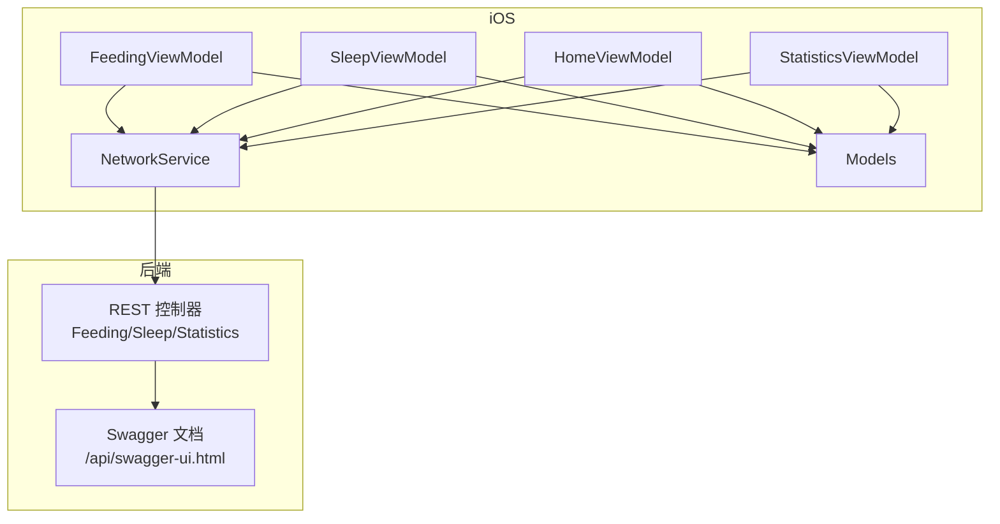
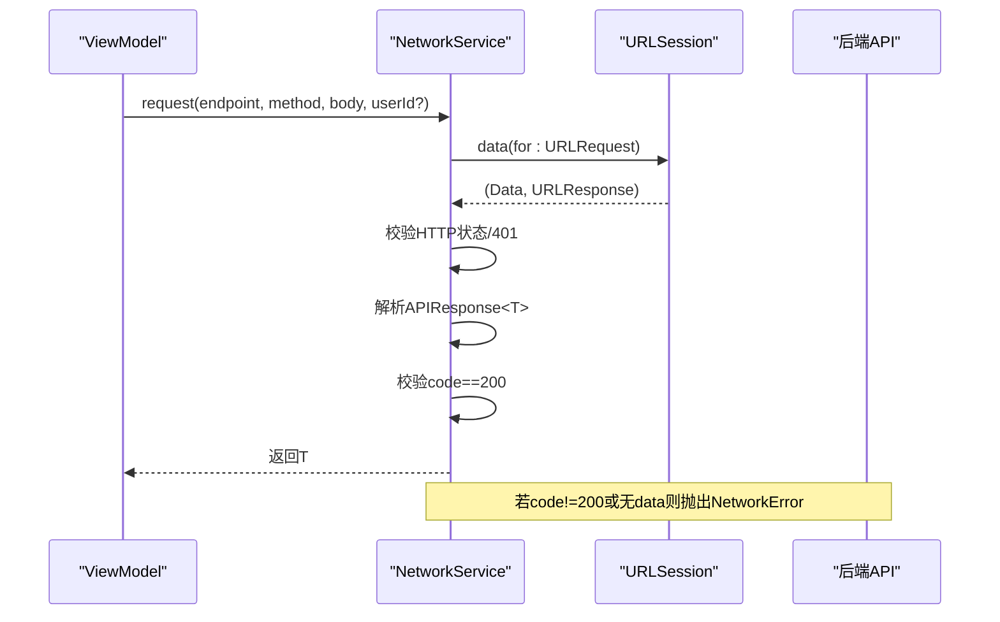
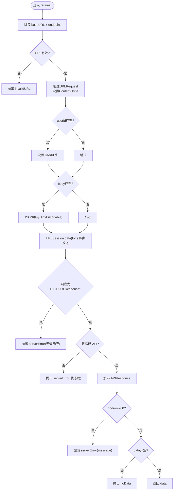
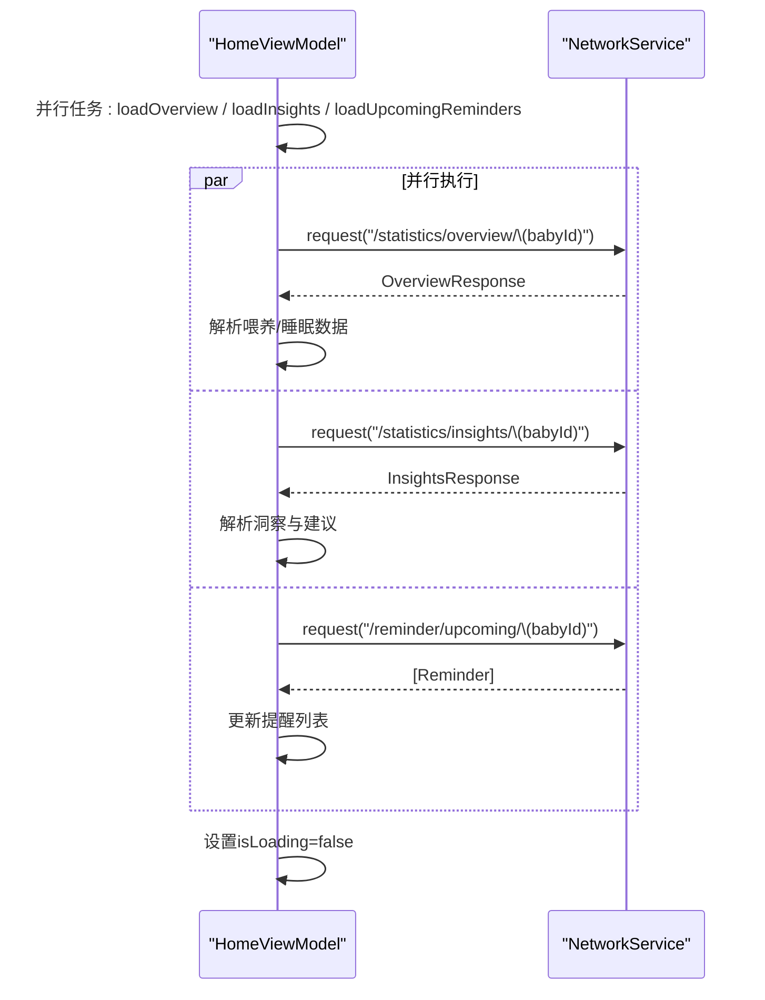
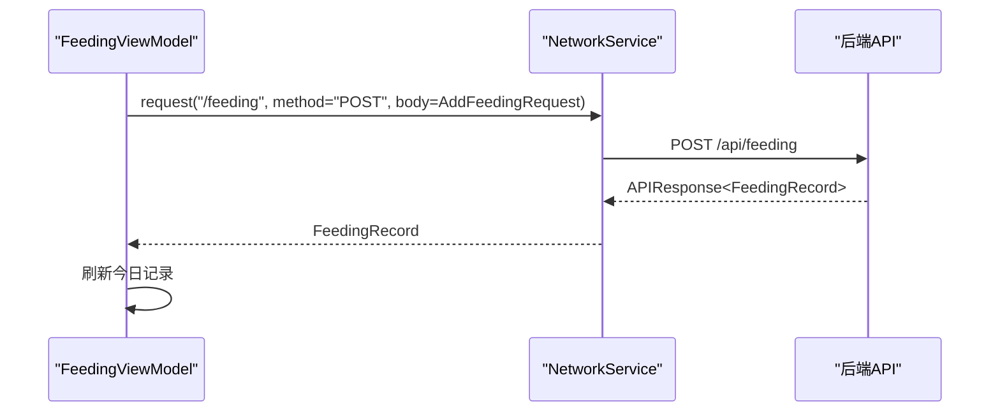
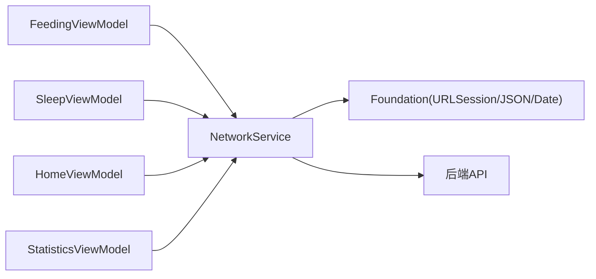

# API客户端实现

<cite>
**本文引用的文件**
- [NetworkService.swift](file://ios/BabyFeedingReminder/Services/NetworkService.swift)
- [FeedingViewModel.swift](file://ios/BabyFeedingReminder/ViewModels/FeedingViewModel.swift)
- [SleepViewModel.swift](file://ios/BabyFeedingReminder/ViewModels/SleepViewModel.swift)
- [HomeViewModel.swift](file://ios/BabyFeedingReminder/ViewModels/HomeViewModel.swift)
- [StatisticsViewModel.swift](file://ios/BabyFeedingReminder/ViewModels/StatisticsViewModel.swift)
- [Models.swift](file://ios/BabyFeedingReminder/Models/Models.swift)
- [README.md](file://README.md)
- [nginx.conf](file://nginx/nginx.conf)
- [SecurityConfig.java](file://backend/src/main/java/com/baby/config/SecurityConfig.java)
- [.env.example](file://.env.example)
</cite>

## 目录
1. [简介](#简介)
2. [项目结构](#项目结构)
3. [核心组件](#核心组件)
4. [架构总览](#架构总览)
5. [详细组件分析](#详细组件分析)
6. [依赖关系分析](#依赖关系分析)
7. [性能考量](#性能考量)
8. [故障排查指南](#故障排查指南)
9. [结论](#结论)
10. [附录](#附录)

## 简介
本文件面向iOS前端团队，系统性梳理NetworkService的REST通信实现与集成模式，覆盖请求构造、认证头、JSON序列化/反序列化、响应解析、错误处理、超时与重试策略、安全与HTTPS、以及与各ViewModel的协作流程。同时给出新增API调用的实施指南、性能优化建议与调试方法。

## 项目结构
- iOS端采用MVVM架构，网络层由NetworkService统一提供，ViewModel通过其发起REST调用，Model负责数据结构映射。
- 后端提供Swagger接口文档，iOS端按接口清单进行调用；生产环境通过Nginx代理并可启用HTTPS。

**章节来源**
- [README.md](file://README.md#L166-L170)
- [NetworkService.swift](file://ios/BabyFeedingReminder/Services/NetworkService.swift#L38-L45)
- [nginx.conf](file://nginx/nginx.conf#L53-L78)

## 核心组件
- NetworkService：封装URLSession请求、统一JSON编解码、响应包装解析、错误类型与HTTP状态处理、请求超时控制、可选userId头注入。
- 各ViewModel：以各自领域模型驱动调用，封装参数构造与结果回填，提供并行加载与本地降级策略。
- Models：与后端API响应/请求体保持一致的Codable结构，便于序列化与反序列化。

**章节来源**
- [NetworkService.swift](file://ios/BabyFeedingReminder/Services/NetworkService.swift#L9-L27)
- [NetworkService.swift](file://ios/BabyFeedingReminder/Services/NetworkService.swift#L89-L138)
- [Models.swift](file://ios/BabyFeedingReminder/Models/Models.swift#L1-L196)

## 架构总览
NetworkService作为单一网络入口，对所有REST调用进行标准化处理，确保：
- 请求头统一：Content-Type为application/json，可选userId头。
- 响应包装：后端统一返回包含code/message/data的结构，NetworkService解析并校验code=200。
- 错误处理：针对无效URL、无数据、解码失败、服务器错误、未授权等进行明确分类。
- 时间控制：请求超时默认30秒，避免阻塞UI线程。
- 日期编解码：统一使用Asia/Shanghai时区与多种常见格式，提升兼容性。

**图表来源**
- [NetworkService.swift](file://ios/BabyFeedingReminder/Services/NetworkService.swift#L89-L138)

**章节来源**
- [NetworkService.swift](file://ios/BabyFeedingReminder/Services/NetworkService.swift#L46-L49)
- [NetworkService.swift](file://ios/BabyFeedingReminder/Services/NetworkService.swift#L52-L85)
- [NetworkService.swift](file://ios/BabyFeedingReminder/Services/NetworkService.swift#L101-L111)
- [NetworkService.swift](file://ios/BabyFeedingReminder/Services/NetworkService.swift#L113-L138)

## 详细组件分析

### NetworkService：REST请求与响应处理
- 基础URL：Debug模式指向http://localhost:8080/api，Release模式指向https://api.babyfeedingreminder.com/api。
- URLSession：默认超时30秒，避免长时间阻塞。
- JSON编解码：日期解码尝试多种格式并指定Asia/Shanghai时区；日期编码固定为“yyyy-MM-dd'T'HH:mm:ss”。
- 通用请求方法：request<T>返回泛型数据；requestVoid用于无返回体的删除/更新等操作。
- 错误类型：invalidURL、noData、decodingError、serverError、unauthorized。
- 响应包装：后端统一返回APIResponse<T>，NetworkService解析并校验code=200，否则抛错；若data为空也抛错。

**图表来源**
- [NetworkService.swift](file://ios/BabyFeedingReminder/Services/NetworkService.swift#L89-L138)

**章节来源**
- [NetworkService.swift](file://ios/BabyFeedingReminder/Services/NetworkService.swift#L38-L45)
- [NetworkService.swift](file://ios/BabyFeedingReminder/Services/NetworkService.swift#L46-L49)
- [NetworkService.swift](file://ios/BabyFeedingReminder/Services/NetworkService.swift#L52-L85)
- [NetworkService.swift](file://ios/BabyFeedingReminder/Services/NetworkService.swift#L89-L138)
- [NetworkService.swift](file://ios/BabyFeedingReminder/Services/NetworkService.swift#L140-L181)

### ViewModel集成模式：以HomeViewModel为例
- 并行加载：使用async/await并行拉取概览、洞察、提醒，减少总等待时间。
- 错误降级：捕获异常后清空或填充默认值，并打印日志以便定位问题。
- 数据绑定：将后端返回映射到ViewModel的@Published属性，驱动界面刷新。

**图表来源**
- [HomeViewModel.swift](file://ios/BabyFeedingReminder/ViewModels/HomeViewModel.swift#L52-L66)
- [HomeViewModel.swift](file://ios/BabyFeedingReminder/ViewModels/HomeViewModel.swift#L69-L100)
- [HomeViewModel.swift](file://ios/BabyFeedingReminder/ViewModels/HomeViewModel.swift#L102-L120)
- [HomeViewModel.swift](file://ios/BabyFeedingReminder/ViewModels/HomeViewModel.swift#L121-L133)

**章节来源**
- [HomeViewModel.swift](file://ios/BabyFeedingReminder/ViewModels/HomeViewModel.swift#L52-L66)
- [HomeViewModel.swift](file://ios/BabyFeedingReminder/ViewModels/HomeViewModel.swift#L69-L100)
- [HomeViewModel.swift](file://ios/BabyFeedingReminder/ViewModels/HomeViewModel.swift#L102-L120)
- [HomeViewModel.swift](file://ios/BabyFeedingReminder/ViewModels/HomeViewModel.swift#L121-L133)

### CRUD操作与协议示例（喂养、睡眠、统计）

- 喂养记录（FeedingViewModel）
  - 新增：POST /api/feeding，请求体为AddFeedingRequest，返回FeedingRecord。
  - 更新：PUT /api/feeding/{id}，请求体为UpdateFeedingRequest。
  - 删除：DELETE /api/feeding/{id}，无返回体。
  - 查询：GET /api/feeding/today/{babyId}，返回数组。

- 睡眠记录（SleepViewModel）
  - 开始小睡：POST /api/sleep/start/{babyId}。
  - 结束小睡：POST /api/sleep/end/{id}?quality={int}。
  - 手动添加：POST /api/sleep/add，请求体为AddSleepRecordRequest。
  - 更新/删除：PUT /api/sleep/{id}，DELETE /api/sleep/{id}。
  - 查询：GET /api/sleep/today/{babyId}。

- 统计分析（StatisticsViewModel）
  - 今日概览：GET /api/statistics/overview/{babyId}。
  - 智能洞察：GET /api/statistics/insights/{babyId}。
  - 喂养统计：GET /api/statistics/feeding/{babyId}?startDate=YYYY-MM-DD&endDate=YYYY-MM-DD。
  - 睡眠统计：GET /api/statistics/sleep/{babyId}?startDate=YYYY-MM-DD&endDate=YYYY-MM-DD。

**图表来源**
- [FeedingViewModel.swift](file://ios/BabyFeedingReminder/ViewModels/FeedingViewModel.swift#L98-L147)
- [README.md](file://README.md#L214-L248)

**章节来源**
- [FeedingViewModel.swift](file://ios/BabyFeedingReminder/ViewModels/FeedingViewModel.swift#L62-L96)
- [FeedingViewModel.swift](file://ios/BabyFeedingReminder/ViewModels/FeedingViewModel.swift#L98-L147)
- [FeedingViewModel.swift](file://ios/BabyFeedingReminder/ViewModels/FeedingViewModel.swift#L149-L200)
- [FeedingViewModel.swift](file://ios/BabyFeedingReminder/ViewModels/FeedingViewModel.swift#L201-L216)
- [SleepViewModel.swift](file://ios/BabyFeedingReminder/ViewModels/SleepViewModel.swift#L39-L82)
- [SleepViewModel.swift](file://ios/BabyFeedingReminder/ViewModels/SleepViewModel.swift#L84-L114)
- [SleepViewModel.swift](file://ios/BabyFeedingReminder/ViewModels/SleepViewModel.swift#L116-L142)
- [SleepViewModel.swift](file://ios/BabyFeedingReminder/ViewModels/SleepViewModel.swift#L144-L196)
- [SleepViewModel.swift](file://ios/BabyFeedingReminder/ViewModels/SleepViewModel.swift#L198-L250)
- [SleepViewModel.swift](file://ios/BabyFeedingReminder/ViewModels/SleepViewModel.swift#L251-L266)
- [StatisticsViewModel.swift](file://ios/BabyFeedingReminder/ViewModels/StatisticsViewModel.swift#L125-L144)
- [StatisticsViewModel.swift](file://ios/BabyFeedingReminder/ViewModels/StatisticsViewModel.swift#L172-L200)
- [README.md](file://README.md#L214-L248)

### 错误处理策略
- 无效URL：抛出invalidURL。
- 无数据：抛出noData。
- 解码失败：抛出decodingError。
- 服务器错误：抛出serverError(status或message)。
- 未授权：抛出unauthorized（401）。
- ViewModel侧：捕获错误后可回退到本地模拟数据或默认值，同时设置errorMessage，保证用户体验。

**章节来源**
- [NetworkService.swift](file://ios/BabyFeedingReminder/Services/NetworkService.swift#L11-L27)
- [NetworkService.swift](file://ios/BabyFeedingReminder/Services/NetworkService.swift#L113-L138)
- [FeedingViewModel.swift](file://ios/BabyFeedingReminder/ViewModels/FeedingViewModel.swift#L70-L96)
- [SleepViewModel.swift](file://ios/BabyFeedingReminder/ViewModels/SleepViewModel.swift#L46-L82)
- [StatisticsViewModel.swift](file://ios/BabyFeedingReminder/ViewModels/StatisticsViewModel.swift#L147-L171)

### 超时管理与重试机制
- 超时：URLSessionConfiguration默认timeoutIntervalForRequest=30秒，避免长时间阻塞。
- 重试：当前实现未内置自动重试；建议在ViewModel层对关键写操作（新增/更新/删除）进行幂等设计与必要时的手动重试提示。

**章节来源**
- [NetworkService.swift](file://ios/BabyFeedingReminder/Services/NetworkService.swift#L46-L49)

### 安全与HTTPS
- HTTPS：baseURL在Release模式下使用https://，建议生产环境通过Nginx强制HTTPS。
- 证书：Nginx配置示例展示了HTTPS监听与证书路径占位，需按生产环境部署。
- 认证：NetworkService未内置Token头注入，但提供了userId头字段；后端安全配置当前开发阶段对所有接口开放，生产需完善鉴权策略。

**章节来源**
- [NetworkService.swift](file://ios/BabyFeedingReminder/Services/NetworkService.swift#L40-L44)
- [nginx.conf](file://nginx/nginx.conf#L61-L78)
- [SecurityConfig.java](file://backend/src/main/java/com/baby/config/SecurityConfig.java#L25-L41)
- [.env.example](file://.env.example#L1-L12)

### 新增API调用实施指南
- 步骤
  1) 在Models中新增或复用Codable模型，确保与后端DTO一致。
  2) 在ViewModel中新增方法，构造请求体（如Encodable），调用NetworkService.request或requestVoid。
  3) 在ViewModel中处理错误与本地降级（如模拟数据）。
  4) 在View中订阅ViewModel的@Published属性，实现UI联动。
- 示例参考
  - 喂养新增：参考FeedingViewModel.addRecord。
  - 睡眠开始/结束：参考SleepViewModel.startNap与endNap。
  - 统计查询：参考StatisticsViewModel.loadFeedingStatistics/loadSleepStatistics。

**章节来源**
- [FeedingViewModel.swift](file://ios/BabyFeedingReminder/ViewModels/FeedingViewModel.swift#L98-L147)
- [SleepViewModel.swift](file://ios/BabyFeedingReminder/ViewModels/SleepViewModel.swift#L84-L114)
- [StatisticsViewModel.swift](file://ios/BabyFeedingReminder/ViewModels/StatisticsViewModel.swift#L172-L200)

## 依赖关系分析
- ViewModel依赖NetworkService进行网络请求，依赖Models进行数据建模。
- NetworkService依赖Foundation（URLSession、JSONDecoder/Encoder、DateFormatter）。
- 后端通过Swagger暴露REST接口，Nginx可作为反向代理与HTTPS终止点。

**图表来源**
- [NetworkService.swift](file://ios/BabyFeedingReminder/Services/NetworkService.swift#L1-L10)
- [FeedingViewModel.swift](file://ios/BabyFeedingReminder/ViewModels/FeedingViewModel.swift#L26-L36)
- [SleepViewModel.swift](file://ios/BabyFeedingReminder/ViewModels/SleepViewModel.swift#L14-L20)
- [HomeViewModel.swift](file://ios/BabyFeedingReminder/ViewModels/HomeViewModel.swift#L50-L56)
- [StatisticsViewModel.swift](file://ios/BabyFeedingReminder/ViewModels/StatisticsViewModel.swift#L104-L110)

**章节来源**
- [README.md](file://README.md#L166-L170)
- [nginx.conf](file://nginx/nginx.conf#L53-L78)

## 性能考量
- 并行加载：ViewModel中使用async/await并行拉取多个接口，显著降低首屏等待时间。
- 本地降级：网络失败时使用模拟数据，保证界面可用性与交互流畅。
- 序列化开销：统一日期格式与时区，减少解析分支与异常重试成本。
- 超时控制：URLSession默认30秒，避免长时间阻塞主线程。
- 建议
  - 对频繁变更的列表采用增量更新策略，减少UI重绘。
  - 对大对象请求考虑分页或范围查询，降低单次负载。
  - 在ViewModel层增加“仅在可见时加载”的策略，避免后台无意义请求。

**章节来源**
- [HomeViewModel.swift](file://ios/BabyFeedingReminder/ViewModels/HomeViewModel.swift#L58-L66)
- [StatisticsViewModel.swift](file://ios/BabyFeedingReminder/ViewModels/StatisticsViewModel.swift#L132-L144)
- [NetworkService.swift](file://ios/BabyFeedingReminder/Services/NetworkService.swift#L46-L49)

## 故障排查指南
- 常见症状与定位
  - 401未授权：检查userId头是否正确传递；确认后端鉴权策略。
  - 500服务器错误：查看后端日志与Swagger接口签名；确认请求体格式。
  - 无数据：检查后端返回code是否为200且data非空。
  - 解码失败：核对日期格式与时区，确保与后端一致。
- 调试建议
  - 在ViewModel中捕获错误并打印localizedDescription，辅助定位。
  - 使用本地模拟数据验证UI渲染与交互逻辑。
  - 如需更深入的网络诊断，可在NetworkService中扩展日志输出（例如记录URL、方法、状态码、耗时）。
- 安全检查
  - 确认Release模式baseURL为HTTPS。
  - 生产环境通过Nginx启用HTTPS与证书校验。

**章节来源**
- [NetworkService.swift](file://ios/BabyFeedingReminder/Services/NetworkService.swift#L113-L138)
- [HomeViewModel.swift](file://ios/BabyFeedingReminder/ViewModels/HomeViewModel.swift#L92-L100)
- [StatisticsViewModel.swift](file://ios/BabyFeedingReminder/ViewModels/StatisticsViewModel.swift#L168-L171)
- [nginx.conf](file://nginx/nginx.conf#L61-L78)

## 结论
NetworkService以简洁统一的方式封装了iOS端与Spring Boot后端的REST通信，配合ViewModel的并行加载与本地降级策略，实现了稳定、可维护且具有良好用户体验的移动端数据流。建议后续在以下方面持续优化：
- 明确鉴权策略与Token头注入方案；
- 在ViewModel层引入可配置的重试与幂等机制；
- 增强网络层日志与指标采集能力；
- 在生产环境完善HTTPS与证书校验。

## 附录
- 接口清单参考：README中的API表格，涵盖喂养、睡眠、统计分析等模块。
- Swagger访问：后端提供Swagger UI页面，便于联调与测试。

**章节来源**
- [README.md](file://README.md#L204-L248)