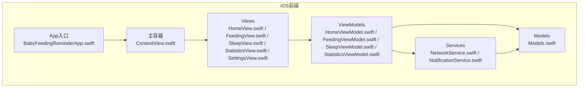
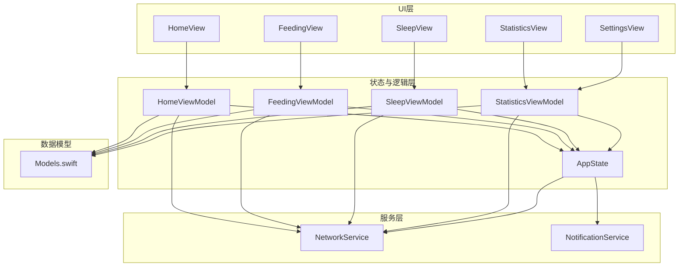
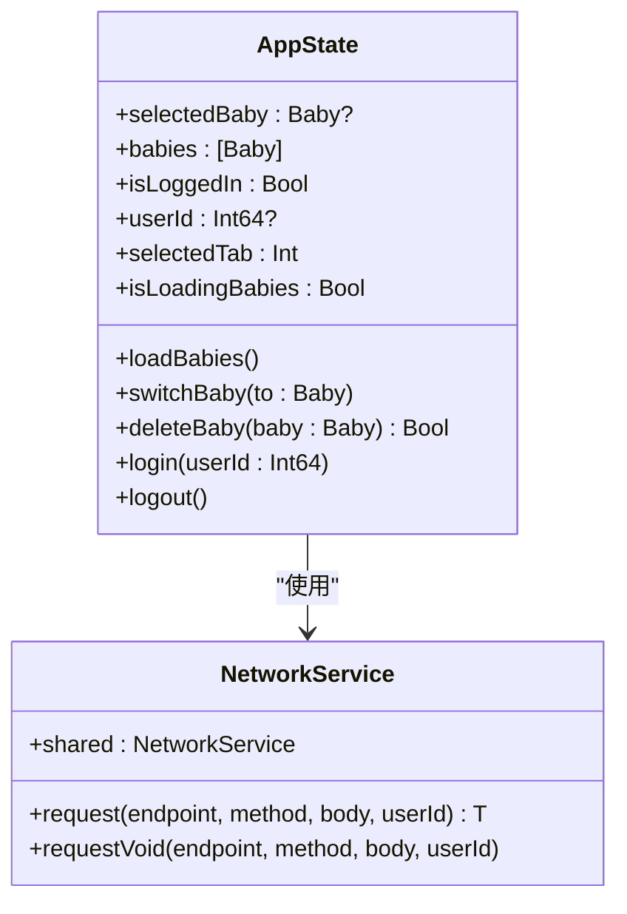
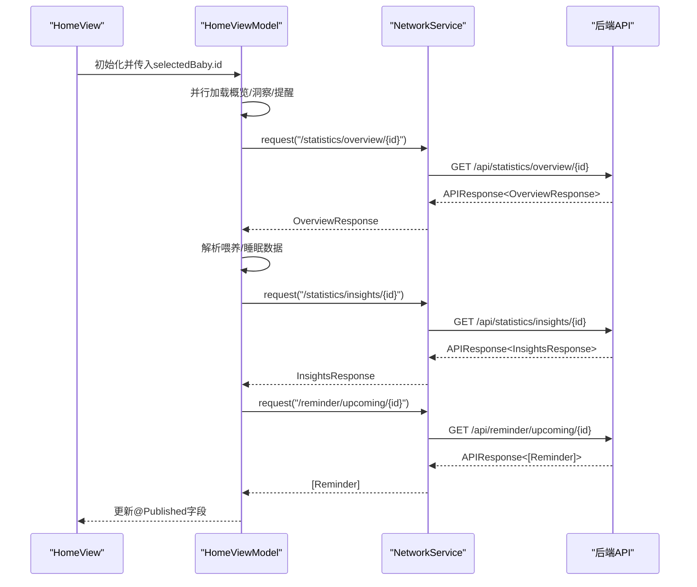
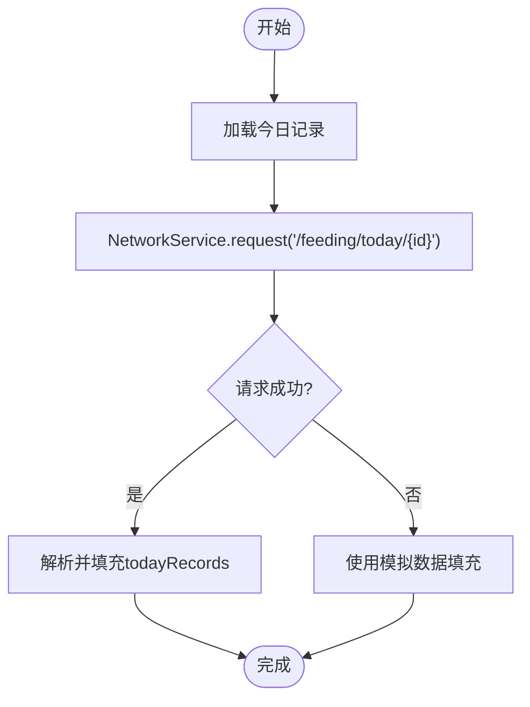
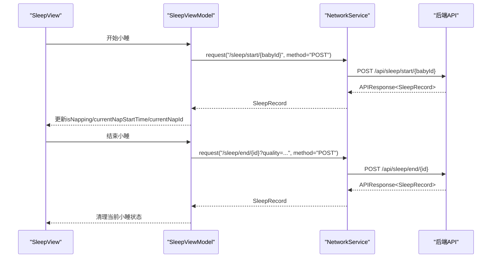
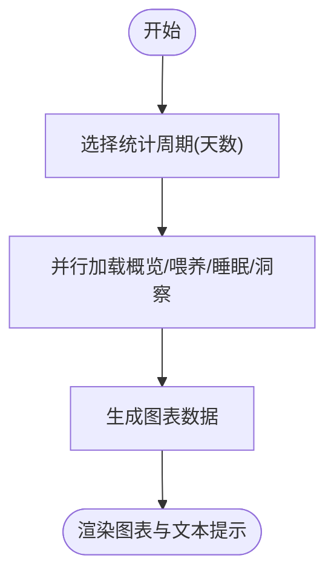
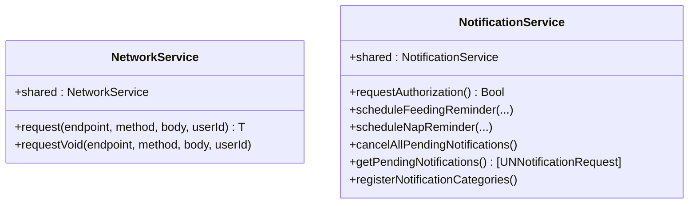
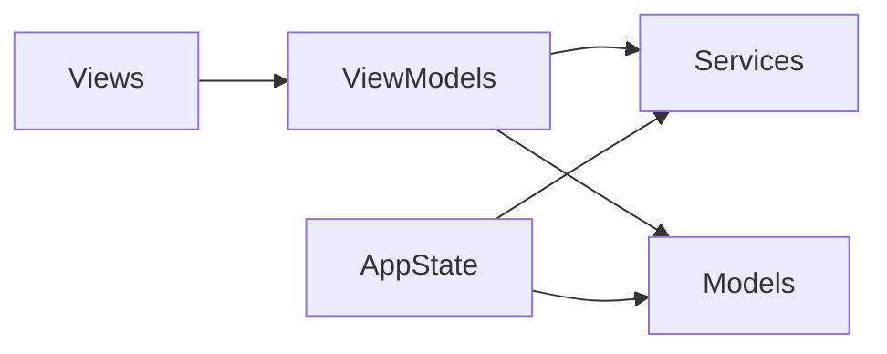
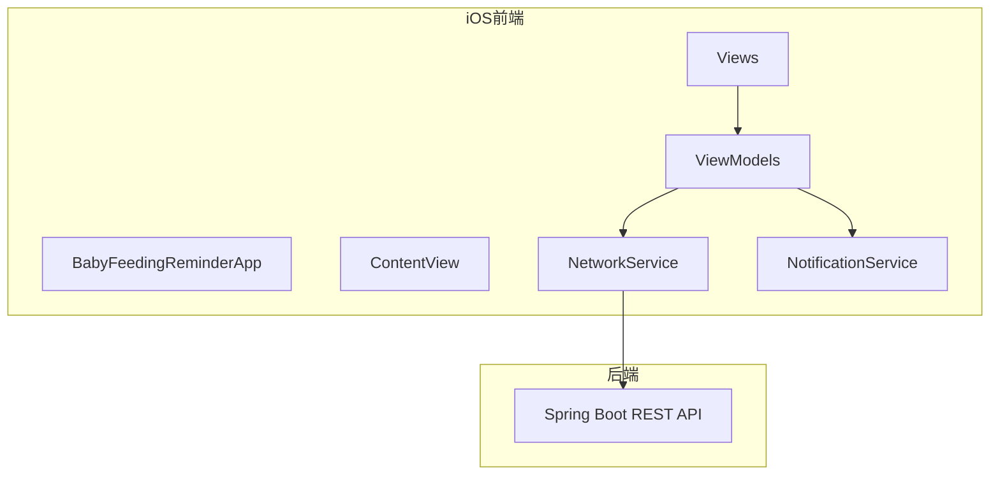

# 前端架构

<cite>
**本文引用的文件**
- [BabyFeedingReminderApp.swift](file://ios/BabyFeedingReminder/BabyFeedingReminderApp.swift)
- [ContentView.swift](file://ios/BabyFeedingReminder/ContentView.swift)
- [HomeView.swift](file://ios/BabyFeedingReminder/Views/HomeView.swift)
- [FeedingView.swift](file://ios/BabyFeedingReminder/Views/FeedingView.swift)
- [SleepView.swift](file://ios/BabyFeedingReminder/Views/SleepView.swift)
- [StatisticsView.swift](file://ios/BabyFeedingReminder/Views/StatisticsView.swift)
- [SettingsView.swift](file://ios/BabyFeedingReminder/Views/SettingsView.swift)
- [HomeViewModel.swift](file://ios/BabyFeedingReminder/ViewModels/HomeViewModel.swift)
- [FeedingViewModel.swift](file://ios/BabyFeedingReminder/ViewModels/FeedingViewModel.swift)
- [SleepViewModel.swift](file://ios/BabyFeedingReminder/ViewModels/SleepViewModel.swift)
- [StatisticsViewModel.swift](file://ios/BabyFeedingReminder/ViewModels/StatisticsViewModel.swift)
- [NetworkService.swift](file://ios/BabyFeedingReminder/Services/NetworkService.swift)
- [NotificationService.swift](file://ios/BabyFeedingReminder/Services/NotificationService.swift)
- [Models.swift](file://ios/BabyFeedingReminder/Models/Models.swift)
- [project.pbxproj](file://ios/BabyFeedingReminder.xcodeproj/project.pbxproj)
- [README.md](file://README.md)
</cite>

## 目录
1. [简介](#简介)
2. [项目结构](#项目结构)
3. [核心组件](#核心组件)
4. [架构总览](#架构总览)
5. [详细组件分析](#详细组件分析)
6. [依赖关系分析](#依赖关系分析)
7. [性能考量](#性能考量)
8. [故障排查指南](#故障排查指南)
9. [结论](#结论)
10. [附录](#附录)

## 简介
本文件面向iOS前端团队，系统性阐述“宝宝喂养提醒”应用的前端架构与实现细节。应用采用SwiftUI + MVVM架构，结合Combine风格的数据流与异步编程，通过NetworkService进行REST API通信，通过NotificationService集成本地通知能力，并以@Published属性驱动状态变更与UI刷新。本文档旨在帮助开发者理解各层职责、交互流程、数据流向以及跨领域关注点（如错误处理与用户体验），并给出系统上下文与关键流程的可视化说明。

## 项目结构
iOS前端采用按层分组的组织方式：
- Models：数据模型与枚举，承载后端返回结构与本地展示所需字段
- Services：网络与通知服务，封装HTTP调用与本地通知
- ViewModels：业务状态与逻辑，负责数据获取、聚合与派发
- Views：UI视图，响应状态变化并触发ViewModel操作

图表来源
- [BabyFeedingReminderApp.swift](file://ios/BabyFeedingReminder/BabyFeedingReminderApp.swift#L1-L164)
- [ContentView.swift](file://ios/BabyFeedingReminder/ContentView.swift#L1-L51)
- [HomeView.swift](file://ios/BabyFeedingReminder/Views/HomeView.swift#L1-L535)
- [FeedingView.swift](file://ios/BabyFeedingReminder/Views/FeedingView.swift#L1-L421)
- [SleepView.swift](file://ios/BabyFeedingReminder/Views/SleepView.swift#L1-L488)
- [StatisticsView.swift](file://ios/BabyFeedingReminder/Views/StatisticsView.swift#L1-L632)
- [SettingsView.swift](file://ios/BabyFeedingReminder/Views/SettingsView.swift#L1-L398)
- [HomeViewModel.swift](file://ios/BabyFeedingReminder/ViewModels/HomeViewModel.swift#L1-L135)
- [FeedingViewModel.swift](file://ios/BabyFeedingReminder/ViewModels/FeedingViewModel.swift#L1-L226)
- [SleepViewModel.swift](file://ios/BabyFeedingReminder/ViewModels/SleepViewModel.swift#L1-L297)
- [StatisticsViewModel.swift](file://ios/BabyFeedingReminder/ViewModels/StatisticsViewModel.swift#L1-L304)
- [NetworkService.swift](file://ios/BabyFeedingReminder/Services/NetworkService.swift#L1-L199)
- [NotificationService.swift](file://ios/BabyFeedingReminder/Services/NotificationService.swift#L1-L151)
- [Models.swift](file://ios/BabyFeedingReminder/Models/Models.swift#L1-L196)

章节来源
- [project.pbxproj](file://ios/BabyFeedingReminder.xcodeproj/project.pbxproj#L122-L171)
- [README.md](file://README.md#L55-L62)

## 核心组件
- App入口与全局状态
  - 应用入口负责注入全局AppState，设置语言环境，启动时加载宝宝数据，并向子视图传递环境对象
  - AppState集中管理用户登录态、宝宝列表、当前选中宝宝、Tab导航状态与加载状态，并封装网络调用与本地缓存
- 视图层
  - ContentView作为Tab容器，承载Home、Feeding、Sleep、Statistics、Settings五个页面
  - 各页面视图通过@StateObject持有对应ViewModel，通过@EnvironmentObject共享AppState
- ViewModel层
  - HomeViewModel：首页概览、智能洞察与即将到来的提醒
  - FeedingViewModel：喂养记录的增删改查、筛选与汇总
  - SleepViewModel：睡眠记录的增删改查、当前小睡状态与建议时长
  - StatisticsViewModel：统计分析、图表数据生成与智能洞察
- 服务层
  - NetworkService：统一的REST客户端，封装请求、响应解码、错误处理与日期序列化策略
  - NotificationService：本地通知的请求授权、定时提醒、分类与操作注册

章节来源
- [BabyFeedingReminderApp.swift](file://ios/BabyFeedingReminder/BabyFeedingReminderApp.swift#L1-L164)
- [ContentView.swift](file://ios/BabyFeedingReminder/ContentView.swift#L1-L51)
- [HomeView.swift](file://ios/BabyFeedingReminder/Views/HomeView.swift#L1-L535)
- [FeedingView.swift](file://ios/BabyFeedingReminder/Views/FeedingView.swift#L1-L421)
- [SleepView.swift](file://ios/BabyFeedingReminder/Views/SleepView.swift#L1-L488)
- [StatisticsView.swift](file://ios/BabyFeedingReminder/Views/StatisticsView.swift#L1-L632)
- [HomeViewModel.swift](file://ios/BabyFeedingReminder/ViewModels/HomeViewModel.swift#L1-L135)
- [FeedingViewModel.swift](file://ios/BabyFeedingReminder/ViewModels/FeedingViewModel.swift#L1-L226)
- [SleepViewModel.swift](file://ios/BabyFeedingReminder/ViewModels/SleepViewModel.swift#L1-L297)
- [StatisticsViewModel.swift](file://ios/BabyFeedingReminder/ViewModels/StatisticsViewModel.swift#L1-L304)
- [NetworkService.swift](file://ios/BabyFeedingReminder/Services/NetworkService.swift#L1-L199)
- [NotificationService.swift](file://ios/BabyFeedingReminder/Services/NotificationService.swift#L1-L151)

## 架构总览
MVVM与响应式数据流示意：

图表来源
- [HomeView.swift](file://ios/BabyFeedingReminder/Views/HomeView.swift#L1-L535)
- [FeedingView.swift](file://ios/BabyFeedingReminder/Views/FeedingView.swift#L1-L421)
- [SleepView.swift](file://ios/BabyFeedingReminder/Views/SleepView.swift#L1-L488)
- [StatisticsView.swift](file://ios/BabyFeedingReminder/Views/StatisticsView.swift#L1-L632)
- [SettingsView.swift](file://ios/BabyFeedingReminder/Views/SettingsView.swift#L1-L398)
- [HomeViewModel.swift](file://ios/BabyFeedingReminder/ViewModels/HomeViewModel.swift#L1-L135)
- [FeedingViewModel.swift](file://ios/BabyFeedingReminder/ViewModels/FeedingViewModel.swift#L1-L226)
- [SleepViewModel.swift](file://ios/BabyFeedingReminder/ViewModels/SleepViewModel.swift#L1-L297)
- [StatisticsViewModel.swift](file://ios/BabyFeedingReminder/ViewModels/StatisticsViewModel.swift#L1-L304)
- [BabyFeedingReminderApp.swift](file://ios/BabyFeedingReminder/BabyFeedingReminderApp.swift#L1-L164)
- [NetworkService.swift](file://ios/BabyFeedingReminder/Services/NetworkService.swift#L1-L199)
- [NotificationService.swift](file://ios/BabyFeedingReminder/Services/NotificationService.swift#L1-L151)
- [Models.swift](file://ios/BabyFeedingReminder/Models/Models.swift#L1-L196)

## 详细组件分析

### AppState：全局应用状态
- 职责
  - 维护用户登录态、用户ID、宝宝列表、当前选中宝宝、Tab状态与加载标志
  - 通过NetworkService发起REST请求，加载/删除宝宝，恢复/缓存选中宝宝
  - 提供登录/登出与本地持久化（UserDefaults）
- 关键行为
  - App启动时加载宝宝列表并恢复上次选中
  - 切换宝宝时更新本地缓存
  - 删除宝宝后同步更新列表与选中项
- 错误处理
  - 网络失败时尝试从本地缓存恢复
  - 统一打印错误信息便于调试

图表来源
- [BabyFeedingReminderApp.swift](file://ios/BabyFeedingReminder/BabyFeedingReminderApp.swift#L21-L164)
- [NetworkService.swift](file://ios/BabyFeedingReminder/Services/NetworkService.swift#L1-L199)

章节来源
- [BabyFeedingReminderApp.swift](file://ios/BabyFeedingReminder/BabyFeedingReminderApp.swift#L21-L164)

### HomeView 与 HomeViewModel：首页概览与提醒
- HomeView
  - 展示宝宝卡片、今日概览、即将到来的提醒与快捷操作
  - 通过@StateObject持有HomeViewModel，监听AppState.selectedBaby变化并触发数据刷新
- HomeViewModel
  - 并行加载今日概览、智能洞察与即将到来的提醒
  - 使用NetworkService请求后端API，解析响应并映射到UI字段
  - 发生异常时回退到模拟数据，保证界面可用性

图表来源
- [HomeView.swift](file://ios/BabyFeedingReminder/Views/HomeView.swift#L1-L535)
- [HomeViewModel.swift](file://ios/BabyFeedingReminder/ViewModels/HomeViewModel.swift#L1-L135)
- [NetworkService.swift](file://ios/BabyFeedingReminder/Services/NetworkService.swift#L1-L199)

章节来源
- [HomeView.swift](file://ios/BabyFeedingReminder/Views/HomeView.swift#L1-L535)
- [HomeViewModel.swift](file://ios/BabyFeedingReminder/ViewModels/HomeViewModel.swift#L1-L135)

### FeedingView 与 FeedingViewModel：喂养记录
- FeedingView
  - 提供喂养类型筛选、今日记录列表、底部添加按钮与编辑弹窗
  - 支持滑动删除已结束记录
- FeedingViewModel
  - 加载今日记录、添加/更新/删除记录
  - 通过NetworkService调用后端API；网络失败时回退到本地模拟，保证可用性
  - 提供统计字段（总奶量、各类别计数）与过滤逻辑

图表来源
- [FeedingView.swift](file://ios/BabyFeedingReminder/Views/FeedingView.swift#L1-L421)
- [FeedingViewModel.swift](file://ios/BabyFeedingReminder/ViewModels/FeedingViewModel.swift#L1-L226)
- [NetworkService.swift](file://ios/BabyFeedingReminder/Services/NetworkService.swift#L1-L199)

章节来源
- [FeedingView.swift](file://ios/BabyFeedingReminder/Views/FeedingView.swift#L1-L421)
- [FeedingViewModel.swift](file://ios/BabyFeedingReminder/ViewModels/FeedingViewModel.swift#L1-L226)

### SleepView 与 SleepViewModel：睡眠记录
- SleepView
  - 展示当前小睡状态卡片（开始/结束）、今日记录列表与底部添加按钮
  - 支持编辑已结束记录与滑动删除
- SleepViewModel
  - 加载今日记录，识别正在进行的小睡并维护计时
  - 支持开始/结束小睡、添加/更新/删除睡眠记录
  - 网络失败时回退到本地模拟

图表来源
- [SleepView.swift](file://ios/BabyFeedingReminder/Views/SleepView.swift#L1-L488)
- [SleepViewModel.swift](file://ios/BabyFeedingReminder/ViewModels/SleepViewModel.swift#L1-L297)
- [NetworkService.swift](file://ios/BabyFeedingReminder/Services/NetworkService.swift#L1-L199)

章节来源
- [SleepView.swift](file://ios/BabyFeedingReminder/Views/SleepView.swift#L1-L488)
- [SleepViewModel.swift](file://ios/BabyFeedingReminder/ViewModels/SleepViewModel.swift#L1-L297)

### StatisticsView 与 StatisticsViewModel：统计分析
- StatisticsView
  - 顶部今日概览卡片，中间统计周期选择器，底部喂养/睡眠分析与智能洞察
  - 使用Charts绘制多种图表
- StatisticsViewModel
  - 并行加载今日概览、喂养统计、睡眠统计与智能洞察
  - 生成图表数据（每日喂养/睡眠、时间分布、质量分布）
  - 提供对比颜色与文本提示

图表来源
- [StatisticsView.swift](file://ios/BabyFeedingReminder/Views/StatisticsView.swift#L1-L632)
- [StatisticsViewModel.swift](file://ios/BabyFeedingReminder/ViewModels/StatisticsViewModel.swift#L1-L304)

章节来源
- [StatisticsView.swift](file://ios/BabyFeedingReminder/Views/StatisticsView.swift#L1-L632)
- [StatisticsViewModel.swift](file://ios/BabyFeedingReminder/ViewModels/StatisticsViewModel.swift#L1-L304)

### Services：NetworkService 与 NotificationService
- NetworkService
  - 统一封装请求构建、认证头（userId）、超时、日期编解码策略
  - 返回统一的APIResponse<T>结构，校验状态码与业务code
  - 提供带/不带返回体的请求方法
  - 错误类型覆盖URL无效、无数据、解码失败、服务器错误、未授权
- NotificationService
  - 请求通知权限、注册通知分类与动作
  - 安排喂奶/解冻/小睡/哄睡提醒，支持取消与查询待发送通知

图表来源
- [NetworkService.swift](file://ios/BabyFeedingReminder/Services/NetworkService.swift#L1-L199)
- [NotificationService.swift](file://ios/BabyFeedingReminder/Services/NotificationService.swift#L1-L151)

章节来源
- [NetworkService.swift](file://ios/BabyFeedingReminder/Services/NetworkService.swift#L1-L199)
- [NotificationService.swift](file://ios/BabyFeedingReminder/Services/NotificationService.swift#L1-L151)

### Models：数据模型
- Baby、FeedingRecord、SleepRecord、FeedingSetting、SleepSetting、Reminder
- 提供年龄/性别/类型描述等辅助字段，便于UI展示与逻辑判断

章节来源
- [Models.swift](file://ios/BabyFeedingReminder/Models/Models.swift#L1-L196)

## 依赖关系分析
- 组件耦合
  - Views仅依赖ViewModel与AppState，低耦合高内聚
  - ViewModel依赖NetworkService与Models，承担业务逻辑
  - AppState依赖NetworkService与UserDefaults，集中状态与持久化
- 外部依赖
  - NetworkService依赖Foundation与URLSession
  - NotificationService依赖UserNotifications
- 潜在循环依赖
  - 未发现直接循环依赖；ViewModel之间通过AppState间接通信

图表来源
- [HomeView.swift](file://ios/BabyFeedingReminder/Views/HomeView.swift#L1-L535)
- [HomeViewModel.swift](file://ios/BabyFeedingReminder/ViewModels/HomeViewModel.swift#L1-L135)
- [NetworkService.swift](file://ios/BabyFeedingReminder/Services/NetworkService.swift#L1-L199)
- [Models.swift](file://ios/BabyFeedingReminder/Models/Models.swift#L1-L196)
- [BabyFeedingReminderApp.swift](file://ios/BabyFeedingReminder/BabyFeedingReminderApp.swift#L1-L164)

章节来源
- [HomeView.swift](file://ios/BabyFeedingReminder/Views/HomeView.swift#L1-L535)
- [HomeViewModel.swift](file://ios/BabyFeedingReminder/ViewModels/HomeViewModel.swift#L1-L135)
- [NetworkService.swift](file://ios/BabyFeedingReminder/Services/NetworkService.swift#L1-L199)
- [Models.swift](file://ios/BabyFeedingReminder/Models/Models.swift#L1-L196)
- [BabyFeedingReminderApp.swift](file://ios/BabyFeedingReminder/BabyFeedingReminderApp.swift#L1-L164)

## 性能考量
- 并行加载
  - HomeViewModel与StatisticsViewModel均采用并发任务并行拉取多个数据源，缩短首屏等待时间
- 本地回退
  - 网络失败时使用模拟数据，避免UI空白，提升健壮性
- UI刷新粒度
  - 使用@Published属性与SwiftUI绑定，确保最小化重绘范围
- 日期编解码
  - NetworkService统一日期格式与时区，减少解析开销与误差

[本节为通用指导，无需列出具体文件来源]

## 故障排查指南
- 网络错误
  - 症状：请求失败、提示“服务器错误/未授权/无效URL/无数据”
  - 排查：检查baseURL配置、userId头、后端状态码与业务code
  - 参考
    - [NetworkService.swift](file://ios/BabyFeedingReminder/Services/NetworkService.swift#L1-L199)
- 通知权限
  - 症状：无法收到提醒
  - 排查：确认已调用授权请求、分类与动作已注册
  - 参考
    - [NotificationService.swift](file://ios/BabyFeedingReminder/Services/NotificationService.swift#L1-L151)
- 数据不一致
  - 症状：删除/更新后列表未刷新
  - 排查：确认调用loadXXXRecords刷新数据
  - 参考
    - [FeedingViewModel.swift](file://ios/BabyFeedingReminder/ViewModels/FeedingViewModel.swift#L1-L226)
    - [SleepViewModel.swift](file://ios/BabyFeedingReminder/ViewModels/SleepViewModel.swift#L1-L297)
- 本地缓存
  - 症状：重启后宝宝信息丢失
  - 排查：检查UserDefaults键值与缓存逻辑
  - 参考
    - [BabyFeedingReminderApp.swift](file://ios/BabyFeedingReminder/BabyFeedingReminderApp.swift#L70-L112)

章节来源
- [NetworkService.swift](file://ios/BabyFeedingReminder/Services/NetworkService.swift#L1-L199)
- [NotificationService.swift](file://ios/BabyFeedingReminder/Services/NotificationService.swift#L1-L151)
- [FeedingViewModel.swift](file://ios/BabyFeedingReminder/ViewModels/FeedingViewModel.swift#L1-L226)
- [SleepViewModel.swift](file://ios/BabyFeedingReminder/ViewModels/SleepViewModel.swift#L1-L297)
- [BabyFeedingReminderApp.swift](file://ios/BabyFeedingReminder/BabyFeedingReminderApp.swift#L70-L112)

## 结论
本应用以SwiftUI + MVVM为核心，通过@Published驱动状态与UI，借助NetworkService与NotificationService实现清晰的服务边界与跨域关注点分离。并行加载与本地回退策略提升了用户体验与稳定性。建议后续持续完善错误上报、埋点与单元测试，以进一步增强可观测性与可靠性。

[本节为总结性内容，无需列出具体文件来源]

## 附录

### 系统上下文与后端集成
- 系统上下文
  - iOS前端通过NetworkService调用后端REST API，返回统一的APIResponse<T>结构
  - 后端提供喂养、睡眠、统计与提醒等接口，前端按需并行加载
- 基础设施要求
  - Xcode 15+（项目CreatedOnToolsVersion=15.0）
  - iOS部署目标17.0（IPHONEOS_DEPLOYMENT_TARGET=17.0）

图表来源
- [project.pbxproj](file://ios/BabyFeedingReminder.xcodeproj/project.pbxproj#L140-L171)
- [README.md](file://README.md#L123-L130)
- [NetworkService.swift](file://ios/BabyFeedingReminder/Services/NetworkService.swift#L1-L199)

章节来源
- [project.pbxproj](file://ios/BabyFeedingReminder.xcodeproj/project.pbxproj#L140-L171)
- [README.md](file://README.md#L123-L130)

### API与数据流要点
- API路径与方法
  - 宝宝：/api/baby/list、/api/baby/{id}（删除）
  - 喂养：/api/feeding/today/{babyId}、/api/feeding、/api/feeding/{id}
  - 睡眠：/api/sleep/today/{babyId}、/api/sleep/start/{babyId}、/api/sleep/end/{id}
  - 统计：/api/statistics/overview/{babyId}、/api/statistics/insights/{babyId}
- 数据模型
  - 使用Models.swift中的结构体承载后端返回字段，提供描述性属性与格式化方法

章节来源
- [README.md](file://README.md#L204-L248)
- [Models.swift](file://ios/BabyFeedingReminder/Models/Models.swift#L1-L196)