# 状态管理

<cite>
**Referenced Files in This Document**   
- [HomeViewModel.swift](file://ios/BabyFeedingReminder/ViewModels/HomeViewModel.swift)
- [FeedingViewModel.swift](file://ios/BabyFeedingReminder/ViewModels/FeedingViewModel.swift)
- [SleepViewModel.swift](file://ios/BabyFeedingReminder/ViewModels/SleepViewModel.swift)
- [StatisticsViewModel.swift](file://ios/BabyFeedingReminder/ViewModels/StatisticsViewModel.swift)
- [NetworkService.swift](file://ios/BabyFeedingReminder/Services/NetworkService.swift)
- [Models.swift](file://ios/BabyFeedingReminder/Models/Models.swift)
- [HomeView.swift](file://ios/BabyFeedingReminder/Views/HomeView.swift)
- [FeedingView.swift](file://ios/BabyFeedingReminder/Views/FeedingView.swift)
- [SleepView.swift](file://ios/BabyFeedingReminder/Views/SleepView.swift)
- [StatisticsView.swift](file://ios/BabyFeedingReminder/Views/StatisticsView.swift)
- [BabyFeedingReminderApp.swift](file://ios/BabyFeedingReminder/BabyFeedingReminderApp.swift)
</cite>

## Table of Contents
1. [MVVM状态管理架构](#mvvm状态管理架构)
2. [ViewModel核心实现](#viewmodel核心实现)
3. [数据流生命周期](#数据流生命周期)
4. [网络服务集成](#网络服务集成)
5. [错误处理与加载状态](#错误处理与加载状态)
6. [内存管理与线程安全](#内存管理与线程安全)
7. [性能优化实践](#性能优化实践)
8. [调试与测试策略](#调试与测试策略)

## MVVM状态管理架构

本应用采用MVVM（Model-View-ViewModel）架构模式，通过Combine框架的@Published属性实现响应式状态管理。ViewModel作为View和Model之间的桥梁，暴露@Published属性供SwiftUI视图绑定，当ViewModel中的状态发生变化时，会自动触发UI更新。

架构核心组件包括：
- **View**: SwiftUI视图组件，通过@ObservedObject绑定ViewModel
- **ViewModel**: 继承ObservableObject，包含@Published属性和业务逻辑
- **Model**: 数据模型，遵循Codable协议
- **Service**: 网络服务层，处理API请求

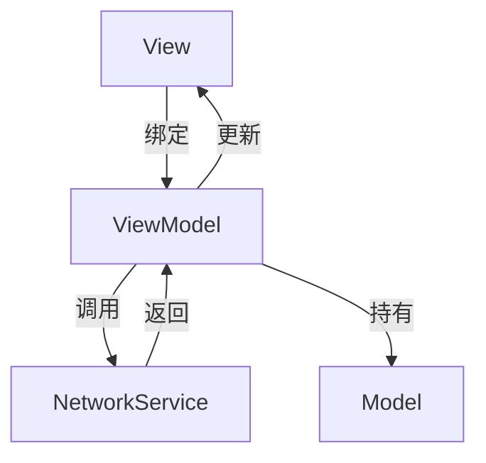

**Diagram sources**
- [HomeViewModel.swift](file://ios/BabyFeedingReminder/ViewModels/HomeViewModel.swift#L35-L135)
- [NetworkService.swift](file://ios/BabyFeedingReminder/Services/NetworkService.swift#L29-L199)

## ViewModel核心实现

### HomeViewModel
HomeViewModel管理首页数据状态，包含多个@Published属性：

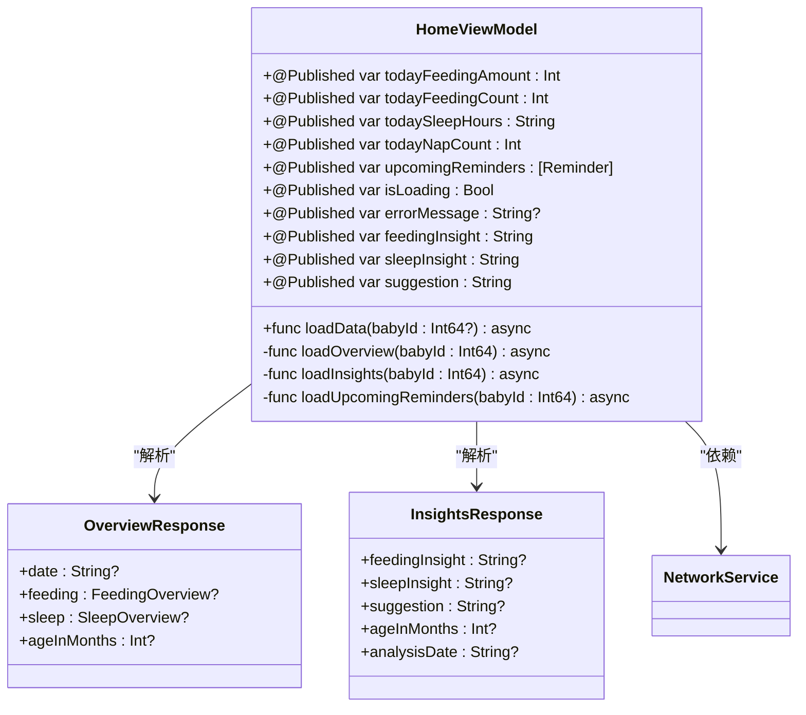

**Diagram sources**
- [HomeViewModel.swift](file://ios/BabyFeedingReminder/ViewModels/HomeViewModel.swift#L35-L135)

### FeedingViewModel
FeedingViewModel处理喂养记录相关状态：

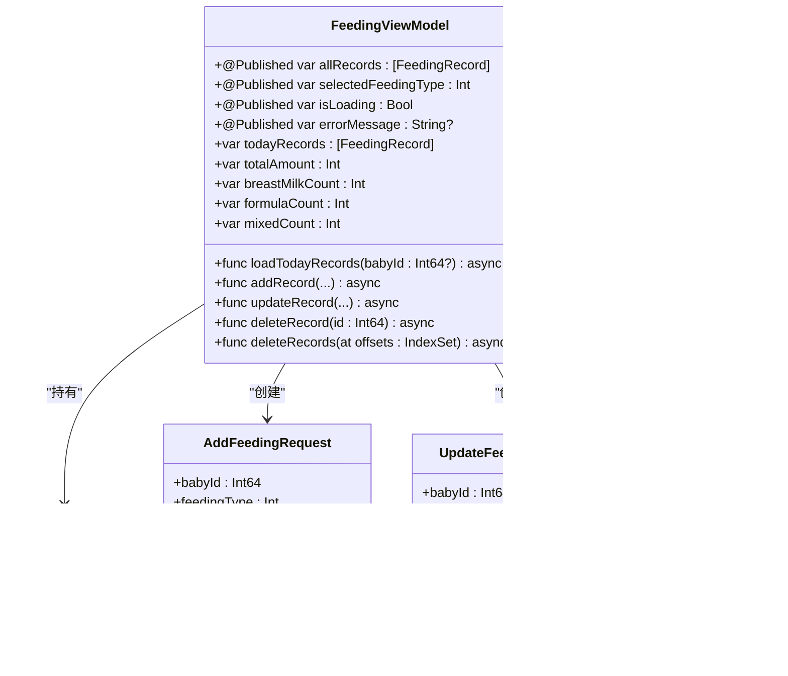

**Diagram sources**
- [FeedingViewModel.swift](file://ios/BabyFeedingReminder/ViewModels/FeedingViewModel.swift#L27-L226)

### SleepViewModel
SleepViewModel管理睡眠记录状态：

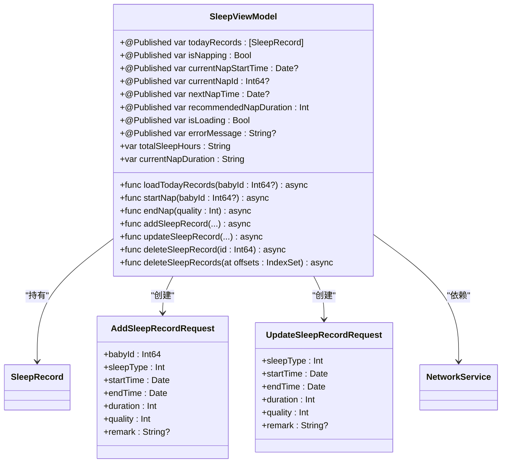

**Diagram sources**
- [SleepViewModel.swift](file://ios/BabyFeedingReminder/ViewModels/SleepViewModel.swift#L4-L297)

### StatisticsViewModel
StatisticsViewModel处理统计分析数据：

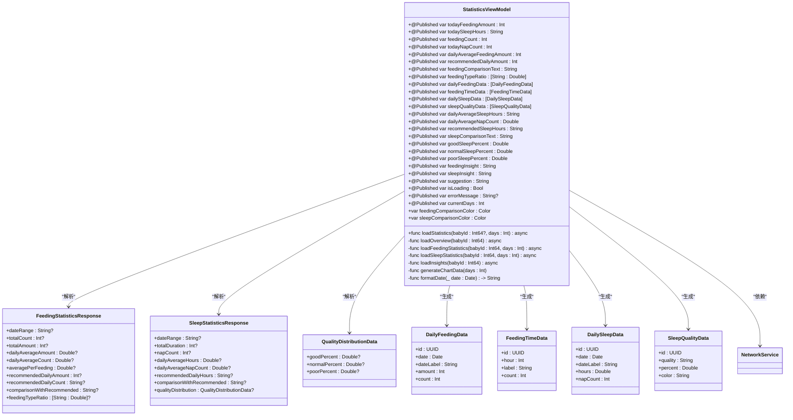

**Diagram sources**
- [StatisticsViewModel.swift](file://ios/BabyFeedingReminder/ViewModels/StatisticsViewModel.swift#L67-L304)

## 数据流生命周期

### 状态变更生命周期
用户交互触发的状态变更流程：

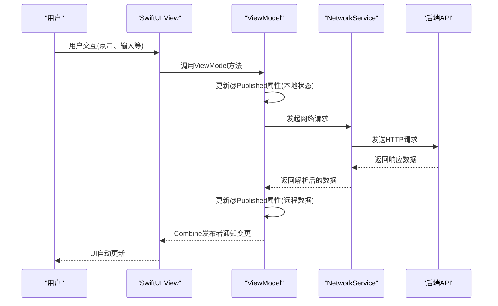

**Diagram sources**
- [FeedingViewModel.swift](file://ios/BabyFeedingReminder/ViewModels/FeedingViewModel.swift#L98-L147)
- [SleepViewModel.swift](file://ios/BabyFeedingReminder/ViewModels/SleepViewModel.swift#L84-L114)

### 数据加载流程
ViewModel从后端获取数据的完整流程：

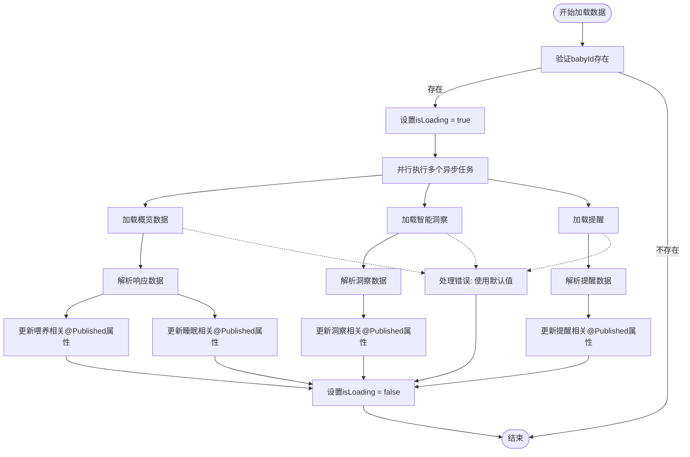

**Diagram sources**
- [HomeViewModel.swift](file://ios/BabyFeedingReminder/ViewModels/HomeViewModel.swift#L52-L66)

## 网络服务集成

### NetworkService架构
NetworkService作为单例服务，提供统一的API请求接口：

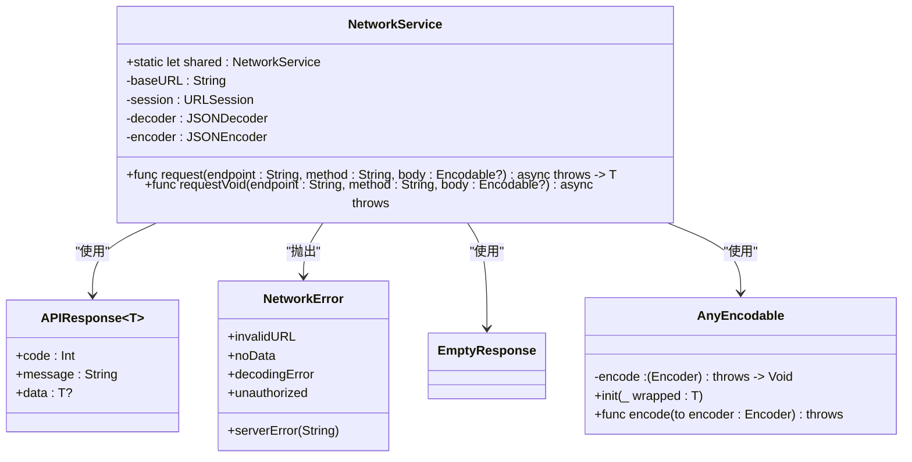

**Diagram sources**
- [NetworkService.swift](file://ios/BabyFeedingReminder/Services/NetworkService.swift#L29-L199)

### 请求处理流程
网络请求的完整处理流程：

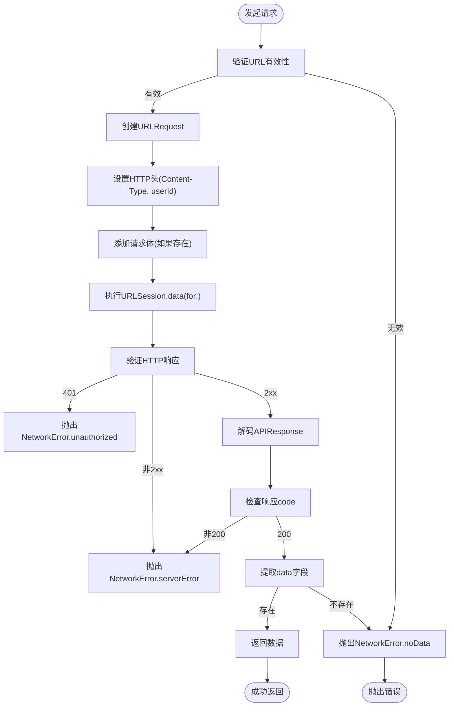

**Diagram sources**
- [NetworkService.swift](file://ios/BabyFeedingReminder/Services/NetworkService.swift#L89-L138)

## 错误处理与加载状态

### 错误处理策略
ViewModel采用优雅降级策略处理网络错误：

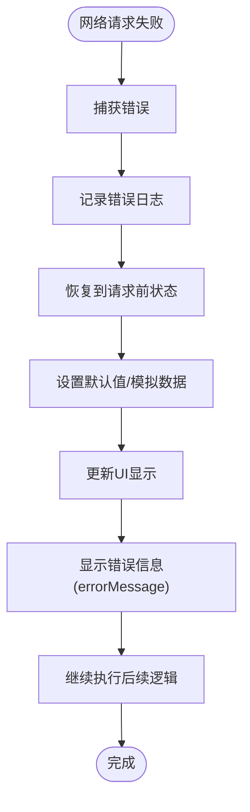

**Section sources**
- [HomeViewModel.swift](file://ios/BabyFeedingReminder/ViewModels/HomeViewModel.swift#L92-L98)
- [FeedingViewModel.swift](file://ios/BabyFeedingReminder/ViewModels/FeedingViewModel.swift#L74-L93)
- [SleepViewModel.swift](file://ios/BabyFeedingReminder/ViewModels/SleepViewModel.swift#L65-L79)
- [StatisticsViewModel.swift](file://ios/BabyFeedingReminder/ViewModels/StatisticsViewModel.swift#L167-L169)

### 加载状态管理
统一的加载状态管理机制：

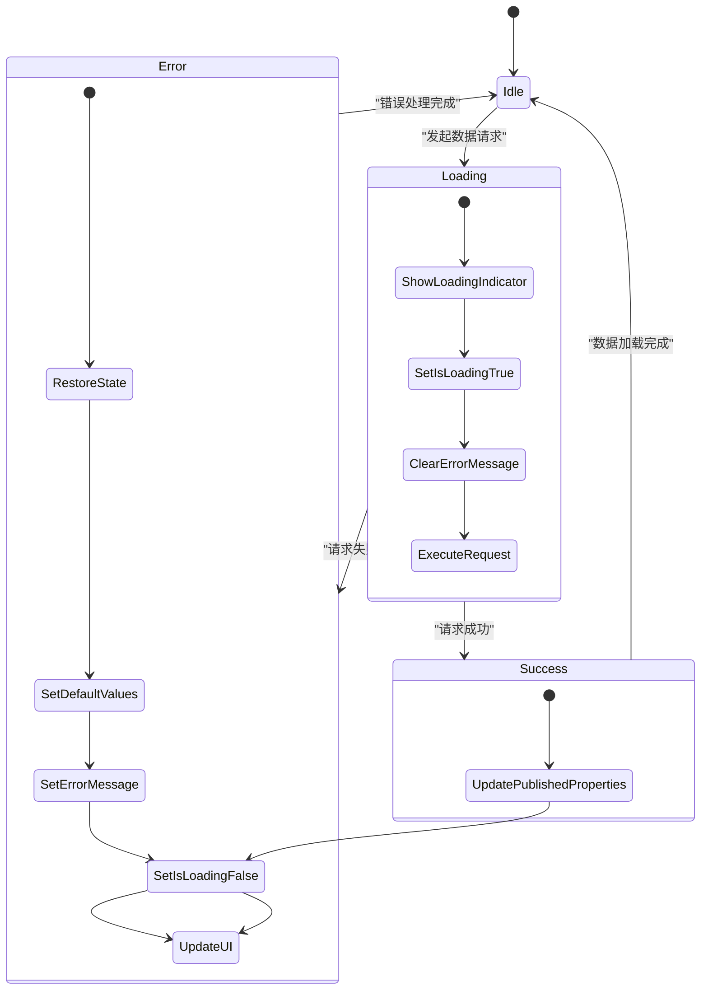

**Section sources**
- [HomeViewModel.swift](file://ios/BabyFeedingReminder/ViewModels/HomeViewModel.swift#L55-L57)
- [FeedingViewModel.swift](file://ios/BabyFeedingReminder/ViewModels/FeedingViewModel.swift#L66-L68)
- [SleepViewModel.swift](file://ios/BabyFeedingReminder/ViewModels/SleepViewModel.swift#L43-L45)
- [StatisticsViewModel.swift](file://ios/BabyFeedingReminder/ViewModels/StatisticsViewModel.swift#L128-L130)

## 内存管理与线程安全

### ObservableObject内存泄漏防护
通过@MainActor确保线程安全，避免内存泄漏：

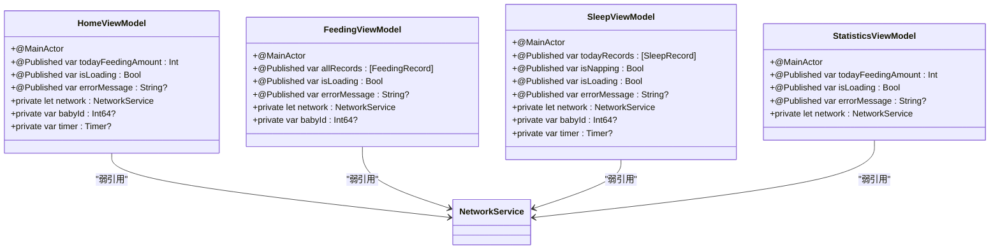

**Section sources**
- [HomeViewModel.swift](file://ios/BabyFeedingReminder/ViewModels/HomeViewModel.swift#L35)
- [FeedingViewModel.swift](file://ios/BabyFeedingReminder/ViewModels/FeedingViewModel.swift#L26)
- [SleepViewModel.swift](file://ios/BabyFeedingReminder/ViewModels/SleepViewModel.swift#L3)
- [StatisticsViewModel.swift](file://ios/BabyFeedingReminder/ViewModels/StatisticsViewModel.swift#L66)

### MainActor线程安全
确保所有UI相关操作在主线程执行：

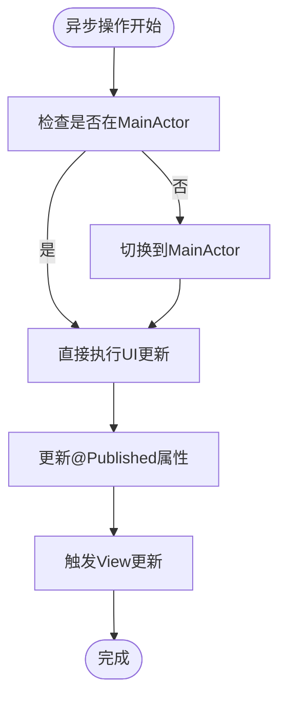

**Section sources**
- [HomeViewModel.swift](file://ios/BabyFeedingReminder/ViewModels/HomeViewModel.swift#L35)
- [FeedingViewModel.swift](file://ios/BabyFeedingReminder/ViewModels/FeedingViewModel.swift#L26)
- [SleepViewModel.swift](file://ios/BabyFeedingReminder/ViewModels/SleepViewModel.swift#L3)
- [StatisticsViewModel.swift](file://ios/BabyFeedingReminder/ViewModels/StatisticsViewModel.swift#L66)

## 性能优化实践

### 属性包装器最佳实践
合理使用@Published属性包装器：

```mermaid
flowchart TD
Start([定义@Published属性]) --> ConsiderFrequency["考虑更新频率"]
ConsiderFrequency --> |高频更新| UseDerived["使用计算属性"]
ConsiderFrequency --> |低频更新| DirectPublished["直接使用@Published"]
UseDerived --> DefineStored["定义存储属性"]
DefineStored --> DefineComputed["定义计算属性"]
DefineComputed --> BindToView["在View中绑定计算属性"]
DirectPublished --> BindToView
BindToView --> MinimizeUpdates["最小化不必要的更新"]
MinimizeUpdates --> UseEquatable["模型遵循Equatable"]
UseEquatable --> OptimizePerformance["优化性能"]
OptimizePerformance --> End([完成])
```

**Section sources**
- [FeedingViewModel.swift](file://ios/BabyFeedingReminder/ViewModels/FeedingViewModel.swift#L37-L53)
- [SleepViewModel.swift](file://ios/BabyFeedingReminder/ViewModels/SleepViewModel.swift#L18-L37)

### 数据同步模式
高效的数据同步策略：

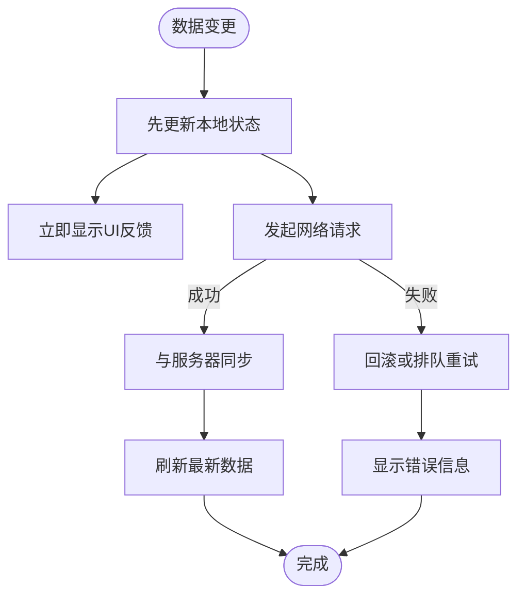

**Section sources**
- [FeedingViewModel.swift](file://ios/BabyFeedingReminder/ViewModels/FeedingViewModel.swift#L126-L127)
- [SleepViewModel.swift](file://ios/BabyFeedingReminder/ViewModels/SleepViewModel.swift#L100-L101)
- [StatisticsViewModel.swift](file://ios/BabyFeedingReminder/ViewModels/StatisticsViewModel.swift#L138-L143)

## 调试与测试策略

### 状态变更调试
调试ViewModel状态变更的有效方法：

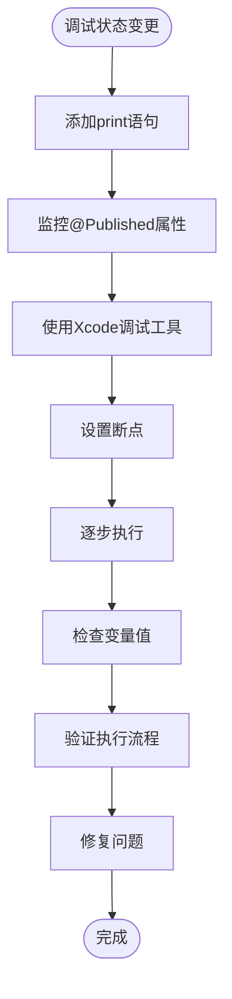

**Section sources**
- [HomeViewModel.swift](file://ios/BabyFeedingReminder/ViewModels/HomeViewModel.swift#L98-L99)
- [FeedingViewModel.swift](file://ios/BabyFeedingReminder/ViewModels/FeedingViewModel.swift#L145-L146)
- [SleepViewModel.swift](file://ios/BabyFeedingReminder/ViewModels/SleepViewModel.swift#L135-L136)
- [StatisticsViewModel.swift](file://ios/BabyFeedingReminder/ViewModels/StatisticsViewModel.swift#L230-L231)

### ViewModel独立测试
ViewModel的单元测试策略：

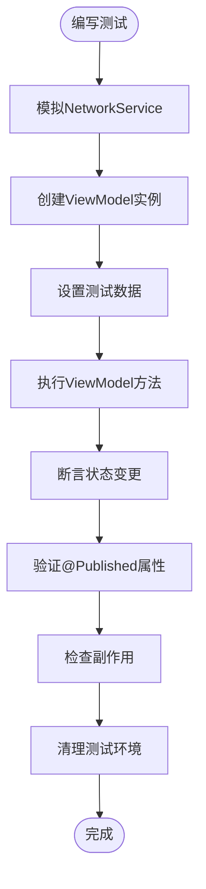

**Section sources**
- [HomeViewModel.swift](file://ios/BabyFeedingReminder/ViewModels/HomeViewModel.swift#L52-L66)
- [FeedingViewModel.swift](file://ios/BabyFeedingReminder/ViewModels/FeedingViewModel.swift#L62-L96)
- [SleepViewModel.swift](file://ios/BabyFeedingReminder/ViewModels/SleepViewModel.swift#L39-L82)
- [StatisticsViewModel.swift](file://ios/BabyFeedingReminder/ViewModels/StatisticsViewModel.swift#L125-L143)