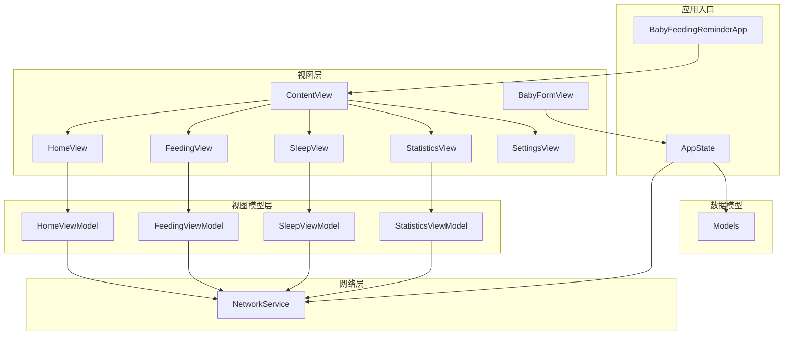
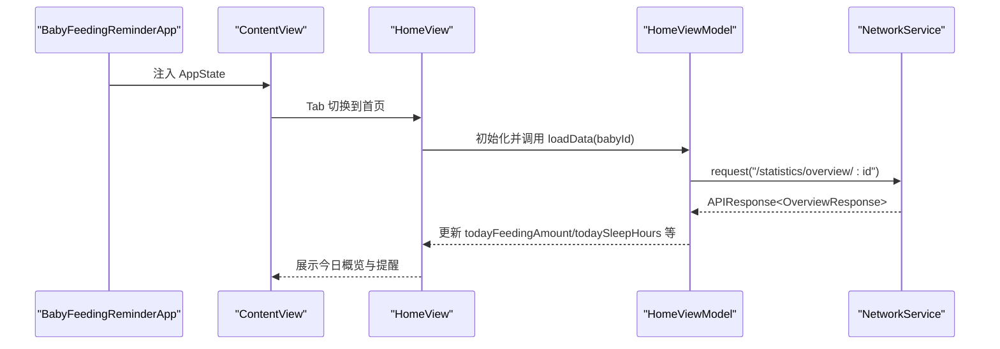
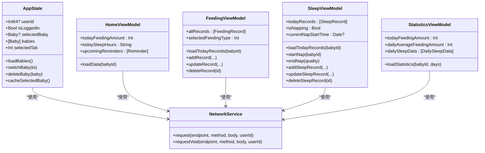

# 组件层级结构

<cite>
**本文引用的文件**
- [BabyFeedingReminderApp.swift](file://ios/BabyFeedingReminder/BabyFeedingReminderApp.swift)
- [ContentView.swift](file://ios/BabyFeedingReminder/ContentView.swift)
- [HomeView.swift](file://ios/BabyFeedingReminder/Views/HomeView.swift)
- [FeedingView.swift](file://ios/BabyFeedingReminder/Views/FeedingView.swift)
- [SleepView.swift](file://ios/BabyFeedingReminder/Views/SleepView.swift)
- [StatisticsView.swift](file://ios/BabyFeedingReminder/Views/StatisticsView.swift)
- [SettingsView.swift](file://ios/BabyFeedingReminder/Views/SettingsView.swift)
- [BabyFormView.swift](file://ios/BabyFeedingReminder/Views/BabyFormView.swift)
- [HomeViewModel.swift](file://ios/BabyFeedingReminder/ViewModels/HomeViewModel.swift)
- [FeedingViewModel.swift](file://ios/BabyFeedingReminder/ViewModels/FeedingViewModel.swift)
- [SleepViewModel.swift](file://ios/BabyFeedingReminder/ViewModels/SleepViewModel.swift)
- [StatisticsViewModel.swift](file://ios/BabyFeedingReminder/ViewModels/StatisticsViewModel.swift)
- [Models.swift](file://ios/BabyFeedingReminder/Models/Models.swift)
- [NetworkService.swift](file://ios/BabyFeedingReminder/Services/NetworkService.swift)
</cite>

## 目录
1. [简介](#简介)
2. [项目结构](#项目结构)
3. [核心组件](#核心组件)
4. [架构总览](#架构总览)
5. [详细组件分析](#详细组件分析)
6. [依赖关系分析](#依赖关系分析)
7. [性能与可用性考量](#性能与可用性考量)
8. [故障排查指南](#故障排查指南)
9. [结论](#结论)
10. [附录：扩展与最佳实践](#附录扩展与最佳实践)

## 简介
本文件面向 babyFeedingReminder 的 iOS 前端 SwiftUI 视图层次，系统梳理根容器 ContentView、首页 HomeView、喂养 FeedingView、睡眠 SleepView、统计 StatisticsView、设置 SettingsView 以及宝宝资料 BabyFormView 的职责、组合方式、导航流与状态注入模式，并结合 ViewModel 与网络层进行端到端说明。文档同时覆盖无障碍、响应式布局与可定制化建议，帮助开发者在保持架构一致性的同时扩展新功能。

## 项目结构
iOS 前端采用典型的 MVVM + SwiftUI 架构：
- 视图层：Views 下的各 SwiftUI 视图负责 UI 呈现与交互
- 视图模型层：ViewModels 下的类负责业务状态与网络请求
- 数据模型层：Models 定义实体与枚举
- 应用入口与全局状态：BabyFeedingReminderApp.swift 与 AppState
- 网络层：NetworkService 提供统一的请求封装

图表来源
- [BabyFeedingReminderApp.swift](file://ios/BabyFeedingReminder/BabyFeedingReminderApp.swift#L1-L164)
- [ContentView.swift](file://ios/BabyFeedingReminder/ContentView.swift#L1-L51)
- [HomeView.swift](file://ios/BabyFeedingReminder/Views/HomeView.swift#L1-L535)
- [FeedingView.swift](file://ios/BabyFeedingReminder/Views/FeedingView.swift#L1-L421)
- [SleepView.swift](file://ios/BabyFeedingReminder/Views/SleepView.swift#L1-L488)
- [StatisticsView.swift](file://ios/BabyFeedingReminder/Views/StatisticsView.swift#L1-L632)
- [SettingsView.swift](file://ios/BabyFeedingReminder/Views/SettingsView.swift#L1-L398)
- [BabyFormView.swift](file://ios/BabyFeedingReminder/Views/BabyFormView.swift#L1-L297)
- [HomeViewModel.swift](file://ios/BabyFeedingReminder/ViewModels/HomeViewModel.swift#L1-L135)
- [FeedingViewModel.swift](file://ios/BabyFeedingReminder/ViewModels/FeedingViewModel.swift#L1-L226)
- [SleepViewModel.swift](file://ios/BabyFeedingReminder/ViewModels/SleepViewModel.swift#L1-L297)
- [StatisticsViewModel.swift](file://ios/BabyFeedingReminder/ViewModels/StatisticsViewModel.swift#L1-L304)
- [Models.swift](file://ios/BabyFeedingReminder/Models/Models.swift#L1-L196)
- [NetworkService.swift](file://ios/BabyFeedingReminder/Services/NetworkService.swift#L1-L199)

章节来源
- [BabyFeedingReminderApp.swift](file://ios/BabyFeedingReminder/BabyFeedingReminderApp.swift#L1-L164)
- [ContentView.swift](file://ios/BabyFeedingReminder/ContentView.swift#L1-L51)

## 核心组件
- ContentView：根容器，承载 TabView，作为应用主入口，注入 AppState 并绑定选中 Tab
- HomeView：首页仪表盘，聚合宝宝卡片、今日概览、即将到来的提醒、快捷操作等
- FeedingView：喂养记录页面，支持类型筛选、今日列表、底部添加按钮、编辑弹窗
- SleepView：睡眠记录页面，支持当前状态卡片、今日列表、底部添加按钮、编辑弹窗
- StatisticsView：统计分析页面，包含今日概览、时间段切换、喂养/睡眠图表与智能洞察
- SettingsView：设置中心，包含宝宝信息、喂养/睡眠偏好、提醒设置、通知开关与指南说明
- BabyFormView：宝宝资料表单，支持新增/编辑、胎龄计算、生长指标录入与本地回退

章节来源
- [ContentView.swift](file://ios/BabyFeedingReminder/ContentView.swift#L1-L51)
- [HomeView.swift](file://ios/BabyFeedingReminder/Views/HomeView.swift#L1-L535)
- [FeedingView.swift](file://ios/BabyFeedingReminder/Views/FeedingView.swift#L1-L421)
- [SleepView.swift](file://ios/BabyFeedingReminder/Views/SleepView.swift#L1-L488)
- [StatisticsView.swift](file://ios/BabyFeedingReminder/Views/StatisticsView.swift#L1-L632)
- [SettingsView.swift](file://ios/BabyFeedingReminder/Views/SettingsView.swift#L1-L398)
- [BabyFormView.swift](file://ios/BabyFeedingReminder/Views/BabyFormView.swift#L1-L297)

## 架构总览
SwiftUI 通过 @EnvironmentObject 注入 AppState，各视图通过 @StateObject/@State/@ObservedObject 注入 ViewModel，网络请求由 NetworkService 统一封装，返回 APIResponse 包裹的数据并抛出标准化错误。

图表来源
- [BabyFeedingReminderApp.swift](file://ios/BabyFeedingReminder/BabyFeedingReminderApp.swift#L1-L164)
- [ContentView.swift](file://ios/BabyFeedingReminder/ContentView.swift#L1-L51)
- [HomeView.swift](file://ios/BabyFeedingReminder/Views/HomeView.swift#L1-L535)
- [HomeViewModel.swift](file://ios/BabyFeedingReminder/ViewModels/HomeViewModel.swift#L1-L135)
- [NetworkService.swift](file://ios/BabyFeedingReminder/Services/NetworkService.swift#L1-L199)

## 详细组件分析

### ContentView：根容器与 Tab 导航
- 作用：承载 TabView，提供首页、喂养、睡眠、统计、设置五个标签页；绑定 AppState.selectedTab 实现跨视图导航
- 状态注入：@EnvironmentObject 注入 AppState，用于共享当前选中 Tab 与全局状态
- 设计要点：每个 tabItem 绑定 tag，配合 selection 控制当前页；统一 accentColor

章节来源
- [ContentView.swift](file://ios/BabyFeedingReminder/ContentView.swift#L1-L51)

### HomeView：首页仪表盘
- 作用：展示当前选中宝宝信息、今日概览、即将到来的提醒、快捷操作；支持切换/添加宝宝
- 状态与注入：
  - @EnvironmentObject AppState：读取/切换宝宝、加载数据
  - @StateObject private HomeViewModel：管理首页数据
  - @State 弹窗控制：showAddBaby、showBabyManager、babyToEdit
- 组成模块：
  - 宝宝卡片：点击进入宝宝管理器
  - 添加宝宝卡片：点击进入 BabyFormView
  - 今日概览：喂养总量/次数、睡眠时长/小睡次数
  - 即将到来的提醒：最多三条
  - 快捷操作：跳转到喂养/睡眠/统计页
- 导航与弹窗：
  - sheet(isPresented:) 打开 BabyManagerView 或 BabyFormView
  - onChange/onAppear 自动刷新数据
- 可访问性：使用系统图标与文本，语义清晰；按钮区域较大，适合单手操作

章节来源
- [HomeView.swift](file://ios/BabyFeedingReminder/Views/HomeView.swift#L1-L535)

### FeedingView：喂养记录
- 作用：记录与管理喂养历史，支持类型筛选、今日列表、底部添加按钮、编辑弹窗
- 状态与注入：
  - @EnvironmentObject AppState：获取当前宝宝
  - @StateObject private FeedingViewModel：管理喂养数据
  - @State 弹窗控制：showAddRecord、editingRecord
- 组成模块：
  - 类型选择器：全部/母乳/奶粉
  - 今日记录列表：Section 头部显示总数与总量
  - 底部添加按钮：便于单手操作
  - 编辑弹窗：EditFeedingRecordView，支持新增/编辑、删除
- 导航与弹窗：
  - sheet/isPresented 打开编辑视图
  - onDelete 支持滑动删除（仅已结束记录）
  - refreshable 下拉刷新
- 可访问性：大号按钮、清晰的图标与颜色区分；键盘为数字键盘

章节来源
- [FeedingView.swift](file://ios/BabyFeedingReminder/Views/FeedingView.swift#L1-L421)

### SleepView：睡眠跟踪
- 作用：记录与管理睡眠历史，支持当前状态卡片、今日列表、底部添加按钮、编辑弹窗
- 状态与注入：
  - @EnvironmentObject AppState：获取当前宝宝
  - @StateObject private SleepViewModel：管理睡眠数据
  - @State 弹窗控制：showAddRecord、editingRecord
- 组成模块：
  - 当前睡眠状态卡片：进行中小睡时显示“结束小睡”，否则显示“开始小睡”
  - 今日记录列表：支持滑动删除（仅已结束记录）
  - 底部添加按钮：便于单手操作
  - 编辑弹窗：EditSleepRecordView，支持新增/编辑、删除
- 导航与弹窗：
  - sheet/isPresented 打开编辑视图
  - refreshable 下拉刷新
- 可访问性：大号按钮、清晰的图标与颜色区分；质量选择器使用表情符号增强可读性

章节来源
- [SleepView.swift](file://ios/BabyFeedingReminder/Views/SleepView.swift#L1-L488)

### StatisticsView：数据可视化
- 作用：展示喂养/睡眠统计与智能洞察，支持时间段切换与图表类型切换
- 状态与注入：
  - @EnvironmentObject AppState：获取当前宝宝
  - @StateObject private StatisticsViewModel：管理统计数据
  - @State selectedPeriod：7/30/365 天
- 组成模块：
  - 今日概览卡片：喂养量、睡眠、喂奶次数、小睡次数
  - 时间段选择器：分段选择器
  - 喂养分析：日均奶量、推荐对比、图表类型切换（奶量/次数/时间分布）、类型比例
  - 睡眠分析：日均睡眠、推荐对比、图表类型切换（时长/次数/质量分布）、质量指标
  - 智能洞察：喂养洞察、睡眠洞察、建议
- 图表：使用 Charts 框架绘制柱状图与环形图
- 可访问性：图表具备标题与轴标注；颜色搭配考虑色觉差异

章节来源
- [StatisticsView.swift](file://ios/BabyFeedingReminder/Views/StatisticsView.swift#L1-L632)

### SettingsView：用户偏好与设置
- 作用：集中管理宝宝信息、喂养/睡眠偏好、提醒设置、通知开关与参考指南
- 组成模块：
  - 宝宝信息：展示/编辑当前宝宝，支持打开 BabyFormView
  - 喂养设置：默认类型、默认量、默认时长、喂养间隔、解冻提醒提前时间
  - 睡眠设置：小睡间隔、建议小睡时长、哄睡提前提醒、作息目标时间
  - 通知设置：开关推送通知
  - 关于：版本与参考指南
- 可访问性：Toggle、Picker、DatePicker 使用系统样式，语义明确

章节来源
- [SettingsView.swift](file://ios/BabyFeedingReminder/Views/SettingsView.swift#L1-L398)

### BabyFormView：宝宝资料管理
- 作用：新增/编辑宝宝资料，支持胎龄计算、生长指标录入与本地回退
- 状态与注入：
  - @EnvironmentObject AppState：写入选中宝宝与列表
  - @Environment(\.dismiss)：关闭弹窗
- 功能点：
  - 胎龄：以周+天形式输入，保存为总天数
  - 生长指标：身高、体重、头围（可选）
  - 保存：POST/PUT 请求，失败时本地模拟创建/更新并缓存
- 可访问性：文本字段、数字键盘、禁用态控制

章节来源
- [BabyFormView.swift](file://ios/BabyFeedingReminder/Views/BabyFormView.swift#L1-L297)

### ViewModel 与网络集成
- HomeViewModel：并行加载概览、洞察与提醒，解析 OverviewResponse/InsightsResponse
- FeedingViewModel：加载今日记录、增删改喂养记录，处理日期格式化与本地回退
- SleepViewModel：加载今日记录、开始/结束小睡、增删改睡眠记录，维护当前状态与定时器
- StatisticsViewModel：加载喂养/睡眠统计与洞察，生成图表数据，支持时间段切换
- NetworkService：统一封装请求，返回 APIResponse 包裹数据，抛出标准化错误

章节来源
- [HomeViewModel.swift](file://ios/BabyFeedingReminder/ViewModels/HomeViewModel.swift#L1-L135)
- [FeedingViewModel.swift](file://ios/BabyFeedingReminder/ViewModels/FeedingViewModel.swift#L1-L226)
- [SleepViewModel.swift](file://ios/BabyFeedingReminder/ViewModels/SleepViewModel.swift#L1-L297)
- [StatisticsViewModel.swift](file://ios/BabyFeedingReminder/ViewModels/StatisticsViewModel.swift#L1-L304)
- [NetworkService.swift](file://ios/BabyFeedingReminder/Services/NetworkService.swift#L1-L199)

## 依赖关系分析
- 视图与状态：
  - ContentView 依赖 AppState 控制 Tab
  - HomeView/FeedingView/SleepView/StatisticsView/SettingsView 依赖 AppState 读取当前宝宝与用户信息
  - 各视图通过 @StateObject 注入对应 ViewModel
- 视图与子组件：
  - HomeView 内含多个复合组件（卡片、列表行、按钮等），形成清晰的模块化结构
  - FeedingView/SleepView 内含编辑弹窗与列表项，职责分离
  - StatisticsView 内含图表组件与洞察组件
- 视图模型与网络：
  - ViewModel 通过 NetworkService 发起请求，解析 APIResponse，失败时提供本地回退
- 数据模型：
  - Models 定义 Baby、FeedingRecord、SleepRecord、Reminder 等实体，提供描述性属性与格式化方法

图表来源
- [BabyFeedingReminderApp.swift](file://ios/BabyFeedingReminder/BabyFeedingReminderApp.swift#L1-L164)
- [HomeViewModel.swift](file://ios/BabyFeedingReminder/ViewModels/HomeViewModel.swift#L1-L135)
- [FeedingViewModel.swift](file://ios/BabyFeedingReminder/ViewModels/FeedingViewModel.swift#L1-L226)
- [SleepViewModel.swift](file://ios/BabyFeedingReminder/ViewModels/SleepViewModel.swift#L1-L297)
- [StatisticsViewModel.swift](file://ios/BabyFeedingReminder/ViewModels/StatisticsViewModel.swift#L1-L304)
- [NetworkService.swift](file://ios/BabyFeedingReminder/Services/NetworkService.swift#L1-L199)

## 性能与可用性考量
- 性能
  - 并行加载：HomeViewModel 与 StatisticsViewModel 在 loadData 中并行发起多个请求，减少等待时间
  - 列表优化：使用 List/ForEach，配合 onDelete 与 refreshable，提升滚动与交互体验
  - 本地回退：网络失败时使用本地模拟数据，保证可用性
- 可用性
  - 大按钮与大字号：底部添加按钮、大号 Stepper、清晰图标与颜色
  - 无障碍：系统图标 + 文本，语义明确；按钮区域足够大；颜色对比度合理
  - 响应式布局：使用 HStack/VStack/Spacer/Frame 等布局，适配不同设备尺寸
- 可定制化
  - 颜色与主题：统一使用 accentColor 与系统背景色，支持浅/深色模式
  - 字体与间距：使用系统字体与合理的内边距/间距，确保可读性

[本节为通用指导，不直接分析具体文件]

## 故障排查指南
- 网络错误
  - NetworkService 抛出标准化错误，如 invalidURL/noData/decodingError/serverError/unauthorized
  - ViewModel 在捕获异常后使用本地模拟数据，避免界面空白
- 数据解析
  - JSONDecoder 自定义日期策略，支持多种日期格式；若解析失败，检查后端返回格式与时区
- 状态同步
  - AppState 负责全局状态与本地缓存；若出现宝宝切换异常，检查 selectedBabyIdKey 与 UserDefaults
- 视图刷新
  - 使用 refreshable 与 onChange/onAppear 主动刷新；确保 ViewModel 的 @Published 字段正确更新

章节来源
- [NetworkService.swift](file://ios/BabyFeedingReminder/Services/NetworkService.swift#L1-L199)
- [HomeViewModel.swift](file://ios/BabyFeedingReminder/ViewModels/HomeViewModel.swift#L1-L135)
- [FeedingViewModel.swift](file://ios/BabyFeedingReminder/ViewModels/FeedingViewModel.swift#L1-L226)
- [SleepViewModel.swift](file://ios/BabyFeedingReminder/ViewModels/SleepViewModel.swift#L1-L297)
- [StatisticsViewModel.swift](file://ios/BabyFeedingReminder/ViewModels/StatisticsViewModel.swift#L1-L304)
- [BabyFeedingReminderApp.swift](file://ios/BabyFeedingReminder/BabyFeedingReminderApp.swift#L1-L164)

## 结论
该 SwiftUI 前端以 AppState 为中心，通过 @EnvironmentObject 注入全局状态，各视图通过 @StateObject/@ObservedObject 注入 ViewModel，实现清晰的职责分离与良好的可维护性。视图内部模块化设计（卡片、列表行、编辑弹窗、图表）提升了可读性与可扩展性。配合 NetworkService 的统一请求封装与本地回退机制，系统在弱网环境下仍具备良好用户体验。

[本节为总结性内容，不直接分析具体文件]

## 附录：扩展与最佳实践
- 新增视图建议
  - 在 ContentView 中新增 tabItem 并绑定 tag
  - 新建视图文件并在 Home/Settings 等处提供导航入口
  - 新建 ViewModel 并在视图中注入 @StateObject
  - 在 AppState 中增加必要的状态字段（如 selectedTab 扩展）
- 状态管理
  - 优先使用 @StateObject 管理视图专属状态，@ObservedObject 管理共享状态
  - 将网络请求集中在 ViewModel，避免在视图中直接发起请求
- 导航与弹窗
  - 使用 sheet/isPresented 管理模态弹窗，注意 onDisappear 清理临时状态
  - 使用 NavigationLink/NavigateView 串联详情页，保持栈式导航
- 可访问性
  - 使用系统图标与语义化文本；避免仅靠颜色传达信息
  - 为关键按钮提供明确的标题与描述
- 响应式布局
  - 使用 HStack/VStack/Spacer/Frame 等布局元素，适配 iPhone/iPad
  - 避免固定像素，优先使用 .infinity/.frame(maxWidth/.height)
- 错误处理
  - ViewModel 捕获异常并降级为本地模拟数据
  - 在视图中展示简洁的错误提示与重试入口

[本节为通用指导，不直接分析具体文件]