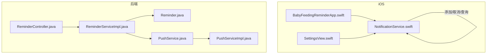
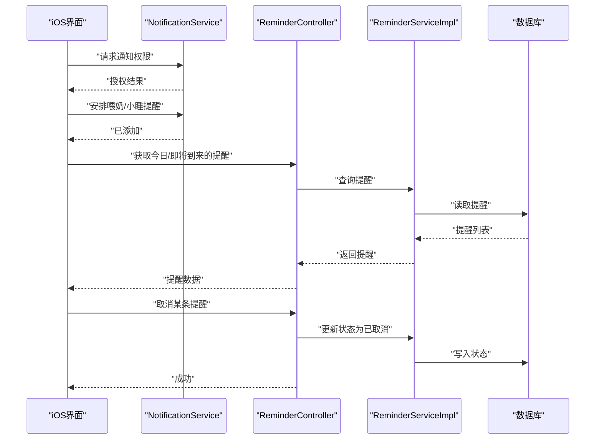
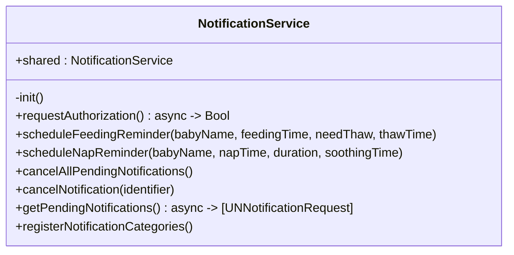
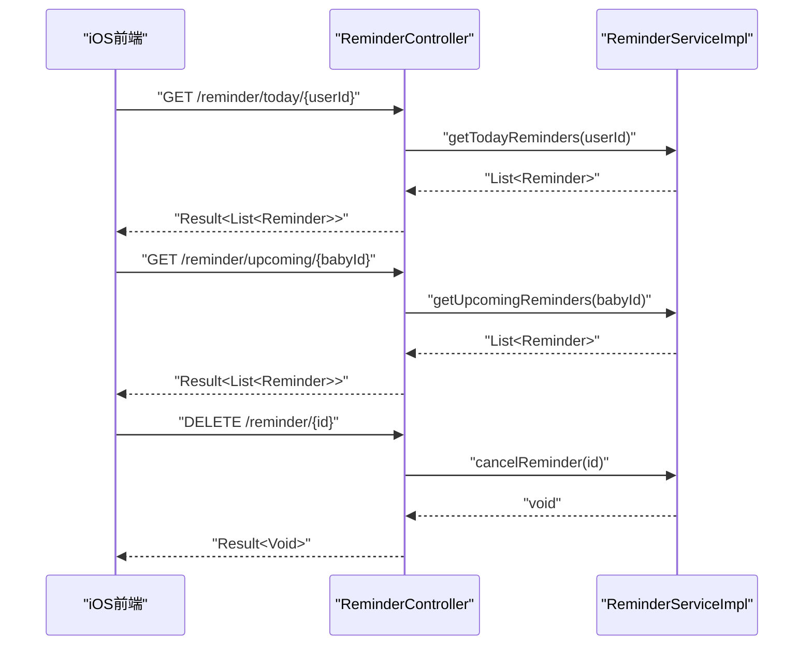
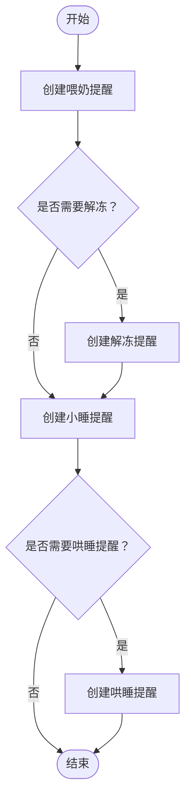
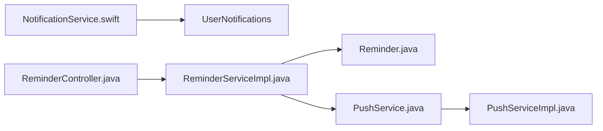

# 通知系统

<cite>
**本文引用的文件**
- [NotificationService.swift](file://ios/BabyFeedingReminder/Services/NotificationService.swift)
- [ReminderController.java](file://backend/src/main/java/com/baby/controller/ReminderController.java)
- [ReminderServiceImpl.java](file://backend/src/main/java/com/baby/service/impl/ReminderServiceImpl.java)
- [Reminder.java](file://backend/src/main/java/com/baby/entity/Reminder.java)
- [PushService.java](file://backend/src/main/java/com/baby/service/PushService.java)
- [PushServiceImpl.java](file://backend/src/main/java/com/baby/service/impl/PushServiceImpl.java)
- [BabyFeedingReminderApp.swift](file://ios/BabyFeedingReminder/BabyFeedingReminderApp.swift)
- [SettingsView.swift](file://ios/BabyFeedingReminder/Views/SettingsView.swift)
</cite>

## 目录
1. [简介](#简介)
2. [项目结构](#项目结构)
3. [核心组件](#核心组件)
4. [架构总览](#架构总览)
5. [详细组件分析](#详细组件分析)
6. [依赖关系分析](#依赖关系分析)
7. [性能与可靠性考量](#性能与可靠性考量)
8. [故障排查指南](#故障排查指南)
9. [结论](#结论)
10. [附录](#附录)

## 简介
本文件面向 iOS 应用“本地通知系统”的实现，围绕 NotificationService 如何集成 UserNotifications 框架来调度与处理喂奶、小睡、哄睡等提醒展开。文档同时说明与后端 ReminderController 的协同机制（用于查询/取消提醒），并覆盖权限申请、通知内容构建、基于用户设置的日程触发、通知响应处理、以及开发测试与电池优化等常见问题。

## 项目结构
iOS 侧通过 NotificationService 统一管理本地通知；后端通过 ReminderController 提供提醒查询与取消接口，并由 ReminderServiceImpl 负责提醒的创建、状态流转与定时发送逻辑。PushService 为远程推送能力预留扩展点。

图表来源
- [NotificationService.swift](file://ios/BabyFeedingReminder/Services/NotificationService.swift#L1-L150)
- [BabyFeedingReminderApp.swift](file://ios/BabyFeedingReminder/BabyFeedingReminderApp.swift#L1-L164)
- [SettingsView.swift](file://ios/BabyFeedingReminder/Views/SettingsView.swift#L294-L328)
- [ReminderController.java](file://backend/src/main/java/com/baby/controller/ReminderController.java#L1-L45)
- [ReminderServiceImpl.java](file://backend/src/main/java/com/baby/service/impl/ReminderServiceImpl.java#L1-L242)
- [Reminder.java](file://backend/src/main/java/com/baby/entity/Reminder.java#L1-L76)
- [PushService.java](file://backend/src/main/java/com/baby/service/PushService.java#L1-L23)
- [PushServiceImpl.java](file://backend/src/main/java/com/baby/service/impl/PushServiceImpl.java#L1-L68)

章节来源
- [NotificationService.swift](file://ios/BabyFeedingReminder/Services/NotificationService.swift#L1-L150)
- [ReminderController.java](file://backend/src/main/java/com/baby/controller/ReminderController.java#L1-L45)

## 核心组件
- iOS 本地通知服务：负责请求权限、注册通知分类与动作、按日历时间触发喂奶/小睡/哄睡相关提醒、取消与查询待发通知。
- 后端提醒控制器：提供“今日提醒”“即将到来的提醒”“取消提醒”等接口，供前端拉取与同步。
- 后端提醒服务实现：根据喂养/睡眠记录生成提醒（含解冻、哄睡），维护提醒状态与定时发送。
- 远程推送服务：定义推送接口，当前实现为占位，便于后续接入 APNs。

章节来源
- [NotificationService.swift](file://ios/BabyFeedingReminder/Services/NotificationService.swift#L1-L150)
- [ReminderController.java](file://backend/src/main/java/com/baby/controller/ReminderController.java#L1-L45)
- [ReminderServiceImpl.java](file://backend/src/main/java/com/baby/service/impl/ReminderServiceImpl.java#L1-L242)
- [PushService.java](file://backend/src/main/java/com/baby/service/PushService.java#L1-L23)

## 架构总览
iOS 本地通知与后端提醒系统的关系如下：
- iOS 侧通过 NotificationService 完成本地提醒的创建与管理；
- 后端通过 ReminderController 提供提醒查询与取消能力；
- ReminderServiceImpl 基于业务记录生成提醒并维护状态，支持定时发送远程推送（当前为占位）。

图表来源
- [NotificationService.swift](file://ios/BabyFeedingReminder/Services/NotificationService.swift#L1-L150)
- [ReminderController.java](file://backend/src/main/java/com/baby/controller/ReminderController.java#L1-L45)
- [ReminderServiceImpl.java](file://backend/src/main/java/com/baby/service/impl/ReminderServiceImpl.java#L166-L211)

## 详细组件分析

### iOS 本地通知服务（NotificationService）
职责与流程
- 权限申请：异步请求通知权限（允许弹窗、声音、徽章）。
- 分类与动作注册：为喂奶与小睡两类提醒注册分类及可执行动作。
- 提醒创建：
  - 喂奶提醒：按指定日期时间创建日历触发器；若需解冻，则额外创建解冻提醒。
  - 小睡提醒：按指定日期时间创建日历触发器；若配置了哄睡时间，则额外创建哄睡提醒。
- 提醒管理：支持取消全部、按标识符取消、查询待发列表。

关键实现要点
- 使用 UNUserNotificationCenter 管理授权、添加请求、查询与移除。
- 使用 UNCalendarNotificationTrigger 按年月日时分进行触发，满足日常喂养与睡眠周期。
- 为不同提醒类型设置不同的 categoryIdentifier，以便绑定对应动作。
- 动作选项包含前台打开（小睡开始）与后台操作（稍后提醒、已喂完等）。

图表来源
- [NotificationService.swift](file://ios/BabyFeedingReminder/Services/NotificationService.swift#L1-L150)

章节来源
- [NotificationService.swift](file://ios/BabyFeedingReminder/Services/NotificationService.swift#L1-L150)

### 后端提醒控制器（ReminderController）
职责与流程
- 提供接口：
  - 获取用户今日提醒
  - 获取宝宝即将到来的提醒
  - 取消指定提醒
- 返回统一 Result 包裹的数据结构，便于前端处理。

图表来源
- [ReminderController.java](file://backend/src/main/java/com/baby/controller/ReminderController.java#L1-L45)
- [ReminderServiceImpl.java](file://backend/src/main/java/com/baby/service/impl/ReminderServiceImpl.java#L166-L211)

章节来源
- [ReminderController.java](file://backend/src/main/java/com/baby/controller/ReminderController.java#L1-L45)

### 后端提醒服务实现（ReminderServiceImpl）
职责与流程
- 喂奶提醒：根据喂养记录生成下一次喂奶提醒，并可选生成解冻提醒。
- 小睡提醒：根据睡眠记录生成小睡提醒，并可选生成哄睡提醒。
- 状态管理：维护提醒的“待发送/已发送/已取消”，并支持按关联记录批量取消。
- 定时发送：每分钟扫描待发送提醒并通过推送服务发送。

图表来源
- [ReminderServiceImpl.java](file://backend/src/main/java/com/baby/service/impl/ReminderServiceImpl.java#L37-L164)

章节来源
- [ReminderServiceImpl.java](file://backend/src/main/java/com/baby/service/impl/ReminderServiceImpl.java#L1-L242)
- [Reminder.java](file://backend/src/main/java/com/baby/entity/Reminder.java#L1-L76)

### 远程推送服务（PushService/PushServiceImpl）
职责与流程
- 定义远程推送接口，当前实现为占位，日志记录并可配置开关。
- 后续可接入 APNs 客户端库完成真实推送。

章节来源
- [PushService.java](file://backend/src/main/java/com/baby/service/PushService.java#L1-L23)
- [PushServiceImpl.java](file://backend/src/main/java/com/baby/service/impl/PushServiceImpl.java#L1-L68)

## 依赖关系分析
- iOS 通知服务依赖 UserNotifications 框架，负责本地提醒生命周期管理。
- 后端提醒服务依赖数据库与推送服务接口，负责提醒状态与定时发送。
- 前端通过 ReminderController 与后端交互，实现提醒的查询与取消。

图表来源
- [NotificationService.swift](file://ios/BabyFeedingReminder/Services/NotificationService.swift#L1-L150)
- [ReminderController.java](file://backend/src/main/java/com/baby/controller/ReminderController.java#L1-L45)
- [ReminderServiceImpl.java](file://backend/src/main/java/com/baby/service/impl/ReminderServiceImpl.java#L1-L242)
- [Reminder.java](file://backend/src/main/java/com/baby/entity/Reminder.java#L1-L76)
- [PushService.java](file://backend/src/main/java/com/baby/service/PushService.java#L1-L23)
- [PushServiceImpl.java](file://backend/src/main/java/com/baby/service/impl/PushServiceImpl.java#L1-L68)

章节来源
- [NotificationService.swift](file://ios/BabyFeedingReminder/Services/NotificationService.swift#L1-L150)
- [ReminderController.java](file://backend/src/main/java/com/baby/controller/ReminderController.java#L1-L45)
- [ReminderServiceImpl.java](file://backend/src/main/java/com/baby/service/impl/ReminderServiceImpl.java#L1-L242)

## 性能与可靠性考量
- 触发精度与时区：使用日历触发器按年月日时分匹配，确保跨时区与夏令时场景下的稳定性。
- 批量管理：提供取消全部与按标识符取消，避免重复触发与堆积。
- 查询与去重：iOS 侧可查询待发通知，结合唯一标识符避免重复添加。
- 电池优化：
  - 使用日历触发器而非频繁轮询，降低唤醒频率。
  - 在应用进入后台/退出时保持最小化通知请求，避免过度唤醒。
- 可靠性：
  - 对授权失败进行降级处理，保证应用功能可用。
  - 后端定时任务仅扫描未来窗口内的待发送提醒，减少无效工作。

[本节为通用指导，不直接分析具体文件]

## 故障排查指南
- 通知未送达
  - 检查是否已获得通知权限；若未授权，调用授权方法并引导用户开启。
  - 确认触发时间是否正确（日历触发器按年月日时分匹配）。
  - 核对 categoryIdentifier 与动作是否注册，否则用户点击无响应。
- 重复提醒
  - 在添加前先查询待发通知，或使用唯一标识符避免重复添加。
  - 取消旧提醒后再新增。
- 用户交互无响应
  - 确认已注册对应分类与动作；检查动作标识符与分类一致。
  - 若需要前台打开页面，确保动作选项包含前台行为。
- 后端提醒未发送
  - 检查定时任务是否运行；确认提醒状态为“待发送”且时间已到达。
  - 查看推送服务开关与日志输出，确认占位实现是否按预期工作。

章节来源
- [NotificationService.swift](file://ios/BabyFeedingReminder/Services/NotificationService.swift#L1-L150)
- [ReminderServiceImpl.java](file://backend/src/main/java/com/baby/service/impl/ReminderServiceImpl.java#L231-L241)
- [PushServiceImpl.java](file://backend/src/main/java/com/baby/service/impl/PushServiceImpl.java#L1-L68)

## 结论
该通知系统以 iOS 本地通知为核心，结合后端提醒服务与控制器接口，实现了喂奶、小睡、哄睡等多类型提醒的创建、调度与管理。通过分类与动作注册、日历触发器与状态机，系统具备良好的可扩展性与可维护性。后续可在远程推送与权限策略上进一步完善，以提升用户体验与可靠性。

[本节为总结性内容，不直接分析具体文件]

## 附录

### 开发测试与权限管理
- 权限申请时机：在应用启动或首次进入提醒设置时请求授权。
- 测试提醒：使用较短时间间隔或立即触发的触发器验证流程；注意在真机上进行最终验证。
- 权限状态持久化：在应用状态对象中记录授权状态，避免重复弹窗。
- 设置时段控制：iOS 端可通过设置视图限制提醒时段，减少夜间打扰。

章节来源
- [BabyFeedingReminderApp.swift](file://ios/BabyFeedingReminder/BabyFeedingReminderApp.swift#L1-L164)
- [SettingsView.swift](file://ios/BabyFeedingReminder/Views/SettingsView.swift#L294-L328)
- [NotificationService.swift](file://ios/BabyFeedingReminder/Services/NotificationService.swift#L1-L150)