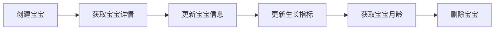
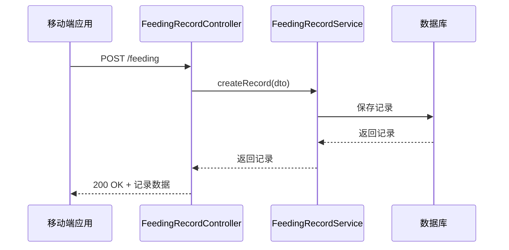
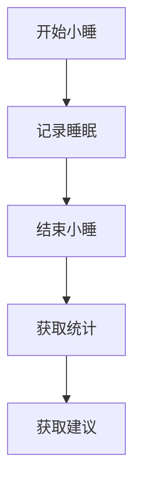
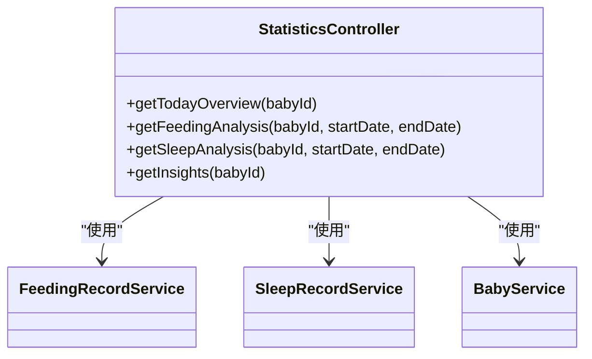

# API接口参考

<cite>
**Referenced Files in This Document**   
- [Result.java](file://backend/src/main/java/com/baby/common/Result.java)
- [BabyController.java](file://backend/src/main/java/com/baby/controller/BabyController.java)
- [FeedingRecordController.java](file://backend/src/main/java/com/baby/controller/FeedingRecordController.java)
- [SleepRecordController.java](file://backend/src/main/java/com/baby/controller/SleepRecordController.java)
- [StatisticsController.java](file://backend/src/main/java/com/baby/controller/StatisticsController.java)
- [ReminderController.java](file://backend/src/main/java/com/baby/controller/ReminderController.java)
- [BabyDTO.java](file://backend/src/main/java/com/baby/dto/BabyDTO.java)
- [FeedingRecordDTO.java](file://backend/src/main/java/com/baby/dto/FeedingRecordDTO.java)
- [SleepRecordDTO.java](file://backend/src/main/java/com/baby/dto/SleepRecordDTO.java)
- [application.yml](file://backend/src/main/resources/application.yml)
- [SecurityConfig.java](file://backend/src/main/java/com/baby/config/SecurityConfig.java)
</cite>

## 目录
1. [简介](#简介)
2. [API基础信息](#api基础信息)
3. [宝宝信息管理](#宝宝信息管理)
4. [喂养记录管理](#喂养记录管理)
5. [睡眠记录管理](#睡眠记录管理)
6. [统计分析](#统计分析)
7. [提醒管理](#提醒管理)
8. [数据传输对象(DTO)](#数据传输对象dto)
9. [响应格式](#响应格式)
10. [认证与安全](#认证与安全)
11. [API文档与版本控制](#api文档与版本控制)

## 简介
本API文档详细描述了babyFeedingReminder后端系统的RESTful接口。系统提供宝宝信息管理、喂养记录、睡眠跟踪、统计分析和提醒管理等功能，支持移动端和Web端的全面集成。

**Section sources**
- [BabyController.java](file://backend/src/main/java/com/baby/controller/BabyController.java#L1-L80)
- [FeedingRecordController.java](file://backend/src/main/java/com/baby/controller/FeedingRecordController.java#L1-L112)

## API基础信息
### 基础URL
```
http://<host>:8080/api
```

### 请求/响应格式
- **Content-Type**: `application/json`
- **Accept**: `application/json`

### 日期时间格式
- **LocalDateTime**: `yyyy-MM-dd'T'HH:mm:ss`
- **LocalDate**: `yyyy-MM-dd`

**Section sources**
- [application.yml](file://backend/src/main/resources/application.yml#L1-L98)

## 宝宝信息管理
提供宝宝基本信息的CRUD操作和生长指标管理。



**Diagram sources**
- [BabyController.java](file://backend/src/main/java/com/baby/controller/BabyController.java#L26-L78)

### 创建宝宝信息
- **URL**: `/baby`
- **方法**: `POST`
- **认证**: 需要`userId`请求头
- **请求参数**:
  - `userId` (header): 用户ID
  - `body` (json): BabyDTO对象

**请求示例**:
```json
{
  "nickname": "小明",
  "birthDate": "2024-01-15",
  "gender": 1,
  "height": 50.5,
  "weight": 3.2
}
```

**响应示例**:
```json
{
  "code": 200,
  "message": "success",
  "data": {
    "id": 1,
    "nickname": "小明",
    "birthDate": "2024-01-15",
    "gender": 1,
    "height": 50.5,
    "weight": 3.2,
    "headCircumference": null,
    "avatarUrl": null,
    "userId": 1,
    "createTime": "2025-01-01T10:00:00",
    "updateTime": "2025-01-01T10:00:00"
  }
}
```

**Section sources**
- [BabyController.java](file://backend/src/main/java/com/baby/controller/BabyController.java#L26-L32)
- [BabyDTO.java](file://backend/src/main/java/com/baby/dto/BabyDTO.java#L1-L48)

### 获取宝宝详情
- **URL**: `/baby/{id}`
- **方法**: `GET`
- **路径参数**:
  - `id`: 宝宝ID

**Section sources**
- [BabyController.java](file://backend/src/main/java/com/baby/controller/BabyController.java#L42-L47)

### 获取用户的所有宝宝
- **URL**: `/baby/list`
- **方法**: `GET`
- **认证**: 需要`userId`请求头

**Section sources**
- [BabyController.java](file://backend/src/main/java/com/baby/controller/BabyController.java#L49-L54)

### 更新宝宝信息
- **URL**: `/baby/{id}`
- **方法**: `PUT`
- **路径参数**:
  - `id`: 宝宝ID
- **请求体**: BabyDTO对象

**Section sources**
- [BabyController.java](file://backend/src/main/java/com/baby/controller/BabyController.java#L34-L40)

### 更新生长指标
- **URL**: `/baby/{id}/growth`
- **方法**: `PUT`
- **路径参数**:
  - `id`: 宝宝ID
- **查询参数**:
  - `height`: 身高(cm)
  - `weight`: 体重(kg)
  - `headCircumference`: 头围(cm)

**Section sources**
- [BabyController.java](file://backend/src/main/java/com/baby/controller/BabyController.java#L56-L64)

### 获取宝宝月龄
- **URL**: `/baby/{id}/age`
- **方法**: `GET`
- **路径参数**:
  - `id`: 宝宝ID
- **响应**: 返回月龄整数

**Section sources**
- [BabyController.java](file://backend/src/main/java/com/baby/controller/BabyController.java#L66-L70)

## 喂养记录管理
提供喂养记录的创建、查询和统计功能。



**Diagram sources**
- [FeedingRecordController.java](file://backend/src/main/java/com/baby/controller/FeedingRecordController.java#L33-L111)

### 创建喂养记录
- **URL**: `/feeding`
- **方法**: `POST`
- **请求体**: FeedingRecordDTO对象

**请求示例**:
```json
{
  "babyId": 1,
  "feedingType": 1,
  "milkSource": 1,
  "startTime": "2025-01-01T08:00:00",
  "endTime": "2025-01-01T08:15:00",
  "amount": 120,
  "duration": 15
}
```

**Section sources**
- [FeedingRecordController.java](file://backend/src/main/java/com/baby/controller/FeedingRecordController.java#L33-L38)
- [FeedingRecordDTO.java](file://backend/src/main/java/com/baby/dto/FeedingRecordDTO.java#L1-L52)

### 获取今日喂养记录
- **URL**: `/feeding/today/{babyId}`
- **方法**: `GET`
- **路径参数**:
  - `babyId`: 宝宝ID

**Section sources**
- [FeedingRecordController.java](file://backend/src/main/java/com/baby/controller/FeedingRecordController.java#L55-L60)

### 获取指定日期范围的喂养记录
- **URL**: `/feeding/range/{babyId}`
- **方法**: `GET`
- **路径参数**:
  - `babyId`: 宝宝ID
- **查询参数**:
  - `startDate`: 开始日期
  - `endDate`: 结束日期

**Section sources**
- [FeedingRecordController.java](file://backend/src/main/java/com/baby/controller/FeedingRecordController.java#L62-L70)

### 获取最近一次喂养记录
- **URL**: `/feeding/last/{babyId}`
- **方法**: `GET`
- **路径参数**:
  - `babyId`: 宝宝ID

**Section sources**
- [FeedingRecordController.java](file://backend/src/main/java/com/baby/controller/FeedingRecordController.java#L72-L77)

### 获取喂养统计
- **URL**: `/feeding/statistics/{babyId}`
- **方法**: `GET`
- **路径参数**:
  - `babyId`: 宝宝ID
- **查询参数**:
  - `startDate`: 开始日期
  - `endDate`: 结束日期

**Section sources**
- [FeedingRecordController.java](file://backend/src/main/java/com/baby/controller/FeedingRecordController.java#L79-L87)

### 获取喂养建议
- **URL**: `/feeding/recommendation/{babyId}`
- **方法**: `GET`
- **路径参数**:
  - `babyId`: 宝宝ID
- **响应**: 基于国家卫健委指南的喂养建议

**Section sources**
- [FeedingRecordController.java](file://backend/src/main/java/com/baby/controller/FeedingRecordController.java#L89-L103)

## 睡眠记录管理
提供睡眠记录的全生命周期管理功能。



**Diagram sources**
- [SleepRecordController.java](file://backend/src/main/java/com/baby/controller/SleepRecordController.java#L34-L137)

### 创建睡眠记录
- **URL**: `/sleep`
- **方法**: `POST`
- **请求体**: SleepRecordDTO对象

**请求示例**:
```json
{
  "babyId": 1,
  "sleepType": 1,
  "startTime": "2025-01-01T13:00:00",
  "endTime": "2025-01-01T14:30:00",
  "duration": 90,
  "quality": 1
}
```

**Section sources**
- [SleepRecordController.java](file://backend/src/main/java/com/baby/controller/SleepRecordController.java#L34-L39)

### 开始小睡
- **URL**: `/sleep/start/{babyId}`
- **方法**: `POST`
- **路径参数**:
  - `babyId`: 宝宝ID
- **查询参数**:
  - `startTime`: 开始时间(可选)

**Section sources**
- [SleepRecordController.java](file://backend/src/main/java/com/baby/controller/SleepRecordController.java#L48-L55)

### 结束小睡
- **URL**: `/sleep/end/{id}`
- **方法**: `POST`
- **路径参数**:
  - `id`: 睡眠记录ID
- **查询参数**:
  - `endTime`: 结束时间(可选)
  - `quality`: 睡眠质量(1-好, 2-一般, 3-差)

**Section sources**
- [SleepRecordController.java](file://backend/src/main/java/com/baby/controller/SleepRecordController.java#L57-L65)

### 获取今日睡眠记录
- **URL**: `/sleep/today/{babyId}`
- **方法**: `GET`
- **路径参数**:
  - `babyId`: 宝宝ID

**Section sources**
- [SleepRecordController.java](file://backend/src/main/java/com/baby/controller/SleepRecordController.java#L82-L87)

### 获取睡眠统计
- **URL**: `/sleep/statistics/{babyId}`
- **方法**: `GET`
- **路径参数**:
  - `babyId`: 宝宝ID
- **查询参数**:
  - `startDate`: 开始日期
  - `endDate`: 结束日期

**Section sources**
- [SleepRecordController.java](file://backend/src/main/java/com/baby/controller/SleepRecordController.java#L106-L114)

### 获取睡眠建议
- **URL**: `/sleep/recommendation/{babyId}`
- **方法**: `GET`
- **路径参数**:
  - `babyId`: 宝宝ID
- **响应**: 基于国家卫健委指南的睡眠建议

**Section sources**
- [SleepRecordController.java](file://backend/src/main/java/com/baby/controller/SleepRecordController.java#L116-L130)

## 统计分析
提供综合性的数据分析和智能洞察功能。



**Diagram sources**
- [StatisticsController.java](file://backend/src/main/java/com/baby/controller/StatisticsController.java#L36-L148)

### 获取今日概览
- **URL**: `/statistics/overview/{babyId}`
- **方法**: `GET`
- **路径参数**:
  - `babyId`: 宝宝ID
- **响应**: 包含今日喂养和睡眠的综合数据

**Section sources**
- [StatisticsController.java](file://backend/src/main/java/com/baby/controller/StatisticsController.java#L36-L71)

### 获取喂养分析
- **URL**: `/statistics/feeding/{babyId}`
- **方法**: `GET`
- **路径参数**:
  - `babyId`: 宝宝ID
- **查询参数**:
  - `startDate`: 开始日期
  - `endDate`: 结束日期

**Section sources**
- [StatisticsController.java](file://backend/src/main/java/com/baby/controller/StatisticsController.java#L73-L81)

### 获取睡眠分析
- **URL**: `/statistics/sleep/{babyId}`
- **方法**: `GET`
- **路径参数**:
  - `babyId`: 宝宝ID
- **查询参数**:
  - `startDate`: 开始日期
  - `endDate`: 结束日期

**Section sources**
- [StatisticsController.java](file://backend/src/main/java/com/baby/controller/StatisticsController.java#L83-L91)

### 获取智能洞察
- **URL**: `/statistics/insights/{babyId}`
- **方法**: `GET`
- **路径参数**:
  - `babyId`: 宝宝ID
- **响应**: 包含喂养洞察、睡眠洞察和个性化建议

**Section sources**
- [StatisticsController.java](file://backend/src/main/java/com/baby/controller/StatisticsController.java#L93-L129)

## 提醒管理
提供提醒的查询和管理功能。

### 获取今日提醒
- **URL**: `/reminder/today/{userId}`
- **方法**: `GET`
- **路径参数**:
  - `userId`: 用户ID

**Section sources**
- [ReminderController.java](file://backend/src/main/java/com/baby/controller/ReminderController.java#L24-L29)

### 获取即将到来的提醒
- **URL**: `/reminder/upcoming/{babyId}`
- **方法**: `GET`
- **路径参数**:
  - `babyId`: 宝宝ID

**Section sources**
- [ReminderController.java](file://backend/src/main/java/com/baby/controller/ReminderController.java#L31-L36)

### 取消提醒
- **URL**: `/reminder/{id}`
- **方法**: `DELETE`
- **路径参数**:
  - `id`: 提醒ID

**Section sources**
- [ReminderController.java](file://backend/src/main/java/com/baby/controller/ReminderController.java#L38-L43)

## 数据传输对象(DTO)
### BabyDTO
用于宝宝信息传输的数据对象。

| 字段 | 类型 | 必填 | 描述 |
|------|------|------|------|
| nickname | string | 是 | 昵称 |
| birthDate | date | 是 | 出生日期 |
| gender | integer | 是 | 性别(1-男, 2-女) |
| gestationalAge | integer | 否 | 出生胎龄(周) |
| height | number | 否 | 身高(cm) |
| weight | number | 否 | 体重(kg) |
| headCircumference | number | 否 | 头围(cm) |
| avatarUrl | string | 否 | 头像URL |

**Section sources**
- [BabyDTO.java](file://backend/src/main/java/com/baby/dto/BabyDTO.java#L1-L48)

### FeedingRecordDTO
用于喂养记录传输的数据对象。

| 字段 | 类型 | 必填 | 描述 |
|------|------|------|------|
| babyId | long | 是 | 宝宝ID |
| feedingType | integer | 是 | 喂养类型 |
| milkSource | integer | 否 | 母乳来源 |
| startTime | datetime | 是 | 开始时间 |
| endTime | datetime | 否 | 结束时间 |
| amount | integer | 否 | 奶量(ml) |
| duration | integer | 否 | 时长(分钟) |
| nextMilkSource | integer | 否 | 下一顿母乳来源 |
| remark | string | 否 | 备注 |

**Section sources**
- [FeedingRecordDTO.java](file://backend/src/main/java/com/baby/dto/FeedingRecordDTO.java#L1-L52)

### SleepRecordDTO
用于睡眠记录传输的数据对象。

| 字段 | 类型 | 必填 | 描述 |
|------|------|------|------|
| babyId | long | 是 | 宝宝ID |
| sleepType | integer | 是 | 睡眠类型 |
| startTime | datetime | 是 | 开始时间 |
| endTime | datetime | 否 | 结束时间 |
| duration | integer | 否 | 实际时长(分钟) |
| plannedDuration | integer | 否 | 计划时长(分钟) |
| quality | integer | 否 | 睡眠质量(1-好, 2-一般, 3-差) |
| remark | string | 否 | 备注 |

**Section sources**
- [SleepRecordDTO.java](file://backend/src/main/java/com/baby/dto/SleepRecordDTO.java#L1-L47)

## 响应格式
所有API响应均使用统一的Result包装格式。

```json
{
  "code": 200,
  "message": "success",
  "data": {}
}
```

### Result结构
| 字段 | 类型 | 描述 |
|------|------|------|
| code | integer | 状态码(200-成功, 500-错误) |
| message | string | 响应消息 |
| data | object | 响应数据(可为空) |

### 常用状态码
| 状态码 | 描述 |
|--------|------|
| 200 | 操作成功 |
| 500 | 服务器错误 |
| 400 | 请求参数错误 |
| 404 | 资源未找到 |

**Section sources**
- [Result.java](file://backend/src/main/java/com/baby/common/Result.java#L1-L54)

## 认证与安全
### 认证机制
系统采用简单的用户ID认证机制，通过请求头传递用户信息。

- **请求头**: `userId`
- **示例**: `userId: 1`

### 安全配置
- CSRF防护: 已禁用
- 会话管理: 无状态(Stateless)
- 敏感接口: 开发阶段全部开放

**Section sources**
- [SecurityConfig.java](file://backend/src/main/java/com/baby/config/SecurityConfig.java#L1-L42)

## API文档与版本控制
### 自动文档
系统集成SpringDoc OpenAPI，自动生成API文档。

- **文档地址**: `/swagger-ui.html`
- **API定义**: `/v3/api-docs`

### 版本控制
当前API为v1版本，通过URL路径进行版本控制。

### 环境配置
- **开发环境**: 启用API文档
- **生产环境**: 禁用API文档

**Section sources**
- [application.yml](file://backend/src/main/resources/application.yml#L93-L98)
- [application-prod.yml](file://backend/src/main/resources/application-prod.yml#L80-L84)