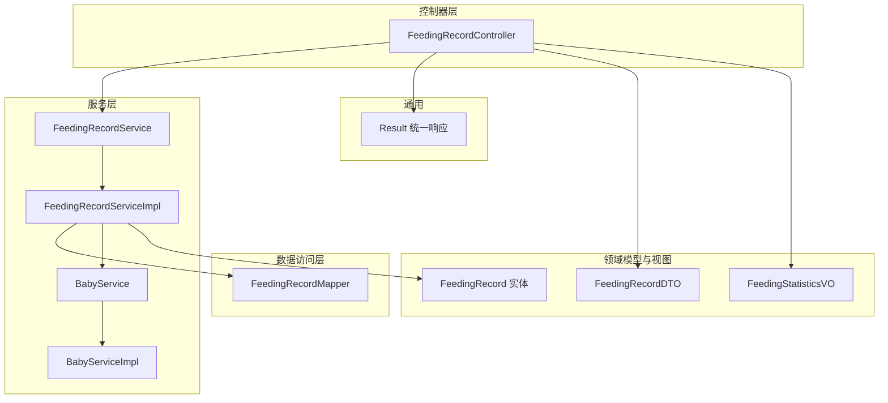
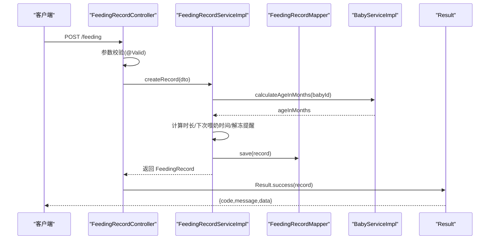
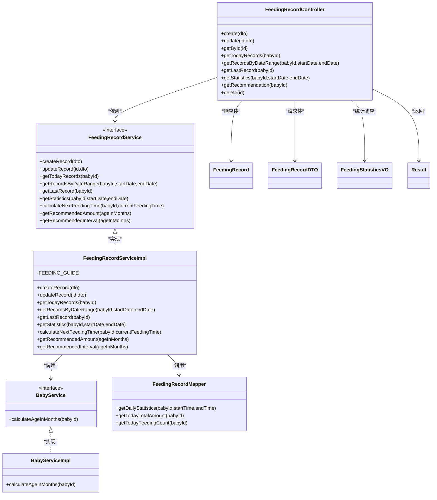

# 喂养记录API

<cite>
**本文引用的文件**
- [FeedingRecordController.java](file://backend/src/main/java/com/baby/controller/FeedingRecordController.java)
- [FeedingRecordService.java](file://backend/src/main/java/com/baby/service/FeedingRecordService.java)
- [FeedingRecordServiceImpl.java](file://backend/src/main/java/com/baby/service/impl/FeedingRecordServiceImpl.java)
- [FeedingRecordDTO.java](file://backend/src/main/java/com/baby/dto/FeedingRecordDTO.java)
- [FeedingRecord.java](file://backend/src/main/java/com/baby/entity/FeedingRecord.java)
- [FeedingStatisticsVO.java](file://backend/src/main/java/com/baby/vo/FeedingStatisticsVO.java)
- [BabyService.java](file://backend/src/main/java/com/baby/service/BabyService.java)
- [BabyServiceImpl.java](file://backend/src/main/java/com/baby/service/impl/BabyServiceImpl.java)
- [FeedingRecordMapper.java](file://backend/src/main/java/com/baby/mapper/FeedingRecordMapper.java)
- [Result.java](file://backend/src/main/java/com/baby/common/Result.java)
- [init.sql](file://backend/src/main/resources/db/init.sql)
</cite>

## 目录
1. [简介](#简介)
2. [项目结构](#项目结构)
3. [核心组件](#核心组件)
4. [架构概览](#架构概览)
5. [详细组件分析](#详细组件分析)
6. [依赖关系分析](#依赖关系分析)
7. [性能考虑](#性能考虑)
8. [故障排查指南](#故障排查指南)
9. [结论](#结论)
10. [附录](#附录)

## 简介
本文件为喂养记录相关 API 的综合文档，覆盖以下端点：
- POST /feeding（创建记录）
- PUT /feeding/{id}（更新记录）
- GET /feeding/{id}（按ID查询）
- GET /feeding/today/{babyId}（今日记录）
- GET /feeding/range/{babyId}（日期范围记录）
- GET /feeding/last/{babyId}（最近一次记录）
- GET /feeding/statistics/{babyId}（喂养统计）
- GET /feeding/recommendation/{babyId}（喂养建议）

文档说明请求/响应模型、参数校验、时间格式、不同喂养类型与母乳来源取值、以及基于国家卫健委指南的喂养建议生成逻辑。同时提供错误场景说明（如无效日期范围、非存在宝宝ID等）。

## 项目结构
后端采用分层架构：Controller -> Service -> Mapper -> Entity/DTO/VO，统一返回包装 Result。

图表来源
- [FeedingRecordController.java](file://backend/src/main/java/com/baby/controller/FeedingRecordController.java#L1-L112)
- [FeedingRecordService.java](file://backend/src/main/java/com/baby/service/FeedingRecordService.java#L1-L60)
- [FeedingRecordServiceImpl.java](file://backend/src/main/java/com/baby/service/impl/FeedingRecordServiceImpl.java#L1-L231)
- [FeedingRecordMapper.java](file://backend/src/main/java/com/baby/mapper/FeedingRecordMapper.java#L1-L46)
- [FeedingRecord.java](file://backend/src/main/java/com/baby/entity/FeedingRecord.java#L1-L81)
- [FeedingRecordDTO.java](file://backend/src/main/java/com/baby/dto/FeedingRecordDTO.java#L1-L52)
- [FeedingStatisticsVO.java](file://backend/src/main/java/com/baby/vo/FeedingStatisticsVO.java#L1-L75)
- [BabyService.java](file://backend/src/main/java/com/baby/service/BabyService.java#L1-L38)
- [BabyServiceImpl.java](file://backend/src/main/java/com/baby/service/impl/BabyServiceImpl.java#L1-L91)
- [Result.java](file://backend/src/main/java/com/baby/common/Result.java#L1-L54)

章节来源
- [FeedingRecordController.java](file://backend/src/main/java/com/baby/controller/FeedingRecordController.java#L1-L112)
- [FeedingRecordService.java](file://backend/src/main/java/com/baby/service/FeedingRecordService.java#L1-L60)
- [FeedingRecordServiceImpl.java](file://backend/src/main/java/com/baby/service/impl/FeedingRecordServiceImpl.java#L1-L231)
- [FeedingRecordMapper.java](file://backend/src/main/java/com/baby/mapper/FeedingRecordMapper.java#L1-L46)
- [FeedingRecord.java](file://backend/src/main/java/com/baby/entity/FeedingRecord.java#L1-L81)
- [FeedingRecordDTO.java](file://backend/src/main/java/com/baby/dto/FeedingRecordDTO.java#L1-L52)
- [FeedingStatisticsVO.java](file://backend/src/main/java/com/baby/vo/FeedingStatisticsVO.java#L1-L75)
- [BabyService.java](file://backend/src/main/java/com/baby/service/BabyService.java#L1-L38)
- [BabyServiceImpl.java](file://backend/src/main/java/com/baby/service/impl/BabyServiceImpl.java#L1-L91)
- [Result.java](file://backend/src/main/java/com/baby/common/Result.java#L1-L54)

## 核心组件
- 控制器：提供 REST API 入口，负责参数接收、参数校验（@Valid）、调用服务并封装统一响应。
- 服务接口与实现：定义业务方法，实现喂养记录 CRUD、统计、推荐、下次喂奶时间计算等。
- 数据访问：通过 MyBatis-Plus Mapper 查询统计、今日总量/次数等。
- 领域模型与视图：实体映射数据库字段；DTO 用于请求输入；VO 用于统计输出。
- 统一响应：Result 包装 code/message/data，便于前端处理。

章节来源
- [FeedingRecordController.java](file://backend/src/main/java/com/baby/controller/FeedingRecordController.java#L1-L112)
- [FeedingRecordService.java](file://backend/src/main/java/com/baby/service/FeedingRecordService.java#L1-L60)
- [FeedingRecordServiceImpl.java](file://backend/src/main/java/com/baby/service/impl/FeedingRecordServiceImpl.java#L1-L231)
- [FeedingRecordMapper.java](file://backend/src/main/java/com/baby/mapper/FeedingRecordMapper.java#L1-L46)
- [FeedingRecord.java](file://backend/src/main/java/com/baby/entity/FeedingRecord.java#L1-L81)
- [FeedingRecordDTO.java](file://backend/src/main/java/com/baby/dto/FeedingRecordDTO.java#L1-L52)
- [FeedingStatisticsVO.java](file://backend/src/main/java/com/baby/vo/FeedingStatisticsVO.java#L1-L75)
- [Result.java](file://backend/src/main/java/com/baby/common/Result.java#L1-L54)

## 架构概览
下面以序列图展示“创建喂养记录”的典型流程。

图表来源
- [FeedingRecordController.java](file://backend/src/main/java/com/baby/controller/FeedingRecordController.java#L33-L40)
- [FeedingRecordServiceImpl.java](file://backend/src/main/java/com/baby/service/impl/FeedingRecordServiceImpl.java#L47-L90)
- [FeedingRecordMapper.java](file://backend/src/main/java/com/baby/mapper/FeedingRecordMapper.java#L1-L46)
- [BabyServiceImpl.java](file://backend/src/main/java/com/baby/service/impl/BabyServiceImpl.java#L81-L91)
- [Result.java](file://backend/src/main/java/com/baby/common/Result.java#L17-L30)

## 详细组件分析

### API 端点与参数规范

- 基础路径
  - 前缀：/feeding
  - 统一响应：Result，包含 code、message、data 字段

- 请求/响应模型
  - 请求体：FeedingRecordDTO
  - 响应体：FeedingRecord 或 FeedingStatisticsVO，由 Result 包裹
  - 时间参数：LocalDate 使用 ISO 8601 日期格式（yyyy-MM-dd），通过 @DateTimeFormat 注解解析

- 参数校验
  - DTO 字段标注 @NotNull，确保关键字段必填
  - 控制器层使用 @Valid 进行整体校验

- 错误处理
  - 更新不存在的记录会抛出异常（服务层）
  - 统一响应 Result.error 用于错误场景

章节来源
- [FeedingRecordController.java](file://backend/src/main/java/com/baby/controller/FeedingRecordController.java#L1-L112)
- [FeedingRecordDTO.java](file://backend/src/main/java/com/baby/dto/FeedingRecordDTO.java#L1-L52)
- [Result.java](file://backend/src/main/java/com/baby/common/Result.java#L1-L54)

### POST /feeding（创建喂养记录）
- 功能：新增一条喂养记录
- 请求体：FeedingRecordDTO
- 行为要点：
  - 自动计算喂养时长（分钟）
  - 计算下次喂奶时间（基于年龄与可选设置）
  - 若下一次母乳来源为冷藏/冷冻，标记需提前解冻并设置提醒分钟数
  - 保存记录并创建相应提醒任务
- 返回：FeedingRecord（Result.success）

章节来源
- [FeedingRecordController.java](file://backend/src/main/java/com/baby/controller/FeedingRecordController.java#L33-L40)
- [FeedingRecordServiceImpl.java](file://backend/src/main/java/com/baby/service/impl/FeedingRecordServiceImpl.java#L47-L90)
- [FeedingRecordMapper.java](file://backend/src/main/java/com/baby/mapper/FeedingRecordMapper.java#L1-L46)

### PUT /feeding/{id}（更新喂养记录）
- 功能：根据记录ID更新喂养记录
- 路径参数：id（Long）
- 请求体：FeedingRecordDTO
- 行为要点：
  - 若 endTime 与 startTime 均提供，则重新计算时长（分钟）
  - 若记录不存在，抛出异常
- 返回：FeedingRecord（Result.success）

章节来源
- [FeedingRecordController.java](file://backend/src/main/java/com/baby/controller/FeedingRecordController.java#L40-L46)
- [FeedingRecordServiceImpl.java](file://backend/src/main/java/com/baby/service/impl/FeedingRecordServiceImpl.java#L92-L114)

### GET /feeding/{id}（按ID查询）
- 功能：获取单条喂养记录详情
- 路径参数：id（Long）
- 返回：FeedingRecord（Result.success）

章节来源
- [FeedingRecordController.java](file://backend/src/main/java/com/baby/controller/FeedingRecordController.java#L48-L53)

### GET /feeding/today/{babyId}（今日记录）
- 功能：获取某宝宝当日所有喂养记录（按开始时间倒序）
- 路径参数：babyId（Long）
- 返回：List<FeedingRecord>（Result.success）

章节来源
- [FeedingRecordController.java](file://backend/src/main/java/com/baby/controller/FeedingRecordController.java#L55-L60)
- [FeedingRecordServiceImpl.java](file://backend/src/main/java/com/baby/service/impl/FeedingRecordServiceImpl.java#L116-L125)

### GET /feeding/range/{babyId}（日期范围记录）
- 功能：获取某宝宝指定日期范围内的喂养记录（按开始时间倒序）
- 路径参数：babyId（Long）
- 查询参数：
  - startDate（LocalDate，ISO 日期）
  - endDate（LocalDate，ISO 日期）
- 返回：List<FeedingRecord>（Result.success）

章节来源
- [FeedingRecordController.java](file://backend/src/main/java/com/baby/controller/FeedingRecordController.java#L62-L70)
- [FeedingRecordServiceImpl.java](file://backend/src/main/java/com/baby/service/impl/FeedingRecordServiceImpl.java#L127-L133)

### GET /feeding/last/{babyId}（最近一次记录）
- 功能：获取某宝宝最近一次喂养记录
- 路径参数：babyId（Long）
- 返回：FeedingRecord（Result.success）

章节来源
- [FeedingRecordController.java](file://backend/src/main/java/com/baby/controller/FeedingRecordController.java#L72-L77)
- [FeedingRecordServiceImpl.java](file://backend/src/main/java/com/baby/service/impl/FeedingRecordServiceImpl.java#L135-L141)

### GET /feeding/statistics/{babyId}（喂养统计）
- 功能：按日期范围统计喂养情况
- 路径参数：babyId（Long）
- 查询参数：
  - startDate（LocalDate，ISO 日期）
  - endDate（LocalDate，ISO 日期）
- 返回：FeedingStatisticsVO（Result.success）
- 统计维度：
  - 总次数、总奶量、日均次数、日均奶量、平均每次奶量
  - 推荐日均奶量与推荐喂养次数（基于年龄）
  - 与推荐值对比（偏低/偏高/正常）
  - 喂养类型比例（母乳、奶粉、混合）

章节来源
- [FeedingRecordController.java](file://backend/src/main/java/com/baby/controller/FeedingRecordController.java#L79-L87)
- [FeedingRecordServiceImpl.java](file://backend/src/main/java/com/baby/service/impl/FeedingRecordServiceImpl.java#L143-L189)
- [FeedingRecordMapper.java](file://backend/src/main/java/com/baby/mapper/FeedingRecordMapper.java#L18-L30)

### GET /feeding/recommendation/{babyId}（喂养建议）
- 功能：基于国家卫健委指南与宝宝月龄，返回推荐奶量与喂养间隔
- 路径参数：babyId（Long）
- 行为要点：
  - 计算月龄（基于出生日期）
  - 根据月龄区间查表得到推荐值
  - 返回 ageInMonths、recommendedAmountPerFeeding、recommendedIntervalMinutes、source
- 返回：Map<String,Object>（Result.success）

章节来源
- [FeedingRecordController.java](file://backend/src/main/java/com/baby/controller/FeedingRecordController.java#L89-L103)
- [FeedingRecordServiceImpl.java](file://backend/src/main/java/com/baby/service/impl/FeedingRecordServiceImpl.java#L191-L216)
- [BabyServiceImpl.java](file://backend/src/main/java/com/baby/service/impl/BabyServiceImpl.java#L81-L91)

### DELETE /feeding/{id}（删除记录）
- 功能：删除指定喂养记录（软删除）
- 路径参数：id（Long）
- 返回：Result.success()

章节来源
- [FeedingRecordController.java](file://backend/src/main/java/com/baby/controller/FeedingRecordController.java#L105-L110)

### 请求/响应模型说明

- FeedingRecordDTO（请求体）
  - 字段含义与约束：
    - babyId：必填
    - feedingType：必填（1-母乳，2-奶粉，3-混合）
    - milkSource：可选（1-亲喂，2-冷藏母乳，3-冷冻母乳）
    - startTime：必填（ISO 8601 时间）
    - endTime：可选（ISO 8601 时间）
    - amount：可选（毫升）
    - duration：可选（分钟）
    - nextMilkSource：可选（用于下次喂奶的母乳来源，2/3 时触发提前解冻）
    - remark：可选（备注）

- FeedingRecord（响应体）
  - 字段含义：
    - 基本字段：id、babyId、feedingType、milkSource、startTime、endTime、amount、duration
    - 预测与提醒：nextFeedingTime、needThaw、thawReminderMinutes
    - 备注与时间戳：remark、createTime、updateTime、deleted

- FeedingStatisticsVO（统计响应体）
  - 字段含义：
    - dateRange：统计日期范围字符串
    - totalCount、totalAmount、dailyAverageAmount、dailyAverageCount、averagePerFeeding
    - recommendedDailyAmount、recommendedDailyCount、comparisonWithRecommended
    - feedingTypeRatio：母乳/奶粉/混合的比例
    - dailyData：每日统计明细（date、count、totalAmount）

章节来源
- [FeedingRecordDTO.java](file://backend/src/main/java/com/baby/dto/FeedingRecordDTO.java#L1-L52)
- [FeedingRecord.java](file://backend/src/main/java/com/baby/entity/FeedingRecord.java#L1-L81)
- [FeedingStatisticsVO.java](file://backend/src/main/java/com/baby/vo/FeedingStatisticsVO.java#L1-L75)

### 时间与日期处理
- LocalDate 参数使用 ISO 8601 日期格式（yyyy-MM-dd），通过 @DateTimeFormat 注解绑定
- 服务层在范围查询中将 LocalDate 转换为当天起止时间进行比较
- 今日统计通过 CURDATE() 计算当日边界

章节来源
- [FeedingRecordController.java](file://backend/src/main/java/com/baby/controller/FeedingRecordController.java#L62-L70)
- [FeedingRecordServiceImpl.java](file://backend/src/main/java/com/baby/service/impl/FeedingRecordServiceImpl.java#L116-L133)
- [FeedingRecordMapper.java](file://backend/src/main/java/com/baby/mapper/FeedingRecordMapper.java#L31-L46)

### 喂养类型与母乳来源取值
- 喂养类型（feedingType）：1-母乳，2-奶粉，3-混合
- 母乳来源（milkSource）：1-亲喂，2-冷藏母乳，3-冷冻母乳
- 下次母乳来源（nextMilkSource）：当为 2 或 3 时，系统会标记需要提前解冻并设置解冻提醒分钟数

章节来源
- [FeedingRecordDTO.java](file://backend/src/main/java/com/baby/dto/FeedingRecordDTO.java#L1-L52)
- [FeedingRecord.java](file://backend/src/main/java/com/baby/entity/FeedingRecord.java#L1-L81)
- [FeedingRecordServiceImpl.java](file://backend/src/main/java/com/baby/service/impl/FeedingRecordServiceImpl.java#L67-L83)

### 喂养建议生成逻辑（基于国家卫健委指南）
- 依据月龄区间查表得到推荐值：
  - 0-1 月：每日次数 8-12 次，每次奶量 60-90 ml，间隔约 2 小时
  - 1-3 月：每日次数 6-8 次，每次奶量 90-120 ml，间隔约 3 小时
  - 3-6 月：每日次数 5-6 次，每次奶量 120-180 ml，间隔约 3 小时
  - 6-9 月：每日次数 4-5 次，每次奶量 180-210 ml，间隔约 4 小时
  - 9-12 月：每日次数 3-4 次，每次奶量 200-240 ml，间隔约 4 小时
  - 12-24 月：每日次数 2-3 次，每次奶量 200-300 ml，间隔约 5 小时
- 控制器根据 babyId 计算月龄，服务层据此查表并返回推荐奶量与间隔（分钟）

章节来源
- [FeedingRecordServiceImpl.java](file://backend/src/main/java/com/baby/service/impl/FeedingRecordServiceImpl.java#L36-L45)
- [FeedingRecordServiceImpl.java](file://backend/src/main/java/com/baby/service/impl/FeedingRecordServiceImpl.java#L205-L216)
- [FeedingRecordController.java](file://backend/src/main/java/com/baby/controller/FeedingRecordController.java#L89-L103)

### 错误场景与处理
- 非法日期范围：若 startDate > endDate，服务层仍按范围查询，但不会匹配到记录；建议前端在调用前校验
- 非存在 babyId：统计与建议会基于年龄计算；若出生日期缺失，月龄可能为 0
- 更新不存在记录：服务层抛出异常，统一由 Result.error 返回
- 参数缺失：DTO 字段 @NotNull 导致校验失败，返回 400

章节来源
- [FeedingRecordController.java](file://backend/src/main/java/com/baby/controller/FeedingRecordController.java#L62-L70)
- [FeedingRecordServiceImpl.java](file://backend/src/main/java/com/baby/service/impl/FeedingRecordServiceImpl.java#L92-L114)
- [FeedingRecordDTO.java](file://backend/src/main/java/com/baby/dto/FeedingRecordDTO.java#L1-L52)
- [Result.java](file://backend/src/main/java/com/baby/common/Result.java#L40-L51)

## 依赖关系分析

图表来源
- [FeedingRecordController.java](file://backend/src/main/java/com/baby/controller/FeedingRecordController.java#L1-L112)
- [FeedingRecordService.java](file://backend/src/main/java/com/baby/service/FeedingRecordService.java#L1-L60)
- [FeedingRecordServiceImpl.java](file://backend/src/main/java/com/baby/service/impl/FeedingRecordServiceImpl.java#L1-L231)
- [BabyService.java](file://backend/src/main/java/com/baby/service/BabyService.java#L1-L38)
- [BabyServiceImpl.java](file://backend/src/main/java/com/baby/service/impl/BabyServiceImpl.java#L1-L91)
- [FeedingRecordMapper.java](file://backend/src/main/java/com/baby/mapper/FeedingRecordMapper.java#L1-L46)
- [FeedingRecord.java](file://backend/src/main/java/com/baby/entity/FeedingRecord.java#L1-L81)
- [FeedingRecordDTO.java](file://backend/src/main/java/com/baby/dto/FeedingRecordDTO.java#L1-L52)
- [FeedingStatisticsVO.java](file://backend/src/main/java/com/baby/vo/FeedingStatisticsVO.java#L1-L75)
- [Result.java](file://backend/src/main/java/com/baby/common/Result.java#L1-L54)

## 性能考虑
- 索引设计：喂养记录表对 baby_id、start_time、(baby_id,start_time) 建有索引，有利于按宝宝与时间范围查询
- 统计查询：Mapper 使用 SQL 聚合，避免应用侧大量遍历
- 事务：创建/更新记录涉及保存与提醒创建，使用 @Transactional 保证一致性
- 建议：
  - 日期范围查询尽量缩小范围，避免跨年度大范围扫描
  - 前端缓存今日数据，减少重复请求

章节来源
- [init.sql](file://backend/src/main/resources/db/init.sql#L43-L63)
- [FeedingRecordMapper.java](file://backend/src/main/java/com/baby/mapper/FeedingRecordMapper.java#L18-L30)
- [FeedingRecordServiceImpl.java](file://backend/src/main/java/com/baby/service/impl/FeedingRecordServiceImpl.java#L47-L90)

## 故障排查指南
- 400 参数校验失败
  - 检查 FeedingRecordDTO 必填字段是否缺失
  - 检查日期参数格式是否为 yyyy-MM-dd
- 404/500 更新不存在记录
  - 确认记录ID是否存在
  - 查看服务层异常消息
- 统计无数据
  - 确认日期范围是否正确
  - 确认 babyId 是否正确
- 建议值异常
  - 检查宝宝出生日期是否正确
  - 确认月龄计算逻辑（基于出生日期与当前日期）

章节来源
- [FeedingRecordDTO.java](file://backend/src/main/java/com/baby/dto/FeedingRecordDTO.java#L1-L52)
- [FeedingRecordController.java](file://backend/src/main/java/com/baby/controller/FeedingRecordController.java#L62-L70)
- [FeedingRecordServiceImpl.java](file://backend/src/main/java/com/baby/service/impl/FeedingRecordServiceImpl.java#L92-L114)
- [BabyServiceImpl.java](file://backend/src/main/java/com/baby/service/impl/BabyServiceImpl.java#L81-L91)

## 结论
本 API 提供了完整的喂养记录生命周期管理能力，涵盖创建、更新、查询、统计与建议生成。通过统一的 DTO/VO 与 Result 包装，接口清晰易用；基于国家卫健委指南的推荐值使喂养行为更具科学性。建议在前端做好参数校验与缓存策略，并在生产环境关注索引与查询范围优化。

## 附录

### 数据库表结构（节选）
- 喂养记录表（feeding_record）
  - 字段：id、baby_id、feeding_type、milk_source、start_time、end_time、amount、duration、next_feeding_time、need_thaw、thaw_reminder_minutes、remark、create_time、update_time、deleted
  - 索引：idx_baby_id、idx_start_time、idx_baby_start

章节来源
- [init.sql](file://backend/src/main/resources/db/init.sql#L43-L63)

### API 端点一览（摘要）
- POST /feeding
- PUT /feeding/{id}
- GET /feeding/{id}
- GET /feeding/today/{babyId}
- GET /feeding/range/{babyId}?startDate={date}&endDate={date}
- GET /feeding/last/{babyId}
- GET /feeding/statistics/{babyId}?startDate={date}&endDate={date}
- GET /feeding/recommendation/{babyId}
- DELETE /feeding/{id}

章节来源
- [FeedingRecordController.java](file://backend/src/main/java/com/baby/controller/FeedingRecordController.java#L33-L110)