# 宝宝管理API

<cite>
**本文引用的文件**
- [BabyController.java](file://backend/src/main/java/com/baby/controller/BabyController.java)
- [BabyService.java](file://backend/src/main/java/com/baby/service/BabyService.java)
- [BabyServiceImpl.java](file://backend/src/main/java/com/baby/service/impl/BabyServiceImpl.java)
- [BabyDTO.java](file://backend/src/main/java/com/baby/dto/BabyDTO.java)
- [Baby.java](file://backend/src/main/java/com/baby/entity/Baby.java)
- [Result.java](file://backend/src/main/java/com/baby/common/Result.java)
- [BabyMapper.java](file://backend/src/main/java/com/baby/mapper/BabyMapper.java)
- [BabyServiceTest.java](file://backend/src/test/java/com/baby/service/BabyServiceTest.java)
</cite>

## 目录
1. [简介](#简介)
2. [项目结构](#项目结构)
3. [核心组件](#核心组件)
4. [架构总览](#架构总览)
5. [详细组件分析](#详细组件分析)
6. [依赖关系分析](#依赖关系分析)
7. [性能与可扩展性](#性能与可扩展性)
8. [故障排查指南](#故障排查指南)
9. [结论](#结论)
10. [附录：请求与响应示例](#附录请求与响应示例)

## 简介
本文件为“宝宝管理”相关API的权威文档，覆盖以下端点：
- POST /baby（创建）
- GET /baby/{id}（查询详情）
- PUT /baby/{id}（更新）
- DELETE /baby/{id}（删除）
- GET /baby/list（按用户列出）
- PUT /baby/{id}/growth（更新生长指标）
- GET /baby/{id}/age（计算月龄）

所有端点均通过统一响应包装器返回，并使用 userId 请求头进行鉴权。业务逻辑由 BabyService 及其实现类处理，数据模型采用 Baby 实体与 BabyDTO。

## 项目结构
- 控制层：BabyController 提供REST接口，负责参数接收、校验与调用服务层。
- 服务层：BabyService 接口定义业务契约；BabyServiceImpl 实现具体逻辑并处理事务。
- 数据访问：BabyMapper 基于 MyBatis-Plus 进行数据库操作。
- 数据模型：Baby 实体映射表字段；BabyDTO 用于入参校验与传输。
- 统一响应：Result 封装标准响应格式（code/message/data）。

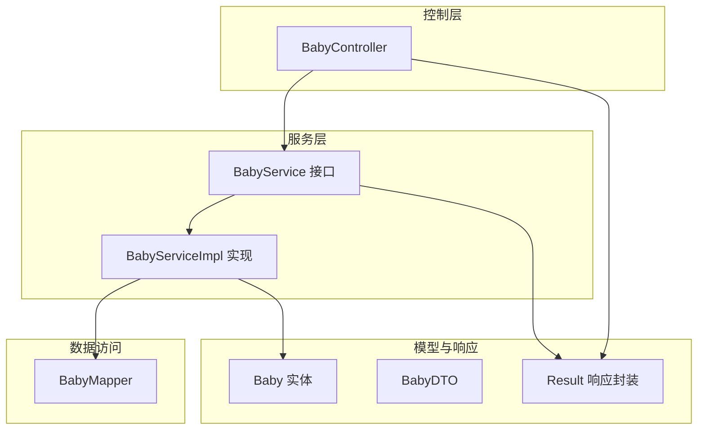

图表来源
- [BabyController.java](file://backend/src/main/java/com/baby/controller/BabyController.java#L1-L80)
- [BabyService.java](file://backend/src/main/java/com/baby/service/BabyService.java#L1-L38)
- [BabyServiceImpl.java](file://backend/src/main/java/com/baby/service/impl/BabyServiceImpl.java#L1-L91)
- [BabyMapper.java](file://backend/src/main/java/com/baby/mapper/BabyMapper.java#L1-L13)
- [Baby.java](file://backend/src/main/java/com/baby/entity/Baby.java#L1-L72)
- [BabyDTO.java](file://backend/src/main/java/com/baby/dto/BabyDTO.java#L1-L48)
- [Result.java](file://backend/src/main/java/com/baby/common/Result.java#L1-L54)

章节来源
- [BabyController.java](file://backend/src/main/java/com/baby/controller/BabyController.java#L1-L80)
- [BabyService.java](file://backend/src/main/java/com/baby/service/BabyService.java#L1-L38)
- [BabyServiceImpl.java](file://backend/src/main/java/com/baby/service/impl/BabyServiceImpl.java#L1-L91)
- [BabyMapper.java](file://backend/src/main/java/com/baby/mapper/BabyMapper.java#L1-L13)
- [Baby.java](file://backend/src/main/java/com/baby/entity/Baby.java#L1-L72)
- [BabyDTO.java](file://backend/src/main/java/com/baby/dto/BabyDTO.java#L1-L48)
- [Result.java](file://backend/src/main/java/com/baby/common/Result.java#L1-L54)

## 核心组件
- 统一响应 Result：提供 success()/error() 静态方法，固定返回 code/message/data 结构，便于前端统一处理。
- DTO 与实体：BabyDTO 用于入参校验（如昵称、出生日期、性别必填），Baby 实体承载持久化字段及时间戳、逻辑删除等。
- 控制器：BabyController 以 RestController 形式暴露端点，使用 RequestHeader 注入 userId，使用 @Valid 对入参进行 Bean Validation 校验。
- 服务层：BabyService 定义业务契约；BabyServiceImpl 实现创建、更新、查询、删除、生长指标更新、月龄计算等逻辑，并在关键路径开启事务。

章节来源
- [Result.java](file://backend/src/main/java/com/baby/common/Result.java#L1-L54)
- [BabyDTO.java](file://backend/src/main/java/com/baby/dto/BabyDTO.java#L1-L48)
- [Baby.java](file://backend/src/main/java/com/baby/entity/Baby.java#L1-L72)
- [BabyController.java](file://backend/src/main/java/com/baby/controller/BabyController.java#L1-L80)
- [BabyService.java](file://backend/src/main/java/com/baby/service/BabyService.java#L1-L38)
- [BabyServiceImpl.java](file://backend/src/main/java/com/baby/service/impl/BabyServiceImpl.java#L1-L91)

## 架构总览
下图展示从客户端到数据库的完整调用链路与职责分工。

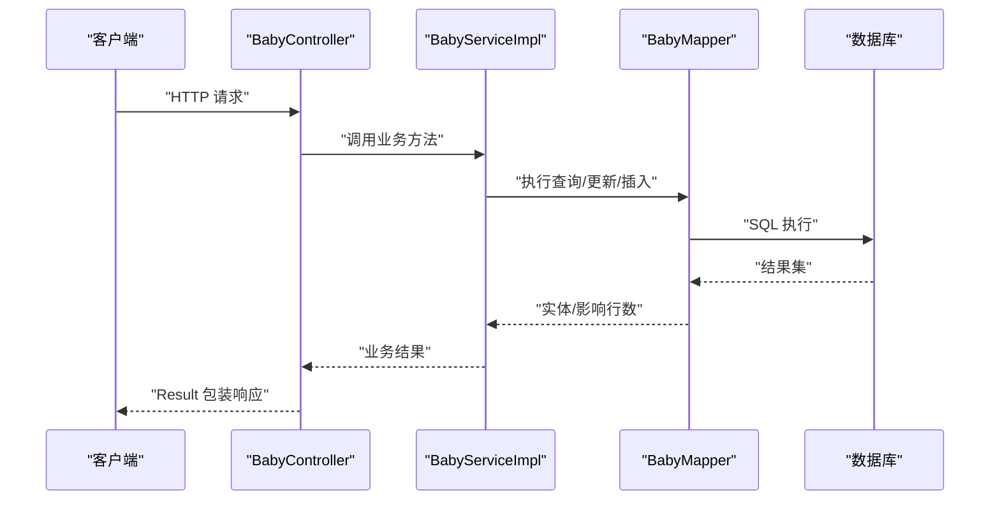

图表来源
- [BabyController.java](file://backend/src/main/java/com/baby/controller/BabyController.java#L1-L80)
- [BabyServiceImpl.java](file://backend/src/main/java/com/baby/service/impl/BabyServiceImpl.java#L1-L91)
- [BabyMapper.java](file://backend/src/main/java/com/baby/mapper/BabyMapper.java#L1-L13)
- [Result.java](file://backend/src/main/java/com/baby/common/Result.java#L1-L54)

## 详细组件分析

### 统一响应 Result
- 成功响应：success() / success(data) / success(message, data) 返回 code=200，message="success"，data 为实际数据。
- 错误响应：error(message) / error(code, message) 返回 code=500 或自定义 code，message 为错误描述。
- 适用范围：所有控制器返回值均通过 Result 包装，保证前后端一致的响应格式。

章节来源
- [Result.java](file://backend/src/main/java/com/baby/common/Result.java#L1-L54)

### 数据模型与校验规则
- Baby 实体字段：包含 id、userId、nickname、birthDate、gender、gestationalAge、height、weight、headCircumference、avatarUrl、createTime、updateTime、deleted 等。
- BabyDTO 字段与校验：
  - nickname：非空
  - birthDate：非空
  - gender：非空（0/1）
  - 其余字段可为空（身高、体重、头围、胎龄、头像URL）
- DTO 与实体映射：服务层将 DTO 转换为实体并持久化，或反向更新实体字段。

章节来源
- [Baby.java](file://backend/src/main/java/com/baby/entity/Baby.java#L1-L72)
- [BabyDTO.java](file://backend/src/main/java/com/baby/dto/BabyDTO.java#L1-L48)

### 端点说明与规范

- 认证与授权
  - 所有端点均通过请求头 userId 进行身份标识。控制器默认值为 1，建议调用方始终传入真实用户ID。
  - 该设计将“用户维度”与“业务实体”解耦，便于后续引入 Spring Security 进行细粒度权限控制。

- 统一响应
  - 所有端点返回 Result<T>，其中 T 为具体业务数据类型（如 Baby、List<Baby>、Integer、Void）。

- 参数校验
  - 使用 @Valid 对请求体进行 Bean Validation 校验；对必填字段缺失时，框架会返回 400 错误。
  - 路径变量与查询参数为可选或数值类型，未强制校验，但服务层会做空值判断与异常处理。

- 错误处理
  - 当更新/生长指标更新/月龄计算涉及不存在的宝宝记录时，服务层抛出运行时异常，控制器未显式捕获，最终由全局异常处理机制转换为 500 错误。
  - 建议在生产环境增加全局异常处理，将业务异常映射为更友好的错误码与消息。

章节来源
- [BabyController.java](file://backend/src/main/java/com/baby/controller/BabyController.java#L1-L80)
- [BabyServiceImpl.java](file://backend/src/main/java/com/baby/service/impl/BabyServiceImpl.java#L1-L91)

### 端点定义与交互流程

#### POST /baby（创建）
- 功能：创建一个宝宝档案
- 请求头
  - userId: Long（必填）
- 请求体
  - BabyDTO（必填）
- 响应
  - Result<Baby>
- 业务流程
  - 控制器接收 userId 与 DTO，调用服务层 createBaby，返回 Result.success(baby)

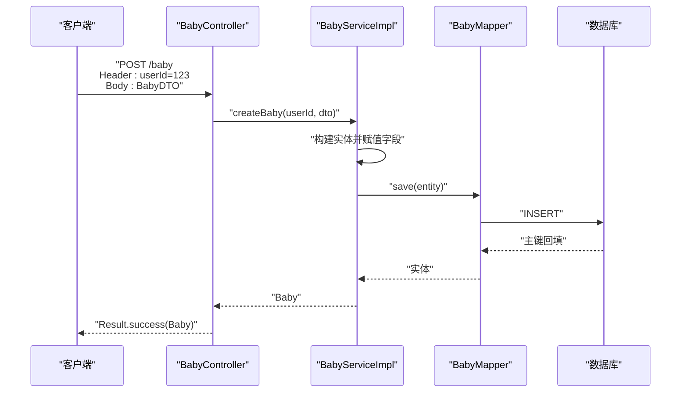

图表来源
- [BabyController.java](file://backend/src/main/java/com/baby/controller/BabyController.java#L26-L32)
- [BabyServiceImpl.java](file://backend/src/main/java/com/baby/service/impl/BabyServiceImpl.java#L24-L39)
- [BabyMapper.java](file://backend/src/main/java/com/baby/mapper/BabyMapper.java#L1-L13)

章节来源
- [BabyController.java](file://backend/src/main/java/com/baby/controller/BabyController.java#L26-L32)
- [BabyServiceImpl.java](file://backend/src/main/java/com/baby/service/impl/BabyServiceImpl.java#L24-L39)

#### GET /baby/{id}（查询详情）
- 功能：根据宝宝ID查询详情
- 路径参数
  - id: Long（必填）
- 响应
  - Result<Baby>

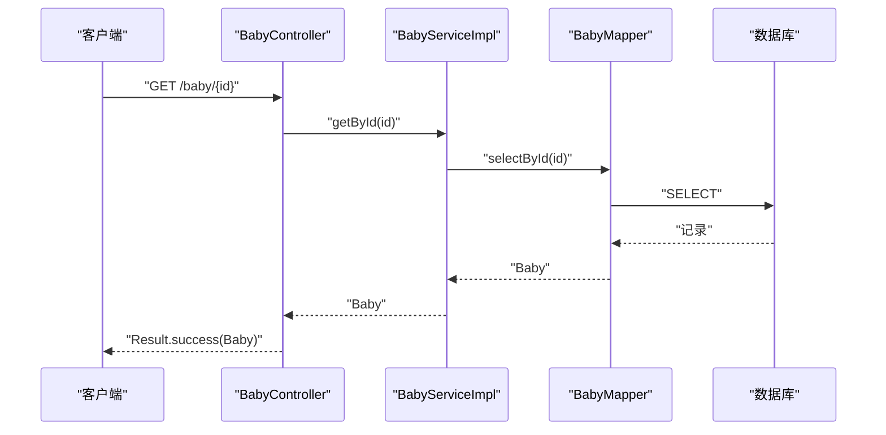

图表来源
- [BabyController.java](file://backend/src/main/java/com/baby/controller/BabyController.java#L42-L47)
- [BabyServiceImpl.java](file://backend/src/main/java/com/baby/service/impl/BabyServiceImpl.java#L1-L91)
- [BabyMapper.java](file://backend/src/main/java/com/baby/mapper/BabyMapper.java#L1-L13)

章节来源
- [BabyController.java](file://backend/src/main/java/com/baby/controller/BabyController.java#L42-L47)
- [BabyServiceImpl.java](file://backend/src/main/java/com/baby/service/impl/BabyServiceImpl.java#L1-L91)

#### PUT /baby/{id}（更新）
- 功能：更新宝宝档案
- 路径参数
  - id: Long（必填）
- 请求体
  - BabyDTO（必填）
- 响应
  - Result<Baby>
- 异常
  - 若不存在对应宝宝，服务层抛出异常，最终返回 500

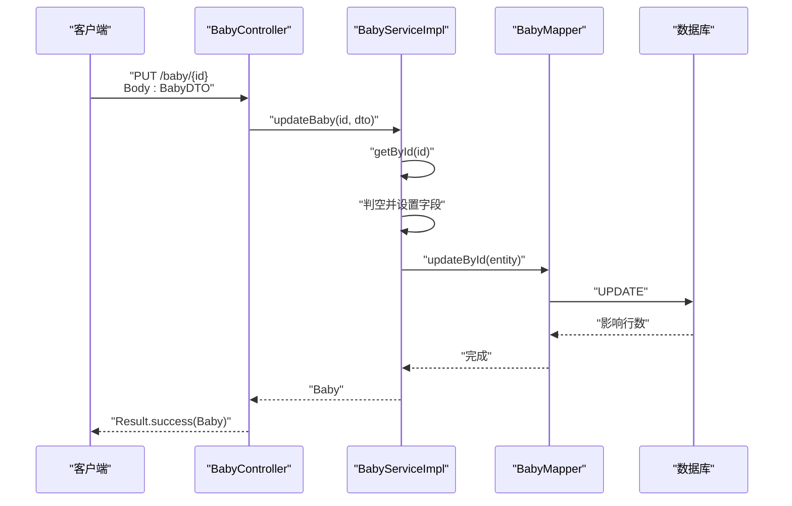

图表来源
- [BabyController.java](file://backend/src/main/java/com/baby/controller/BabyController.java#L34-L40)
- [BabyServiceImpl.java](file://backend/src/main/java/com/baby/service/impl/BabyServiceImpl.java#L41-L58)
- [BabyMapper.java](file://backend/src/main/java/com/baby/mapper/BabyMapper.java#L1-L13)

章节来源
- [BabyController.java](file://backend/src/main/java/com/baby/controller/BabyController.java#L34-L40)
- [BabyServiceImpl.java](file://backend/src/main/java/com/baby/service/impl/BabyServiceImpl.java#L41-L58)

#### DELETE /baby/{id}（删除）
- 功能：删除指定宝宝档案
- 路径参数
  - id: Long（必填）
- 响应
  - Result<Void>

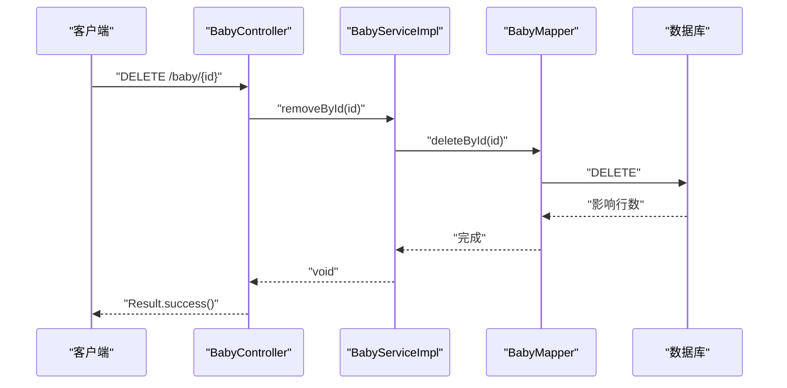

图表来源
- [BabyController.java](file://backend/src/main/java/com/baby/controller/BabyController.java#L73-L78)
- [BabyServiceImpl.java](file://backend/src/main/java/com/baby/service/impl/BabyServiceImpl.java#L1-L91)
- [BabyMapper.java](file://backend/src/main/java/com/baby/mapper/BabyMapper.java#L1-L13)

章节来源
- [BabyController.java](file://backend/src/main/java/com/baby/controller/BabyController.java#L73-L78)
- [BabyServiceImpl.java](file://backend/src/main/java/com/baby/service/impl/BabyServiceImpl.java#L1-L91)

#### GET /baby/list（按用户列出）
- 功能：列出当前用户的所有宝宝档案
- 请求头
  - userId: Long（必填）
- 响应
  - Result<List<Baby>>
- 排序
  - 按创建时间倒序

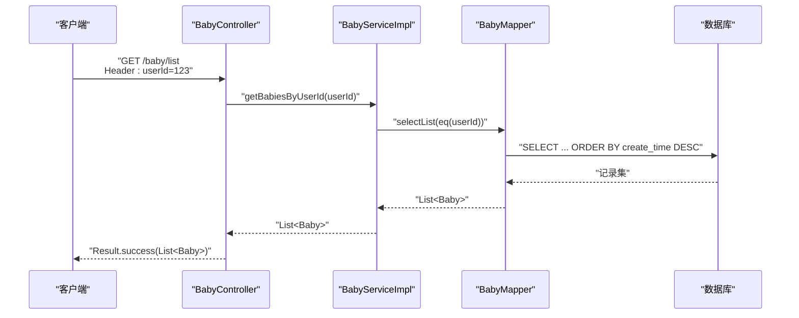

图表来源
- [BabyController.java](file://backend/src/main/java/com/baby/controller/BabyController.java#L49-L54)
- [BabyServiceImpl.java](file://backend/src/main/java/com/baby/service/impl/BabyServiceImpl.java#L60-L65)
- [BabyMapper.java](file://backend/src/main/java/com/baby/mapper/BabyMapper.java#L1-L13)

章节来源
- [BabyController.java](file://backend/src/main/java/com/baby/controller/BabyController.java#L49-L54)
- [BabyServiceImpl.java](file://backend/src/main/java/com/baby/service/impl/BabyServiceImpl.java#L60-L65)

#### PUT /baby/{id}/growth（更新生长指标）
- 功能：更新身高、体重、头围三项指标（可部分更新）
- 路径参数
  - id: Long（必填）
- 查询参数
  - height: Double（可选）
  - weight: Double（可选）
  - headCircumference: Double（可选）
- 响应
  - Result<Baby>
- 异常
  - 若不存在对应宝宝，服务层抛出异常，最终返回 500

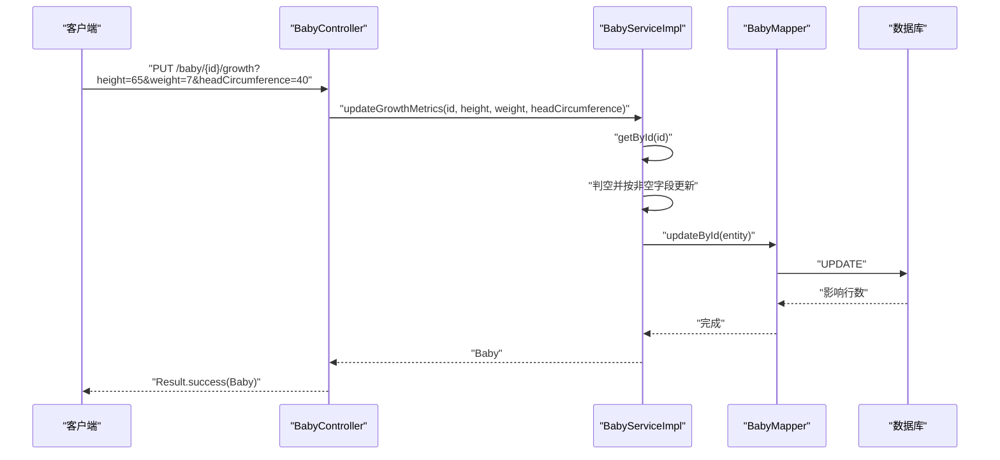

图表来源
- [BabyController.java](file://backend/src/main/java/com/baby/controller/BabyController.java#L56-L64)
- [BabyServiceImpl.java](file://backend/src/main/java/com/baby/service/impl/BabyServiceImpl.java#L67-L79)
- [BabyMapper.java](file://backend/src/main/java/com/baby/mapper/BabyMapper.java#L1-L13)

章节来源
- [BabyController.java](file://backend/src/main/java/com/baby/controller/BabyController.java#L56-L64)
- [BabyServiceImpl.java](file://backend/src/main/java/com/baby/service/impl/BabyServiceImpl.java#L67-L79)

#### GET /baby/{id}/age（计算月龄）
- 功能：根据出生日期计算当前月龄（整月）
- 路径参数
  - id: Long（必填）
- 响应
  - Result<Integer>
- 异常
  - 若不存在对应宝宝或出生日期为空，返回 0

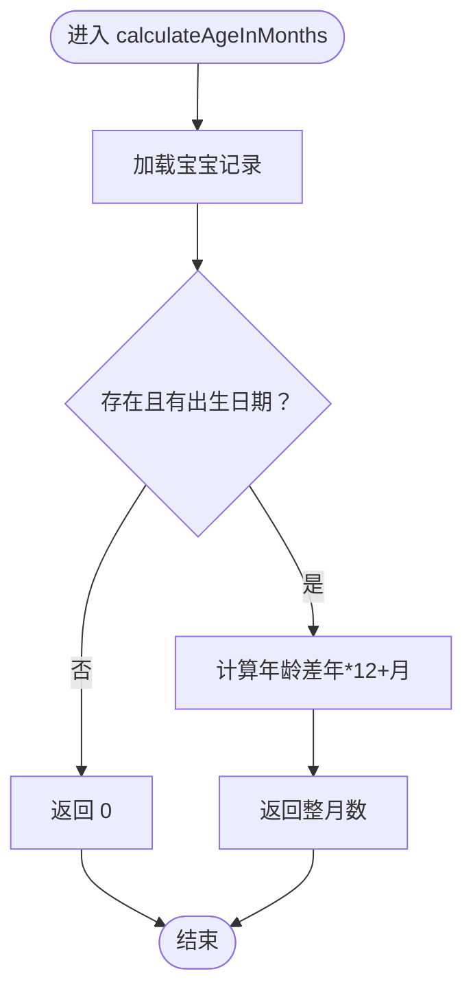

图表来源
- [BabyServiceImpl.java](file://backend/src/main/java/com/baby/service/impl/BabyServiceImpl.java#L81-L90)

章节来源
- [BabyController.java](file://backend/src/main/java/com/baby/controller/BabyController.java#L66-L71)
- [BabyServiceImpl.java](file://backend/src/main/java/com/baby/service/impl/BabyServiceImpl.java#L81-L90)

### 业务逻辑与数据流

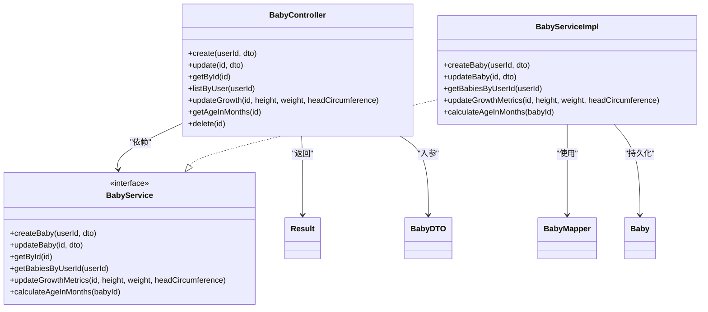

图表来源
- [BabyController.java](file://backend/src/main/java/com/baby/controller/BabyController.java#L1-L80)
- [BabyService.java](file://backend/src/main/java/com/baby/service/BabyService.java#L1-L38)
- [BabyServiceImpl.java](file://backend/src/main/java/com/baby/service/impl/BabyServiceImpl.java#L1-L91)
- [BabyMapper.java](file://backend/src/main/java/com/baby/mapper/BabyMapper.java#L1-L13)
- [Baby.java](file://backend/src/main/java/com/baby/entity/Baby.java#L1-L72)
- [BabyDTO.java](file://backend/src/main/java/com/baby/dto/BabyDTO.java#L1-L48)
- [Result.java](file://backend/src/main/java/com/baby/common/Result.java#L1-L54)

## 依赖关系分析
- 控制器依赖服务接口，服务实现依赖 Mapper 与实体。
- DTO 仅用于入参校验与数据传输，不直接参与持久化。
- 统一响应 Result 在控制器与服务层之间形成横切关注点，简化了错误与成功路径的表达。

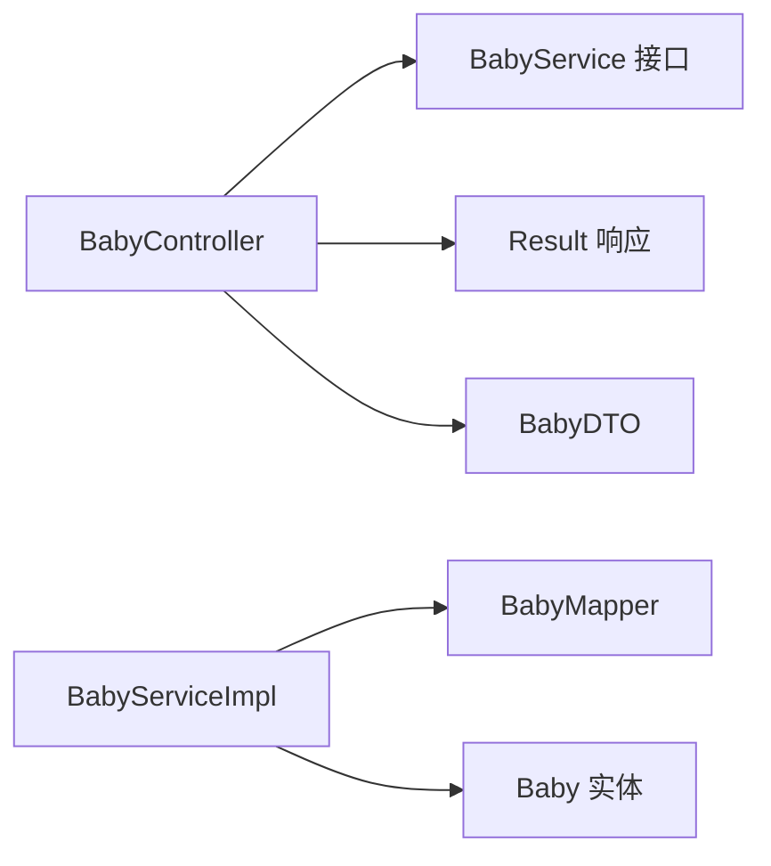

图表来源
- [BabyController.java](file://backend/src/main/java/com/baby/controller/BabyController.java#L1-L80)
- [BabyService.java](file://backend/src/main/java/com/baby/service/BabyService.java#L1-L38)
- [BabyServiceImpl.java](file://backend/src/main/java/com/baby/service/impl/BabyServiceImpl.java#L1-L91)
- [BabyMapper.java](file://backend/src/main/java/com/baby/mapper/BabyMapper.java#L1-L13)
- [Baby.java](file://backend/src/main/java/com/baby/entity/Baby.java#L1-L72)
- [BabyDTO.java](file://backend/src/main/java/com/baby/dto/BabyDTO.java#L1-L48)
- [Result.java](file://backend/src/main/java/com/baby/common/Result.java#L1-L54)

章节来源
- [BabyController.java](file://backend/src/main/java/com/baby/controller/BabyController.java#L1-L80)
- [BabyService.java](file://backend/src/main/java/com/baby/service/BabyService.java#L1-L38)
- [BabyServiceImpl.java](file://backend/src/main/java/com/baby/service/impl/BabyServiceImpl.java#L1-L91)
- [BabyMapper.java](file://backend/src/main/java/com/baby/mapper/BabyMapper.java#L1-L13)
- [Baby.java](file://backend/src/main/java/com/baby/entity/Baby.java#L1-L72)
- [BabyDTO.java](file://backend/src/main/java/com/baby/dto/BabyDTO.java#L1-L48)
- [Result.java](file://backend/src/main/java/com/baby/common/Result.java#L1-L54)

## 性能与可扩展性
- 事务边界：创建、更新、生长指标更新均在事务内执行，确保一致性。
- 查询优化：按用户查询时使用等值过滤与排序，建议在 userId 上建立索引以提升性能。
- DTO 映射：服务层逐字段映射，避免不必要的对象转换开销。
- 年龄计算：使用标准库 Period 计算，复杂度低，适合高频调用。
- 建议
  - 引入全局异常处理，将业务异常映射为 4xx 错误，提升可观测性。
  - 对高频端点增加缓存策略（如月龄、列表），降低数据库压力。
  - 对生日日期字段增加唯一性约束（同一用户下），避免重复宝宝。

[本节为通用建议，无需特定文件来源]

## 故障排查指南
- 400 错误（参数校验失败）
  - 症状：请求体缺少必填字段（如 nickname、birthDate、gender）。
  - 处理：补齐必填字段，确保类型正确。
- 500 错误（业务异常）
  - 症状：更新/生长指标更新/月龄计算时提示“宝宝信息不存在”。
  - 原因：目标宝宝ID不存在或已被删除。
  - 处理：确认ID有效，或先创建后再更新。
- 404 错误（资源不存在）
  - 症状：查询详情或删除时返回 404。
  - 处理：检查ID是否正确，确认用户维度是否匹配。
- 500 错误（系统异常）
  - 症状：数据库异常或未知错误。
  - 处理：查看服务日志，定位异常堆栈；必要时增加全局异常处理。

章节来源
- [BabyServiceImpl.java](file://backend/src/main/java/com/baby/service/impl/BabyServiceImpl.java#L41-L58)
- [BabyServiceImpl.java](file://backend/src/main/java/com/baby/service/impl/BabyServiceImpl.java#L67-L79)
- [BabyServiceImpl.java](file://backend/src/main/java/com/baby/service/impl/BabyServiceImpl.java#L81-L90)

## 结论
本API围绕“宝宝管理”提供了完整的增删改查与生长指标维护能力，并通过统一响应包装与 Bean Validation 校验提升了可用性与一致性。月龄计算作为关键业务指标，为后续生成年龄相关的推荐与提醒提供了基础。建议在生产环境中完善异常处理与缓存策略，进一步提升稳定性与性能。

[本节为总结，无需特定文件来源]

## 附录：请求与响应示例

- 请求头
  - Header: userId=123

- 创建宝宝（POST /baby）
  - 请求体（BabyDTO）
    - nickname: 字符串（必填）
    - birthDate: 日期（必填，ISO-8601）
    - gender: 整数（必填，0/1）
    - gestationalAge: 整数（可选）
    - height: 浮点数（可选）
    - weight: 浮点数（可选）
    - headCircumference: 浮点数（可选）
    - avatarUrl: 字符串（可选）
  - 响应体（Result<Baby>）
    - code: 200
    - message: "success"
    - data: 完整的 Baby 实体

- 更新宝宝（PUT /baby/{id}）
  - 路径参数: id=1
  - 请求体（BabyDTO）
    - 同上（可只传需要更新的字段）
  - 响应体（Result<Baby>）
    - code: 200
    - message: "success"
    - data: 更新后的 Baby 实体

- 查询详情（GET /baby/{id}）
  - 路径参数: id=1
  - 响应体（Result<Baby>）
    - code: 200
    - message: "success"
    - data: 对应 Baby 实体

- 列出用户宝宝（GET /baby/list）
  - 请求头: userId=123
  - 响应体（Result<List<Baby>>）
    - code: 200
    - message: "success"
    - data: 按创建时间倒序的 Baby 列表

- 更新生长指标（PUT /baby/{id}/growth）
  - 路径参数: id=1
  - 查询参数:
    - height=65.0（可选）
    - weight=7.0（可选）
    - headCircumference=40.0（可选）
  - 响应体（Result<Baby>）
    - code: 200
    - message: "success"
    - data: 更新后的 Baby 实体

- 计算月龄（GET /baby/{id}/age）
  - 路径参数: id=1
  - 响应体（Result<Integer>）
    - code: 200
    - message: "success"
    - data: 整数（月龄）

- 删除宝宝（DELETE /baby/{id}）
  - 路径参数: id=1
  - 响应体（Result<Void>）
    - code: 200
    - message: "success"
    - data: null

章节来源
- [BabyController.java](file://backend/src/main/java/com/baby/controller/BabyController.java#L26-L78)
- [BabyServiceImpl.java](file://backend/src/main/java/com/baby/service/impl/BabyServiceImpl.java#L24-L39)
- [BabyServiceImpl.java](file://backend/src/main/java/com/baby/service/impl/BabyServiceImpl.java#L41-L58)
- [BabyServiceImpl.java](file://backend/src/main/java/com/baby/service/impl/BabyServiceImpl.java#L67-L79)
- [BabyServiceImpl.java](file://backend/src/main/java/com/baby/service/impl/BabyServiceImpl.java#L81-L90)
- [BabyDTO.java](file://backend/src/main/java/com/baby/dto/BabyDTO.java#L1-L48)
- [Baby.java](file://backend/src/main/java/com/baby/entity/Baby.java#L1-L72)
- [Result.java](file://backend/src/main/java/com/baby/common/Result.java#L1-L54)
- [BabyServiceTest.java](file://backend/src/test/java/com/baby/service/BabyServiceTest.java#L1-L70)