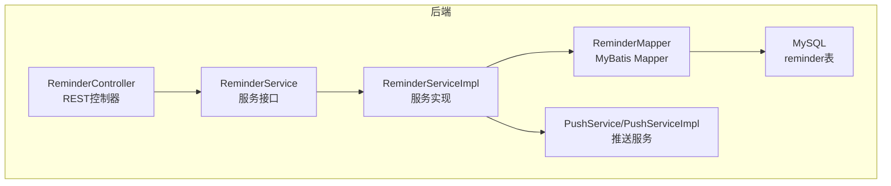
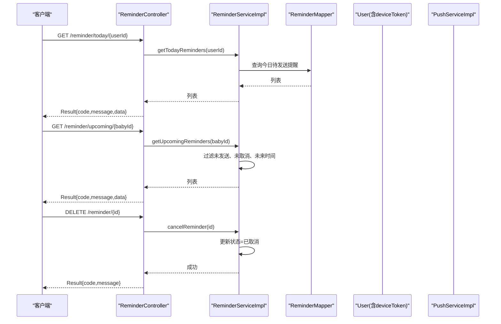
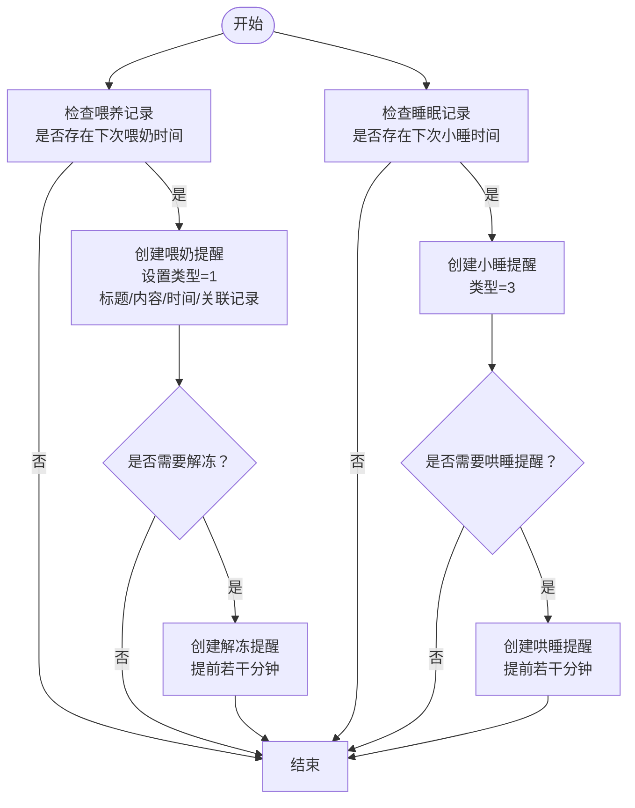
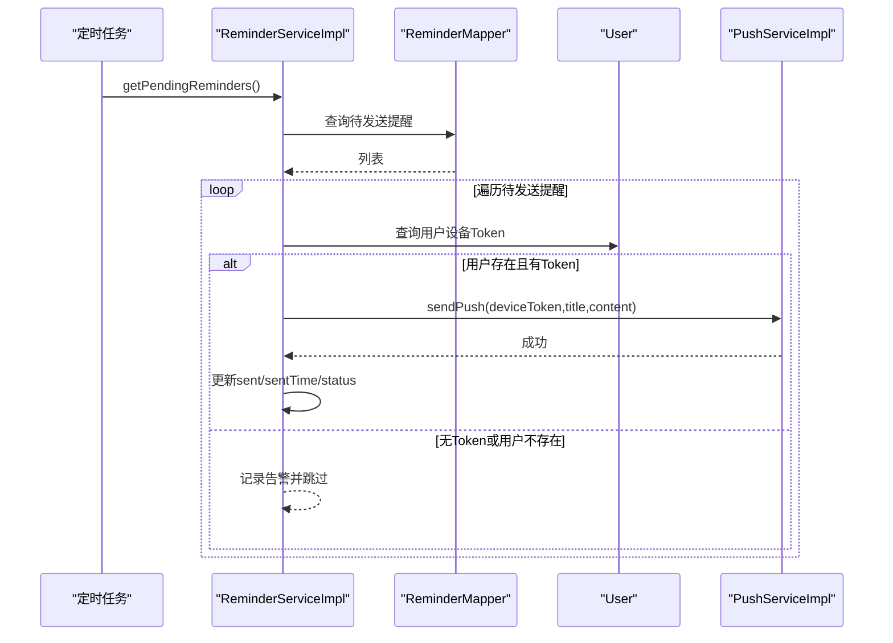
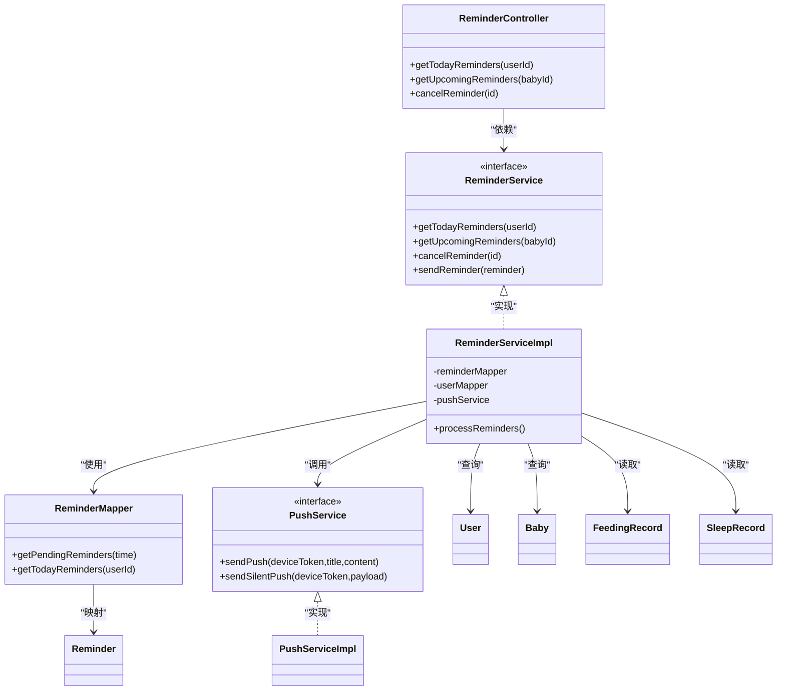

# 提醒通知API

<cite>
**本文引用的文件**
- [ReminderController.java](file://backend/src/main/java/com/baby/controller/ReminderController.java)
- [ReminderService.java](file://backend/src/main/java/com/baby/service/ReminderService.java)
- [ReminderServiceImpl.java](file://backend/src/main/java/com/baby/service/impl/ReminderServiceImpl.java)
- [ReminderMapper.java](file://backend/src/main/java/com/baby/mapper/ReminderMapper.java)
- [Reminder.java](file://backend/src/main/java/com/baby/entity/Reminder.java)
- [PushService.java](file://backend/src/main/java/com/baby/service/PushService.java)
- [PushServiceImpl.java](file://backend/src/main/java/com/baby/service/impl/PushServiceImpl.java)
- [Result.java](file://backend/src/main/java/com/baby/common/Result.java)
- [application.yml](file://backend/src/main/resources/application.yml)
- [init.sql](file://backend/src/main/resources/db/init.sql)
- [SecurityConfig.java](file://backend/src/main/java/com/baby/config/SecurityConfig.java)
- [User.java](file://backend/src/main/java/com/baby/entity/User.java)
- [Baby.java](file://backend/src/main/java/com/baby/entity/Baby.java)
- [FeedingRecord.java](file://backend/src/main/java/com/baby/entity/FeedingRecord.java)
- [SleepRecord.java](file://backend/src/main/java/com/baby/entity/SleepRecord.java)
</cite>

## 目录
1. [简介](#简介)
2. [项目结构](#项目结构)
3. [核心组件](#核心组件)
4. [架构总览](#架构总览)
5. [详细组件分析](#详细组件分析)
6. [依赖关系分析](#依赖关系分析)
7. [性能考量](#性能考量)
8. [故障排查指南](#故障排查指南)
9. [结论](#结论)
10. [附录](#附录)

## 简介
本文件为提醒通知相关API的权威文档，覆盖以下三个端点：
- GET /reminder/today/{userId}：获取某用户的“今日待发送”提醒列表
- GET /reminder/upcoming/{babyId}：获取某宝宝“即将到来”的提醒（未发送、未取消、未来时间）
- DELETE /reminder/{id}：取消某个提醒（逻辑更新状态为“已取消”）

同时，文档详细说明提醒实体结构、提醒生成规则（基于喂养间隔、睡眠模式、母乳解冻计划）、与推送系统的集成方式、数据库中取消提醒的处理策略，并给出典型请求/响应示例与错误场景说明。最后阐述安全模型：用户仅能访问其关联宝宝的提醒。

## 项目结构
后端采用Spring Boot + MyBatis Plus，控制器位于controller包，服务层位于service包，实体与映射位于entity与mapper包，统一响应封装在common包。数据库初始化脚本包含提醒任务表结构及索引。

图表来源
- [ReminderController.java](file://backend/src/main/java/com/baby/controller/ReminderController.java#L1-L44)
- [ReminderService.java](file://backend/src/main/java/com/baby/service/ReminderService.java#L1-L63)
- [ReminderServiceImpl.java](file://backend/src/main/java/com/baby/service/impl/ReminderServiceImpl.java#L1-L241)
- [ReminderMapper.java](file://backend/src/main/java/com/baby/mapper/ReminderMapper.java#L1-L34)
- [PushService.java](file://backend/src/main/java/com/baby/service/PushService.java#L1-L22)
- [PushServiceImpl.java](file://backend/src/main/java/com/baby/service/impl/PushServiceImpl.java#L1-L67)
- [init.sql](file://backend/src/main/resources/db/init.sql#L121-L141)

章节来源
- [ReminderController.java](file://backend/src/main/java/com/baby/controller/ReminderController.java#L1-L44)
- [ReminderService.java](file://backend/src/main/java/com/baby/service/ReminderService.java#L1-L63)
- [ReminderServiceImpl.java](file://backend/src/main/java/com/baby/service/impl/ReminderServiceImpl.java#L1-L241)
- [ReminderMapper.java](file://backend/src/main/java/com/baby/mapper/ReminderMapper.java#L1-L34)
- [init.sql](file://backend/src/main/resources/db/init.sql#L121-L141)

## 核心组件
- 控制器：提供三个REST端点，返回统一响应包装。
- 服务接口与实现：负责提醒的创建、查询、发送、取消；定时扫描待发送提醒并触发推送。
- Mapper：提供SQL查询待发送与今日提醒。
- 实体：定义提醒字段、状态、类型等。
- 推送服务：封装APNs推送能力（当前为占位实现，支持开关与主题配置）。
- 统一响应：Result封装code、message、data。

章节来源
- [ReminderController.java](file://backend/src/main/java/com/baby/controller/ReminderController.java#L1-L44)
- [ReminderService.java](file://backend/src/main/java/com/baby/service/ReminderService.java#L1-L63)
- [ReminderServiceImpl.java](file://backend/src/main/java/com/baby/service/impl/ReminderServiceImpl.java#L1-L241)
- [ReminderMapper.java](file://backend/src/main/java/com/baby/mapper/ReminderMapper.java#L1-L34)
- [Reminder.java](file://backend/src/main/java/com/baby/entity/Reminder.java#L1-L76)
- [PushService.java](file://backend/src/main/java/com/baby/service/PushService.java#L1-L22)
- [PushServiceImpl.java](file://backend/src/main/java/com/baby/service/impl/PushServiceImpl.java#L1-L67)
- [Result.java](file://backend/src/main/java/com/baby/common/Result.java#L1-L54)

## 架构总览
提醒系统的关键流程包括：
- 自动提醒生成：基于喂养记录与睡眠记录的下次时间、间隔与提前分钟数，自动生成喂奶、解冻、小睡、哄睡提醒。
- 定时发送：每分钟扫描一次待发送提醒，调用推送服务并更新状态。
- API访问控制：通过安全配置与业务查询条件，确保用户只能看到自己关联宝宝的提醒。
- 取消提醒：将提醒状态更新为“已取消”，不再发送。

图表来源
- [ReminderController.java](file://backend/src/main/java/com/baby/controller/ReminderController.java#L1-L44)
- [ReminderServiceImpl.java](file://backend/src/main/java/com/baby/service/impl/ReminderServiceImpl.java#L166-L211)
- [ReminderMapper.java](file://backend/src/main/java/com/baby/mapper/ReminderMapper.java#L1-L34)
- [PushServiceImpl.java](file://backend/src/main/java/com/baby/service/impl/PushServiceImpl.java#L1-L67)

## 详细组件分析

### API定义与行为
- GET /reminder/today/{userId}
  - 功能：返回指定用户当天“待发送”的提醒列表。
  - 查询条件：用户ID匹配、状态=待发送、未逻辑删除、日期等于当日。
  - 返回：统一响应，data为提醒列表。
- GET /reminder/upcoming/{babyId}
  - 功能：返回指定宝宝“即将到来”的提醒（未发送、未取消、未来时间），按时间升序，限制数量。
  - 返回：统一响应，data为提醒列表。
- DELETE /reminder/{id}
  - 功能：取消指定提醒（逻辑更新状态为“已取消”）。
  - 返回：统一响应，无data。

章节来源
- [ReminderController.java](file://backend/src/main/java/com/baby/controller/ReminderController.java#L24-L43)
- [ReminderMapper.java](file://backend/src/main/java/com/baby/mapper/ReminderMapper.java#L26-L34)
- [ReminderServiceImpl.java](file://backend/src/main/java/com/baby/service/impl/ReminderServiceImpl.java#L166-L181)
- [ReminderServiceImpl.java](file://backend/src/main/java/com/baby/service/impl/ReminderServiceImpl.java#L213-L219)

### 提醒实体结构
提醒实体包含以下关键字段：
- 标识与归属：id、babyId、userId
- 类型：reminderType（1-喂奶 2-解冻 3-小睡 4-哄睡）
- 标题与内容：title、content
- 时间：scheduledTime（预定提醒时间）、sent（是否已发送）、sentTime（发送时间）
- 关联：relatedRecordId（关联喂养或睡眠记录）
- 状态：status（0-待发送 1-已发送 2-已取消）
- 其他：创建/更新时间、逻辑删除标记

章节来源
- [Reminder.java](file://backend/src/main/java/com/baby/entity/Reminder.java#L1-L76)
- [init.sql](file://backend/src/main/resources/db/init.sql#L121-L141)

### 提醒生成机制
提醒由喂养记录与睡眠记录驱动，自动创建：
- 喂奶提醒：基于下次喂奶时间，创建喂奶提醒；若需要解冻，则提前若干分钟创建解冻提醒。
- 小睡提醒：基于下次小睡时间，创建小睡提醒；若需要哄睡提醒，则提前若干分钟创建。
- 哄睡提醒：由小睡提醒派生，提前若干分钟创建。

图表来源
- [ReminderServiceImpl.java](file://backend/src/main/java/com/baby/service/impl/ReminderServiceImpl.java#L37-L101)
- [ReminderServiceImpl.java](file://backend/src/main/java/com/baby/service/impl/ReminderServiceImpl.java#L103-L164)
- [FeedingRecord.java](file://backend/src/main/java/com/baby/entity/FeedingRecord.java#L1-L81)
- [SleepRecord.java](file://backend/src/main/java/com/baby/entity/SleepRecord.java#L1-L76)

章节来源
- [ReminderServiceImpl.java](file://backend/src/main/java/com/baby/service/impl/ReminderServiceImpl.java#L37-L101)
- [ReminderServiceImpl.java](file://backend/src/main/java/com/baby/service/impl/ReminderServiceImpl.java#L103-L164)
- [FeedingRecord.java](file://backend/src/main/java/com/baby/entity/FeedingRecord.java#L1-L81)
- [SleepRecord.java](file://backend/src/main/java/com/baby/entity/SleepRecord.java#L1-L76)

### 推送系统集成
- 触发时机：定时任务每分钟扫描待发送提醒，调用推送服务。
- 推送内容：使用提醒的标题与内容，向用户设备Token发送通知。
- 状态更新：推送成功后，更新sent、sentTime、status为“已发送”。

图表来源
- [ReminderServiceImpl.java](file://backend/src/main/java/com/baby/service/impl/ReminderServiceImpl.java#L183-L211)
- [PushServiceImpl.java](file://backend/src/main/java/com/baby/service/impl/PushServiceImpl.java#L1-L67)
- [User.java](file://backend/src/main/java/com/baby/entity/User.java#L1-L71)

章节来源
- [ReminderServiceImpl.java](file://backend/src/main/java/com/baby/service/impl/ReminderServiceImpl.java#L183-L211)
- [PushServiceImpl.java](file://backend/src/main/java/com/baby/service/impl/PushServiceImpl.java#L1-L67)
- [User.java](file://backend/src/main/java/com/baby/entity/User.java#L1-L71)

### 数据库与取消逻辑
- 取消提醒：将提醒状态更新为“已取消”（status=2），不影响历史记录。
- 逻辑删除：提醒表支持逻辑删除字段deleted，查询默认过滤未删除项。
- 索引设计：对user_id、scheduled_time、status等建立索引，优化查询性能。

章节来源
- [ReminderServiceImpl.java](file://backend/src/main/java/com/baby/service/impl/ReminderServiceImpl.java#L213-L219)
- [ReminderMapper.java](file://backend/src/main/java/com/baby/mapper/ReminderMapper.java#L1-L34)
- [init.sql](file://backend/src/main/resources/db/init.sql#L121-L141)

### 安全模型
- 当前安全配置为开发阶段暂时放开所有接口，生产环境需补充鉴权与授权策略。
- 业务层面通过查询条件限制：用户只能看到自己的提醒（按userId过滤）。
- 建议在生产环境增加JWT认证与RBAC授权，确保用户仅能访问其关联宝宝的数据。

章节来源
- [SecurityConfig.java](file://backend/src/main/java/com/baby/config/SecurityConfig.java#L1-L43)
- [ReminderMapper.java](file://backend/src/main/java/com/baby/mapper/ReminderMapper.java#L26-L34)
- [ReminderServiceImpl.java](file://backend/src/main/java/com/baby/service/impl/ReminderServiceImpl.java#L166-L181)

## 依赖关系分析

图表来源
- [ReminderController.java](file://backend/src/main/java/com/baby/controller/ReminderController.java#L1-L44)
- [ReminderService.java](file://backend/src/main/java/com/baby/service/ReminderService.java#L1-L63)
- [ReminderServiceImpl.java](file://backend/src/main/java/com/baby/service/impl/ReminderServiceImpl.java#L1-L241)
- [ReminderMapper.java](file://backend/src/main/java/com/baby/mapper/ReminderMapper.java#L1-L34)
- [PushService.java](file://backend/src/main/java/com/baby/service/PushService.java#L1-L22)
- [PushServiceImpl.java](file://backend/src/main/java/com/baby/service/impl/PushServiceImpl.java#L1-L67)
- [Reminder.java](file://backend/src/main/java/com/baby/entity/Reminder.java#L1-L76)
- [User.java](file://backend/src/main/java/com/baby/entity/User.java#L1-L71)
- [Baby.java](file://backend/src/main/java/com/baby/entity/Baby.java#L1-L72)
- [FeedingRecord.java](file://backend/src/main/java/com/baby/entity/FeedingRecord.java#L1-L81)
- [SleepRecord.java](file://backend/src/main/java/com/baby/entity/SleepRecord.java#L1-L76)

## 性能考量
- 查询优化：提醒表对user_id、scheduled_time、status建立索引，有助于快速筛选今日与待发送提醒。
- 扫描频率：定时任务每分钟扫描一次待发送提醒，可根据业务量调整频率。
- 推送幂等：重复推送同一提醒不会改变最终状态，但会增加日志与异常开销。
- 并发控制：取消提醒与定时扫描均使用事务更新，避免并发冲突。

章节来源
- [init.sql](file://backend/src/main/resources/db/init.sql#L121-L141)
- [ReminderServiceImpl.java](file://backend/src/main/java/com/baby/service/impl/ReminderServiceImpl.java#L231-L241)

## 故障排查指南
- 无法发送提醒
  - 检查用户是否存在且设备Token非空。
  - 确认APNs开关与证书配置正确。
  - 查看定时任务是否运行正常。
- 取消提醒无效
  - 确认传入的提醒ID存在且状态仍为“待发送”。
  - 检查数据库逻辑删除字段deleted是否被误修改。
- 查询不到提醒
  - 确认userId或babyId是否正确。
  - 检查scheduled_time是否在未来时间范围内。
  - 确认未被逻辑删除（deleted=0）。

章节来源
- [ReminderServiceImpl.java](file://backend/src/main/java/com/baby/service/impl/ReminderServiceImpl.java#L190-L211)
- [PushServiceImpl.java](file://backend/src/main/java/com/baby/service/impl/PushServiceImpl.java#L1-L67)
- [ReminderMapper.java](file://backend/src/main/java/com/baby/mapper/ReminderMapper.java#L1-L34)

## 结论
本API围绕提醒的“生成—发送—取消—查询”闭环构建，结合喂养与睡眠记录自动创建多类型提醒，并通过定时任务与推送服务实现可靠通知。当前安全配置处于开发阶段，建议尽快完善鉴权与授权策略以满足生产要求。数据库层面的索引与逻辑删除设计为后续扩展提供了良好基础。

## 附录

### API规范与示例

- GET /reminder/today/{userId}
  - 请求参数：路径变量userId（Long）
  - 成功响应：data为提醒数组，每个元素包含id、babyId、userId、reminderType、title、content、scheduledTime、sent、sentTime、relatedRecordId、status
  - 示例响应体（示意）：
    - data: [{id: 1, babyId: 1001, userId: 2001, reminderType: 1, title: "喂奶提醒", content: "宝宝该喝奶啦！", scheduledTime: "2025-04-05T08:00:00", sent: 0, status: 0}, ...]

- GET /reminder/upcoming/{babyId}
  - 请求参数：路径变量babyId（Long）
  - 成功响应：data为提醒数组，按scheduledTime升序，限制数量
  - 示例响应体（示意）：
    - data: [{id: 2, babyId: 1001, userId: 2001, reminderType: 3, title: "小睡时间到", content: "宝宝该小睡啦！", scheduledTime: "2025-04-05T15:30:00", sent: 0, status: 0}, ...]

- DELETE /reminder/{id}
  - 请求参数：路径变量id（Long）
  - 成功响应：无data，仅返回成功状态
  - 错误场景：
    - 无效ID：若数据库中不存在对应记录，取消操作不会产生影响（无副作用）
    - 已发送提醒：取消逻辑不强制校验状态，直接更新为“已取消”

- 统一响应格式
  - 成功：code=200，message="success"，data为具体对象或列表
  - 失败：code=500，message为错误信息

章节来源
- [ReminderController.java](file://backend/src/main/java/com/baby/controller/ReminderController.java#L24-L43)
- [Result.java](file://backend/src/main/java/com/baby/common/Result.java#L1-L54)
- [Reminder.java](file://backend/src/main/java/com/baby/entity/Reminder.java#L1-L76)

### 提醒类型与状态说明
- 类型（reminderType）
  - 1：喂奶提醒
  - 2：解冻提醒
  - 3：小睡提醒
  - 4：哄睡提醒
- 状态（status）
  - 0：待发送
  - 1：已发送
  - 2：已取消

章节来源
- [Reminder.java](file://backend/src/main/java/com/baby/entity/Reminder.java#L1-L76)
- [init.sql](file://backend/src/main/resources/db/init.sql#L121-L141)

### 配置要点
- 应用上下文路径：context-path=/api
- JWT密钥与过期时间：在配置文件中定义
- APNs开关与主题：可在配置文件中启用并设置证书路径与密码

章节来源
- [application.yml](file://backend/src/main/resources/application.yml#L1-L98)