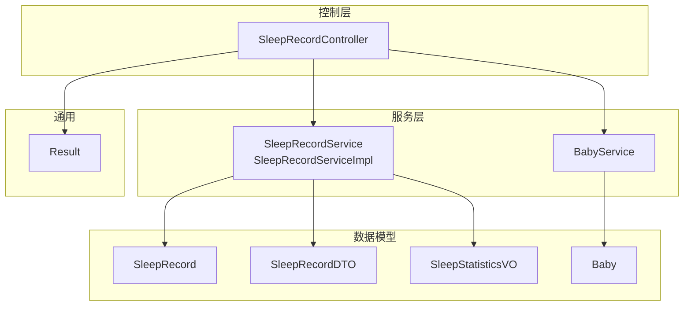
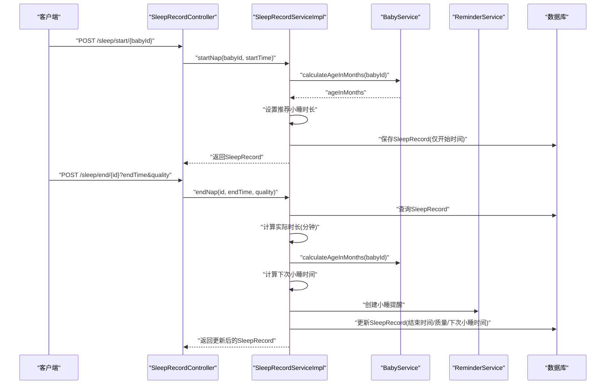
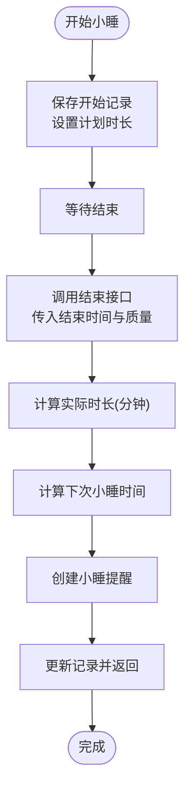
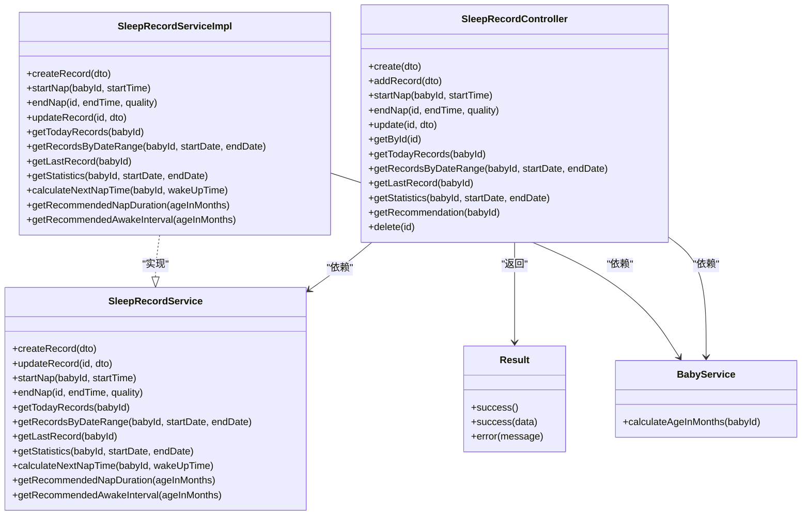

# 睡眠记录API

<cite>
**本文引用的文件**
- [SleepRecordController.java](file://backend/src/main/java/com/baby/controller/SleepRecordController.java)
- [SleepRecordService.java](file://backend/src/main/java/com/baby/service/SleepRecordService.java)
- [SleepRecordServiceImpl.java](file://backend/src/main/java/com/baby/service/impl/SleepRecordServiceImpl.java)
- [SleepRecordDTO.java](file://backend/src/main/java/com/baby/dto/SleepRecordDTO.java)
- [SleepRecord.java](file://backend/src/main/java/com/baby/entity/SleepRecord.java)
- [SleepStatisticsVO.java](file://backend/src/main/java/com/baby/vo/SleepStatisticsVO.java)
- [BabyService.java](file://backend/src/main/java/com/baby/service/BabyService.java)
- [Baby.java](file://backend/src/main/java/com/baby/entity/Baby.java)
- [Result.java](file://backend/src/main/java/com/baby/common/Result.java)
- [application.yml](file://backend/src/main/resources/application.yml)
</cite>

## 目录
1. [简介](#简介)
2. [项目结构](#项目结构)
3. [核心组件](#核心组件)
4. [架构总览](#架构总览)
5. [详细组件分析](#详细组件分析)
6. [依赖关系分析](#依赖关系分析)
7. [性能与可用性考虑](#性能与可用性考虑)
8. [故障排查指南](#故障排查指南)
9. [结论](#结论)
10. [附录](#附录)

## 简介
本文件为睡眠记录功能的完整API文档，覆盖所有与睡眠相关的REST端点，包括创建、手动添加、开始/结束小睡、更新、查询、统计与推荐。文档重点说明：
- 小睡生命周期管理：通过“开始小睡”和“结束小睡”两个端点串联一次完整的nap流程。
- 自动时长计算：根据开始/结束时间自动计算实际睡眠时长（分钟）。
- 质量评分体系：1-5分（1为优秀，5为较差），用于统计与建议生成。
- 推荐依据：基于国家卫健委《0岁～5岁儿童睡眠卫生指南》按月龄给出小睡时长与清醒间隔建议。

## 项目结构
后端采用分层架构：Controller负责HTTP路由与参数绑定；Service提供业务逻辑；Entity/DTO/VO承载数据模型；Result统一响应包装。

图表来源
- [SleepRecordController.java](file://backend/src/main/java/com/baby/controller/SleepRecordController.java#L1-L139)
- [SleepRecordService.java](file://backend/src/main/java/com/baby/service/SleepRecordService.java#L1-L71)
- [SleepRecordServiceImpl.java](file://backend/src/main/java/com/baby/service/impl/SleepRecordServiceImpl.java#L1-L279)
- [SleepRecordDTO.java](file://backend/src/main/java/com/baby/dto/SleepRecordDTO.java#L1-L47)
- [SleepRecord.java](file://backend/src/main/java/com/baby/entity/SleepRecord.java#L1-L76)
- [SleepStatisticsVO.java](file://backend/src/main/java/com/baby/vo/SleepStatisticsVO.java#L1-L87)
- [BabyService.java](file://backend/src/main/java/com/baby/service/BabyService.java#L1-L38)
- [Baby.java](file://backend/src/main/java/com/baby/entity/Baby.java#L1-L72)
- [Result.java](file://backend/src/main/java/com/baby/common/Result.java#L1-L54)

章节来源
- [SleepRecordController.java](file://backend/src/main/java/com/baby/controller/SleepRecordController.java#L1-L139)
- [application.yml](file://backend/src/main/resources/application.yml#L71-L92)

## 核心组件
- 控制器：提供所有睡眠相关API，统一返回Result包装。
- 服务接口与实现：封装创建、更新、开始/结束小睡、统计、推荐等核心业务。
- 数据模型：
  - DTO：请求体参数载体（如创建/更新时使用）。
  - Entity：数据库持久化对象（包含睡眠类型、开始/结束时间、时长、质量、备注等）。
  - VO：统计结果对象（含总时长、平均值、推荐对比、质量分布等）。
- 统一响应：Result<T>提供成功/错误响应格式。

章节来源
- [SleepRecordController.java](file://backend/src/main/java/com/baby/controller/SleepRecordController.java#L1-L139)
- [SleepRecordService.java](file://backend/src/main/java/com/baby/service/SleepRecordService.java#L1-L71)
- [SleepRecordServiceImpl.java](file://backend/src/main/java/com/baby/service/impl/SleepRecordServiceImpl.java#L1-L279)
- [SleepRecordDTO.java](file://backend/src/main/java/com/baby/dto/SleepRecordDTO.java#L1-L47)
- [SleepRecord.java](file://backend/src/main/java/com/baby/entity/SleepRecord.java#L1-L76)
- [SleepStatisticsVO.java](file://backend/src/main/java/com/baby/vo/SleepStatisticsVO.java#L1-L87)
- [Result.java](file://backend/src/main/java/com/baby/common/Result.java#L1-L54)

## 架构总览
以下序列图展示“开始小睡”到“结束小睡”的完整流程，包括自动时长计算、下次小睡时间推算与提醒创建。

图表来源
- [SleepRecordController.java](file://backend/src/main/java/com/baby/controller/SleepRecordController.java#L48-L65)
- [SleepRecordServiceImpl.java](file://backend/src/main/java/com/baby/service/impl/SleepRecordServiceImpl.java#L89-L134)
- [BabyService.java](file://backend/src/main/java/com/baby/service/BabyService.java#L33-L37)

## 详细组件分析

### API端点一览与行为说明
- POST /sleep
  - 功能：创建任意类型的睡眠记录（小睡/夜间）。
  - 请求体：SleepRecordDTO（包含宝宝ID、睡眠类型、开始时间、结束时间、计划/实际时长、质量、备注等）。
  - 响应：Result<SleepRecord>。
  - 行为要点：若提供结束时间，自动计算实际时长；根据月龄设置计划时长；若是小睡且已结束，计算下次小睡时间并创建提醒。

- POST /sleep/add
  - 功能：手动添加一条睡眠记录（与创建相同，便于语义区分）。
  - 请求体：同上。
  - 响应：Result<SleepRecord>。

- POST /sleep/start/{babyId}
  - 功能：开始一次小睡。
  - 路径参数：babyId（宝宝ID）。
  - 查询参数：startTime（ISO时间，可选，默认当前时间）。
  - 响应：Result<SleepRecord>。
  - 行为要点：标记睡眠类型为小睡；设置计划小睡时长（按月龄）；保存记录。

- POST /sleep/end/{id}
  - 功能：结束一次小睡。
  - 路径参数：id（记录ID）。
  - 查询参数：endTime（ISO时间，可选，默认当前时间）、quality（1-5，可选）。
  - 响应：Result<SleepRecord>。
  - 行为要点：计算实际时长；设置质量；计算下次小睡时间；创建提醒；更新记录。

- PUT /sleep/{id}
  - 功能：更新某条记录（支持修改类型、时间、质量、备注等）。
  - 路径参数：id。
  - 请求体：SleepRecordDTO。
  - 响应：Result<SleepRecord>。
  - 行为要点：若同时提供开始/结束时间，自动计算实际时长。

- GET /sleep/{id}
  - 功能：按ID获取单条记录详情。
  - 路径参数：id。
  - 响应：Result<SleepRecord>。

- GET /sleep/today/{babyId}
  - 功能：获取宝宝当日全部睡眠记录。
  - 路径参数：babyId。
  - 响应：Result<List<SleepRecord>>。

- GET /sleep/range/{babyId}
  - 功能：按日期范围查询记录。
  - 路径参数：babyId。
  - 查询参数：startDate（ISO日期）、endDate（ISO日期）。
  - 响应：Result<List<SleepRecord>>。

- GET /sleep/last/{babyId}
  - 功能：获取宝宝最近一次记录。
  - 路径参数：babyId。
  - 响应：Result<SleepRecord>。

- GET /sleep/statistics/{babyId}
  - 功能：获取睡眠统计（总时长、平均值、推荐对比、质量分布等）。
  - 路径参数：babyId。
  - 查询参数：startDate（ISO日期）、endDate（ISO日期）。
  - 响应：Result<SleepStatisticsVO>。
  - 行为要点：按月龄获取推荐范围，进行对比分析，并统计质量分布。

- GET /sleep/recommendation/{babyId}
  - 功能：获取基于国家卫健委指南的小睡时长与清醒间隔建议。
  - 路径参数：babyId。
  - 响应：Result<Map<String,Object>>，包含ageInMonths、recommendedNapDurationMinutes、recommendedAwakeIntervalMinutes、source等字段。
  - 行为要点：根据月龄查表获取推荐值，来源标注为国家卫健委指南。

- DELETE /sleep/{id}
  - 功能：删除某条记录。
  - 路径参数：id。
  - 响应：Result<Void>。

章节来源
- [SleepRecordController.java](file://backend/src/main/java/com/baby/controller/SleepRecordController.java#L34-L138)
- [SleepRecordService.java](file://backend/src/main/java/com/baby/service/SleepRecordService.java#L14-L71)
- [SleepRecordServiceImpl.java](file://backend/src/main/java/com/baby/service/impl/SleepRecordServiceImpl.java#L47-L278)
- [application.yml](file://backend/src/main/resources/application.yml#L71-L92)

### 数据模型与字段说明

#### SleepRecordDTO（请求体）
- 字段
  - babyId：Long，必填，宝宝ID。
  - sleepType：Integer，必填，睡眠类型（1-小睡，2-夜间）。
  - startTime：LocalDateTime，必填，入睡时间。
  - endTime：LocalDateTime，可选，醒来时间。
  - duration：Integer，可选，实际睡眠时长（分钟），由系统在提供开始/结束时间时自动计算。
  - plannedDuration：Integer，可选，计划睡眠时长（分钟），按月龄自动设置。
  - quality：Integer，可选，睡眠质量（1-好，2-一般，3-差）。
  - remark：String，可选，备注。

章节来源
- [SleepRecordDTO.java](file://backend/src/main/java/com/baby/dto/SleepRecordDTO.java#L1-L47)

#### SleepRecord（数据库实体）
- 字段
  - id：Long，主键。
  - babyId：Long，宝宝ID。
  - sleepType：Integer，睡眠类型（1-小睡，2-夜间）。
  - startTime：LocalDateTime，入睡时间。
  - endTime：LocalDateTime，醒来时间。
  - duration：Integer，实际睡眠时长（分钟）。
  - plannedDuration：Integer，计划睡眠时长（分钟）。
  - nextNapTime：LocalDateTime，下次小睡预计时间。
  - soothingReminderMinutes：Integer，哄睡提醒提前分钟数。
  - quality：Integer，睡眠质量（1-好，2-一般，3-差）。
  - remark：String，备注。
  - createTime/updateTime/deleted：系统字段。

章节来源
- [SleepRecord.java](file://backend/src/main/java/com/baby/entity/SleepRecord.java#L1-L76)

#### SleepStatisticsVO（统计响应）
- 字段
  - dateRange：String，统计日期范围。
  - totalDuration：Integer，总睡眠时长（分钟）。
  - napCount：Integer，小睡总次数。
  - nightSleepCount：Integer，夜间睡眠次数。
  - dailyAverageHours：Double，日均睡眠时长（小时）。
  - dailyAverageNapCount：Double，日均小睡次数。
  - averageNapDuration：Double，平均每次小睡时长（分钟）。
  - recommendedDailyHours：String，推荐日均睡眠时长范围（小时）。
  - recommendedNapCount：String，推荐小睡次数范围。
  - comparisonWithRecommended：String，与推荐值的对比分析。
  - qualityDistribution：QualityDistribution，质量分布百分比。
  - dailyData：List<DailySleepData>，每日统计数据。

章节来源
- [SleepStatisticsVO.java](file://backend/src/main/java/com/baby/vo/SleepStatisticsVO.java#L1-L87)

### 质量评分与推荐机制
- 质量评分（1-5）
  - 1：优秀
  - 2：良好
  - 3：一般
  - 4：较差
  - 5：很差
- 推荐依据
  - 基于国家卫健委《0岁～5岁儿童睡眠卫生指南》，按月龄区间给出推荐范围：
    - 0-3个月：日均睡眠14-17小时，小睡4-5次，清醒间隔约45分钟，小睡时长约60分钟。
    - 3-6个月：日均睡眠12-16小时，小睡3-4次，清醒间隔约90分钟，小睡时长约90分钟。
    - 6-9个月：日均睡眠12-15小时，小睡2-3次，清醒间隔约120分钟，小睡时长约90分钟。
    - 9-12个月：日均睡眠12-14小时，小睡2-2次，清醒间隔约150分钟，小睡时长约90分钟。
    - 12-18个月：日均睡眠11-14小时，小睡1-2次，清醒间隔约180分钟，小睡时长约120分钟。
    - 18-24个月：日均睡眠11-14小时，小睡1-1次，清醒间隔约240分钟，小睡时长约120分钟。
  - 应用中会根据月龄查表得到推荐值，并在统计接口中进行对比分析。

章节来源
- [SleepRecordServiceImpl.java](file://backend/src/main/java/com/baby/service/impl/SleepRecordServiceImpl.java#L36-L45)
- [application.yml](file://backend/src/main/resources/application.yml#L71-L92)

### 小睡生命周期管理流程
- 开始小睡
  - 调用“POST /sleep/start/{babyId}”，系统设置睡眠类型为小睡，记录开始时间与计划时长（按月龄）。
- 结束小睡
  - 调用“POST /sleep/end/{id}”，系统计算实际时长（分钟），设置质量，推算下次小睡时间，并创建提醒。
- 更新与查询
  - 使用“PUT /sleep/{id}”更新记录；使用“GET /sleep/{id}”获取详情；使用“GET /sleep/today/{babyId}”、“GET /sleep/range/{babyId}”、“GET /sleep/last/{babyId}”进行查询。

图表来源
- [SleepRecordController.java](file://backend/src/main/java/com/baby/controller/SleepRecordController.java#L48-L65)
- [SleepRecordServiceImpl.java](file://backend/src/main/java/com/baby/service/impl/SleepRecordServiceImpl.java#L89-L134)

## 依赖关系分析
- 控制器依赖服务接口与婴儿服务，用于年龄计算与推荐。
- 服务实现依赖实体、DTO、VO、婴儿服务与提醒服务。
- 统一响应Result贯穿所有控制器方法，保证一致的返回格式。

图表来源
- [SleepRecordController.java](file://backend/src/main/java/com/baby/controller/SleepRecordController.java#L1-L139)
- [SleepRecordService.java](file://backend/src/main/java/com/baby/service/SleepRecordService.java#L1-L71)
- [SleepRecordServiceImpl.java](file://backend/src/main/java/com/baby/service/impl/SleepRecordServiceImpl.java#L1-L279)
- [BabyService.java](file://backend/src/main/java/com/baby/service/BabyService.java#L1-L38)
- [Result.java](file://backend/src/main/java/com/baby/common/Result.java#L1-L54)

## 性能与可用性考虑
- 时间计算：使用分钟级计算，避免浮点误差；统计时按天数取整，确保日均值稳定。
- 推荐值缓存：月龄查表为常量映射，无额外IO开销。
- 批量查询：按日期范围与当天查询使用数据库条件过滤，建议配合索引优化（按babyId与startTime）。
- 事务一致性：开始/结束小睡与统计更新均在服务层以事务包裹，保证原子性。

[本节为通用建议，不直接分析具体文件]

## 故障排查指南
- 结束小睡时报错“睡眠记录不存在”
  - 可能原因：记录ID无效或已被删除。
  - 处理建议：确认ID正确，或先调用“GET /sleep/last/{babyId}”获取最新记录。
- 质量评分异常
  - 可能原因：quality不在1-5范围内。
  - 处理建议：前端校验或后端参数校验（控制器已使用校验注解）。
- 统计结果为空
  - 可能原因：日期范围无记录或宝宝ID错误。
  - 处理建议：检查日期范围与宝宝ID，确认记录存在。
- 推荐值不符合预期
  - 可能原因：月龄计算逻辑或配置差异。
  - 处理建议：核对配置文件中的指南参数与月龄计算逻辑。

章节来源
- [SleepRecordServiceImpl.java](file://backend/src/main/java/com/baby/service/impl/SleepRecordServiceImpl.java#L104-L134)
- [SleepRecordController.java](file://backend/src/main/java/com/baby/controller/SleepRecordController.java#L116-L130)

## 结论
该API围绕“开始/结束小睡”构建了完整的nap生命周期管理，结合国家卫健委指南实现了基于月龄的推荐与统计分析。通过统一的Result响应与清晰的数据模型，既满足移动端与Web端的使用需求，也为后续扩展（如提醒、趋势分析）提供了良好基础。

[本节为总结性内容，不直接分析具体文件]

## 附录

### API调用示例（路径与参数）
- 开始小睡
  - 方法：POST
  - 路径：/sleep/start/{babyId}
  - 参数：startTime（可选，ISO时间）
  - 示例：POST /sleep/start/123?startTime=2025-04-05T10:30:00
- 结束小睡
  - 方法：POST
  - 路径：/sleep/end/{id}
  - 参数：endTime（可选，ISO时间）、quality（1-5）
  - 示例：POST /sleep/end/456?endTime=2025-04-05T11:15:00&quality=1
- 创建记录
  - 方法：POST
  - 路径：/sleep
  - 请求体：SleepRecordDTO（包含babyId、sleepType、startTime、endTime、quality、remark等）
- 更新记录
  - 方法：PUT
  - 路径：/sleep/{id}
  - 请求体：SleepRecordDTO
- 查询详情
  - 方法：GET
  - 路径：/sleep/{id}
- 当日记录
  - 方法：GET
  - 路径：/sleep/today/{babyId}
- 指定日期范围
  - 方法：GET
  - 路径：/sleep/range/{babyId}
  - 参数：startDate、endDate（ISO日期）
- 最近一次记录
  - 方法：GET
  - 路径：/sleep/last/{babyId}
- 统计
  - 方法：GET
  - 路径：/sleep/statistics/{babyId}
  - 参数：startDate、endDate（ISO日期）
- 推荐
  - 方法：GET
  - 路径：/sleep/recommendation/{babyId}

章节来源
- [SleepRecordController.java](file://backend/src/main/java/com/baby/controller/SleepRecordController.java#L34-L138)