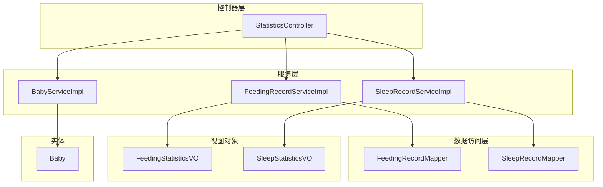
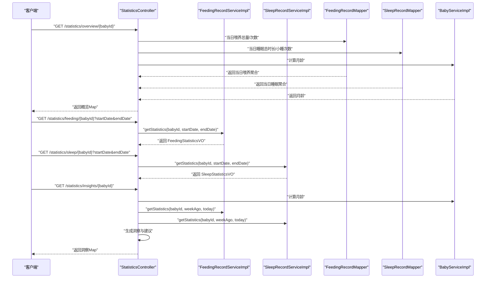
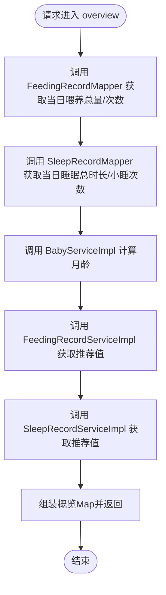
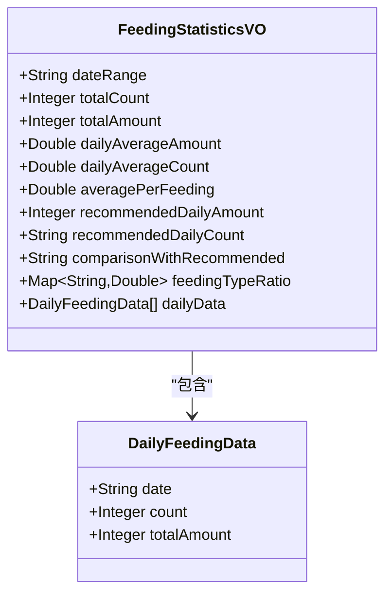
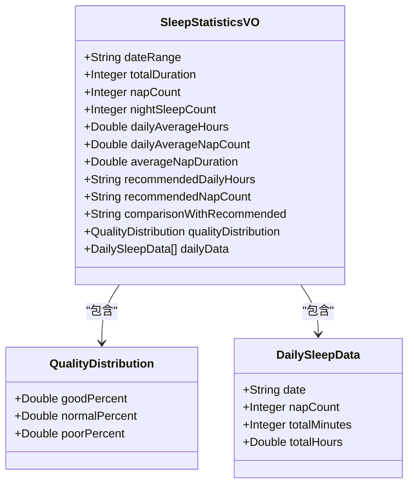
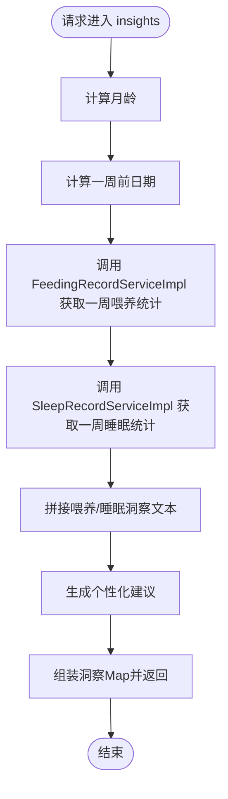
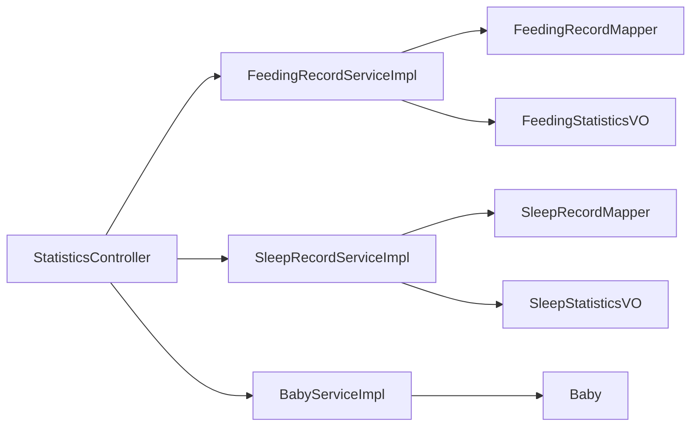

# 统计分析API

<cite>
**本文引用的文件**
- [StatisticsController.java](file://backend/src/main/java/com/baby/controller/StatisticsController.java)
- [FeedingStatisticsVO.java](file://backend/src/main/java/com/baby/vo/FeedingStatisticsVO.java)
- [SleepStatisticsVO.java](file://backend/src/main/java/com/baby/vo/SleepStatisticsVO.java)
- [FeedingRecordMapper.java](file://backend/src/main/java/com/baby/mapper/FeedingRecordMapper.java)
- [SleepRecordMapper.java](file://backend/src/main/java/com/baby/mapper/SleepRecordMapper.java)
- [FeedingRecordServiceImpl.java](file://backend/src/main/java/com/baby/service/impl/FeedingRecordServiceImpl.java)
- [SleepRecordServiceImpl.java](file://backend/src/main/java/com/baby/service/impl/SleepRecordServiceImpl.java)
- [BabyService.java](file://backend/src/main/java/com/baby/service/BabyService.java)
- [BabyServiceImpl.java](file://backend/src/main/java/com/baby/service/impl/BabyServiceImpl.java)
- [Baby.java](file://backend/src/main/java/com/baby/entity/Baby.java)
</cite>

## 目录
1. [简介](#简介)
2. [项目结构](#项目结构)
3. [核心组件](#核心组件)
4. [架构总览](#架构总览)
5. [详细组件分析](#详细组件分析)
6. [依赖关系分析](#依赖关系分析)
7. [性能考量](#性能考量)
8. [故障排查指南](#故障排查指南)
9. [结论](#结论)
10. [附录](#附录)

## 简介
本文件面向统计分析相关接口的使用者与维护者，系统化说明以下四个统计分析端点：
- GET /statistics/overview/{babyId}：提供当日概览，聚合喂养与睡眠数据，给出推荐值对比与趋势提示。
- GET /statistics/feeding/{babyId}：提供喂养统计详情，包含日均、平均每次、喂养类型比例等。
- GET /statistics/sleep/{babyId}：提供睡眠统计详情，包含日均睡眠、小睡次数、睡眠质量分布等。
- GET /statistics/insights/{babyId}：提供智能洞察，结合近一周趋势与发育阶段，输出个性化建议。

文档重点解释 overview 端点如何通过喂养与睡眠 Mapper 的聚合结果，形成综合日度摘要；并详述 FeedingStatisticsVO 与 SleepStatisticsVO 的字段含义、推荐值对比与趋势提示的生成逻辑；最后说明 insights 端点如何基于一周期间的喂养与睡眠模式，结合发育阶段生成个性化建议。

## 项目结构
统计分析相关的后端代码位于 backend 模块中，主要涉及控制器、服务层、数据访问层与视图对象 VO：
- 控制器：StatisticsController 提供四个统计端点
- 服务层：FeedingRecordServiceImpl 与 SleepRecordServiceImpl 实现统计计算与推荐值对比
- 数据访问层：FeedingRecordMapper 与 SleepRecordMapper 提供 SQL 聚合查询
- 视图对象：FeedingStatisticsVO 与 SleepStatisticsVO 描述响应结构
- 公共服务：BabyService 用于计算月龄，作为推荐值与建议的基础

图表来源
- [StatisticsController.java](file://backend/src/main/java/com/baby/controller/StatisticsController.java#L36-L148)
- [FeedingRecordServiceImpl.java](file://backend/src/main/java/com/baby/service/impl/FeedingRecordServiceImpl.java#L143-L230)
- [SleepRecordServiceImpl.java](file://backend/src/main/java/com/baby/service/impl/SleepRecordServiceImpl.java#L186-L237)
- [FeedingRecordMapper.java](file://backend/src/main/java/com/baby/mapper/FeedingRecordMapper.java#L18-L46)
- [SleepRecordMapper.java](file://backend/src/main/java/com/baby/mapper/SleepRecordMapper.java#L18-L47)
- [FeedingStatisticsVO.java](file://backend/src/main/java/com/baby/vo/FeedingStatisticsVO.java#L1-L75)
- [SleepStatisticsVO.java](file://backend/src/main/java/com/baby/vo/SleepStatisticsVO.java#L1-L87)
- [BabyService.java](file://backend/src/main/java/com/baby/service/BabyService.java#L1-L38)
- [BabyServiceImpl.java](file://backend/src/main/java/com/baby/service/impl/BabyServiceImpl.java#L82-L90)
- [Baby.java](file://backend/src/main/java/com/baby/entity/Baby.java#L1-L72)

章节来源
- [StatisticsController.java](file://backend/src/main/java/com/baby/controller/StatisticsController.java#L36-L148)
- [FeedingRecordServiceImpl.java](file://backend/src/main/java/com/baby/service/impl/FeedingRecordServiceImpl.java#L143-L230)
- [SleepRecordServiceImpl.java](file://backend/src/main/java/com/baby/service/impl/SleepRecordServiceImpl.java#L186-L237)
- [FeedingRecordMapper.java](file://backend/src/main/java/com/baby/mapper/FeedingRecordMapper.java#L18-L46)
- [SleepRecordMapper.java](file://backend/src/main/java/com/baby/mapper/SleepRecordMapper.java#L18-L47)
- [FeedingStatisticsVO.java](file://backend/src/main/java/com/baby/vo/FeedingStatisticsVO.java#L1-L75)
- [SleepStatisticsVO.java](file://backend/src/main/java/com/baby/vo/SleepStatisticsVO.java#L1-L87)
- [BabyService.java](file://backend/src/main/java/com/baby/service/BabyService.java#L1-L38)
- [BabyServiceImpl.java](file://backend/src/main/java/com/baby/service/impl/BabyServiceImpl.java#L82-L90)
- [Baby.java](file://backend/src/main/java/com/baby/entity/Baby.java#L1-L72)

## 核心组件
- StatisticsController：暴露四个统计端点，负责参数校验、调用服务层并封装 Result 响应。
- FeedingRecordServiceImpl：实现喂养统计计算、推荐值对比与喂养类型比例统计。
- SleepRecordServiceImpl：实现睡眠统计计算、推荐值对比与睡眠质量分布统计。
- FeedingRecordMapper / SleepRecordMapper：提供按日期分组的聚合查询，支持 overview 端点的当日汇总。
- FeedingStatisticsVO / SleepStatisticsVO：定义喂养与睡眠统计的响应结构，包含推荐值、对比文本与每日明细。
- BabyService：提供月龄计算，作为推荐值与建议生成的依据。

章节来源
- [StatisticsController.java](file://backend/src/main/java/com/baby/controller/StatisticsController.java#L36-L148)
- [FeedingRecordServiceImpl.java](file://backend/src/main/java/com/baby/service/impl/FeedingRecordServiceImpl.java#L143-L230)
- [SleepRecordServiceImpl.java](file://backend/src/main/java/com/baby/service/impl/SleepRecordServiceImpl.java#L186-L237)
- [FeedingRecordMapper.java](file://backend/src/main/java/com/baby/mapper/FeedingRecordMapper.java#L18-L46)
- [SleepRecordMapper.java](file://backend/src/main/java/com/baby/mapper/SleepRecordMapper.java#L18-L47)
- [FeedingStatisticsVO.java](file://backend/src/main/java/com/baby/vo/FeedingStatisticsVO.java#L1-L75)
- [SleepStatisticsVO.java](file://backend/src/main/java/com/baby/vo/SleepStatisticsVO.java#L1-L87)
- [BabyService.java](file://backend/src/main/java/com/baby/service/BabyService.java#L1-L38)
- [BabyServiceImpl.java](file://backend/src/main/java/com/baby/service/impl/BabyServiceImpl.java#L82-L90)

## 架构总览
统计分析端点的请求处理流程如下：

图表来源
- [StatisticsController.java](file://backend/src/main/java/com/baby/controller/StatisticsController.java#L36-L148)
- [FeedingRecordMapper.java](file://backend/src/main/java/com/baby/mapper/FeedingRecordMapper.java#L18-L46)
- [SleepRecordMapper.java](file://backend/src/main/java/com/baby/mapper/SleepRecordMapper.java#L18-L47)
- [FeedingRecordServiceImpl.java](file://backend/src/main/java/com/baby/service/impl/FeedingRecordServiceImpl.java#L143-L230)
- [SleepRecordServiceImpl.java](file://backend/src/main/java/com/baby/service/impl/SleepRecordServiceImpl.java#L186-L237)
- [BabyServiceImpl.java](file://backend/src/main/java/com/baby/service/impl/BabyServiceImpl.java#L82-L90)

## 详细组件分析

### GET /statistics/overview/{babyId}
- 功能概述：返回当日喂养与睡眠的综合概览，包含总奶量、喂养次数、总睡眠时长、小睡次数、推荐值与单位等，并附带月龄。
- 数据来源与聚合：
  - 喂养：通过 FeedingRecordMapper 查询当日喂养总量与次数。
  - 睡眠：通过 SleepRecordMapper 查询当日总睡眠时长与小睡次数。
  - 推荐值：通过 BabyService 计算月龄，再由 FeedingRecordServiceImpl 与 SleepRecordServiceImpl 提供推荐值。
- 返回结构：Map<String, Object>，包含日期、喂养对象（含 totalAmount、count、recommendedDailyAmount、unit）、睡眠对象（含 totalMinutes、totalHours、napCount、recommendedNapDuration、unit）以及 ageInMonths。

图表来源
- [StatisticsController.java](file://backend/src/main/java/com/baby/controller/StatisticsController.java#L36-L71)
- [FeedingRecordMapper.java](file://backend/src/main/java/com/baby/mapper/FeedingRecordMapper.java#L31-L45)
- [SleepRecordMapper.java](file://backend/src/main/java/com/baby/mapper/SleepRecordMapper.java#L31-L46)
- [FeedingRecordServiceImpl.java](file://backend/src/main/java/com/baby/service/impl/FeedingRecordServiceImpl.java#L206-L215)
- [SleepRecordServiceImpl.java](file://backend/src/main/java/com/baby/service/impl/SleepRecordServiceImpl.java#L253-L263)
- [BabyServiceImpl.java](file://backend/src/main/java/com/baby/service/impl/BabyServiceImpl.java#L82-L90)

章节来源
- [StatisticsController.java](file://backend/src/main/java/com/baby/controller/StatisticsController.java#L36-L71)
- [FeedingRecordMapper.java](file://backend/src/main/java/com/baby/mapper/FeedingRecordMapper.java#L31-L45)
- [SleepRecordMapper.java](file://backend/src/main/java/com/baby/mapper/SleepRecordMapper.java#L31-L46)
- [FeedingRecordServiceImpl.java](file://backend/src/main/java/com/baby/service/impl/FeedingRecordServiceImpl.java#L206-L215)
- [SleepRecordServiceImpl.java](file://backend/src/main/java/com/baby/service/impl/SleepRecordServiceImpl.java#L253-L263)
- [BabyServiceImpl.java](file://backend/src/main/java/com/baby/service/impl/BabyServiceImpl.java#L82-L90)

### GET /statistics/feeding/{babyId}
- 请求参数：babyId（路径变量），startDate、endDate（查询参数，ISO日期格式）。
- 业务逻辑：调用 FeedingRecordServiceImpl.getStatistics 计算统计指标，包括总次数、总奶量、日均奶量、日均次数、平均每次奶量、推荐值、与推荐值对比、喂养类型比例、每日明细等。
- 响应对象：FeedingStatisticsVO。

图表来源
- [FeedingStatisticsVO.java](file://backend/src/main/java/com/baby/vo/FeedingStatisticsVO.java#L1-L75)

章节来源
- [StatisticsController.java](file://backend/src/main/java/com/baby/controller/StatisticsController.java#L73-L81)
- [FeedingRecordServiceImpl.java](file://backend/src/main/java/com/baby/service/impl/FeedingRecordServiceImpl.java#L143-L189)
- [FeedingStatisticsVO.java](file://backend/src/main/java/com/baby/vo/FeedingStatisticsVO.java#L1-L75)

### GET /statistics/sleep/{babyId}
- 请求参数：babyId（路径变量），startDate、endDate（查询参数，ISO日期格式）。
- 业务逻辑：调用 SleepRecordServiceImpl.getStatistics 计算统计指标，包括总睡眠时长、小睡次数、夜间睡眠次数、日均睡眠时长、日均小睡次数、平均每次小睡时长、推荐值、与推荐值对比、睡眠质量分布、每日明细等。
- 响应对象：SleepStatisticsVO。

图表来源
- [SleepStatisticsVO.java](file://backend/src/main/java/com/baby/vo/SleepStatisticsVO.java#L1-L87)

章节来源
- [StatisticsController.java](file://backend/src/main/java/com/baby/controller/StatisticsController.java#L83-L91)
- [SleepRecordServiceImpl.java](file://backend/src/main/java/com/baby/service/impl/SleepRecordServiceImpl.java#L186-L237)
- [SleepStatisticsVO.java](file://backend/src/main/java/com/baby/vo/SleepStatisticsVO.java#L1-L87)

### GET /statistics/insights/{babyId}
- 功能概述：基于近一周的喂养与睡眠统计，生成洞察文本与个性化建议。
- 数据来源与流程：
  - 计算月龄：BabyServiceImpl.calculateAgeInMonths。
  - 获取一周喂养统计：FeedingRecordServiceImpl.getStatistics。
  - 获取一周睡眠统计：SleepRecordServiceImpl.getStatistics。
  - 生成洞察文本：拼接“日均奶量/睡眠时长”与“与推荐值对比”的文本。
  - 生成建议：根据月龄阶段与睡眠时长阈值生成建议文本。
- 返回结构：Map<String, Object>，包含喂养洞察、睡眠洞察、建议、月龄与分析日期。

图表来源
- [StatisticsController.java](file://backend/src/main/java/com/baby/controller/StatisticsController.java#L93-L148)
- [FeedingRecordServiceImpl.java](file://backend/src/main/java/com/baby/service/impl/FeedingRecordServiceImpl.java#L143-L189)
- [SleepRecordServiceImpl.java](file://backend/src/main/java/com/baby/service/impl/SleepRecordServiceImpl.java#L186-L237)
- [BabyServiceImpl.java](file://backend/src/main/java/com/baby/service/impl/BabyServiceImpl.java#L82-L90)

章节来源
- [StatisticsController.java](file://backend/src/main/java/com/baby/controller/StatisticsController.java#L93-L148)
- [FeedingRecordServiceImpl.java](file://backend/src/main/java/com/baby/service/impl/FeedingRecordServiceImpl.java#L143-L189)
- [SleepRecordServiceImpl.java](file://backend/src/main/java/com/baby/service/impl/SleepRecordServiceImpl.java#L186-L237)
- [BabyServiceImpl.java](file://backend/src/main/java/com/baby/service/impl/BabyServiceImpl.java#L82-L90)

## 依赖关系分析
- 控制器依赖服务层：StatisticsController 注入 FeedingRecordService、SleepRecordService、FeedingRecordMapper、SleepRecordMapper、BabyService。
- 服务层依赖 Mapper：FeedingRecordServiceImpl 与 SleepRecordServiceImpl 分别依赖 FeedingRecordMapper 与 SleepRecordMapper 进行 SQL 聚合。
- 月龄依赖实体：BabyServiceImpl 通过 Baby 实体的 birthDate 计算月龄。
- VO 作为响应载体：FeedingStatisticsVO 与 SleepStatisticsVO 仅承载数据，不参与业务逻辑。

图表来源
- [StatisticsController.java](file://backend/src/main/java/com/baby/controller/StatisticsController.java#L30-L35)
- [FeedingRecordServiceImpl.java](file://backend/src/main/java/com/baby/service/impl/FeedingRecordServiceImpl.java#L143-L230)
- [SleepRecordServiceImpl.java](file://backend/src/main/java/com/baby/service/impl/SleepRecordServiceImpl.java#L186-L237)
- [BabyServiceImpl.java](file://backend/src/main/java/com/baby/service/impl/BabyServiceImpl.java#L82-L90)
- [FeedingStatisticsVO.java](file://backend/src/main/java/com/baby/vo/FeedingStatisticsVO.java#L1-L75)
- [SleepStatisticsVO.java](file://backend/src/main/java/com/baby/vo/SleepStatisticsVO.java#L1-L87)

章节来源
- [StatisticsController.java](file://backend/src/main/java/com/baby/controller/StatisticsController.java#L30-L35)
- [FeedingRecordServiceImpl.java](file://backend/src/main/java/com/baby/service/impl/FeedingRecordServiceImpl.java#L143-L230)
- [SleepRecordServiceImpl.java](file://backend/src/main/java/com/baby/service/impl/SleepRecordServiceImpl.java#L186-L237)
- [BabyServiceImpl.java](file://backend/src/main/java/com/baby/service/impl/BabyServiceImpl.java#L82-L90)
- [FeedingStatisticsVO.java](file://backend/src/main/java/com/baby/vo/FeedingStatisticsVO.java#L1-L75)
- [SleepStatisticsVO.java](file://backend/src/main/java/com/baby/vo/SleepStatisticsVO.java#L1-L87)

## 性能考量
- SQL 聚合：FeedingRecordMapper 与 SleepRecordMapper 使用按日期分组的聚合查询，避免在 Java 层进行二次聚合，降低内存与 CPU 开销。
- 时间范围：feeding/sleep 端点使用 startDate、endDate 明确限定时间范围，避免全表扫描。
- 推荐值计算：推荐值来源于服务层常量表与月龄映射，计算成本低。
- 建议生成：insights 端点的建议逻辑为字符串拼接与简单条件判断，开销极低。

[本节为通用性能讨论，不直接分析具体文件]

## 故障排查指南
- 参数校验失败：确认请求中的 babyId 为有效 Long 值；startDate、endDate 采用 ISO 日期格式。
- 无数据或空值：overview 端点当日若无记录将返回 0 或 null 字段；feeding/sleep 端点若无记录则 total 与平均值可能为空。
- 月龄异常：检查 Baby 实体的 birthDate 是否正确；若为空或未来日期，月龄计算可能为 0。
- 推荐值不匹配：确认喂养/睡眠指南常量表与月龄区间划分是否符合预期；必要时检查自定义设置覆盖逻辑。

章节来源
- [StatisticsController.java](file://backend/src/main/java/com/baby/controller/StatisticsController.java#L73-L91)
- [FeedingRecordServiceImpl.java](file://backend/src/main/java/com/baby/service/impl/FeedingRecordServiceImpl.java#L143-L230)
- [SleepRecordServiceImpl.java](file://backend/src/main/java/com/baby/service/impl/SleepRecordServiceImpl.java#L186-L237)
- [BabyServiceImpl.java](file://backend/src/main/java/com/baby/service/impl/BabyServiceImpl.java#L82-L90)

## 结论
本统计分析模块以清晰的分层设计实现了喂养与睡眠的多维度统计与智能洞察。overview 端点通过喂养与睡眠 Mapper 的聚合查询，快速生成综合日度摘要；feeding/sleep 端点提供详尽的统计指标与对比文本；insights 端点结合月龄与趋势，输出个性化建议。整体架构职责明确、扩展性强，便于后续新增统计维度与洞察规则。

[本节为总结性内容，不直接分析具体文件]

## 附录

### API 定义与示例
- GET /statistics/overview/{babyId}
  - 请求参数：babyId（路径变量）
  - 响应结构：Map<String, Object>
    - date：当前日期
    - feeding：包含 totalAmount、count、recommendedDailyAmount、unit
    - sleep：包含 totalMinutes、totalHours、napCount、recommendedNapDuration、unit
    - ageInMonths：整数
  - 示例响应片段（示意）：
    - date: "2025-04-05"
    - feeding: { totalAmount: 720, count: 6, recommendedDailyAmount: 720, unit: "ml" }
    - sleep: { totalMinutes: 420, totalHours: "7.0", napCount: 2, recommendedNapDuration: 90, unit: "分钟" }
    - ageInMonths: 5

- GET /statistics/feeding/{babyId}?startDate=YYYY-MM-DD&endDate=YYYY-MM-DD
  - 响应对象：FeedingStatisticsVO
  - 示例字段（示意）：
    - dateRange: "2025-03-29 ~ 2025-04-05"
    - totalCount: 42
    - totalAmount: 3060
    - dailyAverageAmount: 437.1
    - dailyAverageCount: 6.0
    - averagePerFeeding: 72.86
    - recommendedDailyAmount: 720
    - recommendedDailyCount: "6-8次"
    - comparisonWithRecommended: "正常范围"
    - feedingTypeRatio: { 母乳: 47.6, 奶粉: 47.6, 混合: 4.8 }
    - dailyData: [{ date: "2025-04-01", count: 6, totalAmount: 432 }, ...]

- GET /statistics/sleep/{babyId}?startDate=YYYY-MM-DD&endDate=YYYY-MM-DD
  - 响应对象：SleepStatisticsVO
  - 示例字段（示意）：
    - dateRange: "2025-03-29 ~ 2025-04-05"
    - totalDuration: 3360
    - napCount: 14
    - nightSleepCount: 1
    - dailyAverageHours: 480.0
    - dailyAverageNapCount: 2.0
    - averageNapDuration: 240.0
    - recommendedDailyHours: "12-16小时"
    - recommendedNapCount: "3-4次"
    - comparisonWithRecommended: "睡眠时间偏少，建议适当增加"
    - qualityDistribution: { goodPercent: 60.0, normalPercent: 30.0, poorPercent: 10.0 }
    - dailyData: [{ date: "2025-04-01", napCount: 2, totalMinutes: 480, totalHours: 8.0 }, ...]

- GET /statistics/insights/{babyId}
  - 响应结构：Map<String, Object>
    - feedingInsight: "过去一周日均奶量X ml，与推荐值对比..."
    - sleepInsight: "过去一周日均睡眠Y 小时，与推荐值对比..."
    - suggestion: "基于月龄与睡眠时长的个性化建议"
    - ageInMonths: 5
    - analysisDate: "2025-04-05"
  - 示例响应片段（示意）：
    - feedingInsight: "过去一周日均奶量720ml，正常范围"
    - sleepInsight: "过去一周日均睡眠7.0小时，睡眠时间偏少，建议适当增加"
    - suggestion: "宝宝处于纯母乳/配方奶阶段，建议按需喂养。注意保证宝宝充足的睡眠时间。"
    - ageInMonths: 5
    - analysisDate: "2025-04-05"

章节来源
- [StatisticsController.java](file://backend/src/main/java/com/baby/controller/StatisticsController.java#L36-L148)
- [FeedingStatisticsVO.java](file://backend/src/main/java/com/baby/vo/FeedingStatisticsVO.java#L1-L75)
- [SleepStatisticsVO.java](file://backend/src/main/java/com/baby/vo/SleepStatisticsVO.java#L1-L87)