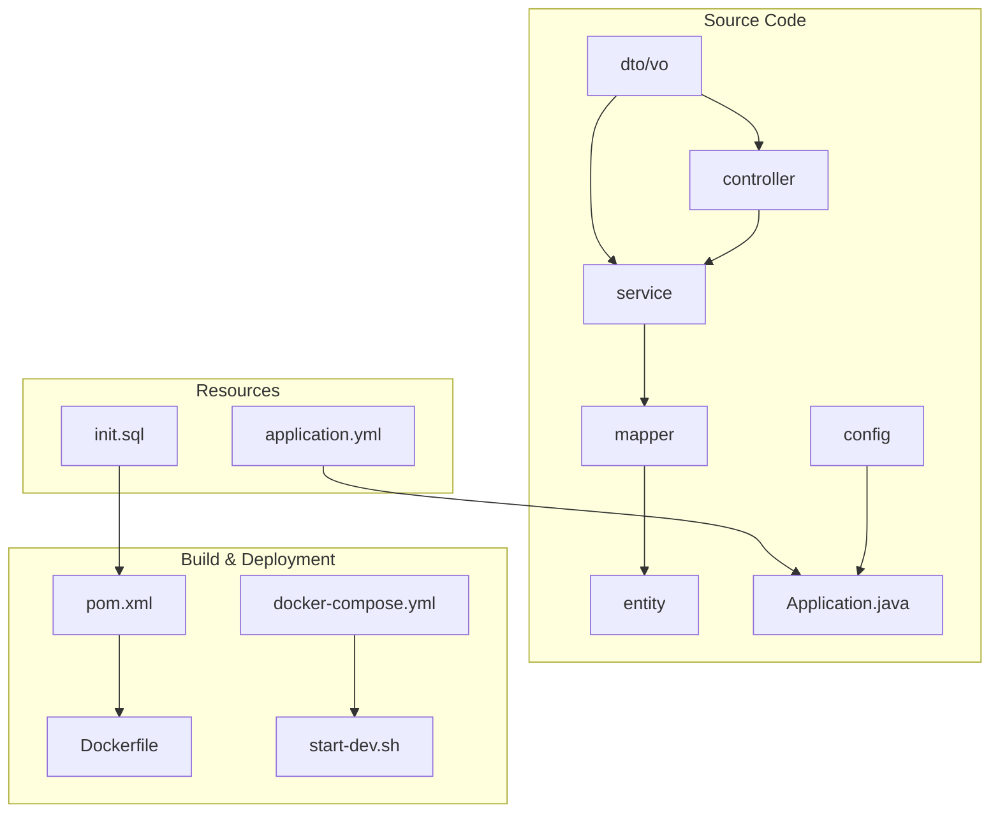
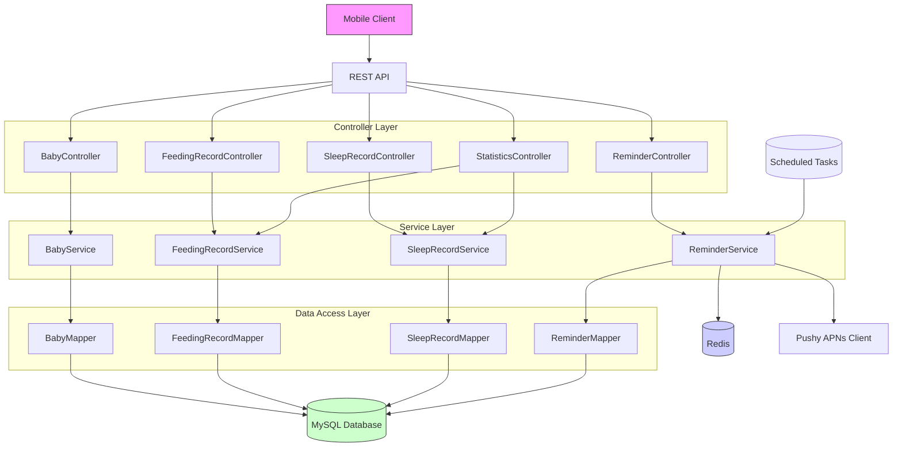
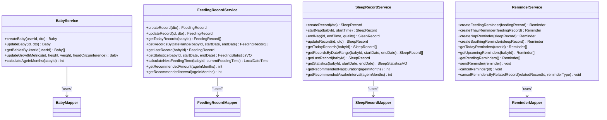
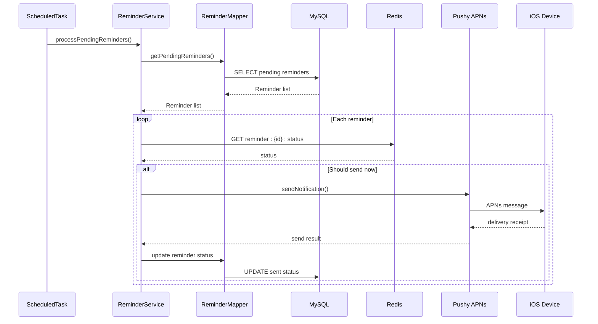
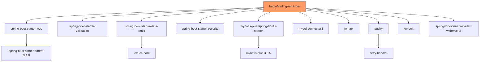

# 后端架构

<cite>
**Referenced Files in This Document**   
- [Application.java](file://backend/src/main/java/com/baby/Application.java)
- [SecurityConfig.java](file://backend/src/main/java/com/baby/config/SecurityConfig.java)
- [MyBatisPlusConfig.java](file://backend/src/main/java/com/baby/config/MyBatisPlusConfig.java)
- [application.yml](file://backend/src/main/resources/application.yml)
- [init.sql](file://backend/src/main/resources/db/init.sql)
- [pom.xml](file://backend/pom.xml)
- [docker-compose.yml](file://docker-compose.yml)
- [start-dev.sh](file://backend/start-dev.sh)
- [BabyController.java](file://backend/src/main/java/com/baby/controller/BabyController.java)
- [FeedingRecordController.java](file://backend/src/main/java/com/baby/controller/FeedingRecordController.java)
- [ReminderController.java](file://backend/src/main/java/com/baby/controller/ReminderController.java)
- [SleepRecordController.java](file://backend/src/main/java/com/baby/controller/SleepRecordController.java)
- [StatisticsController.java](file://backend/src/main/java/com/baby/controller/StatisticsController.java)
- [BabyService.java](file://backend/src/main/java/com/baby/service/BabyService.java)
- [FeedingRecordService.java](file://backend/src/main/java/com/baby/service/FeedingRecordService.java)
- [ReminderService.java](file://backend/src/main/java/com/baby/service/ReminderService.java)
</cite>

## Table of Contents
1. [Introduction](#introduction)
2. [Project Structure](#project-structure)
3. [Core Components](#core-components)
4. [Architecture Overview](#architecture-overview)
5. [Detailed Component Analysis](#detailed-component-analysis)
6. [Dependency Analysis](#dependency-analysis)
7. [Performance Considerations](#performance-considerations)
8. [Troubleshooting Guide](#troubleshooting-guide)
9. [Conclusion](#conclusion)

## Introduction
The backend component of the babyFeedingReminder application is a Spring Boot-based service designed to manage infant feeding and sleep tracking, with automated reminder functionality. The system follows a layered architecture pattern with clear separation between presentation (Controller), business logic (Service), and data access (Mapper) layers. It utilizes DTO/VO patterns for data transfer and view representation, ensuring type safety and structured data flow. The backend integrates with MySQL 8.0 for persistent storage, Redis 7.x for task scheduling coordination, and Pushy for APNs notifications to iOS devices. Key technical decisions include the use of @SpringBootApplication and @EnableScheduling annotations in the Application class, SecurityConfig for authentication setup, and MyBatisPlusConfig for enhanced database operations.

**Section sources**
- [Application.java](file://backend/src/main/java/com/baby/Application.java#L1-L17)
- [SecurityConfig.java](file://backend/src/main/java/com/baby/config/SecurityConfig.java#L1-L43)
- [MyBatisPlusConfig.java](file://backend/src/main/java/com/baby/config/MyBatisPlusConfig.java#L1-L48)

## Project Structure
The backend module is organized using a standard Maven project structure with Java packages separated by functional layers: controller, service, mapper, entity, dto, and vo. Configuration classes are placed under the config package, while the Application.java serves as the entry point. Resource files include application configuration (YAML), database initialization scripts (SQL), and Docker-related deployment configurations. The project supports profile-based configuration for different environments (dev, prod) and includes shell scripting for development environment setup.

**Diagram sources**
- [Application.java](file://backend/src/main/java/com/baby/Application.java#L1-L17)
- [application.yml](file://backend/src/main/resources/application.yml#L1-L98)
- [init.sql](file://backend/src/main/resources/db/init.sql#L1-L147)
- [pom.xml](file://backend/pom.xml#L1-L135)
- [docker-compose.yml](file://docker-compose.yml#L1-L89)
- [start-dev.sh](file://backend/start-dev.sh#L1-L89)

**Section sources**
- [Application.java](file://backend/src/main/java/com/baby/Application.java#L1-L17)
- [application.yml](file://backend/src/main/resources/application.yml#L1-L98)
- [init.sql](file://backend/src/main/resources/db/init.sql#L1-L147)
- [pom.xml](file://backend/pom.xml#L1-L135)
- [docker-compose.yml](file://docker-compose.yml#L1-L89)
- [start-dev.sh](file://backend/start-dev.sh#L1-L89)

## Core Components

The core components of the backend system include REST controllers for handling HTTP requests, service classes implementing business logic, MyBatis Plus mappers for database interaction, and configuration classes for framework setup. The layered architecture ensures separation of concerns, with controllers delegating to services, which in turn use mappers to interact with the database. DTOs are used for input validation and data transfer, while VOs encapsulate view-specific data structures returned to clients.

**Section sources**
- [BabyController.java](file://backend/src/main/java/com/baby/controller/BabyController.java#L1-L80)
- [FeedingRecordController.java](file://backend/src/main/java/com/baby/controller/FeedingRecordController.java#L1-L112)
- [ReminderController.java](file://backend/src/main/java/com/baby/controller/ReminderController.java#L1-L45)
- [SleepRecordController.java](file://backend/src/main/java/com/baby/controller/SleepRecordController.java#L1-L139)
- [StatisticsController.java](file://backend/src/main/java/com/baby/controller/StatisticsController.java#L1-L149)
- [BabyService.java](file://backend/src/main/java/com/baby/service/BabyService.java#L1-L38)
- [FeedingRecordService.java](file://backend/src/main/java/com/baby/service/FeedingRecordService.java#L1-L60)
- [ReminderService.java](file://backend/src/main/java/com/baby/service/ReminderService.java#L1-L64)

## Architecture Overview

The system follows a clean layered architecture with well-defined interactions between components. Incoming HTTP requests are handled by REST controllers, which validate input using DTOs and delegate business logic to service classes. Services coordinate operations, apply business rules, and interact with the data layer through MyBatis Plus mappers. The data access layer handles CRUD operations and complex queries against the MySQL database. Scheduled tasks for reminder generation are processed through Spring's scheduling mechanism, with Redis used for coordination and state management.

**Diagram sources**
- [BabyController.java](file://backend/src/main/java/com/baby/controller/BabyController.java#L1-L80)
- [FeedingRecordController.java](file://backend/src/main/java/com/baby/controller/FeedingRecordController.java#L1-L112)
- [SleepRecordController.java](file://backend/src/main/java/com/baby/controller/SleepRecordController.java#L1-L139)
- [ReminderController.java](file://backend/src/main/java/com/baby/controller/ReminderController.java#L1-L45)
- [StatisticsController.java](file://backend/src/main/java/com/baby/controller/StatisticsController.java#L1-L149)
- [BabyService.java](file://backend/src/main/java/com/baby/service/BabyService.java#L1-L38)
- [FeedingRecordService.java](file://backend/src/main/java/com/baby/service/FeedingRecordService.java#L1-L60)
- [ReminderService.java](file://backend/src/main/java/com/baby/service/ReminderService.java#L1-L64)

## Detailed Component Analysis

### Controller Layer Analysis
The controller layer implements RESTful endpoints for managing baby information, feeding and sleep records, reminders, and statistics. Each controller uses Swagger annotations for API documentation and follows consistent patterns for request handling, parameter validation, and response formatting. Controllers accept DTOs for input validation and return Result-wrapped entities or VOs for structured responses.

```mermaid
classDiagram
class BabyController {
+create(userId, dto) Result~Baby~
+update(id, dto) Result~Baby~
+getById(id) Result~Baby~
+listByUser(userId) Result~List<Baby>~
+updateGrowth(id, height, weight, headCircumference) Result~Baby~
+getAgeInMonths(id) Result~Integer~
+delete(id) Result~Void~
}
class FeedingRecordController {
+create(dto) Result~FeedingRecord~
+update(id, dto) Result~FeedingRecord~
+getById(id) Result~FeedingRecord~
+getTodayRecords(babyId) Result~List<FeedingRecord>~
+getRecordsByDateRange(babyId, startDate, endDate) Result~List<FeedingRecord>~
+getLastRecord(babyId) Result~FeedingRecord~
+getStatistics(babyId, startDate, endDate) Result~FeedingStatisticsVO~
+getRecommendation(babyId) Result~Map~
+delete(id) Result~Void~
}
class SleepRecordController {
+create(dto) Result~SleepRecord~
+addRecord(dto) Result~SleepRecord~
+startNap(babyId, startTime) Result~SleepRecord~
+endNap(id, endTime, quality) Result~SleepRecord~
+update(id, dto) Result~SleepRecord~
+getById(id) Result~SleepRecord~
+getTodayRecords(babyId) Result~List<SleepRecord>~
+getRecordsByDateRange(babyId, startDate, endDate) Result~List<SleepRecord>~
+getLastRecord(babyId) Result~SleepRecord~
+getStatistics(babyId, startDate, endDate) Result~SleepStatisticsVO~
+getRecommendation(babyId) Result~Map~
+delete(id) Result~Void~
}
class ReminderController {
+getTodayReminders(userId) Result~List<Reminder>~
+getUpcomingReminders(babyId) Result~List<Reminder>~
+cancelReminder(id) Result~Void~
}
class StatisticsController {
+getTodayOverview(babyId) Result~Map~
+getFeedingAnalysis(babyId, startDate, endDate) Result~FeedingStatisticsVO~
+getSleepAnalysis(babyId, startDate, endDate) Result~SleepStatisticsVO~
+getInsights(babyId) Result~Map~
}
BabyController --> BabyService : "uses"
FeedingRecordController --> FeedingRecordService : "uses"
SleepRecordController --> SleepRecordService : "uses"
ReminderController --> ReminderService : "uses"
StatisticsController --> FeedingRecordService : "uses"
StatisticsController --> SleepRecordService : "uses"
```

**Diagram sources**
- [BabyController.java](file://backend/src/main/java/com/baby/controller/BabyController.java#L1-L80)
- [FeedingRecordController.java](file://backend/src/main/java/com/baby/controller/FeedingRecordController.java#L1-L112)
- [SleepRecordController.java](file://backend/src/main/java/com/baby/controller/SleepRecordController.java#L1-L139)
- [ReminderController.java](file://backend/src/main/java/com/baby/controller/ReminderController.java#L1-L45)
- [StatisticsController.java](file://backend/src/main/java/com/baby/controller/StatisticsController.java#L1-L149)

**Section sources**
- [BabyController.java](file://backend/src/main/java/com/baby/controller/BabyController.java#L1-L80)
- [FeedingRecordController.java](file://backend/src/main/java/com/baby/controller/FeedingRecordController.java#L1-L112)
- [SleepRecordController.java](file://backend/src/main/java/com/baby/controller/SleepRecordController.java#L1-L139)
- [ReminderController.java](file://backend/src/main/java/com/baby/controller/ReminderController.java#L1-L45)
- [StatisticsController.java](file://backend/src/main/java/com/baby/controller/StatisticsController.java#L1-L149)

### Service Layer Analysis
The service layer contains the core business logic of the application, implementing use cases for baby management, feeding and sleep tracking, reminder processing, and statistical analysis. Services follow the IService pattern from MyBatis Plus and provide higher-level abstractions over data access operations. They handle transaction management, business rule enforcement, and coordination between different domain entities.

**Diagram sources**
- [BabyService.java](file://backend/src/main/java/com/baby/service/BabyService.java#L1-L38)
- [FeedingRecordService.java](file://backend/src/main/java/com/baby/service/FeedingRecordService.java#L1-L60)
- [ReminderService.java](file://backend/src/main/java/com/baby/service/ReminderService.java#L1-L64)

**Section sources**
- [BabyService.java](file://backend/src/main/java/com/baby/service/BabyService.java#L1-L38)
- [FeedingRecordService.java](file://backend/src/main/java/com/baby/service/FeedingRecordService.java#L1-L60)
- [ReminderService.java](file://backend/src/main/java/com/baby/service/ReminderService.java#L1-L64)

### Data Flow and Integration Analysis
The system processes data through a well-defined flow from API request to database persistence and back. For reminder generation, scheduled tasks query pending reminders from the database, validate their timing against Redis-stored state, and dispatch notifications via Pushy to iOS devices. The integration between components is managed through Spring's dependency injection and scheduling mechanisms.

**Diagram sources**
- [ReminderService.java](file://backend/src/main/java/com/baby/service/ReminderService.java#L1-L64)
- [ReminderMapper.java](file://backend/src/main/java/com/baby/mapper/ReminderMapper.java)
- [application.yml](file://backend/src/main/resources/application.yml#L1-L98)
- [pom.xml](file://backend/pom.xml#L1-L135)

## Dependency Analysis

The backend application has well-defined dependencies managed through Maven. It depends on Spring Boot 3.4.0 as the foundational framework, with starter modules for web, data, security, and validation. MyBatis Plus 3.5.5 provides enhanced data access capabilities over standard MyBatis. The system integrates with external services through dedicated libraries: Pushy for APNs notifications, and Spring Data Redis for Redis integration. Configuration is externalized through YAML files and environment variables, with profile support for different deployment environments.

**Diagram sources**
- [pom.xml](file://backend/pom.xml#L1-L135)
- [application.yml](file://backend/src/main/resources/application.yml#L1-L98)

**Section sources**
- [pom.xml](file://backend/pom.xml#L1-L135)
- [application.yml](file://backend/src/main/resources/application.yml#L1-L98)

## Performance Considerations

The system is designed with performance considerations for typical mobile backend workloads. Database queries are optimized through indexed fields on frequently queried columns such as baby_id, user_id, and start_time. The use of Redis for reminder state management reduces database load for time-sensitive operations. Connection pooling is handled by the underlying Spring Boot and MySQL driver configuration. The application is configured to run on Java 17, taking advantage of modern JVM performance improvements. For high-traffic scenarios, the architecture supports horizontal scaling behind a load balancer, with stateless session management enabled through the security configuration.

**Section sources**
- [application.yml](file://backend/src/main/resources/application.yml#L1-L98)
- [SecurityConfig.java](file://backend/src/main/java/com/baby/config/SecurityConfig.java#L1-L43)
- [init.sql](file://backend/src/main/resources/db/init.sql#L1-L147)

## Troubleshooting Guide

Common issues in the system typically relate to database connectivity, Redis availability, or APNs certificate configuration. The application provides health check endpoints through Spring Actuator, which are exposed in the security configuration. Database schema initialization is handled through the init.sql script, which creates all necessary tables with appropriate indexes. Development environment setup is automated through the start-dev.sh script, which checks for required dependencies and can launch database containers via Docker Compose. For production deployments, the docker-compose.yml file defines the complete infrastructure stack including backend, MySQL, Redis, and optional Nginx reverse proxy.

**Section sources**
- [application.yml](file://backend/src/main/resources/application.yml#L1-L98)
- [docker-compose.yml](file://docker-compose.yml#L1-L89)
- [start-dev.sh](file://backend/start-dev.sh#L1-L89)
- [SecurityConfig.java](file://backend/src/main/java/com/baby/config/SecurityConfig.java#L1-L43)
- [init.sql](file://backend/src/main/resources/db/init.sql#L1-L147)

## Conclusion

The babyFeedingReminder backend implements a robust, layered Spring Boot architecture with clear separation of concerns between controller, service, and data access layers. The system effectively uses DTO/VO patterns for type-safe data transfer and employs MyBatis Plus for efficient database operations. Key technical decisions such as using @SpringBootApplication and @EnableScheduling in the Application class enable core functionality, while SecurityConfig and MyBatisPlusConfig provide essential framework integrations. The infrastructure requirements of Java 17, MySQL 8.0, and Redis 7.x support modern performance expectations, and the scheduled task system enables reliable reminder generation. The integration with Pushy for APNs notifications completes the mobile-focused feature set, providing timely alerts to caregivers.