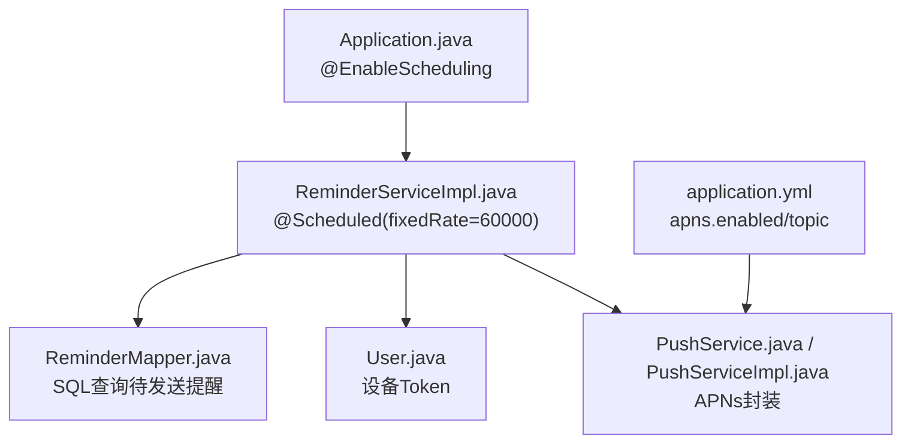
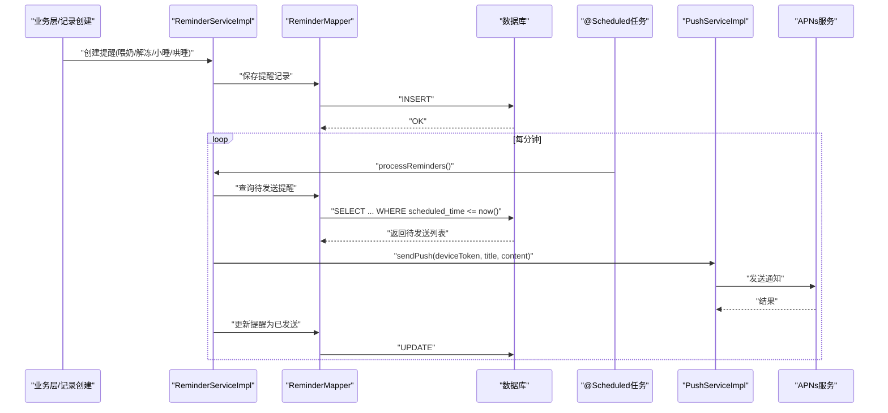
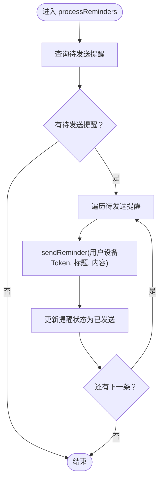
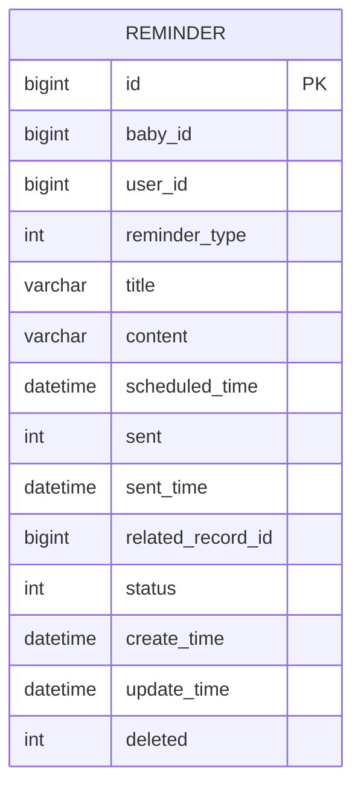
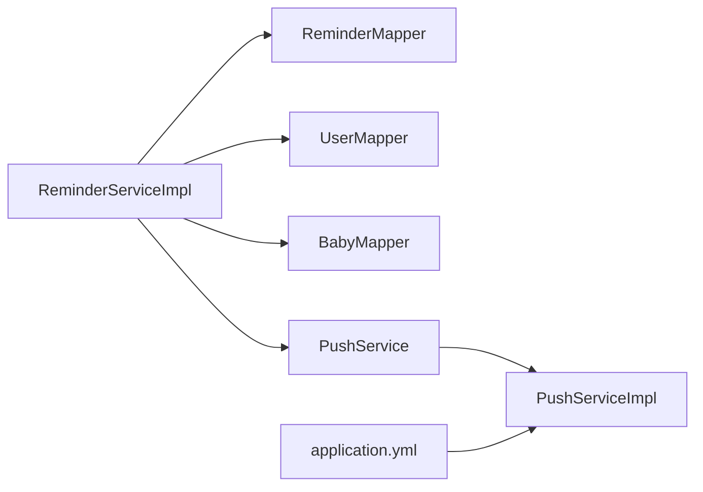

# 定时任务与提醒

<cite>
**本文引用的文件**
- [Application.java](file://backend/src/main/java/com/baby/Application.java)
- [ReminderServiceImpl.java](file://backend/src/main/java/com/baby/service/impl/ReminderServiceImpl.java)
- [ReminderService.java](file://backend/src/main/java/com/baby/service/ReminderService.java)
- [ReminderMapper.java](file://backend/src/main/java/com/baby/mapper/ReminderMapper.java)
- [Reminder.java](file://backend/src/main/java/com/baby/entity/Reminder.java)
- [PushService.java](file://backend/src/main/java/com/baby/service/PushService.java)
- [PushServiceImpl.java](file://backend/src/main/java/com/baby/service/impl/PushServiceImpl.java)
- [User.java](file://backend/src/main/java/com/baby/entity/User.java)
- [application.yml](file://backend/src/main/resources/application.yml)
- [.env.example](file://backend/.env.example)
</cite>

## 目录
1. [简介](#简介)
2. [项目结构](#项目结构)
3. [核心组件](#核心组件)
4. [架构总览](#架构总览)
5. [详细组件分析](#详细组件分析)
6. [依赖关系分析](#依赖关系分析)
7. [性能考量](#性能考量)
8. [故障排查指南](#故障排查指南)
9. [结论](#结论)
10. [附录](#附录)

## 简介
本文件系统性梳理了系统的定时任务与提醒功能，重点说明：
- 如何通过 @EnableScheduling 启用 Spring 的调度能力；
- ReminderServiceImpl 中基于固定频率的周期性检查逻辑；
- 与数据库的集成、提醒状态流转与发送；
- 与 APNs 推送服务的对接；
- 当前实现中未使用 Redis 进行队列化或分布式调度的事实；
- 如何扩展新的提醒类型与自定义提醒触发策略。

## 项目结构
围绕“定时任务与提醒”的关键代码位于 backend 模块，主要涉及：
- 启动类开启调度能力；
- 提醒服务实现与数据库交互；
- 推送服务接口与 APNs 实现；
- 配置文件中的 APNs 开关与主题等参数。

图表来源
- [Application.java](file://backend/src/main/java/com/baby/Application.java#L1-L16)
- [ReminderServiceImpl.java](file://backend/src/main/java/com/baby/service/impl/ReminderServiceImpl.java#L1-L241)
- [ReminderMapper.java](file://backend/src/main/java/com/baby/mapper/ReminderMapper.java#L1-L34)
- [User.java](file://backend/src/main/java/com/baby/entity/User.java#L1-L71)
- [PushService.java](file://backend/src/main/java/com/baby/service/PushService.java#L1-L23)
- [PushServiceImpl.java](file://backend/src/main/java/com/baby/service/impl/PushServiceImpl.java#L1-L68)
- [application.yml](file://backend/src/main/resources/application.yml#L41-L48)

章节来源
- [Application.java](file://backend/src/main/java/com/baby/Application.java#L1-L16)
- [application.yml](file://backend/src/main/resources/application.yml#L41-L48)

## 核心组件
- 启动类与调度开关
  - 启动类通过 @EnableScheduling 开启调度支持。
- 提醒服务实现
  - 负责创建喂奶、解冻、小睡、哄睡等提醒，并将提醒写入数据库；
  - 提供获取“待发送”、“今日”、“即将到来”提醒的方法；
  - 周期性扫描并发送提醒；
  - 对应的数据库表字段与状态机见实体类。
- 推送服务
  - PushService 定义推送接口；
  - PushServiceImpl 在 apns.enabled=true 时执行实际推送，否则仅记录日志（模拟）。

章节来源
- [Application.java](file://backend/src/main/java/com/baby/Application.java#L1-L16)
- [ReminderServiceImpl.java](file://backend/src/main/java/com/baby/service/impl/ReminderServiceImpl.java#L1-L241)
- [ReminderService.java](file://backend/src/main/java/com/baby/service/ReminderService.java#L1-L63)
- [Reminder.java](file://backend/src/main/java/com/baby/entity/Reminder.java#L1-L75)
- [PushService.java](file://backend/src/main/java/com/baby/service/PushService.java#L1-L23)
- [PushServiceImpl.java](file://backend/src/main/java/com/baby/service/impl/PushServiceImpl.java#L1-L68)

## 架构总览
下图展示了从“创建提醒”到“定时扫描并发送”的整体流程，以及与推送服务的交互。

图表来源
- [ReminderServiceImpl.java](file://backend/src/main/java/com/baby/service/impl/ReminderServiceImpl.java#L1-L241)
- [ReminderMapper.java](file://backend/src/main/java/com/baby/mapper/ReminderMapper.java#L1-L34)
- [PushServiceImpl.java](file://backend/src/main/java/com/baby/service/impl/PushServiceImpl.java#L1-L68)

## 详细组件分析

### 启动类与调度启用
- 启动类通过 @EnableScheduling 开启 Spring 的调度能力，使 @Scheduled 注解生效。
- 该注解在应用启动后即可注册调度任务。

章节来源
- [Application.java](file://backend/src/main/java/com/baby/Application.java#L1-L16)

### 提醒服务实现与数据库交互
- 提醒创建
  - 支持喂奶提醒、解冻提醒、小睡提醒、哄睡提醒；
  - 依据喂养/睡眠记录计算提醒时间并写入数据库；
  - 关联记录 ID 便于后续取消或更新。
- 提醒查询
  - 获取“待发送”提醒：按 scheduled_time 升序；
  - 获取“今日”提醒：按日期过滤；
  - 获取“即将到来”提醒：按宝宝 ID、未发送、未取消、未来时间排序并限制数量。
- 发送逻辑
  - 读取用户设备 Token，若缺失则记录告警并跳过；
  - 调用推送服务发送通知；
  - 成功后更新提醒状态为“已发送”，并记录发送时间。
- 取消逻辑
  - 支持单条取消与按关联记录批量取消。

图表来源
- [ReminderServiceImpl.java](file://backend/src/main/java/com/baby/service/impl/ReminderServiceImpl.java#L1-L241)
- [ReminderMapper.java](file://backend/src/main/java/com/baby/mapper/ReminderMapper.java#L1-L34)
- [User.java](file://backend/src/main/java/com/baby/entity/User.java#L1-L71)

章节来源
- [ReminderServiceImpl.java](file://backend/src/main/java/com/baby/service/impl/ReminderServiceImpl.java#L1-L241)
- [ReminderMapper.java](file://backend/src/main/java/com/baby/mapper/ReminderMapper.java#L1-L34)
- [Reminder.java](file://backend/src/main/java/com/baby/entity/Reminder.java#L1-L75)
- [User.java](file://backend/src/main/java/com/baby/entity/User.java#L1-L71)

### 推送服务与 APNs 集成
- PushService 定义了两类推送方法：普通通知与静默推送；
- PushServiceImpl 读取配置项 apns.enabled 与 apns.topic；
- 当 apns.enabled=false 时，仅记录日志（模拟发送），不进行真实推送；
- 当 apns.enabled=true 时，预留了 APNs 发送的调用点（当前为占位，抛出异常提示）。

章节来源
- [PushService.java](file://backend/src/main/java/com/baby/service/PushService.java#L1-L23)
- [PushServiceImpl.java](file://backend/src/main/java/com/baby/service/impl/PushServiceImpl.java#L1-L68)
- [application.yml](file://backend/src/main/resources/application.yml#L41-L48)
- [.env.example](file://backend/.env.example#L1-L12)

### 数据模型与状态机
- 提醒实体包含：宝宝ID、用户ID、提醒类型、标题、内容、预定时间、是否已发送、发送时间、关联记录ID、状态等；
- 状态机：0-待发送、1-已发送、2-已取消；
- 逻辑删除字段 deleted 用于软删除。

图表来源
- [Reminder.java](file://backend/src/main/java/com/baby/entity/Reminder.java#L1-L75)

章节来源
- [Reminder.java](file://backend/src/main/java/com/baby/entity/Reminder.java#L1-L75)

### Cron 表达式与调度配置
- 当前实现使用 @Scheduled(fixedRate = 60000) 每分钟执行一次扫描；
- 未使用 cron 表达式进行更细粒度的时间控制；
- 若需改为 cron 或固定延迟模式，可在 @Scheduled 中调整参数。

章节来源
- [ReminderServiceImpl.java](file://backend/src/main/java/com/baby/service/impl/ReminderServiceImpl.java#L1-L241)

## 依赖关系分析
- 组件耦合
  - ReminderServiceImpl 依赖 ReminderMapper、BabyMapper、UserMapper、PushService；
  - 推送实现依赖配置项 apns.enabled 与 apns.topic；
  - 数据库层通过 SQL 查询“待发送”提醒。
- 外部依赖
  - Redis 未在代码中直接使用；当前提醒队列与调度均基于数据库与内存定时器。

图表来源
- [ReminderServiceImpl.java](file://backend/src/main/java/com/baby/service/impl/ReminderServiceImpl.java#L1-L241)
- [ReminderMapper.java](file://backend/src/main/java/com/baby/mapper/ReminderMapper.java#L1-L34)
- [PushServiceImpl.java](file://backend/src/main/java/com/baby/service/impl/PushServiceImpl.java#L1-L68)
- [application.yml](file://backend/src/main/resources/application.yml#L41-L48)

章节来源
- [ReminderServiceImpl.java](file://backend/src/main/java/com/baby/service/impl/ReminderServiceImpl.java#L1-L241)
- [ReminderMapper.java](file://backend/src/main/java/com/baby/mapper/ReminderMapper.java#L1-L34)
- [PushServiceImpl.java](file://backend/src/main/java/com/baby/service/impl/PushServiceImpl.java#L1-L68)
- [application.yml](file://backend/src/main/resources/application.yml#L41-L48)

## 性能考量
- 扫描频率
  - 当前每分钟扫描一次，适合中小规模并发场景；
  - 若提醒量大，建议优化为分页或分批处理，避免一次性加载过多记录。
- 数据库压力
  - 查询“待发送”提醒会按 scheduled_time 排序，建议在 scheduled_time 上建立索引以提升查询效率；
  - 对 status、deleted、scheduled_time 的组合查询可考虑复合索引。
- 并发与事务
  - 发送提醒使用 @Transactional 包裹，确保状态更新原子性；
  - 多实例部署时，需注意重复触发问题，可通过数据库唯一约束或分布式锁解决。
- 推送失败重试
  - 当前实现对推送异常记录日志并抛出异常，建议引入重试队列或补偿机制（如消息中间件）以提升可靠性。

[本节为通用性能建议，不直接分析具体文件]

## 故障排查指南
- 提醒未发送
  - 检查用户设备 Token 是否存在；
  - 查看推送服务是否启用（apns.enabled）；
  - 核对提醒状态是否为“待发送”且 scheduled_time 已到达。
- 推送失败
  - 查看推送实现的日志输出与异常堆栈；
  - 确认 apns.topic、证书路径与密码配置正确。
- 调度未执行
  - 确认启动类已启用 @EnableScheduling；
  - 检查 @Scheduled 注解是否被正确识别（Spring Boot 自动配置）。

章节来源
- [ReminderServiceImpl.java](file://backend/src/main/java/com/baby/service/impl/ReminderServiceImpl.java#L1-L241)
- [PushServiceImpl.java](file://backend/src/main/java/com/baby/service/impl/PushServiceImpl.java#L1-L68)
- [application.yml](file://backend/src/main/resources/application.yml#L41-L48)
- [Application.java](file://backend/src/main/java/com/baby/Application.java#L1-L16)

## 结论
- 系统通过 @EnableScheduling 与 @Scheduled(fixedRate=60000) 实现了定时扫描与提醒发送；
- 提醒创建与发送逻辑清晰，状态机完善，便于扩展新类型的提醒；
- APNs 推送目前处于可配置启用阶段，实际集成仍需补充；
- 当前未使用 Redis 进行队列化或分布式调度，若需水平扩展，建议引入消息中间件或分布式调度框架。

[本节为总结性内容，不直接分析具体文件]

## 附录

### 如何添加新的提醒类型
- 在 ReminderService 接口中新增方法签名；
- 在 ReminderServiceImpl 中实现对应创建逻辑（计算提醒时间、设置提醒类型、写入数据库）；
- 在 PushServiceImpl 中根据需要扩展推送内容或静默推送；
- 在业务层调用新方法生成提醒。

章节来源
- [ReminderService.java](file://backend/src/main/java/com/baby/service/ReminderService.java#L1-L63)
- [ReminderServiceImpl.java](file://backend/src/main/java/com/baby/service/impl/ReminderServiceImpl.java#L1-L241)
- [PushService.java](file://backend/src/main/java/com/baby/service/PushService.java#L1-L23)
- [PushServiceImpl.java](file://backend/src/main/java/com/baby/service/impl/PushServiceImpl.java#L1-L68)

### 自定义提醒触发策略
- 当前策略为“到达预定时间即触发”，若需改为“提前 N 分钟触发”，可在创建提醒时将 scheduled_time 减去 N 分钟；
- 若需基于用户设置或宝宝档案动态调整，可在创建提醒时读取相关配置并据此计算时间。

章节来源
- [ReminderServiceImpl.java](file://backend/src/main/java/com/baby/service/impl/ReminderServiceImpl.java#L1-L241)
- [Reminder.java](file://backend/src/main/java/com/baby/entity/Reminder.java#L1-L75)

### 配置参考
- APNs 开关与主题
  - apns.enabled：是否启用 APNs 推送；
  - apns.topic：推送主题；
  - apns.production：是否生产环境；
  - apns.certificate-path/password：证书路径与密码。
- 环境变量示例
  - 可通过 .env.example 设置 APNs 相关参数。

章节来源
- [application.yml](file://backend/src/main/resources/application.yml#L41-L48)
- [.env.example](file://backend/.env.example#L1-L12)