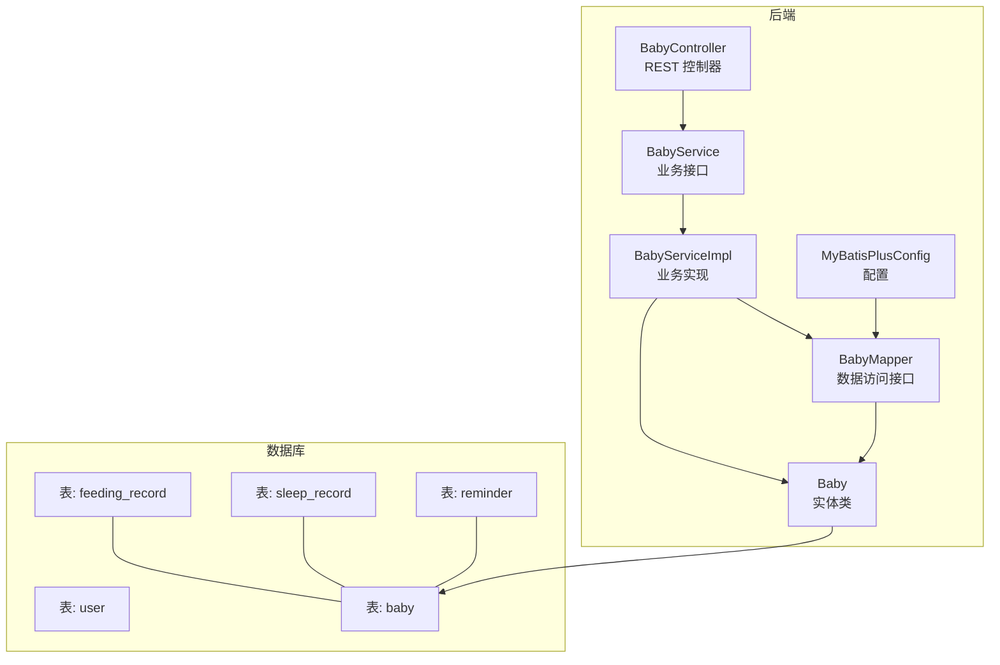
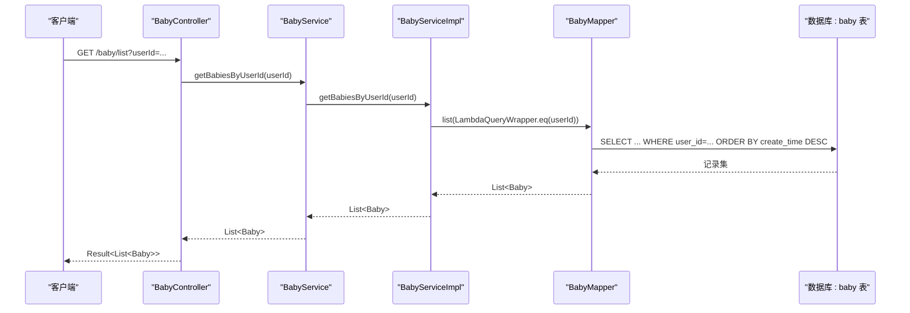
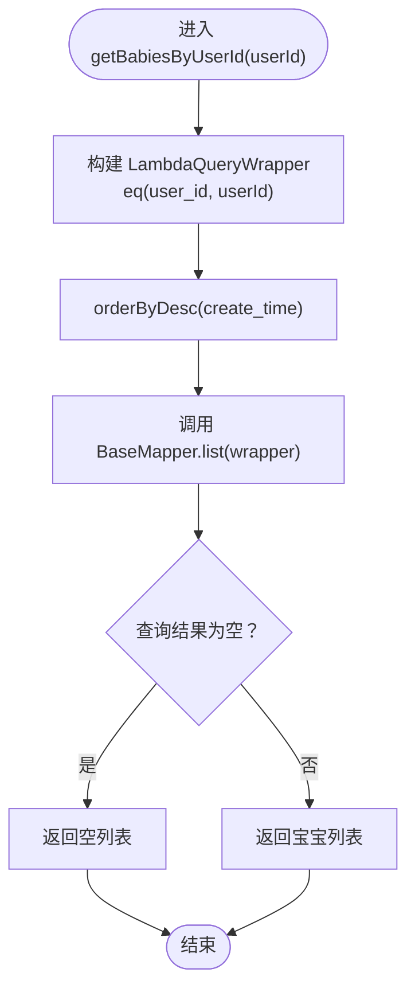
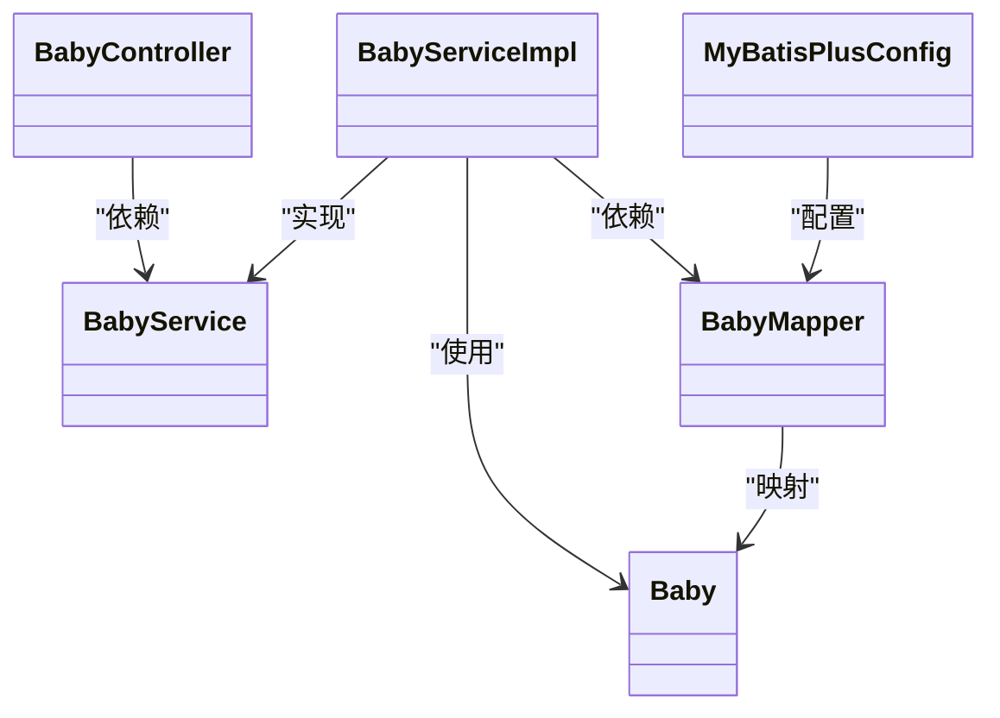
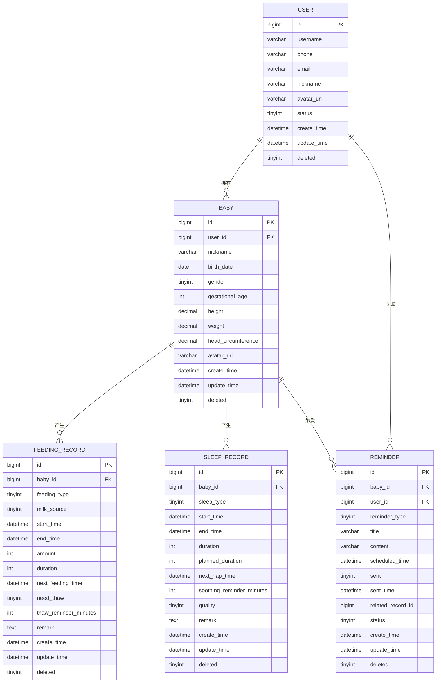

# Baby 数据访问

<cite>
**本文引用的文件列表**
- [Baby.java](file://backend/src/main/java/com/baby/entity/Baby.java)
- [BabyMapper.java](file://backend/src/main/java/com/baby/mapper/BabyMapper.java)
- [BabyService.java](file://backend/src/main/java/com/baby/service/BabyService.java)
- [BabyServiceImpl.java](file://backend/src/main/java/com/baby/service/impl/BabyServiceImpl.java)
- [BabyController.java](file://backend/src/main/java/com/baby/controller/BabyController.java)
- [init.sql](file://backend/src/main/resources/db/init.sql)
- [MyBatisPlusConfig.java](file://backend/src/main/java/com/baby/config/MyBatisPlusConfig.java)
- [FeedingRecord.java](file://backend/src/main/java/com/baby/entity/FeedingRecord.java)
- [SleepRecord.java](file://backend/src/main/java/com/baby/entity/SleepRecord.java)
- [FeedingRecordMapper.java](file://backend/src/main/java/com/baby/mapper/FeedingRecordMapper.java)
- [FeedingRecordServiceImpl.java](file://backend/src/main/java/com/baby/service/impl/FeedingRecordServiceImpl.java)
- [FeedingStatisticsVO.java](file://backend/src/main/java/com/baby/vo/FeedingStatisticsVO.java)
</cite>

## 目录
1. [简介](#简介)
2. [项目结构](#项目结构)
3. [核心组件](#核心组件)
4. [架构总览](#架构总览)
5. [详细组件分析](#详细组件分析)
6. [依赖关系分析](#依赖关系分析)
7. [性能考量](#性能考量)
8. [故障排查指南](#故障排查指南)
9. [结论](#结论)
10. [附录](#附录)

## 简介
本文件围绕 Baby 数据访问层进行系统化文档说明，重点阐述 BabyMapper 接口如何继承 MyBatis-Plus 的 BaseMapper<Baby> 来获得通用 CRUD 能力，并结合实体映射、数据库表结构、服务层典型查询示例、性能优化建议以及常见问题处理策略。同时补充与 Baby 相关的喂养记录、睡眠记录等实体的关系说明，帮助读者在不直接阅读代码的情况下也能理解数据访问层的设计与使用方式。

## 项目结构
- 后端采用分层架构：controller -> service -> mapper -> entity。
- Baby 数据访问层由 Mapper 接口、Service 接口与实现类组成，配合 MyBatis-Plus 的自动填充与分页插件。
- 数据库初始化脚本定义了用户、宝宝、喂养记录、睡眠记录、提醒任务等表及索引。

图表来源
- [BabyController.java](file://backend/src/main/java/com/baby/controller/BabyController.java#L1-L80)
- [BabyService.java](file://backend/src/main/java/com/baby/service/BabyService.java#L1-L38)
- [BabyServiceImpl.java](file://backend/src/main/java/com/baby/service/impl/BabyServiceImpl.java#L1-L91)
- [BabyMapper.java](file://backend/src/main/java/com/baby/mapper/BabyMapper.java#L1-L12)
- [Baby.java](file://backend/src/main/java/com/baby/entity/Baby.java#L1-L72)
- [init.sql](file://backend/src/main/resources/db/init.sql#L1-L147)
- [MyBatisPlusConfig.java](file://backend/src/main/java/com/baby/config/MyBatisPlusConfig.java#L1-L47)

章节来源
- [BabyController.java](file://backend/src/main/java/com/baby/controller/BabyController.java#L1-L80)
- [BabyService.java](file://backend/src/main/java/com/baby/service/BabyService.java#L1-L38)
- [BabyServiceImpl.java](file://backend/src/main/java/com/baby/service/impl/BabyServiceImpl.java#L1-L91)
- [BabyMapper.java](file://backend/src/main/java/com/baby/mapper/BabyMapper.java#L1-L12)
- [Baby.java](file://backend/src/main/java/com/baby/entity/Baby.java#L1-L72)
- [init.sql](file://backend/src/main/resources/db/init.sql#L1-L147)
- [MyBatisPlusConfig.java](file://backend/src/main/java/com/baby/config/MyBatisPlusConfig.java#L1-L47)

## 核心组件
- Baby 实体类：定义字段、主键策略、逻辑删除、自动填充等元数据。
- BabyMapper 接口：继承 BaseMapper<Baby>，获得通用 CRUD 能力；当前未声明自定义 SQL 注解方法。
- BabyService 接口与实现：提供业务方法，如按用户查询宝宝列表、计算月龄、更新生长指标等。
- 控制器：对外暴露 REST 接口，调用服务完成业务操作。

章节来源
- [Baby.java](file://backend/src/main/java/com/baby/entity/Baby.java#L1-L72)
- [BabyMapper.java](file://backend/src/main/java/com/baby/mapper/BabyMapper.java#L1-L12)
- [BabyService.java](file://backend/src/main/java/com/baby/service/BabyService.java#L1-L38)
- [BabyServiceImpl.java](file://backend/src/main/java/com/baby/service/impl/BabyServiceImpl.java#L1-L91)
- [BabyController.java](file://backend/src/main/java/com/baby/controller/BabyController.java#L1-L80)

## 架构总览
下图展示从控制器到数据访问层的整体调用链路，以及与数据库表的对应关系。

图表来源
- [BabyController.java](file://backend/src/main/java/com/baby/controller/BabyController.java#L42-L54)
- [BabyService.java](file://backend/src/main/java/com/baby/service/BabyService.java#L23-L27)
- [BabyServiceImpl.java](file://backend/src/main/java/com/baby/service/impl/BabyServiceImpl.java#L60-L66)
- [BabyMapper.java](file://backend/src/main/java/com/baby/mapper/BabyMapper.java#L1-L12)
- [init.sql](file://backend/src/main/resources/db/init.sql#L25-L41)

## 详细组件分析

### Baby 实体与数据库映射
- 表名映射：实体类通过注解映射到数据库表。
- 主键策略：自增主键。
- 字段类型与含义：
  - 关联用户ID：Long
  - 昵称：String
  - 出生日期：LocalDate
  - 性别：Integer（0-女，1-男）
  - 出生胎龄（周）：Integer
  - 身高（cm）、体重（kg）、头围（cm）：Double
  - 头像URL：String
  - 逻辑删除：Integer（0-未删除，1-已删除）
  - 自动填充：创建时间、更新时间
- 与记录表的关系：
  - 喂养记录表、睡眠记录表均以宝宝ID作为外键关联到该表。
  - 提醒任务表也以宝宝ID和用户ID共同关联。

章节来源
- [Baby.java](file://backend/src/main/java/com/baby/entity/Baby.java#L1-L72)
- [init.sql](file://backend/src/main/resources/db/init.sql#L25-L41)
- [FeedingRecord.java](file://backend/src/main/java/com/baby/entity/FeedingRecord.java#L1-L81)
- [SleepRecord.java](file://backend/src/main/java/com/baby/entity/SleepRecord.java#L1-L76)

### BabyMapper 接口与通用 CRUD
- 继承关系：BabyMapper 接口继承 BaseMapper<Baby>，从而天然具备通用 CRUD 能力（如保存、更新、删除、按主键查询、条件查询等）。
- 当前实现：接口未声明任何自定义 SQL 注解方法，所有查询均由服务层通过 LambdaQueryWrapper 构建条件并委托给 MyBatis-Plus 执行。
- 典型使用场景：
  - 按用户ID查询宝宝列表（排序按创建时间倒序）。
  - 按主键查询单个宝宝。
  - 事务性保存/更新/删除。

章节来源
- [BabyMapper.java](file://backend/src/main/java/com/baby/mapper/BabyMapper.java#L1-L12)
- [BabyServiceImpl.java](file://backend/src/main/java/com/baby/service/impl/BabyServiceImpl.java#L60-L66)

### 服务层典型查询与业务逻辑
- 按用户ID查询宝宝列表：服务层构造 LambdaQueryWrapper，限定用户ID并按创建时间倒序返回。
- 计算月龄：根据出生日期与当前日期计算，返回整数月龄。
- 更新生长指标：可选择性更新身高、体重、头围，支持部分字段更新。
- 控制器入口：
  - 获取用户所有宝宝：GET /baby/list?userId=...
  - 获取单个宝宝：GET /baby/{id}
  - 更新宝宝信息：PUT /baby/{id}
  - 更新生长指标：PUT /baby/{id}/growth?height=&weight=&headCircumference=
  - 删除宝宝：DELETE /baby/{id}
  - 获取月龄：GET /baby/{id}/age

章节来源
- [BabyService.java](file://backend/src/main/java/com/baby/service/BabyService.java#L1-L38)
- [BabyServiceImpl.java](file://backend/src/main/java/com/baby/service/impl/BabyServiceImpl.java#L60-L91)
- [BabyController.java](file://backend/src/main/java/com/baby/controller/BabyController.java#L24-L79)

### 与喂养记录、睡眠记录的关系
- 喂养记录与睡眠记录均以宝宝ID关联到 baby 表，形成一对多关系。
- 服务层统计与分析通常会结合宝宝月龄进行推荐值计算，例如喂养间隔、日均奶量等。

章节来源
- [FeedingRecord.java](file://backend/src/main/java/com/baby/entity/FeedingRecord.java#L1-L81)
- [SleepRecord.java](file://backend/src/main/java/com/baby/entity/SleepRecord.java#L1-L76)
- [FeedingRecordServiceImpl.java](file://backend/src/main/java/com/baby/service/impl/FeedingRecordServiceImpl.java#L140-L189)
- [FeedingStatisticsVO.java](file://backend/src/main/java/com/baby/vo/FeedingStatisticsVO.java#L1-L75)

### 查询流程与算法示意
以下流程图展示了按用户ID查询宝宝列表的执行路径与关键判断点：

图表来源
- [BabyServiceImpl.java](file://backend/src/main/java/com/baby/service/impl/BabyServiceImpl.java#L60-L66)
- [BabyMapper.java](file://backend/src/main/java/com/baby/mapper/BabyMapper.java#L1-L12)

## 依赖关系分析
- 控制器依赖服务接口，服务实现依赖 Mapper 接口与实体类。
- Mapper 接口依赖 MyBatis-Plus 的 BaseMapper，从而获得通用 CRUD 能力。
- 实体类通过注解与数据库表建立映射关系。
- MyBatis-Plus 配置提供分页插件与自动填充处理器。

图表来源
- [BabyController.java](file://backend/src/main/java/com/baby/controller/BabyController.java#L1-L80)
- [BabyService.java](file://backend/src/main/java/com/baby/service/BabyService.java#L1-L38)
- [BabyServiceImpl.java](file://backend/src/main/java/com/baby/service/impl/BabyServiceImpl.java#L1-L91)
- [BabyMapper.java](file://backend/src/main/java/com/baby/mapper/BabyMapper.java#L1-L12)
- [Baby.java](file://backend/src/main/java/com/baby/entity/Baby.java#L1-L72)
- [MyBatisPlusConfig.java](file://backend/src/main/java/com/baby/config/MyBatisPlusConfig.java#L1-L47)

章节来源
- [BabyController.java](file://backend/src/main/java/com/baby/controller/BabyController.java#L1-L80)
- [BabyService.java](file://backend/src/main/java/com/baby/service/BabyService.java#L1-L38)
- [BabyServiceImpl.java](file://backend/src/main/java/com/baby/service/impl/BabyServiceImpl.java#L1-L91)
- [BabyMapper.java](file://backend/src/main/java/com/baby/mapper/BabyMapper.java#L1-L12)
- [Baby.java](file://backend/src/main/java/com/baby/entity/Baby.java#L1-L72)
- [MyBatisPlusConfig.java](file://backend/src/main/java/com/baby/config/MyBatisPlusConfig.java#L1-L47)

## 性能考量
- 索引设计：
  - 宝宝表对 user_id 建有索引，适合按用户ID查询。
  - 喂养记录、睡眠记录、提醒任务表对常用查询字段建立了复合索引与单列索引，有助于提升范围查询与排序效率。
- 查询优化建议：
  - 使用分页：MyBatis-Plus 已配置分页插件，建议在大数据量场景下使用分页接口。
  - 避免 N+1 查询：服务层应一次性拉取所需数据，避免循环逐条查询。
  - 精准过滤：尽量在 WHERE 子句中使用索引列，减少全表扫描。
  - 选择性字段：仅查询必要字段，避免 SELECT *。
- 写入优化：
  - 批量写入：对于批量新增或更新，优先使用批量接口以减少往返。
  - 事务边界：将相关写操作放入同一事务，确保一致性与性能平衡。

章节来源
- [init.sql](file://backend/src/main/resources/db/init.sql#L25-L41)
- [FeedingRecord.java](file://backend/src/main/java/com/baby/entity/FeedingRecord.java#L1-L81)
- [SleepRecord.java](file://backend/src/main/java/com/baby/entity/SleepRecord.java#L1-L76)
- [MyBatisPlusConfig.java](file://backend/src/main/java/com/baby/config/MyBatisPlusConfig.java#L1-L47)

## 故障排查指南
- 常见问题与处理：
  - 逻辑删除：实体类包含逻辑删除字段，查询时需注意过滤 deleted 字段，避免误读软删除数据。
  - 自动填充：创建/更新时间由自动填充处理器维护，若出现异常，检查配置类中的填充逻辑。
  - 空指针与边界：计算月龄时需校验出生日期是否存在；更新生长指标时需判空并选择性更新。
  - 索引缺失：若按 user_id 或时间范围查询变慢，确认索引是否存在且有效。
- 建议的调试步骤：
  - 在服务层打印关键参数与 SQL（可通过 MyBatis 日志查看）。
  - 验证数据库索引是否命中。
  - 对高频查询引入缓存（如按用户ID的宝宝列表）以降低数据库压力。

章节来源
- [Baby.java](file://backend/src/main/java/com/baby/entity/Baby.java#L63-L71)
- [MyBatisPlusConfig.java](file://backend/src/main/java/com/baby/config/MyBatisPlusConfig.java#L1-L47)
- [BabyServiceImpl.java](file://backend/src/main/java/com/baby/service/impl/BabyServiceImpl.java#L81-L91)

## 结论
BabyMapper 通过继承 BaseMapper<Baby> 获得了完整的通用 CRUD 能力，当前未定义额外的自定义 SQL 方法，所有查询均由服务层基于 LambdaQueryWrapper 构造条件并委托执行。实体与数据库表映射清晰，配合合理的索引与分页配置，能够满足按用户维度查询宝宝列表、计算月龄、更新生长指标等典型业务需求。建议在高并发与大数据量场景下进一步优化查询与写入策略，并关注逻辑删除与自动填充等细节。

## 附录
- 数据模型关系图（简化）

图表来源
- [init.sql](file://backend/src/main/resources/db/init.sql#L1-L147)