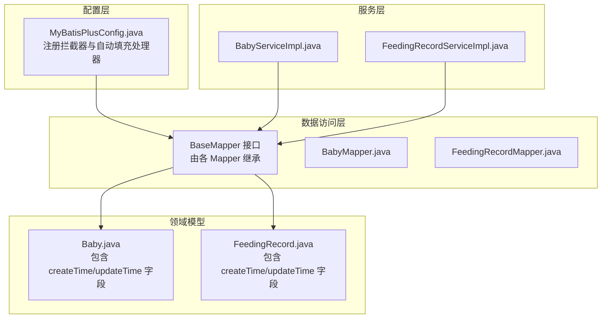
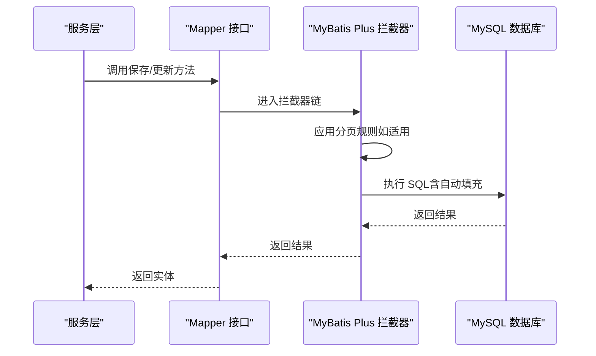
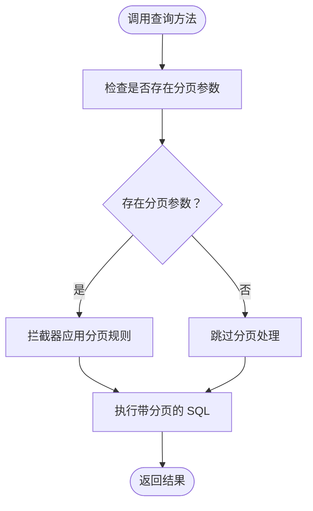
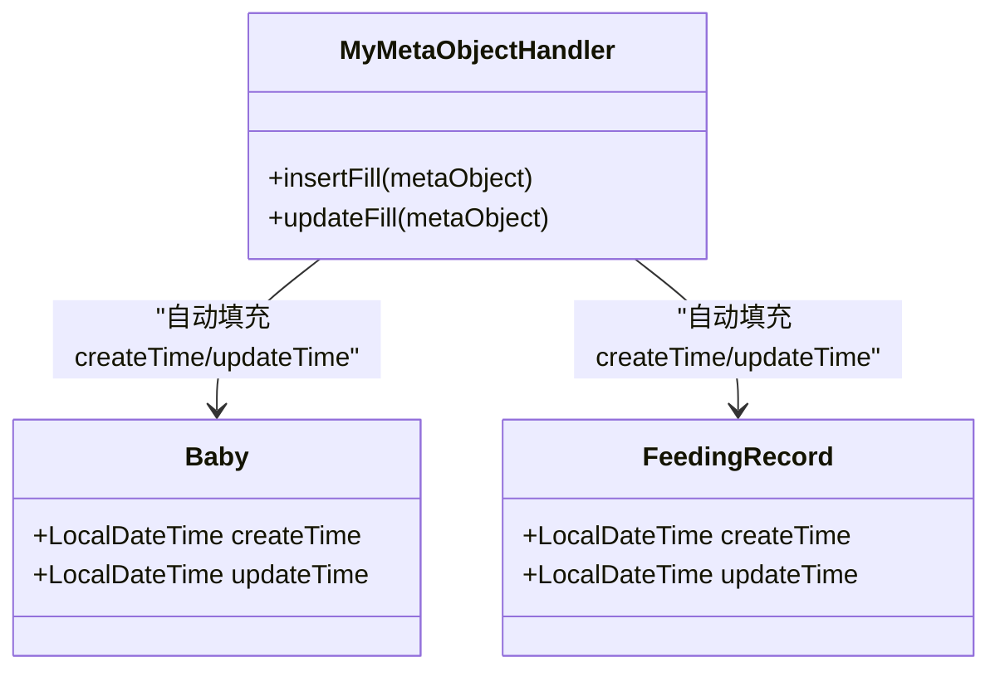
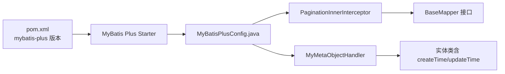

# MyBatis Plus 配置

<cite>
**本文引用的文件**
- [MyBatisPlusConfig.java](file://backend/src/main/java/com/baby/config/MyBatisPlusConfig.java)
- [Baby.java](file://backend/src/main/java/com/baby/entity/Baby.java)
- [FeedingRecord.java](file://backend/src/main/java/com/baby/entity/FeedingRecord.java)
- [BabyServiceImpl.java](file://backend/src/main/java/com/baby/service/impl/BabyServiceImpl.java)
- [FeedingRecordServiceImpl.java](file://backend/src/main/java/com/baby/service/impl/FeedingRecordServiceImpl.java)
- [BabyMapper.java](file://backend/src/main/java/com/baby/mapper/BabyMapper.java)
- [application.yml](file://backend/src/main/resources/application.yml)
- [pom.xml](file://backend/pom.xml)
</cite>

## 目录
1. [简介](#简介)
2. [项目结构](#项目结构)
3. [核心组件](#核心组件)
4. [架构总览](#架构总览)
5. [详细组件分析](#详细组件分析)
6. [依赖关系分析](#依赖关系分析)
7. [性能考量](#性能考量)
8. [故障排查指南](#故障排查指南)
9. [结论](#结论)
10. [附录](#附录)

## 简介
本文件围绕 MyBatis Plus 的配置与使用进行系统化说明，重点覆盖以下方面：
- mybatisPlusInterceptor() 方法如何通过 PaginationInnerInterceptor 为 MySQL 提供自动分页支持，并在所有 Mapper 查询中生效。
- MyMetaObjectHandler 内部类如何实现 createTime、updateTime 字段的自动填充，分别在插入和更新时注入当前时间。
- 这些配置如何减少样板代码并确保实体层面的一致性审计。
- 在服务层如何利用这些能力完成常见业务操作。
- 分页的性能影响与最佳实践。
- 扩展 MetaObjectHandler 以支持更多字段的建议。
- 时区处理、并发与事务集成等潜在问题与对策。

## 项目结构
MyBatis Plus 配置位于配置包中，实体与服务层通过注解与继承 MyBatis Plus 的通用能力实现自动填充与分页。数据库连接与 MyBatis Plus 全局配置在应用配置文件中声明。

图表来源
- [MyBatisPlusConfig.java](file://backend/src/main/java/com/baby/config/MyBatisPlusConfig.java#L1-L48)
- [BabyMapper.java](file://backend/src/main/java/com/baby/mapper/BabyMapper.java#L1-L13)
- [Baby.java](file://backend/src/main/java/com/baby/entity/Baby.java#L1-L72)
- [FeedingRecord.java](file://backend/src/main/java/com/baby/entity/FeedingRecord.java#L1-L81)
- [BabyServiceImpl.java](file://backend/src/main/java/com/baby/service/impl/BabyServiceImpl.java#L1-L91)
- [FeedingRecordServiceImpl.java](file://backend/src/main/java/com/baby/service/impl/FeedingRecordServiceImpl.java#L1-L231)

章节来源
- [MyBatisPlusConfig.java](file://backend/src/main/java/com/baby/config/MyBatisPlusConfig.java#L1-L48)
- [application.yml](file://backend/src/main/resources/application.yml#L1-L98)
- [pom.xml](file://backend/pom.xml#L1-L135)

## 核心组件
- MyBatis Plus 拦截器注册：通过 mybatisPlusInterceptor() 注册 PaginationInnerInterceptor，使所有基于 MyBatis Plus 的查询具备分页能力。
- 自动填充处理器：MyMetaObjectHandler 实现 MetaObjectHandler，在插入与更新时自动填充 createTime、updateTime 字段。
- 实体字段映射：实体类通过注解声明 createTime、updateTime 字段，并标注插入/插入+更新的自动填充策略。

章节来源
- [MyBatisPlusConfig.java](file://backend/src/main/java/com/baby/config/MyBatisPlusConfig.java#L1-L48)
- [Baby.java](file://backend/src/main/java/com/baby/entity/Baby.java#L60-L71)
- [FeedingRecord.java](file://backend/src/main/java/com/baby/entity/FeedingRecord.java#L70-L80)

## 架构总览
MyBatis Plus 的配置在启动时被 Spring 加载，拦截器链路贯穿所有 SQL 执行阶段；自动填充处理器在实体对象进入持久化前自动注入时间戳，保证审计字段一致性。

图表来源
- [MyBatisPlusConfig.java](file://backend/src/main/java/com/baby/config/MyBatisPlusConfig.java#L20-L46)
- [BabyMapper.java](file://backend/src/main/java/com/baby/mapper/BabyMapper.java#L1-L13)
- [application.yml](file://backend/src/main/resources/application.yml#L23-L35)

## 详细组件分析

### mybatisPlusInterceptor() 分页拦截器
- 目的：为所有基于 MyBatis Plus 的查询提供自动分页支持，适配 MySQL 数据库方言。
- 实现要点：
  - 注册 MybatisPlusInterceptor 并添加 PaginationInnerInterceptor(DbType.MYSQL)。
  - 该拦截器会在执行查询时根据分页参数自动改写 SQL，实现物理分页。
- 使用场景：
  - 当服务层需要对列表进行分页展示时，无需手动拼接分页 SQL，直接传入分页参数即可。
  - 与 BaseMapper 的查询方法配合，可无缝获得分页结果。

图表来源
- [MyBatisPlusConfig.java](file://backend/src/main/java/com/baby/config/MyBatisPlusConfig.java#L20-L28)

章节来源
- [MyBatisPlusConfig.java](file://backend/src/main/java/com/baby/config/MyBatisPlusConfig.java#L20-L28)
- [application.yml](file://backend/src/main/resources/application.yml#L23-L35)

### MyMetaObjectHandler 自动填充
- 目的：在实体插入与更新时自动填充审计字段，避免重复赋值逻辑，统一时间来源。
- 实现要点：
  - insertFill：在插入时为 createTime、updateTime 赋值为当前时间。
  - updateFill：在更新时仅更新 updateTime 为当前时间。
  - 通过 strictInsertFill/strictUpdateFill 保证字段类型匹配与注入成功。
- 实体字段映射：
  - 实体类通过注解将 createTime、updateTime 标记为自动填充字段，确保处理器能识别并注入。

图表来源
- [MyBatisPlusConfig.java](file://backend/src/main/java/com/baby/config/MyBatisPlusConfig.java#L30-L46)
- [Baby.java](file://backend/src/main/java/com/baby/entity/Baby.java#L60-L71)
- [FeedingRecord.java](file://backend/src/main/java/com/baby/entity/FeedingRecord.java#L70-L80)

章节来源
- [MyBatisPlusConfig.java](file://backend/src/main/java/com/baby/config/MyBatisPlusConfig.java#L30-L46)
- [Baby.java](file://backend/src/main/java/com/baby/entity/Baby.java#L60-L71)
- [FeedingRecord.java](file://backend/src/main/java/com/baby/entity/FeedingRecord.java#L70-L80)

### 服务层使用示例
- 插入与更新：
  - 服务层在保存/更新实体时无需手动设置 createTime、updateTime，自动填充处理器会按需注入。
  - 示例路径：[BabyServiceImpl.java](file://backend/src/main/java/com/baby/service/impl/BabyServiceImpl.java#L24-L58)、[FeedingRecordServiceImpl.java](file://backend/src/main/java/com/baby/service/impl/FeedingRecordServiceImpl.java#L48-L114)
- 列表查询与排序：
  - 服务层通过条件构造器进行查询与排序，分页由拦截器自动处理。
  - 示例路径：[BabyServiceImpl.java](file://backend/src/main/java/com/baby/service/impl/BabyServiceImpl.java#L60-L65)、[FeedingRecordServiceImpl.java](file://backend/src/main/java/com/baby/service/impl/FeedingRecordServiceImpl.java#L116-L141)

章节来源
- [BabyServiceImpl.java](file://backend/src/main/java/com/baby/service/impl/BabyServiceImpl.java#L24-L91)
- [FeedingRecordServiceImpl.java](file://backend/src/main/java/com/baby/service/impl/FeedingRecordServiceImpl.java#L48-L141)

## 依赖关系分析
- MyBatis Plus 版本与依赖：
  - 项目使用 mybatis-plus-spring-boot3-starter，版本号在 pom 中声明。
- 数据源与时区：
  - 数据源 URL 显式设置了 Asia/Shanghai 时区，有助于保证数据库侧时间与应用侧 LocalDateTime 的一致性。
- 全局配置：
  - mybatis-plus.global-config.db-config.id-type、logic-delete-field 等全局配置与本节关注的分页与自动填充无直接冲突，但应保持一致的实体设计与字段命名。

图表来源
- [pom.xml](file://backend/pom.xml#L21-L51)
- [MyBatisPlusConfig.java](file://backend/src/main/java/com/baby/config/MyBatisPlusConfig.java#L1-L48)
- [application.yml](file://backend/src/main/resources/application.yml#L10-L15)

章节来源
- [pom.xml](file://backend/pom.xml#L21-L51)
- [application.yml](file://backend/src/main/resources/application.yml#L10-L15)

## 性能考量
- 分页性能：
  - 物理分页在大数据量下仍需谨慎，建议结合合适的索引与查询条件，避免全表扫描。
  - 对于高频查询，优先使用覆盖索引与精准过滤条件，减少不必要的排序与聚合。
- 自动填充开销：
  - 自动填充为轻量级操作，通常可忽略不计；但在批量写入场景中，建议评估整体事务提交成本。
- 时区与本地化：
  - 数据库连接已设置 Asia/Shanghai，建议确保应用服务器时区与数据库一致，避免跨时区导致的时间偏差。
- 并发与事务：
  - 自动填充在单个持久化操作内执行，受事务边界保护；批量操作时应合理拆分事务大小，避免长时间锁持有。

[本节为通用指导，不直接分析具体文件]

## 故障排查指南
- 分页未生效
  - 检查是否正确注册了 MyBatis Plus 拦截器，以及查询是否通过 MyBatis Plus 的 Mapper 接口执行。
  - 章节来源：[MyBatisPlusConfig.java](file://backend/src/main/java/com/baby/config/MyBatisPlusConfig.java#L20-L28)
- 自动填充字段为空
  - 确认实体类字段已标注自动填充注解，并且字段名与处理器注入名称一致。
  - 章节来源：[Baby.java](file://backend/src/main/java/com/baby/entity/Baby.java#L60-L71)、[FeedingRecord.java](file://backend/src/main/java/com/baby/entity/FeedingRecord.java#L70-L80)
- 时区不一致导致时间偏差
  - 确认数据库连接 URL 的 serverTimezone 参数与应用时区一致。
  - 章节来源：[application.yml](file://backend/src/main/resources/application.yml#L10-L15)
- 并发与事务问题
  - 在高并发场景下，确保更新操作使用合适的锁策略与事务隔离级别；批量写入时拆分事务，降低锁竞争。
  - 章节来源：[BabyServiceImpl.java](file://backend/src/main/java/com/baby/service/impl/BabyServiceImpl.java#L24-L58)

## 结论
MyBatis Plus 的分页拦截器与自动填充处理器显著降低了实体审计字段的维护成本，提升了开发效率与一致性。通过合理的索引设计、事务拆分与时区配置，可以在保证性能的前提下稳定运行。扩展 MetaObjectHandler 时，建议遵循“最小必要”原则，逐步引入新字段并配套测试。

[本节为总结性内容，不直接分析具体文件]

## 附录

### 扩展 MetaObjectHandler 的最佳实践
- 新增字段建议：
  - 仅新增审计相关字段（如 creator、modifier），并为插入与更新分别设置填充策略。
  - 保持字段命名规范，与实体注解保持一致。
- 测试建议：
  - 编写单元测试验证插入与更新时字段是否正确填充。
  - 在批量导入场景下验证事务与性能表现。
- 注意事项：
  - 避免在自动填充中执行耗时操作（如远程调用）。
  - 如需区分“创建者/修改者”，可在业务层传递上下文信息并通过处理器读取。

[本节为通用指导，不直接分析具体文件]