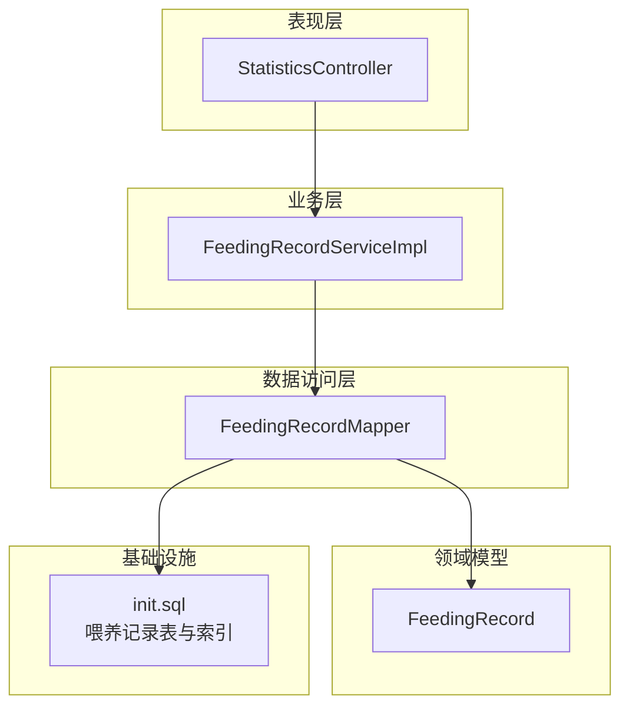
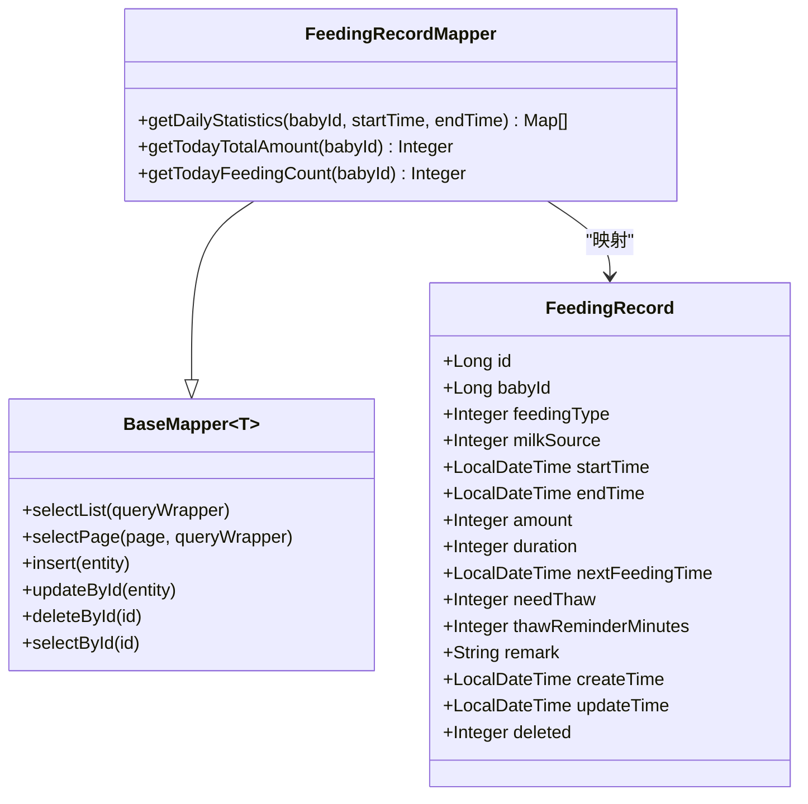
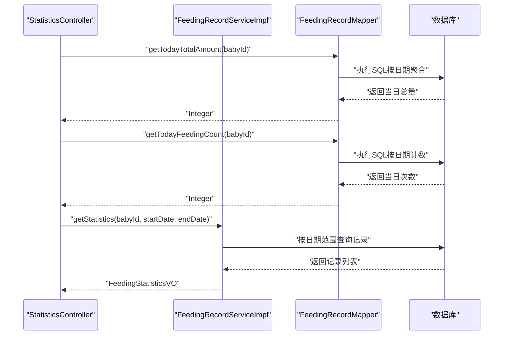
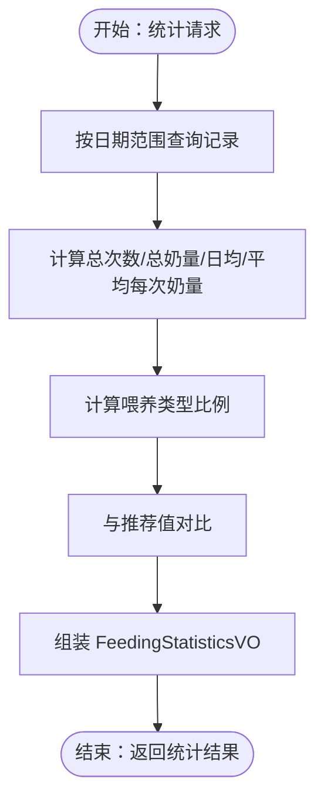
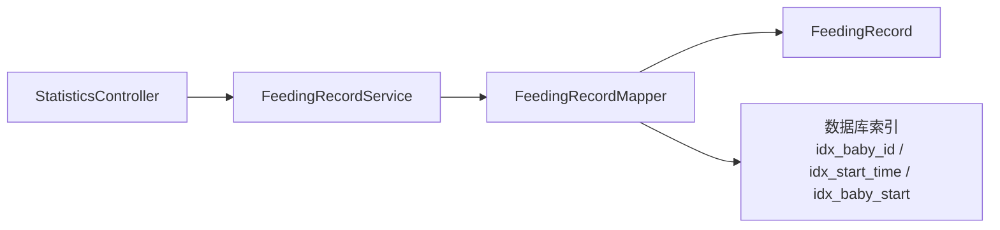

# 喂养记录数据访问

<cite>
**本文引用的文件**
- [FeedingRecordMapper.java](file://backend/src/main/java/com/baby/mapper/FeedingRecordMapper.java)
- [FeedingRecord.java](file://backend/src/main/java/com/baby/entity/FeedingRecord.java)
- [FeedingRecordServiceImpl.java](file://backend/src/main/java/com/baby/service/impl/FeedingRecordServiceImpl.java)
- [FeedingRecordService.java](file://backend/src/main/java/com/baby/service/FeedingRecordService.java)
- [StatisticsController.java](file://backend/src/main/java/com/baby/controller/StatisticsController.java)
- [ReminderServiceImpl.java](file://backend/src/main/java/com/baby/service/impl/ReminderServiceImpl.java)
- [init.sql](file://backend/src/main/resources/db/init.sql)
</cite>

## 目录
1. [简介](#简介)
2. [项目结构](#项目结构)
3. [核心组件](#核心组件)
4. [架构总览](#架构总览)
5. [详细组件分析](#详细组件分析)
6. [依赖关系分析](#依赖关系分析)
7. [性能考量](#性能考量)
8. [故障排查指南](#故障排查指南)
9. [结论](#结论)

## 简介
本文件围绕 FeedingRecordMapper 接口展开，系统性说明其如何继承 MyBatis Plus 的 BaseMapper 并扩展自定义查询方法，以支撑统计分析与提醒服务。重点覆盖：
- 查询喂养记录按宝宝 ID、时间范围、喂养类型的聚合视图
- 复杂统计查询（如按日汇总喂养时长与奶量）
- 与 StatisticsController 和 ReminderService 的集成方式
- 参数化查询、@Param 注解使用、MyBatis Plus Wrapper 的配合
- 性能优化建议（索引策略、时间序列查询优化、分页模式）

## 项目结构
后端采用分层架构：Controller -> Service -> Mapper -> Entity。喂养相关的核心路径如下：
- 控制器：StatisticsController
- 服务：FeedingRecordServiceImpl（提供统计与查询封装）
- 数据访问：FeedingRecordMapper（扩展自 BaseMapper）
- 实体：FeedingRecord
- 数据库初始化：init.sql（包含喂养记录表及索引）

图表来源
- [StatisticsController.java](file://backend/src/main/java/com/baby/controller/StatisticsController.java#L1-L149)
- [FeedingRecordServiceImpl.java](file://backend/src/main/java/com/baby/service/impl/FeedingRecordServiceImpl.java#L1-L231)
- [FeedingRecordMapper.java](file://backend/src/main/java/com/baby/mapper/FeedingRecordMapper.java#L1-L47)
- [FeedingRecord.java](file://backend/src/main/java/com/baby/entity/FeedingRecord.java#L1-L81)
- [init.sql](file://backend/src/main/resources/db/init.sql#L43-L63)

章节来源
- [StatisticsController.java](file://backend/src/main/java/com/baby/controller/StatisticsController.java#L1-L149)
- [FeedingRecordServiceImpl.java](file://backend/src/main/java/com/baby/service/impl/FeedingRecordServiceImpl.java#L1-L231)
- [FeedingRecordMapper.java](file://backend/src/main/java/com/baby/mapper/FeedingRecordMapper.java#L1-L47)
- [FeedingRecord.java](file://backend/src/main/java/com/baby/entity/FeedingRecord.java#L1-L81)
- [init.sql](file://backend/src/main/resources/db/init.sql#L43-L63)

## 核心组件
- FeedingRecordMapper：扩展 BaseMapper<FeedingRecord>，新增按时间范围的每日统计、当日总量与次数等聚合查询。
- FeedingRecordServiceImpl：在服务层对 Mapper 进行二次封装，提供按日期范围查询、统计 VO 构造、推荐值计算等。
- StatisticsController：对外提供统计 API，调用 FeedingRecordMapper 与 FeedingRecordServiceImpl 获取聚合数据。
- ReminderServiceImpl：在创建喂养记录后触发提醒，间接依赖喂养记录数据进行后续提醒安排。

章节来源
- [FeedingRecordMapper.java](file://backend/src/main/java/com/baby/mapper/FeedingRecordMapper.java#L1-L47)
- [FeedingRecordServiceImpl.java](file://backend/src/main/java/com/baby/service/impl/FeedingRecordServiceImpl.java#L1-L231)
- [StatisticsController.java](file://backend/src/main/java/com/baby/controller/StatisticsController.java#L1-L149)
- [ReminderServiceImpl.java](file://backend/src/main/java/com/baby/service/impl/ReminderServiceImpl.java#L1-L242)

## 架构总览
下面的类图展示了 FeedingRecordMapper 与其父类 BaseMapper 的关系，以及与实体 FeedingRecord 的映射关系。

图表来源
- [FeedingRecordMapper.java](file://backend/src/main/java/com/baby/mapper/FeedingRecordMapper.java#L1-L47)
- [FeedingRecord.java](file://backend/src/main/java/com/baby/entity/FeedingRecord.java#L1-L81)

## 详细组件分析

### FeedingRecordMapper 接口职责与实现
- 继承关系：FeedingRecordMapper 扩展 BaseMapper<FeedingRecord>，天然具备通用 CRUD 能力。
- 自定义方法：
  - getDailyStatistics：按宝宝 ID 与时间范围统计每日奶量与次数，返回 Map 列表，便于前端绘制日度折线/柱状图。
  - getTodayTotalAmount：当日奶量总和。
  - getTodayFeedingCount：当日喂养次数。
- 参数化查询与注解：使用 @Param 标注方法参数，确保 SQL 中通过 #{} 正确绑定。
- SQL 特点：
  - 使用 deleted 字段进行逻辑删除过滤，避免统计到已删除记录。
  - 时间范围使用 BETWEEN，日期聚合使用 DATE(start_time)，支持跨天统计。
  - 使用 IFNULL 或 SUM/COUNT 聚合函数，保证空集安全。

章节来源
- [FeedingRecordMapper.java](file://backend/src/main/java/com/baby/mapper/FeedingRecordMapper.java#L1-L47)

### 与 StatisticsController 的集成
- StatisticsController 在“今日概览”接口中直接调用 FeedingRecordMapper 的 getTodayTotalAmount 与 getTodayFeedingCount，结合睡眠统计与推荐值，输出综合视图。
- “喂养分析”接口委托给 FeedingRecordServiceImpl.getStatistics，后者内部会使用 FeedingRecordMapper 的通用查询能力（例如按日期范围查询）来构造统计 VO。

图表来源
- [StatisticsController.java](file://backend/src/main/java/com/baby/controller/StatisticsController.java#L36-L100)
- [FeedingRecordServiceImpl.java](file://backend/src/main/java/com/baby/service/impl/FeedingRecordServiceImpl.java#L127-L189)
- [FeedingRecordMapper.java](file://backend/src/main/java/com/baby/mapper/FeedingRecordMapper.java#L33-L45)

章节来源
- [StatisticsController.java](file://backend/src/main/java/com/baby/controller/StatisticsController.java#L1-L149)
- [FeedingRecordServiceImpl.java](file://backend/src/main/java/com/baby/service/impl/FeedingRecordServiceImpl.java#L127-L189)
- [FeedingRecordMapper.java](file://backend/src/main/java/com/baby/mapper/FeedingRecordMapper.java#L1-L47)

### 与 ReminderService 的协作
- ReminderServiceImpl 在创建喂养记录后，会根据记录的 nextFeedingTime 等字段生成喂奶提醒；虽然不直接调用 FeedingRecordMapper 的统计方法，但其业务流程依赖喂养记录数据的正确性与完整性。
- 该协作体现了数据访问层（Mapper）为上层服务提供的基础数据能力。

章节来源
- [ReminderServiceImpl.java](file://backend/src/main/java/com/baby/service/impl/ReminderServiceImpl.java#L37-L101)
- [FeedingRecordServiceImpl.java](file://backend/src/main/java/com/baby/service/impl/FeedingRecordServiceImpl.java#L47-L89)

### 复杂统计查询与数据流
- getDailyStatistics 返回每日的日期、总量与次数，适合前端做趋势分析。
- FeedingRecordServiceImpl.getStatistics 在服务层完成更复杂的统计（总次数、总奶量、日均、平均每次奶量、喂养类型比例等），并结合推荐值进行对比分析。

图表来源
- [FeedingRecordServiceImpl.java](file://backend/src/main/java/com/baby/service/impl/FeedingRecordServiceImpl.java#L143-L189)

章节来源
- [FeedingRecordServiceImpl.java](file://backend/src/main/java/com/baby/service/impl/FeedingRecordServiceImpl.java#L143-L189)

### 参数化查询与 MyBatis Plus Wrapper 配合
- 参数化查询：FeedingRecordMapper 使用 @Param 标注参数，SQL 通过 #{} 绑定，避免拼接风险。
- Wrapper 使用：FeedingRecordServiceImpl 在按日期范围查询时使用 LambdaQueryWrapper，示例包括 between(start_time, startOfDay, endOfDay)、orderByDesc 等，便于构建复杂条件与排序。
- 组合使用：当需要数据库侧聚合（如 getDailyStatistics）时使用原生 SQL；当需要灵活条件与排序时使用 Wrapper。

章节来源
- [FeedingRecordMapper.java](file://backend/src/main/java/com/baby/mapper/FeedingRecordMapper.java#L20-L45)
- [FeedingRecordServiceImpl.java](file://backend/src/main/java/com/baby/service/impl/FeedingRecordServiceImpl.java#L116-L133)

## 依赖关系分析
- 控制器依赖服务：StatisticsController 依赖 FeedingRecordService 与 FeedingRecordMapper。
- 服务依赖 Mapper：FeedingRecordServiceImpl 依赖 FeedingRecordMapper 与 FeedingSettingMapper，并通过 Wrapper 进行查询。
- Mapper 依赖实体：FeedingRecordMapper 映射到 FeedingRecord 实体，遵循 MyBatis Plus 的命名约定。
- 数据库索引：init.sql 为喂养记录表建立了 idx_baby_id、idx_start_time、idx_baby_start 复合索引，有利于按宝宝与时间范围的查询。

图表来源
- [StatisticsController.java](file://backend/src/main/java/com/baby/controller/StatisticsController.java#L1-L149)
- [FeedingRecordServiceImpl.java](file://backend/src/main/java/com/baby/service/impl/FeedingRecordServiceImpl.java#L1-L231)
- [FeedingRecordMapper.java](file://backend/src/main/java/com/baby/mapper/FeedingRecordMapper.java#L1-L47)
- [FeedingRecord.java](file://backend/src/main/java/com/baby/entity/FeedingRecord.java#L1-L81)
- [init.sql](file://backend/src/main/resources/db/init.sql#L43-L63)

章节来源
- [StatisticsController.java](file://backend/src/main/java/com/baby/controller/StatisticsController.java#L1-L149)
- [FeedingRecordServiceImpl.java](file://backend/src/main/java/com/baby/service/impl/FeedingRecordServiceImpl.java#L1-L231)
- [FeedingRecordMapper.java](file://backend/src/main/java/com/baby/mapper/FeedingRecordMapper.java#L1-L47)
- [init.sql](file://backend/src/main/resources/db/init.sql#L43-L63)

## 性能考量
- 索引策略
  - idx_baby_id：按宝宝维度过滤，适合 getRecordsByDateRange、getTodayRecords 等按宝宝 ID 的查询。
  - idx_start_time：按时间范围过滤，适合按时间段的统计与排序。
  - idx_baby_start（复合索引）：同时覆盖宝宝 ID 与开始时间，可显著提升按宝宝+时间范围的查询性能，尤其在大数据量场景下。
- 时间序列查询优化
  - 使用 BETWEEN 范围查询时，尽量将边界时间规范化到天级（例如 atStartOfDay 与 plusDays(1)）以避免跨天边界问题。
  - 聚合查询（getDailyStatistics）使用 DATE(start_time) 分组，建议确保 idx_baby_start 覆盖 start_time，以减少回表与排序成本。
- 分页模式
  - 当查询结果集较大时，建议在服务层使用 MyBatis Plus 的分页 Page 对象，避免一次性加载全部数据。
  - 对于统计接口，若需要展示大量日期维度数据，可考虑后端分页或前端分页，减少单次响应体积。
- 其他建议
  - 对 deleted 字段建立索引或保持其高选择性，避免全表扫描。
  - 对高频查询（如今日概览）可考虑缓存短期聚合结果，降低数据库压力。

章节来源
- [init.sql](file://backend/src/main/resources/db/init.sql#L43-L63)
- [FeedingRecordServiceImpl.java](file://backend/src/main/java/com/baby/service/impl/FeedingRecordServiceImpl.java#L116-L133)
- [FeedingRecordMapper.java](file://backend/src/main/java/com/baby/mapper/FeedingRecordMapper.java#L20-L45)

## 故障排查指南
- 统计结果异常
  - 检查 deleted 字段是否被正确过滤（应为 0）。
  - 检查时间范围边界是否按天级处理，避免跨天导致的漏统计。
- 索引未生效
  - 确认查询条件是否命中 idx_baby_start（同时包含 baby_id 与 start_time）。
  - 使用 EXPLAIN 分析慢查询，确认是否发生全表扫描或额外排序。
- 参数绑定问题
  - 确认 @Param 名称与 SQL 中 #{} 名称一致，避免运行时报错。
- 日期聚合不准确
  - getDailyStatistics 使用 DATE(start_time) 聚合，确保 start_time 存储精度为秒级，避免毫秒导致的日期漂移。

章节来源
- [FeedingRecordMapper.java](file://backend/src/main/java/com/baby/mapper/FeedingRecordMapper.java#L20-L45)
- [FeedingRecordServiceImpl.java](file://backend/src/main/java/com/baby/service/impl/FeedingRecordServiceImpl.java#L116-L133)
- [init.sql](file://backend/src/main/resources/db/init.sql#L43-L63)

## 结论
FeedingRecordMapper 通过继承 BaseMapper 并扩展自定义聚合查询，为 StatisticsController 与 ReminderService 提供了稳定、高效的喂养数据视图。配合合理的索引设计与 Wrapper 使用，可在时间序列场景下获得良好性能。建议在生产环境中结合分页与缓存策略进一步优化大体量数据的查询与展示体验。