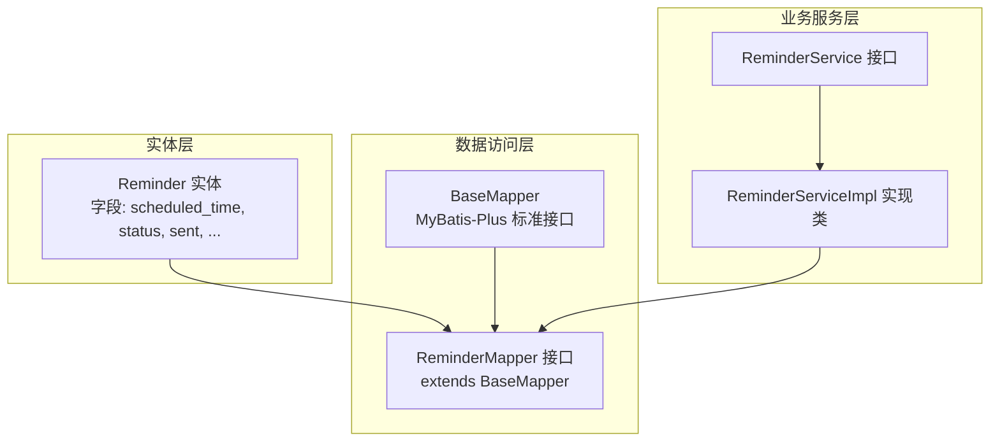
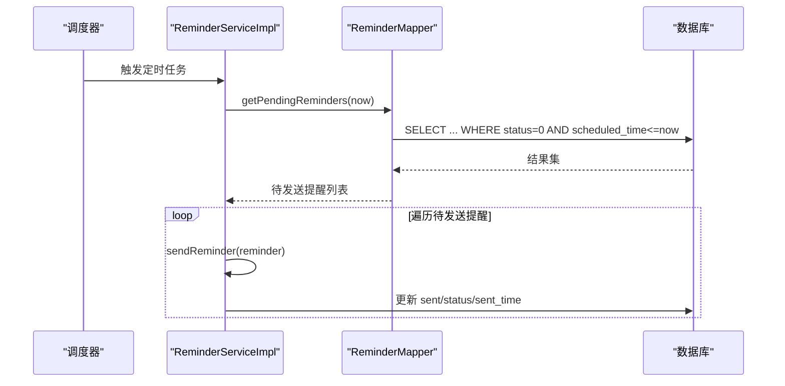
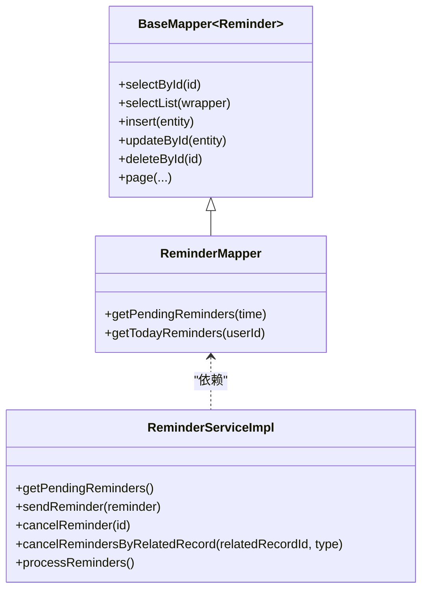
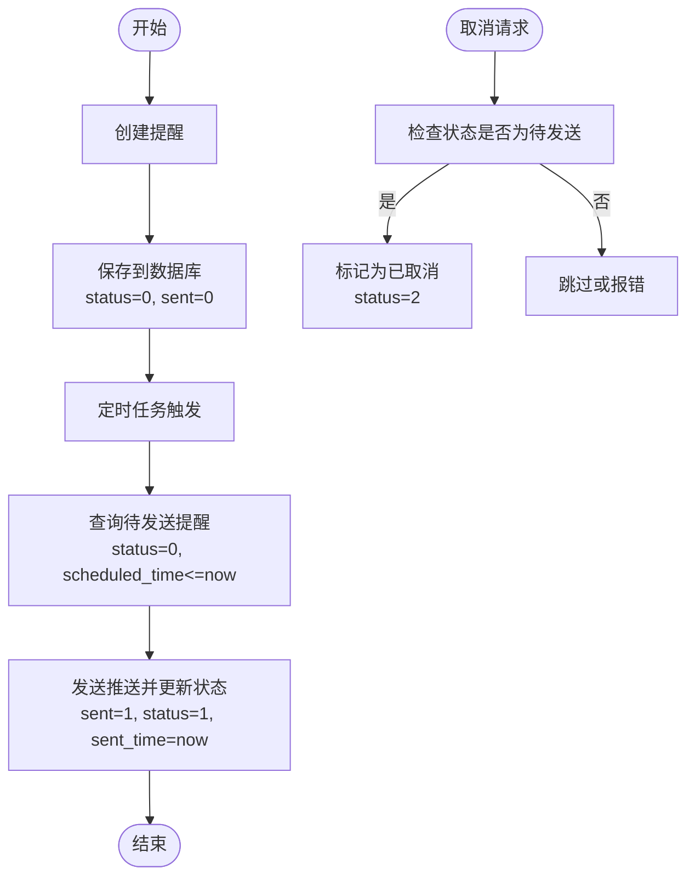
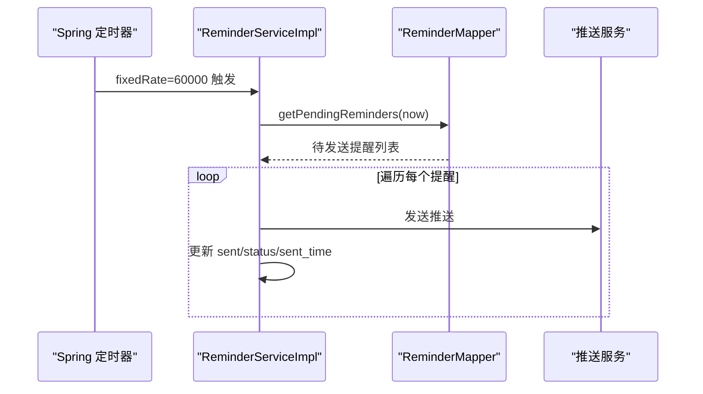
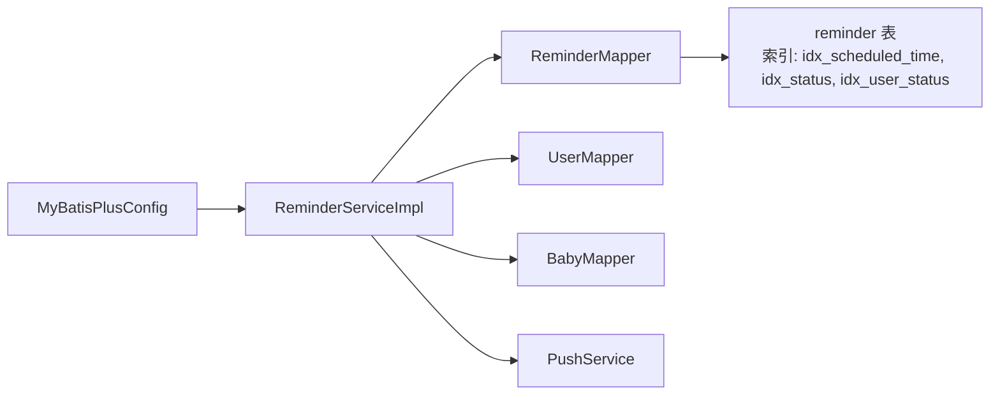

# 提醒数据访问

<cite>
**本文引用的文件**
- [Reminder.java](file://backend/src/main/java/com/baby/entity/Reminder.java)
- [ReminderMapper.java](file://backend/src/main/java/com/baby/mapper/ReminderMapper.java)
- [ReminderService.java](file://backend/src/main/java/com/baby/service/ReminderService.java)
- [ReminderServiceImpl.java](file://backend/src/main/java/com/baby/service/impl/ReminderServiceImpl.java)
- [init.sql](file://backend/src/main/resources/db/init.sql)
- [MyBatisPlusConfig.java](file://backend/src/main/java/com/baby/config/MyBatisPlusConfig.java)
</cite>

## 目录
1. [简介](#简介)
2. [项目结构](#项目结构)
3. [核心组件](#核心组件)
4. [架构总览](#架构总览)
5. [详细组件分析](#详细组件分析)
6. [依赖关系分析](#依赖关系分析)
7. [性能考量](#性能考量)
8. [故障排查指南](#故障排查指南)
9. [结论](#结论)

## 简介
本文件围绕 ReminderMapper 接口展开，系统性说明其如何继承 MyBatis-Plus 的 BaseMapper 并扩展出针对“待发送提醒”和“当日提醒”的查询方法；同时梳理 ReminderService 在处理定时通知时对这些查询的使用方式、过滤条件（如 nextTriggerTime 对应 scheduled_time 与 status），以及生命周期管理中的状态更新策略。文档还讨论了高并发场景下的索引优化、查询频率控制与可扩展的分布式协调思路。

## 项目结构
- 实体层：Reminder 表示提醒任务，包含 scheduled_time、status、sent 等字段。
- 数据访问层：ReminderMapper 继承 BaseMapper<Reminder>，提供基于 SQL 的两类查询。
- 业务服务层：ReminderService 定义对外能力；ReminderServiceImpl 实现定时扫描、发送、取消等逻辑，并调用 Mapper 查询。

图表来源
- [Reminder.java](file://backend/src/main/java/com/baby/entity/Reminder.java#L1-L76)
- [ReminderMapper.java](file://backend/src/main/java/com/baby/mapper/ReminderMapper.java#L1-L35)
- [ReminderService.java](file://backend/src/main/java/com/baby/service/ReminderService.java#L1-L64)
- [ReminderServiceImpl.java](file://backend/src/main/java/com/baby/service/impl/ReminderServiceImpl.java#L1-L242)

章节来源
- [Reminder.java](file://backend/src/main/java/com/baby/entity/Reminder.java#L1-L76)
- [ReminderMapper.java](file://backend/src/main/java/com/baby/mapper/ReminderMapper.java#L1-L35)
- [ReminderService.java](file://backend/src/main/java/com/baby/service/ReminderService.java#L1-L64)
- [ReminderServiceImpl.java](file://backend/src/main/java/com/baby/service/impl/ReminderServiceImpl.java#L1-L242)

## 核心组件
- Reminder 实体：定义提醒任务的字段，包括 scheduled_time（预定提醒时间）、status（状态）、sent（是否已发送）等。
- ReminderMapper：继承 BaseMapper<Reminder>，新增两个查询方法：
  - getPendingReminders(time)：查询 status=0 且 scheduled_time <= 当前时间的待发送提醒。
  - getTodayReminders(userId)：查询某用户当日 status=0 且 scheduled_time 为当天的待发送提醒。
- ReminderService：定义创建、查询、发送、取消等能力；实现类 ReminderServiceImpl 使用上述查询进行定时扫描与发送。
- 数据库初始化脚本：在 reminder 表上建立若干索引，支撑上述查询与业务场景。

章节来源
- [Reminder.java](file://backend/src/main/java/com/baby/entity/Reminder.java#L1-L76)
- [ReminderMapper.java](file://backend/src/main/java/com/baby/mapper/ReminderMapper.java#L1-L35)
- [ReminderService.java](file://backend/src/main/java/com/baby/service/ReminderService.java#L1-L64)
- [ReminderServiceImpl.java](file://backend/src/main/java/com/baby/service/impl/ReminderServiceImpl.java#L1-L242)
- [init.sql](file://backend/src/main/resources/db/init.sql#L121-L141)

## 架构总览
ReminderMapper 作为数据访问层的关键入口，向上被 ReminderServiceImpl 依赖，向下直接映射到数据库表 reminder。服务层通过定时任务周期性拉取待发送提醒并执行发送流程，同时支持取消与批量取消。

图表来源
- [ReminderServiceImpl.java](file://backend/src/main/java/com/baby/service/impl/ReminderServiceImpl.java#L231-L241)
- [ReminderMapper.java](file://backend/src/main/java/com/baby/mapper/ReminderMapper.java#L17-L24)
- [init.sql](file://backend/src/main/resources/db/init.sql#L121-L141)

## 详细组件分析

### ReminderMapper 接口与继承关系
- 继承关系：ReminderMapper extends BaseMapper<Reminder>，因此天然具备 CRUD 与分页等通用能力。
- 新增查询：
  - getPendingReminders(time)：按 scheduled_time <= 指定时间、status=0、deleted=0 进行筛选并按 scheduled_time 升序返回。
  - getTodayReminders(userId)：按 user_id、status=0、deleted=0 且 scheduled_time 属于当天进行筛选并按 scheduled_time 升序返回。

图表来源
- [ReminderMapper.java](file://backend/src/main/java/com/baby/mapper/ReminderMapper.java#L1-L35)
- [ReminderServiceImpl.java](file://backend/src/main/java/com/baby/service/impl/ReminderServiceImpl.java#L1-L242)

章节来源
- [ReminderMapper.java](file://backend/src/main/java/com/baby/mapper/ReminderMapper.java#L1-L35)
- [ReminderServiceImpl.java](file://backend/src/main/java/com/baby/service/impl/ReminderServiceImpl.java#L1-L242)

### 查询语义与过滤条件
- 待发送提醒查询（getPendingReminders）：
  - 条件：status=0（待发送）、deleted=0（未逻辑删除）、scheduled_time <= 当前时间。
  - 排序：按 scheduled_time 升序，便于优先处理更早的提醒。
- 用户当日提醒查询（getTodayReminders）：
  - 条件：user_id、status=0、deleted=0、scheduled_time 属于当天。
  - 排序：按 scheduled_time 升序，便于前端展示。

章节来源
- [ReminderMapper.java](file://backend/src/main/java/com/baby/mapper/ReminderMapper.java#L17-L33)
- [ReminderServiceImpl.java](file://backend/src/main/java/com/baby/service/impl/ReminderServiceImpl.java#L166-L170)

### 生命周期管理与状态更新
- 创建：ReminderServiceImpl 在创建喂奶/解冻/小睡/哄睡提醒后保存至数据库，初始状态为待发送。
- 发送：sendReminder 流程中，先校验用户与设备 Token，再调用推送服务，最后原子性地将 sent 置 1、status 置 1、sent_time 写入当前时间。
- 取消：cancelReminder 与 cancelRemindersByRelatedRecord 将状态置为已取消（status=2），仅对未发送且未取消的提醒生效。
- 逻辑删除：实体注解 @TableLogic 标识 deleted 字段参与逻辑删除，查询默认排除 deleted=1 的记录。

图表来源
- [ReminderServiceImpl.java](file://backend/src/main/java/com/baby/service/impl/ReminderServiceImpl.java#L189-L211)
- [ReminderServiceImpl.java](file://backend/src/main/java/com/baby/service/impl/ReminderServiceImpl.java#L213-L229)
- [ReminderMapper.java](file://backend/src/main/java/com/baby/mapper/ReminderMapper.java#L17-L24)
- [Reminder.java](file://backend/src/main/java/com/baby/entity/Reminder.java#L1-L76)

章节来源
- [ReminderServiceImpl.java](file://backend/src/main/java/com/baby/service/impl/ReminderServiceImpl.java#L189-L211)
- [ReminderServiceImpl.java](file://backend/src/main/java/com/baby/service/impl/ReminderServiceImpl.java#L213-L229)
- [Reminder.java](file://backend/src/main/java/com/baby/entity/Reminder.java#L1-L76)

### 时间驱动的轮询与通知处理
- 定时任务：每分钟执行一次 processReminders，内部调用 getPendingReminders 获取待发送提醒并逐条发送。
- 通知处理：sendReminder 中包含用户设备 Token 校验与异常日志记录，确保发送失败时不会破坏整体流程。

图表来源
- [ReminderServiceImpl.java](file://backend/src/main/java/com/baby/service/impl/ReminderServiceImpl.java#L231-L241)
- [ReminderMapper.java](file://backend/src/main/java/com/baby/mapper/ReminderMapper.java#L17-L24)

章节来源
- [ReminderServiceImpl.java](file://backend/src/main/java/com/baby/service/impl/ReminderServiceImpl.java#L231-L241)
- [ReminderMapper.java](file://backend/src/main/java/com/baby/mapper/ReminderMapper.java#L17-L24)

### 乐观锁与分布式协调
- 乐观锁：当前实体未声明 @TableVersion 或 @Version 字段，未启用数据库层面的版本号并发控制。若需强一致写入，可在实体中增加版本字段并在更新时携带版本号。
- 分布式协调：当前代码未集成 Redis。若要扩展为分布式环境，可在发送前加分布式锁（如基于 Redis 的 SET key value NX EX seconds），或引入消息队列异步化发送，降低服务端压力。

章节来源
- [Reminder.java](file://backend/src/main/java/com/baby/entity/Reminder.java#L1-L76)
- [ReminderServiceImpl.java](file://backend/src/main/java/com/baby/service/impl/ReminderServiceImpl.java#L189-L211)

## 依赖关系分析
- Mapper 依赖：ReminderMapper 依赖 MyBatis-Plus 的 BaseMapper 能力，同时依赖数据库表 reminder 的结构与索引。
- Service 依赖：ReminderServiceImpl 依赖 ReminderMapper、UserMapper、BabyMapper 与 PushService，形成“提醒创建—查询—发送—状态更新”的闭环。
- 配置依赖：MyBatisPlusConfig 提供分页与自动填充配置，间接影响查询与写入行为。

图表来源
- [ReminderServiceImpl.java](file://backend/src/main/java/com/baby/service/impl/ReminderServiceImpl.java#L1-L242)
- [ReminderMapper.java](file://backend/src/main/java/com/baby/mapper/ReminderMapper.java#L1-L35)
- [init.sql](file://backend/src/main/resources/db/init.sql#L121-L141)
- [MyBatisPlusConfig.java](file://backend/src/main/java/com/baby/config/MyBatisPlusConfig.java#L1-L47)

章节来源
- [ReminderServiceImpl.java](file://backend/src/main/java/com/baby/service/impl/ReminderServiceImpl.java#L1-L242)
- [ReminderMapper.java](file://backend/src/main/java/com/baby/mapper/ReminderMapper.java#L1-L35)
- [init.sql](file://backend/src/main/resources/db/init.sql#L121-L141)
- [MyBatisPlusConfig.java](file://backend/src/main/java/com/baby/config/MyBatisPlusConfig.java#L1-L47)

## 性能考量
- 索引设计：
  - idx_scheduled_time：支撑 getPendingReminders 的时间过滤与排序。
  - idx_status：支撑按状态过滤（如待发送）。
  - idx_user_status：支撑按用户与状态组合过滤（如 getTodayReminders）。
- 查询频率优化：
  - 当前采用固定周期（每分钟）扫描，建议结合业务峰值与 QPS 评估调整周期，或引入限流与背压策略。
  - 对于高并发场景，可考虑分片键（如 user_id）拆分扫描范围，减少单次查询结果集规模。
- 写入路径优化：
  - 发送成功后的更新操作为单条记录更新，建议保持幂等性（例如只在 sent=0 时更新），避免重复发送导致的状态回退。
- 读写分离与缓存：
  - 对于“当日提醒”这类高频读场景，可在应用层引入短期缓存（如本地缓存或 Redis 缓存），以降低数据库压力。
- 逻辑删除与清理：
  - deleted 字段配合软删除，建议定期归档或清理历史数据，避免索引膨胀。

章节来源
- [init.sql](file://backend/src/main/resources/db/init.sql#L121-L141)
- [ReminderMapper.java](file://backend/src/main/java/com/baby/mapper/ReminderMapper.java#L17-L33)
- [ReminderServiceImpl.java](file://backend/src/main/java/com/baby/service/impl/ReminderServiceImpl.java#L231-L241)

## 故障排查指南
- 无法发送提醒：
  - 检查用户是否存在且 device_token 是否非空。
  - 查看发送异常日志，定位推送服务调用失败原因。
- 重复发送或漏发：
  - 确认 sent 与 status 字段更新是否成功提交事务。
  - 若存在并发写入，考虑引入乐观锁或分布式锁。
- 查询结果为空：
  - 确认 scheduled_time 是否正确、status 是否为 0、deleted 是否为 0。
  - 检查索引是否生效（可通过 EXPLAIN 分析）。
- 定时任务未触发：
  - 确认 Spring 定时任务开关与线程池配置。

章节来源
- [ReminderServiceImpl.java](file://backend/src/main/java/com/baby/service/impl/ReminderServiceImpl.java#L189-L211)
- [ReminderMapper.java](file://backend/src/main/java/com/baby/mapper/ReminderMapper.java#L17-L33)

## 结论
ReminderMapper 通过继承 BaseMapper 并新增两条关键查询，为提醒系统的“待发送扫描”与“当日提醒展示”提供了高效的数据通道。ReminderServiceImpl 利用这些查询构建了稳定的定时通知机制，并在发送过程中完成状态更新。结合数据库索引与查询频率优化，可在高并发场景下保持稳定表现。若需进一步提升一致性与可扩展性，可考虑引入乐观锁与分布式协调方案。