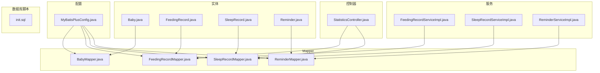
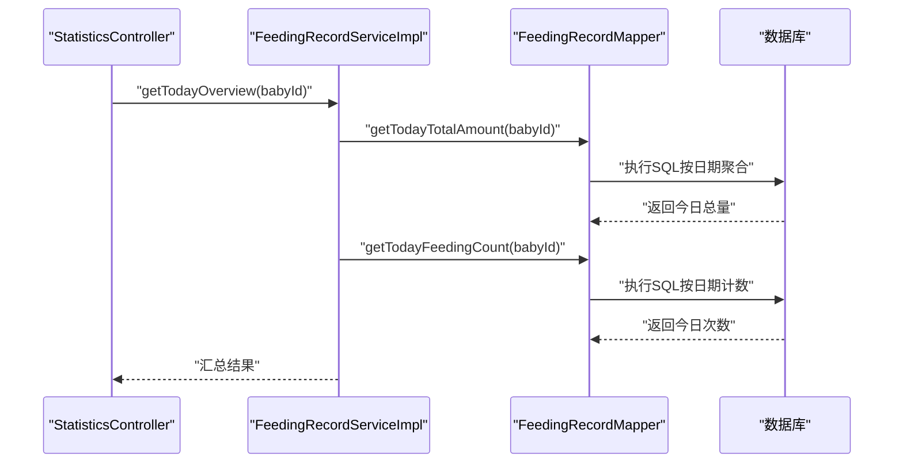
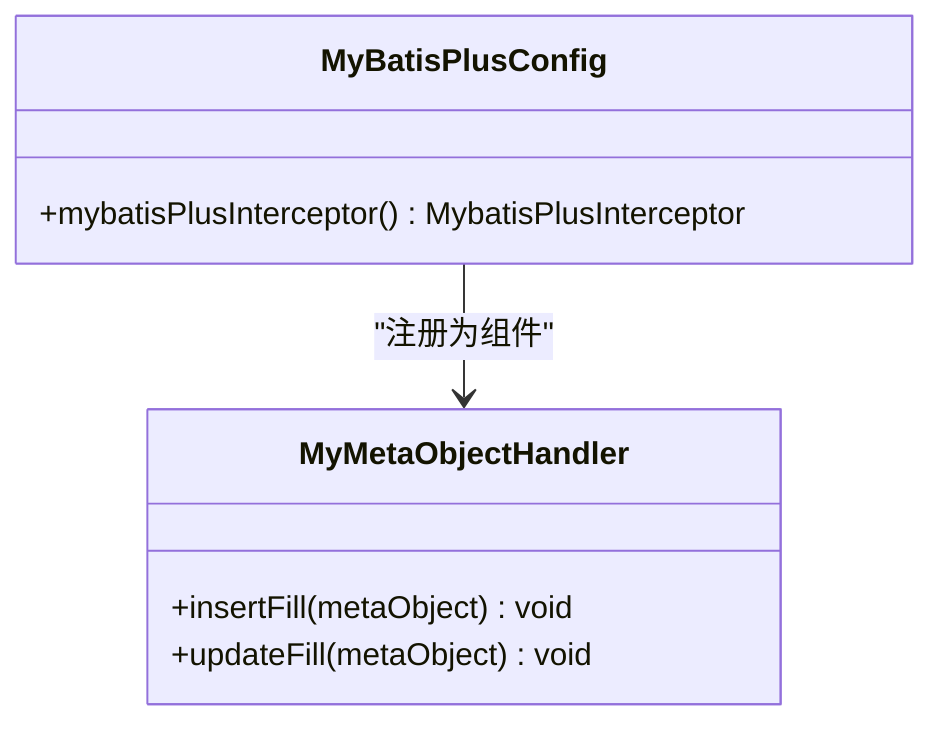
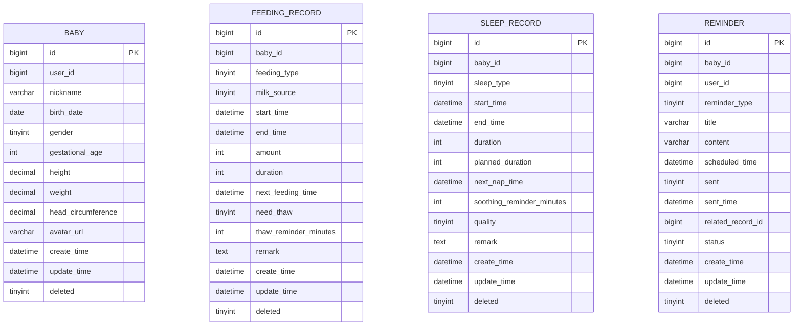
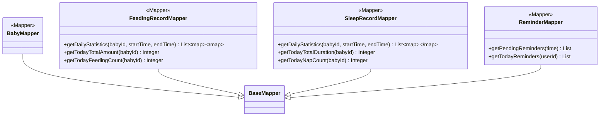
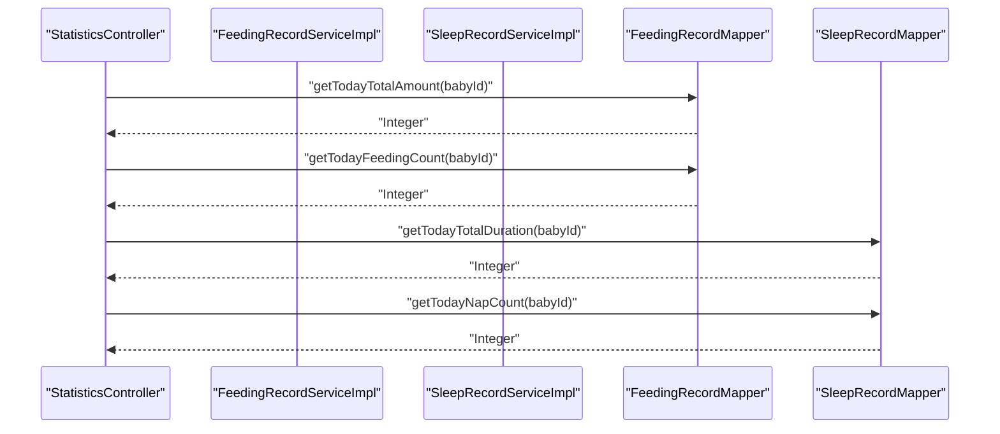
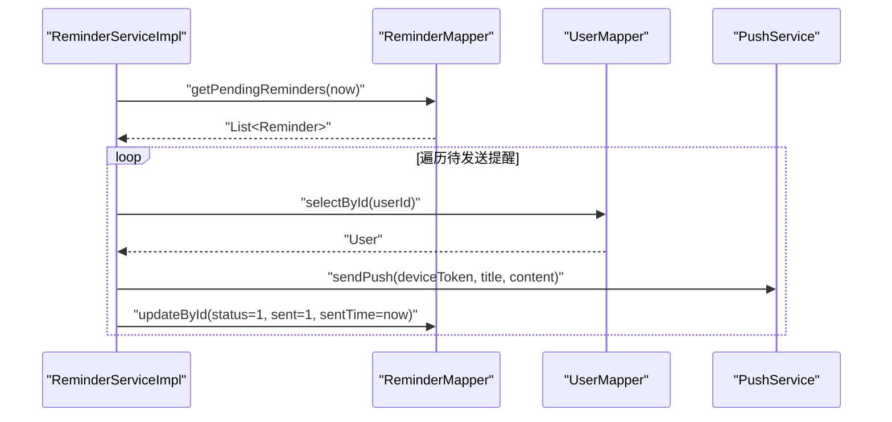
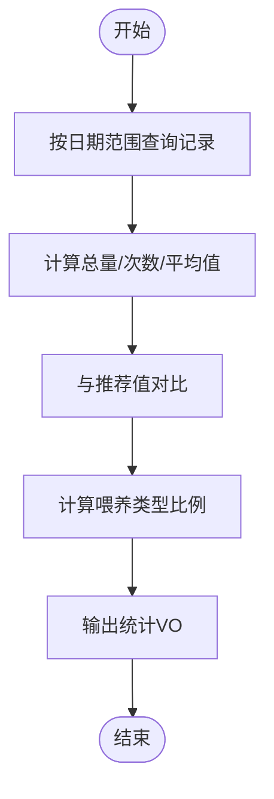
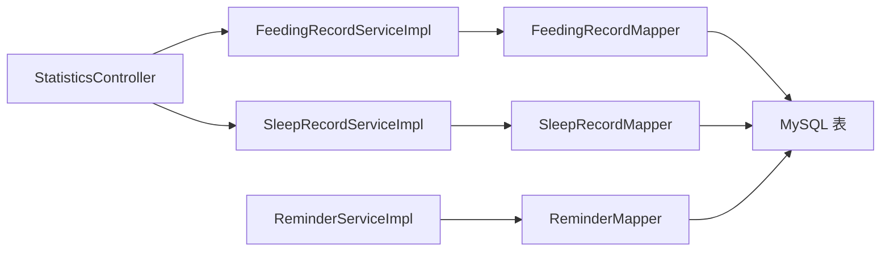

# 数据访问层

<cite>
**本文引用的文件**
- [MyBatisPlusConfig.java](file://backend/src/main/java/com/baby/config/MyBatisPlusConfig.java)
- [Baby.java](file://backend/src/main/java/com/baby/entity/Baby.java)
- [FeedingRecord.java](file://backend/src/main/java/com/baby/entity/FeedingRecord.java)
- [SleepRecord.java](file://backend/src/main/java/com/baby/entity/SleepRecord.java)
- [Reminder.java](file://backend/src/main/java/com/baby/entity/Reminder.java)
- [BabyMapper.java](file://backend/src/main/java/com/baby/mapper/BabyMapper.java)
- [FeedingRecordMapper.java](file://backend/src/main/java/com/baby/mapper/FeedingRecordMapper.java)
- [SleepRecordMapper.java](file://backend/src/main/java/com/baby/mapper/SleepRecordMapper.java)
- [ReminderMapper.java](file://backend/src/main/java/com/baby/mapper/ReminderMapper.java)
- [init.sql](file://backend/src/main/resources/db/init.sql)
- [StatisticsController.java](file://backend/src/main/java/com/baby/controller/StatisticsController.java)
- [FeedingRecordServiceImpl.java](file://backend/src/main/java/com/baby/service/impl/FeedingRecordServiceImpl.java)
- [SleepRecordServiceImpl.java](file://backend/src/main/java/com/baby/service/impl/SleepRecordServiceImpl.java)
- [ReminderServiceImpl.java](file://backend/src/main/java/com/baby/service/impl/ReminderServiceImpl.java)
</cite>

## 目录
1. [简介](#简介)
2. [项目结构](#项目结构)
3. [核心组件](#核心组件)
4. [架构总览](#架构总览)
5. [详细组件分析](#详细组件分析)
6. [依赖关系分析](#依赖关系分析)
7. [性能考量](#性能考量)
8. [故障排查指南](#故障排查指南)
9. [结论](#结论)
10. [附录](#附录)

## 简介
本文件系统性梳理后端数据访问层（MyBatis Plus）的设计与实现，覆盖以下主题：
- Mapper 接口如何继承 BaseMapper 实现通用 CRUD。
- 使用 @Select 注解编写自定义查询，包括统计类查询与提醒处理。
- MyBatis Plus 配置：分页拦截器与自动字段填充（MetaObjectHandler）。
- 实体与表映射关系、逻辑删除策略及索引设计。
- 复杂查询示例（统计生成、提醒处理流程）。
- 性能优化建议与高效 SQL 编写最佳实践。

## 项目结构
数据访问层位于 backend/src/main/java/com/baby/ 目录下，主要由三部分组成：
- config：MyBatis Plus 配置（分页与自动填充）
- entity：实体类（含表名映射、逻辑删除、自动填充字段）
- mapper：Mapper 接口（BaseMapper 扩展 + @Select 自定义方法）

图表来源
- [MyBatisPlusConfig.java](file://backend/src/main/java/com/baby/config/MyBatisPlusConfig.java#L1-L48)
- [Baby.java](file://backend/src/main/java/com/baby/entity/Baby.java#L1-L72)
- [FeedingRecord.java](file://backend/src/main/java/com/baby/entity/FeedingRecord.java#L1-L81)
- [SleepRecord.java](file://backend/src/main/java/com/baby/entity/SleepRecord.java#L1-L76)
- [Reminder.java](file://backend/src/main/java/com/baby/entity/Reminder.java#L1-L76)
- [BabyMapper.java](file://backend/src/main/java/com/baby/mapper/BabyMapper.java#L1-L13)
- [FeedingRecordMapper.java](file://backend/src/main/java/com/baby/mapper/FeedingRecordMapper.java#L1-L47)
- [SleepRecordMapper.java](file://backend/src/main/java/com/baby/mapper/SleepRecordMapper.java#L1-L48)
- [ReminderMapper.java](file://backend/src/main/java/com/baby/mapper/ReminderMapper.java#L1-L35)
- [FeedingRecordServiceImpl.java](file://backend/src/main/java/com/baby/service/impl/FeedingRecordServiceImpl.java#L1-L231)
- [SleepRecordServiceImpl.java](file://backend/src/main/java/com/baby/service/impl/SleepRecordServiceImpl.java#L1-L279)
- [ReminderServiceImpl.java](file://backend/src/main/java/com/baby/service/impl/ReminderServiceImpl.java#L1-L242)
- [StatisticsController.java](file://backend/src/main/java/com/baby/controller/StatisticsController.java#L1-L149)
- [init.sql](file://backend/src/main/resources/db/init.sql#L1-L147)

章节来源
- [MyBatisPlusConfig.java](file://backend/src/main/java/com/baby/config/MyBatisPlusConfig.java#L1-L48)
- [init.sql](file://backend/src/main/resources/db/init.sql#L1-L147)

## 核心组件
- MyBatisPlusConfig：注册分页拦截器与自动填充处理器，确保分页与时间戳字段自动维护。
- 实体类：通过注解完成表名映射、主键策略、逻辑删除与自动填充字段。
- Mapper 接口：继承 BaseMapper 获得通用 CRUD；使用 @Select 编写统计与提醒相关查询。
- 服务层：封装业务逻辑，调用 Mapper 完成复杂查询与更新。
- 控制器：对外提供统计接口，调用服务层生成报表。

章节来源
- [MyBatisPlusConfig.java](file://backend/src/main/java/com/baby/config/MyBatisPlusConfig.java#L1-L48)
- [Baby.java](file://backend/src/main/java/com/baby/entity/Baby.java#L1-L72)
- [FeedingRecord.java](file://backend/src/main/java/com/baby/entity/FeedingRecord.java#L1-L81)
- [SleepRecord.java](file://backend/src/main/java/com/baby/entity/SleepRecord.java#L1-L76)
- [Reminder.java](file://backend/src/main/java/com/baby/entity/Reminder.java#L1-L76)
- [BabyMapper.java](file://backend/src/main/java/com/baby/mapper/BabyMapper.java#L1-L13)
- [FeedingRecordMapper.java](file://backend/src/main/java/com/baby/mapper/FeedingRecordMapper.java#L1-L47)
- [SleepRecordMapper.java](file://backend/src/main/java/com/baby/mapper/SleepRecordMapper.java#L1-L48)
- [ReminderMapper.java](file://backend/src/main/java/com/baby/mapper/ReminderMapper.java#L1-L35)
- [FeedingRecordServiceImpl.java](file://backend/src/main/java/com/baby/service/impl/FeedingRecordServiceImpl.java#L1-L231)
- [SleepRecordServiceImpl.java](file://backend/src/main/java/com/baby/service/impl/SleepRecordServiceImpl.java#L1-L279)
- [ReminderServiceImpl.java](file://backend/src/main/java/com/baby/service/impl/ReminderServiceImpl.java#L1-L242)
- [StatisticsController.java](file://backend/src/main/java/com/baby/controller/StatisticsController.java#L1-L149)

## 架构总览
MyBatis Plus 在本项目中的作用：
- 分页：通过 PaginationInnerInterceptor 对分页查询进行拦截与增强。
- 自动填充：MetaObjectHandler 在插入/更新时自动填充 createTime/updateTime。
- 逻辑删除：实体标注 @TableLogic，查询默认过滤 deleted=0 的记录。

图表来源
- [StatisticsController.java](file://backend/src/main/java/com/baby/controller/StatisticsController.java#L36-L71)
- [FeedingRecordServiceImpl.java](file://backend/src/main/java/com/baby/service/impl/FeedingRecordServiceImpl.java#L116-L133)
- [FeedingRecordMapper.java](file://backend/src/main/java/com/baby/mapper/FeedingRecordMapper.java#L18-L46)

章节来源
- [MyBatisPlusConfig.java](file://backend/src/main/java/com/baby/config/MyBatisPlusConfig.java#L23-L46)
- [FeedingRecordMapper.java](file://backend/src/main/java/com/baby/mapper/FeedingRecordMapper.java#L18-L46)
- [SleepRecordMapper.java](file://backend/src/main/java/com/baby/mapper/SleepRecordMapper.java#L18-L48)
- [ReminderMapper.java](file://backend/src/main/java/com/baby/mapper/ReminderMapper.java#L16-L35)

## 详细组件分析

### MyBatis Plus 配置
- 分页拦截器：在 MySQL 环境下注册 PaginationInnerInterceptor，支持 Page 对象自动注入与分页 SQL 改写。
- 自动填充：MyMetaObjectHandler 在插入时填充 createTime/updateTime，在更新时仅更新 updateTime。

图表来源
- [MyBatisPlusConfig.java](file://backend/src/main/java/com/baby/config/MyBatisPlusConfig.java#L23-L46)

章节来源
- [MyBatisPlusConfig.java](file://backend/src/main/java/com/baby/config/MyBatisPlusConfig.java#L23-L46)

### 实体与表映射
- 表名映射：各实体通过 @TableName 映射到对应表。
- 主键策略：@TableId(type = IdType.AUTO) 使用数据库自增。
- 逻辑删除：@TableLogic 标注 deleted 字段，查询默认过滤 deleted=0。
- 自动填充：@TableField(fill = FieldFill.INSERT/INSERT_UPDATE) 配合 MetaObjectHandler。

图表来源
- [Baby.java](file://backend/src/main/java/com/baby/entity/Baby.java#L1-L72)
- [FeedingRecord.java](file://backend/src/main/java/com/baby/entity/FeedingRecord.java#L1-L81)
- [SleepRecord.java](file://backend/src/main/java/com/baby/entity/SleepRecord.java#L1-L76)
- [Reminder.java](file://backend/src/main/java/com/baby/entity/Reminder.java#L1-L76)
- [init.sql](file://backend/src/main/resources/db/init.sql#L25-L141)

章节来源
- [Baby.java](file://backend/src/main/java/com/baby/entity/Baby.java#L1-L72)
- [FeedingRecord.java](file://backend/src/main/java/com/baby/entity/FeedingRecord.java#L1-L81)
- [SleepRecord.java](file://backend/src/main/java/com/baby/entity/SleepRecord.java#L1-L76)
- [Reminder.java](file://backend/src/main/java/com/baby/entity/Reminder.java#L1-L76)
- [init.sql](file://backend/src/main/resources/db/init.sql#L25-L141)

### Mapper 接口与 CRUD
- BaseMapper：继承后即可获得通用 CRUD、条件构造器等能力。
- 自定义查询：使用 @Select 注解直接编写 SQL，参数通过 @Param 绑定。

图表来源
- [BabyMapper.java](file://backend/src/main/java/com/baby/mapper/BabyMapper.java#L1-L13)
- [FeedingRecordMapper.java](file://backend/src/main/java/com/baby/mapper/FeedingRecordMapper.java#L1-L47)
- [SleepRecordMapper.java](file://backend/src/main/java/com/baby/mapper/SleepRecordMapper.java#L1-L48)
- [ReminderMapper.java](file://backend/src/main/java/com/baby/mapper/ReminderMapper.java#L1-L35)

章节来源
- [BabyMapper.java](file://backend/src/main/java/com/baby/mapper/BabyMapper.java#L1-L13)
- [FeedingRecordMapper.java](file://backend/src/main/java/com/baby/mapper/FeedingRecordMapper.java#L18-L46)
- [SleepRecordMapper.java](file://backend/src/main/java/com/baby/mapper/SleepRecordMapper.java#L18-L47)
- [ReminderMapper.java](file://backend/src/main/java/com/baby/mapper/ReminderMapper.java#L16-L35)

### 统计查询与提醒处理流程
- 统计接口：StatisticsController 调用 FeedingRecordMapper/SleepRecordMapper 的自定义查询，结合服务层计算推荐值与对比分析。
- 提醒处理：ReminderServiceImpl 基于 FeedingRecord/SleepRecord 自动生成提醒，并定时扫描待发送提醒进行推送与状态更新。

图表来源
- [StatisticsController.java](file://backend/src/main/java/com/baby/controller/StatisticsController.java#L36-L71)
- [FeedingRecordMapper.java](file://backend/src/main/java/com/baby/mapper/FeedingRecordMapper.java#L31-L46)
- [SleepRecordMapper.java](file://backend/src/main/java/com/baby/mapper/SleepRecordMapper.java#L31-L47)

图表来源
- [ReminderServiceImpl.java](file://backend/src/main/java/com/baby/service/impl/ReminderServiceImpl.java#L183-L241)
- [ReminderMapper.java](file://backend/src/main/java/com/baby/mapper/ReminderMapper.java#L16-L35)

章节来源
- [StatisticsController.java](file://backend/src/main/java/com/baby/controller/StatisticsController.java#L36-L129)
- [FeedingRecordServiceImpl.java](file://backend/src/main/java/com/baby/service/impl/FeedingRecordServiceImpl.java#L143-L205)
- [SleepRecordServiceImpl.java](file://backend/src/main/java/com/baby/service/impl/SleepRecordServiceImpl.java#L186-L237)
- [ReminderServiceImpl.java](file://backend/src/main/java/com/baby/service/impl/ReminderServiceImpl.java#L183-L241)
- [ReminderMapper.java](file://backend/src/main/java/com/baby/mapper/ReminderMapper.java#L16-L35)

### 复杂逻辑流程图（统计生成）

图表来源
- [FeedingRecordServiceImpl.java](file://backend/src/main/java/com/baby/service/impl/FeedingRecordServiceImpl.java#L143-L189)
- [SleepRecordServiceImpl.java](file://backend/src/main/java/com/baby/service/impl/SleepRecordServiceImpl.java#L186-L237)

章节来源
- [FeedingRecordServiceImpl.java](file://backend/src/main/java/com/baby/service/impl/FeedingRecordServiceImpl.java#L143-L189)
- [SleepRecordServiceImpl.java](file://backend/src/main/java/com/baby/service/impl/SleepRecordServiceImpl.java#L186-L237)

## 依赖关系分析
- Mapper 依赖 MyBatis Plus 的 BaseMapper 与注解驱动的 SQL。
- 服务层依赖 Mapper 进行数据访问，同时组合其他实体与设置表以生成推荐值。
- 控制器依赖服务层，暴露统计与洞察接口。
- 数据库脚本定义了表结构、索引与初始数据，支撑统计与提醒查询。

图表来源
- [StatisticsController.java](file://backend/src/main/java/com/baby/controller/StatisticsController.java#L36-L129)
- [FeedingRecordServiceImpl.java](file://backend/src/main/java/com/baby/service/impl/FeedingRecordServiceImpl.java#L143-L205)
- [SleepRecordServiceImpl.java](file://backend/src/main/java/com/baby/service/impl/SleepRecordServiceImpl.java#L186-L237)
- [ReminderServiceImpl.java](file://backend/src/main/java/com/baby/service/impl/ReminderServiceImpl.java#L183-L241)
- [FeedingRecordMapper.java](file://backend/src/main/java/com/baby/mapper/FeedingRecordMapper.java#L18-L46)
- [SleepRecordMapper.java](file://backend/src/main/java/com/baby/mapper/SleepRecordMapper.java#L18-L47)
- [ReminderMapper.java](file://backend/src/main/java/com/baby/mapper/ReminderMapper.java#L16-L35)

章节来源
- [init.sql](file://backend/src/main/resources/db/init.sql#L25-L141)

## 性能考量
- 索引设计
  - feeding_record：idx_baby_id、idx_start_time、idx_baby_start，有利于按宝宝与时间范围查询。
  - sleep_record：idx_baby_id、idx_start_time、idx_baby_start，同上。
  - reminder：idx_user_id、idx_scheduled_time、idx_status、idx_user_status，有利于按用户、时间与状态筛选。
- 查询优化
  - 使用 BETWEEN 与日期函数（如 CURDATE）时，尽量配合合适索引，避免全表扫描。
  - 统计查询中 GROUP BY 与 ORDER BY 应与索引匹配，必要时考虑覆盖索引。
- 分页
  - 使用 MyBatis Plus 分页时，确保查询条件可走索引，避免大偏移量导致慢查询。
- 逻辑删除
  - deleted=0 默认过滤减少扫描范围，但需确保相关查询也遵循此规则。

章节来源
- [init.sql](file://backend/src/main/resources/db/init.sql#L60-L84)
- [init.sql](file://backend/src/main/resources/db/init.sql#L137-L141)

## 故障排查指南
- 分页不生效
  - 检查是否正确注册 PaginationInnerInterceptor 并传入正确的 DbType。
  - 确认调用方传入 Page 对象并使用分页查询方法。
- 自动填充字段为空
  - 确认实体字段标注 @TableField(fill=...) 且 MetaObjectHandler 已注册。
- 统计结果异常
  - 检查统计 SQL 中日期边界与 CURDATE 使用是否符合预期。
  - 确认 deleted 字段逻辑删除未影响统计结果。
- 提醒未发送
  - 检查定时任务是否启用（@Scheduled），确认 getPendingReminders 查询条件与索引。
  - 核对用户 deviceToken 是否存在，推送服务是否可用。

章节来源
- [MyBatisPlusConfig.java](file://backend/src/main/java/com/baby/config/MyBatisPlusConfig.java#L23-L46)
- [ReminderServiceImpl.java](file://backend/src/main/java/com/baby/service/impl/ReminderServiceImpl.java#L231-L241)
- [ReminderMapper.java](file://backend/src/main/java/com/baby/mapper/ReminderMapper.java#L16-L35)

## 结论
本数据访问层以 MyBatis Plus 为核心，通过 BaseMapper 提供通用 CRUD，借助 @Select 实现统计与提醒场景的定制化查询；配合分页拦截器与自动填充处理器，既保证了开发效率，又兼顾了运行时性能与一致性。实体层采用逻辑删除与自动字段填充，数据库层面通过索引优化关键查询路径，整体满足统计与提醒业务的高可用需求。

## 附录
- 最佳实践
  - 优先使用条件构造器（LambdaQueryWrapper/LambdaUpdateWrapper）构建查询，减少手写 SQL 的复杂度与错误率。
  - 统计类 SQL 使用明确的日期边界与索引列，避免隐式转换与函数包裹导致的索引失效。
  - 对高频查询建立复合索引（如 baby_id+start_time），并定期评估执行计划。
  - 逻辑删除配合默认过滤，避免误删数据；在报表统计时根据业务需要显式处理 deleted 字段。
  - 分页查询务必保证排序与过滤列命中索引，避免大页码带来的性能问题。