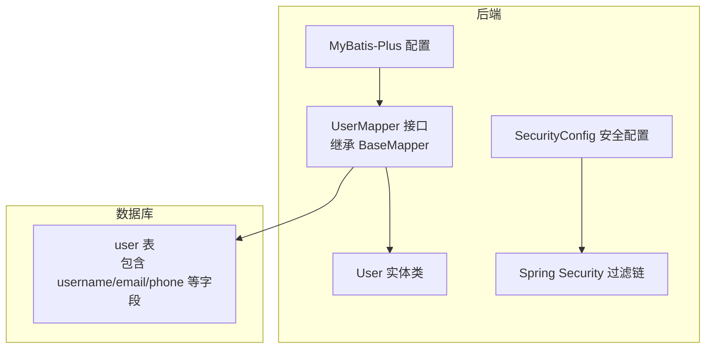
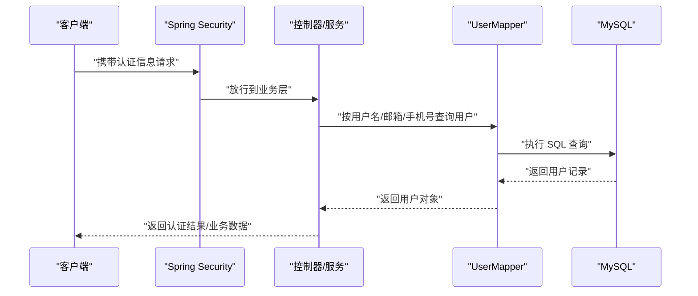
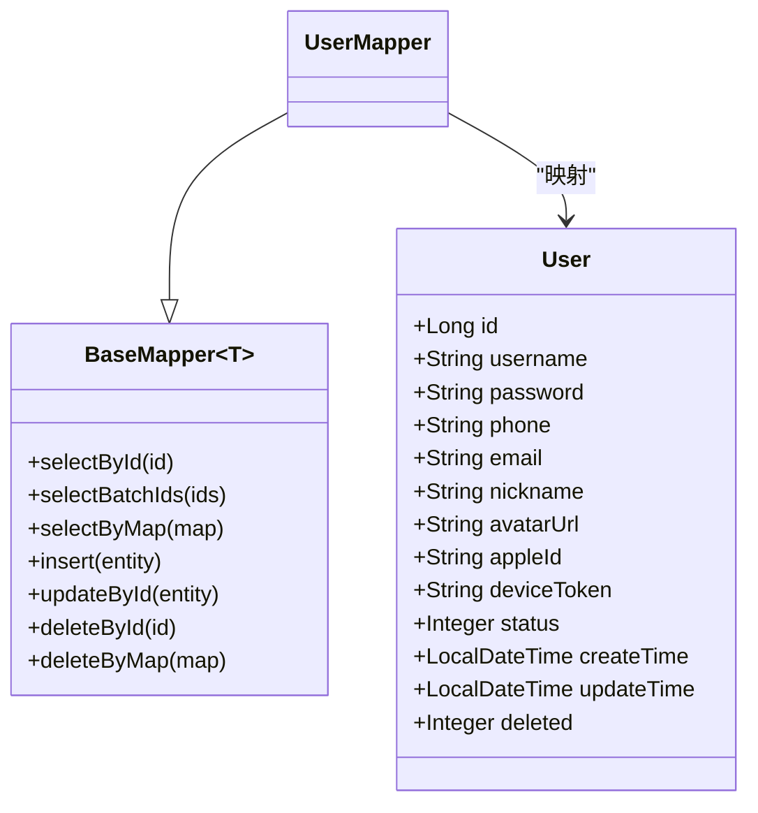
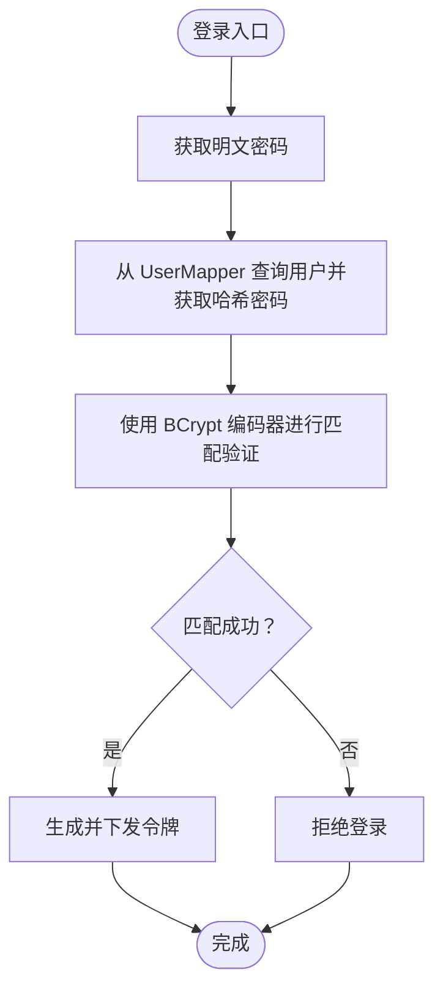
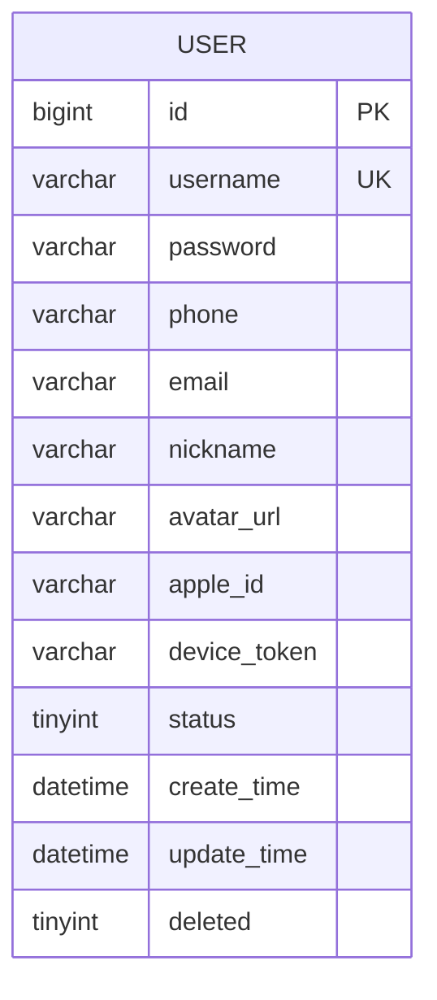
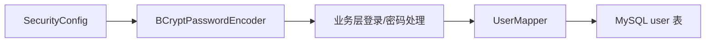

# 用户数据访问

<cite>
**本文引用的文件**
- [UserMapper.java](file://backend/src/main/java/com/baby/mapper/UserMapper.java)
- [User.java](file://backend/src/main/java/com/baby/entity/User.java)
- [SecurityConfig.java](file://backend/src/main/java/com/baby/config/SecurityConfig.java)
- [init.sql](file://backend/src/main/resources/db/init.sql)
- [pom.xml](file://backend/pom.xml)
</cite>

## 目录
1. [简介](#简介)
2. [项目结构](#项目结构)
3. [核心组件](#核心组件)
4. [架构总览](#架构总览)
5. [详细组件分析](#详细组件分析)
6. [依赖关系分析](#依赖关系分析)
7. [性能考量](#性能考量)
8. [故障排查指南](#故障排查指南)
9. [结论](#结论)
10. [附录](#附录)

## 简介
本文件围绕 UserMapper 接口展开，说明其如何继承 MyBatis-Plus 的 BaseMapper<User> 来管理用户与认证相关数据。文档覆盖：
- 如何通过 UserMapper 进行用户认证、查询与账户管理操作
- 与 SecurityConfig 的集成方式及认证授权流程
- 安全实践：密码加密、敏感字段保护、索引优化
- 性能优化建议：唯一标识索引、登录查询优化策略

## 项目结构
- 后端采用 Spring Boot + MyBatis-Plus 架构，用户实体与 Mapper 位于 com.baby.entity 与 com.baby.mapper 包中
- 安全配置位于 com.baby.config，使用 Spring Security 并提供 BCrypt 密码编码器
- 数据库初始化脚本定义了用户表结构与索引

图表来源
- [UserMapper.java](file://backend/src/main/java/com/baby/mapper/UserMapper.java#L1-L13)
- [User.java](file://backend/src/main/java/com/baby/entity/User.java#L1-L71)
- [SecurityConfig.java](file://backend/src/main/java/com/baby/config/SecurityConfig.java#L1-L43)
- [init.sql](file://backend/src/main/resources/db/init.sql#L1-L23)

章节来源
- [UserMapper.java](file://backend/src/main/java/com/baby/mapper/UserMapper.java#L1-L13)
- [User.java](file://backend/src/main/java/com/baby/entity/User.java#L1-L71)
- [SecurityConfig.java](file://backend/src/main/java/com/baby/config/SecurityConfig.java#L1-L43)
- [init.sql](file://backend/src/main/resources/db/init.sql#L1-L23)

## 核心组件
- UserMapper：用户数据访问接口，继承 MyBatis-Plus 的 BaseMapper<User>，天然具备通用 CRUD 能力
- User 实体：映射 user 表，包含用户名、密码、手机号、邮箱、昵称、头像、Apple 登录标识、设备 Token、状态、时间戳与逻辑删除等字段
- SecurityConfig：提供 PasswordEncoder（BCrypt）与无状态安全过滤链配置
- 初始化脚本：定义 user 表结构、唯一约束与索引（如 phone、apple_id）

章节来源
- [UserMapper.java](file://backend/src/main/java/com/baby/mapper/UserMapper.java#L1-L13)
- [User.java](file://backend/src/main/java/com/baby/entity/User.java#L1-L71)
- [SecurityConfig.java](file://backend/src/main/java/com/baby/config/SecurityConfig.java#L1-L43)
- [init.sql](file://backend/src/main/resources/db/init.sql#L1-L23)

## 架构总览
UserMapper 作为数据访问层，向上被业务服务调用；向下与数据库交互。认证与授权由 Spring Security 在 Web 层处理，密码编码器在 SecurityConfig 中提供。

图表来源
- [UserMapper.java](file://backend/src/main/java/com/baby/mapper/UserMapper.java#L1-L13)
- [SecurityConfig.java](file://backend/src/main/java/com/baby/config/SecurityConfig.java#L1-L43)
- [init.sql](file://backend/src/main/resources/db/init.sql#L1-L23)

## 详细组件分析

### UserMapper 接口与 BaseMapper 继承关系
- 继承关系清晰：UserMapper 直接继承 BaseMapper<User>，获得通用增删改查能力
- 注解与扫描：通过 @Mapper 标注，配合 MyBatis-Plus 自动扫描与注册
- 作用域：面向 User 实体的数据访问，支持按条件查询、分页、逻辑删除等

图表来源
- [UserMapper.java](file://backend/src/main/java/com/baby/mapper/UserMapper.java#L1-L13)
- [User.java](file://backend/src/main/java/com/baby/entity/User.java#L1-L71)

章节来源
- [UserMapper.java](file://backend/src/main/java/com/baby/mapper/UserMapper.java#L1-L13)
- [User.java](file://backend/src/main/java/com/baby/entity/User.java#L1-L71)

### 用户认证与授权集成（SecurityConfig）
- 密码编码器：SecurityConfig 提供 BCryptPasswordEncoder Bean，用于密码加密与校验
- 安全策略：禁用 CSRF，会话策略设为无状态，开发阶段对所有路径放行，生产环境应按需调整
- 集成要点：业务层在登录时使用 PasswordEncoder 对比明文与存储的哈希值；认证通过后生成令牌（如 JWT），由网关或前端保存并随请求携带

图表来源
- [SecurityConfig.java](file://backend/src/main/java/com/baby/config/SecurityConfig.java#L1-L43)
- [UserMapper.java](file://backend/src/main/java/com/baby/mapper/UserMapper.java#L1-L13)

章节来源
- [SecurityConfig.java](file://backend/src/main/java/com/baby/config/SecurityConfig.java#L1-L43)
- [UserMapper.java](file://backend/src/main/java/com/baby/mapper/UserMapper.java#L1-L13)

### 数据模型与索引设计
- 用户表字段：id、username（UNIQUE）、password、phone、email、nickname、avatarUrl、apple_id、device_token、status、时间戳、deleted
- 索引设计：phone、apple_id 建有索引，有利于手机号与第三方登录标识的快速检索
- 唯一性约束：username 唯一，有助于用户名登录场景的高效查询

图表来源
- [init.sql](file://backend/src/main/resources/db/init.sql#L1-L23)

章节来源
- [init.sql](file://backend/src/main/resources/db/init.sql#L1-L23)

### 查询方法与典型用例
以下为基于 UserMapper 的常见查询场景与建议实现思路（以路径引用代替具体代码）：

- 用户存在性检查（用户名/邮箱/手机号任一）
  - 使用 selectOne 或带条件的 selectList，结合 username、email、phone 字段
  - 参考路径：[UserMapper.java](file://backend/src/main/java/com/baby/mapper/UserMapper.java#L1-L13)
  - 参考路径：[User.java](file://backend/src/main/java/com/baby/entity/User.java#L1-L71)

- 登录认证（用户名/邮箱）
  - 通过 username 或 email 查询用户，再用 PasswordEncoder.matches 校验密码
  - 参考路径：[SecurityConfig.java](file://backend/src/main/java/com/baby/config/SecurityConfig.java#L1-L43)

- 用户资料查询（按 id）
  - 使用 selectById 获取用户基本信息（不包含密码）
  - 参考路径：[UserMapper.java](file://backend/src/main/java/com/baby/mapper/UserMapper.java#L1-L13)

- 账户管理（更新资料）
  - 使用 updateById 更新 nickname、avatarUrl、deviceToken 等非敏感字段
  - 参考路径：[UserMapper.java](file://backend/src/main/java/com/baby/mapper/UserMapper.java#L1-L13)

- 密码更新（安全）
  - 使用 PasswordEncoder.encode 对新密码进行加密后再持久化
  - 参考路径：[SecurityConfig.java](file://backend/src/main/java/com/baby/config/SecurityConfig.java#L1-L43)

- 第三方登录绑定
  - 通过 apple_id 唯一索引定位用户，避免重复绑定
  - 参考路径：[init.sql](file://backend/src/main/resources/db/init.sql#L1-L23)

章节来源
- [UserMapper.java](file://backend/src/main/java/com/baby/mapper/UserMapper.java#L1-L13)
- [User.java](file://backend/src/main/java/com/baby/entity/User.java#L1-L71)
- [SecurityConfig.java](file://backend/src/main/java/com/baby/config/SecurityConfig.java#L1-L43)
- [init.sql](file://backend/src/main/resources/db/init.sql#L1-L23)

## 依赖关系分析
- 外部依赖
  - Spring Security：提供无状态会话与密码编码器
  - MyBatis-Plus：提供 BaseMapper 与自动扫描机制
  - MySQL：承载 user 表与索引
- 内部耦合
  - UserMapper 依赖 User 实体与数据库表结构
  - SecurityConfig 为认证提供基础设施，业务层通过 PasswordEncoder 与之协作

图表来源
- [SecurityConfig.java](file://backend/src/main/java/com/baby/config/SecurityConfig.java#L1-L43)
- [UserMapper.java](file://backend/src/main/java/com/baby/mapper/UserMapper.java#L1-L13)
- [init.sql](file://backend/src/main/resources/db/init.sql#L1-L23)

章节来源
- [SecurityConfig.java](file://backend/src/main/java/com/baby/config/SecurityConfig.java#L1-L43)
- [UserMapper.java](file://backend/src/main/java/com/baby/mapper/UserMapper.java#L1-L13)
- [init.sql](file://backend/src/main/resources/db/init.sql#L1-L23)
- [pom.xml](file://backend/pom.xml#L27-L134)

## 性能考量
- 唯一标识索引
  - phone、apple_id 已建立索引，适合高频登录与绑定场景
  - username 唯一约束，可作为用户名登录的高效查询键
- 登录查询优化
  - 优先使用唯一键（username/email/phone/apple_id）进行单条记录查询
  - 避免 SELECT *，仅选择必要字段（如 id、username、status、password）
- 安全与性能平衡
  - 密码比较使用 BCrypt，成本较高但安全可靠；可在业务层缓存少量非敏感用户信息以减少数据库往返
  - 对于高并发登录，建议结合 Redis 缓存用户基础信息（不含密码），并控制缓存失效策略

章节来源
- [init.sql](file://backend/src/main/resources/db/init.sql#L1-L23)
- [User.java](file://backend/src/main/java/com/baby/entity/User.java#L1-L71)

## 故障排查指南
- 登录失败
  - 检查用户名/邮箱是否存在且状态正常
  - 确认密码哈希与明文匹配使用的是同一 BCrypt 编码器实例
  - 参考路径：[SecurityConfig.java](file://backend/src/main/java/com/baby/config/SecurityConfig.java#L1-L43)
- 查询异常
  - 确认 UserMapper 是否正确扫描与注入
  - 检查实体类字段与表结构是否一致
  - 参考路径：[UserMapper.java](file://backend/src/main/java/com/baby/mapper/UserMapper.java#L1-L13)，[User.java](file://backend/src/main/java/com/baby/entity/User.java#L1-L71)
- 索引未生效
  - 确认查询条件是否命中索引（如 phone、apple_id）
  - 参考路径：[init.sql](file://backend/src/main/resources/db/init.sql#L1-L23)

章节来源
- [SecurityConfig.java](file://backend/src/main/java/com/baby/config/SecurityConfig.java#L1-L43)
- [UserMapper.java](file://backend/src/main/java/com/baby/mapper/UserMapper.java#L1-L13)
- [User.java](file://backend/src/main/java/com/baby/entity/User.java#L1-L71)
- [init.sql](file://backend/src/main/resources/db/init.sql#L1-L23)

## 结论
UserMapper 通过继承 BaseMapper<User> 获得了强大的通用数据访问能力，并与 Spring Security 的 BCrypt 编码器协同工作，满足用户认证与账户管理需求。配合合理的索引设计与安全实践，可在保证安全性的同时提升登录与查询性能。生产环境中建议完善安全过滤链规则与令牌管理策略。

## 附录
- 依赖声明参考：Spring Security、MyBatis-Plus、MySQL Connector/J
  - 参考路径：[pom.xml](file://backend/pom.xml#L27-L134)