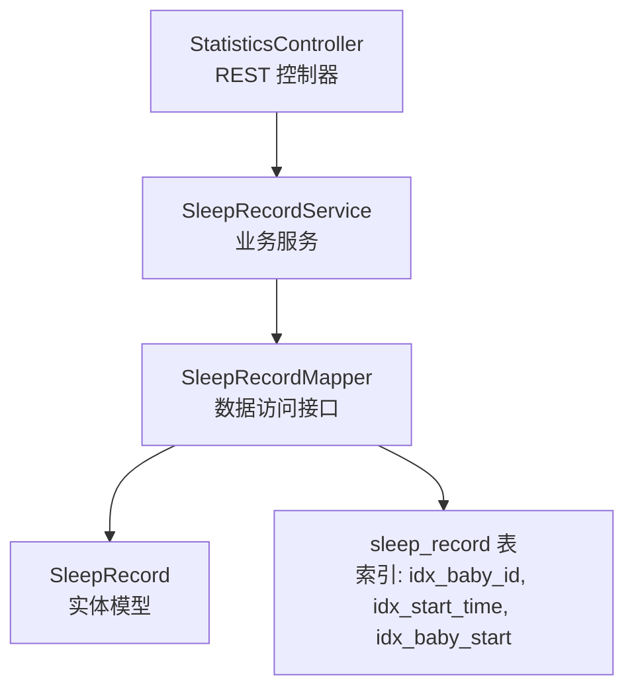
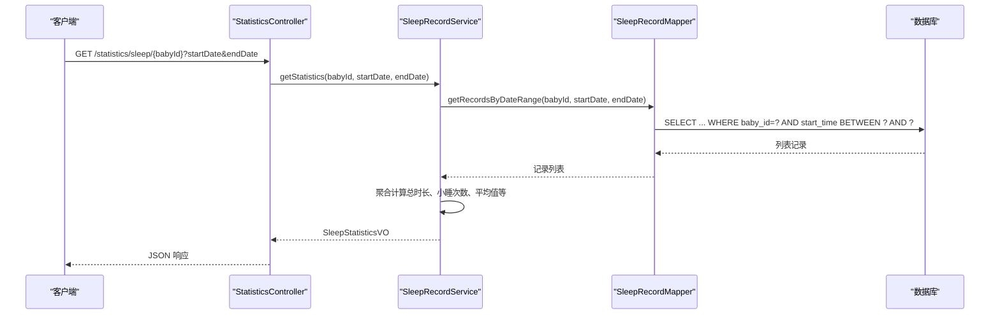
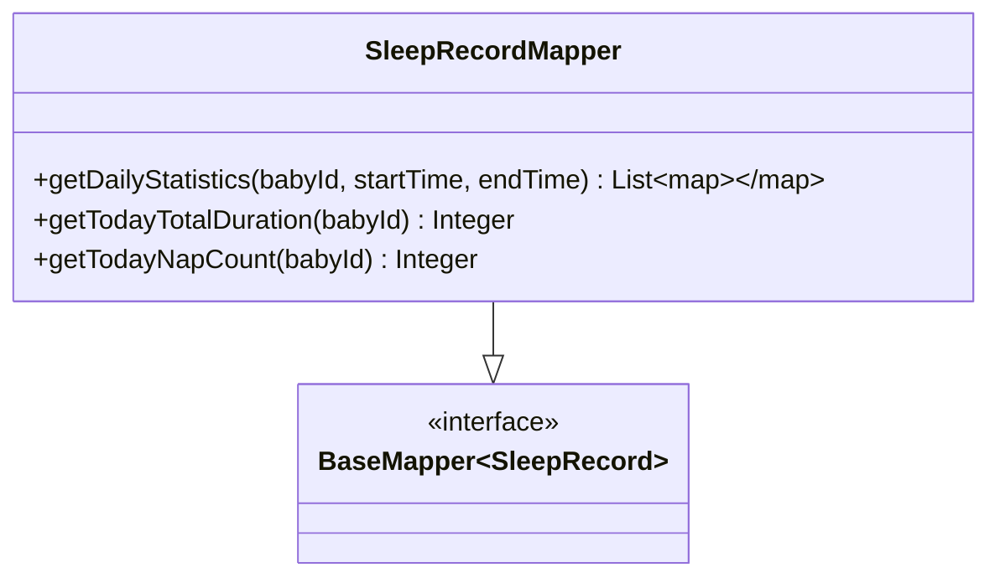
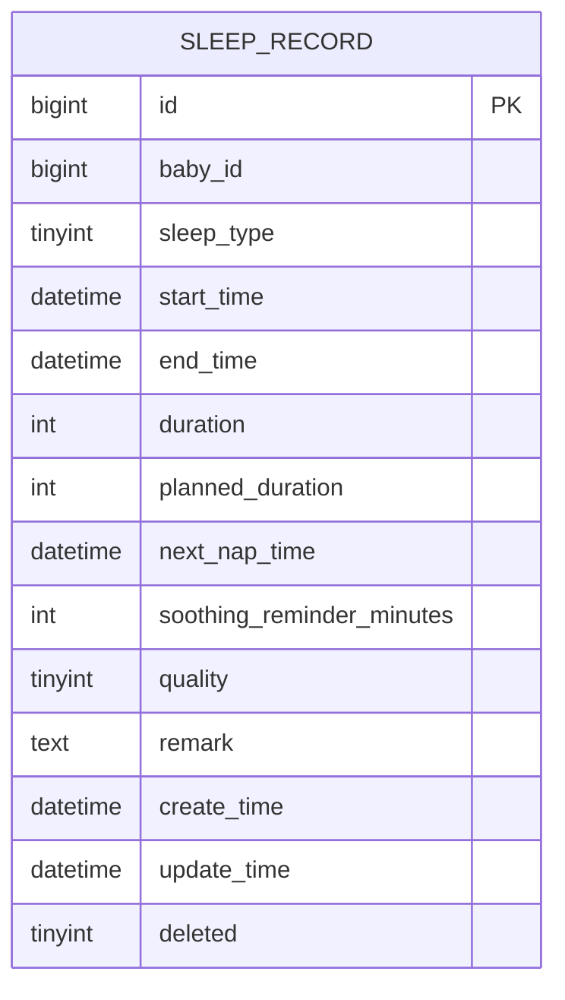
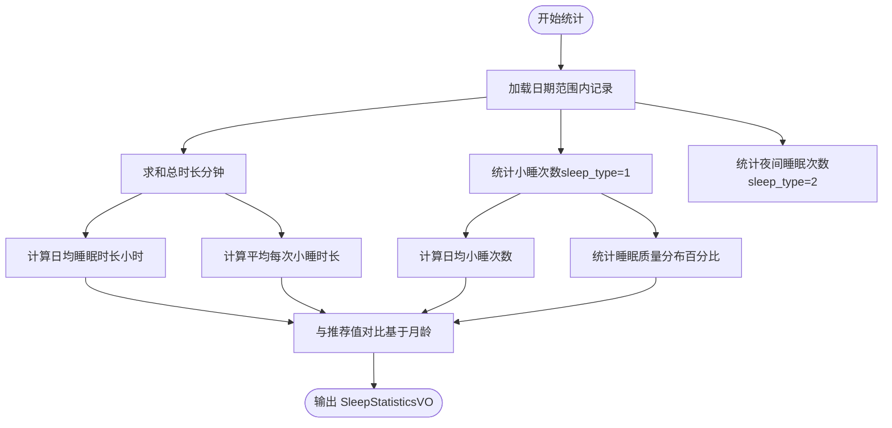
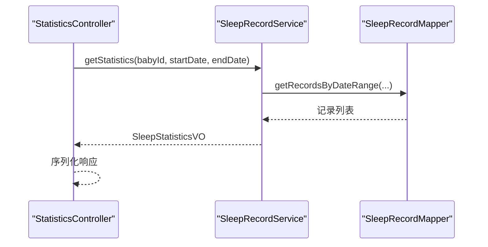
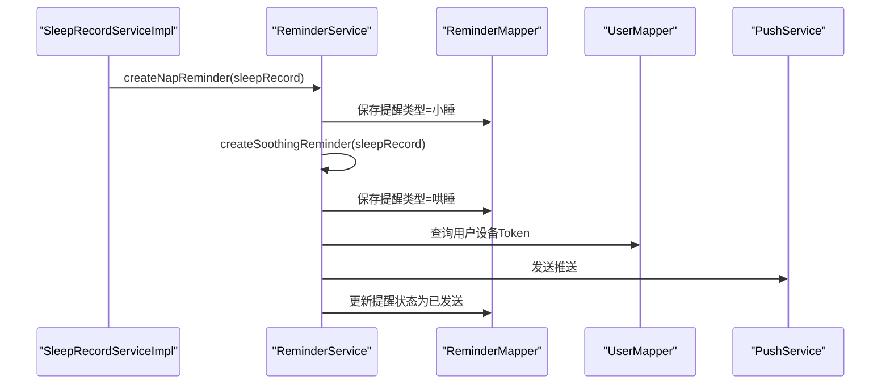
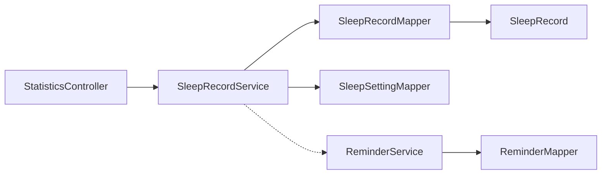

# 睡眠记录数据访问

<cite>
**本文引用的文件**
- [SleepRecordMapper.java](file://backend/src/main/java/com/baby/mapper/SleepRecordMapper.java)
- [SleepRecord.java](file://backend/src/main/java/com/baby/entity/SleepRecord.java)
- [SleepRecordServiceImpl.java](file://backend/src/main/java/com/baby/service/impl/SleepRecordServiceImpl.java)
- [SleepRecordService.java](file://backend/src/main/java/com/baby/service/SleepRecordService.java)
- [StatisticsController.java](file://backend/src/main/java/com/baby/controller/StatisticsController.java)
- [ReminderService.java](file://backend/src/main/java/com/baby/service/ReminderService.java)
- [ReminderServiceImpl.java](file://backend/src/main/java/com/baby/service/impl/ReminderServiceImpl.java)
- [init.sql](file://backend/src/main/resources/db/init.sql)
</cite>

## 目录
1. [简介](#简介)
2. [项目结构](#项目结构)
3. [核心组件](#核心组件)
4. [架构总览](#架构总览)
5. [详细组件分析](#详细组件分析)
6. [依赖关系分析](#依赖关系分析)
7. [性能考量](#性能考量)
8. [故障排查指南](#故障排查指南)
9. [结论](#结论)
10. [附录](#附录)

## 简介
本文件围绕 SleepRecordMapper 接口展开，系统性说明其如何继承 MyBatis-Plus 的 BaseMapper 并扩展自定义查询方法，支撑 StatisticsController 生成睡眠趋势报告与 ReminderService 识别不规律睡眠模式。文档同时覆盖查询逻辑、聚合指标（总睡眠时长、小睡频率、夜间睡眠次数）、与前端可视化对接的要点，并给出性能优化建议（索引、重叠区间处理、时间序列访问优化）。

## 项目结构
- 后端采用分层架构：controller -> service -> mapper -> entity
- 睡眠相关实体为 SleepRecord，映射至数据库表 sleep_record
- 数据库层面提供索引以支持按 baby_id 和 start_time 的高效查询
- 控制器通过 SleepRecordMapper 的自定义方法与服务层统计逻辑共同输出统计结果

图表来源
- [StatisticsController.java](file://backend/src/main/java/com/baby/controller/StatisticsController.java#L36-L91)
- [SleepRecordService.java](file://backend/src/main/java/com/baby/service/SleepRecordService.java#L10-L69)
- [SleepRecordMapper.java](file://backend/src/main/java/com/baby/mapper/SleepRecordMapper.java#L15-L46)
- [SleepRecord.java](file://backend/src/main/java/com/baby/entity/SleepRecord.java#L10-L75)
- [init.sql](file://backend/src/main/resources/db/init.sql#L65-L84)

章节来源
- [StatisticsController.java](file://backend/src/main/java/com/baby/controller/StatisticsController.java#L36-L91)
- [SleepRecordMapper.java](file://backend/src/main/java/com/baby/mapper/SleepRecordMapper.java#L15-L46)
- [init.sql](file://backend/src/main/resources/db/init.sql#L65-L84)

## 核心组件
- SleepRecordMapper：继承 BaseMapper<SleepRecord>，新增三类查询能力
  - 按日期范围进行每日聚合（总时长、小睡次数）
  - 查询当日总睡眠时长
  - 查询当日小睡次数
- SleepRecordService：封装统计逻辑，将数据库聚合结果转换为 VO，供前端展示
- StatisticsController：对外暴露 REST 接口，调用服务层返回统计结果
- ReminderService/ReminderServiceImpl：在小睡结束时根据“下次小睡时间”创建提醒，辅助识别不规律睡眠模式

章节来源
- [SleepRecordMapper.java](file://backend/src/main/java/com/baby/mapper/SleepRecordMapper.java#L15-L46)
- [SleepRecordService.java](file://backend/src/main/java/com/baby/service/SleepRecordService.java#L10-L69)
- [SleepRecordServiceImpl.java](file://backend/src/main/java/com/baby/service/impl/SleepRecordServiceImpl.java#L186-L236)
- [StatisticsController.java](file://backend/src/main/java/com/baby/controller/StatisticsController.java#L36-L91)
- [ReminderService.java](file://backend/src/main/java/com/baby/service/ReminderService.java#L10-L62)
- [ReminderServiceImpl.java](file://backend/src/main/java/com/baby/service/impl/ReminderServiceImpl.java#L103-L133)

## 架构总览
以下序列图展示从控制器到数据访问层的关键调用链路，以及统计结果如何被前端消费。

图表来源
- [StatisticsController.java](file://backend/src/main/java/com/baby/controller/StatisticsController.java#L82-L91)
- [SleepRecordService.java](file://backend/src/main/java/com/baby/service/SleepRecordService.java#L40-L54)
- [SleepRecordServiceImpl.java](file://backend/src/main/java/com/baby/service/impl/SleepRecordServiceImpl.java#L169-L176)
- [SleepRecordMapper.java](file://backend/src/main/java/com/baby/mapper/SleepRecordMapper.java#L15-L46)

## 详细组件分析

### SleepRecordMapper 接口与扩展方法
- 继承关系
  - SleepRecordMapper 继承 BaseMapper<SleepRecord>，天然具备 CRUD 能力
- 自定义方法
  - getDailyStatistics(babyId, startTime, endTime)
    - 功能：按日期分组统计每日总睡眠时长与小睡次数
    - 输出：List<Map<String, Object>>，包含 date、total_duration、count
  - getTodayTotalDuration(babyId)
    - 功能：当日总睡眠时长（分钟）
  - getTodayNapCount(babyId)
    - 功能：当日小睡次数（sleep_type=1）

图表来源
- [SleepRecordMapper.java](file://backend/src/main/java/com/baby/mapper/SleepRecordMapper.java#L15-L46)

章节来源
- [SleepRecordMapper.java](file://backend/src/main/java/com/baby/mapper/SleepRecordMapper.java#L15-L46)

### 数据模型与字段语义
- 实体 SleepRecord 映射 sleep_record 表，关键字段：
  - babyId：所属宝宝
  - sleepType：1-小睡；2-夜间睡眠
  - startTime：入睡时间
  - endTime：醒来时间
  - duration：实际睡眠时长（分钟）
  - plannedDuration：计划睡眠时长（分钟）
  - nextNapTime：下次小睡预计时间
  - soothingReminderMinutes：哄睡提醒提前分钟数
  - quality：睡眠质量（1-好；2-一般；3-差）
  - deleted：逻辑删除标志

图表来源
- [SleepRecord.java](file://backend/src/main/java/com/baby/entity/SleepRecord.java#L10-L75)
- [init.sql](file://backend/src/main/resources/db/init.sql#L65-L84)

章节来源
- [SleepRecord.java](file://backend/src/main/java/com/baby/entity/SleepRecord.java#L10-L75)
- [init.sql](file://backend/src/main/resources/db/init.sql#L65-L84)

### 统计逻辑与聚合指标
- 统计入口：StatisticsController 调用 SleepRecordService.getStatistics(...)
- 服务层聚合指标
  - 总睡眠时长：records 中 duration 求和
  - 小睡次数：sleep_type=1 的记录数
  - 夜间睡眠次数：sleep_type=2 的记录数
  - 日均睡眠时长（小时）：总时长/60/天数
  - 日均小睡次数：小睡次数/天数
  - 平均每次小睡时长：当小睡次数>0时，总时长/小睡次数
  - 睡眠质量分布：good/normal/poor 百分比
- 与推荐值对比：依据月龄参考国家卫健委指南，生成对比建议

图表来源
- [SleepRecordServiceImpl.java](file://backend/src/main/java/com/baby/service/impl/SleepRecordServiceImpl.java#L186-L236)

章节来源
- [StatisticsController.java](file://backend/src/main/java/com/baby/controller/StatisticsController.java#L82-L91)
- [SleepRecordServiceImpl.java](file://backend/src/main/java/com/baby/service/impl/SleepRecordServiceImpl.java#L186-L236)

### 与 StatisticsController 的集成
- 控制器提供 /statistics/sleep/{babyId} 接口，接收 startDate、endDate 参数
- 调用服务层 getStatistics(...) 返回 SleepStatisticsVO
- 控制器还提供 /statistics/overview/{babyId}，直接使用 SleepRecordMapper 的当日聚合方法填充今日概览

图表来源
- [StatisticsController.java](file://backend/src/main/java/com/baby/controller/StatisticsController.java#L82-L91)
- [SleepRecordService.java](file://backend/src/main/java/com/baby/service/SleepRecordService.java#L40-L54)
- [SleepRecordMapper.java](file://backend/src/main/java/com/baby/mapper/SleepRecordMapper.java#L15-L46)

章节来源
- [StatisticsController.java](file://backend/src/main/java/com/baby/controller/StatisticsController.java#L36-L91)
- [SleepRecordService.java](file://backend/src/main/java/com/baby/service/SleepRecordService.java#L40-L54)

### 与 ReminderService 的协同（不规律睡眠识别）
- 当小睡结束时，服务层计算 nextNapTime，并创建“小睡提醒”和“哄睡提醒”
- ReminderService 负责创建、查询、发送与取消提醒
- 通过提醒的调度与执行情况，可间接识别睡眠节律异常（如频繁打断、延迟入睡等）

图表来源
- [SleepRecordServiceImpl.java](file://backend/src/main/java/com/baby/service/impl/SleepRecordServiceImpl.java#L104-L133)
- [ReminderService.java](file://backend/src/main/java/com/baby/service/ReminderService.java#L23-L33)
- [ReminderServiceImpl.java](file://backend/src/main/java/com/baby/service/impl/ReminderServiceImpl.java#L103-L163)

章节来源
- [SleepRecordServiceImpl.java](file://backend/src/main/java/com/baby/service/impl/SleepRecordServiceImpl.java#L104-L133)
- [ReminderService.java](file://backend/src/main/java/com/baby/service/ReminderService.java#L23-L33)
- [ReminderServiceImpl.java](file://backend/src/main/java/com/baby/service/impl/ReminderServiceImpl.java#L103-L163)

## 依赖关系分析
- 控制器依赖服务层
- 服务层依赖 Mapper 与设置表（用于推荐值）
- Mapper 依赖实体与数据库表
- 提醒服务与睡眠记录服务存在业务协作

图表来源
- [StatisticsController.java](file://backend/src/main/java/com/baby/controller/StatisticsController.java#L36-L91)
- [SleepRecordService.java](file://backend/src/main/java/com/baby/service/SleepRecordService.java#L10-L69)
- [SleepRecordMapper.java](file://backend/src/main/java/com/baby/mapper/SleepRecordMapper.java#L15-L46)
- [SleepRecord.java](file://backend/src/main/java/com/baby/entity/SleepRecord.java#L10-L75)
- [ReminderService.java](file://backend/src/main/java/com/baby/service/ReminderService.java#L10-L62)

章节来源
- [StatisticsController.java](file://backend/src/main/java/com/baby/controller/StatisticsController.java#L36-L91)
- [SleepRecordService.java](file://backend/src/main/java/com/baby/service/SleepRecordService.java#L10-L69)
- [SleepRecordMapper.java](file://backend/src/main/java/com/baby/mapper/SleepRecordMapper.java#L15-L46)
- [SleepRecord.java](file://backend/src/main/java/com/baby/entity/SleepRecord.java#L10-L75)
- [ReminderService.java](file://backend/src/main/java/com/baby/service/ReminderService.java#L10-L62)

## 性能考量
- 索引设计
  - 睡眠记录表已建立：
    - idx_baby_id：加速按宝宝过滤
    - idx_start_time：加速按时间范围过滤
    - idx_baby_start：复合索引，覆盖 baby_id+start_time，有利于范围查询与排序
  - 建议：若未来出现大量重叠区间或复杂时间窗口聚合，可评估在 start_time、end_time 上建立更细粒度索引或物化视图（视业务量而定）
- 时间范围查询
  - getRecordsByDateRange 使用 between(start_time, ...)，结合 idx_baby_start 可获得良好性能
  - getDailyStatistics 在 WHERE 条件中使用 start_time BETWEEN，同样受益于索引
- 重叠区间处理
  - 当前查询未显式处理重叠区间，仅按记录维度统计。若需更精细的“连续睡眠段”分析，可在应用层对相邻记录进行合并或在数据库层引入窗口函数（例如基于排序后的时间窗口判断相邻性），但当前实现以记录为单位统计，避免了复杂的重叠合并逻辑
- 时序访问优化
  - 服务层按 startTime 降序返回记录，利于前端渲染最新条目优先
  - 控制器按日期聚合时，SQL 已按日期分组并排序，前端可直接消费
- 缓存与批量
  - 对高频的当日统计（getTodayTotalDuration、getTodayNapCount）可考虑短期缓存（如 Redis），降低数据库压力
  - 对历史聚合数据（getDailyStatistics）可考虑定期物化汇总表，按天预计算，提升前端趋势图渲染速度

章节来源
- [init.sql](file://backend/src/main/resources/db/init.sql#L65-L84)
- [SleepRecordServiceImpl.java](file://backend/src/main/java/com/baby/service/impl/SleepRecordServiceImpl.java#L169-L176)
- [SleepRecordMapper.java](file://backend/src/main/java/com/baby/mapper/SleepRecordMapper.java#L15-L46)

## 故障排查指南
- 控制器返回空或异常
  - 检查请求参数：startDate、endDate 是否正确传入
  - 检查服务层 getRecordsByDateRange 的边界：是否正确将 endDate 加一天的起始时间
- 统计结果异常
  - 确认实体字段 duration 是否正确计算（服务层在结束小睡时计算分钟差）
  - 确认 quality 字段是否正确写入，以便质量分布统计
- 提醒未触发
  - 检查 ReminderServiceImpl.processReminders 是否定时执行
  - 检查用户设备 Token 是否存在
- 数据库性能问题
  - 确认索引是否存在并生效（idx_baby_id、idx_start_time、idx_baby_start）
  - 若查询变慢，考虑对热点日期范围建立物化汇总

章节来源
- [StatisticsController.java](file://backend/src/main/java/com/baby/controller/StatisticsController.java#L82-L91)
- [SleepRecordServiceImpl.java](file://backend/src/main/java/com/baby/service/impl/SleepRecordServiceImpl.java#L104-L133)
- [ReminderServiceImpl.java](file://backend/src/main/java/com/baby/service/impl/ReminderServiceImpl.java#L233-L240)
- [init.sql](file://backend/src/main/resources/db/init.sql#L65-L84)

## 结论
SleepRecordMapper 通过继承 BaseMapper 并扩展三类关键查询，有效支撑了睡眠趋势报告与今日概览的生成。配合服务层的聚合逻辑与提醒服务的节律管理，系统能够稳定地输出总睡眠时长、小睡频率、夜间睡眠次数与质量分布等指标，并为前端可视化提供结构化数据。在现有索引与查询策略下，系统具备良好的可扩展性；进一步可通过缓存与物化汇总优化大规模数据场景下的性能表现。

## 附录
- 前端可视化建议
  - 趋势图：使用 getDailyStatistics 的日期分组结果绘制日均总时长与小睡次数折线图
  - 分布图：使用 SleepStatisticsVO.qualityDistribution 的百分比绘制饼图
  - 仪表盘：使用 StatisticsController.overview 的当日总时长与小睡次数
- 代码片段路径（不含具体代码内容）
  - [SleepRecordMapper.getDailyStatistics](file://backend/src/main/java/com/baby/mapper/SleepRecordMapper.java#L20-L26)
  - [SleepRecordMapper.getTodayTotalDuration](file://backend/src/main/java/com/baby/mapper/SleepRecordMapper.java#L33-L36)
  - [SleepRecordMapper.getTodayNapCount](file://backend/src/main/java/com/baby/mapper/SleepRecordMapper.java#L41-L45)
  - [StatisticsController.getSleepAnalysis](file://backend/src/main/java/com/baby/controller/StatisticsController.java#L82-L91)
  - [SleepRecordServiceImpl.getStatistics](file://backend/src/main/java/com/baby/service/impl/SleepRecordServiceImpl.java#L186-L236)
  - [ReminderServiceImpl.createNapReminder](file://backend/src/main/java/com/baby/service/impl/ReminderServiceImpl.java#L103-L133)