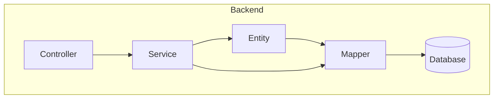
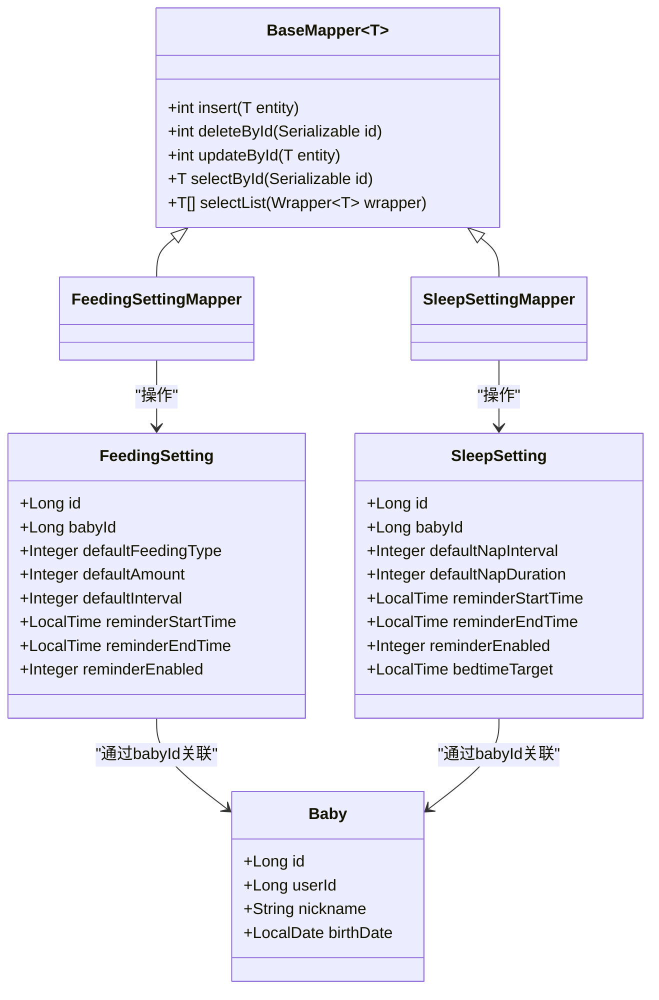
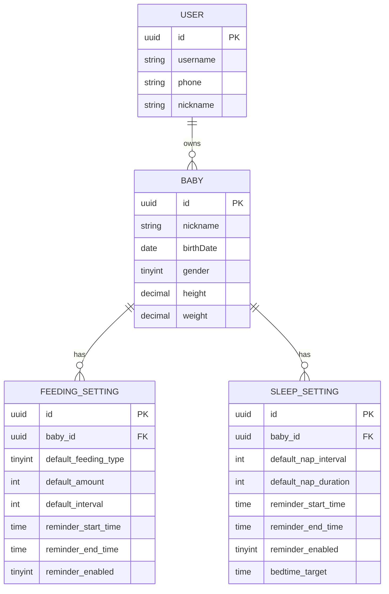
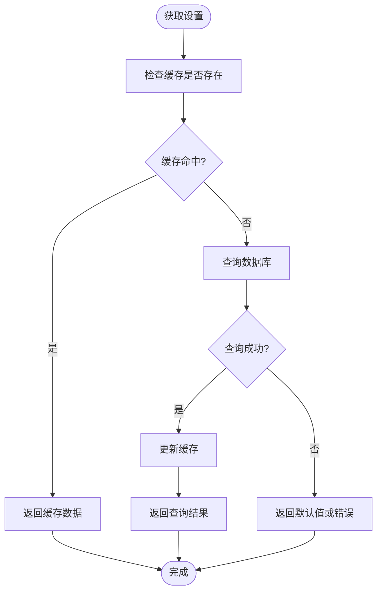
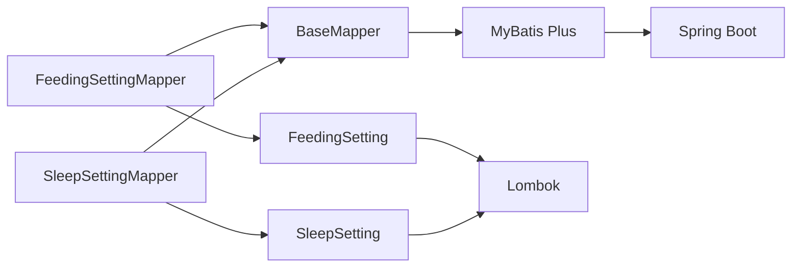

# 设置数据访问

<cite>
**Referenced Files in This Document**   
- [FeedingSetting.java](file://backend/src/main/java/com/baby/entity/FeedingSetting.java)
- [SleepSetting.java](file://backend/src/main/java/com/baby/entity/SleepSetting.java)
- [FeedingSettingMapper.java](file://backend/src/main/java/com/baby/mapper/FeedingSettingMapper.java)
- [SleepSettingMapper.java](file://backend/src/main/java/com/baby/mapper/SleepSettingMapper.java)
- [Baby.java](file://backend/src/main/java/com/baby/entity/Baby.java)
- [User.java](file://backend/src/main/java/com/baby/entity/User.java)
- [init.sql](file://backend/src/main/resources/db/init.sql)
- [MyBatisPlusConfig.java](file://backend/src/main/java/com/baby/config/MyBatisPlusConfig.java)
</cite>

## Table of Contents
1. [项目结构](#项目结构)
2. [核心组件](#核心组件)
3. [架构概述](#架构概述)
4. [详细组件分析](#详细组件分析)
5. [依赖分析](#依赖分析)
6. [性能考虑](#性能考虑)

## 项目结构

本项目采用典型的分层架构设计，后端基于Spring Boot + MyBatis Plus实现数据访问层。`FeedingSettingMapper`和`SleepSettingMapper`位于`mapper`包中，分别对应喂养与睡眠设置的数据访问接口。实体类定义在`entity`包中，数据库表结构通过`init.sql`初始化脚本定义。

**Diagram sources**
- [FeedingSettingMapper.java](file://backend/src/main/java/com/baby/mapper/FeedingSettingMapper.java)
- [SleepSettingMapper.java](file://backend/src/main/java/com/baby/mapper/SleepSettingMapper.java)
- [init.sql](file://backend/src/main/resources/db/init.sql)

**Section sources**
- [FeedingSettingMapper.java](file://backend/src/main/java/com/baby/mapper/FeedingSettingMapper.java)
- [SleepSettingMapper.java](file://backend/src/main/java/com/baby/mapper/SleepSettingMapper.java)

## 核心组件

`FeedingSettingMapper`和`SleepSettingMapper`均继承自MyBatis Plus的`BaseMapper`，自动获得CRUD能力。二者通过泛型指定操作实体为`FeedingSetting`和`SleepSetting`，无需手动编写基础SQL即可完成增删改查操作。这种设计遵循了通用Mapper模式，提升了开发效率并减少了重复代码。

**Section sources**
- [FeedingSettingMapper.java](file://backend/src/main/java/com/baby/mapper/FeedingSettingMapper.java#L1-L13)
- [SleepSettingMapper.java](file://backend/src/main/java/com/baby/mapper/SleepSettingMapper.java#L1-L13)

## 架构概述

系统通过Mapper接口与数据库交互，实体类映射表结构，实现对象关系映射。`FeedingSetting`和`SleepSetting`通过`babyId`外键关联`Baby`实体，形成用户个性化配置体系。所有Mapper接口由Spring管理，并通过依赖注入在Service层使用。

**Diagram sources**
- [FeedingSettingMapper.java](file://backend/src/main/java/com/baby/mapper/FeedingSettingMapper.java)
- [SleepSettingMapper.java](file://backend/src/main/java/com/baby/mapper/SleepSettingMapper.java)
- [FeedingSetting.java](file://backend/src/main/java/com/baby/entity/FeedingSetting.java)
- [SleepSetting.java](file://backend/src/main/java/com/baby/entity/SleepSetting.java)
- [Baby.java](file://backend/src/main/java/com/baby/entity/Baby.java)

## 详细组件分析

### 喂养与睡眠设置Mapper分析

`FeedingSettingMapper`和`SleepSettingMapper`作为数据访问层接口，提供对配置数据的持久化支持。其核心功能包括：

- **CRUD操作**：通过继承`BaseMapper`，天然支持插入、更新、删除、查询等操作
- **按宝宝ID查询**：通过`babyId`字段实现用户个性化配置隔离
- **默认值管理**：实体类中定义了合理的默认值（如默认奶量120ml、默认小睡间隔120分钟）
- **提醒逻辑支持**：存储提醒开关、时段、提前时间等参数，支撑个性化提醒服务

#### 数据模型关系图

**Diagram sources**
- [FeedingSetting.java](file://backend/src/main/java/com/baby/entity/FeedingSetting.java)
- [SleepSetting.java](file://backend/src/main/java/com/baby/entity/SleepSetting.java)
- [Baby.java](file://backend/src/main/java/com/baby/entity/Baby.java)
- [User.java](file://backend/src/main/java/com/baby/entity/User.java)
- [init.sql](file://backend/src/main/resources/db/init.sql)

#### 配置检索流程

**Diagram sources**
- [FeedingSettingMapper.java](file://backend/src/main/java/com/baby/mapper/FeedingSettingMapper.java)
- [SleepSettingMapper.java](file://backend/src/main/java/com/baby/mapper/SleepSettingMapper.java)

**Section sources**
- [FeedingSetting.java](file://backend/src/main/java/com/baby/entity/FeedingSetting.java#L1-L77)
- [SleepSetting.java](file://backend/src/main/java/com/baby/entity/SleepSetting.java#L1-L72)

## 依赖分析

系统依赖关系清晰，Mapper层依赖MyBatis Plus框架提供的`BaseMapper`，实体类依赖Lombok简化代码。数据库层面通过外键约束确保数据一致性。`MyBatisPlusConfig`配置类启用自动填充功能，确保`createTime`和`updateTime`字段自动维护。

**Diagram sources**
- [FeedingSettingMapper.java](file://backend/src/main/java/com/baby/mapper/FeedingSettingMapper.java)
- [SleepSettingMapper.java](file://backend/src/main/java/com/baby/mapper/SleepSettingMapper.java)
- [MyBatisPlusConfig.java](file://backend/src/main/java/com/baby/config/MyBatisPlusConfig.java)

**Section sources**
- [MyBatisPlusConfig.java](file://backend/src/main/java/com/baby/config/MyBatisPlusConfig.java#L1-L47)

## 性能考虑

### 缓存策略
虽然当前代码未显式实现缓存，但可通过集成Redis等缓存中间件对频繁访问的设置数据进行缓存。建议缓存键设计为`setting:feeding:{babyId}`和`setting:sleep:{babyId}`，设置合理的过期时间（如1小时），并在更新时清除缓存。

### 索引优化
数据库脚本已在`feeding_setting`和`sleep_setting`表上为`baby_id`创建唯一索引，确保每个宝宝仅有一条配置记录，同时加速按`babyId`查询的性能。

### 事务一致性
配置更新操作应使用`@Transactional`注解保证原子性。当同时更新多个相关设置时，需确保事务边界正确，避免部分更新导致的数据不一致。

### 字段自动填充
通过`MyMetaObjectHandler`实现`createTime`和`updateTime`的自动填充，减少手动赋值错误，提升数据完整性。

**Section sources**
- [init.sql](file://backend/src/main/resources/db/init.sql#L87-L119)
- [MyBatisPlusConfig.java](file://backend/src/main/java/com/baby/config/MyBatisPlusConfig.java#L33-L46)
- [FeedingSetting.java](file://backend/src/main/java/com/baby/entity/FeedingSetting.java#L68-L72)
- [SleepSetting.java](file://backend/src/main/java/com/baby/entity/SleepSetting.java#L63-L67)