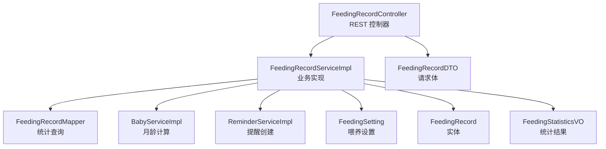
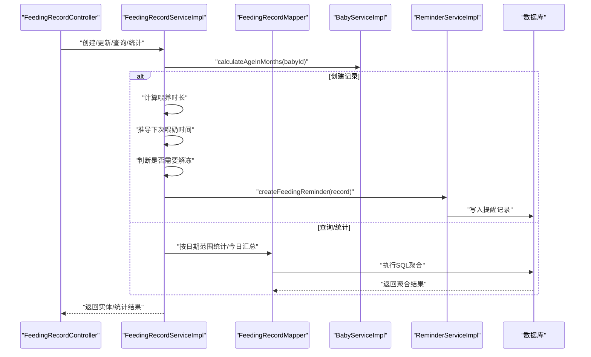
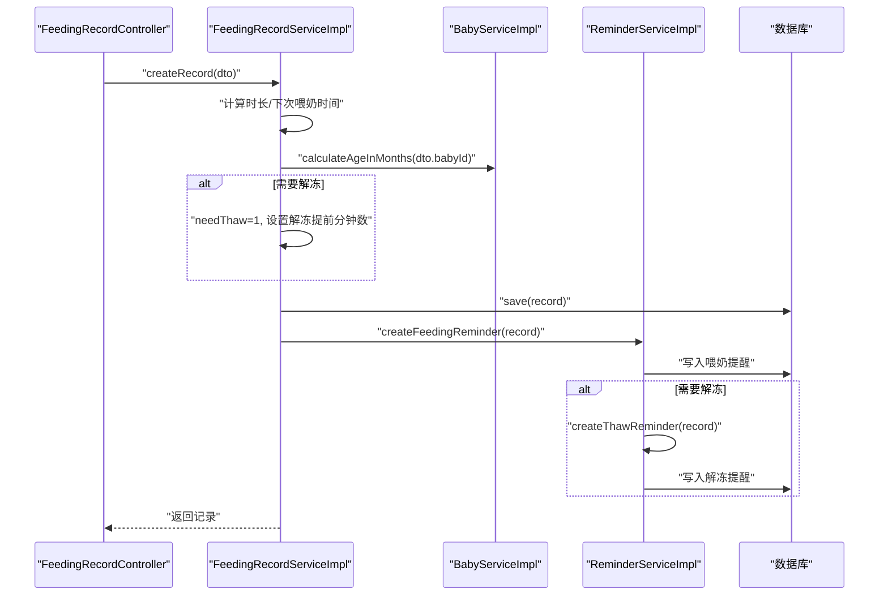
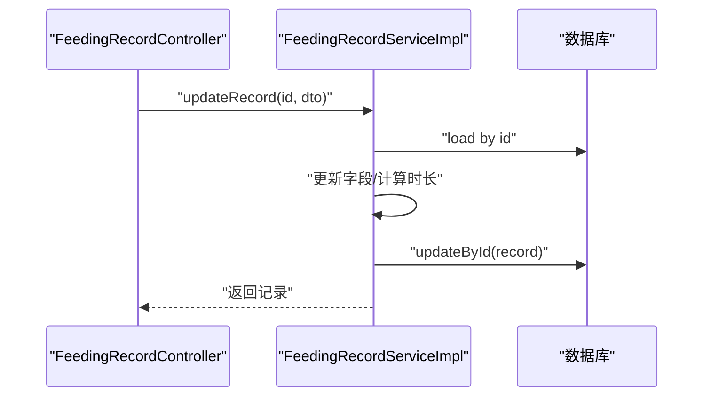
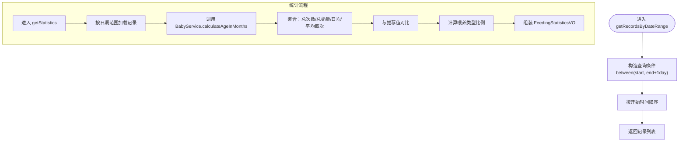
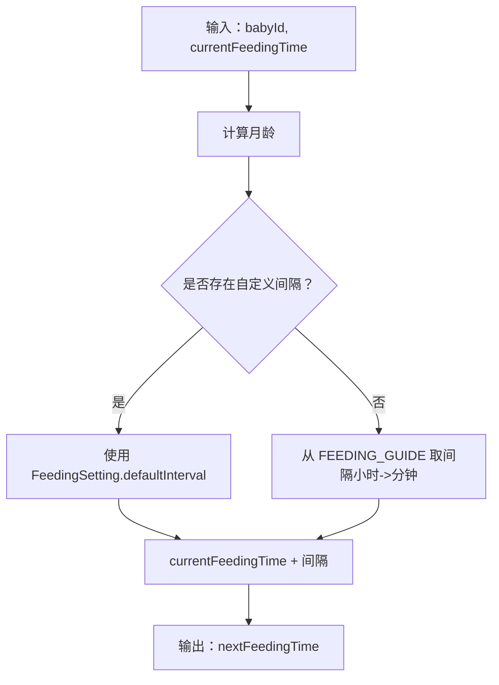
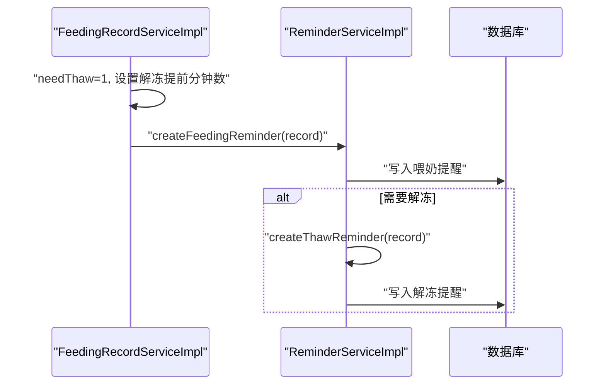
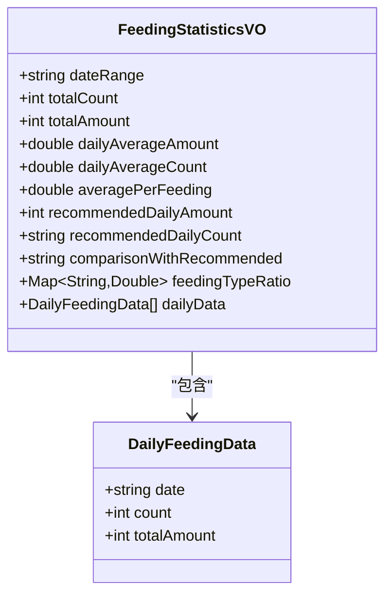
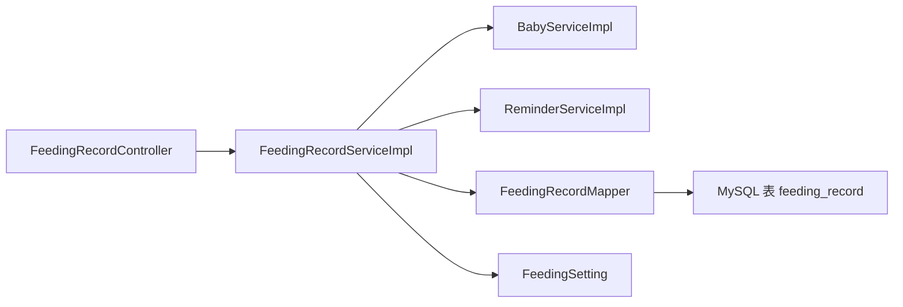

# 喂养记录服务

<cite>
**本文引用的文件**
- [FeedingRecordService.java](file://backend/src/main/java/com/baby/service/FeedingRecordService.java)
- [FeedingRecordServiceImpl.java](file://backend/src/main/java/com/baby/service/impl/FeedingRecordServiceImpl.java)
- [FeedingRecord.java](file://backend/src/main/java/com/baby/entity/FeedingRecord.java)
- [FeedingRecordDTO.java](file://backend/src/main/java/com/baby/dto/FeedingRecordDTO.java)
- [FeedingStatisticsVO.java](file://backend/src/main/java/com/baby/vo/FeedingStatisticsVO.java)
- [FeedingRecordMapper.java](file://backend/src/main/java/com/baby/mapper/FeedingRecordMapper.java)
- [FeedingSetting.java](file://backend/src/main/java/com/baby/entity/FeedingSetting.java)
- [BabyService.java](file://backend/src/main/java/com/baby/service/BabyService.java)
- [BabyServiceImpl.java](file://backend/src/main/java/com/baby/service/impl/BabyServiceImpl.java)
- [ReminderService.java](file://backend/src/main/java/com/baby/service/ReminderService.java)
- [ReminderServiceImpl.java](file://backend/src/main/java/com/baby/service/impl/ReminderServiceImpl.java)
- [FeedingRecordController.java](file://backend/src/main/java/com/baby/controller/FeedingRecordController.java)
- [init.sql](file://backend/src/main/resources/db/init.sql)
</cite>

## 目录
1. [简介](#简介)
2. [项目结构](#项目结构)
3. [核心组件](#核心组件)
4. [架构总览](#架构总览)
5. [详细组件分析](#详细组件分析)
6. [依赖关系分析](#依赖关系分析)
7. [性能考量](#性能考量)
8. [故障排查指南](#故障排查指南)
9. [结论](#结论)
10. [附录](#附录)

## 简介
本文件围绕 Spring Boot 后端中的 FeedingRecordService 组件展开，系统性阐述喂养记录的创建、更新、按日期范围检索、最近一次记录查询、统计分析与推荐计算等能力。重点说明如何依据国家卫健委指南（FEEDING_GUIDE 映射）结合宝宝月龄计算推荐奶量与喂养间隔，并在创建喂养记录时自动计算喂养时长、推导下次喂奶时间、触发提醒服务生成喂奶提醒与母乳解冻提醒，以及处理“冷藏/冷冻母乳”提前解冻的业务逻辑。同时覆盖与 BabyService 的年龄计算集成、与 ReminderService 的提醒联动、统计结果对象 FeedingStatisticsVO 的组成与对比分析，以及常见问题如时间区间边界、统计聚合边界、性能优化建议等。

## 项目结构
后端采用分层设计：
- 控制器层：FeedingRecordController 提供 REST API，负责请求参数解析与响应封装。
- 服务层：FeedingRecordService 接口与 FeedingRecordServiceImpl 实现，承载核心业务逻辑。
- 数据访问层：FeedingRecordMapper 提供 SQL 统计查询；FeedingSettingMapper 读取喂养设置。
- 领域模型：FeedingRecord、FeedingSetting、Reminder 等实体。
- VO 层：FeedingStatisticsVO 作为统计结果载体。
- 集成服务：BabyService 提供月龄计算；ReminderService 负责提醒创建与发送。

图表来源
- [FeedingRecordController.java](file://backend/src/main/java/com/baby/controller/FeedingRecordController.java#L1-L112)
- [FeedingRecordServiceImpl.java](file://backend/src/main/java/com/baby/service/impl/FeedingRecordServiceImpl.java#L1-L231)
- [FeedingRecordMapper.java](file://backend/src/main/java/com/baby/mapper/FeedingRecordMapper.java#L1-L47)
- [BabyServiceImpl.java](file://backend/src/main/java/com/baby/service/impl/BabyServiceImpl.java#L1-L91)
- [ReminderServiceImpl.java](file://backend/src/main/java/com/baby/service/impl/ReminderServiceImpl.java#L1-L242)
- [FeedingRecord.java](file://backend/src/main/java/com/baby/entity/FeedingRecord.java#L1-L81)
- [FeedingRecordDTO.java](file://backend/src/main/java/com/baby/dto/FeedingRecordDTO.java#L1-L52)
- [FeedingStatisticsVO.java](file://backend/src/main/java/com/baby/vo/FeedingStatisticsVO.java#L1-L75)

章节来源
- [FeedingRecordController.java](file://backend/src/main/java/com/baby/controller/FeedingRecordController.java#L1-L112)
- [FeedingRecordServiceImpl.java](file://backend/src/main/java/com/baby/service/impl/FeedingRecordServiceImpl.java#L1-L231)
- [FeedingRecordMapper.java](file://backend/src/main/java/com/baby/mapper/FeedingRecordMapper.java#L1-L47)
- [BabyServiceImpl.java](file://backend/src/main/java/com/baby/service/impl/BabyServiceImpl.java#L1-L91)
- [ReminderServiceImpl.java](file://backend/src/main/java/com/baby/service/impl/ReminderServiceImpl.java#L1-L242)
- [FeedingRecord.java](file://backend/src/main/java/com/baby/entity/FeedingRecord.java#L1-L81)
- [FeedingRecordDTO.java](file://backend/src/main/java/com/baby/dto/FeedingRecordDTO.java#L1-L52)
- [FeedingStatisticsVO.java](file://backend/src/main/java/com/baby/vo/FeedingStatisticsVO.java#L1-L75)

## 核心组件
- FeedingRecordService 接口：定义创建、更新、按日期范围查询、最近一次记录、统计、下次喂奶时间计算、推荐奶量与间隔等方法契约。
- FeedingRecordServiceImpl 实现：落地实现上述方法，包含 FEEDING_GUIDE（国家卫健委指南映射）、喂养时长计算、下次喂奶时间推导、母乳解冻提醒触发、统计聚合与对比分析。
- FeedingRecord 实体：持久化喂养记录字段，含喂养类型、母乳来源、开始/结束时间、奶量、时长、下次喂奶时间、是否需要解冻、解冻提醒分钟数等。
- FeedingRecordDTO：前端传入的喂养记录数据传输对象，支持奶量、时长、下次母乳来源等可选字段。
- FeedingStatisticsVO：统计结果对象，包含日期范围、总次数、总奶量、日均、平均每次奶量、推荐值、喂养类型比例、每日明细等。
- FeedingRecordMapper：提供按日期范围的每日统计、今日总量与次数等 SQL 查询。
- BabyService：提供 calculateAgeInMonths，用于根据出生日期计算月龄。
- ReminderService：创建喂奶提醒与解冻提醒，支持定时发送与批量取消。
- FeedingSetting：喂养设置，包含默认喂养间隔、冷藏/冷冻解冻提前分钟数等。

章节来源
- [FeedingRecordService.java](file://backend/src/main/java/com/baby/service/FeedingRecordService.java#L1-L60)
- [FeedingRecordServiceImpl.java](file://backend/src/main/java/com/baby/service/impl/FeedingRecordServiceImpl.java#L1-L231)
- [FeedingRecord.java](file://backend/src/main/java/com/baby/entity/FeedingRecord.java#L1-L81)
- [FeedingRecordDTO.java](file://backend/src/main/java/com/baby/dto/FeedingRecordDTO.java#L1-L52)
- [FeedingStatisticsVO.java](file://backend/src/main/java/com/baby/vo/FeedingStatisticsVO.java#L1-L75)
- [FeedingRecordMapper.java](file://backend/src/main/java/com/baby/mapper/FeedingRecordMapper.java#L1-L47)
- [BabyService.java](file://backend/src/main/java/com/baby/service/BabyService.java#L1-L38)
- [BabyServiceImpl.java](file://backend/src/main/java/com/baby/service/impl/BabyServiceImpl.java#L1-L91)
- [ReminderService.java](file://backend/src/main/java/com/baby/service/ReminderService.java#L1-L64)
- [ReminderServiceImpl.java](file://backend/src/main/java/com/baby/service/impl/ReminderServiceImpl.java#L1-L242)
- [FeedingSetting.java](file://backend/src/main/java/com/baby/entity/FeedingSetting.java#L1-L77)

## 架构总览
下图展示从控制器到服务、数据访问与外部服务的整体交互：

图表来源
- [FeedingRecordController.java](file://backend/src/main/java/com/baby/controller/FeedingRecordController.java#L1-L112)
- [FeedingRecordServiceImpl.java](file://backend/src/main/java/com/baby/service/impl/FeedingRecordServiceImpl.java#L1-L231)
- [FeedingRecordMapper.java](file://backend/src/main/java/com/baby/mapper/FeedingRecordMapper.java#L1-L47)
- [BabyServiceImpl.java](file://backend/src/main/java/com/baby/service/impl/BabyServiceImpl.java#L1-L91)
- [ReminderServiceImpl.java](file://backend/src/main/java/com/baby/service/impl/ReminderServiceImpl.java#L1-L242)

## 详细组件分析

### 1. 喂养记录创建流程
- 输入：FeedingRecordDTO（包含开始时间、结束时间、奶量、下次母乳来源等）。
- 处理：
  - 计算喂养时长：若结束时间与开始时间均存在，则以分钟为单位计算；否则使用传入的时长字段。
  - 推导下次喂奶时间：调用 calculateNextFeedingTime，优先使用用户自定义间隔，否则使用 FEEDING_GUIDE 中按月龄推导的间隔。
  - 解冻逻辑：当 DTO 指示下次将使用冷藏/冷冻母乳时，标记 needThaw，并根据 FeedingSetting 的冷藏/冷冻提前分钟数设置 thawReminderMinutes。
  - 保存记录并创建提醒：调用 ReminderService.createFeedingReminder，若 needThaw=1 则额外创建解冻提醒。
- 输出：持久化后的 FeedingRecord。

图表来源
- [FeedingRecordController.java](file://backend/src/main/java/com/baby/controller/FeedingRecordController.java#L1-L112)
- [FeedingRecordServiceImpl.java](file://backend/src/main/java/com/baby/service/impl/FeedingRecordServiceImpl.java#L47-L90)
- [BabyServiceImpl.java](file://backend/src/main/java/com/baby/service/impl/BabyServiceImpl.java#L81-L91)
- [ReminderServiceImpl.java](file://backend/src/main/java/com/baby/service/impl/ReminderServiceImpl.java#L37-L101)

章节来源
- [FeedingRecordServiceImpl.java](file://backend/src/main/java/com/baby/service/impl/FeedingRecordServiceImpl.java#L47-L90)
- [FeedingRecordController.java](file://backend/src/main/java/com/baby/controller/FeedingRecordController.java#L33-L46)
- [ReminderServiceImpl.java](file://backend/src/main/java/com/baby/service/impl/ReminderServiceImpl.java#L37-L101)

### 2. 喂养记录更新流程
- 输入：记录ID与 FeedingRecordDTO。
- 处理：加载记录，更新字段；若结束时间与开始时间均存在则重新计算时长；持久化更新。
- 输出：更新后的 FeedingRecord。

图表来源
- [FeedingRecordController.java](file://backend/src/main/java/com/baby/controller/FeedingRecordController.java#L40-L46)
- [FeedingRecordServiceImpl.java](file://backend/src/main/java/com/baby/service/impl/FeedingRecordServiceImpl.java#L92-L114)

章节来源
- [FeedingRecordServiceImpl.java](file://backend/src/main/java/com/baby/service/impl/FeedingRecordServiceImpl.java#L92-L114)
- [FeedingRecordController.java](file://backend/src/main/java/com/baby/controller/FeedingRecordController.java#L40-L46)

### 3. 按日期范围检索与今日检索
- 今日检索：以当日 00:00:00 为起点，23:59:59.999999999 为终点，按开始时间倒序返回。
- 日期范围检索：对结束时间加一天的 00:00:00 作为上界，避免边界遗漏。
- 统计接口：先按日期范围拉取记录，再调用 BabyService 计算月龄，随后进行统计聚合与对比分析。

图表来源
- [FeedingRecordServiceImpl.java](file://backend/src/main/java/com/baby/service/impl/FeedingRecordServiceImpl.java#L116-L133)
- [FeedingRecordServiceImpl.java](file://backend/src/main/java/com/baby/service/impl/FeedingRecordServiceImpl.java#L143-L189)
- [BabyServiceImpl.java](file://backend/src/main/java/com/baby/service/impl/BabyServiceImpl.java#L81-L91)
- [FeedingRecordMapper.java](file://backend/src/main/java/com/baby/mapper/FeedingRecordMapper.java#L18-L30)

章节来源
- [FeedingRecordServiceImpl.java](file://backend/src/main/java/com/baby/service/impl/FeedingRecordServiceImpl.java#L116-L133)
- [FeedingRecordServiceImpl.java](file://backend/src/main/java/com/baby/service/impl/FeedingRecordServiceImpl.java#L143-L189)
- [FeedingRecordController.java](file://backend/src/main/java/com/baby/controller/FeedingRecordController.java#L55-L70)
- [FeedingRecordController.java](file://backend/src/main/java/com/baby/controller/FeedingRecordController.java#L79-L87)

### 4. 下次喂奶时间计算与推荐值
- 计算逻辑：
  - 先通过 BabyService 计算月龄。
  - 从 FEEDING_GUIDE 中按月龄区间取出推荐间隔（小时转分钟），优先使用用户在 FeedingSetting 中设置的默认间隔。
  - 在当前喂奶时间基础上加上分钟数得到 nextFeedingTime。
- 推荐值：
  - 推荐奶量：取对应区间的奶量上下限的平均值。
  - 推荐喂养次数：取次数上下限的平均值作为日均参考。
- 统计对比：
  - 以日均奶量与推荐日均奶量比值进行“偏低/偏高/正常范围”的提示。

图表来源
- [FeedingRecordServiceImpl.java](file://backend/src/main/java/com/baby/service/impl/FeedingRecordServiceImpl.java#L191-L203)
- [BabyServiceImpl.java](file://backend/src/main/java/com/baby/service/impl/BabyServiceImpl.java#L81-L91)
- [FeedingSetting.java](file://backend/src/main/java/com/baby/entity/FeedingSetting.java#L1-L77)

章节来源
- [FeedingRecordServiceImpl.java](file://backend/src/main/java/com/baby/service/impl/FeedingRecordServiceImpl.java#L191-L216)
- [FeedingRecordController.java](file://backend/src/main/java/com/baby/controller/FeedingRecordController.java#L89-L103)

### 5. 母乳解冻逻辑与提醒联动
- 触发条件：当 DTO 指示下次将使用冷藏/冷冻母乳（阈值≥2）时，记录 needThaw=1，并设置 thawReminderMinutes：
  - 冷藏母乳：默认提前15分钟（可由 FeedingSetting.refrigeratedThawMinutes 覆盖）。
  - 冷冻母乳：默认提前30分钟（可由 FeedingSetting.frozenThawMinutes 覆盖）。
- 提醒创建：
  - 先创建喂奶提醒（基于 nextFeedingTime）。
  - 若 needThaw=1，则在 nextFeedingTime 减去 thawReminderMinutes 的时间点创建解冻提醒。

图表来源
- [FeedingRecordServiceImpl.java](file://backend/src/main/java/com/baby/service/impl/FeedingRecordServiceImpl.java#L71-L83)
- [ReminderServiceImpl.java](file://backend/src/main/java/com/baby/service/impl/ReminderServiceImpl.java#L37-L101)

章节来源
- [FeedingRecordServiceImpl.java](file://backend/src/main/java/com/baby/service/impl/FeedingRecordServiceImpl.java#L71-L83)
- [ReminderServiceImpl.java](file://backend/src/main/java/com/baby/service/impl/ReminderServiceImpl.java#L37-L101)

### 6. 统计结果对象 FeedingStatisticsVO
- 字段构成：
  - 日期范围、总次数、总奶量、日均次数、日均奶量、平均每次奶量。
  - 推荐日均奶量、推荐喂养次数范围。
  - 与推荐值对比结果（偏低/偏高/正常范围）。
  - 喂养类型比例（母乳/奶粉/混合）。
  - 每日明细（日期、次数、总奶量）。
- 聚合来源：
  - 总次数/总奶量/平均每次奶量直接来自记录集合。
  - 日均基于日期跨度天数计算。
  - 推荐值来自 FEEDING_GUIDE 与月龄。
  - 每日明细通过 FeedingRecordMapper 的 SQL 聚合返回。

图表来源
- [FeedingStatisticsVO.java](file://backend/src/main/java/com/baby/vo/FeedingStatisticsVO.java#L1-L75)

章节来源
- [FeedingRecordServiceImpl.java](file://backend/src/main/java/com/baby/service/impl/FeedingRecordServiceImpl.java#L143-L189)
- [FeedingRecordMapper.java](file://backend/src/main/java/com/baby/mapper/FeedingRecordMapper.java#L18-L30)
- [FeedingStatisticsVO.java](file://backend/src/main/java/com/baby/vo/FeedingStatisticsVO.java#L1-L75)

### 7. API 使用示例与路径
- 创建喂养记录：POST /feeding
- 更新喂养记录：PUT /feeding/{id}
- 获取今日记录：GET /feeding/today/{babyId}
- 按日期范围获取记录：GET /feeding/range/{babyId}?startDate=...&endDate=...
- 获取最近一次记录：GET /feeding/last/{babyId}
- 获取统计：GET /feeding/statistics/{babyId}?startDate=...&endDate=...
- 获取喂养建议：GET /feeding/recommendation/{babyId}

章节来源
- [FeedingRecordController.java](file://backend/src/main/java/com/baby/controller/FeedingRecordController.java#L33-L111)

## 依赖关系分析
- 组件耦合：
  - FeedingRecordServiceImpl 依赖 BabyServiceImpl（月龄计算）、ReminderServiceImpl（提醒创建）、FeedingRecordMapper（统计查询）、FeedingSetting（用户自定义间隔与解冻提前分钟数）。
  - 控制器仅依赖服务接口，保持低耦合。
- 外部依赖：
  - 数据库索引：喂养记录表对 baby_id、start_time、(baby_id,start_time) 建有索引，有利于范围查询与统计。
  - 时间处理：使用 Java 8 时间 API，避免时区转换带来的歧义；统计按日期聚合时注意边界处理。

图表来源
- [FeedingRecordController.java](file://backend/src/main/java/com/baby/controller/FeedingRecordController.java#L1-L112)
- [FeedingRecordServiceImpl.java](file://backend/src/main/java/com/baby/service/impl/FeedingRecordServiceImpl.java#L1-L231)
- [FeedingRecordMapper.java](file://backend/src/main/java/com/baby/mapper/FeedingRecordMapper.java#L1-L47)
- [init.sql](file://backend/src/main/resources/db/init.sql#L43-L63)

章节来源
- [FeedingRecordServiceImpl.java](file://backend/src/main/java/com/baby/service/impl/FeedingRecordServiceImpl.java#L1-L231)
- [init.sql](file://backend/src/main/resources/db/init.sql#L43-L63)

## 性能考量
- 索引优化：
  - 喂养记录表对 baby_id、start_time、(baby_id,start_time) 建有索引，有助于范围查询与统计。
- 统计查询：
  - 使用 FeedingRecordMapper 的原生 SQL 进行按日聚合，减少应用侧聚合开销。
- 时间边界：
  - 日期范围查询对结束时间加一天的 00:00:00 作为上界，确保边界不遗漏。
- 缓存建议（可选）：
  - 对频繁访问的“今日总量/次数”可考虑短期缓存，但需注意数据一致性。
- 分页与限制：
  - 控制器中对“即将到来的提醒”限制数量，避免一次性返回过多数据。

章节来源
- [FeedingRecordMapper.java](file://backend/src/main/java/com/baby/mapper/FeedingRecordMapper.java#L18-L30)
- [init.sql](file://backend/src/main/resources/db/init.sql#L43-L63)
- [FeedingRecordServiceImpl.java](file://backend/src/main/java/com/baby/service/impl/FeedingRecordServiceImpl.java#L127-L133)
- [ReminderServiceImpl.java](file://backend/src/main/java/com/baby/service/impl/ReminderServiceImpl.java#L166-L181)

## 故障排查指南
- 时区与日期边界：
  - 服务端使用本地日期时间处理，统计按日期聚合时需确保传入的 startDate/endtDate 与服务端时区一致，避免跨日边界遗漏。
- 记录不存在：
  - 更新记录时若记录不存在会抛出异常，应先校验 ID。
- 解冻提醒缺失：
  - 当 needThaw=1 但 thawReminderMinutes 为空时不会创建解冻提醒；确认 DTO 的 nextMilkSource 与 FeedingSetting 的解冻提前分钟数配置。
- 推荐值异常：
  - 若月龄计算异常（出生日期为空），将返回默认值；请检查 Baby 表 birth_date 字段。
- 提醒发送失败：
  - ReminderServiceImpl 在发送失败时记录错误日志；检查用户设备 Token 与推送服务可用性。

章节来源
- [FeedingRecordServiceImpl.java](file://backend/src/main/java/com/baby/service/impl/FeedingRecordServiceImpl.java#L92-L114)
- [FeedingRecordServiceImpl.java](file://backend/src/main/java/com/baby/service/impl/FeedingRecordServiceImpl.java#L71-L83)
- [BabyServiceImpl.java](file://backend/src/main/java/com/baby/service/impl/BabyServiceImpl.java#L81-L91)
- [ReminderServiceImpl.java](file://backend/src/main/java/com/baby/service/impl/ReminderServiceImpl.java#L190-L211)

## 结论
FeedingRecordService 通过清晰的接口与实现，将国家卫健委喂养指南与用户个性化设置相结合，实现了从记录创建、提醒联动到统计分析的完整闭环。其关键特性包括：
- 基于月龄的推荐奶量与间隔计算；
- 自动时长计算与下次喂奶时间推导；
- 母乳解冻提醒的智能触发；
- 高效的按日统计与对比分析；
- 与 BabyService、ReminderService 的良好协作。

在生产环境中，建议关注索引与统计查询的性能、时区与日期边界的一致性、以及提醒发送的可观测性与容错处理。

## 附录
- 数据库初始化脚本包含喂养记录表、喂养设置表与提醒表的建表与索引定义，便于快速部署与验证。

章节来源
- [init.sql](file://backend/src/main/resources/db/init.sql#L43-L141)