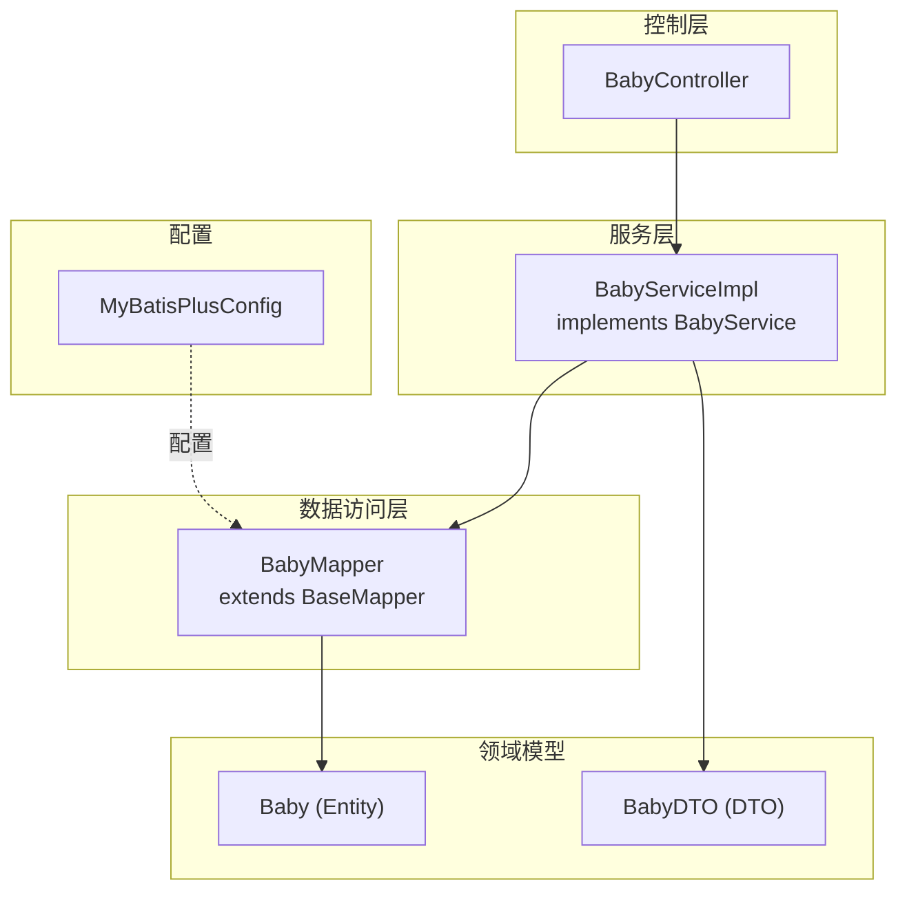
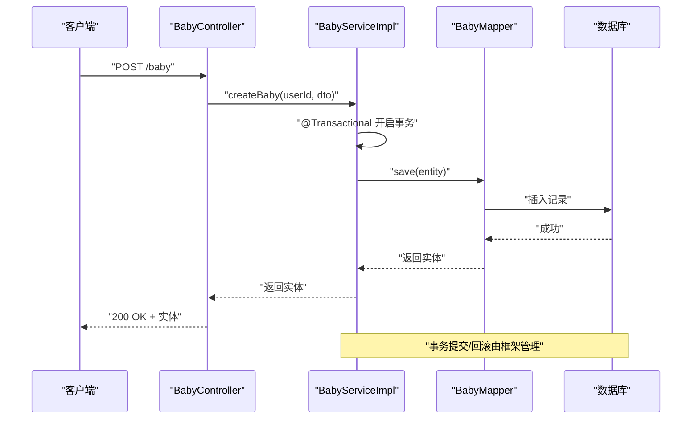
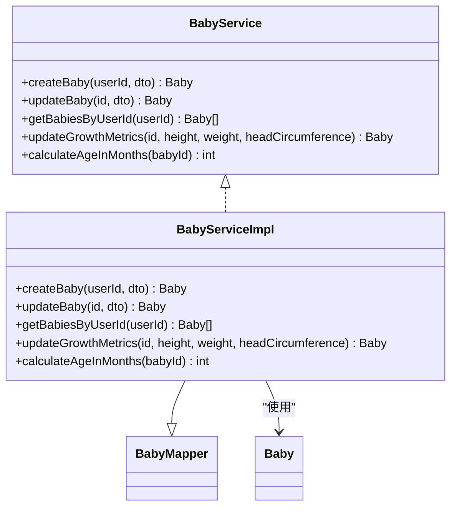
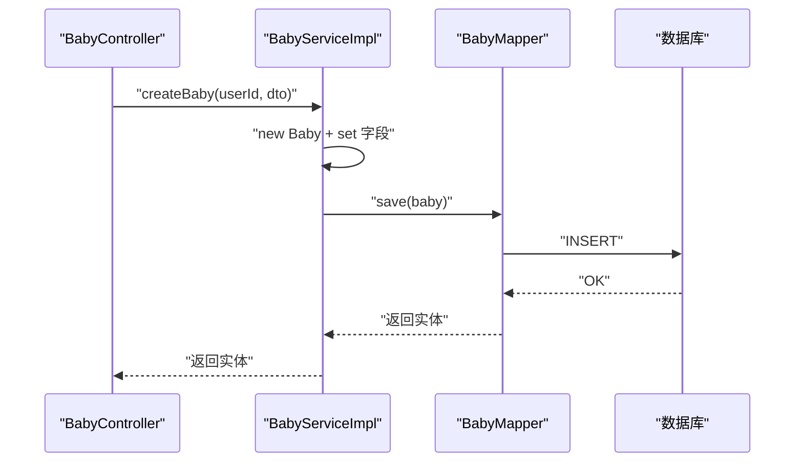
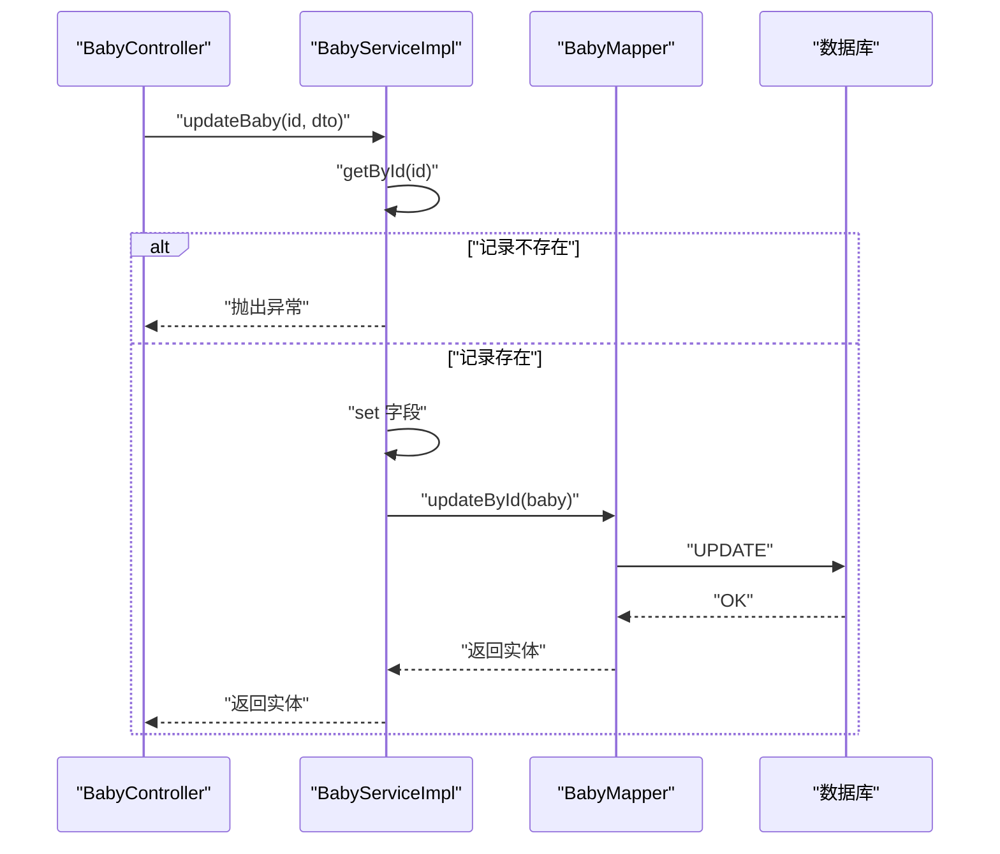
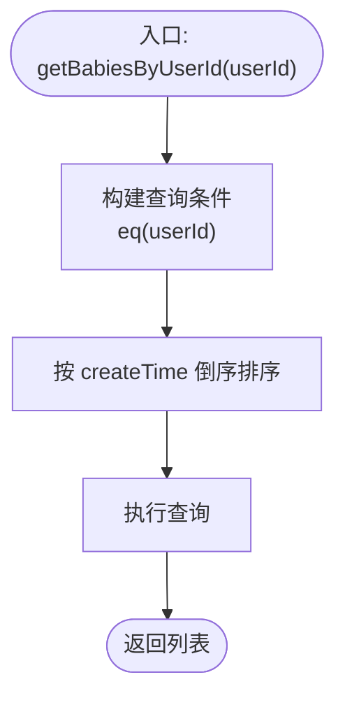
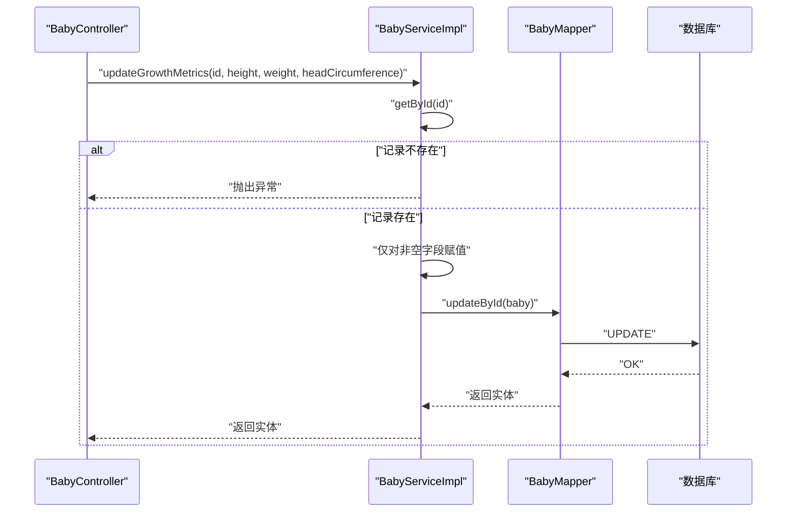
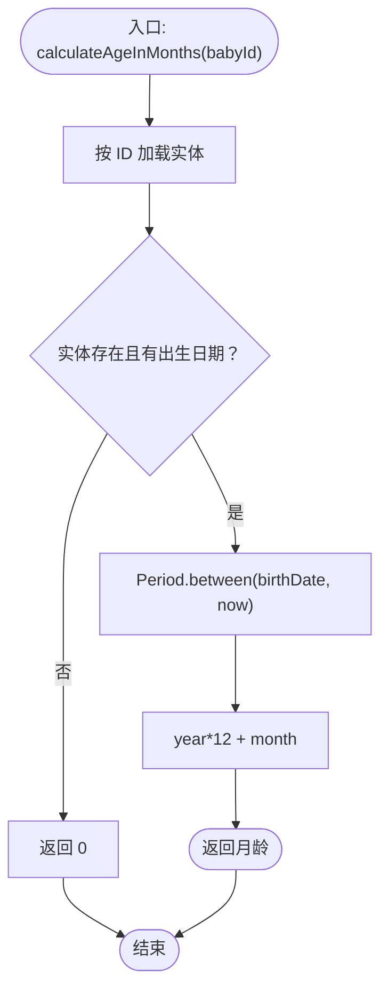
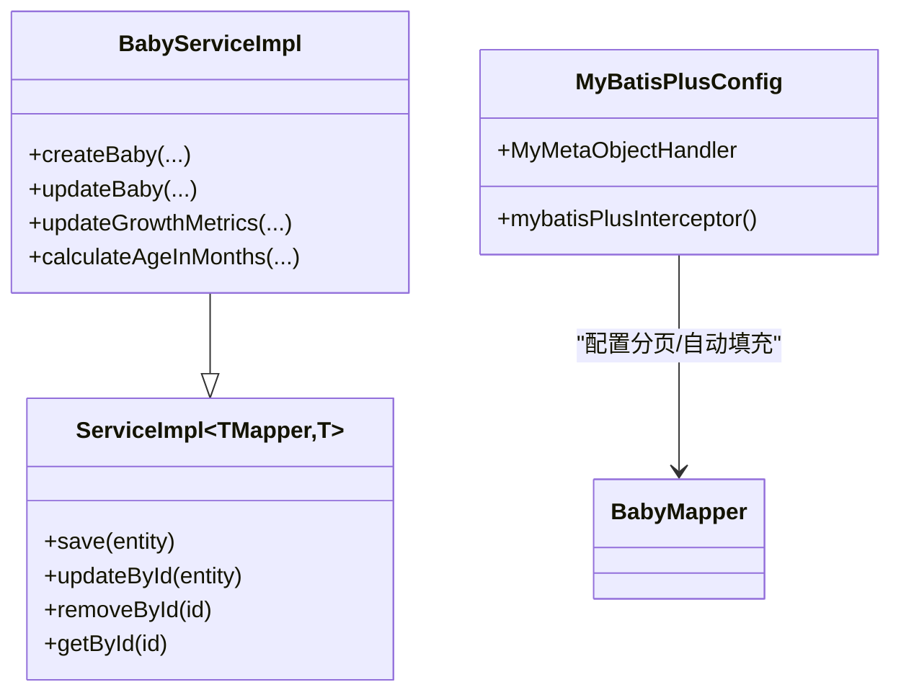
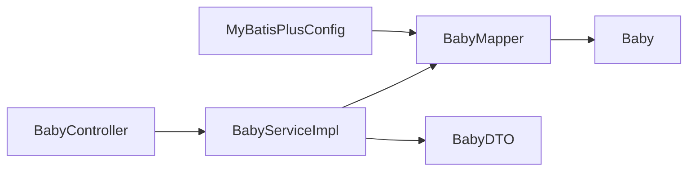

# 宝宝服务

<cite>
**本文引用的文件**
- [BabyService.java](file://backend/src/main/java/com/baby/service/BabyService.java)
- [BabyServiceImpl.java](file://backend/src/main/java/com/baby/service/impl/BabyServiceImpl.java)
- [BabyMapper.java](file://backend/src/main/java/com/baby/mapper/BabyMapper.java)
- [Baby.java](file://backend/src/main/java/com/baby/entity/Baby.java)
- [BabyDTO.java](file://backend/src/main/java/com/baby/dto/BabyDTO.java)
- [BabyController.java](file://backend/src/main/java/com/baby/controller/BabyController.java)
- [MyBatisPlusConfig.java](file://backend/src/main/java/com/baby/config/MyBatisPlusConfig.java)
- [BabyServiceTest.java](file://backend/src/test/java/com/baby/service/BabyServiceTest.java)
- [FeedingRecordServiceImpl.java](file://backend/src/main/java/com/baby/service/impl/FeedingRecordServiceImpl.java)
- [StatisticsController.java](file://backend/src/main/java/com/baby/controller/StatisticsController.java)
</cite>

## 目录
1. [简介](#简介)
2. [项目结构](#项目结构)
3. [核心组件](#核心组件)
4. [架构总览](#架构总览)
5. [详细组件分析](#详细组件分析)
6. [依赖关系分析](#依赖关系分析)
7. [性能考虑](#性能考虑)
8. [故障排查指南](#故障排查指南)
9. [结论](#结论)
10. [附录](#附录)

## 简介
本文件围绕 Spring Boot 后端的 BabyService 组件，系统性阐述宝宝档案的业务逻辑与实现细节，包括：
- 宝宝档案创建、更新、查询与删除
- 基于用户 ID 的多宝宝查询
- 生长指标（身高、体重、头围）的增量更新
- 月龄计算方法 calculateAgeInMonths 的实现与边界处理
- 事务管理与 MyBatis Plus IService 接口集成
- 数据一致性与常见问题处理（缺失记录、年龄计算边界等）
- 频繁访问场景下的性能优化建议

## 项目结构
后端采用分层设计：Controller 负责 HTTP 入口与参数校验；Service 提供业务能力；Mapper 负责数据库操作；Entity/DTO 描述数据模型。

图表来源
- [BabyController.java](file://backend/src/main/java/com/baby/controller/BabyController.java#L1-L80)
- [BabyServiceImpl.java](file://backend/src/main/java/com/baby/service/impl/BabyServiceImpl.java#L1-L90)
- [BabyMapper.java](file://backend/src/main/java/com/baby/mapper/BabyMapper.java#L1-L13)
- [Baby.java](file://backend/src/main/java/com/baby/entity/Baby.java#L1-L72)
- [BabyDTO.java](file://backend/src/main/java/com/baby/dto/BabyDTO.java#L1-L48)
- [MyBatisPlusConfig.java](file://backend/src/main/java/com/baby/config/MyBatisPlusConfig.java#L1-L48)

章节来源
- [BabyController.java](file://backend/src/main/java/com/baby/controller/BabyController.java#L1-L80)
- [BabyServiceImpl.java](file://backend/src/main/java/com/baby/service/impl/BabyServiceImpl.java#L1-L90)
- [BabyMapper.java](file://backend/src/main/java/com/baby/mapper/BabyMapper.java#L1-L13)
- [Baby.java](file://backend/src/main/java/com/baby/entity/Baby.java#L1-L72)
- [BabyDTO.java](file://backend/src/main/java/com/baby/dto/BabyDTO.java#L1-L48)
- [MyBatisPlusConfig.java](file://backend/src/main/java/com/baby/config/MyBatisPlusConfig.java#L1-L48)

## 核心组件
- 接口定义：BabyService 扩展 MyBatis Plus 的 IService，提供创建、更新、查询、生长指标更新、月龄计算等能力。
- 实现类：BabyServiceImpl 基于 ServiceImpl<BabyMapper, Baby>，通过注入 Mapper 完成持久化操作，并在关键方法上使用 @Transactional 保证原子性。
- 映射器：BabyMapper 继承 BaseMapper，自动获得通用 CRUD 能力。
- 实体与 DTO：Baby 描述数据库表结构及字段注解；BabyDTO 用于入参校验与传输。

章节来源
- [BabyService.java](file://backend/src/main/java/com/baby/service/BabyService.java#L1-L38)
- [BabyServiceImpl.java](file://backend/src/main/java/com/baby/service/impl/BabyServiceImpl.java#L1-L90)
- [BabyMapper.java](file://backend/src/main/java/com/baby/mapper/BabyMapper.java#L1-L13)
- [Baby.java](file://backend/src/main/java/com/baby/entity/Baby.java#L1-L72)
- [BabyDTO.java](file://backend/src/main/java/com/baby/dto/BabyDTO.java#L1-L48)

## 架构总览
下图展示从 HTTP 请求到数据库的调用链路，以及事务边界与数据一致性保障。

图表来源
- [BabyController.java](file://backend/src/main/java/com/baby/controller/BabyController.java#L24-L32)
- [BabyServiceImpl.java](file://backend/src/main/java/com/baby/service/impl/BabyServiceImpl.java#L24-L39)
- [BabyMapper.java](file://backend/src/main/java/com/baby/mapper/BabyMapper.java#L1-L13)

## 详细组件分析

### 1) 业务接口与实现概览
- 接口职责清晰：创建、更新、按用户查询、生长指标更新、月龄计算。
- 实现类继承 MyBatis Plus 的 ServiceImpl，复用通用 CRUD 方法，同时覆盖需要业务逻辑的方法。

图表来源
- [BabyService.java](file://backend/src/main/java/com/baby/service/BabyService.java#L1-L38)
- [BabyServiceImpl.java](file://backend/src/main/java/com/baby/service/impl/BabyServiceImpl.java#L1-L90)
- [BabyMapper.java](file://backend/src/main/java/com/baby/mapper/BabyMapper.java#L1-L13)
- [Baby.java](file://backend/src/main/java/com/baby/entity/Baby.java#L1-L72)

章节来源
- [BabyService.java](file://backend/src/main/java/com/baby/service/BabyService.java#L1-L38)
- [BabyServiceImpl.java](file://backend/src/main/java/com/baby/service/impl/BabyServiceImpl.java#L1-L90)

### 2) 创建宝宝档案（createBaby）
- 输入：当前登录用户 ID 与 BabyDTO（包含昵称、出生日期、性别、胎龄、身高、体重、头围、头像 URL）。
- 流程：组装实体、设置用户 ID、保存并返回实体。
- 事务：使用 @Transactional 保证插入的原子性。

图表来源
- [BabyController.java](file://backend/src/main/java/com/baby/controller/BabyController.java#L24-L32)
- [BabyServiceImpl.java](file://backend/src/main/java/com/baby/service/impl/BabyServiceImpl.java#L24-L39)
- [BabyMapper.java](file://backend/src/main/java/com/baby/mapper/BabyMapper.java#L1-L13)

章节来源
- [BabyServiceImpl.java](file://backend/src/main/java/com/baby/service/impl/BabyServiceImpl.java#L24-L39)
- [BabyController.java](file://backend/src/main/java/com/baby/controller/BabyController.java#L24-L32)

### 3) 更新宝宝档案（updateBaby）
- 输入：宝宝 ID 与 BabyDTO。
- 流程：先按 ID 查询实体，若不存在则抛出异常；存在则逐项更新字段并持久化。
- 事务：使用 @Transactional 保证更新的原子性。
- 校验：通过“存在性检查”避免对不存在记录进行更新，维护数据一致性。

图表来源
- [BabyController.java](file://backend/src/main/java/com/baby/controller/BabyController.java#L34-L40)
- [BabyServiceImpl.java](file://backend/src/main/java/com/baby/service/impl/BabyServiceImpl.java#L41-L58)
- [BabyMapper.java](file://backend/src/main/java/com/baby/mapper/BabyMapper.java#L1-L13)

章节来源
- [BabyServiceImpl.java](file://backend/src/main/java/com/baby/service/impl/BabyServiceImpl.java#L41-L58)
- [BabyController.java](file://backend/src/main/java/com/baby/controller/BabyController.java#L34-L40)

### 4) 按用户查询所有宝宝（getBabiesByUserId）
- 输入：用户 ID。
- 流程：使用 LambdaQueryWrapper 过滤 userId 并按创建时间倒序返回列表。
- 特点：无事务注解，只读查询。

图表来源
- [BabyServiceImpl.java](file://backend/src/main/java/com/baby/service/impl/BabyServiceImpl.java#L60-L65)

章节来源
- [BabyServiceImpl.java](file://backend/src/main/java/com/baby/service/impl/BabyServiceImpl.java#L60-L65)

### 5) 生长指标更新（updateGrowthMetrics）
- 输入：宝宝 ID 与可选的身高、体重、头围。
- 流程：按 ID 查询实体，若不存在抛异常；对非空字段进行增量更新并持久化。
- 事务：使用 @Transactional 保证更新原子性。

图表来源
- [BabyController.java](file://backend/src/main/java/com/baby/controller/BabyController.java#L56-L64)
- [BabyServiceImpl.java](file://backend/src/main/java/com/baby/service/impl/BabyServiceImpl.java#L67-L79)
- [BabyMapper.java](file://backend/src/main/java/com/baby/mapper/BabyMapper.java#L1-L13)

章节来源
- [BabyServiceImpl.java](file://backend/src/main/java/com/baby/service/impl/BabyServiceImpl.java#L67-L79)
- [BabyController.java](file://backend/src/main/java/com/baby/controller/BabyController.java#L56-L64)

### 6) 月龄计算（calculateAgeInMonths）
- 输入：宝宝 ID。
- 边界处理：
  - 若记录不存在或出生日期为空，返回 0。
  - 使用 Java 8 Period.between 计算年、月差值，转换为总月份数。
- 场景应用：喂养记录服务与统计服务会基于该月龄推导推荐间隔与建议。

图表来源
- [BabyServiceImpl.java](file://backend/src/main/java/com/baby/service/impl/BabyServiceImpl.java#L81-L90)

章节来源
- [BabyServiceImpl.java](file://backend/src/main/java/com/baby/service/impl/BabyServiceImpl.java#L81-L90)
- [FeedingRecordServiceImpl.java](file://backend/src/main/java/com/baby/service/impl/FeedingRecordServiceImpl.java#L191-L203)
- [StatisticsController.java](file://backend/src/main/java/com/baby/controller/StatisticsController.java#L106-L148)

### 7) 事务管理与 MyBatis Plus 集成
- 事务注解：在 createBaby、updateBaby、updateGrowthMetrics 上使用 @Transactional，确保单个业务方法内的数据库操作具备原子性。
- IService 集成：BabyServiceImpl 继承 ServiceImpl<BabyMapper, Baby>，天然具备 save、updateById、removeById、getById 等通用方法，简化实现。
- 自动填充：MyBatisPlusConfig 中的 MyMetaObjectHandler 在插入/更新时自动填充 createTime、updateTime，配合实体注解完成审计字段管理。

图表来源
- [BabyServiceImpl.java](file://backend/src/main/java/com/baby/service/impl/BabyServiceImpl.java#L1-L90)
- [MyBatisPlusConfig.java](file://backend/src/main/java/com/baby/config/MyBatisPlusConfig.java#L1-L48)
- [BabyMapper.java](file://backend/src/main/java/com/baby/mapper/BabyMapper.java#L1-L13)

章节来源
- [BabyServiceImpl.java](file://backend/src/main/java/com/baby/service/impl/BabyServiceImpl.java#L1-L90)
- [MyBatisPlusConfig.java](file://backend/src/main/java/com/baby/config/MyBatisPlusConfig.java#L1-L48)

### 8) 控制器对接与参数校验
- 控制器负责接收请求、提取 userId、封装响应结果，并调用服务层方法。
- 参数校验：BabyDTO 使用 Jakarta Bean Validation 注解，确保必填字段不为空。
- 响应包装：统一使用 Result<T> 返回，便于前端消费。

章节来源
- [BabyController.java](file://backend/src/main/java/com/baby/controller/BabyController.java#L1-L80)
- [BabyDTO.java](file://backend/src/main/java/com/baby/dto/BabyDTO.java#L1-L48)

### 9) 单元测试验证
- 测试覆盖了创建、月龄计算、生长指标更新等关键路径，验证返回值与业务预期一致。

章节来源
- [BabyServiceTest.java](file://backend/src/test/java/com/baby/service/BabyServiceTest.java#L1-L71)

## 依赖关系分析
- 控制层依赖服务层接口；服务层依赖映射器；映射器依赖 MyBatis Plus 基础能力；实体与 DTO 描述数据结构。
- 事务边界集中在服务层方法；查询方法保持只读，避免不必要的事务开销。
- 自动填充与分页插件在配置类中集中管理，降低重复配置成本。

图表来源
- [BabyController.java](file://backend/src/main/java/com/baby/controller/BabyController.java#L1-L80)
- [BabyServiceImpl.java](file://backend/src/main/java/com/baby/service/impl/BabyServiceImpl.java#L1-L90)
- [BabyMapper.java](file://backend/src/main/java/com/baby/mapper/BabyMapper.java#L1-L13)
- [Baby.java](file://backend/src/main/java/com/baby/entity/Baby.java#L1-L72)
- [BabyDTO.java](file://backend/src/main/java/com/baby/dto/BabyDTO.java#L1-L48)
- [MyBatisPlusConfig.java](file://backend/src/main/java/com/baby/config/MyBatisPlusConfig.java#L1-L48)

章节来源
- [BabyController.java](file://backend/src/main/java/com/baby/controller/BabyController.java#L1-L80)
- [BabyServiceImpl.java](file://backend/src/main/java/com/baby/service/impl/BabyServiceImpl.java#L1-L90)
- [BabyMapper.java](file://backend/src/main/java/com/baby/mapper/BabyMapper.java#L1-L13)
- [BabyDTO.java](file://backend/src/main/java/com/baby/dto/BabyDTO.java#L1-L48)
- [MyBatisPlusConfig.java](file://backend/src/main/java/com/baby/config/MyBatisPlusConfig.java#L1-L48)

## 性能考虑
- 频繁访问的多宝宝查询：按用户 ID 查询并按创建时间倒序，适合移动端首页快速加载；可在数据库层面建立索引以优化查询。
- 月龄计算：计算逻辑轻量，但若被高频调用，建议在缓存层（如 Redis）短期缓存结果，减少数据库访问。
- 生长指标更新：支持部分字段更新，避免全量写入；建议对高频更新的字段建立索引，提升更新效率。
- 事务粒度：将单次业务操作置于同一事务内，减少跨操作的数据不一致风险；对于批量操作建议拆分为多个小事务，避免长时间持有行锁。
- 自动填充：利用 MyBatis Plus 自动填充减少手动赋值，降低出错概率并提高一致性。

[本节为通用性能建议，不直接分析具体文件，故无章节来源]

## 故障排查指南
- 缺失宝宝记录
  - 现象：更新或生长指标更新时抛出“宝宝信息不存在”异常。
  - 排查：确认传入的宝宝 ID 是否正确，是否存在软删除标记；检查用户上下文是否匹配。
  - 参考实现位置：[BabyServiceImpl.updateBaby](file://backend/src/main/java/com/baby/service/impl/BabyServiceImpl.java#L41-L58)，[BabyServiceImpl.updateGrowthMetrics](file://backend/src/main/java/com/baby/service/impl/BabyServiceImpl.java#L67-L79)
- 月龄计算为 0
  - 现象：calculateAgeInMonths 返回 0。
  - 排查：确认实体存在且 birthDate 非空；若为空则按设计返回 0。
  - 参考实现位置：[BabyServiceImpl.calculateAgeInMonths](file://backend/src/main/java/com/baby/service/impl/BabyServiceImpl.java#L81-L90)
- 事务未生效
  - 现象：创建/更新后数据未落库或出现部分更新。
  - 排查：确认方法可见性与调用方式（同进程内调用不会触发代理事务）；检查数据库连接与隔离级别。
  - 参考实现位置：[BabyServiceImpl.createBaby](file://backend/src/main/java/com/baby/service/impl/BabyServiceImpl.java#L24-L39)，[BabyServiceImpl.updateBaby](file://backend/src/main/java/com/baby/service/impl/BabyServiceImpl.java#L41-L58)，[BabyServiceImpl.updateGrowthMetrics](file://backend/src/main/java/com/baby/service/impl/BabyServiceImpl.java#L67-L79)
- 参数校验失败
  - 现象：创建/更新接口返回参数错误。
  - 排查：检查 DTO 字段是否满足非空约束；确认前端传参格式与类型。
  - 参考实现位置：[BabyDTO](file://backend/src/main/java/com/baby/dto/BabyDTO.java#L1-L48)，[BabyController](file://backend/src/main/java/com/baby/controller/BabyController.java#L24-L40)

章节来源
- [BabyServiceImpl.java](file://backend/src/main/java/com/baby/service/impl/BabyServiceImpl.java#L41-L90)
- [BabyDTO.java](file://backend/src/main/java/com/baby/dto/BabyDTO.java#L1-L48)
- [BabyController.java](file://backend/src/main/java/com/baby/controller/BabyController.java#L24-L40)

## 结论
BabyService 通过清晰的接口划分与 MyBatis Plus 的通用能力，实现了宝宝档案的完整生命周期管理。事务注解确保关键操作的原子性，存在性校验与边界处理提升了数据一致性与健壮性。月龄计算逻辑简洁可靠，并在喂养与统计模块中发挥关键作用。建议在高频访问场景引入缓存与索引优化，持续提升系统性能与用户体验。

[本节为总结性内容，不直接分析具体文件，故无章节来源]

## 附录
- 月龄在业务中的应用示例：
  - 喂养间隔推荐：根据月龄选择推荐喂养间隔，结合用户自定义设置动态调整。
  - 统计洞察生成：依据月龄与喂养/睡眠统计生成个性化建议。
  - 参考实现位置：
    - [FeedingRecordServiceImpl.calculateNextFeedingTime](file://backend/src/main/java/com/baby/service/impl/FeedingRecordServiceImpl.java#L191-L203)
    - [StatisticsController.generateSuggestion](file://backend/src/main/java/com/baby/controller/StatisticsController.java#L131-L147)

章节来源
- [FeedingRecordServiceImpl.java](file://backend/src/main/java/com/baby/service/impl/FeedingRecordServiceImpl.java#L191-L203)
- [StatisticsController.java](file://backend/src/main/java/com/baby/controller/StatisticsController.java#L106-L148)