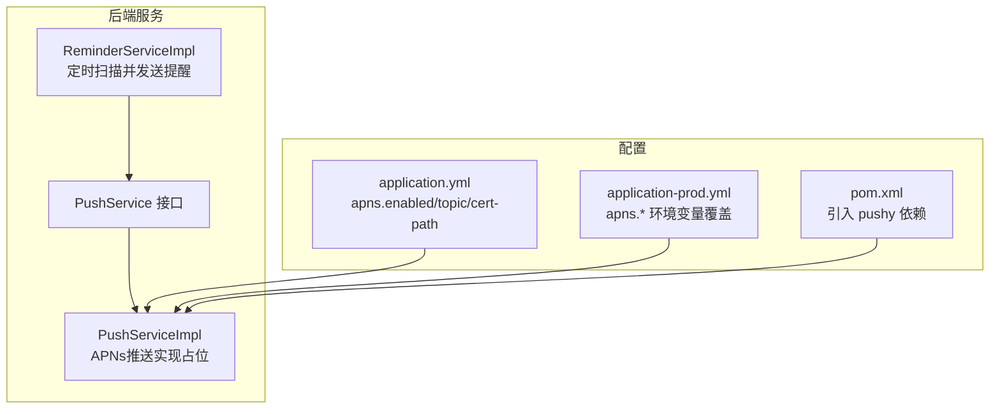
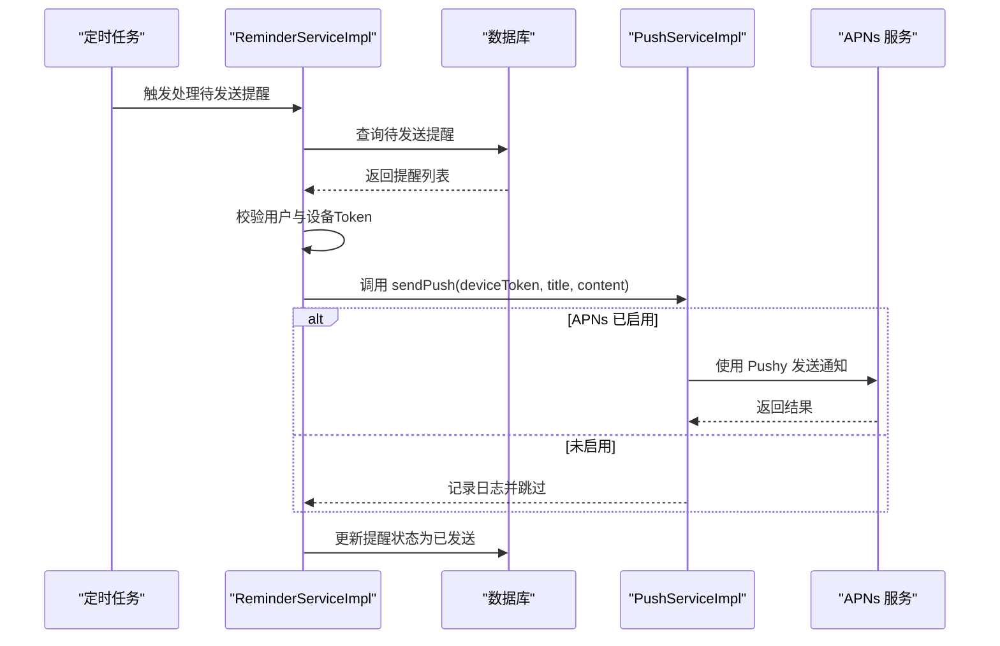
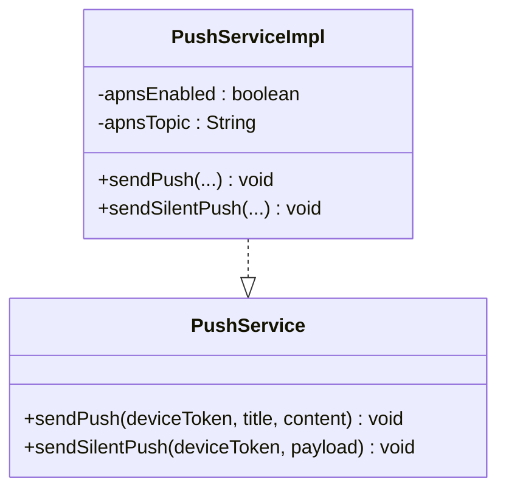
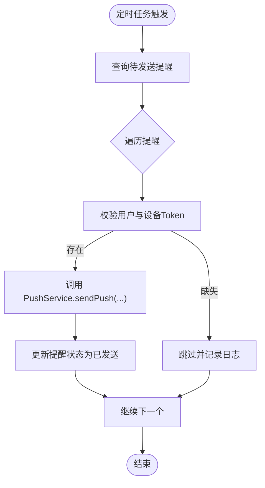
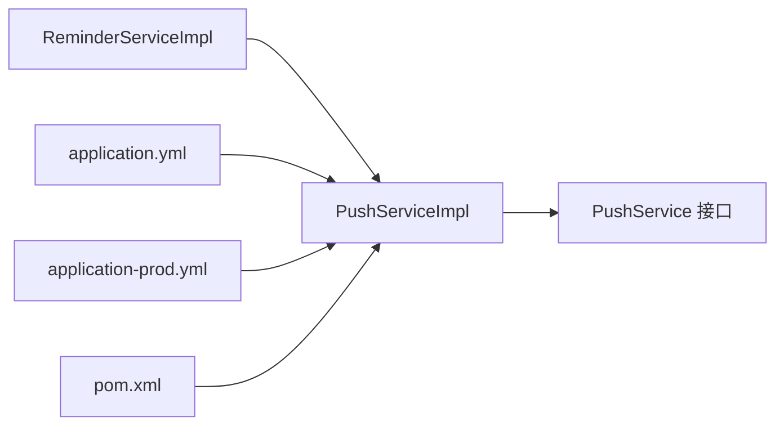

# 推送服务

<cite>
**本文引用的文件**
- [PushService.java](file://backend/src/main/java/com/baby/service/PushService.java)
- [PushServiceImpl.java](file://backend/src/main/java/com/baby/service/impl/PushServiceImpl.java)
- [ReminderService.java](file://backend/src/main/java/com/baby/service/ReminderService.java)
- [ReminderServiceImpl.java](file://backend/src/main/java/com/baby/service/impl/ReminderServiceImpl.java)
- [application.yml](file://backend/src/main/resources/application.yml)
- [application-prod.yml](file://backend/src/main/resources/application-prod.yml)
- [pom.xml](file://backend/pom.xml)
</cite>

## 目录
1. [简介](#简介)
2. [项目结构](#项目结构)
3. [核心组件](#核心组件)
4. [架构总览](#架构总览)
5. [详细组件分析](#详细组件分析)
6. [依赖关系分析](#依赖关系分析)
7. [性能考量](#性能考量)
8. [故障排查指南](#故障排查指南)
9. [结论](#结论)
10. [附录](#附录)

## 简介
本文件面向 Spring Boot 后端的 PushService 组件，聚焦于 APNs（Apple 推送通知服务）集成与实现。当前代码库中，PushService 接口与 PushServiceImpl 实现已具备基础框架与配置项，但 APNs 的实际推送逻辑仍处于“待实现”阶段（存在 TODO 注释）。本文将结合现有接口、实现与配置，系统性说明如何在不破坏现有结构的前提下，完成 Pushy 库的集成、证书认证、连接池与异步发送、错误恢复策略，并解释与 ReminderService 的联动方式。

## 项目结构
- 后端模块位于 backend/，包含服务层接口与实现、配置文件与依赖声明。
- PushService 为对外暴露的推送能力接口；PushServiceImpl 为默认实现，当前仅记录日志与占位逻辑。
- ReminderService/ReminderServiceImpl 负责业务提醒的创建与调度，并在定时任务中调用 PushService 发送通知。
- application.yml 与 application-prod.yml 提供 APNs 相关配置项，pom.xml 引入了 Pushy 依赖。

图表来源
- [PushService.java](file://backend/src/main/java/com/baby/service/PushService.java#L1-L22)
- [PushServiceImpl.java](file://backend/src/main/java/com/baby/service/impl/PushServiceImpl.java#L1-L68)
- [ReminderServiceImpl.java](file://backend/src/main/java/com/baby/service/impl/ReminderServiceImpl.java#L1-L242)
- [application.yml](file://backend/src/main/resources/application.yml#L41-L48)
- [application-prod.yml](file://backend/src/main/resources/application-prod.yml#L50-L57)
- [pom.xml](file://backend/pom.xml#L79-L84)

章节来源
- [PushService.java](file://backend/src/main/java/com/baby/service/PushService.java#L1-L22)
- [PushServiceImpl.java](file://backend/src/main/java/com/baby/service/impl/PushServiceImpl.java#L1-L68)
- [ReminderServiceImpl.java](file://backend/src/main/java/com/baby/service/impl/ReminderServiceImpl.java#L1-L242)
- [application.yml](file://backend/src/main/resources/application.yml#L41-L48)
- [application-prod.yml](file://backend/src/main/resources/application-prod.yml#L50-L57)
- [pom.xml](file://backend/pom.xml#L79-L84)

## 核心组件
- PushService 接口：定义两类推送能力：
  - 普通推送：接收设备 Token、标题与内容。
  - 静默推送：接收设备 Token 与自定义负载字符串。
- PushServiceImpl 实现：
  - 读取 apns.enabled 与 apns.topic 配置。
  - 当 apns.enabled 为 false 时，记录日志并跳过实际推送（便于开发测试）。
  - 当 apns.enabled 为 true 时，预留接入 Pushy 的位置（当前为 TODO 占位）。
- ReminderServiceImpl：
  - 通过定时任务扫描待发送提醒，获取用户设备 Token 并调用 PushService 发送。
  - 发送成功后更新提醒状态与发送时间。

章节来源
- [PushService.java](file://backend/src/main/java/com/baby/service/PushService.java#L1-L22)
- [PushServiceImpl.java](file://backend/src/main/java/com/baby/service/impl/PushServiceImpl.java#L1-L68)
- [ReminderServiceImpl.java](file://backend/src/main/java/com/baby/service/impl/ReminderServiceImpl.java#L188-L211)

## 架构总览
下图展示了从提醒创建到 APNs 推送的整体流程，以及与配置和依赖的关系。

图表来源
- [ReminderServiceImpl.java](file://backend/src/main/java/com/baby/service/impl/ReminderServiceImpl.java#L188-L211)
- [PushServiceImpl.java](file://backend/src/main/java/com/baby/service/impl/PushServiceImpl.java#L21-L49)
- [application.yml](file://backend/src/main/resources/application.yml#L41-L48)

## 详细组件分析

### PushService 接口与实现
- 接口职责清晰：提供普通推送与静默推送两个入口，参数分别为设备 Token、标题/内容与自定义负载。
- 实现现状：
  - 读取 apns.enabled 与 apns.topic。
  - 若未启用，则记录日志并直接返回。
  - 若启用，则预留 Pushy 集成点（当前为 TODO 占位）。
- 关键注意点：
  - 当前实现未使用 CompletableFuture 或异步线程池，发送为同步阻塞调用。
  - 未实现证书加载、连接池、重连与重试等高级特性。

图表来源
- [PushService.java](file://backend/src/main/java/com/baby/service/PushService.java#L1-L22)
- [PushServiceImpl.java](file://backend/src/main/java/com/baby/service/impl/PushServiceImpl.java#L1-L68)

章节来源
- [PushService.java](file://backend/src/main/java/com/baby/service/PushService.java#L1-L22)
- [PushServiceImpl.java](file://backend/src/main/java/com/baby/service/impl/PushServiceImpl.java#L1-L68)

### ReminderService 与 PushService 的集成
- ReminderServiceImpl 在定时任务中查询待发送提醒，获取用户信息与设备 Token。
- 若用户存在且设备 Token 非空，则调用 PushService 发送通知。
- 发送成功后更新提醒状态与发送时间，确保幂等性与可追踪性。

图表来源
- [ReminderServiceImpl.java](file://backend/src/main/java/com/baby/service/impl/ReminderServiceImpl.java#L188-L211)

章节来源
- [ReminderServiceImpl.java](file://backend/src/main/java/com/baby/service/impl/ReminderServiceImpl.java#L188-L211)

### APNs 集成设计要点（基于现有占位实现的扩展建议）
以下为在现有代码基础上完成 Pushy 集成的实施建议，涵盖配置、初始化、证书认证、连接池、异步发送与错误恢复：

- 配置与初始化
  - 读取 apns.enabled、apns.production、apns.certificate-path、apns.certificate-password、apns.topic。
  - 生产环境建议通过 application-prod.yml 的环境变量进行覆盖。
  - 初始化 Pushy 的 ApnsClient，使用证书路径与密码加载密钥材料，设置生产/开发环境标志。
- 证书与认证
  - 证书路径支持 classpath 与绝对路径两种形式；密码需安全存储（建议使用环境变量）。
  - 证书到期前应自动轮换并替换密钥材料，避免服务中断。
- 连接池与并发
  - 使用 Pushy 的默认连接池或自定义线程池，控制最大并发与队列长度。
  - 对高并发场景，建议将发送操作放入异步线程池，避免阻塞主线程。
- 消息构建
  - 普通推送：构造 APNs Payload，包含标题、内容、声音等字段。
  - 静默推送：构造自定义负载，避免触发系统通知栏，仅触发应用内事件。
- 异步发送与 CompletableFuture
  - 将发送封装为异步任务，返回 CompletableFuture，以便上层聚合与监控。
  - 对批量发送，使用批量提交与回调聚合，减少网络往返。
- 错误恢复
  - 失败重试：对临时性错误（如网络抖动）进行指数退避重试。
  - 设备 Token 失效：捕获“无效令牌”错误，标记对应提醒为失效并停止后续重试。
  - 连接断开：实现自动重连与心跳检测，必要时降级为队列持久化。
- 消息顺序与幂等
  - 保证同一用户的推送顺序，避免乱序。
  - 幂等性：对已发送成功的提醒不再重复发送，避免重复通知。
- 性能优化
  - 合理设置连接池大小与超时阈值，避免资源耗尽。
  - 对热点用户或高并发场景，采用分片与限流策略。

章节来源
- [application.yml](file://backend/src/main/resources/application.yml#L41-L48)
- [application-prod.yml](file://backend/src/main/resources/application-prod.yml#L50-L57)
- [pom.xml](file://backend/pom.xml#L79-L84)

## 依赖关系分析
- PushService 与 PushServiceImpl：接口与实现分离，便于替换不同推送后端。
- ReminderServiceImpl 依赖 PushService：通过注入方式调用推送能力。
- 配置依赖：application.yml 与 application-prod.yml 提供 APNs 开关与证书信息。
- 第三方依赖：pom.xml 中引入 Pushy，为 APNs 客户端实现提供基础。

图表来源
- [ReminderServiceImpl.java](file://backend/src/main/java/com/baby/service/impl/ReminderServiceImpl.java#L1-L242)
- [PushServiceImpl.java](file://backend/src/main/java/com/baby/service/impl/PushServiceImpl.java#L1-L68)
- [application.yml](file://backend/src/main/resources/application.yml#L41-L48)
- [application-prod.yml](file://backend/src/main/resources/application-prod.yml#L50-L57)
- [pom.xml](file://backend/pom.xml#L79-L84)

章节来源
- [ReminderServiceImpl.java](file://backend/src/main/java/com/baby/service/impl/ReminderServiceImpl.java#L1-L242)
- [PushServiceImpl.java](file://backend/src/main/java/com/baby/service/impl/PushServiceImpl.java#L1-L68)
- [application.yml](file://backend/src/main/resources/application.yml#L41-L48)
- [application-prod.yml](file://backend/src/main/resources/application-prod.yml#L50-L57)
- [pom.xml](file://backend/pom.xml#L79-L84)

## 性能考量
- 连接池与并发
  - 控制 APNs 连接数与并发度，避免超出 Apple 限制。
  - 对高并发场景，采用异步发送与批量提交，降低延迟。
- 资源管理
  - 合理设置超时与重试策略，避免长时间占用线程。
  - 监控连接池使用率与错误率，动态调整参数。
- 数据库与缓存
  - 提醒状态更新应尽量轻量，避免阻塞主流程。
  - 对热点用户，可考虑本地缓存设备 Token 以减少查询。

[本节为通用性能建议，无需特定文件引用]

## 故障排查指南
- APNs 未启用
  - 现象：日志显示“APNs推送未启用”，实际未发送。
  - 处理：确认 apns.enabled 为 true；生产环境通过环境变量覆盖。
- 设备 Token 为空
  - 现象：提醒发送被跳过并记录警告。
  - 处理：前端需在注册或登录时上报有效设备 Token；后端侧避免空值。
- 证书问题
  - 现象：启动时报证书加载失败或签名验证错误。
  - 处理：核对证书路径与密码；确保证书未过期；生产与开发证书区分。
- 发送异常
  - 现象：抛出运行时异常或日志报错。
  - 处理：捕获异常并记录上下文；对可重试错误进行退避重试；对无效令牌错误进行标记与清理。
- 定时任务未触发
  - 现象：提醒未按时发送。
  - 处理：确认 @Scheduled 注解生效；检查数据库连接与定时任务线程池配置。

章节来源
- [PushServiceImpl.java](file://backend/src/main/java/com/baby/service/impl/PushServiceImpl.java#L21-L49)
- [ReminderServiceImpl.java](file://backend/src/main/java/com/baby/service/impl/ReminderServiceImpl.java#L190-L211)
- [application.yml](file://backend/src/main/resources/application.yml#L41-L48)
- [application-prod.yml](file://backend/src/main/resources/application-prod.yml#L50-L57)

## 结论
当前 PushService 已具备 APNs 集成的基础配置与接口骨架，但尚未完成 Pushy 的实际接入。建议在保持现有接口不变的前提下，逐步完善证书加载、连接池、异步发送与错误恢复机制，并与 ReminderService 的定时调度形成稳定可靠的推送链路。通过合理的配置与监控，可在保证可靠性的同时满足高并发场景下的通知需求。

[本节为总结性内容，无需特定文件引用]

## 附录

### APNs 配置项说明
- apns.enabled：是否启用 APNs 推送。
- apns.production：是否为生产环境（true/false）。
- apns.certificate-path：证书路径（支持 classpath 与绝对路径）。
- apns.certificate-password：证书密码。
- apns.topic：推送主题（Bundle Identifier）。

章节来源
- [application.yml](file://backend/src/main/resources/application.yml#L41-L48)
- [application-prod.yml](file://backend/src/main/resources/application-prod.yml#L50-L57)

### 依赖声明
- Pushy 客户端：用于与 APNs 通信。
- Spring Boot Starter Web/Redis/Security 等：支撑整体服务运行。

章节来源
- [pom.xml](file://backend/pom.xml#L79-L84)