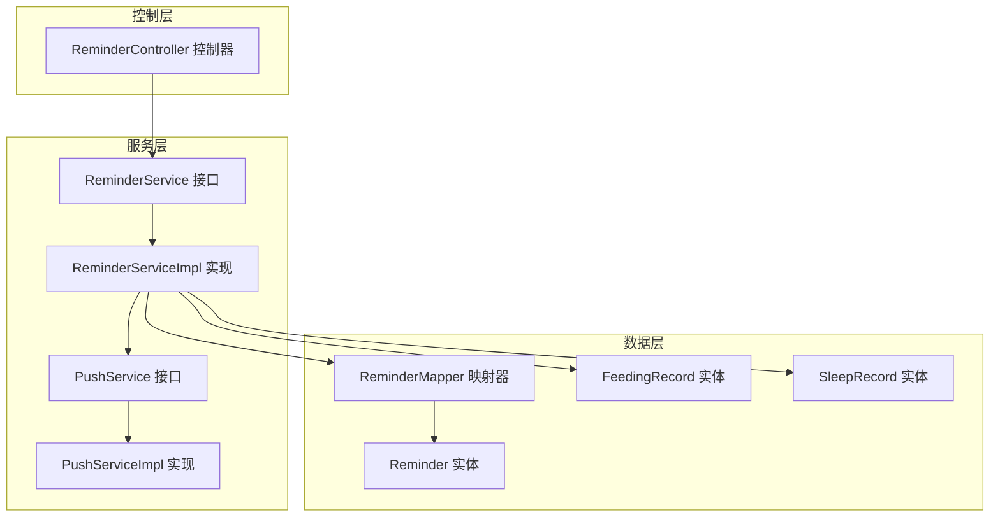
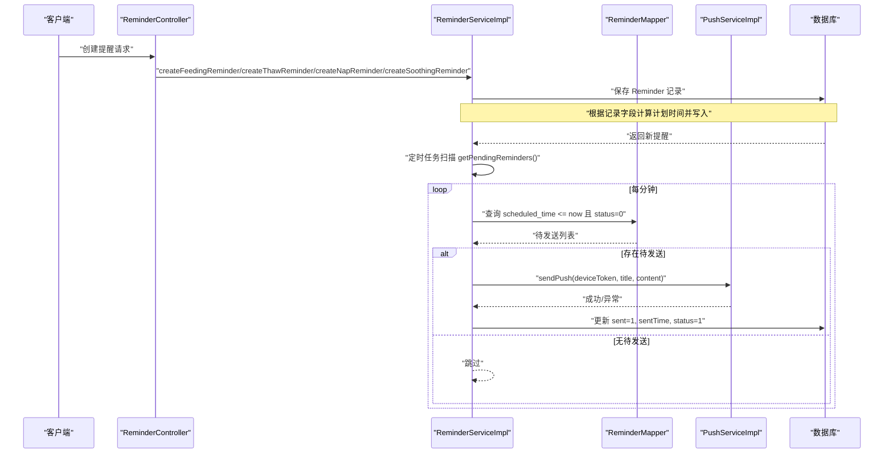
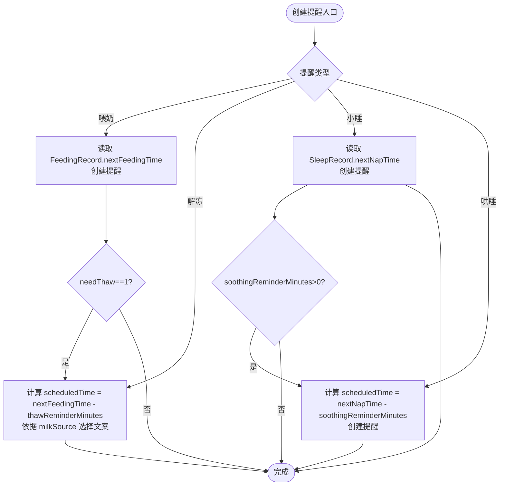
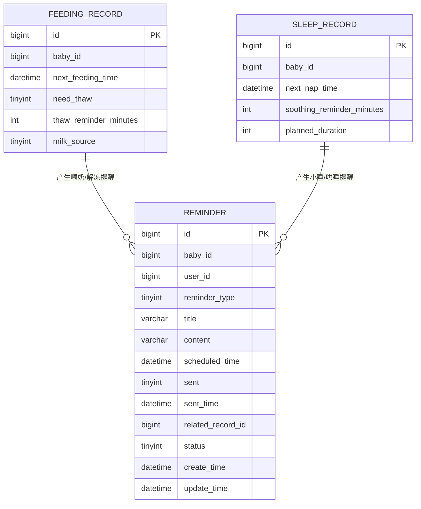
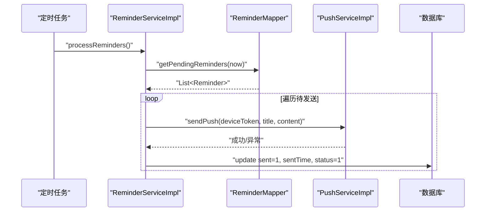
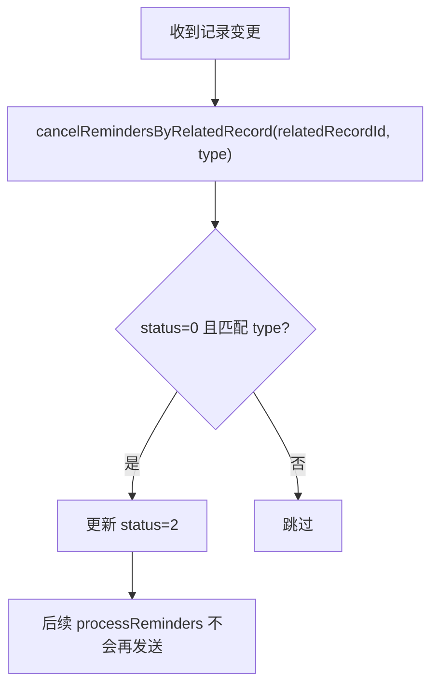
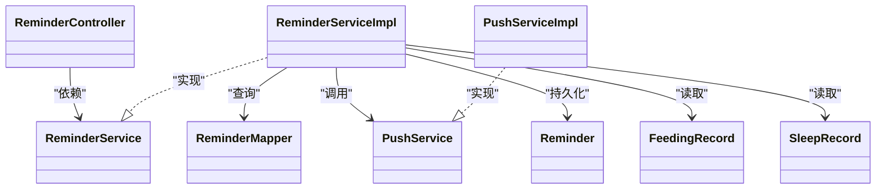

# 提醒服务

<cite>
**本文引用的文件**
- [ReminderService.java](file://backend/src/main/java/com/baby/service/ReminderService.java)
- [ReminderServiceImpl.java](file://backend/src/main/java/com/baby/service/impl/ReminderServiceImpl.java)
- [Reminder.java](file://backend/src/main/java/com/baby/entity/Reminder.java)
- [ReminderMapper.java](file://backend/src/main/java/com/baby/mapper/ReminderMapper.java)
- [ReminderController.java](file://backend/src/main/java/com/baby/controller/ReminderController.java)
- [PushService.java](file://backend/src/main/java/com/baby/service/PushService.java)
- [PushServiceImpl.java](file://backend/src/main/java/com/baby/service/impl/PushServiceImpl.java)
- [FeedingRecord.java](file://backend/src/main/java/com/baby/entity/FeedingRecord.java)
- [SleepRecord.java](file://backend/src/main/java/com/baby/entity/SleepRecord.java)
- [init.sql](file://backend/src/main/resources/db/init.sql)
</cite>

## 目录
1. [简介](#简介)
2. [项目结构](#项目结构)
3. [核心组件](#核心组件)
4. [架构总览](#架构总览)
5. [详细组件分析](#详细组件分析)
6. [依赖关系分析](#依赖关系分析)
7. [性能与可靠性](#性能与可靠性)
8. [常见问题与排障](#常见问题与排障)
9. [结论](#结论)
10. [附录](#附录)

## 简介
本文件聚焦于 Spring Boot 后端中的 ReminderService 组件，系统性阐述其在喂奶、解冻、小睡、哄睡四类事件上的提醒调度与管理机制。文档覆盖以下关键点：
- 不同类型提醒的创建流程与时间计算（如基于喂奶时间与母乳来源的解冻提醒提前时长）
- 与 PushService 的集成与通知下发
- 提醒状态管理（待发送、已发送、已取消）
- 批量取消策略（按关联记录与提醒类型）
- 数据模型与索引设计
- 常见问题处理（时区、重复提醒、可靠投递）

## 项目结构
ReminderService 属于后端服务层，围绕实体、映射器、服务实现与控制器展开，并通过定时任务扫描待发送提醒并调用推送服务。

图表来源
- [ReminderService.java](file://backend/src/main/java/com/baby/service/ReminderService.java#L1-L63)
- [ReminderServiceImpl.java](file://backend/src/main/java/com/baby/service/impl/ReminderServiceImpl.java#L1-L241)
- [ReminderMapper.java](file://backend/src/main/java/com/baby/mapper/ReminderMapper.java#L1-L34)
- [Reminder.java](file://backend/src/main/java/com/baby/entity/Reminder.java#L1-L76)
- [FeedingRecord.java](file://backend/src/main/java/com/baby/entity/FeedingRecord.java#L1-L81)
- [SleepRecord.java](file://backend/src/main/java/com/baby/entity/SleepRecord.java#L1-L76)
- [ReminderController.java](file://backend/src/main/java/com/baby/controller/ReminderController.java#L1-L45)
- [PushService.java](file://backend/src/main/java/com/baby/service/PushService.java#L1-L23)
- [PushServiceImpl.java](file://backend/src/main/java/com/baby/service/impl/PushServiceImpl.java#L1-L68)

章节来源
- [ReminderService.java](file://backend/src/main/java/com/baby/service/ReminderService.java#L1-L63)
- [ReminderServiceImpl.java](file://backend/src/main/java/com/baby/service/impl/ReminderServiceImpl.java#L1-L241)
- [ReminderController.java](file://backend/src/main/java/com/baby/controller/ReminderController.java#L1-L45)

## 核心组件
- ReminderService 接口：定义提醒生命周期操作（创建、查询、发送、取消、批量取消）
- ReminderServiceImpl 实现：完成具体业务逻辑，包括提醒创建、状态更新、定时扫描与推送
- ReminderMapper：提供“待发送”和“今日提醒”的 SQL 查询
- Reminder 实体：承载提醒字段（类型、标题、内容、计划时间、状态、关联记录等）
- PushService/PushServiceImpl：抽象与实现 APNs 推送能力（当前为模拟）
- FeedingRecord/SleepRecord：喂奶与睡眠记录，驱动提醒生成与时间计算

章节来源
- [ReminderService.java](file://backend/src/main/java/com/baby/service/ReminderService.java#L1-L63)
- [ReminderServiceImpl.java](file://backend/src/main/java/com/baby/service/impl/ReminderServiceImpl.java#L1-L241)
- [ReminderMapper.java](file://backend/src/main/java/com/baby/mapper/ReminderMapper.java#L1-L34)
- [Reminder.java](file://backend/src/main/java/com/baby/entity/Reminder.java#L1-L76)
- [PushService.java](file://backend/src/main/java/com/baby/service/PushService.java#L1-L23)
- [PushServiceImpl.java](file://backend/src/main/java/com/baby/service/impl/PushServiceImpl.java#L1-L68)
- [FeedingRecord.java](file://backend/src/main/java/com/baby/entity/FeedingRecord.java#L1-L81)
- [SleepRecord.java](file://backend/src/main/java/com/baby/entity/SleepRecord.java#L1-L76)

## 架构总览
ReminderService 的工作流由“创建提醒 -> 定时扫描 -> 推送 -> 状态更新”构成，同时支持按记录批量取消。

图表来源
- [ReminderController.java](file://backend/src/main/java/com/baby/controller/ReminderController.java#L1-L45)
- [ReminderServiceImpl.java](file://backend/src/main/java/com/baby/service/impl/ReminderServiceImpl.java#L1-L241)
- [ReminderMapper.java](file://backend/src/main/java/com/baby/mapper/ReminderMapper.java#L1-L34)
- [PushServiceImpl.java](file://backend/src/main/java/com/baby/service/impl/PushServiceImpl.java#L1-L68)

## 详细组件分析

### 提醒类型与创建逻辑
- 喂奶提醒（类型 1）
  - 来源：FeedingRecord.nextFeedingTime
  - 行为：创建一条 scheduledTime 等于 nextFeedingTime 的提醒；若 needThaw=1，则自动创建解冻提醒
- 解冻提醒（类型 2）
  - 来源：FeedingRecord.nextFeedingTime 与 thawReminderMinutes
  - 计算：scheduledTime = nextFeedingTime - thawReminderMinutes
  - 特性：依据 milkSource 区分“冷藏母乳”或“冷冻母乳”，动态生成文案
- 小睡提醒（类型 3）
  - 来源：SleepRecord.nextNapTime
  - 行为：创建一条 scheduledTime 等于 nextNapTime 的提醒；若 soothingReminderMinutes>0，则创建哄睡提醒
- 哄睡提醒（类型 4）
  - 来源：SleepRecord.nextNapTime 与 soothingReminderMinutes
  - 计算：scheduledTime = nextNapTime - soothingReminderMinutes

图表来源
- [ReminderServiceImpl.java](file://backend/src/main/java/com/baby/service/impl/ReminderServiceImpl.java#L37-L164)
- [FeedingRecord.java](file://backend/src/main/java/com/baby/entity/FeedingRecord.java#L1-L81)
- [SleepRecord.java](file://backend/src/main/java/com/baby/entity/SleepRecord.java#L1-L76)

章节来源
- [ReminderServiceImpl.java](file://backend/src/main/java/com/baby/service/impl/ReminderServiceImpl.java#L37-L164)
- [FeedingRecord.java](file://backend/src/main/java/com/baby/entity/FeedingRecord.java#L1-L81)
- [SleepRecord.java](file://backend/src/main/java/com/baby/entity/SleepRecord.java#L1-L76)

### 数据模型与索引
- Reminder 字段要点
  - reminderType：1 喂奶、2 解冻、3 小睡、4 哄睡
  - scheduledTime：计划提醒时间（数据库为 datetime）
  - status：0 待发送、1 已发送、2 已取消
  - sent/sentTime：是否已发送及发送时间
  - relatedRecordId：关联喂养或睡眠记录 ID
  - userId/babyId：用户与宝宝维度，便于查询与推送
- 数据库索引
  - idx_scheduled_time、idx_status、idx_user_id、idx_user_status，支撑“待发送”和“今日提醒”的高效查询

图表来源
- [Reminder.java](file://backend/src/main/java/com/baby/entity/Reminder.java#L1-L76)
- [FeedingRecord.java](file://backend/src/main/java/com/baby/entity/FeedingRecord.java#L1-L81)
- [SleepRecord.java](file://backend/src/main/java/com/baby/entity/SleepRecord.java#L1-L76)
- [init.sql](file://backend/src/main/resources/db/init.sql#L121-L141)

章节来源
- [Reminder.java](file://backend/src/main/java/com/baby/entity/Reminder.java#L1-L76)
- [init.sql](file://backend/src/main/resources/db/init.sql#L121-L141)

### 定时扫描与推送流程
- 定时任务
  - 每分钟执行一次 processReminders，查询 scheduled_time <= now 且 status=0 的提醒
  - 对每个待发送提醒调用 PushServiceImpl 发送通知，并将状态更新为已发送
- 推送集成
  - PushServiceImpl 支持 APNs 开关与日志输出；当前为模拟实现，预留真实 APNs 集成位置

图表来源
- [ReminderServiceImpl.java](file://backend/src/main/java/com/baby/service/impl/ReminderServiceImpl.java#L183-L241)
- [ReminderMapper.java](file://backend/src/main/java/com/baby/mapper/ReminderMapper.java#L1-L34)
- [PushServiceImpl.java](file://backend/src/main/java/com/baby/service/impl/PushServiceImpl.java#L1-L68)

章节来源
- [ReminderServiceImpl.java](file://backend/src/main/java/com/baby/service/impl/ReminderServiceImpl.java#L183-L241)
- [ReminderMapper.java](file://backend/src/main/java/com/baby/mapper/ReminderMapper.java#L1-L34)
- [PushServiceImpl.java](file://backend/src/main/java/com/baby/service/impl/PushServiceImpl.java#L1-L68)

### 状态管理与批量取消
- 状态流转
  - 新建：status=0, sent=0
  - 发送成功：sent=1, sentTime=now, status=1
  - 取消：status=2（仅对未发送且未取消的记录有效）
- 批量取消
  - 按 relatedRecordId 与 reminderType 查询未发送记录并统一置为已取消
  - 用于当原始记录被修改导致提醒不再有效时，避免无效提醒打扰用户

图表来源
- [ReminderServiceImpl.java](file://backend/src/main/java/com/baby/service/impl/ReminderServiceImpl.java#L221-L229)

章节来源
- [ReminderServiceImpl.java](file://backend/src/main/java/com/baby/service/impl/ReminderServiceImpl.java#L213-L229)

### 控制器与外部交互
- 控制器提供：
  - 获取用户今日提醒
  - 获取宝宝即将到来的提醒
  - 取消单条提醒
- 以上接口均委托给 ReminderService 实现

章节来源
- [ReminderController.java](file://backend/src/main/java/com/baby/controller/ReminderController.java#L1-L45)
- [ReminderService.java](file://backend/src/main/java/com/baby/service/ReminderService.java#L1-L63)

## 依赖关系分析
- 组件耦合
  - ReminderServiceImpl 依赖 ReminderMapper、UserMapper、BabyMapper、PushService
  - 控制器仅依赖 ReminderService，保持清晰的分层
- 外部依赖
  - 定时任务使用 Spring Scheduling
  - 推送服务为可插拔接口，当前实现为模拟

图表来源
- [ReminderController.java](file://backend/src/main/java/com/baby/controller/ReminderController.java#L1-L45)
- [ReminderService.java](file://backend/src/main/java/com/baby/service/ReminderService.java#L1-L63)
- [ReminderServiceImpl.java](file://backend/src/main/java/com/baby/service/impl/ReminderServiceImpl.java#L1-L241)
- [ReminderMapper.java](file://backend/src/main/java/com/baby/mapper/ReminderMapper.java#L1-L34)
- [PushService.java](file://backend/src/main/java/com/baby/service/PushService.java#L1-L23)
- [PushServiceImpl.java](file://backend/src/main/java/com/baby/service/impl/PushServiceImpl.java#L1-L68)
- [Reminder.java](file://backend/src/main/java/com/baby/entity/Reminder.java#L1-L76)
- [FeedingRecord.java](file://backend/src/main/java/com/baby/entity/FeedingRecord.java#L1-L81)
- [SleepRecord.java](file://backend/src/main/java/com/baby/entity/SleepRecord.java#L1-L76)

## 性能与可靠性
- 查询优化
  - “待发送”与“今日提醒”查询均利用索引，减少全表扫描
  - “待发送”按 scheduled_time 升序，确保先到先发
- 并发与事务
  - 提醒创建与状态更新均在事务中进行，保证一致性
- 定时任务粒度
  - 每分钟扫描一次，兼顾及时性与开销平衡
- 可靠性
  - 发送失败会记录错误日志，不影响其他提醒的处理
  - 取消操作仅作用于未发送记录，避免误伤已发送提醒

[本节为通用性能讨论，不直接分析具体文件]

## 常见问题与排障

- 时区与计划时间
  - scheduledTime 以数据库 datetime 存储；服务端使用 LocalDateTime.now() 进行比较
  - 建议前后端统一时区策略，避免跨时区场景下的显示与触发偏差
  - 若需严格时区控制，可在应用配置或数据库层面统一时区设置

- 重复提醒
  - 当前未在数据库层面显式去重约束；可通过以下方式降低重复概率：
    - 在创建提醒前检查是否存在相同类型的未发送提醒（可扩展）
    - 使用唯一键组合（如 relatedRecordId+reminderType+scheduledTime），并在插入前做幂等判断
  - 批量取消机制可避免同一记录多次变更产生的冗余提醒堆积

- 可靠投递
  - PushServiceImpl 当前为模拟实现，真实环境需接入 APNs 客户端
  - 发送异常会被捕获并记录日志；建议增加重试与告警策略
  - 若设备 Token 缺失或用户不存在，会记录警告日志并跳过发送

- 状态一致性
  - 发送成功后更新 sent/sentTime/status，确保后续扫描不再重复发送
  - 取消仅对未发送记录生效，避免对已发送记录进行二次处理

章节来源
- [ReminderServiceImpl.java](file://backend/src/main/java/com/baby/service/impl/ReminderServiceImpl.java#L189-L211)
- [PushServiceImpl.java](file://backend/src/main/java/com/baby/service/impl/PushServiceImpl.java#L1-L68)
- [ReminderMapper.java](file://backend/src/main/java/com/baby/mapper/ReminderMapper.java#L1-L34)

## 结论
ReminderService 通过清晰的接口与实现，将喂奶、解冻、小睡、哄睡四类事件与提醒调度有机结合。其核心优势在于：
- 基于业务记录的精准时间计算
- 基于定时任务的稳定投递
- 清晰的状态机与批量取消能力
- 可插拔的推送服务接口，便于扩展真实推送通道

建议后续增强：
- 数据库层面的重复提醒防护
- 更细粒度的时区与时钟策略
- 推送失败重试与监控告警
- 前端展示与后端时区对齐的一致性校验

[本节为总结性内容，不直接分析具体文件]

## 附录

### API 一览（控制器）
- GET /reminder/today/{userId}：获取用户今日待发送提醒
- GET /reminder/upcoming/{babyId}：获取宝宝即将到来的提醒（未发送）
- DELETE /reminder/{id}：取消单条提醒

章节来源
- [ReminderController.java](file://backend/src/main/java/com/baby/controller/ReminderController.java#L1-L45)