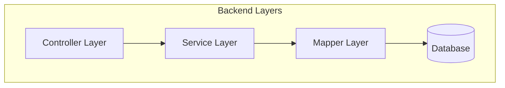
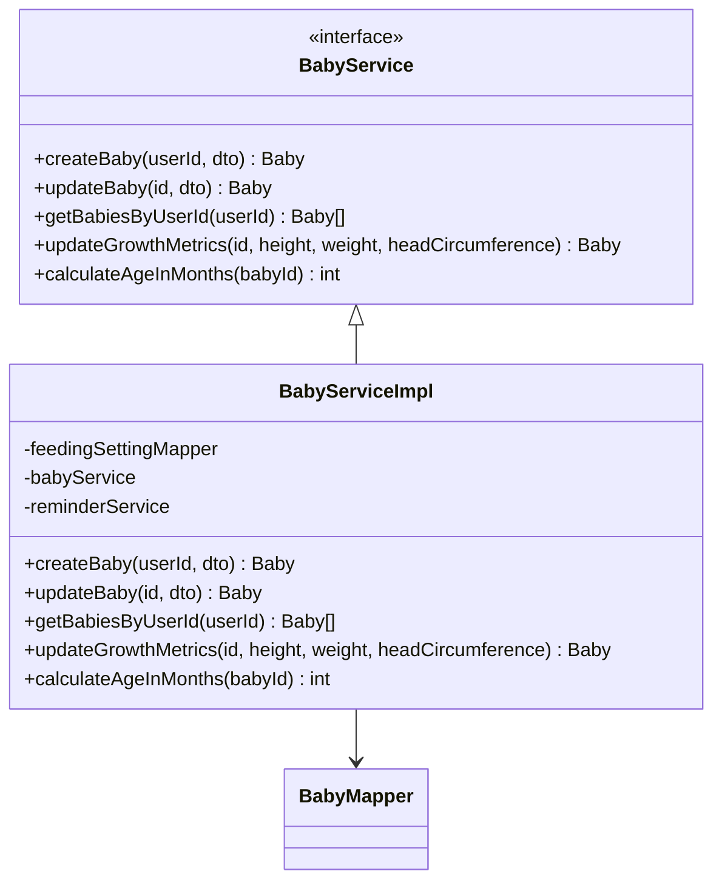
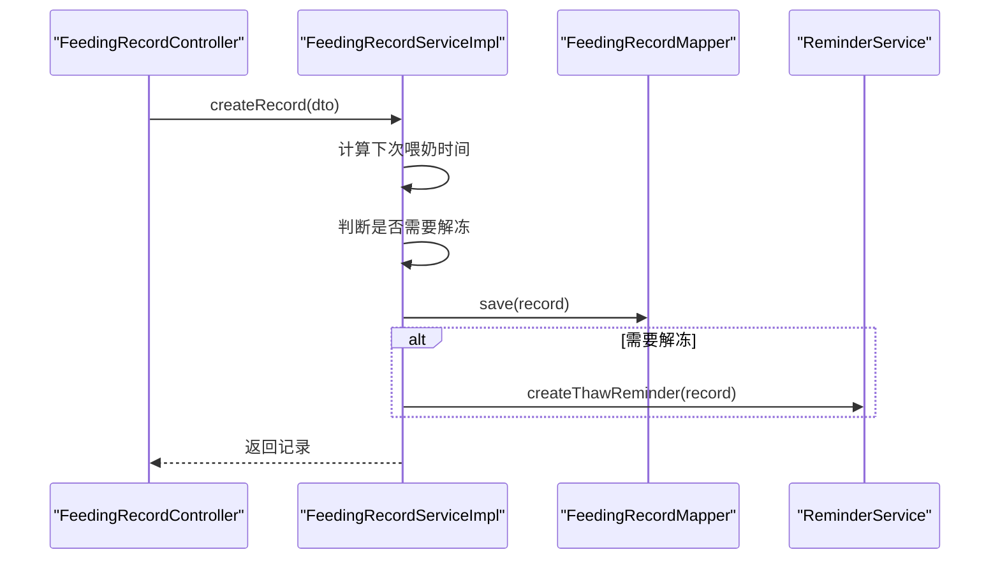
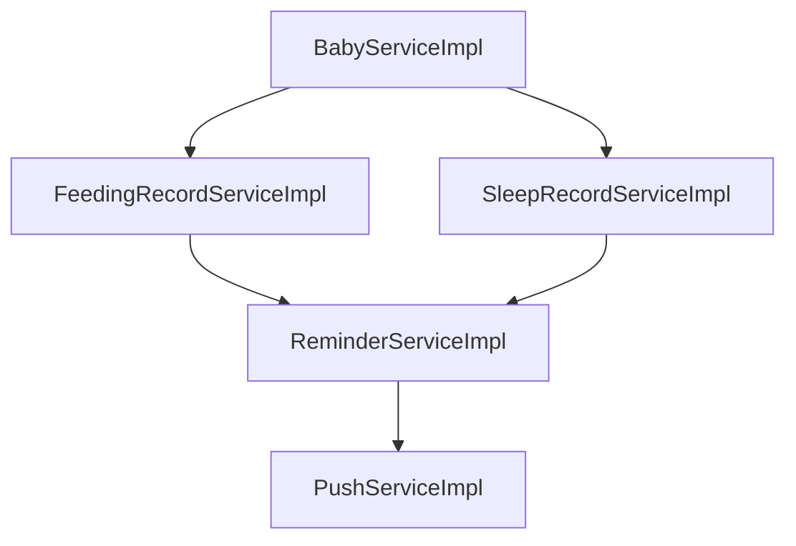

# 服务层架构

<cite>
**Referenced Files in This Document**   
- [BabyService.java](file://backend/src/main/java/com/baby/service/BabyService.java)
- [BabyServiceImpl.java](file://backend/src/main/java/com/baby/service/impl/BabyServiceImpl.java)
- [FeedingRecordService.java](file://backend/src/main/java/com/baby/service/FeedingRecordService.java)
- [FeedingRecordServiceImpl.java](file://backend/src/main/java/com/baby/service/impl/FeedingRecordServiceImpl.java)
- [SleepRecordService.java](file://backend/src/main/java/com/baby/service/SleepRecordService.java)
- [SleepRecordServiceImpl.java](file://backend/src/main/java/com/baby/service/impl/SleepRecordServiceImpl.java)
- [ReminderService.java](file://backend/src/main/java/com/baby/service/ReminderService.java)
- [ReminderServiceImpl.java](file://backend/src/main/java/com/baby/service/impl/ReminderServiceImpl.java)
- [PushService.java](file://backend/src/main/java/com/baby/service/PushService.java)
- [PushServiceImpl.java](file://backend/src/main/java/com/baby/service/impl/PushServiceImpl.java)
</cite>

## Table of Contents
1. [Introduction](#introduction)
2. [Project Structure](#project-structure)
3. [Core Components](#core-components)
4. [Architecture Overview](#architecture-overview)
5. [Detailed Component Analysis](#detailed-component-analysis)
6. [Dependency Analysis](#dependency-analysis)
7. [Performance Considerations](#performance-considerations)
8. [Troubleshooting Guide](#troubleshooting-guide)
9. [Conclusion](#conclusion)

## Introduction
本文档详细阐述了Spring Boot后端服务层的实现机制，重点分析业务逻辑在服务接口及其具体实现中的组织方式。文档涵盖依赖注入模式、基于@Transactional的事务管理、与Mapper层的交互机制，并深入解析BabyService、FeedingRecordService、SleepRecordService、ReminderService和PushService等核心服务的实现细节。通过具体代码示例，说明服务如何协调多项操作、处理边界情况并维护数据一致性。

## Project Structure
项目后端采用典型的分层架构，服务层（`service`）位于`com.baby.service`包下，分为接口定义（`service`）和实现（`service/impl`）两个子包。该层作为控制器（Controller）与数据访问层（Mapper）之间的桥梁，封装了所有核心业务逻辑。



**Diagram sources**
- [BabyService.java](file://backend/src/main/java/com/baby/service/BabyService.java)
- [BabyServiceImpl.java](file://backend/src/main/java/com/baby/service/impl/BabyServiceImpl.java)

**Section sources**
- [BabyService.java](file://backend/src/main/java/com/baby/service/BabyService.java)
- [BabyServiceImpl.java](file://backend/src/main/java/com/baby/service/impl/BabyServiceImpl.java)

## Core Components
服务层的核心组件包括`BabyService`用于管理宝宝档案，`FeedingRecordService`处理喂养记录的计算与验证，`SleepRecordService`评估睡眠质量，`ReminderService`负责调度提醒逻辑，以及`PushService`用于APNs通知推送。这些服务均遵循接口-实现分离的设计模式，以提高可测试性和可维护性。

**Section sources**
- [BabyService.java](file://backend/src/main/java/com/baby/service/BabyService.java)
- [FeedingRecordService.java](file://backend/src/main/java/com/baby/service/FeedingRecordService.java)
- [SleepRecordService.java](file://backend/src/main/java/com/baby/service/SleepRecordService.java)
- [ReminderService.java](file://backend/src/main/java/com/baby/service/ReminderService.java)
- [PushService.java](file://backend/src/main/java/com/baby/service/PushService.java)

## Architecture Overview
服务层采用Spring的`@Service`注解进行组件声明，利用`@RequiredArgsConstructor`实现基于构造函数的依赖注入，确保了依赖关系的不可变性和完整性。事务管理通过`@Transactional`注解在服务方法级别进行声明，保证了数据操作的原子性。

```mermaid
classDiagram
class BabyService {
+createBaby(userId, dto) Baby
+updateBaby(id, dto) Baby
+getBabiesByUserId(userId) Baby[]
+updateGrowthMetrics(id, height, weight, headCircumference) Baby
+calculateAgeInMonths(babyId) int
}
class FeedingRecordService {
+createRecord(dto) FeedingRecord
+updateRecord(id, dto) FeedingRecord
+getTodayRecords(babyId) FeedingRecord[]
+getRecordsByDateRange(babyId, startDate, endDate) FeedingRecord[]
+getLastRecord(babyId) FeedingRecord
+getStatistics(babyId, startDate, endDate) FeedingStatisticsVO
+calculateNextFeedingTime(babyId, currentFeedingTime) LocalDateTime
+getRecommendedAmount(ageInMonths) int
+getRecommendedInterval(ageInMonths) int
}
class SleepRecordService {
+createRecord(dto) SleepRecord
+updateRecord(id, dto) SleepRecord
+startNap(babyId, startTime) SleepRecord
+endNap(id, endTime, quality) SleepRecord
+getTodayRecords(babyId) SleepRecord[]
+getRecordsByDateRange(babyId, startDate, endDate) SleepRecord[]
+getLastRecord(babyId) SleepRecord
+getStatistics(babyId, startDate, endDate) SleepStatisticsVO
+calculateNextNapTime(babyId, wakeUpTime) LocalDateTime
+getRecommendedNapDuration(ageInMonths) int
+getRecommendedAwakeInterval(ageInMonths) int
}
class ReminderService {
+createFeedingReminder(feedingRecord) Reminder
+createThawReminder(feedingRecord) Reminder
+createNapReminder(sleepRecord) Reminder
+createSoothingReminder(sleepRecord) Reminder
+getTodayReminders(userId) Reminder[]
+getUpcomingReminders(babyId) Reminder[]
+getPendingReminders() Reminder[]
+sendReminder(reminder) void
+cancelReminder(id) void
+cancelRemindersByRelatedRecord(relatedRecordId, reminderType) void
}
class PushService {
+sendPush(deviceToken, title, content) void
+sendSilentPush(deviceToken, payload) void
}
BabyService <|-- BabyServiceImpl
FeedingRecordService <|-- FeedingRecordServiceImpl
SleepRecordService <|-- SleepRecordServiceImpl
ReminderService <|-- ReminderServiceImpl
PushService <|-- PushServiceImpl
FeedingRecordServiceImpl --> FeedingSettingMapper
FeedingRecordServiceImpl --> BabyService
FeedingRecordServiceImpl --> ReminderService
SleepRecordServiceImpl --> SleepSettingMapper
SleepRecordServiceImpl --> BabyService
SleepRecordServiceImpl --> ReminderService
ReminderServiceImpl --> ReminderMapper
ReminderServiceImpl --> BabyMapper
ReminderServiceImpl --> UserMapper
ReminderServiceImpl --> PushService
PushServiceImpl --> "apnsClient"
```

**Diagram sources**
- [BabyService.java](file://backend/src/main/java/com/baby/service/BabyService.java)
- [BabyServiceImpl.java](file://backend/src/main/java/com/baby/service/impl/BabyServiceImpl.java)
- [FeedingRecordService.java](file://backend/src/main/java/com/baby/service/FeedingRecordService.java)
- [FeedingRecordServiceImpl.java](file://backend/src/main/java/com/baby/service/impl/FeedingRecordServiceImpl.java)
- [SleepRecordService.java](file://backend/src/main/java/com/baby/service/SleepRecordService.java)
- [SleepRecordServiceImpl.java](file://backend/src/main/java/com/baby/service/impl/SleepRecordServiceImpl.java)
- [ReminderService.java](file://backend/src/main/java/com/baby/service/ReminderService.java)
- [ReminderServiceImpl.java](file://backend/src/main/java/com/baby/service/impl/ReminderServiceImpl.java)
- [PushService.java](file://backend/src/main/java/com/baby/service/PushService.java)
- [PushServiceImpl.java](file://backend/src/main/java/com/baby/service/impl/PushServiceImpl.java)

## Detailed Component Analysis

### BabyService Analysis
`BabyService`负责宝宝档案的管理，其核心功能包括创建、更新宝宝信息，获取用户下的所有宝宝，以及更新生长指标。`calculateAgeInMonths`方法根据宝宝的出生日期计算其月龄，为其他服务提供基础数据支持。

#### For Object-Oriented Components:


**Diagram sources**
- [BabyService.java](file://backend/src/main/java/com/baby/service/BabyService.java)
- [BabyServiceImpl.java](file://backend/src/main/java/com/baby/service/impl/BabyServiceImpl.java)

**Section sources**
- [BabyService.java](file://backend/src/main/java/com/baby/service/BabyService.java)
- [BabyServiceImpl.java](file://backend/src/main/java/com/baby/service/impl/BabyServiceImpl.java)

### FeedingRecordService Analysis
`FeedingRecordService`是业务逻辑最复杂的组件之一。它不仅管理喂养记录的增删改查，还集成了喂养指南（基于国家卫健委标准），能够根据宝宝月龄推荐奶量和喂养间隔。`createRecord`方法在创建新记录时，会自动计算下次喂奶时间，并根据母乳来源判断是否需要创建解冻提醒，体现了服务层协调多个操作的能力。

#### For API/Service Components:


**Diagram sources**
- [FeedingRecordService.java](file://backend/src/main/java/com/baby/service/FeedingRecordService.java)
- [FeedingRecordServiceImpl.java](file://backend/src/main/java/com/baby/service/impl/FeedingRecordServiceImpl.java)

**Section sources**
- [FeedingRecordService.java](file://backend/src/main/java/com/baby/service/FeedingRecordService.java)
- [FeedingRecordServiceImpl.java](file://backend/src/main/java/com/baby/service/impl/FeedingRecordServiceImpl.java)

### SleepRecordService Analysis
`SleepRecordService`与`FeedingRecordService`类似，也遵循国家卫健委的睡眠指南。它提供了开始和结束小睡的专用方法（`startNap`和`endNap`），并在结束小睡时自动计算下次小睡时间并创建相应的提醒，确保了业务流程的连贯性。

**Section sources**
- [SleepRecordService.java](file://backend/src/main/java/com/baby/service/SleepRecordService.java)
- [SleepRecordServiceImpl.java](file://backend/src/main/java/com/baby/service/impl/SleepRecordServiceImpl.java)

### ReminderService Analysis
`ReminderService`是调度逻辑的核心。它通过`@Scheduled`注解的`processReminders`方法，每分钟检查待发送的提醒，并调用`PushService`进行推送。该服务还实现了提醒的创建、取消和状态更新，确保了提醒系统的可靠运行。

**Section sources**
- [ReminderService.java](file://backend/src/main/java/com/baby/service/ReminderService.java)
- [ReminderServiceImpl.java](file://backend/src/main/java/com/baby/service/impl/ReminderServiceImpl.java)

### PushService Analysis
`PushService`封装了与APNs的交互。`PushServiceImpl`通过配置项`apns.enabled`控制推送功能的开关，便于在开发和测试环境中进行模拟。该服务负责发送通知和静默推送，是后端与移动客户端通信的关键。

**Section sources**
- [PushService.java](file://backend/src/main/java/com/baby/service/PushService.java)
- [PushServiceImpl.java](file://backend/src/main/java/com/baby/service/impl/PushServiceImpl.java)

## Dependency Analysis
服务层组件之间存在明确的依赖关系。`FeedingRecordServiceImpl`和`SleepRecordServiceImpl`依赖`BabyService`来获取宝宝信息和月龄。`ReminderServiceImpl`依赖`PushService`来执行实际的推送操作。这种依赖注入模式使得各服务职责单一，易于单元测试。



**Diagram sources**
- [BabyServiceImpl.java](file://backend/src/main/java/com/baby/service/impl/BabyServiceImpl.java)
- [FeedingRecordServiceImpl.java](file://backend/src/main/java/com/baby/service/impl/FeedingRecordServiceImpl.java)
- [SleepRecordServiceImpl.java](file://backend/src/main/java/com/baby/service/impl/SleepRecordServiceImpl.java)
- [ReminderServiceImpl.java](file://backend/src/main/java/com/baby/service/impl/ReminderServiceImpl.java)
- [PushServiceImpl.java](file://backend/src/main/java/com/baby/service/impl/PushServiceImpl.java)

**Section sources**
- [BabyServiceImpl.java](file://backend/src/main/java/com/baby/service/impl/BabyServiceImpl.java)
- [FeedingRecordServiceImpl.java](file://backend/src/main/java/com/baby/service/impl/FeedingRecordServiceImpl.java)
- [SleepRecordServiceImpl.java](file://backend/src/main/java/com/baby/service/impl/SleepRecordServiceImpl.java)
- [ReminderServiceImpl.java](file://backend/src/main/java/com/baby/service/impl/ReminderServiceImpl.java)
- [PushServiceImpl.java](file://backend/src/main/java/com/baby/service/impl/PushServiceImpl.java)

## Performance Considerations
服务层通过MyBatis-Plus的`LambdaQueryWrapper`构建高效查询，避免了N+1查询问题。对于复杂的统计需求，如`getStatistics`，服务层会调用Mapper中的自定义SQL进行聚合计算，以减轻内存压力。定时任务`processReminders`每分钟执行一次，对性能影响较小。

## Troubleshooting Guide
当遇到服务层问题时，应首先检查日志输出。`ReminderServiceImpl`和`PushServiceImpl`均使用了`@Slf4j`注解，记录了关键的操作和错误信息。例如，推送失败时会记录异常堆栈，便于排查网络或配置问题。此外，应确保`@Transactional`注解的方法没有被同一类中的其他方法直接调用，否则事务可能不会生效。

**Section sources**
- [ReminderServiceImpl.java](file://backend/src/main/java/com/baby/service/impl/ReminderServiceImpl.java)
- [PushServiceImpl.java](file://backend/src/main/java/com/baby/service/impl/PushServiceImpl.java)

## Conclusion
本文档全面分析了Spring Boot后端服务层的架构与实现。服务层通过清晰的接口定义、合理的依赖注入和有效的事务管理，成功封装了复杂的业务逻辑。各服务组件协同工作，为上层控制器提供了稳定、可靠的业务功能，是整个应用的核心所在。