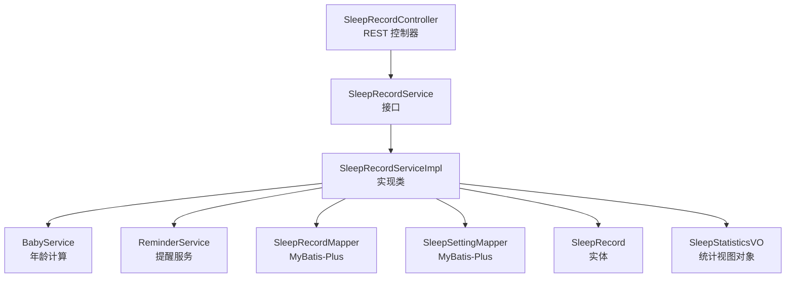
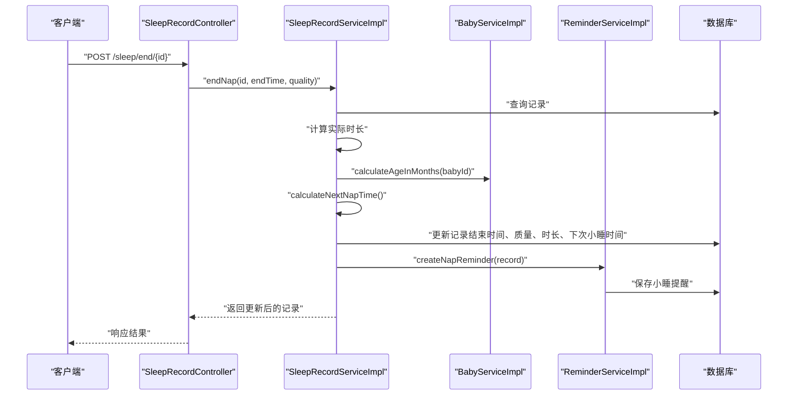
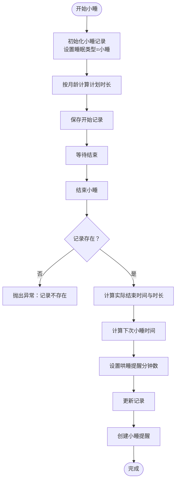
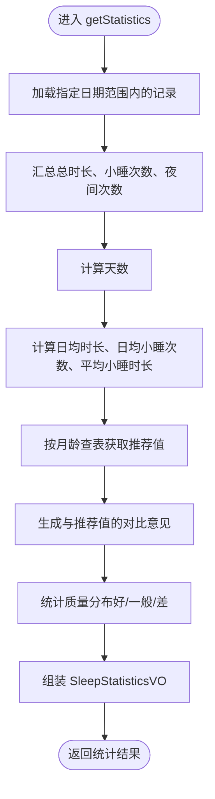
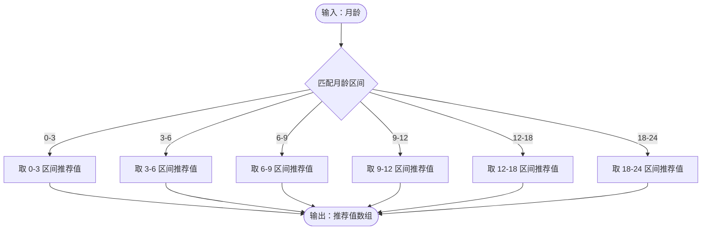
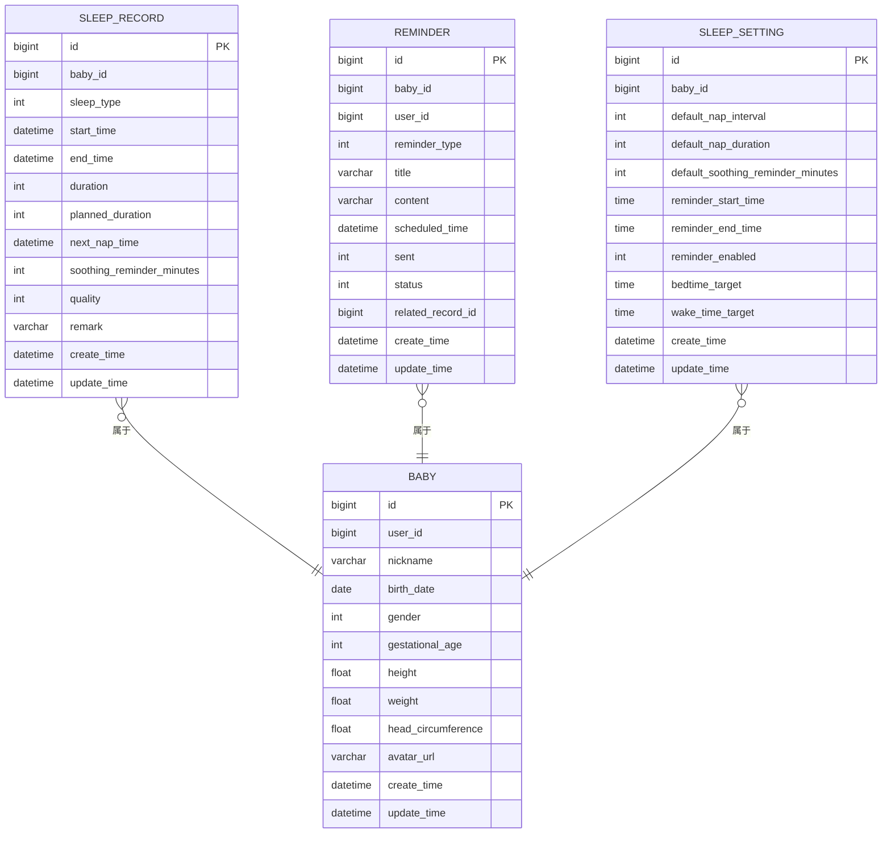
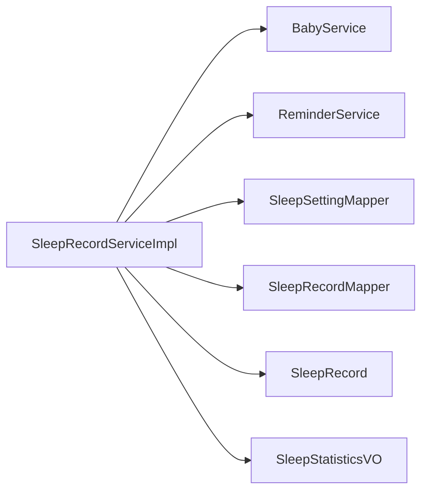

# 睡眠记录服务

<cite>
**本文引用的文件**
- [SleepRecordService.java](file://backend/src/main/java/com/baby/service/SleepRecordService.java)
- [SleepRecordServiceImpl.java](file://backend/src/main/java/com/baby/service/impl/SleepRecordServiceImpl.java)
- [SleepRecord.java](file://backend/src/main/java/com/baby/entity/SleepRecord.java)
- [SleepRecordDTO.java](file://backend/src/main/java/com/baby/dto/SleepRecordDTO.java)
- [SleepStatisticsVO.java](file://backend/src/main/java/com/baby/vo/SleepStatisticsVO.java)
- [BabyService.java](file://backend/src/main/java/com/baby/service/BabyService.java)
- [BabyServiceImpl.java](file://backend/src/main/java/com/baby/service/impl/BabyServiceImpl.java)
- [ReminderService.java](file://backend/src/main/java/com/baby/service/ReminderService.java)
- [ReminderServiceImpl.java](file://backend/src/main/java/com/baby/service/impl/ReminderServiceImpl.java)
- [SleepSetting.java](file://backend/src/main/java/com/baby/entity/SleepSetting.java)
- [SleepSettingMapper.java](file://backend/src/main/java/com/baby/mapper/SleepSettingMapper.java)
- [SleepRecordMapper.java](file://backend/src/main/java/com/baby/mapper/SleepRecordMapper.java)
- [SleepRecordController.java](file://backend/src/main/java/com/baby/controller/SleepRecordController.java)
</cite>

## 目录
1. [简介](#简介)
2. [项目结构](#项目结构)
3. [核心组件](#核心组件)
4. [架构总览](#架构总览)
5. [详细组件分析](#详细组件分析)
6. [依赖关系分析](#依赖关系分析)
7. [性能考虑](#性能考虑)
8. [故障排查指南](#故障排查指南)
9. [结论](#结论)
10. [附录](#附录)

## 简介
本文件围绕 Spring Boot 后端中的 SleepRecordService 组件进行系统化文档化说明。内容涵盖：
- 睡眠记录的创建、更新与查询
- 小睡流程（startNap、endNap）的业务逻辑与提醒集成
- 基于国家卫健委指南的推荐值计算（按月龄分组）
- 统计分析（总时长、日均、小睡次数、质量分布等）与 SleepStatisticsVO 的生成
- 与 BabyService 的年龄计算集成、与 ReminderService 的提醒联动
- 常见问题处理（不完整记录、质量评估边界）、以及时间序列数据查询的性能优化建议

## 项目结构
后端采用分层架构，SleepRecordService 位于 service 层，通过 MyBatis-Plus Mapper 访问数据库，Controller 提供 REST API。

图表来源
- [SleepRecordController.java](file://backend/src/main/java/com/baby/controller/SleepRecordController.java#L1-L139)
- [SleepRecordService.java](file://backend/src/main/java/com/baby/service/SleepRecordService.java#L1-L71)
- [SleepRecordServiceImpl.java](file://backend/src/main/java/com/baby/service/impl/SleepRecordServiceImpl.java#L1-L279)
- [SleepRecordMapper.java](file://backend/src/main/java/com/baby/mapper/SleepRecordMapper.java#L1-L48)
- [SleepSettingMapper.java](file://backend/src/main/java/com/baby/mapper/SleepSettingMapper.java#L1-L13)
- [SleepRecord.java](file://backend/src/main/java/com/baby/entity/SleepRecord.java#L1-L76)
- [SleepStatisticsVO.java](file://backend/src/main/java/com/baby/vo/SleepStatisticsVO.java#L1-L87)
- [BabyService.java](file://backend/src/main/java/com/baby/service/BabyService.java#L1-L38)
- [ReminderService.java](file://backend/src/main/java/com/baby/service/ReminderService.java#L1-L64)

章节来源
- [SleepRecordController.java](file://backend/src/main/java/com/baby/controller/SleepRecordController.java#L1-L139)
- [SleepRecordService.java](file://backend/src/main/java/com/baby/service/SleepRecordService.java#L1-L71)
- [SleepRecordServiceImpl.java](file://backend/src/main/java/com/baby/service/impl/SleepRecordServiceImpl.java#L1-L279)

## 核心组件
- 接口与实现
  - 接口：提供创建、更新、小睡流程、查询、统计、推荐值计算等方法契约
  - 实现：完成业务逻辑、调用外部服务、持久化与提醒创建
- 实体与 DTO/VO
  - 实体：存储睡眠记录字段（类型、起止时间、时长、计划时长、下次小睡时间、提醒分钟数、质量、备注等）
  - DTO：前端传入的创建/更新参数
  - VO：统计结果封装对象
- 集成服务
  - BabyService：根据出生日期计算月龄
  - ReminderService：创建小睡提醒与哄睡提醒
  - SleepSetting：读取用户自定义的睡眠偏好（如默认小睡间隔、哄睡提醒分钟数）

章节来源
- [SleepRecordService.java](file://backend/src/main/java/com/baby/service/SleepRecordService.java#L1-L71)
- [SleepRecordServiceImpl.java](file://backend/src/main/java/com/baby/service/impl/SleepRecordServiceImpl.java#L1-L279)
- [SleepRecord.java](file://backend/src/main/java/com/baby/entity/SleepRecord.java#L1-L76)
- [SleepRecordDTO.java](file://backend/src/main/java/com/baby/dto/SleepRecordDTO.java#L1-L47)
- [SleepStatisticsVO.java](file://backend/src/main/java/com/baby/vo/SleepStatisticsVO.java#L1-L87)
- [BabyService.java](file://backend/src/main/java/com/baby/service/BabyService.java#L1-L38)
- [ReminderService.java](file://backend/src/main/java/com/baby/service/ReminderService.java#L1-L64)
- [SleepSetting.java](file://backend/src/main/java/com/baby/entity/SleepSetting.java#L1-L72)

## 架构总览
以下序列图展示“结束小睡”流程，包括时长计算、下次小睡时间推算、提醒创建与推送。

图表来源
- [SleepRecordController.java](file://backend/src/main/java/com/baby/controller/SleepRecordController.java#L48-L65)
- [SleepRecordServiceImpl.java](file://backend/src/main/java/com/baby/service/impl/SleepRecordServiceImpl.java#L104-L134)
- [BabyServiceImpl.java](file://backend/src/main/java/com/baby/service/impl/BabyServiceImpl.java#L82-L90)
- [ReminderServiceImpl.java](file://backend/src/main/java/com/baby/service/impl/ReminderServiceImpl.java#L103-L134)

## 详细组件分析

### 1) 创建与更新睡眠记录
- createRecord
  - 将 DTO 映射为实体，计算时长（若起止时间均存在），设置计划时长（按月龄查表）
  - 若为小睡且已结束，计算下次小睡时间，并设置哄睡提醒分钟数；随后创建小睡提醒
- updateRecord
  - 支持在已有记录上补充结束时间、质量、备注；若起止时间均存在则重算时长

关键路径参考
- [createRecord](file://backend/src/main/java/com/baby/service/impl/SleepRecordServiceImpl.java#L49-L87)
- [updateRecord](file://backend/src/main/java/com/baby/service/impl/SleepRecordServiceImpl.java#L138-L157)

章节来源
- [SleepRecordServiceImpl.java](file://backend/src/main/java/com/baby/service/impl/SleepRecordServiceImpl.java#L49-L87)
- [SleepRecordServiceImpl.java](file://backend/src/main/java/com/baby/service/impl/SleepRecordServiceImpl.java#L138-L157)
- [SleepRecordDTO.java](file://backend/src/main/java/com/baby/dto/SleepRecordDTO.java#L1-L47)

### 2) 小睡流程：startNap 与 endNap
- startNap
  - 初始化一条小睡记录，设置睡眠类型为小睡；若未提供开始时间则使用当前时间；按月龄设置计划时长
- endNap
  - 根据记录是否存在进行校验；计算实际结束时间与实际时长；推导下次小睡时间；设置哄睡提醒分钟数；更新记录并创建小睡提醒

图表来源
- [SleepRecordServiceImpl.java](file://backend/src/main/java/com/baby/service/impl/SleepRecordServiceImpl.java#L91-L134)

章节来源
- [SleepRecordServiceImpl.java](file://backend/src/main/java/com/baby/service/impl/SleepRecordServiceImpl.java#L91-L134)

### 3) 查询与统计
- getTodayRecords / getRecordsByDateRange / getLastRecord
  - 基于 MyBatis-Plus 条件构造器进行过滤与排序
- getStatistics
  - 计算总时长、小睡次数、夜间次数、日均时长、日均小睡次数、平均小睡时长
  - 依据月龄从 SLEEP_GUIDE 中取推荐值，生成对比意见
  - 统计睡眠质量分布（好/一般/差）百分比

图表来源
- [SleepRecordServiceImpl.java](file://backend/src/main/java/com/baby/service/impl/SleepRecordServiceImpl.java#L187-L237)
- [SleepRecordMapper.java](file://backend/src/main/java/com/baby/mapper/SleepRecordMapper.java#L18-L47)

章节来源
- [SleepRecordServiceImpl.java](file://backend/src/main/java/com/baby/service/impl/SleepRecordServiceImpl.java#L160-L184)
- [SleepRecordServiceImpl.java](file://backend/src/main/java/com/baby/service/impl/SleepRecordServiceImpl.java#L187-L237)
- [SleepRecordMapper.java](file://backend/src/main/java/com/baby/mapper/SleepRecordMapper.java#L18-L47)
- [SleepStatisticsVO.java](file://backend/src/main/java/com/baby/vo/SleepStatisticsVO.java#L1-L87)

### 4) 推荐值与指南映射
- SLEEP_GUIDE
  - 以月龄区间为键，值为数组，包含：日均睡眠下限/上限（小时）、小睡次数下限/上限、清醒间隔（分钟）、小睡时长（分钟）
- getRecommendedNapDuration / getRecommendedAwakeInterval
  - 依据月龄查表取对应推荐值
- calculateNextNapTime
  - 基于上次醒来时间 + 推荐清醒间隔；若用户设置了自定义间隔，则优先使用用户设置

图表来源
- [SleepRecordServiceImpl.java](file://backend/src/main/java/com/baby/service/impl/SleepRecordServiceImpl.java#L240-L272)

章节来源
- [SleepRecordServiceImpl.java](file://backend/src/main/java/com/baby/service/impl/SleepRecordServiceImpl.java#L36-L45)
- [SleepRecordServiceImpl.java](file://backend/src/main/java/com/baby/service/impl/SleepRecordServiceImpl.java#L240-L272)

### 5) 与 BabyService 的年龄计算集成
- BabyServiceImpl.calculateAgeInMonths
  - 使用出生日期与当前日期计算月龄（年*12+月）
- 在创建/更新/小睡流程中，均会调用该方法以确定推荐值

章节来源
- [BabyServiceImpl.java](file://backend/src/main/java/com/baby/service/impl/BabyServiceImpl.java#L82-L90)
- [SleepRecordServiceImpl.java](file://backend/src/main/java/com/baby/service/impl/SleepRecordServiceImpl.java#L65-L66)
- [SleepRecordServiceImpl.java](file://backend/src/main/java/com/baby/service/impl/SleepRecordServiceImpl.java#L97-L98)
- [SleepRecordServiceImpl.java](file://backend/src/main/java/com/baby/service/impl/SleepRecordServiceImpl.java#L120-L121)

### 6) 与 ReminderService 的提醒集成
- 小睡提醒
  - 当记录存在“下次小睡时间”时，创建类型为“小睡提醒”的提醒项
- 哄睡提醒
  - 当记录存在“哄睡提醒分钟数”时，创建类型为“哄睡提醒”的提醒项
- 提醒内容包含建议睡眠时长、宝宝昵称等信息

章节来源
- [SleepRecordServiceImpl.java](file://backend/src/main/java/com/baby/service/impl/SleepRecordServiceImpl.java#L73-L84)
- [SleepRecordServiceImpl.java](file://backend/src/main/java/com/baby/service/impl/SleepRecordServiceImpl.java#L129-L133)
- [ReminderServiceImpl.java](file://backend/src/main/java/com/baby/service/impl/ReminderServiceImpl.java#L103-L134)
- [ReminderServiceImpl.java](file://backend/src/main/java/com/baby/service/impl/ReminderServiceImpl.java#L136-L164)

### 7) 数据模型与字段说明

图表来源
- [SleepRecord.java](file://backend/src/main/java/com/baby/entity/SleepRecord.java#L1-L76)
- [SleepSetting.java](file://backend/src/main/java/com/baby/entity/SleepSetting.java#L1-L72)
- [ReminderServiceImpl.java](file://backend/src/main/java/com/baby/service/impl/ReminderServiceImpl.java#L103-L164)
- [BabyServiceImpl.java](file://backend/src/main/java/com/baby/service/impl/BabyServiceImpl.java#L1-L91)

## 依赖关系分析
- 内部耦合
  - SleepRecordServiceImpl 依赖 BabyService（年龄）、ReminderService（提醒）、SleepSettingMapper（用户偏好）
- 外部依赖
  - MyBatis-Plus Mapper 用于数据访问
  - 控制器层通过 REST API 暴露功能

图表来源
- [SleepRecordServiceImpl.java](file://backend/src/main/java/com/baby/service/impl/SleepRecordServiceImpl.java#L1-L279)
- [SleepRecordMapper.java](file://backend/src/main/java/com/baby/mapper/SleepRecordMapper.java#L1-L48)
- [SleepSettingMapper.java](file://backend/src/main/java/com/baby/mapper/SleepSettingMapper.java#L1-L13)

章节来源
- [SleepRecordServiceImpl.java](file://backend/src/main/java/com/baby/service/impl/SleepRecordServiceImpl.java#L1-L279)

## 性能考虑
- 时间序列查询
  - getTodayRecords/getRecordsByDateRange 使用 between 过滤，建议在 start_time 字段建立索引以提升范围查询性能
- 统计聚合
  - getStatistics 对记录进行流式聚合，复杂度 O(n)；若历史数据量大，建议：
    - 分页或分批处理
    - 引入物化视图或缓存每日聚合结果
- 提醒调度
  - ReminderServiceImpl 使用定时任务扫描待发送提醒，建议：
    - 仅扫描未来一段时间内的提醒
    - 使用队列或延迟队列降低瞬时压力
- 事务与一致性
  - 小睡开始/结束涉及多步写入与提醒创建，建议：
    - 使用单事务包裹，保证原子性
    - 对关键字段（如 next_nap_time、soothing_reminder_minutes）进行幂等保护

[本节为通用性能建议，不直接分析具体代码文件]

## 故障排查指南
- 记录不存在
  - endNap/updateRecord 在找不到记录时抛出异常；应确保传入的 id 正确
  - 参考路径：[endNap](file://backend/src/main/java/com/baby/service/impl/SleepRecordServiceImpl.java#L106-L114)，[updateRecord](file://backend/src/main/java/com/baby/service/impl/SleepRecordServiceImpl.java#L138-L142)
- 不完整记录
  - 若缺少结束时间或起止时间不完整，将无法计算时长；建议在前端或控制器层补齐
  - 参考路径：[createRecord 时长计算](file://backend/src/main/java/com/baby/service/impl/SleepRecordServiceImpl.java#L58-L62)，[updateRecord 时长计算](file://backend/src/main/java/com/baby/service/impl/SleepRecordServiceImpl.java#L150-L153)
- 质量评估边界
  - 质量分布基于 1/2/3 三档；若记录质量为空，统计时不计入；建议统一质量枚举与校验
  - 参考路径：[质量分布统计](file://backend/src/main/java/com/baby/service/impl/SleepRecordServiceImpl.java#L223-L234)
- 提醒未创建
  - 若没有下次小睡时间或哄睡提醒分钟数为空，不会创建提醒；需检查月龄与用户设置
  - 参考路径：[创建小睡提醒](file://backend/src/main/java/com/baby/service/impl/SleepRecordServiceImpl.java#L73-L84)，[创建哄睡提醒](file://backend/src/main/java/com/baby/service/impl/ReminderServiceImpl.java#L136-L164)

章节来源
- [SleepRecordServiceImpl.java](file://backend/src/main/java/com/baby/service/impl/SleepRecordServiceImpl.java#L106-L114)
- [SleepRecordServiceImpl.java](file://backend/src/main/java/com/baby/service/impl/SleepRecordServiceImpl.java#L138-L142)
- [SleepRecordServiceImpl.java](file://backend/src/main/java/com/baby/service/impl/SleepRecordServiceImpl.java#L223-L234)
- [ReminderServiceImpl.java](file://backend/src/main/java/com/baby/service/impl/ReminderServiceImpl.java#L136-L164)

## 结论
SleepRecordService 通过清晰的接口与实现，提供了完整的睡眠记录生命周期管理能力，覆盖创建、更新、小睡流程、查询与统计，并与 BabyService、ReminderService 协作实现基于国家指南的推荐值与智能提醒。针对大规模时间序列数据，建议完善索引、缓存与分页策略，以保障性能与稳定性。

[本节为总结性内容，不直接分析具体代码文件]

## 附录

### A. API 一览（来自控制器）
- 创建/添加记录：POST /sleep
- 手动添加记录：POST /sleep/add
- 开始小睡：POST /sleep/start/{babyId}
- 结束小睡：POST /sleep/end/{id}
- 更新记录：PUT /sleep/{id}
- 获取记录详情：GET /sleep/{id}
- 今日记录：GET /sleep/today/{babyId}
- 指定日期范围记录：GET /sleep/range/{babyId}?startDate&endDate
- 最近一次记录：GET /sleep/last/{babyId}
- 睡眠统计：GET /sleep/statistics/{babyId}?startDate&endDate
- 睡眠建议（基于指南）：GET /sleep/recommendation/{babyId}

章节来源
- [SleepRecordController.java](file://backend/src/main/java/com/baby/controller/SleepRecordController.java#L34-L130)

### B. 业务规则与字段对照
- 睡眠类型：1-小睡，2-夜间睡眠
- 睡眠质量：1-好，2-一般，3-差
- 推荐值来源：国家卫健委《0岁～5岁儿童睡眠卫生指南》
- 关键字段：start_time、end_time、duration、planned_duration、next_nap_time、soothing_reminder_minutes、quality、remark

章节来源
- [SleepRecord.java](file://backend/src/main/java/com/baby/entity/SleepRecord.java#L1-L76)
- [SleepRecordServiceImpl.java](file://backend/src/main/java/com/baby/service/impl/SleepRecordServiceImpl.java#L36-L45)