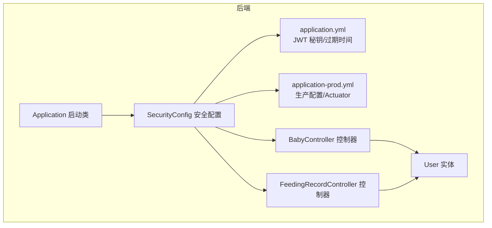
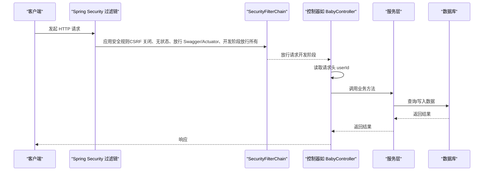
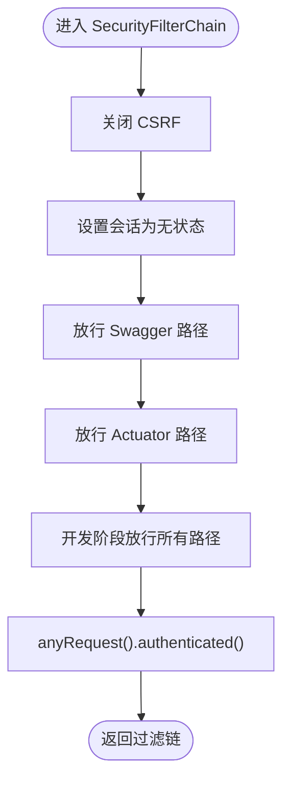
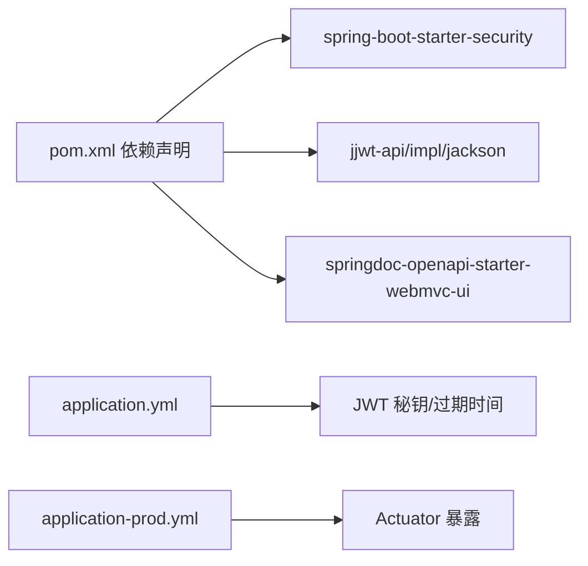

# 认证与授权

<cite>
**本文引用的文件**
- [SecurityConfig.java](file://backend/src/main/java/com/baby/config/SecurityConfig.java)
- [Application.java](file://backend/src/main/java/com/baby/Application.java)
- [User.java](file://backend/src/main/java/com/baby/entity/User.java)
- [BabyController.java](file://backend/src/main/java/com/baby/controller/BabyController.java)
- [FeedingRecordController.java](file://backend/src/main/java/com/baby/controller/FeedingRecordController.java)
- [application.yml](file://backend/src/main/resources/application.yml)
- [application-prod.yml](file://backend/src/main/resources/application-prod.yml)
- [pom.xml](file://backend/pom.xml)
- [.env.example](file://.env.example)
</cite>

## 目录
1. [简介](#简介)
2. [项目结构](#项目结构)
3. [核心组件](#核心组件)
4. [架构总览](#架构总览)
5. [详细组件分析](#详细组件分析)
6. [依赖关系分析](#依赖关系分析)
7. [性能考虑](#性能考虑)
8. [故障排查指南](#故障排查指南)
9. [结论](#结论)
10. [附录](#附录)

## 简介
本文件围绕后端安全配置进行系统化说明，重点覆盖以下内容：
- 当前 Spring Security 的配置要点：CSRF 关闭、无状态会话（JWT）、请求授权规则。
- SecurityFilterChain Bean 的定义与行为。
- 密码编码器使用 BCryptPasswordEncoder。
- 当前开发阶段的“全部放行”策略及其风险与迁移建议。
- 生产环境落地 JWT 认证与授权的实施路径：令牌签发与校验、用户角色与权限控制、端点保护策略、常见安全问题与缓解措施。
- 具体端点的保护示例与最佳实践。

## 项目结构
后端采用 Spring Boot 3 + Spring Security + MyBatis Plus 架构。安全配置集中在配置类中，应用入口负责启动，业务控制器通过请求头注入用户上下文，配置文件提供 JWT 秘钥与过期时间等参数。

图表来源
- [Application.java](file://backend/src/main/java/com/baby/Application.java#L1-L17)
- [SecurityConfig.java](file://backend/src/main/java/com/baby/config/SecurityConfig.java#L1-L42)
- [application.yml](file://backend/src/main/resources/application.yml#L1-L98)
- [application-prod.yml](file://backend/src/main/resources/application-prod.yml#L1-L85)
- [BabyController.java](file://backend/src/main/java/com/baby/controller/BabyController.java#L1-L80)
- [FeedingRecordController.java](file://backend/src/main/java/com/baby/controller/FeedingRecordController.java#L1-L112)
- [User.java](file://backend/src/main/java/com/baby/entity/User.java#L1-L71)

章节来源
- [Application.java](file://backend/src/main/java/com/baby/Application.java#L1-L17)
- [SecurityConfig.java](file://backend/src/main/java/com/baby/config/SecurityConfig.java#L1-L42)
- [application.yml](file://backend/src/main/resources/application.yml#L1-L98)
- [application-prod.yml](file://backend/src/main/resources/application-prod.yml#L1-L85)
- [BabyController.java](file://backend/src/main/java/com/baby/controller/BabyController.java#L1-L80)
- [FeedingRecordController.java](file://backend/src/main/java/com/baby/controller/FeedingRecordController.java#L1-L112)
- [User.java](file://backend/src/main/java/com/baby/entity/User.java#L1-L71)

## 核心组件
- 安全配置类 SecurityConfig
  - 提供 PasswordEncoder Bean（BCryptPasswordEncoder）。
  - 定义 SecurityFilterChain Bean，关闭 CSRF，设置 SessionCreationPolicy.STATELESS，对 Swagger/Actuator 放行，并在开发阶段对所有路径放行。
- 应用入口 Application
  - 启动 Spring Boot 应用并启用定时任务能力。
- 配置文件
  - application.yml：定义 JWT 秘钥与过期时间，以及 OpenAPI 文档路径。
  - application-prod.yml：生产环境配置，包含 Actuator 暴露与日志输出位置。
- 实体 User
  - 包含用户名、密码、手机号、邮箱、昵称、头像、Apple 登录标识、设备 Token、状态、逻辑删除字段等。
- 控制器
  - 多个控制器通过请求头注入 userId，体现当前实现以“请求头注入用户上下文”的方式传递用户身份。

章节来源
- [SecurityConfig.java](file://backend/src/main/java/com/baby/config/SecurityConfig.java#L1-L42)
- [Application.java](file://backend/src/main/java/com/baby/Application.java#L1-L17)
- [application.yml](file://backend/src/main/resources/application.yml#L1-L98)
- [application-prod.yml](file://backend/src/main/resources/application-prod.yml#L1-L85)
- [User.java](file://backend/src/main/java/com/baby/entity/User.java#L1-L71)
- [BabyController.java](file://backend/src/main/java/com/baby/controller/BabyController.java#L1-L80)
- [FeedingRecordController.java](file://backend/src/main/java/com/baby/controller/FeedingRecordController.java#L1-L112)

## 架构总览
下图展示从客户端到控制器的典型调用链，以及当前安全层的拦截策略（开发阶段全部放行）：

图表来源
- [SecurityConfig.java](file://backend/src/main/java/com/baby/config/SecurityConfig.java#L25-L41)
- [BabyController.java](file://backend/src/main/java/com/baby/controller/BabyController.java#L26-L32)
- [FeedingRecordController.java](file://backend/src/main/java/com/baby/controller/FeedingRecordController.java#L33-L40)

## 详细组件分析

### 安全配置类 SecurityConfig 分析
- 密码编码器
  - 使用 BCryptPasswordEncoder，用于注册与登录时的密码校验。
- 安全过滤链
  - CSRF 关闭：适用于前后端分离场景，避免不必要的 Cookie 交互。
  - 会话策略：STATELESS，结合 JWT 使用，不依赖 Session。
  - 授权规则：
    - Swagger/Actuator 路径放行，便于开发与运维。
    - 开发阶段对 /** 放行，便于联调。
    - anyRequest().authenticated() 在当前配置下不会生效（因为已放行所有），仅当移除放行规则时才生效。
- 依赖与外部配置
  - JWT 秘钥与过期时间来源于 application.yml；生产环境来自 application-prod.yml。

图表来源
- [SecurityConfig.java](file://backend/src/main/java/com/baby/config/SecurityConfig.java#L25-L41)

章节来源
- [SecurityConfig.java](file://backend/src/main/java/com/baby/config/SecurityConfig.java#L1-L42)

### 密码编码器与用户实体
- 密码编码器
  - 通过 Bean 暴露 BCryptPasswordEncoder，用于注册时加密与登录时比对。
- 用户实体
  - 字段包含用户名、密码、手机号、邮箱、昵称、头像、Apple 登录标识、设备 Token、状态、逻辑删除等，满足基础认证与用户管理需求。

章节来源
- [SecurityConfig.java](file://backend/src/main/java/com/baby/config/SecurityConfig.java#L20-L23)
- [User.java](file://backend/src/main/java/com/baby/entity/User.java#L1-L71)

### 控制器中的用户上下文注入
- 控制器通过请求头注入 userId，体现当前实现以“请求头注入用户上下文”的方式传递用户身份。
- 示例：BabyController 在创建/查询/更新/删除等接口中读取 userId，作为业务操作的用户标识。

章节来源
- [BabyController.java](file://backend/src/main/java/com/baby/controller/BabyController.java#L26-L32)
- [BabyController.java](file://backend/src/main/java/com/baby/controller/BabyController.java#L49-L54)

### 配置文件中的 JWT 参数
- application.yml
  - jwt.secret：JWT 签名秘钥。
  - jwt.expiration：令牌过期时间（毫秒）。
  - springdoc.swagger-ui/api-docs：OpenAPI 文档路径。
- application-prod.yml
  - 生产环境暴露 Actuator 的 health/info/metrics 端点，日志输出至文件。

章节来源
- [application.yml](file://backend/src/main/resources/application.yml#L36-L40)
- [application.yml](file://backend/src/main/resources/application.yml#L93-L98)
- [application-prod.yml](file://backend/src/main/resources/application-prod.yml#L70-L85)

## 依赖关系分析
- Maven 依赖
  - spring-boot-starter-security：提供 Spring Security 能力。
  - jjwt-api/impl/jackson：提供 JWT 生成与解析能力。
  - springdoc-openapi-starter-webmvc-ui：提供 OpenAPI 文档能力。
- 运行时配置
  - application.yml 与 application-prod.yml 提供运行时参数（JWT、Actuator、日志等）。

图表来源
- [pom.xml](file://backend/pom.xml#L27-L77)
- [application.yml](file://backend/src/main/resources/application.yml#L36-L40)
- [application-prod.yml](file://backend/src/main/resources/application-prod.yml#L70-L85)

章节来源
- [pom.xml](file://backend/pom.xml#L27-L77)
- [application.yml](file://backend/src/main/resources/application.yml#L36-L40)
- [application-prod.yml](file://backend/src/main/resources/application-prod.yml#L70-L85)

## 性能考虑
- 无状态会话（STATELESS）减少服务器端会话存储开销，适合分布式部署。
- JWT 解析与校验在每次请求都会发生，建议：
  - 合理设置过期时间，避免频繁刷新。
  - 对高频端点进行缓存与限流，降低鉴权压力。
  - 使用强秘钥与合适的算法，确保签名验证性能与安全性平衡。

## 故障排查指南
- 开发阶段全部放行导致的安全风险
  - 现状：开发阶段对 /** 放行，未强制认证。
  - 影响：生产环境直接沿用该配置将导致所有接口无需认证。
  - 建议：移除放行规则，改为精确授权。
- Swagger/Actuator 放行
  - Swagger/Actuator 在开发阶段放行是合理的，但在生产环境需限制访问或仅内网可用。
- 密码编码与校验
  - 注册时使用 BCryptPasswordEncoder 加密存储；登录时进行匹配校验。
- JWT 配置
  - 确认 application.yml 或环境变量中的 jwt.secret 与 jwt.expiration 设置正确。
  - 生产环境建议通过环境变量注入，避免硬编码。

章节来源
- [SecurityConfig.java](file://backend/src/main/java/com/baby/config/SecurityConfig.java#L25-L41)
- [application.yml](file://backend/src/main/resources/application.yml#L36-L40)
- [application-prod.yml](file://backend/src/main/resources/application-prod.yml#L70-L85)

## 结论
当前安全配置以“开发友好”为主，关闭 CSRF 并设置无状态会话，同时对 Swagger/Actuator 与所有路径放行，便于快速联调。但该策略不适合生产环境，必须迁移到基于 JWT 的认证与授权体系，明确端点访问控制、用户角色与权限划分，并完善令牌生命周期与安全防护。

## 附录

### 生产落地建议：JWT 认证与授权
- 令牌签发与校验
  - 登录成功后签发 JWT，包含用户标识与过期时间。
  - 请求携带 Authorization: Bearer <token>，后端解析并校验签名与有效期。
- 用户角色与权限
  - 在用户实体中增加角色/权限字段，或引入独立的角色/权限表。
  - 在过滤链中根据角色/权限决定放行或拒绝。
- 端点保护策略
  - 对需要认证的端点统一要求携带有效 JWT。
  - 对敏感操作（如删除、修改）按角色/权限细化控制。
- 常见安全问题与缓解
  - 令牌过期：短令牌+刷新令牌机制；刷新令牌单独存储与校验。
  - 传输安全：HTTPS 强制；令牌仅通过 HTTPS 传输。
  - 防重放：令牌加入一次性使用或时间窗口限制。
  - 风险审计：记录登录/登出、关键操作日志，异常行为告警。
- 端点保护示例（思路）
  - /api/baby/**：仅允许 authenticated 用户访问。
  - /api/baby/admin/**：仅管理员角色访问。
  - /api/baby/{userId}/**：仅本人或管理员访问。
  - /api/actuator/**：仅内网或特定 IP 访问。
  - /api/swagger-ui/** 与 /api/v3/api-docs/**：仅开发环境放行或内网放行。

章节来源
- [SecurityConfig.java](file://backend/src/main/java/com/baby/config/SecurityConfig.java#L25-L41)
- [User.java](file://backend/src/main/java/com/baby/entity/User.java#L1-L71)
- [application.yml](file://backend/src/main/resources/application.yml#L36-L40)
- [application-prod.yml](file://backend/src/main/resources/application-prod.yml#L70-L85)
- [.env.example](file://.env.example#L1-L12)