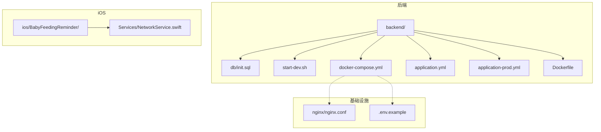
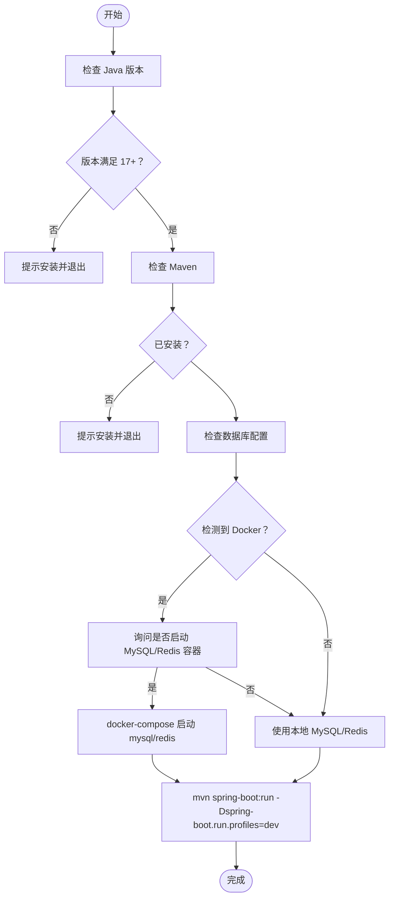
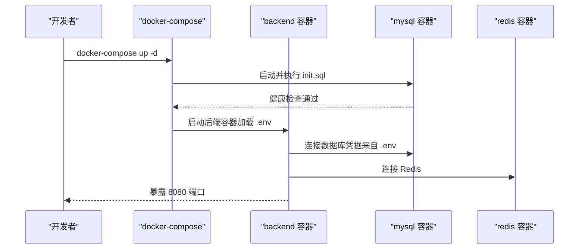
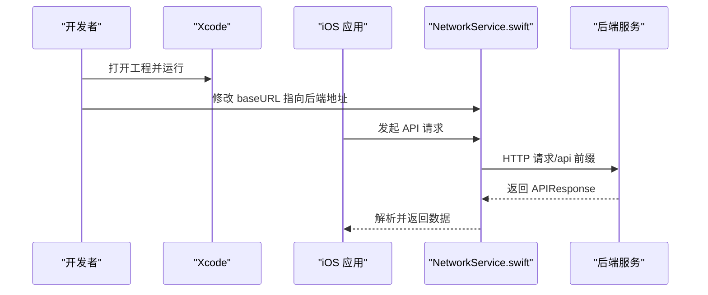
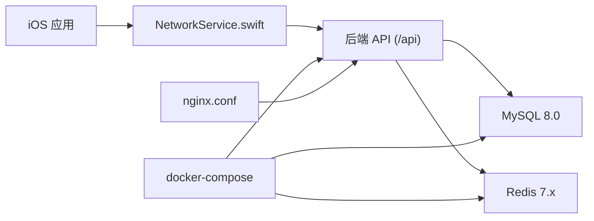

# 快速开始

<cite>
**本文引用的文件**
- [README.md](file://README.md)
- [.env.example](file://.env.example)
- [init.sql](file://backend/src/main/resources/db/init.sql)
- [start-dev.sh](file://backend/start-dev.sh)
- [docker-compose.yml](file://docker-compose.yml)
- [NetworkService.swift](file://ios/BabyFeedingReminder/Services/NetworkService.swift)
- [application.yml](file://backend/src/main/resources/application.yml)
- [application-prod.yml](file://backend/src/main/resources/application-prod.yml)
- [Dockerfile](file://backend/Dockerfile)
- [nginx.conf](file://nginx/nginx.conf)
</cite>

## 目录
1. [简介](#简介)
2. [项目结构](#项目结构)
3. [核心组件](#核心组件)
4. [架构总览](#架构总览)
5. [详细组件分析](#详细组件分析)
6. [依赖关系分析](#依赖关系分析)
7. [性能考虑](#性能考虑)
8. [故障排查指南](#故障排查指南)
9. [结论](#结论)
10. [附录](#附录)

## 简介
本节面向首次参与 babyFeedingReminder 项目的开发者，提供从零搭建开发环境的完整步骤。内容覆盖后端（Java/Spring Boot）、数据库（MySQL 8.0+）、缓存（Redis 7.x）、容器化（Docker/Docker Compose）以及 iOS（SwiftUI + Xcode 15+）的本地开发与调试要点，并给出两种常见启动方式：直接开发启动与 Docker 一键启动；同时包含 iOS 端网络基地址配置与常见问题排查建议。

## 项目结构
项目采用前后端分离与多模块组织方式：
- backend：Java 后端（Spring Boot），包含数据库初始化 SQL、开发脚本、Dockerfile 与 docker-compose 编排。
- ios：iOS SwiftUI 应用，包含网络服务、视图、视图模型与服务层。
- nginx：可选的反向代理配置（生产环境）。
- 根目录提供 .env.example 作为环境变量模板。



图表来源
- [docker-compose.yml](file://docker-compose.yml#L1-L88)
- [application.yml](file://backend/src/main/resources/application.yml#L1-L98)
- [application-prod.yml](file://backend/src/main/resources/application-prod.yml#L1-L85)
- [Dockerfile](file://backend/Dockerfile#L1-L37)
- [init.sql](file://backend/src/main/resources/db/init.sql#L1-L147)
- [start-dev.sh](file://backend/start-dev.sh#L1-L89)
- [NetworkService.swift](file://ios/BabyFeedingReminder/Services/NetworkService.swift#L1-L199)
- [.env.example](file://.env.example#L1-L13)
- [nginx.conf](file://nginx/nginx.conf#L53-L78)

章节来源
- [README.md](file://README.md#L63-L119)

## 核心组件
- 后端开发脚本：提供 Java/Maven 版本检测、数据库容器可选启动与 Spring Boot 开发模式启动。
- 数据库初始化：通过 init.sql 创建数据库与核心表结构，并内置测试用户。
- Docker 编排：一键拉起后端、MySQL 8.0、Redis 7，含健康检查与端口映射。
- iOS 网络服务：统一的 API 请求封装与日期序列化策略，支持 Debug/Release 切换 baseURL。
- 环境变量模板：提供数据库、JWT、APNs 的示例配置项。

章节来源
- [start-dev.sh](file://backend/start-dev.sh#L1-L89)
- [init.sql](file://backend/src/main/resources/db/init.sql#L1-L147)
- [docker-compose.yml](file://docker-compose.yml#L1-L88)
- [NetworkService.swift](file://ios/BabyFeedingReminder/Services/NetworkService.swift#L1-L199)
- [.env.example](file://.env.example#L1-L13)

## 架构总览
下图展示本地开发与容器化两种启动路径的系统交互：

```mermaid
graph TB
Dev["开发者"] --> |直接开发| SB["Spring Boot 开发服务器<br/>端口 8080 /api"]
Dev --> |Docker 一键| DC["docker-compose<br/>backend/mysql/redis"]
DC --> SB
SB --> DB["MySQL 8.0<br/>端口 3306/3307"]
SB --> RC["Redis 7.x<br/>端口 6379"]
IOS["iOS 应用"] --> |HTTP(S)| SB
```

图表来源
- [docker-compose.yml](file://docker-compose.yml#L1-L88)
- [application.yml](file://backend/src/main/resources/application.yml#L1-L98)
- [application-prod.yml](file://backend/src/main/resources/application-prod.yml#L1-L85)
- [NetworkService.swift](file://ios/BabyFeedingReminder/Services/NetworkService.swift#L1-L199)

## 详细组件分析

### 环境要求与安装
- 后端：JDK 17+、Maven 3.9+、MySQL 8.0+、Redis 7.x、Docker 与 Docker Compose（可选）、Xcode 15+。
- macOS 推荐使用 Homebrew 安装 Java 17 与 Maven，并配置 JAVA_HOME 与 PATH。
- Docker Desktop 可通过 Homebrew 安装。

章节来源
- [README.md](file://README.md#L121-L146)

### 克隆仓库与初始化数据库
- 克隆仓库后，进入 backend 目录，使用 init.sql 初始化数据库。
- 若使用 Docker，可在 docker-compose 启动时由 MySQL 容器自动执行 init.sql。

章节来源
- [README.md](file://README.md#L147-L170)
- [init.sql](file://backend/src/main/resources/db/init.sql#L1-L147)
- [docker-compose.yml](file://docker-compose.yml#L41-L43)

### 方式一：直接开发启动（start-dev.sh）
该脚本负责：
- 检查 Java 与 Maven 是否满足版本要求；
- 可选地检测 Docker 并在用户确认后启动 MySQL 与 Redis 容器；
- 最终以 dev 配置启动 Spring Boot。



图表来源
- [start-dev.sh](file://backend/start-dev.sh#L1-L89)

章节来源
- [start-dev.sh](file://backend/start-dev.sh#L1-L89)

### 方式二：Docker 一键启动（docker-compose）
- 复制并编辑 .env.example 为 .env，按需填写数据库密码等敏感信息；
- 使用 docker-compose up -d 启动后端、MySQL 8.0、Redis 7；
- MySQL 映射端口 3307，避免与本地 3306 冲突；Redis 映射 6379；
- 后端容器通过环境变量连接数据库与 Redis，并加载 prod 配置。



图表来源
- [docker-compose.yml](file://docker-compose.yml#L1-L88)
- [.env.example](file://.env.example#L1-L13)

章节来源
- [README.md](file://README.md#L171-L188)
- [docker-compose.yml](file://docker-compose.yml#L1-L88)
- [.env.example](file://.env.example#L1-L13)

### iOS 端配置与运行
- 打开 Xcode 工程并运行；
- 在 NetworkService.swift 中将 baseURL 配置为实际后端地址（Debug 默认指向本地 8080 端口）；
- 如使用 Docker，iOS 可通过宿主机 IP 访问 8080 端口；若使用本地后端，保持默认即可。



图表来源
- [NetworkService.swift](file://ios/BabyFeedingReminder/Services/NetworkService.swift#L1-L199)
- [application.yml](file://backend/src/main/resources/application.yml#L1-L98)

章节来源
- [README.md](file://README.md#L189-L203)
- [NetworkService.swift](file://ios/BabyFeedingReminder/Services/NetworkService.swift#L1-L199)
- [application.yml](file://backend/src/main/resources/application.yml#L1-L98)

### 环境变量与配置文件
- .env.example 提供数据库、JWT、APNs 的示例键名；
- application.yml 为本地开发配置（默认连接本地 3307 端口 MySQL 与本地 Redis）；
- application-prod.yml 为容器化生产配置，通过环境变量注入数据库与 Redis 连接信息。

章节来源
- [.env.example](file://.env.example#L1-L13)
- [application.yml](file://backend/src/main/resources/application.yml#L1-L98)
- [application-prod.yml](file://backend/src/main/resources/application-prod.yml#L1-L85)

### 数据库初始化与表结构
- init.sql 创建数据库与用户、宝宝、喂养、睡眠、设置、提醒等核心表，并建立索引；
- Docker 编排中将 init.sql 挂载至容器初始化目录，随 MySQL 启动自动执行。

章节来源
- [init.sql](file://backend/src/main/resources/db/init.sql#L1-L147)
- [docker-compose.yml](file://docker-compose.yml#L41-L43)

### 容器镜像与后端运行
- Dockerfile 使用 Eclipse Temurin 17 JDK 构建，JRE 运行，设置 JVM GC 参数与最小内存上限；
- 后端容器暴露 8080 端口，生产环境通过 .env 注入数据库与 Redis 凭据。

章节来源
- [Dockerfile](file://backend/Dockerfile#L1-L37)
- [docker-compose.yml](file://docker-compose.yml#L1-L27)

## 依赖关系分析
- 后端对数据库与缓存的依赖通过配置文件注入；
- iOS 对后端 API 的依赖通过统一网络服务封装；
- Docker 编排将后端、数据库、缓存耦合在一个网络内，便于联调；
- Nginx 作为可选反向代理，提供健康检查端点与 HTTPS 配置占位。



图表来源
- [NetworkService.swift](file://ios/BabyFeedingReminder/Services/NetworkService.swift#L1-L199)
- [application.yml](file://backend/src/main/resources/application.yml#L1-L98)
- [docker-compose.yml](file://docker-compose.yml#L1-L88)
- [nginx.conf](file://nginx/nginx.conf#L53-L78)

章节来源
- [README.md](file://README.md#L1-L120)
- [docker-compose.yml](file://docker-compose.yml#L1-L88)
- [application.yml](file://backend/src/main/resources/application.yml#L1-L98)
- [nginx.conf](file://nginx/nginx.conf#L53-L78)

## 性能考虑
- 后端容器使用 G1GC 与较小堆内存上限，适合开发环境；生产环境可通过 application-prod.yml 调整连接池与线程池大小。
- MySQL 与 Redis 使用独立卷持久化，避免频繁重建导致初始化耗时。
- iOS 网络层设置请求超时与日期解析策略，减少异常分支带来的重试成本。
- 建议在本地开发时优先使用 Docker，避免本机服务冲突；生产环境结合 Nginx 提升稳定性与可观测性。

章节来源
- [Dockerfile](file://backend/Dockerfile#L1-L37)
- [application-prod.yml](file://backend/src/main/resources/application-prod.yml#L1-L85)
- [docker-compose.yml](file://docker-compose.yml#L1-L88)
- [NetworkService.swift](file://ios/BabyFeedingReminder/Services/NetworkService.swift#L1-L199)

## 故障排查指南
- Java 版本不匹配
  - 现象：start-dev.sh 提示 Java 版本过低或未安装。
  - 处理：安装 JDK 17（如 Eclipse Temurin 或 Azul Zulu），配置 JAVA_HOME 与 PATH。
  - 参考
    - [start-dev.sh](file://backend/start-dev.sh#L10-L31)
    - [README.md](file://README.md#L121-L146)

- Maven 未安装或版本过低
  - 现象：start-dev.sh 提示未找到 mvn。
  - 处理：使用 Homebrew 安装 Maven 3.9+。
  - 参考
    - [start-dev.sh](file://backend/start-dev.sh#L33-L41)
    - [README.md](file://README.md#L121-L146)

- 数据库连接失败
  - 现象：后端启动报连接 MySQL/Redis 错误。
  - 处理：
    - 若使用本地服务，确认 application.yml 中的数据库与 Redis 地址、端口、凭据正确；
    - 若使用 Docker，确认 docker-compose 启动成功且 MySQL 健康检查通过；
    - 确认 init.sql 已被执行（或容器已挂载并执行）。
  - 参考
    - [application.yml](file://backend/src/main/resources/application.yml#L10-L22)
    - [application-prod.yml](file://backend/src/main/resources/application-prod.yml#L10-L32)
    - [docker-compose.yml](file://docker-compose.yml#L28-L51)
    - [init.sql](file://backend/src/main/resources/db/init.sql#L1-L147)

- Docker 权限错误
  - 现象：docker-compose 启动失败或无权限访问 Docker。
  - 处理：确保当前用户加入 docker 组，或使用 sudo（不推荐长期使用）。
  - 参考
    - [docker-compose.yml](file://docker-compose.yml#L1-L88)

- iOS 网络请求失败
  - 现象：iOS 无法连接后端或返回 401/404。
  - 处理：
    - 确认 NetworkService.swift 中 baseURL 指向正确的后端地址；
    - 确认后端已启动（本地或 Docker）；
    - 确认后端上下文路径为 /api。
  - 参考
    - [NetworkService.swift](file://ios/BabyFeedingReminder/Services/NetworkService.swift#L1-L199)
    - [application.yml](file://backend/src/main/resources/application.yml#L1-L98)

## 结论
通过上述步骤，您可以快速完成 babyFeedingReminder 的本地开发环境搭建。推荐优先使用 Docker 一键启动以降低环境差异带来的问题；在 iOS 端只需调整 NetworkService.swift 的 baseURL 即可对接本地或远程后端。遇到问题时，优先检查 Java/Maven 版本、数据库连接与 Docker 权限，以及 iOS 端的网络基地址配置。

## 附录
- API 文档访问：后端启动后可通过 Swagger UI 查看接口文档（路径见 application.yml）。
- 生产环境部署：可使用 docker-compose --profile production 启动 Nginx 与后端，并准备 SSL 证书与 APNs 证书。

章节来源
- [README.md](file://README.md#L166-L170)
- [application.yml](file://backend/src/main/resources/application.yml#L93-L98)
- [docker-compose.yml](file://docker-compose.yml#L64-L81)
- [nginx.conf](file://nginx/nginx.conf#L53-L78)