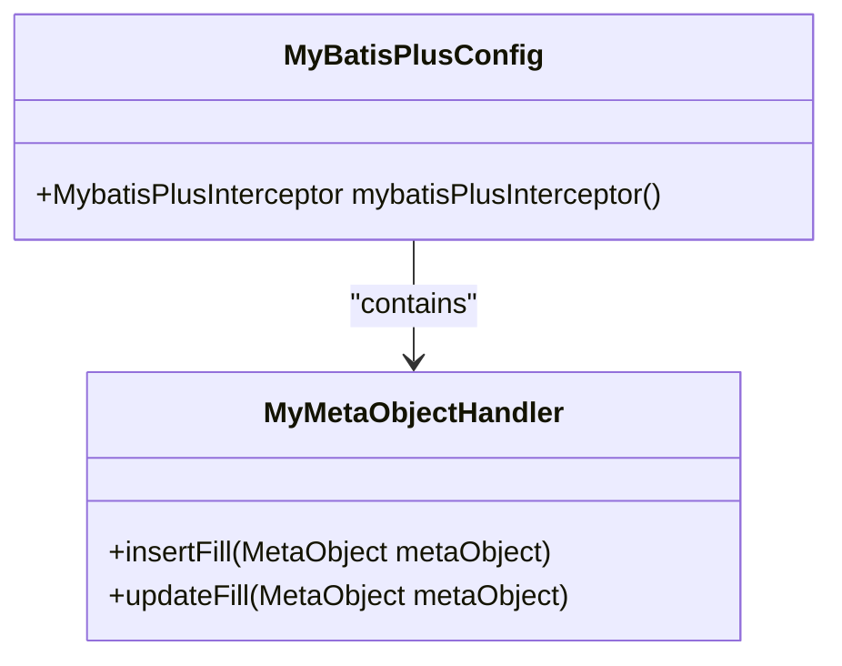
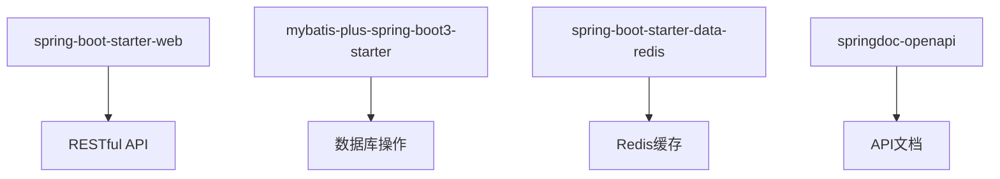
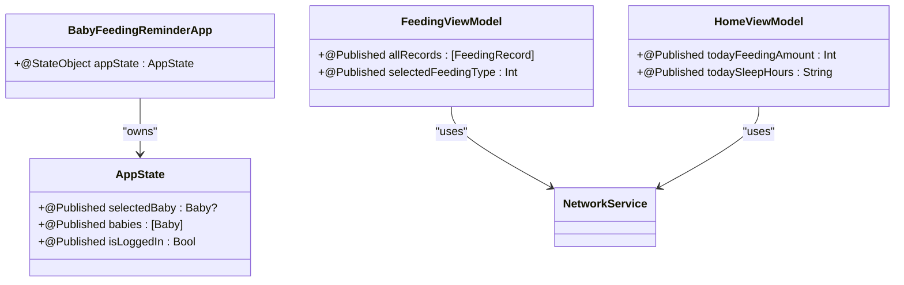
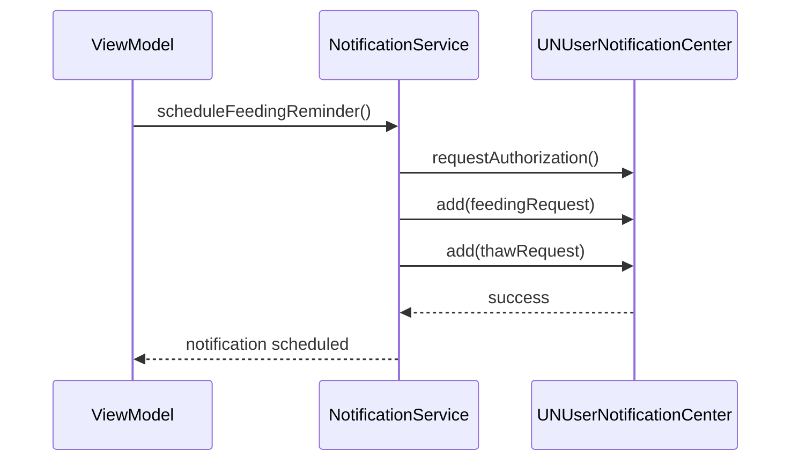
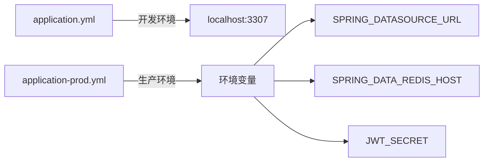
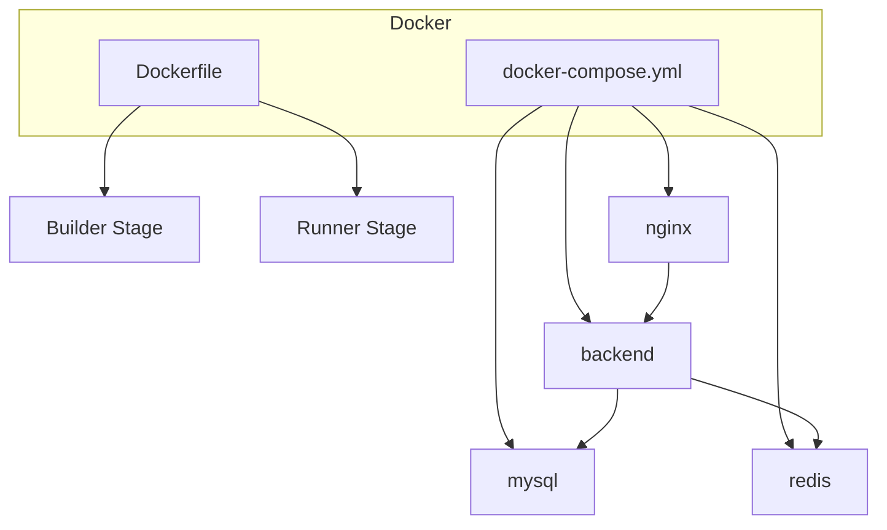
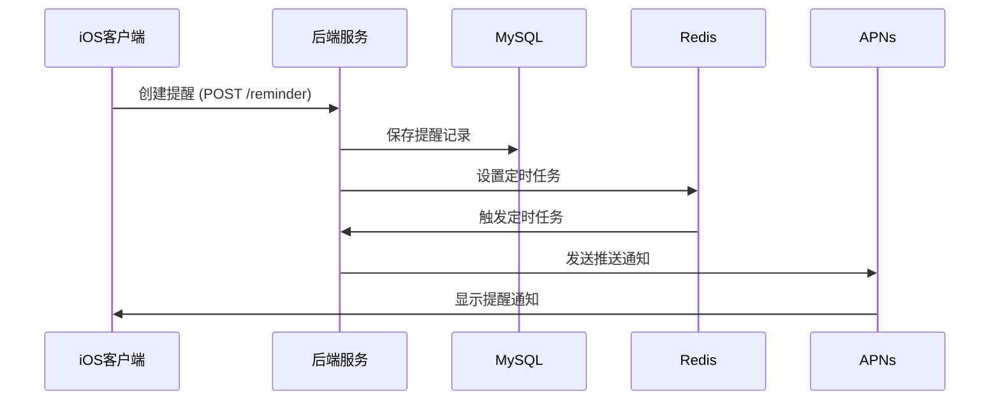

# 技术栈

<cite>
**Referenced Files in This Document**   
- [pom.xml](file://backend/pom.xml)
- [application.yml](file://backend/src/main/resources/application.yml)
- [application-prod.yml](file://backend/src/main/resources/application-prod.yml)
- [Dockerfile](file://backend/Dockerfile)
- [docker-compose.yml](file://docker-compose.yml)
- [Application.java](file://backend/src/main/java/com/baby/Application.java)
- [MyBatisPlusConfig.java](file://backend/src/main/java/com/baby/config/MyBatisPlusConfig.java)
- [SecurityConfig.java](file://backend/src/main/java/com/baby/config/SecurityConfig.java)
- [BabyFeedingReminderApp.swift](file://ios/BabyFeedingReminder/BabyFeedingReminderApp.swift)
- [NotificationService.swift](file://ios/BabyFeedingReminder/Services/NotificationService.swift)
- [NetworkService.swift](file://ios/BabyFeedingReminder/Services/NetworkService.swift)
- [FeedingViewModel.swift](file://ios/BabyFeedingReminder/ViewModels/FeedingViewModel.swift)
- [HomeViewModel.swift](file://ios/BabyFeedingReminder/ViewModels/HomeViewModel.swift)
- [Models.swift](file://ios/BabyFeedingReminder/Models/Models.swift)
</cite>

## Table of Contents
1. [后端技术栈](#后端技术栈)
2. [前端技术栈](#前端技术栈)
3. [部署架构](#部署架构)
4. [技术协同工作示例](#技术协同工作示例)

## 后端技术栈

### Java 17 与 Spring Boot 3.4.0
后端服务基于 Java 17 构建，采用 Spring Boot 3.4.0 作为核心框架。Java 17 提供了现代化的语言特性、性能优化和长期支持，确保了应用的稳定性和可维护性。Spring Boot 3.4.0 基于 Spring Framework 6，带来了对 Jakarta EE 9+ 的原生支持、改进的启动性能和增强的可观测性。

**Section sources**
- [pom.xml](file://backend/pom.xml#L7-L20)

### 数据访问层：MyBatis Plus 3.5.5
数据访问层使用 MyBatis Plus 3.5.5，它在 MyBatis 的基础上提供了强大的 CRUD 操作封装和代码生成能力。通过 `MyBatisPlusConfig` 配置类，集成了分页插件和自动填充处理器，实现了 `createTime` 和 `updateTime` 字段的自动化填充，减少了样板代码。

**Diagram sources **
- [MyBatisPlusConfig.java](file://backend/src/main/java/com/baby/config/MyBatisPlusConfig.java#L17-L47)

### 数据库：MySQL 8.0
应用使用 MySQL 8.0 作为持久化存储，利用其高性能、高可靠性和丰富的功能集。数据库连接通过 HikariCP 连接池管理，在生产环境中配置了最大连接池大小为 20，确保了高并发下的稳定性能。

**Section sources**
- [application.yml](file://backend/src/main/resources/application.yml#L10-L14)
- [application-prod.yml](file://backend/src/main/resources/application-prod.yml#L10-L20)

### 缓存与消息：Redis 7.x
Redis 7.x 被用作缓存和消息中间件，主要支持定时任务调度和数据缓存。在 `application.yml` 中配置了 Redis 的主机、端口和数据库索引，为应用提供了低延迟的数据访问能力。

**Section sources**
- [application.yml](file://backend/src/main/resources/application.yml#L16-L21)
- [application-prod.yml](file://backend/src/main/resources/application-prod.yml#L21-L32)

### APNs 推送：Pushy 0.15.4
Pushy 0.15.4 库用于实现与 Apple Push Notification service (APNs) 的集成，支持向 iOS 设备发送远程推送通知。APNs 配置包括证书路径、密码和主题，可在开发和生产环境之间灵活切换。

**Section sources**
- [pom.xml](file://backend/pom.xml#L79-L84)
- [application.yml](file://backend/src/main/resources/application.yml#L41-L47)

### 核心依赖说明
- **spring-boot-starter-web**: 提供了 Spring MVC 和内嵌 Tomcat，用于构建 RESTful API。
- **mybatis-plus-spring-boot3-starter**: MyBatis Plus 的 Spring Boot 3 启动器，简化了 MyBatis Plus 的集成。
- **spring-boot-starter-data-redis**: 提供了 Spring Data Redis 支持，简化了 Redis 操作。
- **springdoc-openapi**: 用于生成 OpenAPI 3 规范的 API 文档，可通过 `/swagger-ui.html` 访问。

**Diagram sources **
- [pom.xml](file://backend/pom.xml#L27-L98)

## 前端技术栈

### SwiftUI 与 MVVM 架构
iOS 客户端采用 SwiftUI 构建用户界面，结合 MVVM（Model-View-ViewModel）架构模式实现关注点分离。`BabyFeedingReminderApp` 作为应用入口，通过 `@StateObject` 管理全局应用状态，确保状态在视图间一致。

**Diagram sources **
- [BabyFeedingReminderApp.swift](file://ios/BabyFeedingReminder/BabyFeedingReminderApp.swift#L3-L164)
- [FeedingViewModel.swift](file://ios/BabyFeedingReminder/ViewModels/FeedingViewModel.swift#L27-L226)
- [HomeViewModel.swift](file://ios/BabyFeedingReminder/ViewModels/HomeViewModel.swift#L36-L135)

### 响应式编程：Combine
应用广泛使用 Combine 框架实现响应式编程。`@Published` 属性包装器与 Combine 的 `Publisher` 集成，当 ViewModel 中的数据发生变化时，会自动触发视图更新，实现了数据驱动的 UI 变化。

**Section sources**
- [FeedingViewModel.swift](file://ios/BabyFeedingReminder/ViewModels/FeedingViewModel.swift#L28-L31)
- [HomeViewModel.swift](file://ios/BabyFeedingReminder/ViewModels/HomeViewModel.swift#L37-L43)

### 通知系统：UserNotifications
`NotificationService` 类封装了 UserNotifications 框架，负责管理本地通知的请求、安排和取消。支持喂奶提醒、解冻提醒、小睡提醒和哄睡提醒等多种通知类型，并注册了相应的通知分类和操作。

**Diagram sources **
- [NotificationService.swift](file://ios/BabyFeedingReminder/Services/NotificationService.swift#L5-L151)

### 网络通信：NetworkService
`NetworkService` 类实现了类型安全的网络请求，使用 `async/await` 语法处理异步操作。支持请求头设置、JSON 编解码和错误处理，为所有 API 调用提供了统一的接口。

**Section sources**
- [NetworkService.swift](file://ios/BabyFeedingReminder/Services/NetworkService.swift#L30-L199)

## 部署架构

### 配置管理
应用通过 `application.yml` 和 `application-prod.yml` 实现多环境配置管理。开发环境使用本地数据库连接，生产环境通过环境变量注入配置，如数据库 URL、Redis 主机和 JWT 密钥，确保了配置的安全性和灵活性。

**Diagram sources **
- [application.yml](file://backend/src/main/resources/application.yml#L1-L98)
- [application-prod.yml](file://backend/src/main/resources/application-prod.yml#L1-L85)

### 容器化部署
应用通过 Docker 和 docker-compose 实现容器化部署。`Dockerfile` 采用多阶段构建，首先使用 Maven 构建应用，然后在轻量级 JRE 基础上运行。`docker-compose.yml` 定义了后端、MySQL、Redis 和 Nginx 的服务编排。

**Diagram sources **
- [Dockerfile](file://backend/Dockerfile#L1-L38)
- [docker-compose.yml](file://docker-compose.yml#L1-L89)

## 技术协同工作示例

### 定时提醒工作流
应用通过 `@EnableScheduling` 注解启用定时任务，结合 Redis 实现了高效的提醒系统。当用户设置喂养或睡眠提醒时，相关数据被存储到 MySQL，同时在 Redis 中创建定时任务。

**Diagram sources **
- [Application.java](file://backend/src/main/java/com/baby/Application.java#L1-L17)
- [ReminderController.java](file://backend/src/main/java/com/baby/controller/ReminderController.java)
- [ReminderServiceImpl.java](file://backend/src/main/java/com/baby/service/impl/ReminderServiceImpl.java)

**Section sources**
- [Application.java](file://backend/src/main/java/com/baby/Application.java#L1-L17)