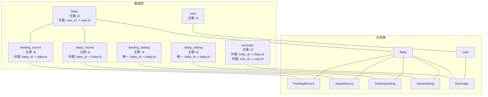
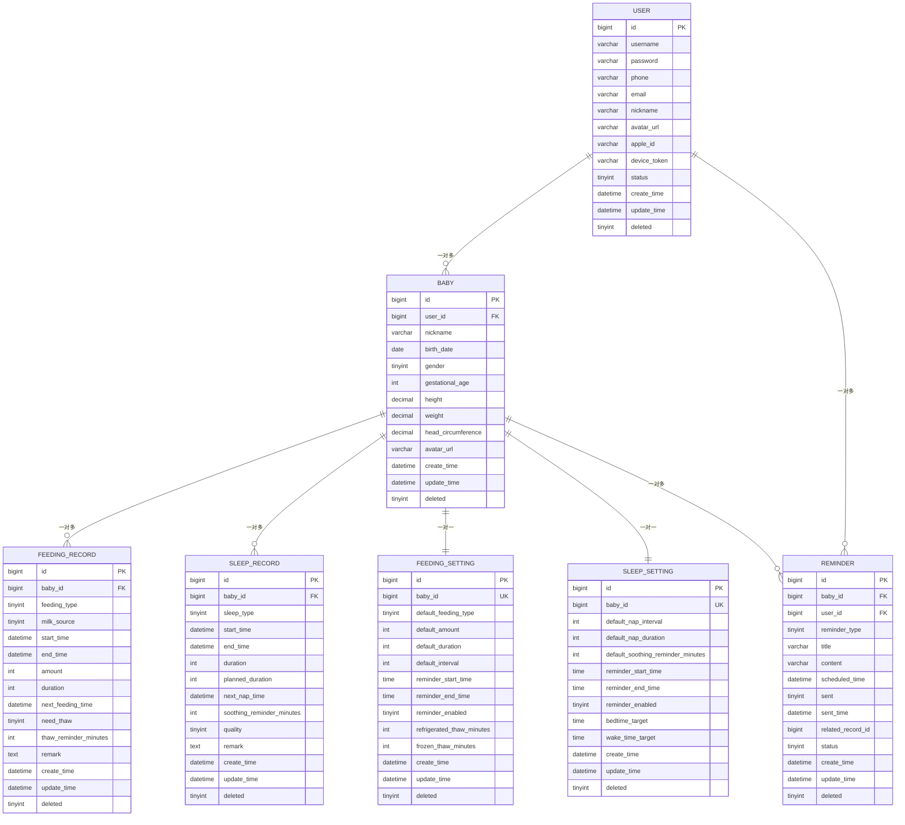
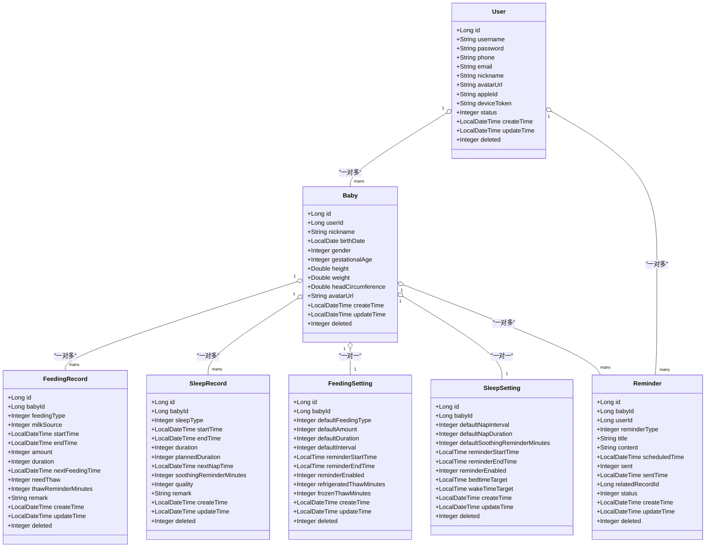
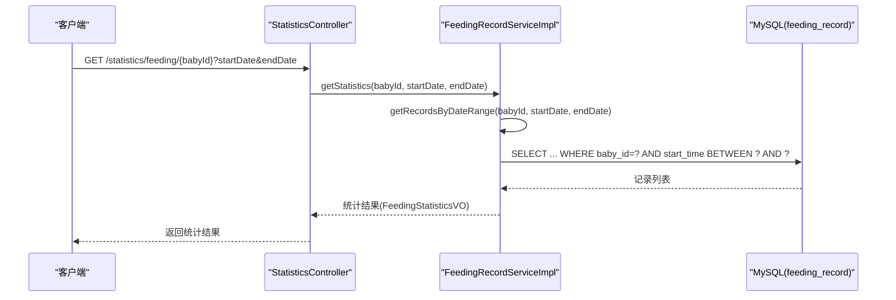
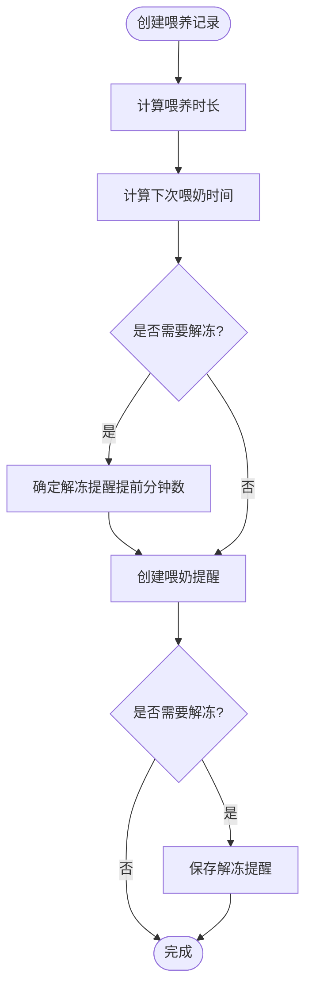
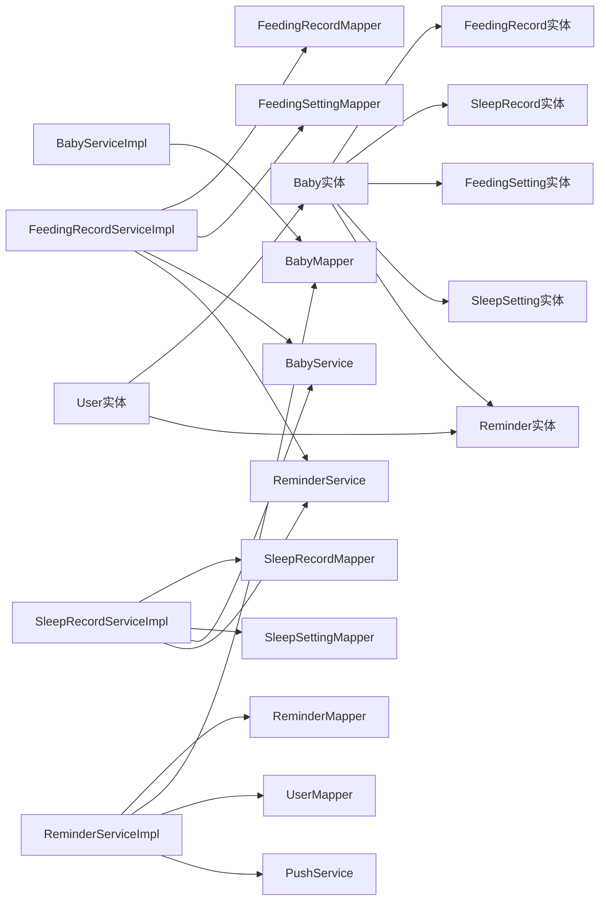
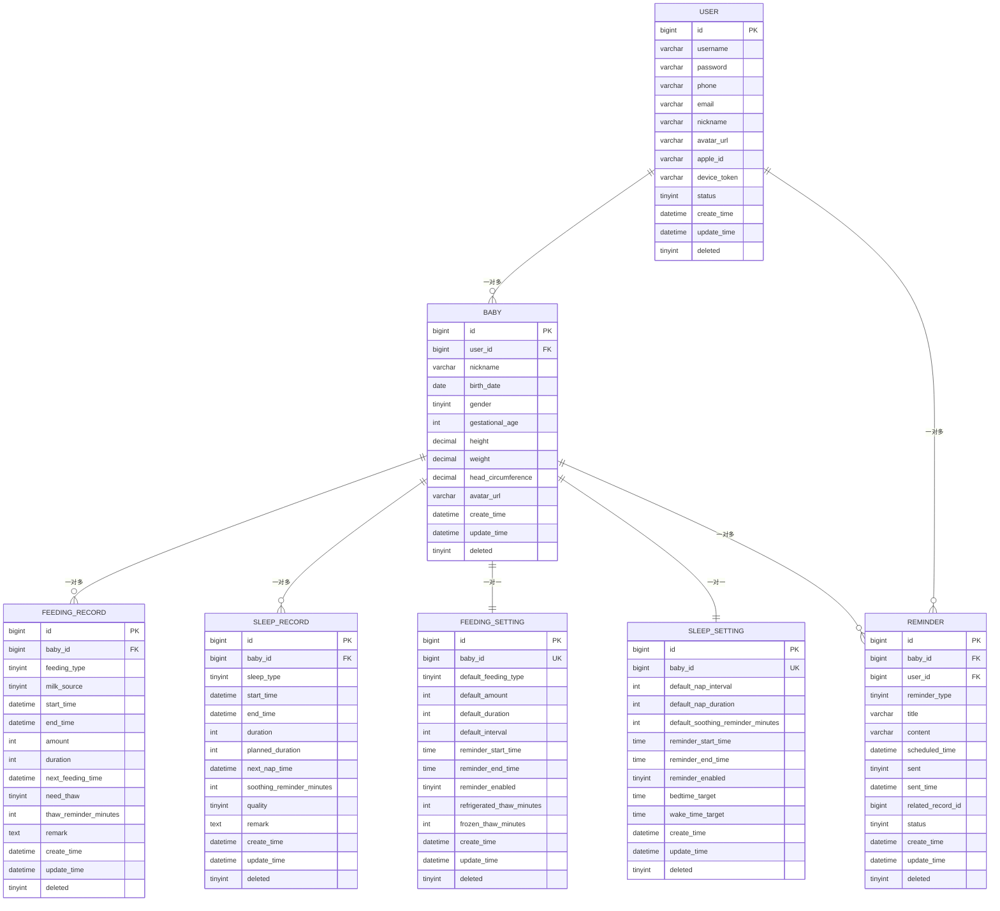

# 实体关系图

<cite>
**本文引用的文件**
- [init.sql](file://backend/src/main/resources/db/init.sql)
- [User.java](file://backend/src/main/java/com/baby/entity/User.java)
- [Baby.java](file://backend/src/main/java/com/baby/entity/Baby.java)
- [FeedingRecord.java](file://backend/src/main/java/com/baby/entity/FeedingRecord.java)
- [SleepRecord.java](file://backend/src/main/java/com/baby/entity/SleepRecord.java)
- [FeedingSetting.java](file://backend/src/main/java/com/baby/entity/FeedingSetting.java)
- [SleepSetting.java](file://backend/src/main/java/com/baby/entity/SleepSetting.java)
- [Reminder.java](file://backend/src/main/java/com/baby/entity/Reminder.java)
- [BabyServiceImpl.java](file://backend/src/main/java/com/baby/service/impl/BabyServiceImpl.java)
- [FeedingRecordServiceImpl.java](file://backend/src/main/java/com/baby/service/impl/FeedingRecordServiceImpl.java)
- [SleepRecordServiceImpl.java](file://backend/src/main/java/com/baby/service/impl/SleepRecordServiceImpl.java)
- [ReminderServiceImpl.java](file://backend/src/main/java/com/baby/service/impl/ReminderServiceImpl.java)
- [StatisticsController.java](file://backend/src/main/java/com/baby/controller/StatisticsController.java)
- [FeedingStatisticsVO.java](file://backend/src/main/java/com/baby/vo/FeedingStatisticsVO.java)
- [SleepStatisticsVO.java](file://backend/src/main/java/com/baby/vo/SleepStatisticsVO.java)
</cite>

## 目录
1. [简介](#简介)
2. [项目结构](#项目结构)
3. [核心组件](#核心组件)
4. [架构总览](#架构总览)
5. [详细组件分析](#详细组件分析)
6. [依赖分析](#依赖分析)
7. [性能考量](#性能考量)
8. [故障排查指南](#故障排查指南)
9. [结论](#结论)
10. [附录](#附录)

## 简介
本文件面向 babyFeedingReminder 应用，提供完整的数据模型文档与实体关系图（ERD），涵盖 User、Baby、FeedingRecord、SleepRecord、FeedingSetting、SleepSetting、Reminder 七张核心表之间的主键、外键、基数关系与逻辑删除策略。文档同时结合 init.sql 的建模与 JPA 注解（MyBatis-Plus）验证关系，并通过真实业务场景说明数据遍历路径，如“查询某宝宝在指定日期范围内的所有喂养记录”。

## 项目结构
应用采用后端 Java + MySQL 的分层架构：
- 数据库层：init.sql 定义了用户、宝宝、喂养记录、睡眠记录、喂养设置、睡眠设置、提醒任务等表及其索引。
- 实体层：各实体类使用 MyBatis-Plus 注解映射数据库表字段，统一支持逻辑删除。
- 服务层：围绕实体提供 CRUD、统计、提醒生成等业务逻辑。
- 控制器层：对外暴露 REST 接口，聚合统计分析结果。

图表来源
- [init.sql](file://backend/src/main/resources/db/init.sql#L7-L23)
- [init.sql](file://backend/src/main/resources/db/init.sql#L25-L41)
- [init.sql](file://backend/src/main/resources/db/init.sql#L43-L63)
- [init.sql](file://backend/src/main/resources/db/init.sql#L65-L84)
- [init.sql](file://backend/src/main/resources/db/init.sql#L86-L102)
- [init.sql](file://backend/src/main/resources/db/init.sql#L104-L119)
- [init.sql](file://backend/src/main/resources/db/init.sql#L121-L141)
- [User.java](file://backend/src/main/java/com/baby/entity/User.java#L1-L71)
- [Baby.java](file://backend/src/main/java/com/baby/entity/Baby.java#L1-L72)
- [FeedingRecord.java](file://backend/src/main/java/com/baby/entity/FeedingRecord.java#L1-L81)
- [SleepRecord.java](file://backend/src/main/java/com/baby/entity/SleepRecord.java#L1-L76)
- [FeedingSetting.java](file://backend/src/main/java/com/baby/entity/FeedingSetting.java#L1-L77)
- [SleepSetting.java](file://backend/src/main/java/com/baby/entity/SleepSetting.java#L1-L72)
- [Reminder.java](file://backend/src/main/java/com/baby/entity/Reminder.java#L1-L76)

章节来源
- [init.sql](file://backend/src/main/resources/db/init.sql#L7-L23)
- [init.sql](file://backend/src/main/resources/db/init.sql#L25-L41)
- [init.sql](file://backend/src/main/resources/db/init.sql#L43-L63)
- [init.sql](file://backend/src/main/resources/db/init.sql#L65-L84)
- [init.sql](file://backend/src/main/resources/db/init.sql#L86-L102)
- [init.sql](file://backend/src/main/resources/db/init.sql#L104-L119)
- [init.sql](file://backend/src/main/resources/db/init.sql#L121-L141)

## 核心组件
- User：用户表，包含账号状态、设备 Token、逻辑删除字段。
- Baby：宝宝信息表，与 User 为一对多关系；与 Records/Settings/Reminders 为一对多关系。
- FeedingRecord：喂养记录表，记录喂养类型、时长、奶量、下次喂奶时间等。
- SleepRecord：睡眠记录表，记录睡眠类型、时长、计划时长、下次小睡时间等。
- FeedingSetting：喂养设置表，一对一绑定到 Baby，提供默认喂养参数与提醒时段。
- SleepSetting：睡眠设置表，一对一绑定到 Baby，提供默认小睡参数与提醒时段。
- Reminder：提醒任务表，记录提醒类型、标题、内容、预定时间、发送状态等，并关联 Baby 与 User。

章节来源
- [User.java](file://backend/src/main/java/com/baby/entity/User.java#L1-L71)
- [Baby.java](file://backend/src/main/java/com/baby/entity/Baby.java#L1-L72)
- [FeedingRecord.java](file://backend/src/main/java/com/baby/entity/FeedingRecord.java#L1-L81)
- [SleepRecord.java](file://backend/src/main/java/com/baby/entity/SleepRecord.java#L1-L76)
- [FeedingSetting.java](file://backend/src/main/java/com/baby/entity/FeedingSetting.java#L1-L77)
- [SleepSetting.java](file://backend/src/main/java/com/baby/entity/SleepSetting.java#L1-L72)
- [Reminder.java](file://backend/src/main/java/com/baby/entity/Reminder.java#L1-L76)

## 架构总览
下图展示实体间的主键、外键与基数关系，以及逻辑删除字段的统一使用。

图表来源
- [init.sql](file://backend/src/main/resources/db/init.sql#L7-L23)
- [init.sql](file://backend/src/main/resources/db/init.sql#L25-L41)
- [init.sql](file://backend/src/main/resources/db/init.sql#L43-L63)
- [init.sql](file://backend/src/main/resources/db/init.sql#L65-L84)
- [init.sql](file://backend/src/main/resources/db/init.sql#L86-L102)
- [init.sql](file://backend/src/main/resources/db/init.sql#L104-L119)
- [init.sql](file://backend/src/main/resources/db/init.sql#L121-L141)

## 详细组件分析

### 数据模型与约束
- 主键与索引
  - 所有表均以自增主键作为 PK。
  - user 表对 phone、apple_id 建有索引；baby 表对 user_id 建有索引；feeding_record/sleep_record 对 baby_id、start_time、复合索引 idx_baby_start 建有索引；reminder 对 user_id、scheduled_time、status、复合索引 idx_user_status 建有索引。
- 外键与基数
  - User 与 Baby：一对多（一个用户可拥有多个宝宝）。
  - Baby 与 FeedingRecord、SleepRecord：一对多（一个宝宝有多条喂养/睡眠记录）。
  - Baby 与 FeedingSetting、SleepSetting：一对一（每个宝宝仅有一套设置）。
  - Baby 与 Reminder：一对多（一个宝宝可有多个提醒）。
  - User 与 Reminder：一对多（一个用户可有多个提醒，通常指向其宝宝）。
- 逻辑删除
  - 所有实体类均使用逻辑删除注解，数据库层面也提供 deleted 字段，统一以 tinyint 0/1 表示未删/已删。

章节来源
- [init.sql](file://backend/src/main/resources/db/init.sql#L7-L23)
- [init.sql](file://backend/src/main/resources/db/init.sql#L25-L41)
- [init.sql](file://backend/src/main/resources/db/init.sql#L43-L63)
- [init.sql](file://backend/src/main/resources/db/init.sql#L65-L84)
- [init.sql](file://backend/src/main/resources/db/init.sql#L86-L102)
- [init.sql](file://backend/src/main/resources/db/init.sql#L104-L119)
- [init.sql](file://backend/src/main/resources/db/init.sql#L121-L141)
- [User.java](file://backend/src/main/java/com/baby/entity/User.java#L1-L71)
- [Baby.java](file://backend/src/main/java/com/baby/entity/Baby.java#L1-L72)
- [FeedingRecord.java](file://backend/src/main/java/com/baby/entity/FeedingRecord.java#L1-L81)
- [SleepRecord.java](file://backend/src/main/java/com/baby/entity/SleepRecord.java#L1-L76)
- [FeedingSetting.java](file://backend/src/main/java/com/baby/entity/FeedingSetting.java#L1-L77)
- [SleepSetting.java](file://backend/src/main/java/com/baby/entity/SleepSetting.java#L1-L72)
- [Reminder.java](file://backend/src/main/java/com/baby/entity/Reminder.java#L1-L76)

### 关系类图（代码级）

图表来源
- [User.java](file://backend/src/main/java/com/baby/entity/User.java#L1-L71)
- [Baby.java](file://backend/src/main/java/com/baby/entity/Baby.java#L1-L72)
- [FeedingRecord.java](file://backend/src/main/java/com/baby/entity/FeedingRecord.java#L1-L81)
- [SleepRecord.java](file://backend/src/main/java/com/baby/entity/SleepRecord.java#L1-L76)
- [FeedingSetting.java](file://backend/src/main/java/com/baby/entity/FeedingSetting.java#L1-L77)
- [SleepSetting.java](file://backend/src/main/java/com/baby/entity/SleepSetting.java#L1-L72)
- [Reminder.java](file://backend/src/main/java/com/baby/entity/Reminder.java#L1-L76)

### API 流程示例：查询某宝宝在指定日期范围内的所有喂养记录
该流程展示了从控制器到服务再到 Mapper 的调用链路，以及如何利用数据库索引高效过滤。

图表来源
- [StatisticsController.java](file://backend/src/main/java/com/baby/controller/StatisticsController.java#L73-L91)
- [FeedingRecordServiceImpl.java](file://backend/src/main/java/com/baby/service/impl/FeedingRecordServiceImpl.java#L127-L133)
- [init.sql](file://backend/src/main/resources/db/init.sql#L43-L63)

章节来源
- [StatisticsController.java](file://backend/src/main/java/com/baby/controller/StatisticsController.java#L73-L91)
- [FeedingRecordServiceImpl.java](file://backend/src/main/java/com/baby/service/impl/FeedingRecordServiceImpl.java#L127-L133)
- [FeedingStatisticsVO.java](file://backend/src/main/java/com/baby/vo/FeedingStatisticsVO.java#L1-L75)

### 复杂逻辑流程：生成喂奶提醒与解冻提醒
该流程体现了实体间的联动关系与提醒生成策略。

图表来源
- [FeedingRecordServiceImpl.java](file://backend/src/main/java/com/baby/service/impl/FeedingRecordServiceImpl.java#L48-L90)
- [ReminderServiceImpl.java](file://backend/src/main/java/com/baby/service/impl/ReminderServiceImpl.java#L37-L101)

章节来源
- [FeedingRecordServiceImpl.java](file://backend/src/main/java/com/baby/service/impl/FeedingRecordServiceImpl.java#L48-L90)
- [ReminderServiceImpl.java](file://backend/src/main/java/com/baby/service/impl/ReminderServiceImpl.java#L37-L101)

## 依赖分析
- 实体依赖
  - Baby 依赖 User（外键 user_id）。
  - FeedingRecord、SleepRecord 依赖 Baby（外键 baby_id）。
  - FeedingSetting、SleepSetting 依赖 Baby（唯一外键 baby_id）。
  - Reminder 同时依赖 Baby（外键 baby_id）与 User（外键 user_id）。
- 服务依赖
  - BabyServiceImpl 依赖 BabyMapper。
  - FeedingRecordServiceImpl 依赖 FeedingRecordMapper、FeedingSettingMapper、BabyService、ReminderService。
  - SleepRecordServiceImpl 依赖 SleepRecordMapper、SleepSettingMapper、BabyService、ReminderService。
  - ReminderServiceImpl 依赖 ReminderMapper、BabyMapper、UserMapper、PushService。
- 控制器依赖
  - StatisticsController 依赖 FeedingRecordService、SleepRecordService、BabyService、FeedingRecordMapper、SleepRecordMapper。

图表来源
- [BabyServiceImpl.java](file://backend/src/main/java/com/baby/service/impl/BabyServiceImpl.java#L1-L91)
- [FeedingRecordServiceImpl.java](file://backend/src/main/java/com/baby/service/impl/FeedingRecordServiceImpl.java#L1-L231)
- [SleepRecordServiceImpl.java](file://backend/src/main/java/com/baby/service/impl/SleepRecordServiceImpl.java#L1-L279)
- [ReminderServiceImpl.java](file://backend/src/main/java/com/baby/service/impl/ReminderServiceImpl.java#L1-L242)

章节来源
- [BabyServiceImpl.java](file://backend/src/main/java/com/baby/service/impl/BabyServiceImpl.java#L1-L91)
- [FeedingRecordServiceImpl.java](file://backend/src/main/java/com/baby/service/impl/FeedingRecordServiceImpl.java#L1-L231)
- [SleepRecordServiceImpl.java](file://backend/src/main/java/com/baby/service/impl/SleepRecordServiceImpl.java#L1-L279)
- [ReminderServiceImpl.java](file://backend/src/main/java/com/baby/service/impl/ReminderServiceImpl.java#L1-L242)

## 性能考量
- 索引优化
  - feeding_record/sleep_record 的 idx_baby_start 复合索引可显著提升按宝宝与起始时间范围查询的性能。
  - reminder 的 idx_user_status 复合索引有利于按用户状态快速筛选待发送提醒。
- 逻辑删除
  - 统一使用 deleted 字段进行软删除，避免物理删除带来的数据不可恢复风险，同时保持历史审计能力。
- 查询模式
  - 控制器与服务层广泛使用条件查询与排序，配合索引可降低全表扫描概率。
- 统计分析
  - 统计接口通过 Mapper 聚合函数与服务层聚合计算相结合，减少网络往返与对象转换成本。

[本节为通用性能建议，不直接分析具体文件]

## 故障排查指南
- 常见问题
  - 外键约束错误：插入记录时报错提示违反外键约束，通常为 baby_id 或 user_id 不存在。应先确认父记录存在性。
  - 重复设置：FeedingSetting/SleepSetting 的 baby_id 为唯一键，重复创建会报唯一约束冲突。应先查询再更新或删除旧设置。
  - 逻辑删除影响：查询时需考虑 deleted 字段，确保未被软删除的数据才参与业务逻辑。
- 排查步骤
  - 核对实体注解与数据库字段一致性（主键、逻辑删除注解与 deleted 字段）。
  - 检查服务层查询条件（如 between/start_time 等）与数据库索引是否匹配。
  - 使用控制器接口验证统计结果与预期一致，定位服务层聚合逻辑问题。

章节来源
- [init.sql](file://backend/src/main/resources/db/init.sql#L86-L102)
- [init.sql](file://backend/src/main/resources/db/init.sql#L104-L119)
- [User.java](file://backend/src/main/java/com/baby/entity/User.java#L1-L71)
- [Baby.java](file://backend/src/main/java/com/baby/entity/Baby.java#L1-L72)
- [FeedingRecord.java](file://backend/src/main/java/com/baby/entity/FeedingRecord.java#L1-L81)
- [SleepRecord.java](file://backend/src/main/java/com/baby/entity/SleepRecord.java#L1-L76)
- [FeedingSetting.java](file://backend/src/main/java/com/baby/entity/FeedingSetting.java#L1-L77)
- [SleepSetting.java](file://backend/src/main/java/com/baby/entity/SleepSetting.java#L1-L72)
- [Reminder.java](file://backend/src/main/java/com/baby/entity/Reminder.java#L1-L76)

## 结论
本数据模型以清晰的一对多与一对一关系组织用户、宝宝与其相关记录与设置，并通过统一的逻辑删除策略保障数据完整性与可审计性。数据库索引设计与服务层查询模式共同提升了关键路径的性能表现。通过控制器提供的统计接口与服务层的聚合逻辑，系统能够高效地支撑喂养与睡眠的日常管理与趋势分析。

[本节为总结性内容，不直接分析具体文件]

## 附录

### 实体关系图（ERD）

图表来源
- [init.sql](file://backend/src/main/resources/db/init.sql#L7-L23)
- [init.sql](file://backend/src/main/resources/db/init.sql#L25-L41)
- [init.sql](file://backend/src/main/resources/db/init.sql#L43-L63)
- [init.sql](file://backend/src/main/resources/db/init.sql#L65-L84)
- [init.sql](file://backend/src/main/resources/db/init.sql#L86-L102)
- [init.sql](file://backend/src/main/resources/db/init.sql#L104-L119)
- [init.sql](file://backend/src/main/resources/db/init.sql#L121-L141)