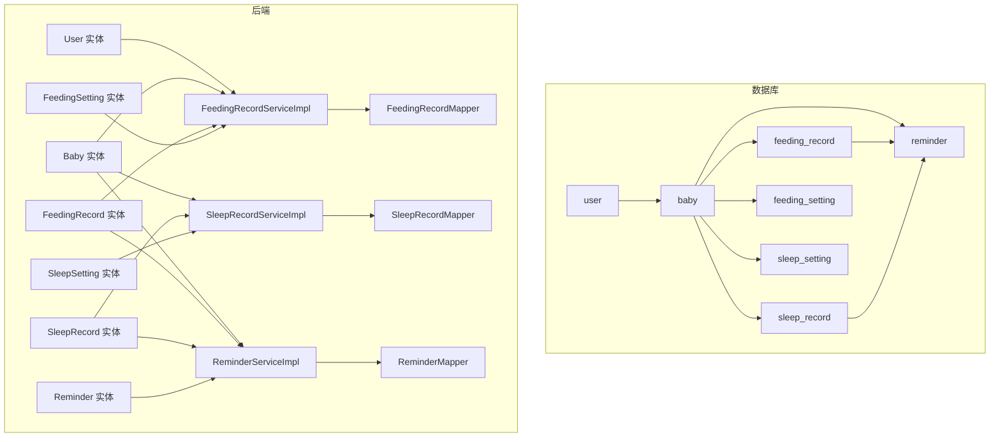
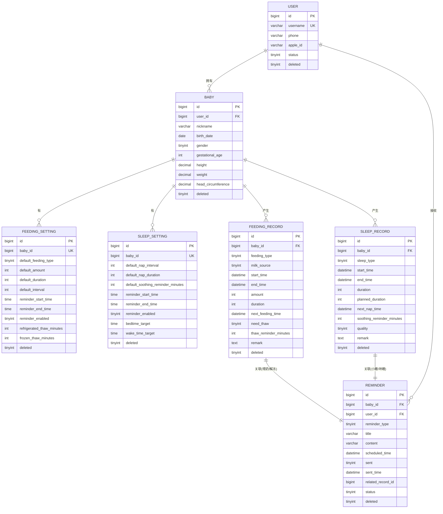
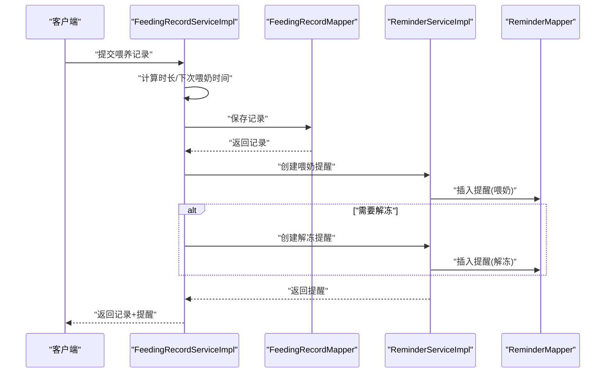
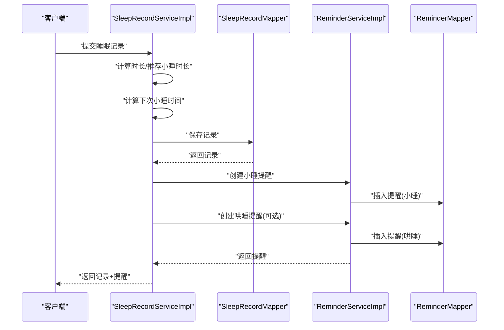
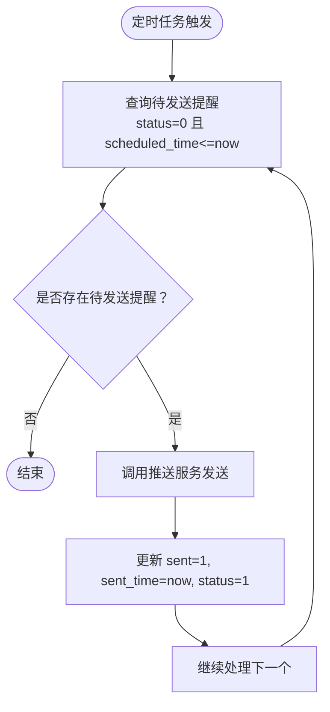
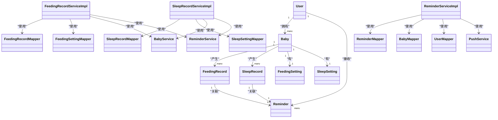

# 数据库设计

<cite>
**本文引用的文件**
- [init.sql](file://backend/src/main/resources/db/init.sql)
- [User.java](file://backend/src/main/java/com/baby/entity/User.java)
- [Baby.java](file://backend/src/main/java/com/baby/entity/Baby.java)
- [FeedingRecord.java](file://backend/src/main/java/com/baby/entity/FeedingRecord.java)
- [SleepRecord.java](file://backend/src/main/java/com/baby/entity/SleepRecord.java)
- [FeedingSetting.java](file://backend/src/main/java/com/baby/entity/FeedingSetting.java)
- [SleepSetting.java](file://backend/src/main/java/com/baby/entity/SleepSetting.java)
- [Reminder.java](file://backend/src/main/java/com/baby/entity/Reminder.java)
- [FeedingRecordServiceImpl.java](file://backend/src/main/java/com/baby/service/impl/FeedingRecordServiceImpl.java)
- [SleepRecordServiceImpl.java](file://backend/src/main/java/com/baby/service/impl/SleepRecordServiceImpl.java)
- [ReminderServiceImpl.java](file://backend/src/main/java/com/baby/service/impl/ReminderServiceImpl.java)
- [FeedingRecordMapper.java](file://backend/src/main/java/com/baby/mapper/FeedingRecordMapper.java)
- [SleepRecordMapper.java](file://backend/src/main/java/com/baby/mapper/SleepRecordMapper.java)
- [ReminderMapper.java](file://backend/src/main/java/com/baby/mapper/ReminderMapper.java)
</cite>

## 目录
1. [简介](#简介)
2. [项目结构](#项目结构)
3. [核心组件](#核心组件)
4. [架构总览](#架构总览)
5. [详细组件分析](#详细组件分析)
6. [依赖关系分析](#依赖关系分析)
7. [性能考量](#性能考量)
8. [故障排查指南](#故障排查指南)
9. [结论](#结论)
10. [附录](#附录)

## 简介
本文件系统化梳理 babyFeedingReminder 应用的数据库设计，覆盖核心表：user、baby、feeding_record、sleep_record、feeding_setting、sleep_setting、reminder。文档从字段定义、主键/外键、约束、索引策略、业务规则（如喂养/睡眠记录与提醒的联动）、统计查询模式、以及时间序列数据的生命周期与性能优化等方面进行深入说明，并提供 ER 图与流程图帮助理解。

## 项目结构
数据库初始化脚本与实体类分别位于后端资源目录与 Java 实体包中，二者共同定义了表结构与 ORM 映射关系。服务层负责业务逻辑与提醒调度，Mapper 层提供统计查询与待处理提醒检索。

图表来源
- [init.sql](file://backend/src/main/resources/db/init.sql#L6-L141)
- [User.java](file://backend/src/main/java/com/baby/entity/User.java#L1-L71)
- [Baby.java](file://backend/src/main/java/com/baby/entity/Baby.java#L1-L72)
- [FeedingRecord.java](file://backend/src/main/java/com/baby/entity/FeedingRecord.java#L1-L81)
- [SleepRecord.java](file://backend/src/main/java/com/baby/entity/SleepRecord.java#L1-L76)
- [FeedingSetting.java](file://backend/src/main/java/com/baby/entity/FeedingSetting.java#L1-L77)
- [SleepSetting.java](file://backend/src/main/java/com/baby/entity/SleepSetting.java#L1-L72)
- [Reminder.java](file://backend/src/main/java/com/baby/entity/Reminder.java#L1-L76)
- [FeedingRecordServiceImpl.java](file://backend/src/main/java/com/baby/service/impl/FeedingRecordServiceImpl.java#L1-L231)
- [SleepRecordServiceImpl.java](file://backend/src/main/java/com/baby/service/impl/SleepRecordServiceImpl.java#L1-L279)
- [ReminderServiceImpl.java](file://backend/src/main/java/com/baby/service/impl/ReminderServiceImpl.java#L1-L242)
- [FeedingRecordMapper.java](file://backend/src/main/java/com/baby/mapper/FeedingRecordMapper.java#L1-L47)
- [SleepRecordMapper.java](file://backend/src/main/java/com/baby/mapper/SleepRecordMapper.java#L1-L48)
- [ReminderMapper.java](file://backend/src/main/java/com/baby/mapper/ReminderMapper.java#L1-L35)

章节来源
- [init.sql](file://backend/src/main/resources/db/init.sql#L6-L141)

## 核心组件
本节对各核心表的字段、类型、约束、索引进行逐项说明，并结合实体类映射关系给出 ORM 字段命名与数据库列名的对应。

- user 表
  - 主键：id（BIGINT AUTO_INCREMENT）
  - 字段要点：username（UNIQUE）、phone（INDEX idx_phone）、apple_id（INDEX idx_apple_id）、status、deleted（逻辑删除）
  - 索引：idx_phone、idx_apple_id
  - 逻辑删除：deleted（TINYINT）

- baby 表
  - 主键：id；外键：user_id 引用 user.id
  - 字段要点：nickname、birth_date、gender、gestational_age、height、weight、head_circumference、avatar_url
  - 索引：idx_user_id
  - 逻辑删除：deleted

- feeding_record 表
  - 主键：id；外键：baby_id 引用 baby.id
  - 字段要点：feeding_type、milk_source、start_time、end_time、amount、duration、next_feeding_time、need_thaw、thaw_reminder_minutes、remark
  - 索引：idx_baby_id、idx_start_time、idx_baby_start(baby_id,start_time)
  - 逻辑删除：deleted

- sleep_record 表
  - 主键：id；外键：baby_id 引用 baby.id
  - 字段要点：sleep_type、start_time（入睡）、end_time（醒来）、duration、planned_duration、next_nap_time、soothing_reminder_minutes、quality、remark
  - 索引：idx_baby_id、idx_start_time、idx_baby_start(baby_id,start_time)
  - 逻辑删除：deleted

- feeding_setting 表
  - 主键：id；唯一约束：baby_id（UNIQUE）
  - 字段要点：default_feeding_type、default_amount、default_duration、default_interval、reminder_start_time、reminder_end_time、reminder_enabled、refrigerated_thaw_minutes、frozen_thaw_minutes
  - 逻辑删除：deleted

- sleep_setting 表
  - 主键：id；唯一约束：baby_id（UNIQUE）
  - 字段要点：default_nap_interval、default_nap_duration、default_soothing_reminder_minutes、reminder_start_time、reminder_end_time、reminder_enabled、bedtime_target、wake_time_target
  - 逻辑删除：deleted

- reminder 表
  - 主键：id；外键：baby_id 引用 baby.id，user_id 引用 user.id
  - 字段要点：reminder_type、title、content、scheduled_time、sent、sent_time、related_record_id、status
  - 索引：idx_user_id、idx_scheduled_time、idx_status、idx_user_status(user_id,status)
  - 逻辑删除：deleted

章节来源
- [init.sql](file://backend/src/main/resources/db/init.sql#L6-L141)
- [User.java](file://backend/src/main/java/com/baby/entity/User.java#L1-L71)
- [Baby.java](file://backend/src/main/java/com/baby/entity/Baby.java#L1-L72)
- [FeedingRecord.java](file://backend/src/main/java/com/baby/entity/FeedingRecord.java#L1-L81)
- [SleepRecord.java](file://backend/src/main/java/com/baby/entity/SleepRecord.java#L1-L76)
- [FeedingSetting.java](file://backend/src/main/java/com/baby/entity/FeedingSetting.java#L1-L77)
- [SleepSetting.java](file://backend/src/main/java/com/baby/entity/SleepSetting.java#L1-L72)
- [Reminder.java](file://backend/src/main/java/com/baby/entity/Reminder.java#L1-L76)

## 架构总览
下图展示核心实体之间的关系与业务流向：记录表通过外键关联到宝宝；设置表为每个宝宝提供默认行为；提醒表根据记录与设置生成并调度。

图表来源
- [init.sql](file://backend/src/main/resources/db/init.sql#L6-L141)
- [User.java](file://backend/src/main/java/com/baby/entity/User.java#L1-L71)
- [Baby.java](file://backend/src/main/java/com/baby/entity/Baby.java#L1-L72)
- [FeedingRecord.java](file://backend/src/main/java/com/baby/entity/FeedingRecord.java#L1-L81)
- [SleepRecord.java](file://backend/src/main/java/com/baby/entity/SleepRecord.java#L1-L76)
- [FeedingSetting.java](file://backend/src/main/java/com/baby/entity/FeedingSetting.java#L1-L77)
- [SleepSetting.java](file://backend/src/main/java/com/baby/entity/SleepSetting.java#L1-L72)
- [Reminder.java](file://backend/src/main/java/com/baby/entity/Reminder.java#L1-L76)

## 详细组件分析

### 喂养记录与设置联动
- 记录生成：服务层在创建喂养记录时计算喂养时长、下次喂奶时间，并根据母乳来源决定是否需要解冻提醒及提前分钟数。
- 提醒创建：若存在下次喂奶时间，将创建“喂奶提醒”；若需要解冻，则额外创建“解冻提醒”，两者均与记录建立关联。
- 设置优先级：若设置了默认间隔，则以设置为准；否则依据月龄参考指南推导推荐间隔。

图表来源
- [FeedingRecordServiceImpl.java](file://backend/src/main/java/com/baby/service/impl/FeedingRecordServiceImpl.java#L48-L114)
- [ReminderServiceImpl.java](file://backend/src/main/java/com/baby/service/impl/ReminderServiceImpl.java#L38-L101)
- [FeedingRecordMapper.java](file://backend/src/main/java/com/baby/mapper/FeedingRecordMapper.java#L1-L47)
- [ReminderMapper.java](file://backend/src/main/java/com/baby/mapper/ReminderMapper.java#L1-L35)

章节来源
- [FeedingRecordServiceImpl.java](file://backend/src/main/java/com/baby/service/impl/FeedingRecordServiceImpl.java#L48-L114)
- [ReminderServiceImpl.java](file://backend/src/main/java/com/baby/service/impl/ReminderServiceImpl.java#L38-L101)

### 睡眠记录与设置联动
- 记录生成：服务层在创建睡眠记录时计算实际睡眠时长，若为小睡则计算下次小睡时间，并设置哄睡提醒分钟数。
- 提醒创建：若存在下次小睡时间，将创建“小睡提醒”；同时根据设置创建“哄睡提醒”。

图表来源
- [SleepRecordServiceImpl.java](file://backend/src/main/java/com/baby/service/impl/SleepRecordServiceImpl.java#L48-L134)
- [ReminderServiceImpl.java](file://backend/src/main/java/com/baby/service/impl/ReminderServiceImpl.java#L103-L164)
- [SleepRecordMapper.java](file://backend/src/main/java/com/baby/mapper/SleepRecordMapper.java#L1-L48)
- [ReminderMapper.java](file://backend/src/main/java/com/baby/mapper/ReminderMapper.java#L1-L35)

章节来源
- [SleepRecordServiceImpl.java](file://backend/src/main/java/com/baby/service/impl/SleepRecordServiceImpl.java#L48-L134)
- [ReminderServiceImpl.java](file://backend/src/main/java/com/baby/service/impl/ReminderServiceImpl.java#L103-L164)

### 提醒调度与发送
- 待发送提醒：定时任务扫描 reminder 表中 status=0 且 scheduled_time 已到达的记录。
- 发送流程：根据 user.device_token 调用推送服务，更新提醒的 sent/sent_time/status 字段。

图表来源
- [ReminderServiceImpl.java](file://backend/src/main/java/com/baby/service/impl/ReminderServiceImpl.java#L213-L242)
- [ReminderMapper.java](file://backend/src/main/java/com/baby/mapper/ReminderMapper.java#L17-L24)

章节来源
- [ReminderServiceImpl.java](file://backend/src/main/java/com/baby/service/impl/ReminderServiceImpl.java#L213-L242)
- [ReminderMapper.java](file://backend/src/main/java/com/baby/mapper/ReminderMapper.java#L17-L24)

### 数据访问模式与索引策略
- 常见查询模式
  - 按宝宝查询当日记录：feeding_record/sleep_record 的 baby_id + start_time 或 (baby_id, start_time) 联合索引
  - 按用户查询当日提醒：reminder 的 user_id + scheduled_time
  - 按状态查询待发送提醒：reminder 的 status + scheduled_time
- 索引策略
  - feeding_record：idx_baby_id、idx_start_time、idx_baby_start(baby_id,start_time)
  - sleep_record：idx_baby_id、idx_start_time、idx_baby_start(baby_id,start_time)
  - reminder：idx_user_id、idx_scheduled_time、idx_status、idx_user_status(user_id,status)
  - user：idx_phone、idx_apple_id
  - baby：idx_user_id
- 统计查询
  - Mapper 提供按日期分组的聚合查询，便于前端展示趋势与概览。

章节来源
- [init.sql](file://backend/src/main/resources/db/init.sql#L21-L23)
- [init.sql](file://backend/src/main/resources/db/init.sql#L40-L41)
- [init.sql](file://backend/src/main/resources/db/init.sql#L60-L63)
- [init.sql](file://backend/src/main/resources/db/init.sql#L81-L84)
- [init.sql](file://backend/src/main/resources/db/init.sql#L137-L141)
- [FeedingRecordMapper.java](file://backend/src/main/java/com/baby/mapper/FeedingRecordMapper.java#L18-L30)
- [SleepRecordMapper.java](file://backend/src/main/java/com/baby/mapper/SleepRecordMapper.java#L18-L30)
- [ReminderMapper.java](file://backend/src/main/java/com/baby/mapper/ReminderMapper.java#L17-L33)

### 数据验证与业务规则
- 时间字段
  - start_time/end_time 必须满足 end_time >= start_time（由服务层计算时长时保证）
  - next_feeding_time/next_nap_time 基于月龄参考指南与用户设置推导
- 类型枚举
  - feeding_type、sleep_type、milk_source、quality 等使用 TINYINT 枚举值，需在服务层转换为语义明确的业务含义
- 逻辑删除
  - 所有表均支持 deleted 字段，查询时应过滤 deleted=0
- 提醒关联
  - related_record_id 指向具体记录 ID，用于取消或更新相关提醒

章节来源
- [FeedingRecordServiceImpl.java](file://backend/src/main/java/com/baby/service/impl/FeedingRecordServiceImpl.java#L48-L114)
- [SleepRecordServiceImpl.java](file://backend/src/main/java/com/baby/service/impl/SleepRecordServiceImpl.java#L48-L134)
- [ReminderServiceImpl.java](file://backend/src/main/java/com/baby/service/impl/ReminderServiceImpl.java#L190-L211)

### 数据生命周期与历史保留策略
- 逻辑删除：所有表均包含 deleted 字段，采用软删除策略，不物理删除数据，便于审计与历史分析
- 历史保留：建议按月/季度归档旧数据，保留关键统计字段与必要明细，以平衡存储成本与分析需求
- 统计口径：通过 Mapper 的按日聚合查询，支持跨期对比与趋势分析

章节来源
- [init.sql](file://backend/src/main/resources/db/init.sql#L17-L20)
- [init.sql](file://backend/src/main/resources/db/init.sql#L39-L41)
- [init.sql](file://backend/src/main/resources/db/init.sql#L59-L63)
- [init.sql](file://backend/src/main/resources/db/init.sql#L80-L84)
- [init.sql](file://backend/src/main/resources/db/init.sql#L99-L102)
- [init.sql](file://backend/src/main/resources/db/init.sql#L117-L119)
- [init.sql](file://backend/src/main/resources/db/init.sql#L134-L141)
- [FeedingRecordMapper.java](file://backend/src/main/java/com/baby/mapper/FeedingRecordMapper.java#L18-L30)
- [SleepRecordMapper.java](file://backend/src/main/java/com/baby/mapper/SleepRecordMapper.java#L18-L30)

## 依赖关系分析
- 实体依赖
  - FeedingRecord、SleepRecord、Reminder 依赖 Baby；Reminder 还依赖 User
  - FeedingSetting、SleepSetting 依赖 Baby
- 服务依赖
  - FeedingRecordServiceImpl 依赖 FeedingSettingMapper、BabyService、ReminderService
  - SleepRecordServiceImpl 依赖 SleepSettingMapper、BabyService、ReminderService
  - ReminderServiceImpl 依赖 ReminderMapper、BabyMapper、UserMapper、PushService
- Mapper 依赖
  - FeedingRecordMapper、SleepRecordMapper、ReminderMapper 均继承 MyBatis-Plus 基础 Mapper

图表来源
- [User.java](file://backend/src/main/java/com/baby/entity/User.java#L1-L71)
- [Baby.java](file://backend/src/main/java/com/baby/entity/Baby.java#L1-L72)
- [FeedingRecord.java](file://backend/src/main/java/com/baby/entity/FeedingRecord.java#L1-L81)
- [SleepRecord.java](file://backend/src/main/java/com/baby/entity/SleepRecord.java#L1-L76)
- [FeedingSetting.java](file://backend/src/main/java/com/baby/entity/FeedingSetting.java#L1-L77)
- [SleepSetting.java](file://backend/src/main/java/com/baby/entity/SleepSetting.java#L1-L72)
- [Reminder.java](file://backend/src/main/java/com/baby/entity/Reminder.java#L1-L76)
- [FeedingRecordServiceImpl.java](file://backend/src/main/java/com/baby/service/impl/FeedingRecordServiceImpl.java#L1-L231)
- [SleepRecordServiceImpl.java](file://backend/src/main/java/com/baby/service/impl/SleepRecordServiceImpl.java#L1-L279)
- [ReminderServiceImpl.java](file://backend/src/main/java/com/baby/service/impl/ReminderServiceImpl.java#L1-L242)
- [FeedingRecordMapper.java](file://backend/src/main/java/com/baby/mapper/FeedingRecordMapper.java#L1-L47)
- [SleepRecordMapper.java](file://backend/src/main/java/com/baby/mapper/SleepRecordMapper.java#L1-L48)
- [ReminderMapper.java](file://backend/src/main/java/com/baby/mapper/ReminderMapper.java#L1-L35)

## 性能考量
- 索引命中
  - 高频查询条件：baby_id、start_time、scheduled_time、status、user_id
  - 建议确保联合索引 idx_baby_start 在时间范围查询中有效
- 时间序列热点
  - feeding_record/sleep_record 为高频写入表，建议按天/周分区或定期归档
- 统计查询
  - 使用 Mapper 的按日聚合查询减少复杂 JOIN，提升报表性能
- 提醒调度
  - 定时任务每分钟扫描一次，建议配合合适的索引与 LIMIT 控制单次处理量

章节来源
- [init.sql](file://backend/src/main/resources/db/init.sql#L60-L63)
- [init.sql](file://backend/src/main/resources/db/init.sql#L81-L84)
- [init.sql](file://backend/src/main/resources/db/init.sql#L137-L141)
- [FeedingRecordMapper.java](file://backend/src/main/java/com/baby/mapper/FeedingRecordMapper.java#L18-L30)
- [SleepRecordMapper.java](file://backend/src/main/java/com/baby/mapper/SleepRecordMapper.java#L18-L30)
- [ReminderServiceImpl.java](file://backend/src/main/java/com/baby/service/impl/ReminderServiceImpl.java#L234-L242)

## 故障排查指南
- 提醒未发送
  - 检查 reminder.status 是否为 0 且 scheduled_time 是否已到达
  - 检查 user.device_token 是否存在
- 记录统计异常
  - 确认 deleted=0 条件是否生效
  - 检查按日聚合 SQL 的日期边界
- 逻辑删除误删
  - 若误删，可通过恢复 deleted=0 并重建索引/视图

章节来源
- [ReminderServiceImpl.java](file://backend/src/main/java/com/baby/service/impl/ReminderServiceImpl.java#L190-L211)
- [ReminderMapper.java](file://backend/src/main/java/com/baby/mapper/ReminderMapper.java#L17-L33)
- [FeedingRecordMapper.java](file://backend/src/main/java/com/baby/mapper/FeedingRecordMapper.java#L18-L30)
- [SleepRecordMapper.java](file://backend/src/main/java/com/baby/mapper/SleepRecordMapper.java#L18-L30)

## 结论
本设计以清晰的实体关系与完善的索引策略支撑喂养与睡眠两大核心场景，结合设置表与提醒表实现了“记录—设置—提醒”的闭环。通过逻辑删除与统计查询接口，兼顾了数据完整性与分析能力。建议在生产环境中进一步完善分区与归档策略，保障时间序列数据的长期可维护性与查询性能。

## 附录
- 示例数据场景
  - 场景一：新增喂养记录
    - 输入：baby_id、start_time、end_time、feeding_type、milk_source
    - 输出：记录、下次喂奶时间、可能的解冻提醒
  - 场景二：新增睡眠记录（小睡）
    - 输入：baby_id、start_time、end_time、sleep_type
    - 输出：记录、下次小睡时间、小睡提醒、哄睡提醒
  - 场景三：查看今日提醒
    - 输入：user_id
    - 输出：当日待发送提醒列表

章节来源
- [FeedingRecordServiceImpl.java](file://backend/src/main/java/com/baby/service/impl/FeedingRecordServiceImpl.java#L116-L141)
- [SleepRecordServiceImpl.java](file://backend/src/main/java/com/baby/service/impl/SleepRecordServiceImpl.java#L160-L184)
- [ReminderServiceImpl.java](file://backend/src/main/java/com/baby/service/impl/ReminderServiceImpl.java#L166-L181)