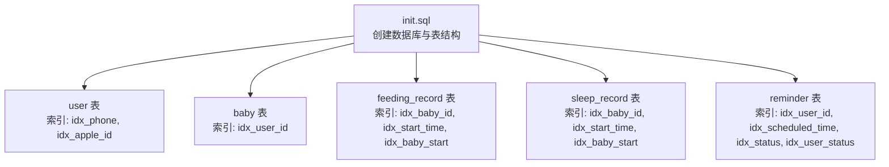
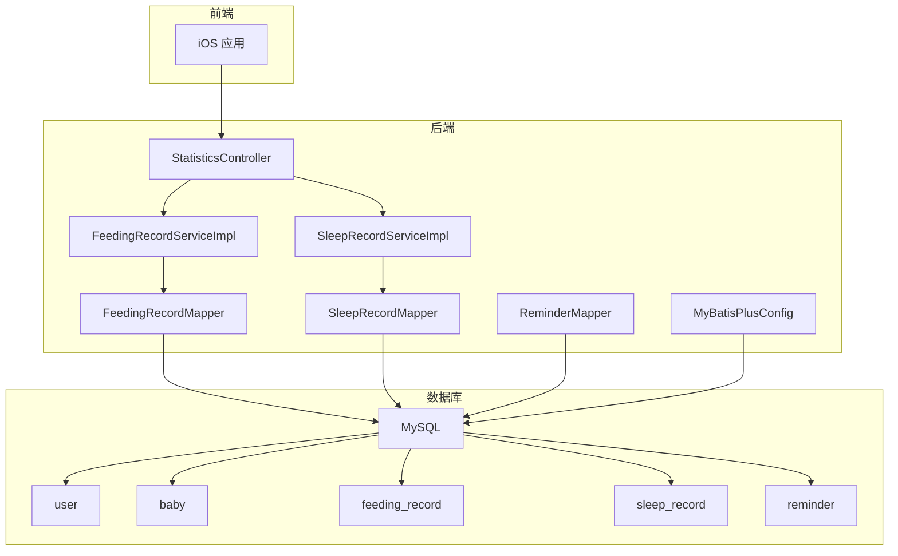
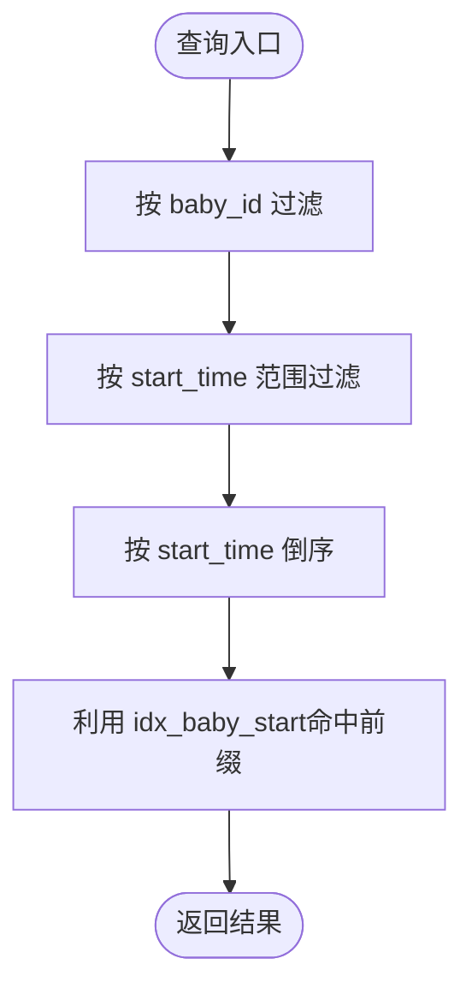
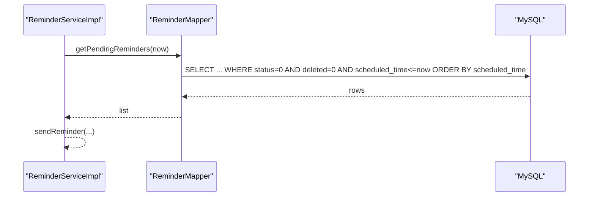
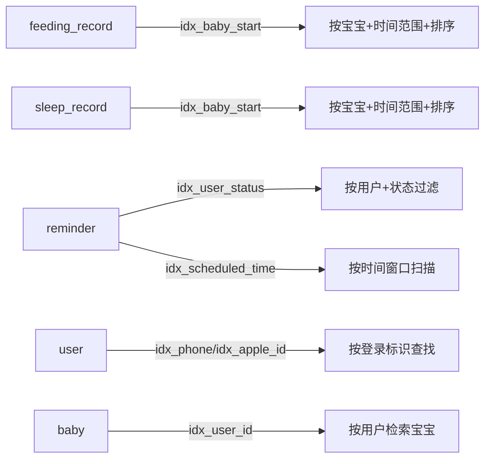

# 索引策略

<cite>
**本文引用的文件**
- [init.sql](file://backend/src/main/resources/db/init.sql)
- [FeedingRecordMapper.java](file://backend/src/main/java/com/baby/mapper/FeedingRecordMapper.java)
- [SleepRecordMapper.java](file://backend/src/main/java/com/baby/mapper/SleepRecordMapper.java)
- [FeedingRecordServiceImpl.java](file://backend/src/main/java/com/baby/service/impl/FeedingRecordServiceImpl.java)
- [SleepRecordServiceImpl.java](file://backend/src/main/java/com/baby/service/impl/SleepRecordServiceImpl.java)
- [ReminderMapper.java](file://backend/src/main/java/com/baby/mapper/ReminderMapper.java)
- [ReminderServiceImpl.java](file://backend/src/main/java/com/baby/service/impl/ReminderServiceImpl.java)
- [StatisticsController.java](file://backend/src/main/java/com/baby/controller/StatisticsController.java)
- [MyBatisPlusConfig.java](file://backend/src/main/java/com/baby/config/MyBatisPlusConfig.java)
- [User.java](file://backend/src/main/java/com/baby/entity/User.java)
- [Baby.java](file://backend/src/main/java/com/baby/entity/Baby.java)
- [FeedingRecord.java](file://backend/src/main/java/com/baby/entity/FeedingRecord.java)
- [SleepRecord.java](file://backend/src/main/java/com/baby/entity/SleepRecord.java)
- [Reminder.java](file://backend/src/main/java/com/baby/entity/Reminder.java)
</cite>

## 目录
1. [简介](#简介)
2. [项目结构与数据库初始化](#项目结构与数据库初始化)
3. [核心组件与索引总览](#核心组件与索引总览)
4. [架构概览](#架构概览)
5. [详细组件分析](#详细组件分析)
6. [依赖关系分析](#依赖关系分析)
7. [性能考量](#性能考量)
8. [故障排查指南](#故障排查指南)
9. [结论](#结论)
10. [附录](#附录)

## 简介
本文件系统性梳理 babyFeedingReminder 数据库的索引策略，聚焦 init.sql 中定义的所有索引，包括单列索引与复合索引，并结合后端查询模式（如按宝宝、按时间范围、按状态等）进行优化动机与性能影响分析。同时给出面向未来的索引建议与监控策略，帮助持续评估索引有效性与识别潜在的慢查询。

## 项目结构与数据库初始化
- 数据库初始化脚本位于 backend/src/main/resources/db/init.sql，涵盖用户、宝宝、喂养记录、睡眠记录、提醒任务等表，并为关键字段建立索引。
- 后端通过 MyBatis-Plus 的 Mapper 接口与 Service 层实现读取与统计分析，统计接口依赖于按时间范围与用户维度的查询能力。

图表来源
- [init.sql](file://backend/src/main/resources/db/init.sql#L1-L147)

章节来源
- [init.sql](file://backend/src/main/resources/db/init.sql#L1-L147)

## 核心组件与索引总览
- user 表
  - 单列索引：idx_phone、idx_apple_id（支持手机号/Apple 登录标识快速查找）
- baby 表
  - 单列索引：idx_user_id（支持按用户维度检索其所有宝宝）
- feeding_record 表
  - 单列索引：idx_baby_id、idx_start_time
  - 复合索引：idx_baby_start（baby_id + start_time）
- sleep_record 表
  - 单列索引：idx_baby_id、idx_start_time
  - 复合索引：idx_baby_start（baby_id + start_time）
- reminder 表
  - 单列索引：idx_user_id、idx_scheduled_time、idx_status
  - 复合索引：idx_user_status（user_id + status）

章节来源
- [init.sql](file://backend/src/main/resources/db/init.sql#L1-L147)

## 架构概览
后端通过 MyBatis-Plus 的 Mapper 与 Service 层执行查询，统计分析由 StatisticsController 触发，调用 FeedingRecordMapper 与 SleepRecordMapper 的统计方法，以及 Service 层的按日期范围与用户维度查询。

图表来源
- [StatisticsController.java](file://backend/src/main/java/com/baby/controller/StatisticsController.java#L1-L134)
- [FeedingRecordServiceImpl.java](file://backend/src/main/java/com/baby/service/impl/FeedingRecordServiceImpl.java#L118-L147)
- [SleepRecordServiceImpl.java](file://backend/src/main/java/com/baby/service/impl/SleepRecordServiceImpl.java#L152-L187)
- [FeedingRecordMapper.java](file://backend/src/main/java/com/baby/mapper/FeedingRecordMapper.java#L1-L46)
- [SleepRecordMapper.java](file://backend/src/main/java/com/baby/mapper/SleepRecordMapper.java#L1-L47)
- [ReminderMapper.java](file://backend/src/main/java/com/baby/mapper/ReminderMapper.java#L1-L34)
- [MyBatisPlusConfig.java](file://backend/src/main/java/com/baby/config/MyBatisPlusConfig.java#L1-L47)
- [init.sql](file://backend/src/main/resources/db/init.sql#L1-L147)

## 详细组件分析

### 喂养记录表（feeding_record）索引分析
- 单列索引
  - idx_baby_id：支撑按宝宝维度检索喂养记录，常见于“今日喂养列表”“按宝宝统计”等场景。
  - idx_start_time：支撑按时间范围检索喂养记录，常见于“按日期范围统计”“今日喂养统计”等场景。
- 复合索引 idx_baby_start（baby_id, start_time）
  - 优化“按宝宝 + 时间顺序”的查询，典型场景：
    - 获取某宝宝今日的喂养记录（按开始时间倒序）
    - 获取某宝宝指定日期范围内的喂养记录（按开始时间倒序）
  - 由于查询中包含 ORDER BY start_time，复合索引可避免额外排序开销，提升性能。

图表来源
- [FeedingRecordServiceImpl.java](file://backend/src/main/java/com/baby/service/impl/FeedingRecordServiceImpl.java#L118-L147)
- [FeedingRecordMapper.java](file://backend/src/main/java/com/baby/mapper/FeedingRecordMapper.java#L1-L46)
- [init.sql](file://backend/src/main/resources/db/init.sql#L43-L63)

章节来源
- [FeedingRecordServiceImpl.java](file://backend/src/main/java/com/baby/service/impl/FeedingRecordServiceImpl.java#L118-L147)
- [FeedingRecordMapper.java](file://backend/src/main/java/com/baby/mapper/FeedingRecordMapper.java#L1-L46)
- [FeedingRecord.java](file://backend/src/main/java/com/baby/entity/FeedingRecord.java#L1-L80)
- [init.sql](file://backend/src/main/resources/db/init.sql#L43-L63)

### 睡眠记录表（sleep_record）索引分析
- 单列索引
  - idx_baby_id：支撑按宝宝维度检索睡眠记录。
  - idx_start_time：支撑按时间范围检索睡眠记录。
- 复合索引 idx_baby_start（baby_id, start_time）
  - 优化“按宝宝 + 时间顺序”的查询，典型场景：
    - 获取某宝宝今日的睡眠记录（按开始时间倒序）
    - 获取某宝宝指定日期范围内的睡眠记录（按开始时间倒序）

图表来源
- [SleepRecordServiceImpl.java](file://backend/src/main/java/com/baby/service/impl/SleepRecordServiceImpl.java#L152-L187)
- [SleepRecordMapper.java](file://backend/src/main/java/com/baby/mapper/SleepRecordMapper.java#L1-L47)
- [init.sql](file://backend/src/main/resources/db/init.sql#L65-L84)

章节来源
- [SleepRecordServiceImpl.java](file://backend/src/main/java/com/baby/service/impl/SleepRecordServiceImpl.java#L152-L187)
- [SleepRecordMapper.java](file://backend/src/main/java/com/baby/mapper/SleepRecordMapper.java#L1-L47)
- [SleepRecord.java](file://backend/src/main/java/com/baby/entity/SleepRecord.java#L1-L75)
- [init.sql](file://backend/src/main/resources/db/init.sql#L65-L84)

### 提醒任务表（reminder）索引分析
- 单列索引
  - idx_user_id：支撑按用户维度检索提醒任务。
  - idx_scheduled_time：支撑“待发送提醒”的时间窗口扫描。
  - idx_status：支撑按状态过滤（如待发送、已取消等）。
- 复合索引 idx_user_status（user_id, status）
  - 优化“按用户 + 状态”的组合过滤，典型场景：
    - 获取用户今日待发送的提醒（按 scheduled_time 排序）
    - 查询待发送提醒（按 scheduled_time 排序）

图表来源
- [ReminderServiceImpl.java](file://backend/src/main/java/com/baby/service/impl/ReminderServiceImpl.java#L166-L186)
- [ReminderMapper.java](file://backend/src/main/java/com/baby/mapper/ReminderMapper.java#L1-L34)
- [init.sql](file://backend/src/main/resources/db/init.sql#L121-L145)

章节来源
- [ReminderServiceImpl.java](file://backend/src/main/java/com/baby/service/impl/ReminderServiceImpl.java#L166-L186)
- [ReminderMapper.java](file://backend/src/main/java/com/baby/mapper/ReminderMapper.java#L1-L34)
- [Reminder.java](file://backend/src/main/java/com/baby/entity/Reminder.java#L1-L75)
- [init.sql](file://backend/src/main/resources/db/init.sql#L121-L145)

### 用户与宝宝表索引分析
- user 表
  - idx_phone、idx_apple_id：支持手机号/Apple 登录标识快速定位用户，减少全表扫描。
- baby 表
  - idx_user_id：支持按用户维度检索其所有宝宝，便于用户级数据聚合。

章节来源
- [User.java](file://backend/src/main/java/com/baby/entity/User.java#L1-L70)
- [Baby.java](file://backend/src/main/java/com/baby/entity/Baby.java#L1-L71)
- [init.sql](file://backend/src/main/resources/db/init.sql#L1-L41)

## 依赖关系分析
- 查询模式与索引匹配
  - 按宝宝维度 + 时间范围 + 排序：feeding_record/sleep_record 的 idx_baby_start 可覆盖过滤、范围扫描与排序。
  - 按用户维度 + 状态 + 时间：reminder 的 idx_user_status + idx_status + idx_scheduled_time 可覆盖过滤与排序。
  - 按用户维度 + 时间：reminder 的 idx_user_id + idx_scheduled_time 可覆盖过滤与排序。
- 写入开销
  - 索引越多，INSERT/UPDATE/DELETE 的写入成本越高；需权衡高频读取与写入频率。
- 逻辑删除字段 deleted
  - 所有表均包含 deleted 字段，查询中普遍带有 deleted=0 条件，建议在涉及 deleted 的查询中优先使用复合索引以减少回表与过滤成本。

图表来源
- [init.sql](file://backend/src/main/resources/db/init.sql#L1-L147)
- [FeedingRecordServiceImpl.java](file://backend/src/main/java/com/baby/service/impl/FeedingRecordServiceImpl.java#L118-L147)
- [SleepRecordServiceImpl.java](file://backend/src/main/java/com/baby/service/impl/SleepRecordServiceImpl.java#L152-L187)
- [ReminderServiceImpl.java](file://backend/src/main/java/com/baby/service/impl/ReminderServiceImpl.java#L166-L186)

## 性能考量
- 读性能优化
  - idx_baby_start 在按宝宝 + 时间范围 + 排序的场景中可显著降低排序与回表成本。
  - idx_user_status 在按用户 + 状态过滤的场景中可减少额外排序与过滤。
  - idx_scheduled_time 支撑“待发送提醒”的高效扫描。
- 写性能影响
  - 索引会增加 INSERT/UPDATE/DELETE 的维护成本；应结合业务写入频率评估必要性。
- 选择性与基数
  - 高选择性的列（如主键、唯一索引）通常收益更大；低选择性列（如 status=0）建议配合其他列形成复合索引。
- 逻辑删除与统计
  - 统计查询普遍包含 deleted=0 条件，建议在统计相关查询中优先使用复合索引，减少回表与过滤。

[本节为通用性能讨论，不直接分析具体文件，故无章节来源]

## 故障排查指南
- 慢查询定位
  - 使用数据库慢查询日志与执行计划（EXPLAIN）定位未命中索引或回表过多的查询。
  - 关注涉及 deleted=0、按时间范围、按用户/宝宝维度的查询。
- 常见问题
  - ORDER BY 未命中索引前缀：确保查询条件与排序列顺序与复合索引一致。
  - 低选择性列导致索引失效：对 status 等列建议与用户/宝宝维度组合成复合索引。
- 监控建议
  - 定期审查慢查询日志，识别新增热点查询。
  - 对统计接口（按天分组、按日期范围统计）进行压测，观察索引命中率与响应时间。

[本节为通用排查建议，不直接分析具体文件，故无章节来源]

## 结论
当前索引策略围绕高频访问模式（按宝宝、按时间范围、按用户+状态）进行了针对性设计，idx_baby_start、idx_user_status、idx_scheduled_time 等复合与单列索引有效支撑了应用的核心查询路径。建议在保持现有索引的基础上，结合业务增长与查询模式变化，持续评估并优化索引组合，确保读写平衡与长期可维护性。

[本节为总结性内容，不直接分析具体文件，故无章节来源]

## 附录

### 查询模式与索引匹配清单
- 喂养记录
  - 今日列表：按 baby_id + start_time 倒序 → idx_baby_start
  - 按日期范围统计：按 baby_id + start_time 范围 + 分组 → idx_baby_start
  - 今日总量/次数：按 baby_id + start_time=CURDATE → idx_baby_start
- 睡眠记录
  - 今日列表：按 baby_id + start_time 倒序 → idx_baby_start
  - 按日期范围统计：按 baby_id + start_time 范围 + 分组 → idx_baby_start
  - 今日小睡次数：按 baby_id + sleep_type=1 + start_time=CURDATE → idx_baby_start
- 提醒任务
  - 待发送提醒扫描：按 status=0 + scheduled_time<=now → idx_status + idx_scheduled_time
  - 用户今日待发送：按 user_id + status=0 + scheduled_time=CURDATE → idx_user_status + idx_scheduled_time
- 用户/宝宝
  - 按手机号/Apple 登录标识查找：idx_phone、idx_apple_id
  - 按用户检索宝宝：idx_user_id

章节来源
- [FeedingRecordMapper.java](file://backend/src/main/java/com/baby/mapper/FeedingRecordMapper.java#L1-L46)
- [SleepRecordMapper.java](file://backend/src/main/java/com/baby/mapper/SleepRecordMapper.java#L1-L47)
- [ReminderMapper.java](file://backend/src/main/java/com/baby/mapper/ReminderMapper.java#L1-L34)
- [FeedingRecordServiceImpl.java](file://backend/src/main/java/com/baby/service/impl/FeedingRecordServiceImpl.java#L118-L147)
- [SleepRecordServiceImpl.java](file://backend/src/main/java/com/baby/service/impl/SleepRecordServiceImpl.java#L152-L187)
- [ReminderServiceImpl.java](file://backend/src/main/java/com/baby/service/impl/ReminderServiceImpl.java#L166-L186)
- [StatisticsController.java](file://backend/src/main/java/com/baby/controller/StatisticsController.java#L1-L134)
- [init.sql](file://backend/src/main/resources/db/init.sql#L1-L147)

### 未来索引建议（基于潜在工作负载）
- 喂养记录
  - 若存在按 feeding_type 或 milk_source 的过滤需求，可考虑复合索引（如 idx_baby_feeding_type/start_time），但需评估写入成本与查询收益。
- 睡眠记录
  - 若存在按 sleep_type 的过滤需求，可考虑复合索引（如 idx_baby_sleep_type/start_time）。
- 提醒任务
  - 若存在按 reminder_type 的过滤需求，可考虑复合索引（如 idx_user_reminder_type/status）。
- 通用建议
  - 对于 low-selectivity 列（如 status、deleted），优先与高选择性列（user_id、baby_id）组成复合索引，避免单独为低选择性列建索引。
  - 对于频繁的统计查询（按日期分组），确保复合索引能够覆盖过滤、范围扫描与排序，减少回表与临时表。

[本节为通用建议，不直接分析具体文件，故无章节来源]