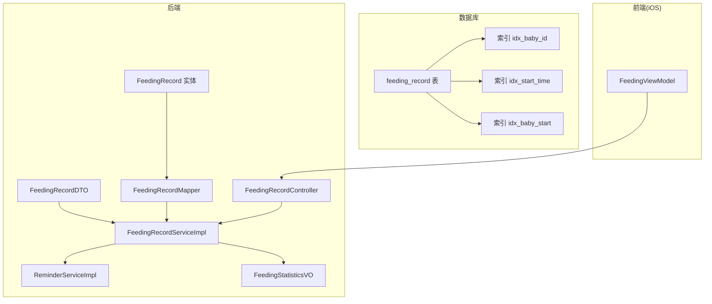
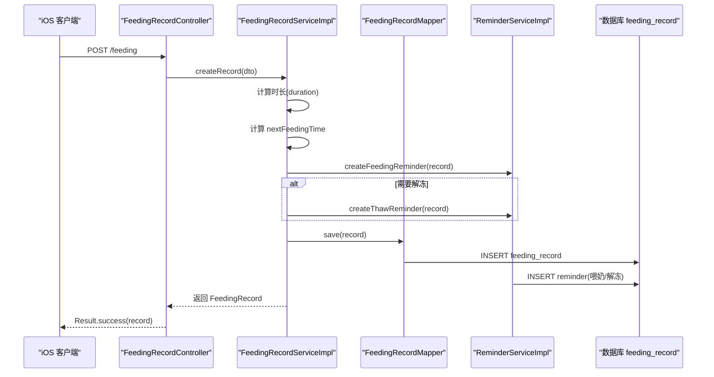
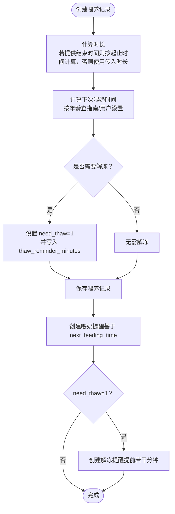
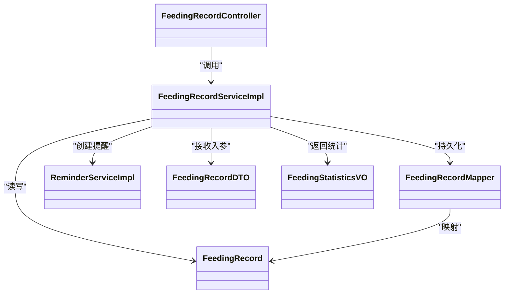

# 喂养记录表 (feeding_record)

<cite>
**本文引用的文件**
- [init.sql](file://backend/src/main/resources/db/init.sql)
- [FeedingRecord.java](file://backend/src/main/java/com/baby/entity/FeedingRecord.java)
- [FeedingRecordDTO.java](file://backend/src/main/java/com/baby/dto/FeedingRecordDTO.java)
- [FeedingRecordMapper.java](file://backend/src/main/java/com/baby/mapper/FeedingRecordMapper.java)
- [FeedingRecordServiceImpl.java](file://backend/src/main/java/com/baby/service/impl/FeedingRecordServiceImpl.java)
- [ReminderServiceImpl.java](file://backend/src/main/java/com/baby/service/impl/ReminderServiceImpl.java)
- [FeedingRecordController.java](file://backend/src/main/java/com/baby/controller/FeedingRecordController.java)
- [FeedingStatisticsVO.java](file://backend/src/main/java/com/baby/vo/FeedingStatisticsVO.java)
- [FeedingViewModel.swift](file://ios/BabyFeedingReminder/ViewModels/FeedingViewModel.swift)
</cite>

## 目录
1. [简介](#简介)
2. [项目结构定位](#项目结构定位)
3. [核心组件](#核心组件)
4. [架构概览](#架构概览)
5. [详细字段说明与业务逻辑](#详细字段说明与业务逻辑)
6. [依赖关系分析](#依赖关系分析)
7. [性能与索引设计](#性能与索引设计)
8. [时区与时长计算注意事项](#时区与时长计算注意事项)
9. [示例数据与场景](#示例数据与场景)
10. [故障排查](#故障排查)
11. [结论](#结论)

## 简介
本文件系统性梳理 babyFeedingReminder 系统中“喂养记录表（feeding_record）”的设计与实现，覆盖字段语义、业务逻辑（智能排程与解冻提醒）、统计分析、索引与性能考量，并对 iOS 端时间格式与后端实体映射进行说明。文档同时给出跨参考，将数据库表结构与 Java 实体、DTO、Mapper、Service、Controller、VO 以及 iOS 视图模型串联起来，帮助开发者快速理解与维护。

## 项目结构定位
- 数据库初始化脚本定义了 feeding_record 表结构及索引。
- Java 层通过 MyBatis-Plus 的实体类、Mapper、Service、Controller 与 VO 完成 CRUD、统计与提醒集成。
- iOS 端以 Asia/Shanghai 时区格式化时间，与后端 LocalDateTime 字段对接。

图表来源
- [init.sql](file://backend/src/main/resources/db/init.sql#L43-L63)
- [FeedingRecord.java](file://backend/src/main/java/com/baby/entity/FeedingRecord.java#L1-L80)
- [FeedingRecordDTO.java](file://backend/src/main/java/com/baby/dto/FeedingRecordDTO.java#L1-L52)
- [FeedingRecordMapper.java](file://backend/src/main/java/com/baby/mapper/FeedingRecordMapper.java#L1-L46)
- [FeedingRecordServiceImpl.java](file://backend/src/main/java/com/baby/service/impl/FeedingRecordServiceImpl.java#L47-L230)
- [ReminderServiceImpl.java](file://backend/src/main/java/com/baby/service/impl/ReminderServiceImpl.java#L37-L101)
- [FeedingRecordController.java](file://backend/src/main/java/com/baby/controller/FeedingRecordController.java#L1-L112)
- [FeedingStatisticsVO.java](file://backend/src/main/java/com/baby/vo/FeedingStatisticsVO.java#L1-L75)
- [FeedingViewModel.swift](file://ios/BabyFeedingReminder/ViewModels/FeedingViewModel.swift#L54-L60)

章节来源
- [init.sql](file://backend/src/main/resources/db/init.sql#L43-L63)
- [FeedingRecord.java](file://backend/src/main/java/com/baby/entity/FeedingRecord.java#L1-L80)
- [FeedingRecordDTO.java](file://backend/src/main/java/com/baby/dto/FeedingRecordDTO.java#L1-L52)
- [FeedingRecordMapper.java](file://backend/src/main/java/com/baby/mapper/FeedingRecordMapper.java#L1-L46)
- [FeedingRecordServiceImpl.java](file://backend/src/main/java/com/baby/service/impl/FeedingRecordServiceImpl.java#L47-L230)
- [ReminderServiceImpl.java](file://backend/src/main/java/com/baby/service/impl/ReminderServiceImpl.java#L37-L101)
- [FeedingRecordController.java](file://backend/src/main/java/com/baby/controller/FeedingRecordController.java#L1-L112)
- [FeedingStatisticsVO.java](file://backend/src/main/java/com/baby/vo/FeedingStatisticsVO.java#L1-L75)
- [FeedingViewModel.swift](file://ios/BabyFeedingReminder/ViewModels/FeedingViewModel.swift#L54-L60)

## 核心组件
- 实体层：FeedingRecord 映射 feeding_record 表，包含所有字段与逻辑删除注解。
- DTO 层：FeedingRecordDTO 作为请求入参载体，含必填字段与可选字段。
- Mapper 层：FeedingRecordMapper 提供按日期聚合统计的 SQL 查询。
- Service 层：FeedingRecordServiceImpl 负责创建/更新记录、计算下次喂奶时间、生成提醒、统计分析。
- Controller 层：FeedingRecordController 提供 REST 接口，支持查询、统计与推荐。
- VO 层：FeedingStatisticsVO 输出统计结果。
- iOS 层：FeedingViewModel 使用 Asia/Shanghai 时区格式化时间，与后端 LocalDateTime 对接。

章节来源
- [FeedingRecord.java](file://backend/src/main/java/com/baby/entity/FeedingRecord.java#L1-L80)
- [FeedingRecordDTO.java](file://backend/src/main/java/com/baby/dto/FeedingRecordDTO.java#L1-L52)
- [FeedingRecordMapper.java](file://backend/src/main/java/com/baby/mapper/FeedingRecordMapper.java#L1-L46)
- [FeedingRecordServiceImpl.java](file://backend/src/main/java/com/baby/service/impl/FeedingRecordServiceImpl.java#L47-L230)
- [FeedingRecordController.java](file://backend/src/main/java/com/baby/controller/FeedingRecordController.java#L1-L112)
- [FeedingStatisticsVO.java](file://backend/src/main/java/com/baby/vo/FeedingStatisticsVO.java#L1-L75)
- [FeedingViewModel.swift](file://ios/BabyFeedingReminder/ViewModels/FeedingViewModel.swift#L54-L60)

## 架构概览
下面的序列图展示“创建喂养记录”的完整流程，包括时长计算、下次喂奶时间推算、提醒创建与解冻提醒联动。

图表来源
- [FeedingRecordController.java](file://backend/src/main/java/com/baby/controller/FeedingRecordController.java#L33-L46)
- [FeedingRecordServiceImpl.java](file://backend/src/main/java/com/baby/service/impl/FeedingRecordServiceImpl.java#L48-L90)
- [ReminderServiceImpl.java](file://backend/src/main/java/com/baby/service/impl/ReminderServiceImpl.java#L37-L101)
- [FeedingRecordMapper.java](file://backend/src/main/java/com/baby/mapper/FeedingRecordMapper.java#L1-L16)
- [init.sql](file://backend/src/main/resources/db/init.sql#L43-L63)

## 详细字段说明与业务逻辑

### 字段总览与含义
- id：自增主键
- baby_id：关联宝宝标识
- feeding_type：喂养类型（1-母乳，2-奶粉，3-混合喂养）
- milk_source：母乳来源（1-亲喂，2-冷藏，3-冷冻）
- start_time：开始时间（DATETIME）
- end_time：结束时间（DATETIME）
- amount：奶量（毫升，INT）
- duration：喂养时长（分钟，INT）
- next_feeding_time：下次喂奶预计时间（DATETIME）
- need_thaw：是否需要提前解冻（TINYINT，0/1）
- thaw_reminder_minutes：解冻提醒提前分钟数（INT）
- remark：备注（TEXT）
- create_time：创建时间（DATETIME）
- update_time：更新时间（DATETIME）
- deleted：逻辑删除（TINYINT，0/1）

章节来源
- [init.sql](file://backend/src/main/resources/db/init.sql#L43-L63)
- [FeedingRecord.java](file://backend/src/main/java/com/baby/entity/FeedingRecord.java#L14-L80)

### 字段与业务逻辑详解
- feeding_type（1-母乳，2-奶粉，3-混合喂养）
  - 用于统计分析喂养类型占比，支撑“母乳/奶粉/混合”比例计算。
  - 在统计接口中按类型分组计数，输出喂养类型比例。
- milk_source（1-亲喂，2-冷藏，3-冷冻）
  - 与 need_thaw、thaw_reminder_minutes 协作，触发解冻提醒。
  - iOS 端在非奶粉场景下才允许选择 milk_source。
- start_time、end_time
  - 若提供 end_time，则自动计算 duration；否则使用传入的 duration。
  - 用于当日/区间查询、统计与提醒调度。
- amount、duration
  - amount 用于总量与日均统计；duration 用于时长分析。
- next_feeding_time
  - 基于当前喂养时间与年龄/设置推算，驱动智能提醒。
  - 由 Service 层根据国家卫健委指南与用户设置计算。
- need_thaw、thaw_reminder_minutes
  - 当 milk_source 为冷藏/冷冻时，need_thaw=1，并设置解冻提醒提前分钟数。
  - 解冻提醒在 next_feeding_time 前若干分钟创建，避免错过喂奶。
- remark、create_time、update_time、deleted
  - remark 便于记录特殊情况；create/update_time 由框架填充；
  - deleted 支持软删除，配合 MyBatis-Plus 的逻辑删除注解。

章节来源
- [FeedingRecordServiceImpl.java](file://backend/src/main/java/com/baby/service/impl/FeedingRecordServiceImpl.java#L48-L90)
- [ReminderServiceImpl.java](file://backend/src/main/java/com/baby/service/impl/ReminderServiceImpl.java#L37-L101)
- [FeedingRecord.java](file://backend/src/main/java/com/baby/entity/FeedingRecord.java#L14-L80)
- [FeedingRecordDTO.java](file://backend/src/main/java/com/baby/dto/FeedingRecordDTO.java#L1-L52)
- [FeedingViewModel.swift](file://ios/BabyFeedingReminder/ViewModels/FeedingViewModel.swift#L133-L141)

### 智能排程与提醒联动
- nextFeedingTime 推算
  - 依据婴儿月龄查国家卫健委指南，得到推荐间隔（小时转分钟）。
  - 若存在用户设置（默认间隔），优先采用用户设置。
  - 在创建记录时计算并写入 next_feeding_time。
- 喂奶提醒
  - 以 next_feeding_time 为调度时间创建提醒，标题“喂奶提醒”，内容包含预计时间。
- 解冻提醒
  - 当 need_thaw=1 且存在 thaw_reminder_minutes 时，提前若干分钟创建“母乳解冻提醒”。

图表来源
- [FeedingRecordServiceImpl.java](file://backend/src/main/java/com/baby/service/impl/FeedingRecordServiceImpl.java#L48-L90)
- [ReminderServiceImpl.java](file://backend/src/main/java/com/baby/service/impl/ReminderServiceImpl.java#L37-L101)

## 依赖关系分析
- 控制器依赖服务层；服务层依赖 Mapper、实体、提醒服务与设置表；Mapper 依赖数据库 feeding_record。
- 实体类标注逻辑删除注解，配合框架实现软删除。
- DTO 仅作为入参载体，不参与数据库映射。

图表来源
- [FeedingRecordController.java](file://backend/src/main/java/com/baby/controller/FeedingRecordController.java#L1-L112)
- [FeedingRecordServiceImpl.java](file://backend/src/main/java/com/baby/service/impl/FeedingRecordServiceImpl.java#L47-L230)
- [FeedingRecordMapper.java](file://backend/src/main/java/com/baby/mapper/FeedingRecordMapper.java#L1-L46)
- [FeedingRecord.java](file://backend/src/main/java/com/baby/entity/FeedingRecord.java#L14-L80)
- [ReminderServiceImpl.java](file://backend/src/main/java/com/baby/service/impl/ReminderServiceImpl.java#L37-L101)
- [FeedingRecordDTO.java](file://backend/src/main/java/com/baby/dto/FeedingRecordDTO.java#L1-L52)
- [FeedingStatisticsVO.java](file://backend/src/main/java/com/baby/vo/FeedingStatisticsVO.java#L1-L75)

## 性能与索引设计
- 索引策略
  - idx_baby_id：加速按宝宝维度查询。
  - idx_start_time：加速按时间维度查询。
  - idx_baby_start：复合索引，覆盖“按宝宝+开始时间”查询，适合当日/区间查询与排序。
- Mapper 统计查询
  - 提供按日期聚合的统计 SQL，支持按日期分组求和与计数，减少应用侧聚合开销。
- Service 查询
  - 提供当日/区间查询与最近一次记录查询，底层利用复合索引提升性能。

章节来源
- [init.sql](file://backend/src/main/resources/db/init.sql#L43-L63)
- [FeedingRecordMapper.java](file://backend/src/main/java/com/baby/mapper/FeedingRecordMapper.java#L18-L46)
- [FeedingRecordServiceImpl.java](file://backend/src/main/java/com/baby/service/impl/FeedingRecordServiceImpl.java#L116-L141)

## 时区与时长计算注意事项
- 时区处理
  - iOS 端使用 Asia/Shanghai 时区格式化时间字符串，确保与后端 LocalDateTime 字段一致。
  - 后端实体字段为 LocalDateTime，不携带时区信息；建议统一使用系统默认时区或明确时区转换策略。
- 时长计算
  - 若提供了 start_time 与 end_time，服务层会按分钟计算 duration；否则使用传入的 duration 字段。
  - 建议前端在结束时填写 end_time，以便后端自动校准时长，减少误差。

章节来源
- [FeedingViewModel.swift](file://ios/BabyFeedingReminder/ViewModels/FeedingViewModel.swift#L54-L60)
- [FeedingRecordServiceImpl.java](file://backend/src/main/java/com/baby/service/impl/FeedingRecordServiceImpl.java#L59-L65)
- [FeedingRecordDTO.java](file://backend/src/main/java/com/baby/dto/FeedingRecordDTO.java#L24-L30)

## 示例数据与场景
以下为不同喂养场景的典型行数据示意（字段名与取值范围来自表结构与枚举定义）：
- 场景一：母乳亲喂
  - feeding_type=1, milk_source=1, amount=90, duration=20, next_feeding_time=某时刻, need_thaw=0, thaw_reminder_minutes=null
- 场景二：奶粉喂养
  - feeding_type=2, milk_source=null, amount=120, duration=25, next_feeding_time=某时刻, need_thaw=0, thaw_reminder_minutes=null
- 场景三：混合喂养
  - feeding_type=3, milk_source=1 或 2 或 3, amount=100, duration=22, next_feeding_time=某时刻, need_thaw=0/1, thaw_reminder_minutes=15/30
- 场景四：冷藏母乳解冻提醒
  - feeding_type=1, milk_source=2, amount=90, duration=18, next_feeding_time=某时刻, need_thaw=1, thaw_reminder_minutes=15
- 场景五：冷冻母乳解冻提醒
  - feeding_type=1, milk_source=3, amount=100, duration=20, next_feeding_time=某时刻, need_thaw=1, thaw_reminder_minutes=30

说明
- 上述示例仅展示字段取值与典型组合，具体数值以业务规则为准。
- 若 milk_source=2 或 3，需设置 need_thaw=1 且提供 thaw_reminder_minutes，以便触发解冻提醒。

## 故障排查
- 无法创建提醒
  - 检查 next_feeding_time 是否为空；若为空，提醒服务不会创建喂奶提醒。
  - 检查 need_thaw 与 thaw_reminder_minutes 是否满足解冻提醒条件。
- 统计异常
  - 确认 deleted 字段未被误改；软删除应保持 deleted=0。
  - 确认 start_time 落在查询日期范围内；复合索引 idx_baby_start 可能影响区间查询性能。
- 时间不一致
  - iOS 端使用 Asia/Shanghai 时区；后端 LocalDateTime 不带时区，建议前后端统一时区策略，避免跨时区导致的偏差。

章节来源
- [ReminderServiceImpl.java](file://backend/src/main/java/com/baby/service/impl/ReminderServiceImpl.java#L37-L101)
- [FeedingRecordServiceImpl.java](file://backend/src/main/java/com/baby/service/impl/FeedingRecordServiceImpl.java#L116-L141)
- [FeedingViewModel.swift](file://ios/BabyFeedingReminder/ViewModels/FeedingViewModel.swift#L54-L60)

## 结论
feeding_record 表围绕“智能排程 + 解冻提醒 + 统计分析”构建，通过 feeding_type 与 milk_source 的组合，实现了精细化的喂养类型与来源分析；next_feeding_time 与 need_thaw/thaw_reminder_minutes 的协同，使系统具备主动提醒能力。配合合理的索引与统计查询，既能满足日常使用，也能支撑长期数据分析。建议在生产环境中统一时区策略、完善边界校验与异常处理，持续优化用户体验与数据一致性。