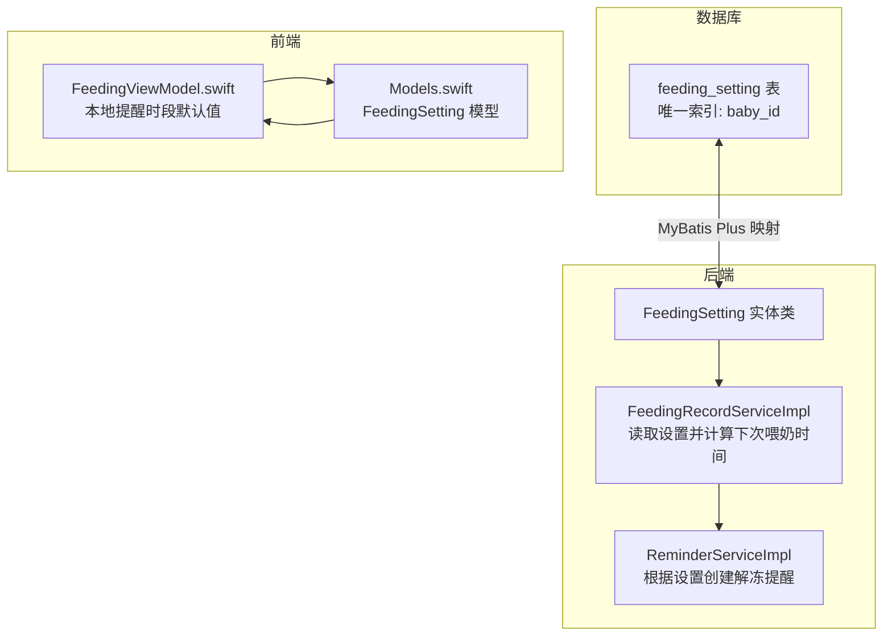
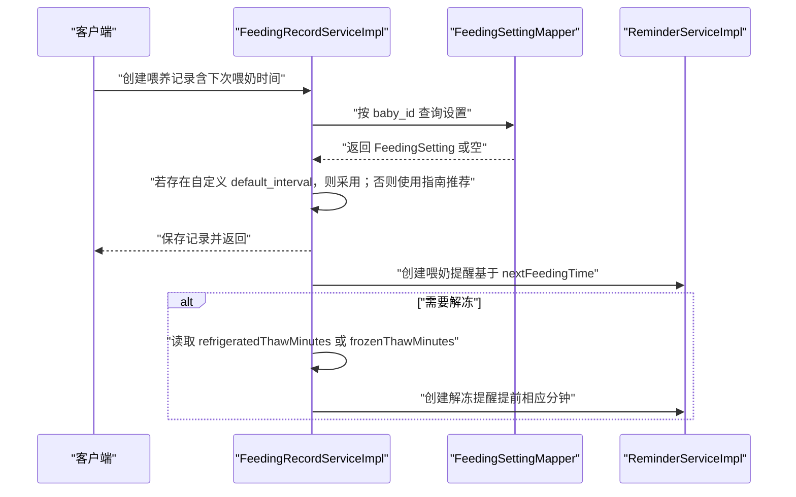
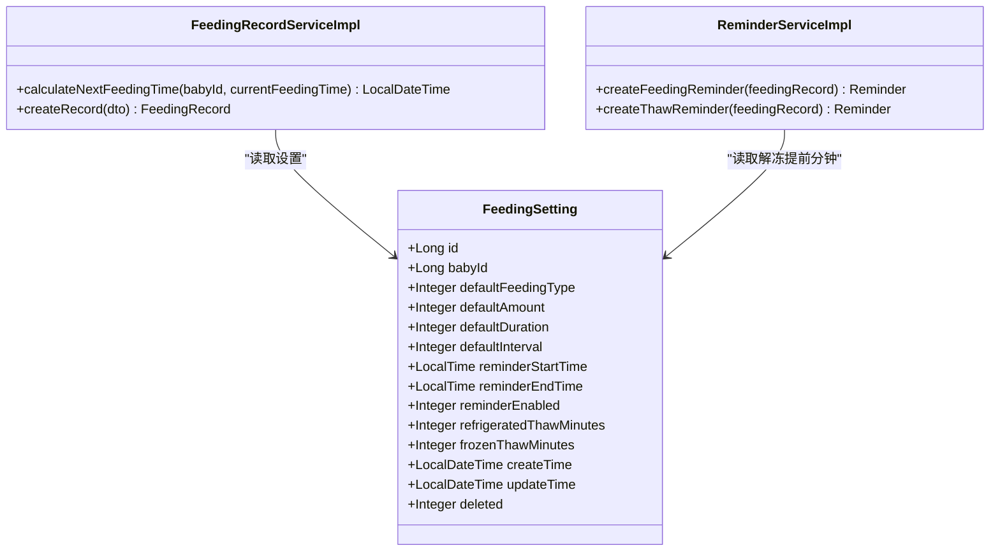

# 喂养设置表 (feeding_setting)

<cite>
**本文引用的文件**
- [FeedingSetting.java](file://backend/src/main/java/com/baby/entity/FeedingSetting.java)
- [init.sql](file://backend/src/main/resources/db/init.sql)
- [FeedingRecordServiceImpl.java](file://backend/src/main/java/com/baby/service/impl/FeedingRecordServiceImpl.java)
- [ReminderServiceImpl.java](file://backend/src/main/java/com/baby/service/impl/ReminderServiceImpl.java)
- [FeedingViewModel.swift](file://ios/BabyFeedingReminder/ViewModels/FeedingViewModel.swift)
- [Models.swift](file://ios/BabyFeedingReminder/Models/Models.swift)
</cite>

## 目录
1. [简介](#简介)
2. [项目结构与定位](#项目结构与定位)
3. [核心组件](#核心组件)
4. [架构总览](#架构总览)
5. [详细字段说明](#详细字段说明)
6. [数据流与处理逻辑](#数据流与处理逻辑)
7. [依赖关系分析](#依赖关系分析)
8. [性能与可维护性考量](#性能与可维护性考量)
9. [故障排查指南](#故障排查指南)
10. [结论](#结论)
11. [附录：示例数据与配置继承](#附录示例数据与配置继承)

## 简介
本文件面向 babyFeedingReminder 系统中的“喂养设置表（feeding_setting）”，系统化梳理其字段、默认值、业务规则、与实体类 FeedingSetting 的映射关系、以及与全局默认值和提醒机制的集成方式。重点解释默认值如何简化数据录入、提醒时间窗口（6:00–22:00）如何尊重用户偏好，并强调母乳解冻安全相关的默认提前时间（冷藏15分钟、冷冻30分钟）。

## 项目结构与定位
- 表结构定义位于数据库初始化脚本中，包含主键、唯一约束、默认值与注释。
- 实体类 FeedingSetting 映射该表，字段类型覆盖整型、时间类型与逻辑删除。
- 业务层在生成喂养记录时读取该设置，用于计算下次喂奶时间与解冻提醒时间。
- 移动端界面展示并允许用户调整提醒时段（6:00–22:00），并与后端设置保持一致。

图表来源
- [init.sql](file://backend/src/main/resources/db/init.sql#L86-L102)
- [FeedingSetting.java](file://backend/src/main/java/com/baby/entity/FeedingSetting.java#L1-L76)
- [FeedingRecordServiceImpl.java](file://backend/src/main/java/com/baby/service/impl/FeedingRecordServiceImpl.java#L191-L203)
- [ReminderServiceImpl.java](file://backend/src/main/java/com/baby/service/impl/ReminderServiceImpl.java#L70-L101)
- [FeedingViewModel.swift](file://ios/BabyFeedingReminder/ViewModels/FeedingViewModel.swift#L294-L328)
- [Models.swift](file://ios/BabyFeedingReminder/Models/Models.swift#L142-L156)

章节来源
- [init.sql](file://backend/src/main/resources/db/init.sql#L86-L102)
- [FeedingSetting.java](file://backend/src/main/java/com/baby/entity/FeedingSetting.java#L1-L76)

## 核心组件
- 数据库表：feeding_setting，包含唯一索引 baby_id，确保每个宝宝仅有一套喂养个性化设置。
- 实体类：FeedingSetting，映射表字段，含 LocalTime 类型的提醒时段字段。
- 业务服务：
  - FeedingRecordServiceImpl：读取设置，优先使用用户自定义的 default_interval 计算下次喂奶时间；当使用冷藏/冷冻母乳时，读取对应解冻提前分钟数。
  - ReminderServiceImpl：在需要解冻时，基于设置中的解冻提前分钟数创建解冻提醒。
- 前端模型：iOS 端 FeedingSetting 模型与提醒时段默认值保持一致。

章节来源
- [FeedingSetting.java](file://backend/src/main/java/com/baby/entity/FeedingSetting.java#L1-L76)
- [FeedingRecordServiceImpl.java](file://backend/src/main/java/com/baby/service/impl/FeedingRecordServiceImpl.java#L191-L203)
- [ReminderServiceImpl.java](file://backend/src/main/java/com/baby/service/impl/ReminderServiceImpl.java#L70-L101)
- [FeedingViewModel.swift](file://ios/BabyFeedingReminder/ViewModels/FeedingViewModel.swift#L294-L328)
- [Models.swift](file://ios/BabyFeedingReminder/Models/Models.swift#L142-L156)

## 架构总览
下图展示从创建喂养记录到生成提醒的关键流程，突出设置表对默认值与提醒的影响。

图表来源
- [FeedingRecordServiceImpl.java](file://backend/src/main/java/com/baby/service/impl/FeedingRecordServiceImpl.java#L49-L90)
- [FeedingRecordServiceImpl.java](file://backend/src/main/java/com/baby/service/impl/FeedingRecordServiceImpl.java#L191-L203)
- [ReminderServiceImpl.java](file://backend/src/main/java/com/baby/service/impl/ReminderServiceImpl.java#L37-L68)
- [ReminderServiceImpl.java](file://backend/src/main/java/com/baby/service/impl/ReminderServiceImpl.java#L70-L101)

## 详细字段说明
以下字段均来自数据库表定义与实体类映射，结合业务使用场景进行解释。

- id
  - 类型：BIGINT（自增主键）
  - 说明：设置记录的唯一标识，便于查询与关联其他表。
  - 章节来源
    - [init.sql](file://backend/src/main/resources/db/init.sql#L86-L102)
    - [FeedingSetting.java](file://backend/src/main/java/com/baby/entity/FeedingSetting.java#L15-L17)

- baby_id
  - 类型：BIGINT（NOT NULL，UNIQUE）
  - 说明：与宝宝表关联的唯一标识，保证每个宝宝仅有一条喂养设置记录。
  - 章节来源
    - [init.sql](file://backend/src/main/resources/db/init.sql#L86-L102)
    - [FeedingSetting.java](file://backend/src/main/java/com/baby/entity/FeedingSetting.java#L21-L21)

- default_feeding_type
  - 类型：TINYINT（默认 1）
  - 说明：默认喂养类型（1-母乳，2-奶粉，3-混合喂养）。用于简化录入，减少重复选择。
  - 章节来源
    - [init.sql](file://backend/src/main/resources/db/init.sql#L86-L102)
    - [FeedingSetting.java](file://backend/src/main/java/com/baby/entity/FeedingSetting.java#L26-L26)

- default_amount
  - 类型：INT（默认 120）
  - 说明：默认奶量（毫升）。结合年龄指南与用户偏好，减少每次输入。
  - 章节来源
    - [init.sql](file://backend/src/main/resources/db/init.sql#L86-L102)
    - [FeedingSetting.java](file://backend/src/main/java/com/baby/entity/FeedingSetting.java#L31-L31)

- default_duration
  - 类型：INT（默认 20）
  - 说明：默认喂养时长（分钟）。用于估算或校验喂养时长。
  - 章节来源
    - [init.sql](file://backend/src/main/resources/db/init.sql#L86-L102)
    - [FeedingSetting.java](file://backend/src/main/java/com/baby/entity/FeedingSetting.java#L36-L36)

- default_interval
  - 类型：INT（默认 180）
  - 说明：默认喂养间隔（分钟）。业务上优先使用用户自定义值，否则回退至指南推荐。
  - 章节来源
    - [init.sql](file://backend/src/main/resources/db/init.sql#L86-L102)
    - [FeedingSetting.java](file://backend/src/main/java/com/baby/entity/FeedingSetting.java#L41-L41)
    - [FeedingRecordServiceImpl.java](file://backend/src/main/java/com/baby/service/impl/FeedingRecordServiceImpl.java#L191-L203)

- reminder_start_time
  - 类型：TIME（默认 “06:00:00”）
  - 说明：提醒时段开始时间。移动端默认值与之保持一致，尊重用户偏好。
  - 章节来源
    - [init.sql](file://backend/src/main/resources/db/init.sql#L86-L102)
    - [FeedingSetting.java](file://backend/src/main/java/com/baby/entity/FeedingSetting.java#L46-L46)
    - [FeedingViewModel.swift](file://ios/BabyFeedingReminder/ViewModels/FeedingViewModel.swift#L294-L328)

- reminder_end_time
  - 类型：TIME（默认 “22:00:00”）
  - 说明：提醒时段结束时间。系统在该时间段外不发送提醒，避免打扰。
  - 章节来源
    - [init.sql](file://backend/src/main/resources/db/init.sql#L86-L102)
    - [FeedingSetting.java](file://backend/src/main/java/com/baby/entity/FeedingSetting.java#L51-L51)
    - [FeedingViewModel.swift](file://ios/BabyFeedingReminder/ViewModels/FeedingViewModel.swift#L294-L328)

- reminder_enabled
  - 类型：TINYINT（默认 1）
  - 说明：是否启用提醒（0-否，1-是）。影响提醒任务的创建与发送。
  - 章节来源
    - [init.sql](file://backend/src/main/resources/db/init.sql#L86-L102)
    - [FeedingSetting.java](file://backend/src/main/java/com/baby/entity/FeedingSetting.java#L56-L56)

- refrigerated_thaw_minutes
  - 类型：INT（默认 15）
  - 说明：冷藏母乳解冻提前时间（分钟）。用于安全与便利，避免母乳解冻不足导致温度不够。
  - 章节来源
    - [init.sql](file://backend/src/main/resources/db/init.sql#L86-L102)
    - [FeedingSetting.java](file://backend/src/main/java/com/baby/entity/FeedingSetting.java#L61-L61)
    - [FeedingRecordServiceImpl.java](file://backend/src/main/java/com/baby/service/impl/FeedingRecordServiceImpl.java#L72-L82)

- frozen_thaw_minutes
  - 类型：INT（默认 30）
  - 说明：冷冻母乳解冻提前时间（分钟）。冷冻母乳需更早解冻，保障安全性。
  - 章节来源
    - [init.sql](file://backend/src/main/resources/db/init.sql#L86-L102)
    - [FeedingSetting.java](file://backend/src/main/java/com/baby/entity/FeedingSetting.java#L66-L66)
    - [FeedingRecordServiceImpl.java](file://backend/src/main/java/com/baby/service/impl/FeedingRecordServiceImpl.java#L72-L82)

- create_time / update_time
  - 类型：DATETIME（默认 CURRENT_TIMESTAMP）
  - 说明：自动填充创建与更新时间，便于审计与排序。
  - 章节来源
    - [init.sql](file://backend/src/main/resources/db/init.sql#L86-L102)
    - [FeedingSetting.java](file://backend/src/main/java/com/baby/entity/FeedingSetting.java#L69-L75)

- deleted
  - 类型：TINYINT（默认 0）
  - 说明：逻辑删除标志，配合 MyBatis Plus 注解使用。
  - 章节来源
    - [init.sql](file://backend/src/main/resources/db/init.sql#L86-L102)
    - [FeedingSetting.java](file://backend/src/main/java/com/baby/entity/FeedingSetting.java#L75-L75)

## 数据流与处理逻辑
- 默认值如何简化数据录入
  - 录入时若未显式填写 default_amount、default_duration、default_feeding_type 等，系统将使用表级默认值，减少用户输入负担。
  - 章节来源
    - [init.sql](file://backend/src/main/resources/db/init.sql#L86-L102)

- 提醒时间窗口（6:00–22:00）尊重用户偏好
  - 表默认值与移动端默认值一致，确保用户在非工作/睡眠时段不会收到提醒。
  - 章节来源
    - [init.sql](file://backend/src/main/resources/db/init.sql#L86-L102)
    - [FeedingViewModel.swift](file://ios/BabyFeedingReminder/ViewModels/FeedingViewModel.swift#L294-L328)

- 配置继承与回退策略
  - 计算下次喂奶时间时，优先使用用户自定义的 default_interval；若未设置，则回退至基于年龄的指南推荐间隔。
  - 章节来源
    - [FeedingRecordServiceImpl.java](file://backend/src/main/java/com/baby/service/impl/FeedingRecordServiceImpl.java#L191-L203)

- 解冻安全与提醒
  - 当下一次喂养使用冷藏/冷冻母乳时，系统读取对应解冻提前分钟数（默认 15/30），并创建解冻提醒，避免母乳温度不足。
  - 章节来源
    - [FeedingRecordServiceImpl.java](file://backend/src/main/java/com/baby/service/impl/FeedingRecordServiceImpl.java#L72-L82)
    - [ReminderServiceImpl.java](file://backend/src/main/java/com/baby/service/impl/ReminderServiceImpl.java#L70-L101)

- 时间字段与类型
  - 实体类中 reminder_start_time 与 reminder_end_time 使用 LocalTime 类型，便于与系统时间进行比较与提醒调度。
  - 章节来源
    - [FeedingSetting.java](file://backend/src/main/java/com/baby/entity/FeedingSetting.java#L46-L51)

## 依赖关系分析
- 表与实体映射
  - FeedingSetting 实体类通过注解映射到 feeding_setting 表，字段命名与类型与表一致。
  - 章节来源
    - [FeedingSetting.java](file://backend/src/main/java/com/baby/entity/FeedingSetting.java#L11-L13)

- 业务服务依赖
  - FeedingRecordServiceImpl 依赖 FeedingSettingMapper 查询设置；ReminderServiceImpl 在需要时基于设置创建解冻提醒。
  - 章节来源
    - [FeedingRecordServiceImpl.java](file://backend/src/main/java/com/baby/service/impl/FeedingRecordServiceImpl.java#L31-L35)
    - [FeedingRecordServiceImpl.java](file://backend/src/main/java/com/baby/service/impl/FeedingRecordServiceImpl.java#L225-L230)
    - [ReminderServiceImpl.java](file://backend/src/main/java/com/baby/service/impl/ReminderServiceImpl.java#L37-L68)
    - [ReminderServiceImpl.java](file://backend/src/main/java/com/baby/service/impl/ReminderServiceImpl.java#L70-L101)

- 前后端一致性
  - iOS 端 FeedingSetting 模型与提醒时段默认值与后端保持一致，确保用户体验统一。
  - 章节来源
    - [Models.swift](file://ios/BabyFeedingReminder/Models/Models.swift#L142-L156)
    - [FeedingViewModel.swift](file://ios/BabyFeedingReminder/ViewModels/FeedingViewModel.swift#L294-L328)

图表来源
- [FeedingSetting.java](file://backend/src/main/java/com/baby/entity/FeedingSetting.java#L1-L76)
- [FeedingRecordServiceImpl.java](file://backend/src/main/java/com/baby/service/impl/FeedingRecordServiceImpl.java#L191-L203)
- [ReminderServiceImpl.java](file://backend/src/main/java/com/baby/service/impl/ReminderServiceImpl.java#L37-L101)

## 性能与可维护性考量
- 唯一索引 baby_id
  - 保证每名宝宝仅有一条喂养设置，避免重复或冲突。
  - 章节来源
    - [init.sql](file://backend/src/main/resources/db/init.sql#L86-L102)

- 自动填充字段
  - create_time/update_time 由数据库自动维护，减少应用层代码复杂度。
  - 章节来源
    - [init.sql](file://backend/src/main/resources/db/init.sql#L86-L102)
    - [FeedingSetting.java](file://backend/src/main/java/com/baby/entity/FeedingSetting.java#L69-L75)

- 默认值与回退策略
  - 通过表默认值与业务回退逻辑，降低用户输入成本，同时保证系统行为可预期。
  - 章节来源
    - [init.sql](file://backend/src/main/resources/db/init.sql#L86-L102)
    - [FeedingRecordServiceImpl.java](file://backend/src/main/java/com/baby/service/impl/FeedingRecordServiceImpl.java#L191-L203)

## 故障排查指南
- 提醒未按时发送
  - 检查 reminder_enabled 是否开启，以及 reminder_start_time/reminder_end_time 是否覆盖当前时间。
  - 章节来源
    - [init.sql](file://backend/src/main/resources/db/init.sql#L86-L102)
    - [FeedingSetting.java](file://backend/src/main/java/com/baby/entity/FeedingSetting.java#L56-L56)

- 解冻提醒未创建
  - 确认喂养记录中 needThaw 是否标记为需要解冻，且 thawReminderMinutes 来源于设置（冷藏15/冷冻30）。
  - 章节来源
    - [FeedingRecordServiceImpl.java](file://backend/src/main/java/com/baby/service/impl/FeedingRecordServiceImpl.java#L72-L82)
    - [ReminderServiceImpl.java](file://backend/src/main/java/com/baby/service/impl/ReminderServiceImpl.java#L70-L101)

- 下次喂奶时间异常
  - 若设置了自定义 default_interval，请确认其数值合理；否则系统会回退到指南推荐间隔。
  - 章节来源
    - [FeedingRecordServiceImpl.java](file://backend/src/main/java/com/baby/service/impl/FeedingRecordServiceImpl.java#L191-L203)

## 结论
feeding_setting 表通过合理的默认值与唯一约束，实现了“开箱即用”的个性化喂养设置体验。业务层在计算下次喂奶时间与创建解冻提醒时，既尊重用户自定义配置，又遵循母乳安全的最佳实践（冷藏15分钟、冷冻30分钟）。提醒时间窗口（6:00–22:00）兼顾用户作息偏好，确保提醒的及时性与友好性。

## 附录：示例数据与配置继承
- 示例行数据（示意）
  - baby_id: 1001
  - default_feeding_type: 1（母乳）
  - default_amount: 120（ml）
  - default_duration: 20（min）
  - default_interval: 180（min）
  - reminder_start_time: 06:00:00
  - reminder_end_time: 22:00:00
  - reminder_enabled: 1
  - refrigerated_thaw_minutes: 15
  - frozen_thaw_minutes: 30
  - 章节来源
    - [init.sql](file://backend/src/main/resources/db/init.sql#L86-L102)

- 配置继承与验证规则
  - 继承顺序：用户自定义设置 > 全局指南推荐（年龄相关）。
  - 时间区间验证：reminder_start_time ≤ reminder_end_time；若用户修改，应确保在 6:00–22:00 区间内。
  - 解冻提前时间：冷藏默认15分钟，冷冻默认30分钟；若用户自定义，应符合安全范围。
  - 章节来源
    - [FeedingRecordServiceImpl.java](file://backend/src/main/java/com/baby/service/impl/FeedingRecordServiceImpl.java#L191-L203)
    - [FeedingRecordServiceImpl.java](file://backend/src/main/java/com/baby/service/impl/FeedingRecordServiceImpl.java#L72-L82)
    - [init.sql](file://backend/src/main/resources/db/init.sql#L86-L102)