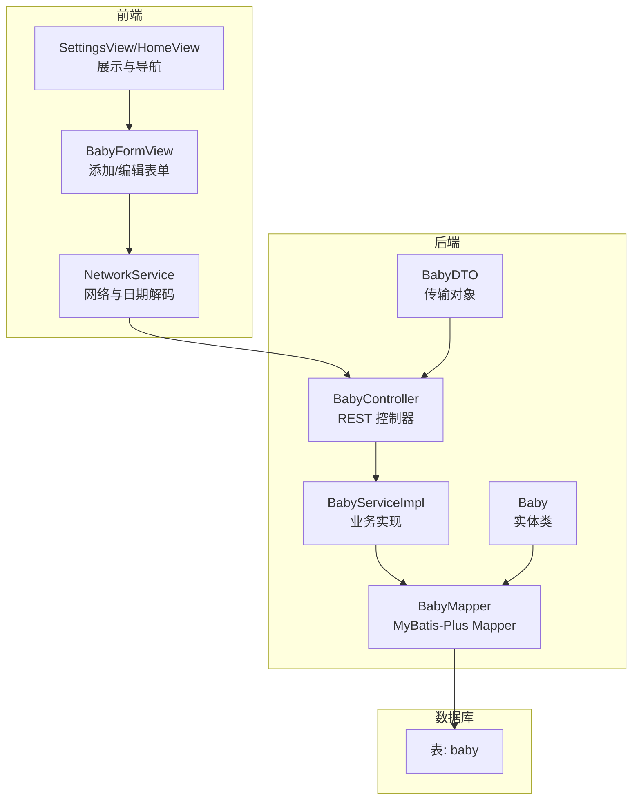
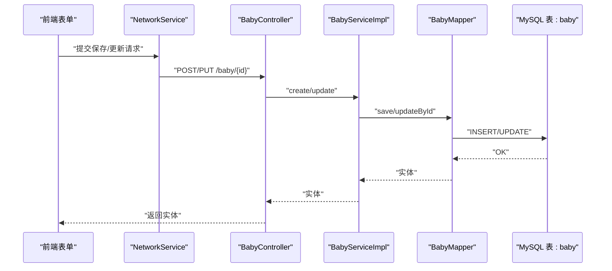
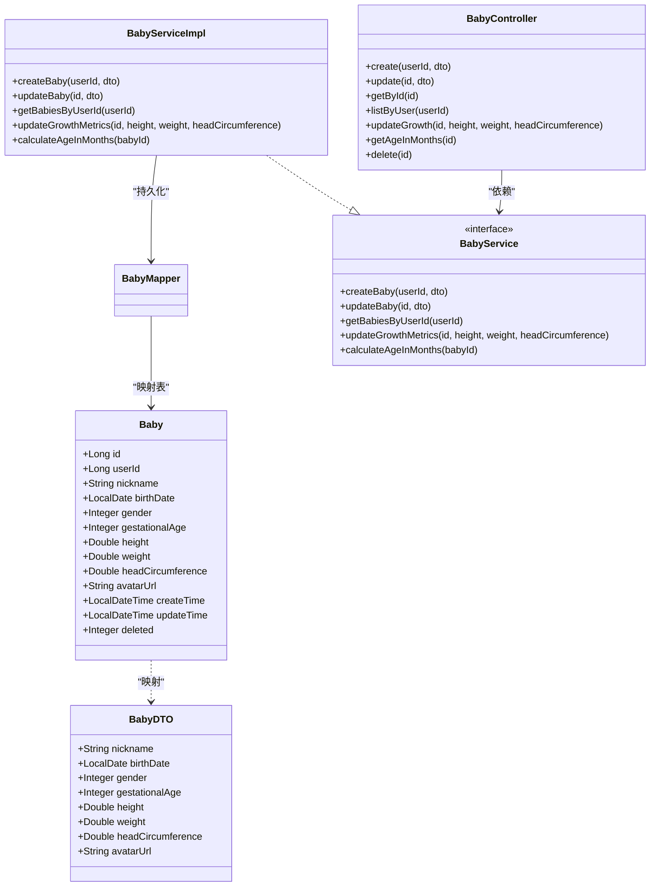

# 宝宝信息表 (baby)

<cite>
**本文引用的文件**
- [Baby.java](file://backend/src/main/java/com/baby/entity/Baby.java)
- [BabyDTO.java](file://backend/src/main/java/com/baby/dto/BabyDTO.java)
- [BabyMapper.java](file://backend/src/main/java/com/baby/mapper/BabyMapper.java)
- [BabyService.java](file://backend/src/main/java/com/baby/service/BabyService.java)
- [BabyServiceImpl.java](file://backend/src/main/java/com/baby/service/impl/BabyServiceImpl.java)
- [BabyController.java](file://backend/src/main/java/com/baby/controller/BabyController.java)
- [init.sql](file://backend/src/main/resources/db/init.sql)
- [Models.swift](file://ios/BabyFeedingReminder/Models/Models.swift)
- [BabyFormView.swift](file://ios/BabyFeedingReminder/Views/BabyFormView.swift)
- [SettingsView.swift](file://ios/BabyFeedingReminder/Views/SettingsView.swift)
- [HomeView.swift](file://ios/BabyFeedingReminder/Views/HomeView.swift)
- [NetworkService.swift](file://ios/BabyFeedingReminder/Services/NetworkService.swift)
</cite>

## 目录
1. [简介](#简介)
2. [项目结构](#项目结构)
3. [核心组件](#核心组件)
4. [架构总览](#架构总览)
5. [详细组件分析](#详细组件分析)
6. [依赖关系分析](#依赖关系分析)
7. [性能与索引](#性能与索引)
8. [字段规范与临床意义](#字段规范与临床意义)
9. [示例数据与用法](#示例数据与用法)
10. [常见问题与排错](#常见问题与排错)
11. [结论](#结论)
12. [附录](#附录)

## 简介
本章节聚焦“宝宝信息表（baby）”的设计与实现，覆盖字段定义、数据类型、约束、业务规则、索引策略、前后端集成方式以及与“矫正月龄”计算相关的临床意义。文档同时对前端“宝宝资料”页面与后端实体/映射/服务层进行交叉说明，并给出常见问题排查建议。

## 项目结构
- 后端采用 Spring Boot + MyBatis-Plus，实体类通过注解映射数据库表；控制器提供 REST 接口；服务层封装业务逻辑；Mapper 继承 BaseMapper 实现通用 CRUD。
- 前端 iOS 使用 SwiftUI 构建“添加/编辑宝宝”表单，提交时将胎龄换算为总天数并以本地日期字符串提交，后端统一解析入库。

图表来源
- [BabyController.java](file://backend/src/main/java/com/baby/controller/BabyController.java#L1-L80)
- [BabyServiceImpl.java](file://backend/src/main/java/com/baby/service/impl/BabyServiceImpl.java#L1-L91)
- [BabyMapper.java](file://backend/src/main/java/com/baby/mapper/BabyMapper.java#L1-L13)
- [Baby.java](file://backend/src/main/java/com/baby/entity/Baby.java#L1-L72)
- [BabyDTO.java](file://backend/src/main/java/com/baby/dto/BabyDTO.java#L1-L48)
- [init.sql](file://backend/src/main/resources/db/init.sql#L25-L41)
- [BabyFormView.swift](file://ios/BabyFeedingReminder/Views/BabyFormView.swift#L1-L297)
- [NetworkService.swift](file://ios/BabyFeedingReminder/Services/NetworkService.swift#L29-L67)
- [SettingsView.swift](file://ios/BabyFeedingReminder/Views/SettingsView.swift#L31-L96)
- [HomeView.swift](file://ios/BabyFeedingReminder/Views/HomeView.swift#L33-L140)

章节来源
- [BabyController.java](file://backend/src/main/java/com/baby/controller/BabyController.java#L1-L80)
- [BabyServiceImpl.java](file://backend/src/main/java/com/baby/service/impl/BabyServiceImpl.java#L1-L91)
- [BabyMapper.java](file://backend/src/main/java/com/baby/mapper/BabyMapper.java#L1-L13)
- [Baby.java](file://backend/src/main/java/com/baby/entity/Baby.java#L1-L72)
- [BabyDTO.java](file://backend/src/main/java/com/baby/dto/BabyDTO.java#L1-L48)
- [init.sql](file://backend/src/main/resources/db/init.sql#L25-L41)
- [BabyFormView.swift](file://ios/BabyFeedingReminder/Views/BabyFormView.swift#L1-L297)
- [NetworkService.swift](file://ios/BabyFeedingReminder/Services/NetworkService.swift#L29-L67)
- [SettingsView.swift](file://ios/BabyFeedingReminder/Views/SettingsView.swift#L31-L96)
- [HomeView.swift](file://ios/BabyFeedingReminder/Views/HomeView.swift#L33-L140)

## 核心组件
- 实体类：定义字段、注解与类型，承载 MyBatis-Plus 的表名、主键、自动填充、逻辑删除等元信息。
- DTO：接收前端传参，包含非空校验等约束。
- Mapper：继承 BaseMapper，获得通用 CRUD 能力。
- Service：封装业务，如按用户查询、更新生长指标、计算月龄。
- Controller：暴露 REST 接口，处理增删改查与月龄查询。

章节来源
- [Baby.java](file://backend/src/main/java/com/baby/entity/Baby.java#L1-L72)
- [BabyDTO.java](file://backend/src/main/java/com/baby/dto/BabyDTO.java#L1-L48)
- [BabyMapper.java](file://backend/src/main/java/com/baby/mapper/BabyMapper.java#L1-L13)
- [BabyService.java](file://backend/src/main/java/com/baby/service/BabyService.java#L1-L38)
- [BabyServiceImpl.java](file://backend/src/main/java/com/baby/service/impl/BabyServiceImpl.java#L1-L91)
- [BabyController.java](file://backend/src/main/java/com/baby/controller/BabyController.java#L1-L80)

## 架构总览
后端通过控制器接收请求，调用服务层，服务层持久化到数据库；前端通过表单提交数据，网络层统一日期格式，后端解析入库。

图表来源
- [BabyFormView.swift](file://ios/BabyFeedingReminder/Views/BabyFormView.swift#L219-L290)
- [NetworkService.swift](file://ios/BabyFeedingReminder/Services/NetworkService.swift#L29-L67)
- [BabyController.java](file://backend/src/main/java/com/baby/controller/BabyController.java#L24-L78)
- [BabyServiceImpl.java](file://backend/src/main/java/com/baby/service/impl/BabyServiceImpl.java#L24-L78)
- [BabyMapper.java](file://backend/src/main/java/com/baby/mapper/BabyMapper.java#L1-L13)
- [init.sql](file://backend/src/main/resources/db/init.sql#L25-L41)

## 详细组件分析

### 数据库表结构与字段
- 主键：自增 bigint
- 关联字段：user_id（外键约束由应用层保证，DDL 中未显式声明外键）
- 字段与约束：
  - id：bigint 自增主键
  - user_id：bigint NOT NULL，索引 idx_user_id
  - nickname：varchar(50) NOT NULL
  - birth_date：date NOT NULL
  - gender：tinyint（0/1）
  - gestational_age：int（周），可空
  - height：decimal(5,2)，单位 cm
  - weight：decimal(5,2)，单位 kg
  - head_circumference：decimal(5,2)，单位 cm
  - avatar_url：varchar(500)
  - create_time：datetime 默认当前时间
  - update_time：datetime 默认当前时间，更新时自动更新
  - deleted：tinyint 默认 0（逻辑删除）

章节来源
- [init.sql](file://backend/src/main/resources/db/init.sql#L25-L41)

### 实体类与 MyBatis-Plus 注解
- @TableName("baby")：指定表名
- @TableId(type = IdType.AUTO)：主键自增
- @TableField(fill = FieldFill.INSERT)：插入时自动填充 createTime
- @TableField(fill = FieldFill.INSERT_UPDATE)：插入/更新时自动填充 updateTime
- @TableLogic：deleted 字段启用逻辑删除

章节来源
- [Baby.java](file://backend/src/main/java/com/baby/entity/Baby.java#L1-L72)

### DTO 与校验
- nickname、birthDate、gender 必填
- 其余字段可空（身高、体重、头围、胎龄、头像 URL）

章节来源
- [BabyDTO.java](file://backend/src/main/java/com/baby/dto/BabyDTO.java#L1-L48)

### Mapper 与 Service
- Mapper 继承 BaseMapper，天然具备通用 CRUD
- Service 实现：
  - createBaby：写入 user_id 与 DTO 字段
  - updateBaby：按 id 更新
  - getBabiesByUserId：按 user_id 查询并按创建时间倒序
  - updateGrowthMetrics：按需更新身高/体重/头围
  - calculateAgeInMonths：基于 birth_date 计算月龄

章节来源
- [BabyMapper.java](file://backend/src/main/java/com/baby/mapper/BabyMapper.java#L1-L13)
- [BabyServiceImpl.java](file://backend/src/main/java/com/baby/service/impl/BabyServiceImpl.java#L24-L91)
- [BabyService.java](file://backend/src/main/java/com/baby/service/BabyService.java#L1-L38)

### 控制器接口
- POST /baby：创建（携带 userId 请求头）
- PUT /baby/{id}：更新
- GET /baby/{id}：按 id 查询
- GET /baby/list：按 userId 查询所有
- PUT /baby/{id}/growth：更新身高/体重/头围
- GET /baby/{id}/age：查询月龄
- DELETE /baby/{id}：删除（逻辑删除）

章节来源
- [BabyController.java](file://backend/src/main/java/com/baby/controller/BabyController.java#L24-L78)

### 前端集成
- 表单视图：支持昵称、性别、出生日期、胎龄（周+天）、身高、体重、头围输入；保存时将胎龄换算为总天数，出生日期以本地 yyyy-MM-dd 字符串提交。
- 展示视图：设置页与首页展示身高/体重/头围，若为空则引导编辑。
- 网络层：JSON 解码器支持多种日期格式，时区固定为 Asia/Shanghai。

章节来源
- [BabyFormView.swift](file://ios/BabyFeedingReminder/Views/BabyFormView.swift#L1-L297)
- [SettingsView.swift](file://ios/BabyFeedingReminder/Views/SettingsView.swift#L31-L96)
- [HomeView.swift](file://ios/BabyFeedingReminder/Views/HomeView.swift#L33-L140)
- [NetworkService.swift](file://ios/BabyFeedingReminder/Services/NetworkService.swift#L29-L67)

## 依赖关系分析

图表来源
- [Baby.java](file://backend/src/main/java/com/baby/entity/Baby.java#L1-L72)
- [BabyDTO.java](file://backend/src/main/java/com/baby/dto/BabyDTO.java#L1-L48)
- [BabyMapper.java](file://backend/src/main/java/com/baby/mapper/BabyMapper.java#L1-L13)
- [BabyService.java](file://backend/src/main/java/com/baby/service/BabyService.java#L1-L38)
- [BabyServiceImpl.java](file://backend/src/main/java/com/baby/service/impl/BabyServiceImpl.java#L1-L91)
- [BabyController.java](file://backend/src/main/java/com/baby/controller/BabyController.java#L1-L80)

## 性能与索引
- user_id 上建立普通索引 idx_user_id，用于按家长账户快速查询其下所有宝宝。
- 建议：
  - 若存在高频按 birth_date 或 gestational_age 过滤场景，可评估复合索引或分区策略（需结合实际查询模式）。
  - 逻辑删除字段 deleted 可配合查询条件过滤，避免全表扫描。

章节来源
- [init.sql](file://backend/src/main/resources/db/init.sql#L25-L41)

## 字段规范与临床意义

- id
  - 类型：bigint
  - 约束：主键，自增
  - 用途：唯一标识每条宝宝记录

- user_id
  - 类型：bigint
  - 约束：NOT NULL，索引 idx_user_id
  - 用途：关联家长账户，支撑按账户查询
  - 重要性：前端通过请求头携带 userId，后端据此创建/查询

- nickname
  - 类型：varchar(50)
  - 约束：NOT NULL（DTO 校验）
  - 用途：显示名称

- birth_date
  - 类型：date
  - 约束：NOT NULL（DTO 校验）
  - 用途：计算月龄的基础；前端以本地日期字符串提交，避免跨时区偏差

- gender
  - 类型：tinyint（0/1）
  - 约束：NOT NULL（DTO 校验）
  - 用途：性别标识

- gestational_age
  - 类型：int（周）
  - 约束：可空
  - 临床意义：用于矫正月龄（见下节）

- height
  - 类型：decimal(5,2) cm
  - 约束：可空
  - 用途：生长监测

- weight
  - 类型：decimal(5,2) kg
  - 约束：可空
  - 用途：生长监测

- head_circumference
  - 类型：decimal(5,2) cm
  - 约束：可空
  - 用途：头围监测

- avatar_url
  - 类型：varchar(500)
  - 约束：可空
  - 用途：头像链接

- create_time / update_time
  - 类型：datetime
  - 约束：默认当前时间；插入/更新自动填充
  - 用途：审计与排序

- deleted
  - 类型：tinyint
  - 约束：默认 0（逻辑删除）
  - 用途：软删除

### 矫正月龄（针对早产儿）
- 计算思路：矫正月龄 = 实足月龄 - 早产周数 + 40 周
- 在系统中：
  - birth_date 用于计算实足月龄
  - gestational_age（以周计）用于矫正月龄推导
  - 前端将胎龄以“周+天”输入，保存时换算为总天数（便于统一存储与比较）
  - 后端提供月龄查询接口，供统计与提醒策略使用

章节来源
- [BabyServiceImpl.java](file://backend/src/main/java/com/baby/service/impl/BabyServiceImpl.java#L81-L91)
- [BabyController.java](file://backend/src/main/java/com/baby/controller/BabyController.java#L66-L71)
- [BabyFormView.swift](file://ios/BabyFeedingReminder/Views/BabyFormView.swift#L223-L239)

## 示例数据与用法

- 新生儿记录（早产儿）
  - 字段要点：birth_date 较近，gestational_age < 40（例如 32 周），可能尚未有身高/体重/头围数据
  - 用途：矫正月龄计算、喂养间隔推荐

- 成年婴儿记录（足月儿）
  - 字段要点：birth_date 较远，gestational_age 接近 40 周，身高/体重/头围可选填
  - 用途：常规月龄计算、生长曲线对比

- 前端交互
  - 添加/编辑：填写昵称、性别、出生日期、胎龄（周+天）、身高/体重/头围
  - 展示：设置页与首页展示身高/体重/头围，缺失时引导编辑

章节来源
- [BabyFormView.swift](file://ios/BabyFeedingReminder/Views/BabyFormView.swift#L1-L297)
- [SettingsView.swift](file://ios/BabyFeedingReminder/Views/SettingsView.swift#L31-L96)
- [HomeView.swift](file://ios/BabyFeedingReminder/Views/HomeView.swift#L33-L140)

## 常见问题与排错

- 日期格式与时区
  - 前端使用本地日期字符串（yyyy-MM-dd），避免跨时区导致的日期偏移
  - 后端 JSON 解码器支持多种日期格式，且将时区固定为 Asia/Shanghai，确保入库一致

- 生长指标录入
  - 字段可空，但建议定期补充身高/体重/头围，以便后续统计与建议生成
  - 建议在前端增加数值范围提示（如体重上限），避免异常值

- 矫正月龄与喂养/睡眠建议
  - 月龄来自 birth_date 计算；矫正月龄需结合 gestational_age 推导
  - 建议在统计模块统一使用矫正月龄进行推荐与对比

- 逻辑删除与数据清理
  - deleted 字段为 0 表示未删除；删除接口执行软删除
  - 建议在查询时默认过滤 deleted=0，避免误读

章节来源
- [NetworkService.swift](file://ios/BabyFeedingReminder/Services/NetworkService.swift#L29-L67)
- [BabyFormView.swift](file://ios/BabyFeedingReminder/Views/BabyFormView.swift#L226-L239)
- [BabyController.java](file://backend/src/main/java/com/baby/controller/BabyController.java#L73-L78)
- [BabyServiceImpl.java](file://backend/src/main/java/com/baby/service/impl/BabyServiceImpl.java#L81-L91)

## 结论
“宝宝信息表（baby）”通过清晰的字段设计、严格的 DTO 校验、完善的索引与逻辑删除机制，支撑了从资料录入到月龄计算、再到喂养/睡眠建议的完整闭环。前端以本地日期与总天数策略规避时区问题，后端以统一注解与自动填充提升一致性。建议在后续版本中完善胎龄与生长指标的业务规则提示，并考虑针对高频查询场景优化索引策略。

## 附录

### 字段对照与注解说明
- 表：baby
- 字段：id、user_id、nickname、birth_date、gender、gestational_age、height、weight、head_circumference、avatar_url、create_time、update_time、deleted
- 注解：@TableName、@TableId、@TableField、@TableLogic

章节来源
- [init.sql](file://backend/src/main/resources/db/init.sql#L25-L41)
- [Baby.java](file://backend/src/main/java/com/baby/entity/Baby.java#L1-L72)