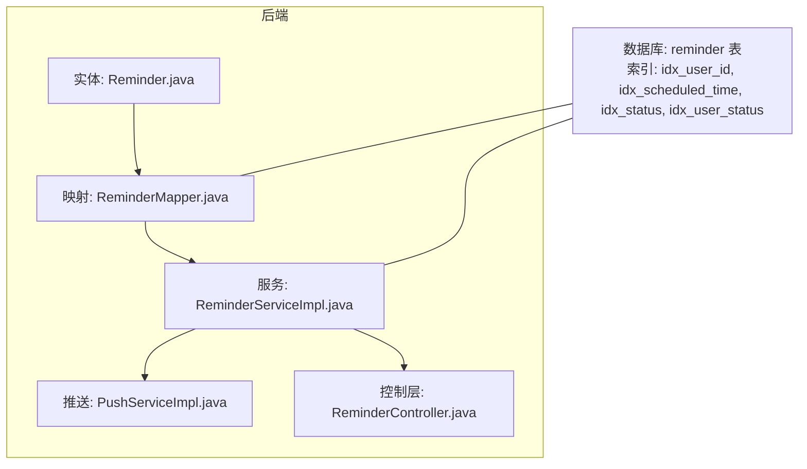
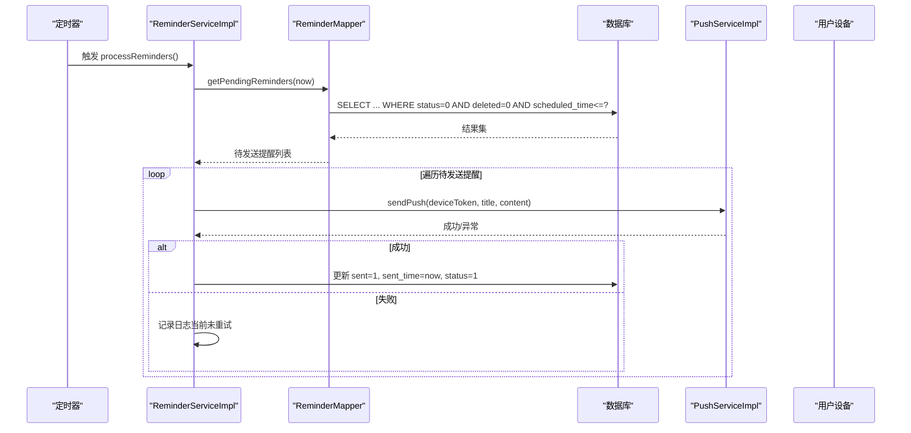
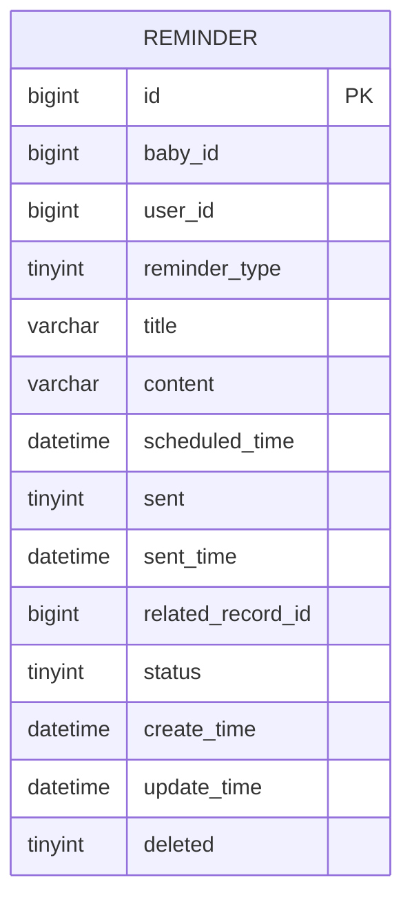
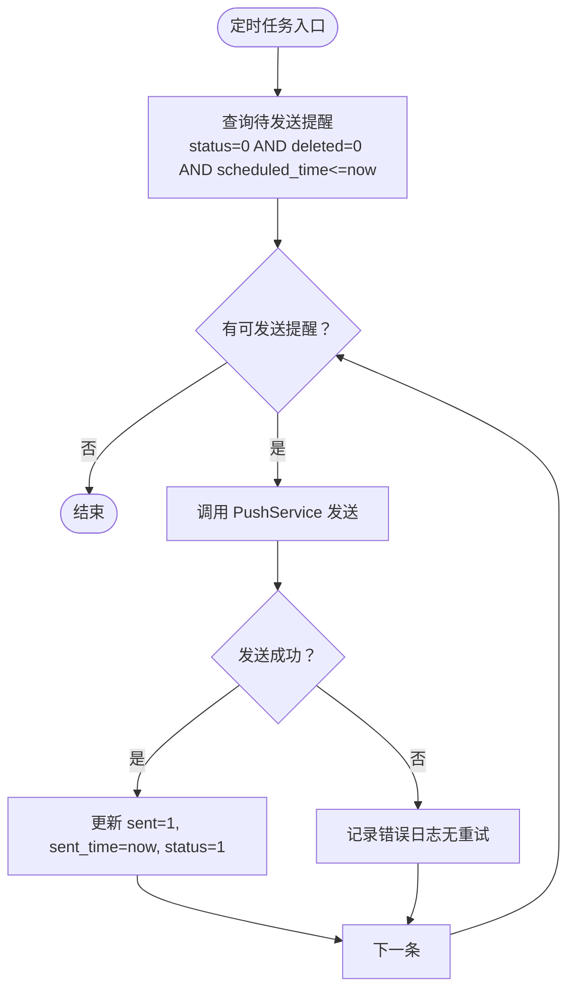
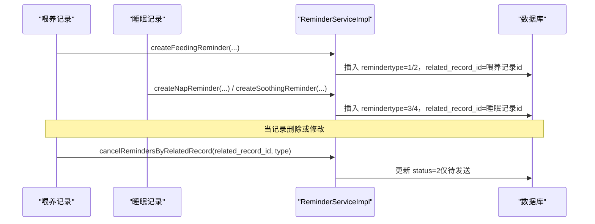
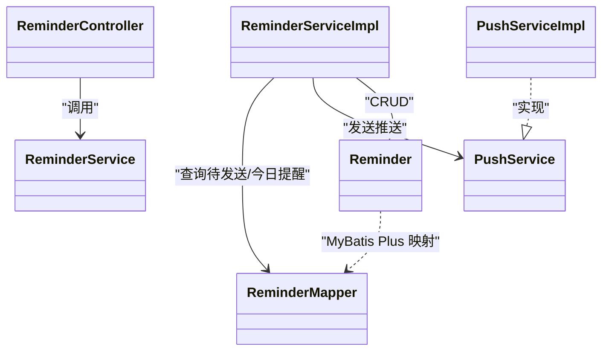
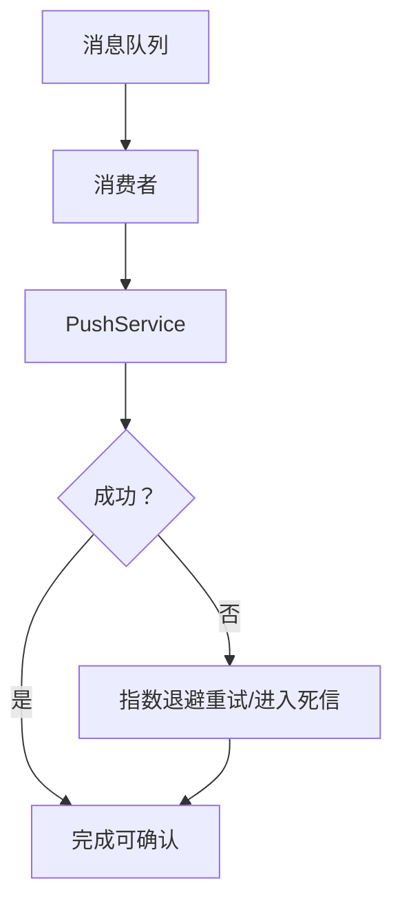

# 提醒任务表 (reminder)

<cite>
**本文引用的文件**
- [Reminder.java](file://backend/src/main/java/com/baby/entity/Reminder.java)
- [init.sql](file://backend/src/main/resources/db/init.sql)
- [ReminderMapper.java](file://backend/src/main/java/com/baby/mapper/ReminderMapper.java)
- [ReminderServiceImpl.java](file://backend/src/main/java/com/baby/service/impl/ReminderServiceImpl.java)
- [ReminderService.java](file://backend/src/main/java/com/baby/service/ReminderService.java)
- [PushService.java](file://backend/src/main/java/com/baby/service/PushService.java)
- [PushServiceImpl.java](file://backend/src/main/java/com/baby/service/impl/PushServiceImpl.java)
- [ReminderController.java](file://backend/src/main/java/com/baby/controller/ReminderController.java)
- [.env.example](file://.env.example)
</cite>

## 目录
1. [简介](#简介)
2. [项目结构与定位](#项目结构与定位)
3. [核心组件](#核心组件)
4. [架构总览](#架构总览)
5. [详细组件分析](#详细组件分析)
6. [依赖关系分析](#依赖关系分析)
7. [性能与索引策略](#性能与索引策略)
8. [消息队列与重试机制](#消息队列与重试机制)
9. [故障排查指南](#故障排查指南)
10. [结论](#结论)
11. [附录：字段说明与示例](#附录字段说明与示例)

## 简介
本节面向“提醒任务表（reminder）”在 babyFeedingReminder 系统中的角色与职责。该表承载所有提醒任务的生命周期：从创建、调度、推送、状态变更到最终取消或过期。其核心字段包括主键、关联对象（宝宝与用户）、提醒类型、标题内容、计划时间、推送状态与时间、关联记录（喂养/睡眠记录）、状态机（待发送/已发送/已取消）、以及时间戳与逻辑删除标记。本文将系统性阐述：
- 字段语义与取值范围
- scheduled_time 如何驱动提醒引擎
- related_record_id 如何与喂养/睡眠记录建立强关联
- 索引策略（尤其是 idx_user_status）如何支撑高效查询
- 与 Reminder.java 实体、ReminderService、PushService 的集成方式
- 消息队列模式、重试与失败处理
- 记录删除时的取消工作流

## 项目结构与定位
- 表结构定义与索引位于数据库初始化脚本中。
- Java 实体映射与 MyBatis Plus 注解定义了字段与逻辑删除。
- Mapper 提供两类关键查询：待发送提醒、用户今日待发送提醒。
- Service 层负责提醒创建、发送、取消、定时扫描等业务流程。
- PushService 抽象推送能力，PushServiceImpl 当前为占位实现（可接入 APNs）。
- Controller 对外暴露查询与取消接口。

图表来源
- [Reminder.java](file://backend/src/main/java/com/baby/entity/Reminder.java#L1-L75)
- [init.sql](file://backend/src/main/resources/db/init.sql#L121-L141)
- [ReminderMapper.java](file://backend/src/main/java/com/baby/mapper/ReminderMapper.java#L1-L34)
- [ReminderServiceImpl.java](file://backend/src/main/java/com/baby/service/impl/ReminderServiceImpl.java#L1-L241)
- [PushServiceImpl.java](file://backend/src/main/java/com/baby/service/impl/PushServiceImpl.java#L1-L67)
- [ReminderController.java](file://backend/src/main/java/com/baby/controller/ReminderController.java#L1-L44)

章节来源
- [init.sql](file://backend/src/main/resources/db/init.sql#L121-L141)
- [Reminder.java](file://backend/src/main/java/com/baby/entity/Reminder.java#L1-L75)
- [ReminderMapper.java](file://backend/src/main/java/com/baby/mapper/ReminderMapper.java#L1-L34)
- [ReminderServiceImpl.java](file://backend/src/main/java/com/baby/service/impl/ReminderServiceImpl.java#L1-L241)
- [PushServiceImpl.java](file://backend/src/main/java/com/baby/service/impl/PushServiceImpl.java#L1-L67)
- [ReminderController.java](file://backend/src/main/java/com/baby/controller/ReminderController.java#L1-L44)

## 核心组件
- 实体与表结构：Reminder.java 映射 reminder 表，包含 id、baby_id、user_id、reminder_type、title、content、scheduled_time、sent、sent_time、related_record_id、status、create_time、update_time、deleted 等字段。
- Mapper 查询：提供“待发送提醒”和“用户今日待发送提醒”的 SQL 查询，均考虑 deleted 与 status 过滤。
- Service 业务：创建喂奶/解冻/小睡/哄睡提醒；扫描待发送提醒并调用 PushService 推送；支持按 id 取消单条提醒，或按 related_record_id 与类型批量取消。
- PushService：抽象推送接口，当前实现为占位，预留 APNs 集成点。
- 控制层：对外提供“用户今日提醒”、“宝宝即将提醒”、“取消提醒”接口。

章节来源
- [Reminder.java](file://backend/src/main/java/com/baby/entity/Reminder.java#L1-L75)
- [ReminderMapper.java](file://backend/src/main/java/com/baby/mapper/ReminderMapper.java#L1-L34)
- [ReminderServiceImpl.java](file://backend/src/main/java/com/baby/service/impl/ReminderServiceImpl.java#L1-L241)
- [PushService.java](file://backend/src/main/java/com/baby/service/PushService.java#L1-L23)
- [PushServiceImpl.java](file://backend/src/main/java/com/baby/service/impl/PushServiceImpl.java#L1-L67)
- [ReminderController.java](file://backend/src/main/java/com/baby/controller/ReminderController.java#L1-L44)

## 架构总览
提醒引擎以 scheduled_time 为核心触发条件，通过定时任务每分钟扫描“待发送且已到达计划时间”的提醒，调用推送服务向用户设备发送通知，并更新提醒状态为“已发送”。同时，当喂养/睡眠记录被删除或修改时，通过 related_record_id 与 reminder_type 进行批量取消，确保不再产生无效提醒。

图表来源
- [ReminderServiceImpl.java](file://backend/src/main/java/com/baby/service/impl/ReminderServiceImpl.java#L188-L211)
- [ReminderMapper.java](file://backend/src/main/java/com/baby/mapper/ReminderMapper.java#L17-L24)
- [PushServiceImpl.java](file://backend/src/main/java/com/baby/service/impl/PushServiceImpl.java#L22-L48)

章节来源
- [ReminderServiceImpl.java](file://backend/src/main/java/com/baby/service/impl/ReminderServiceImpl.java#L188-L211)
- [ReminderMapper.java](file://backend/src/main/java/com/baby/mapper/ReminderMapper.java#L17-L24)

## 详细组件分析

### 字段与数据模型
- 主键与关联：id、baby_id、user_id
- 类型与内容：reminder_type（1-喂奶提醒、2-解冻提醒、3-小睡提醒、4-哄睡提醒）、title、content
- 时间与时序：scheduled_time（计划提醒时间）、sent（是否已发送，0/1）、sent_time（发送时间）
- 关联记录：related_record_id（指向喂养记录或睡眠记录）
- 状态机：status（0-待发送、1-已发送、2-已取消）
- 元数据：create_time、update_time、deleted（逻辑删除）

图表来源
- [Reminder.java](file://backend/src/main/java/com/baby/entity/Reminder.java#L1-L75)
- [init.sql](file://backend/src/main/resources/db/init.sql#L121-L141)

章节来源
- [Reminder.java](file://backend/src/main/java/com/baby/entity/Reminder.java#L1-L75)
- [init.sql](file://backend/src/main/resources/db/init.sql#L121-L141)

### scheduled_time 驱动的提醒引擎
- 扫描策略：每分钟执行一次 processReminders，调用 getPendingReminders(now)，筛选 status=0、deleted=0、scheduled_time≤now 的提醒。
- 推送流程：对每个待发送提醒，读取用户 deviceToken 并调用 PushService 发送；成功后更新 sent、sent_time、status。
- 未发送提醒的后续：若推送失败，当前实现不自动重试，仅记录错误日志。

图表来源
- [ReminderServiceImpl.java](file://backend/src/main/java/com/baby/service/impl/ReminderServiceImpl.java#L188-L211)
- [ReminderMapper.java](file://backend/src/main/java/com/baby/mapper/ReminderMapper.java#L17-L24)

章节来源
- [ReminderServiceImpl.java](file://backend/src/main/java/com/baby/service/impl/ReminderServiceImpl.java#L188-L211)
- [ReminderMapper.java](file://backend/src/main/java/com/baby/mapper/ReminderMapper.java#L17-L24)

### related_record_id 与喂养/睡眠记录的关联
- 喂奶提醒：当喂养记录存在 next_feeding_time 时创建；若 need_thaw=1 则额外创建解冻提醒；两者均设置 related_record_id 为对应喂养记录 id。
- 小睡/哄睡提醒：当睡眠记录存在 next_nap_time 时创建；若 soothing_reminder_minutes>0 则创建哄睡提醒；两者均设置 related_record_id 为对应睡眠记录 id。
- 删除联动：当喂养/睡眠记录被删除或修改导致不再需要提醒时，可通过 cancelRemindersByRelatedRecord(related_record_id, reminder_type) 将对应类型的“待发送”提醒批量置为“已取消”。

图表来源
- [ReminderServiceImpl.java](file://backend/src/main/java/com/baby/service/impl/ReminderServiceImpl.java#L37-L101)
- [ReminderServiceImpl.java](file://backend/src/main/java/com/baby/service/impl/ReminderServiceImpl.java#L103-L164)
- [ReminderServiceImpl.java](file://backend/src/main/java/com/baby/service/impl/ReminderServiceImpl.java#L221-L229)

章节来源
- [ReminderServiceImpl.java](file://backend/src/main/java/com/baby/service/impl/ReminderServiceImpl.java#L37-L101)
- [ReminderServiceImpl.java](file://backend/src/main/java/com/baby/service/impl/ReminderServiceImpl.java#L103-L164)
- [ReminderServiceImpl.java](file://backend/src/main/java/com/baby/service/impl/ReminderServiceImpl.java#L221-L229)

### 与 Reminder.java 实体及服务层的集成
- 实体注解：@TableName("reminder")、@TableId、@TableField(fill=...)、@TableLogic(deleted) 等，确保与数据库字段与逻辑删除一致。
- 服务层方法：createFeedingReminder/createThawReminder/createNapReminder/createSoothingReminder、getTodayReminders/getUpcomingReminders/getPendingReminders、sendReminder、cancelReminder/cancelRemindersByRelatedRecord、processReminders（定时任务）。

章节来源
- [Reminder.java](file://backend/src/main/java/com/baby/entity/Reminder.java#L1-L75)
- [ReminderService.java](file://backend/src/main/java/com/baby/service/ReminderService.java#L1-L63)
- [ReminderServiceImpl.java](file://backend/src/main/java/com/baby/service/impl/ReminderServiceImpl.java#L1-L241)

### 与 PushService 的集成
- PushService 接口定义了 sendPush 与 sendSilentPush 两个方法；PushServiceImpl 当前为占位实现，预留 apns.enabled 与 apns.topic 配置项。
- ReminderServiceImpl 在发送成功后更新提醒状态；失败时记录日志。

章节来源
- [PushService.java](file://backend/src/main/java/com/baby/service/PushService.java#L1-L23)
- [PushServiceImpl.java](file://backend/src/main/java/com/baby/service/impl/PushServiceImpl.java#L1-L67)
- [ReminderServiceImpl.java](file://backend/src/main/java/com/baby/service/impl/ReminderServiceImpl.java#L190-L211)
- [.env.example](file://.env.example#L1-L12)

## 依赖关系分析
- ReminderServiceImpl 依赖 ReminderMapper、BabyMapper、UserMapper、PushService。
- Mapper 依赖数据库驱动与 MyBatis Plus。
- 控制层依赖 ReminderService。
- PushServiceImpl 依赖外部推送服务（当前为占位）。

图表来源
- [Reminder.java](file://backend/src/main/java/com/baby/entity/Reminder.java#L1-L75)
- [ReminderMapper.java](file://backend/src/main/java/com/baby/mapper/ReminderMapper.java#L1-L34)
- [ReminderService.java](file://backend/src/main/java/com/baby/service/ReminderService.java#L1-L63)
- [ReminderServiceImpl.java](file://backend/src/main/java/com/baby/service/impl/ReminderServiceImpl.java#L1-L241)
- [PushService.java](file://backend/src/main/java/com/baby/service/PushService.java#L1-L23)
- [PushServiceImpl.java](file://backend/src/main/java/com/baby/service/impl/PushServiceImpl.java#L1-L67)
- [ReminderController.java](file://backend/src/main/java/com/baby/controller/ReminderController.java#L1-L44)

章节来源
- [ReminderServiceImpl.java](file://backend/src/main/java/com/baby/service/impl/ReminderServiceImpl.java#L1-L241)
- [ReminderController.java](file://backend/src/main/java/com/baby/controller/ReminderController.java#L1-L44)

## 性能与索引策略
- 表级索引
  - idx_user_id：支撑按用户维度查询。
  - idx_scheduled_time：支撑按计划时间扫描待发送提醒。
  - idx_status：支撑按状态过滤。
  - idx_user_status：复合索引，支撑“按用户+状态”高效查询，如“用户今日待发送提醒”。
- 查询路径
  - getPendingReminders：基于 scheduled_time 与 status/deleted 过滤，适合高频扫描。
  - getTodayReminders：基于 user_id 与日期函数过滤，配合 idx_user_status 可显著提升效率。
- 建议
  - 若“用户今日待发送提醒”查询频繁，可优先使用 idx_user_status；若仅按 user_id 查询则 idx_user_id 已足够。
  - 对于高并发场景，可结合分页或游标式扫描，避免一次性返回大量待发送提醒。

章节来源
- [init.sql](file://backend/src/main/resources/db/init.sql#L121-L141)
- [ReminderMapper.java](file://backend/src/main/java/com/baby/mapper/ReminderMapper.java#L17-L33)

## 消息队列与重试机制
- 现状
  - 当前采用“定时轮询 + 同步推送”的模式：processReminders 每分钟扫描并同步调用 PushService 发送；若失败仅记录日志，未实现自动重试。
- 建议（概念性）
  - 引入消息队列：将“待发送提醒”写入队列，消费者异步拉取并发送；失败时进入死信或指数退避重试。
  - 与现有定时扫描并行：仍保留定时扫描兜底，保证极端情况下不会遗漏。
  - 与取消联动：当 related_record_id 对应记录被删除时，向队列发送“取消”指令，消费者在发送前检查状态并跳过。

（本图为概念示意，非现有代码结构）

## 故障排查指南
- 推送失败
  - 现象：日志出现“提醒发送失败”，但未自动重试。
  - 排查：确认 APNs 配置（apns.enabled、apns.topic）是否正确；检查设备 token 是否有效；查看 PushServiceImpl 占位实现是否被替换为真实客户端。
- 未收到提醒
  - 现象：scheduled_time 已到达但未触发。
  - 排查：确认 processReminders 是否运行；检查 getPendingReminders 查询是否命中索引；核对 status 与 deleted 条件。
- 重复或无效提醒
  - 现象：喂养/睡眠记录删除后仍有提醒。
  - 排查：调用 cancelRemindersByRelatedRecord(related_record_id, type) 确认状态已置为“已取消”。

章节来源
- [ReminderServiceImpl.java](file://backend/src/main/java/com/baby/service/impl/ReminderServiceImpl.java#L188-L211)
- [PushServiceImpl.java](file://backend/src/main/java/com/baby/service/impl/PushServiceImpl.java#L22-L48)
- [.env.example](file://.env.example#L1-L12)

## 结论
reminder 表通过明确的状态机与关键字段，构建了完整的提醒生命周期管理。scheduled_time 作为核心触发条件，配合定时扫描与推送服务，实现了可靠的提醒投递。related_record_id 将提醒与喂养/睡眠记录强绑定，便于在记录变更时进行精准取消。索引策略（尤其是 idx_user_status）为高频查询提供了保障。当前推送失败未内置重试，建议引入消息队列与重试机制以增强可靠性。

## 附录：字段说明与示例

### 字段说明
- id：自增主键
- baby_id：所属宝宝
- user_id：所属用户
- reminder_type：1-喂奶提醒、2-解冻提醒、3-小睡提醒、4-哄睡提醒
- title/content：推送标题与内容
- scheduled_time：计划提醒时间
- sent：是否已发送（0/1）
- sent_time：发送时间
- related_record_id：关联喂养/睡眠记录 id
- status：0-待发送、1-已发送、2-已取消
- create_time/update_time：创建与更新时间
- deleted：逻辑删除（0/1）

章节来源
- [Reminder.java](file://backend/src/main/java/com/baby/entity/Reminder.java#L1-L75)
- [init.sql](file://backend/src/main/resources/db/init.sql#L121-L141)

### 示例数据（文本化描述）
- 活跃提醒（待发送）
  - id: 1001
  - baby_id: 2001
  - user_id: 3001
  - reminder_type: 1
  - title: "喂奶提醒"
  - content: "宝宝该喝奶啦！预计时间：10:30"
  - scheduled_time: 2025-04-05 10:30:00
  - sent: 0
  - sent_time: null
  - related_record_id: 4001
  - status: 0
  - create_time/update_time: 2025-04-05 09:00:00
  - deleted: 0
- 已发送提醒
  - id: 1002
  - baby_id: 2002
  - user_id: 3002
  - reminder_type: 3
  - title: "小睡时间到"
  - content: "宝宝该小睡啦！建议睡眠时长：60分钟"
  - scheduled_time: 2025-04-05 12:00:00
  - sent: 1
  - sent_time: 2025-04-05 12:00:05
  - related_record_id: 4002
  - status: 1
  - create_time/update_time: 2025-04-05 11:00:00
  - deleted: 0
- 已取消提醒
  - id: 1003
  - baby_id: 2003
  - user_id: 3003
  - reminder_type: 4
  - title: "准备哄睡"
  - content: "请准备哄宝宝入睡，建议15分钟后开始小睡"
  - scheduled_time: 2025-04-05 18:00:00
  - sent: 0
  - sent_time: null
  - related_record_id: 4003
  - status: 2
  - create_time/update_time: 2025-04-05 16:00:00
  - deleted: 0

章节来源
- [ReminderServiceImpl.java](file://backend/src/main/java/com/baby/service/impl/ReminderServiceImpl.java#L37-L101)
- [ReminderServiceImpl.java](file://backend/src/main/java/com/baby/service/impl/ReminderServiceImpl.java#L103-L164)
- [ReminderServiceImpl.java](file://backend/src/main/java/com/baby/service/impl/ReminderServiceImpl.java#L221-L229)