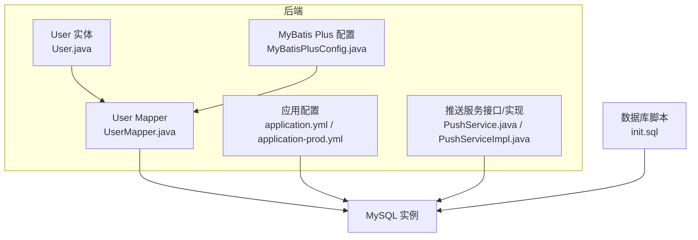
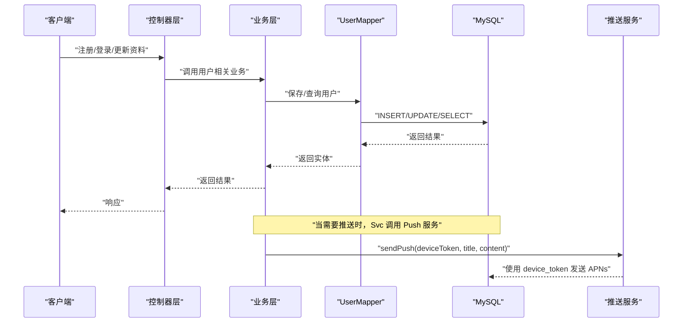
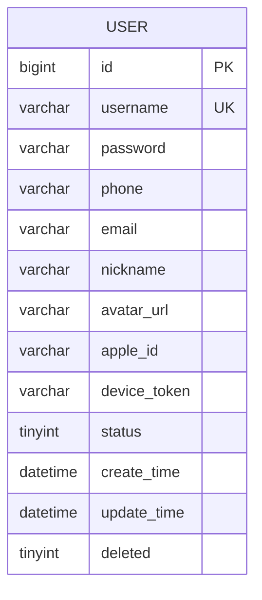
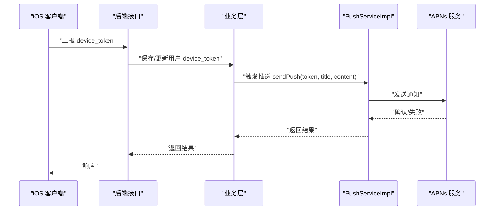
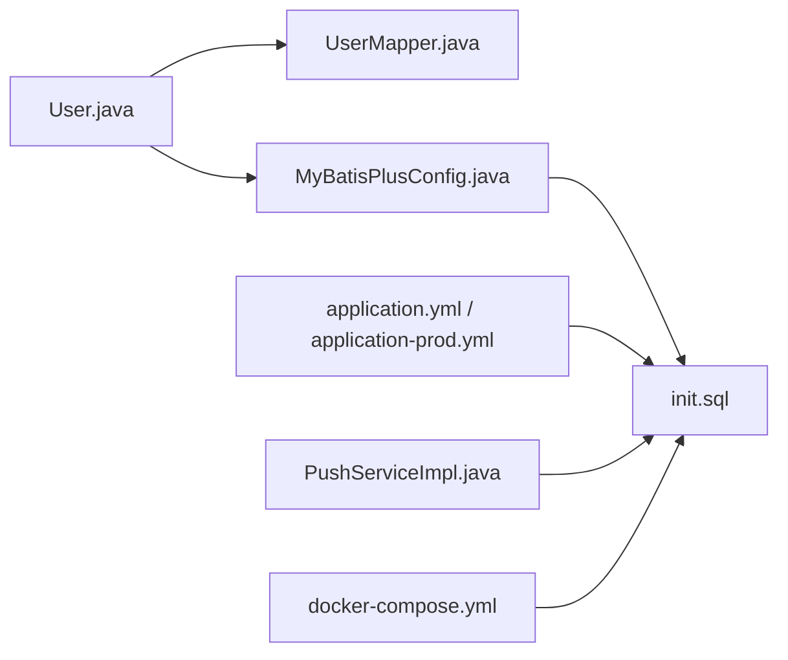

# 用户表 (user)

<cite>
**本文引用的文件**
- [User.java](file://backend/src/main/java/com/baby/entity/User.java)
- [init.sql](file://backend/src/main/resources/db/init.sql)
- [UserMapper.java](file://backend/src/main/java/com/baby/mapper/UserMapper.java)
- [MyBatisPlusConfig.java](file://backend/src/main/java/com/baby/config/MyBatisPlusConfig.java)
- [application.yml](file://backend/src/main/resources/application.yml)
- [application-prod.yml](file://backend/src/main/resources/application-prod.yml)
- [PushServiceImpl.java](file://backend/src/main/java/com/baby/service/impl/PushServiceImpl.java)
- [PushService.java](file://backend/src/main/java/com/baby/service/PushService.java)
- [.env.example](file://.env.example)
- [docker-compose.yml](file://docker-compose.yml)
- [init.sql（测试数据）](file://backend/src/main/resources/db/init.sql)
</cite>

## 目录
1. [简介](#简介)
2. [项目结构](#项目结构)
3. [核心组件](#核心组件)
4. [架构总览](#架构总览)
5. [详细组件分析](#详细组件分析)
6. [依赖关系分析](#依赖关系分析)
7. [性能考量](#性能考量)
8. [故障排查指南](#故障排查指南)
9. [结论](#结论)
10. [附录](#附录)

## 简介
本文件面向“用户表（user）”的完整说明，覆盖字段定义、数据类型、约束、默认值、业务意义、安全与隐私注意事项，并结合实体注解与数据库脚本交叉验证。重点解释：
- device_token 如何支撑 APNs 推送
- apple_id 如何支持 Apple 登录
- 密码字段的安全存储策略（bcrypt）
- 逻辑删除 deleted 的使用
- 时间戳自动填充机制
- 常见问题：大小写不敏感用户名唯一性、时区处理

## 项目结构
用户表位于后端 Java 工程中，采用 MyBatis-Plus 进行 ORM 映射，数据库初始化脚本在资源目录下，配置文件提供时区与时钟策略。

图表来源
- [User.java](file://backend/src/main/java/com/baby/entity/User.java#L1-L71)
- [UserMapper.java](file://backend/src/main/java/com/baby/mapper/UserMapper.java#L1-L13)
- [MyBatisPlusConfig.java](file://backend/src/main/java/com/baby/config/MyBatisPlusConfig.java#L1-L48)
- [application.yml](file://backend/src/main/resources/application.yml#L1-L98)
- [application-prod.yml](file://backend/src/main/resources/application-prod.yml#L1-L85)
- [PushService.java](file://backend/src/main/java/com/baby/service/PushService.java#L1-L22)
- [PushServiceImpl.java](file://backend/src/main/java/com/baby/service/impl/PushServiceImpl.java#L1-L67)
- [init.sql](file://backend/src/main/resources/db/init.sql#L1-L23)

章节来源
- [User.java](file://backend/src/main/java/com/baby/entity/User.java#L1-L71)
- [init.sql](file://backend/src/main/resources/db/init.sql#L1-L23)
- [application.yml](file://backend/src/main/resources/application.yml#L1-L98)
- [application-prod.yml](file://backend/src/main/resources/application-prod.yml#L1-L85)

## 核心组件
- 实体类：User.java 定义了用户表的字段、注解与业务语义。
- Mapper：UserMapper.java 继承 MyBatis-Plus 基类，提供通用 CRUD 能力。
- 配置：MyBatisPlusConfig.java 注册自动填充处理器，统一管理 create_time/update_time。
- 数据库：init.sql 定义表结构、索引、默认值与约束。
- 推送：PushService/PushServiceImpl 通过 device_token 触发 APNs 推送。

章节来源
- [User.java](file://backend/src/main/java/com/baby/entity/User.java#L1-L71)
- [UserMapper.java](file://backend/src/main/java/com/baby/mapper/UserMapper.java#L1-L13)
- [MyBatisPlusConfig.java](file://backend/src/main/java/com/baby/config/MyBatisPlusConfig.java#L1-L48)
- [init.sql](file://backend/src/main/resources/db/init.sql#L1-L23)
- [PushService.java](file://backend/src/main/java/com/baby/service/PushService.java#L1-L22)
- [PushServiceImpl.java](file://backend/src/main/java/com/baby/service/impl/PushServiceImpl.java#L1-L67)

## 架构总览
用户表在系统中的位置与交互如下：

图表来源
- [UserMapper.java](file://backend/src/main/java/com/baby/mapper/UserMapper.java#L1-L13)
- [init.sql](file://backend/src/main/resources/db/init.sql#L1-L23)
- [PushServiceImpl.java](file://backend/src/main/java/com/baby/service/impl/PushServiceImpl.java#L1-L67)

## 详细组件分析

### 字段定义与业务说明
以下字段均来自实体类与数据库脚本的映射，包含数据类型、约束、默认值与业务意义。

- id
  - 类型：BIGINT（自增主键）
  - 约束：PRIMARY KEY, AUTO_INCREMENT
  - 业务意义：用户唯一标识，贯穿所有关联记录
  - 参考路径：[init.sql](file://backend/src/main/resources/db/init.sql#L8-L8)

- username
  - 类型：VARCHAR(50)
  - 约束：UNIQUE
  - 默认值：无
  - 业务意义：登录凭据之一；需注意大小写不敏感的唯一性需求（见“常见问题”）
  - 参考路径：[init.sql](file://backend/src/main/resources/db/init.sql#L9-L9)

- password
  - 类型：VARCHAR(255)
  - 约束：无显式唯一性
  - 默认值：无
  - 业务意义：加密存储（bcrypt），不直接存储明文
  - 参考路径：[init.sql](file://backend/src/main/resources/db/init.sql#L10-L10)，[User.java](file://backend/src/main/java/com/baby/entity/User.java#L22-L26)

- phone
  - 类型：VARCHAR(20)
  - 约束：无
  - 默认值：无
  - 业务意义：手机号，可用于登录或找回密码
  - 参考路径：[init.sql](file://backend/src/main/resources/db/init.sql#L11-L11)

- email
  - 类型：VARCHAR(100)
  - 约束：无
  - 默认值：无
  - 业务意义：邮箱，可用于登录或找回密码
  - 参考路径：[init.sql](file://backend/src/main/resources/db/init.sql#L12-L12)

- nickname
  - 类型：VARCHAR(50)
  - 约束：无
  - 默认值：无
  - 业务意义：展示名称，便于界面友好显示
  - 参考路径：[init.sql](file://backend/src/main/resources/db/init.sql#L13-L13)

- avatar_url
  - 类型：VARCHAR(500)
  - 约束：无
  - 默认值：无
  - 业务意义：头像图片地址
  - 参考路径：[init.sql](file://backend/src/main/resources/db/init.sql#L14-L14)

- apple_id
  - 类型：VARCHAR(100)
  - 约束：无
  - 默认值：无
  - 业务意义：Apple 登录标识，支持 Apple ID 登录
  - 参考路径：[init.sql](file://backend/src/main/resources/db/init.sql#L15-L15)，[User.java](file://backend/src/main/java/com/baby/entity/User.java#L47-L51)

- device_token
  - 类型：VARCHAR(255)
  - 约束：无
  - 默认值：无
  - 业务意义：iOS 设备推送令牌，用于 APNs 推送
  - 参考路径：[init.sql](file://backend/src/main/resources/db/init.sql#L16-L16)，[User.java](file://backend/src/main/java/com/baby/entity/User.java#L52-L56)，[PushService.java](file://backend/src/main/java/com/baby/service/PushService.java#L1-L22)，[PushServiceImpl.java](file://backend/src/main/java/com/baby/service/impl/PushServiceImpl.java#L1-L67)

- status
  - 类型：TINYINT（0/1）
  - 约束：无
  - 默认值：1（正常）
  - 业务意义：账号状态，0 表示禁用，1 表示正常
  - 参考路径：[init.sql](file://backend/src/main/resources/db/init.sql#L17-L17)，[User.java](file://backend/src/main/java/com/baby/entity/User.java#L57-L61)

- create_time
  - 类型：DATETIME（默认 CURRENT_TIMESTAMP）
  - 约束：默认值
  - 业务意义：创建时间
  - 自动填充：MyBatis Plus 注解与全局配置共同保证插入时填充
  - 参考路径：[init.sql](file://backend/src/main/resources/db/init.sql#L18-L18)，[User.java](file://backend/src/main/java/com/baby/entity/User.java#L62-L66)，[MyBatisPlusConfig.java](file://backend/src/main/java/com/baby/config/MyBatisPlusConfig.java#L30-L48)

- update_time
  - 类型：DATETIME（默认 CURRENT_TIMESTAMP ON UPDATE CURRENT_TIMESTAMP）
  - 约束：默认值
  - 业务意义：最后更新时间
  - 自动填充：MyBatis Plus 注解与全局配置共同保证插入/更新时填充
  - 参考路径：[init.sql](file://backend/src/main/resources/db/init.sql#L19-L19)，[User.java](file://backend/src/main/java/com/baby/entity/User.java#L65-L66)，[MyBatisPlusConfig.java](file://backend/src/main/java/com/baby/config/MyBatisPlusConfig.java#L30-L48)

- deleted
  - 类型：TINYINT（0/1）
  - 约束：逻辑删除
  - 默认值：0（未删除）
  - 业务意义：逻辑删除标记，配合 MyBatis Plus 全局配置生效
  - 参考路径：[init.sql](file://backend/src/main/resources/db/init.sql#L20-L20)，[User.java](file://backend/src/main/java/com/baby/entity/User.java#L68-L70)，[application.yml](file://backend/src/main/resources/application.yml#L30-L35)，[application-prod.yml](file://backend/src/main/resources/application-prod.yml#L33-L44)

### 数据模型图

图表来源
- [init.sql](file://backend/src/main/resources/db/init.sql#L7-L23)

章节来源
- [init.sql](file://backend/src/main/resources/db/init.sql#L7-L23)
- [User.java](file://backend/src/main/java/com/baby/entity/User.java#L1-L71)

### 安全与隐私要点
- 密码存储：password 字段采用 bcrypt 加密存储，确保明文不落盘。测试数据中可见 bcrypt 密码哈希值，体现系统对密码安全的重视。
  - 参考路径：[init.sql](file://backend/src/main/resources/db/init.sql#L144-L146)
- Apple 登录：apple_id 字段用于绑定 Apple ID 登录，减少对传统用户名/密码的依赖，提升登录体验与安全性。
  - 参考路径：[User.java](file://backend/src/main/java/com/baby/entity/User.java#L47-L51)，[init.sql](file://backend/src/main/resources/db/init.sql#L15-L15)
- 设备令牌：device_token 仅用于推送通道标识，不应在日志或前端展示，避免泄露。
  - 参考路径：[User.java](file://backend/src/main/java/com/baby/entity/User.java#L52-L56)，[PushServiceImpl.java](file://backend/src/main/java/com/baby/service/impl/PushServiceImpl.java#L1-L67)
- 逻辑删除：deleted 字段启用逻辑删除，避免误删用户数据，符合隐私保护要求。
  - 参考路径：[User.java](file://backend/src/main/java/com/baby/entity/User.java#L68-L70)，[application.yml](file://backend/src/main/resources/application.yml#L30-L35)

章节来源
- [init.sql](file://backend/src/main/resources/db/init.sql#L144-L146)
- [User.java](file://backend/src/main/java/com/baby/entity/User.java#L1-L71)
- [PushServiceImpl.java](file://backend/src/main/java/com/baby/service/impl/PushServiceImpl.java#L1-L67)
- [application.yml](file://backend/src/main/resources/application.yml#L30-L35)

### 时间戳与自动填充
- MyBatis Plus 注解：@TableField(fill = FieldFill.INSERT) 与 @TableField(fill = FieldFill.INSERT_UPDATE) 控制 create_time/update_time 的自动填充。
- 全局配置：MyBatisPlusConfig.java 中的 MetaObjectHandler 在插入/更新时统一填充时间。
- 数据库默认值：create_time/update_time 在建表脚本中设置默认值，与注解和配置形成双重保障。
- 时区：数据库连接字符串包含 serverTimezone=Asia/Shanghai，确保时间字段按东八区存储与读取。
  - 参考路径：[User.java](file://backend/src/main/java/com/baby/entity/User.java#L62-L66)，[MyBatisPlusConfig.java](file://backend/src/main/java/com/baby/config/MyBatisPlusConfig.java#L30-L48)，[application.yml](file://backend/src/main/resources/application.yml#L10-L15)

章节来源
- [User.java](file://backend/src/main/java/com/baby/entity/User.java#L62-L66)
- [MyBatisPlusConfig.java](file://backend/src/main/java/com/baby/config/MyBatisPlusConfig.java#L30-L48)
- [application.yml](file://backend/src/main/resources/application.yml#L10-L15)

### APNs 推送流程（基于 device_token）
- 推送接口：PushService 提供 sendPush(deviceToken, title, content) 与 sendSilentPush(deviceToken, payload)。
- 实现：PushServiceImpl 在 apns.enabled=true 时集成 APNs 推送；否则进行模拟输出。
- 配置：application.yml 与 application-prod.yml 提供 APNs 开关、证书路径与主题等参数。
- iOS 端：设备首次登录或绑定时应将 device_token 上报至后端并持久化到 user.device_token。
  - 参考路径：[PushService.java](file://backend/src/main/java/com/baby/service/PushService.java#L1-L22)，[PushServiceImpl.java](file://backend/src/main/java/com/baby/service/impl/PushServiceImpl.java#L1-L67)，[application.yml](file://backend/src/main/resources/application.yml#L41-L48)，[application-prod.yml](file://backend/src/main/resources/application-prod.yml#L50-L57)，[init.sql](file://backend/src/main/resources/db/init.sql#L16-L16)

图表来源
- [PushService.java](file://backend/src/main/java/com/baby/service/PushService.java#L1-L22)
- [PushServiceImpl.java](file://backend/src/main/java/com/baby/service/impl/PushServiceImpl.java#L1-L67)
- [application.yml](file://backend/src/main/resources/application.yml#L41-L48)
- [application-prod.yml](file://backend/src/main/resources/application-prod.yml#L50-L57)
- [init.sql](file://backend/src/main/resources/db/init.sql#L16-L16)

### 示例行数据（账户状态）
- 活跃账户（status=1）：表示正常可用
- 禁用账户（status=0）：表示被管理员或系统限制登录
- 测试数据示例：数据库初始化脚本中包含一条测试用户记录，用户名、密码、手机号、昵称与状态均已设置，可作为开发/测试参考。
  - 参考路径：[init.sql（测试数据）](file://backend/src/main/resources/db/init.sql#L144-L146)

章节来源
- [init.sql（测试数据）](file://backend/src/main/resources/db/init.sql#L144-L146)

### 常见问题与最佳实践
- 大小写不敏感用户名唯一性
  - 现状：数据库层 username 设置为 UNIQUE，但未指定排序规则（collation）。若数据库默认排序规则区分大小写，则会出现“Admin”与“admin”被视为不同用户名的情况。
  - 建议：在数据库层面为 username 指定不区分大小写的排序规则（如 utf8mb4_0900_ai_ci 或 utf8mb4_unicode_ci），并在应用层统一转换为小写后再入库。
  - 参考路径：[init.sql](file://backend/src/main/resources/db/init.sql#L9-L9)
- 时区处理
  - 现状：数据库连接字符串包含 serverTimezone=Asia/Shanghai，确保时间以东八区存储。
  - 建议：应用侧统一使用带时区的时间类型（如 OffsetDateTime/ZonedDateTime），避免跨时区显示差异。
  - 参考路径：[application.yml](file://backend/src/main/resources/application.yml#L10-L15)

章节来源
- [init.sql](file://backend/src/main/resources/db/init.sql#L9-L9)
- [application.yml](file://backend/src/main/resources/application.yml#L10-L15)

## 依赖关系分析
- 实体与 Mapper：User.java 与 UserMapper.java 形成标准的 MyBatis-Plus 映射关系。
- 自动填充：MyBatisPlusConfig.java 的 MetaObjectHandler 与 User.java 的 @TableField 注解协同工作。
- 逻辑删除：application.yml 中的 global-config.db-config.logic-delete-* 配置与 User.java 的 @TableLogic 注解配合。
- 数据库初始化：docker-compose.yml 将 init.sql 挂载到 MySQL 初始化目录，确保容器启动即创建表结构。
- 推送依赖：PushServiceImpl 依赖 application.yml 中的 APNs 配置项。

图表来源
- [User.java](file://backend/src/main/java/com/baby/entity/User.java#L1-L71)
- [UserMapper.java](file://backend/src/main/java/com/baby/mapper/UserMapper.java#L1-L13)
- [MyBatisPlusConfig.java](file://backend/src/main/java/com/baby/config/MyBatisPlusConfig.java#L1-L48)
- [init.sql](file://backend/src/main/resources/db/init.sql#L1-L23)
- [application.yml](file://backend/src/main/resources/application.yml#L30-L48)
- [application-prod.yml](file://backend/src/main/resources/application-prod.yml#L33-L57)
- [PushServiceImpl.java](file://backend/src/main/java/com/baby/service/impl/PushServiceImpl.java#L1-L67)
- [docker-compose.yml](file://docker-compose.yml#L28-L44)

章节来源
- [User.java](file://backend/src/main/java/com/baby/entity/User.java#L1-L71)
- [UserMapper.java](file://backend/src/main/java/com/baby/mapper/UserMapper.java#L1-L13)
- [MyBatisPlusConfig.java](file://backend/src/main/java/com/baby/config/MyBatisPlusConfig.java#L1-L48)
- [application.yml](file://backend/src/main/resources/application.yml#L30-L48)
- [application-prod.yml](file://backend/src/main/resources/application-prod.yml#L33-L57)
- [PushServiceImpl.java](file://backend/src/main/java/com/baby/service/impl/PushServiceImpl.java#L1-L67)
- [docker-compose.yml](file://docker-compose.yml#L28-L44)

## 性能考量
- 索引设计：表中为 phone 与 apple_id 建立了普通索引，有助于按手机号或 Apple ID 快速检索用户。
  - 参考路径：[init.sql](file://backend/src/main/resources/db/init.sql#L21-L22)
- 逻辑删除：deleted 字段启用逻辑删除，避免大表 DROP/重建带来的性能损耗。
  - 参考路径：[User.java](file://backend/src/main/java/com/baby/entity/User.java#L68-L70)，[application.yml](file://backend/src/main/resources/application.yml#L30-L35)
- 自动填充：统一在插入/更新时填充时间戳，减少业务代码重复，降低出错概率。
  - 参考路径：[MyBatisPlusConfig.java](file://backend/src/main/java/com/baby/config/MyBatisPlusConfig.java#L30-L48)

章节来源
- [init.sql](file://backend/src/main/resources/db/init.sql#L21-L22)
- [User.java](file://backend/src/main/java/com/baby/entity/User.java#L68-L70)
- [application.yml](file://backend/src/main/resources/application.yml#L30-L35)
- [MyBatisPlusConfig.java](file://backend/src/main/java/com/baby/config/MyBatisPlusConfig.java#L30-L48)

## 故障排查指南
- 登录失败（用户名/密码）
  - 检查用户名是否大小写不一致导致唯一性冲突（参见“常见问题”）。
  - 确认密码为 bcrypt 哈希，且未明文存储。
  - 参考路径：[init.sql（测试数据）](file://backend/src/main/resources/db/init.sql#L144-L146)
- 推送失败（APNs）
  - 确认 apns.enabled=true 且证书路径与主题正确。
  - 检查 device_token 是否为空或过期。
  - 参考路径：[application.yml](file://backend/src/main/resources/application.yml#L41-L48)，[application-prod.yml](file://backend/src/main/resources/application-prod.yml#L50-L57)，[PushServiceImpl.java](file://backend/src/main/java/com/baby/service/impl/PushServiceImpl.java#L1-L67)
- 时间显示异常
  - 检查数据库连接字符串 serverTimezone=Asia/Shanghai 是否生效。
  - 参考路径：[application.yml](file://backend/src/main/resources/application.yml#L10-L15)
- 逻辑删除误删
  - 确认 deleted 字段未被业务层误改，遵循软删除策略。
  - 参考路径：[User.java](file://backend/src/main/java/com/baby/entity/User.java#L68-L70)，[application.yml](file://backend/src/main/resources/application.yml#L30-L35)

章节来源
- [init.sql（测试数据）](file://backend/src/main/resources/db/init.sql#L144-L146)
- [application.yml](file://backend/src/main/resources/application.yml#L10-L15)
- [application-prod.yml](file://backend/src/main/resources/application-prod.yml#L50-L57)
- [PushServiceImpl.java](file://backend/src/main/java/com/baby/service/impl/PushServiceImpl.java#L1-L67)
- [User.java](file://backend/src/main/java/com/baby/entity/User.java#L68-L70)

## 结论
用户表（user）在本系统中承担核心身份与推送能力职责。通过 bcrypt 存储密码、逻辑删除与自动时间填充，兼顾了安全、可维护性与一致性。device_token 与 Apple ID 的引入提升了用户体验与登录安全性。建议在部署时完善数据库排序规则与 APNs 配置，并在业务层统一处理大小写与时区问题，确保跨平台一致性与合规性。

## 附录
- 环境变量与配置
  - APNs 相关：APNS_ENABLED、APNS_PRODUCTION、APNS_CERTIFICATE_PATH、APNS_CERTIFICATE_PASSWORD、APNS_TOPIC
  - 参考路径：[application.yml](file://backend/src/main/resources/application.yml#L41-L48)，[application-prod.yml](file://backend/src/main/resources/application-prod.yml#L50-L57)，[.env.example](file://.env.example#L1-L12)
- 数据库初始化
  - init.sql 脚本负责创建 user 表及索引，docker-compose.yml 将其挂载到 MySQL 初始化目录。
  - 参考路径：[init.sql](file://backend/src/main/resources/db/init.sql#L1-L23)，[docker-compose.yml](file://docker-compose.yml#L28-L44)