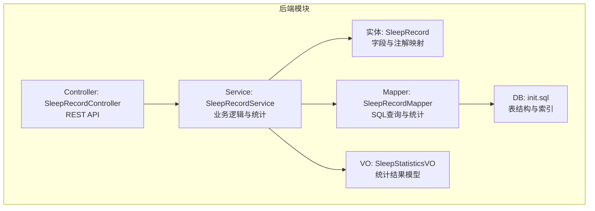
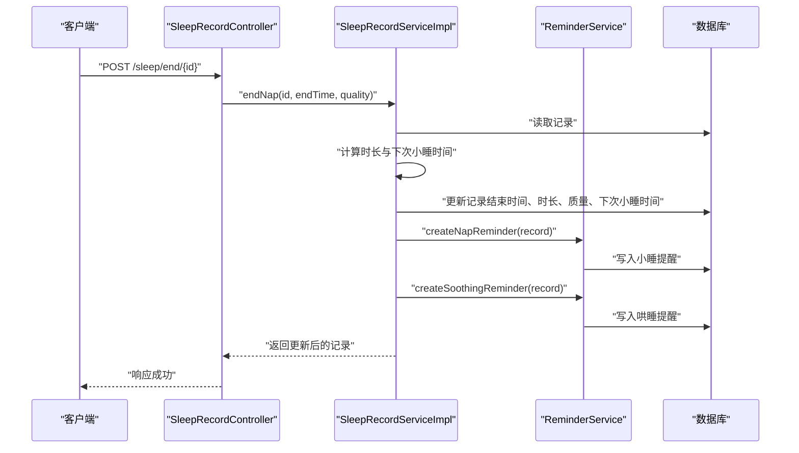
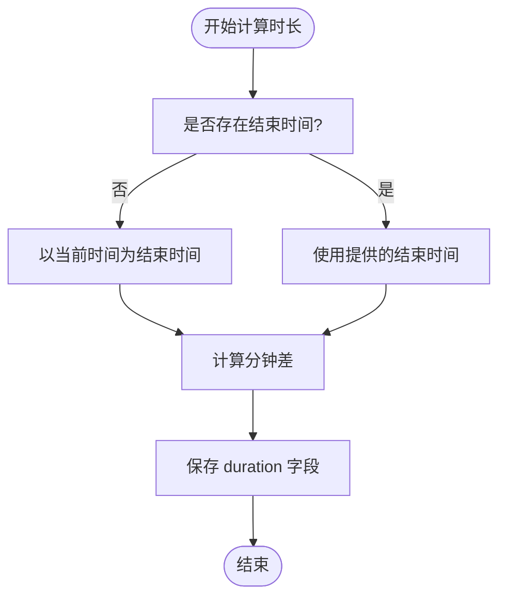
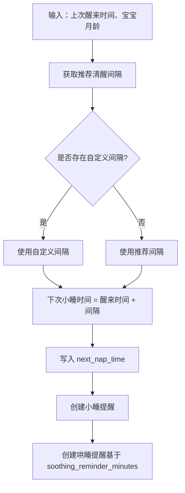
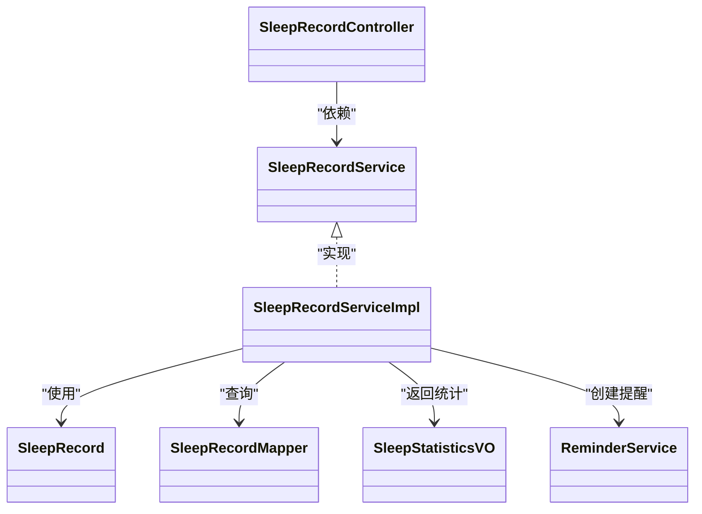

# 睡眠记录表 (sleep_record)

<cite>
**本文引用的文件**
- [SleepRecord.java](file://backend/src/main/java/com/baby/entity/SleepRecord.java)
- [SleepRecordMapper.java](file://backend/src/main/java/com/baby/mapper/SleepRecordMapper.java)
- [SleepRecordService.java](file://backend/src/main/java/com/baby/service/SleepRecordService.java)
- [SleepRecordServiceImpl.java](file://backend/src/main/java/com/baby/service/impl/SleepRecordServiceImpl.java)
- [SleepRecordController.java](file://backend/src/main/java/com/baby/controller/SleepRecordController.java)
- [SleepRecordDTO.java](file://backend/src/main/java/com/baby/dto/SleepRecordDTO.java)
- [SleepStatisticsVO.java](file://backend/src/main/java/com/baby/vo/SleepStatisticsVO.java)
- [init.sql](file://backend/src/main/resources/db/init.sql)
- [ReminderService.java](file://backend/src/main/java/com/baby/service/ReminderService.java)
- [StatisticsController.java](file://backend/src/main/java/com/baby/controller/StatisticsController.java)
</cite>

## 目录
1. [简介](#简介)
2. [项目结构](#项目结构)
3. [核心组件](#核心组件)
4. [架构总览](#架构总览)
5. [详细组件分析](#详细组件分析)
6. [依赖关系分析](#依赖关系分析)
7. [性能考量](#性能考量)
8. [故障排查指南](#故障排查指南)
9. [结论](#结论)
10. [附录](#附录)

## 简介
本文件围绕 babyFeedingReminder 系统中的睡眠记录表（sleep_record）进行系统化文档说明。重点覆盖字段语义、MyBatis Plus 注解映射、业务流程（开始/结束小睡、更新记录）、统计分析（日均、小睡次数、质量分布）、预测调度（下次小睡时间）与主动提醒（哄睡提醒）。同时提供常见问题处理建议（如时长计算、空结束时间记录、索引策略等），并给出健康与被打断睡眠的示例行数据，帮助开发者与产品人员理解如何通过 sleep_record 支撑睡眠模式分析与育儿决策。

## 项目结构
- 后端采用 Spring Boot + MyBatis Plus 架构，实体、Mapper、Service、Controller 分层清晰。
- 睡眠记录相关代码集中在 entity、mapper、service、controller 包中，并在数据库初始化脚本中定义了表结构与索引。

图表来源
- [SleepRecord.java](file://backend/src/main/java/com/baby/entity/SleepRecord.java#L1-L76)
- [SleepRecordMapper.java](file://backend/src/main/java/com/baby/mapper/SleepRecordMapper.java#L1-L48)
- [SleepRecordService.java](file://backend/src/main/java/com/baby/service/SleepRecordService.java#L1-L71)
- [SleepRecordServiceImpl.java](file://backend/src/main/java/com/baby/service/impl/SleepRecordServiceImpl.java#L1-L279)
- [SleepRecordController.java](file://backend/src/main/java/com/baby/controller/SleepRecordController.java#L1-L139)
- [SleepStatisticsVO.java](file://backend/src/main/java/com/baby/vo/SleepStatisticsVO.java#L1-L87)
- [init.sql](file://backend/src/main/resources/db/init.sql#L65-L84)

章节来源
- [SleepRecord.java](file://backend/src/main/java/com/baby/entity/SleepRecord.java#L1-L76)
- [init.sql](file://backend/src/main/resources/db/init.sql#L65-L84)

## 核心组件
- 实体类 SleepRecord：定义字段与 MyBatis Plus 注解，承载单条睡眠记录的完整信息。
- Mapper 接口 SleepRecordMapper：提供按日期范围统计、当日总时长与小睡次数等查询能力。
- Service 接口与实现 SleepRecordService/SleepRecordServiceImpl：负责创建/更新记录、开始/结束小睡、计算下次小睡时间、生成统计报表。
- 控制器 SleepRecordController：对外暴露 REST API，支持创建、结束小睡、查询、统计等。
- 统计模型 SleepStatisticsVO：封装统计结果，包括总时长、日均、小睡次数、平均时长、质量分布与推荐对比。
- 数据库脚本 init.sql：定义 sleep_record 表结构与索引。

章节来源
- [SleepRecord.java](file://backend/src/main/java/com/baby/entity/SleepRecord.java#L1-L76)
- [SleepRecordMapper.java](file://backend/src/main/java/com/baby/mapper/SleepRecordMapper.java#L1-L48)
- [SleepRecordService.java](file://backend/src/main/java/com/baby/service/SleepRecordService.java#L1-L71)
- [SleepRecordServiceImpl.java](file://backend/src/main/java/com/baby/service/impl/SleepRecordServiceImpl.java#L1-L279)
- [SleepRecordController.java](file://backend/src/main/java/com/baby/controller/SleepRecordController.java#L1-L139)
- [SleepStatisticsVO.java](file://backend/src/main/java/com/baby/vo/SleepStatisticsVO.java#L1-L87)
- [init.sql](file://backend/src/main/resources/db/init.sql#L65-L84)

## 架构总览
以下序列图展示“结束小睡”流程，体现从 API 到服务、再到提醒创建的关键调用链：

图表来源
- [SleepRecordController.java](file://backend/src/main/java/com/baby/controller/SleepRecordController.java#L48-L66)
- [SleepRecordServiceImpl.java](file://backend/src/main/java/com/baby/service/impl/SleepRecordServiceImpl.java#L104-L134)
- [ReminderService.java](file://backend/src/main/java/com/baby/service/ReminderService.java#L1-L64)

## 详细组件分析

### 表结构与字段说明
- 表名：sleep_record
- 主键：id（自增）
- 关联字段：baby_id（外键关联宝宝表）
- 时间字段：start_time（入睡时间）、end_time（醒来时间）、create_time、update_time
- 业务字段：
  - sleep_type：睡眠类型（1-小睡，2-夜间睡眠）
  - duration：实际睡眠时长（分钟）
  - planned_duration：计划睡眠时长（分钟）
  - next_nap_time：下次小睡预计时间
  - soothing_reminder_minutes：哄睡提醒提前分钟数
  - quality：睡眠质量（1-好，2-一般，3-差）
  - remark：备注
  - deleted：逻辑删除标志

MyBatis Plus 注解映射要点
- 实体类使用 @TableName("sleep_record") 映射表名
- 字段使用 @TableId、@TableField 进行主键与自动填充控制
- 逻辑删除使用 @TableLogic

章节来源
- [init.sql](file://backend/src/main/resources/db/init.sql#L65-L84)
- [SleepRecord.java](file://backend/src/main/java/com/baby/entity/SleepRecord.java#L1-L76)

### 字段语义与业务含义
- id：唯一标识，自增主键
- baby_id：所属宝宝，用于分组与统计
- sleep_type：区分小睡与夜间睡眠，支撑按类型统计与质量分析
- start_time：入睡时间，作为时间范围查询与排序的基础
- end_time：醒来时间；若为空表示当前仍在睡眠中（未完成记录）
- duration：实际睡眠时长（分钟）；由 start_time 与 end_time 计算得出
- planned_duration：计划睡眠时长（分钟），依据月龄推荐值设定
- next_nap_time：基于上次醒来时间与推荐清醒间隔推导的下次小睡时间，用于预测性调度
- soothing_reminder_minutes：哄睡提醒提前分钟数，结合 next_nap_time 生成哄睡提醒
- quality：睡眠质量分级，支持质量分布统计与趋势分析
- remark：人工备注，便于记录特殊情况
- create_time/update_time/deleted：通用审计字段与逻辑删除

章节来源
- [SleepRecord.java](file://backend/src/main/java/com/baby/entity/SleepRecord.java#L1-L76)
- [SleepRecordServiceImpl.java](file://backend/src/main/java/com/baby/service/impl/SleepRecordServiceImpl.java#L47-L134)

### 时长计算与不完整记录处理
- 时长计算：当存在 start_time 与 end_time 时，使用分钟级差计算 duration
- 不完整记录：end_time 为空时，表示当前仍在睡眠中；服务层在结束小睡时补全 end_time 并重新计算时长
- 计划时长：根据宝宝月龄获取推荐小睡时长，写入 planned_duration

图表来源
- [SleepRecordServiceImpl.java](file://backend/src/main/java/com/baby/service/impl/SleepRecordServiceImpl.java#L116-L119)
- [SleepRecordServiceImpl.java](file://backend/src/main/java/com/baby/service/impl/SleepRecordServiceImpl.java#L149-L153)

章节来源
- [SleepRecordServiceImpl.java](file://backend/src/main/java/com/baby/service/impl/SleepRecordServiceImpl.java#L116-L119)
- [SleepRecordServiceImpl.java](file://backend/src/main/java/com/baby/service/impl/SleepRecordServiceImpl.java#L149-L153)

### 预测调度：下次小睡时间
- next_nap_time 基于上次醒来时间（或结束时间）与推荐清醒间隔计算
- 若存在自定义设置，则优先使用自定义间隔
- 生成小睡提醒与哄睡提醒，形成闭环

图表来源
- [SleepRecordServiceImpl.java](file://backend/src/main/java/com/baby/service/impl/SleepRecordServiceImpl.java#L240-L251)
- [ReminderService.java](file://backend/src/main/java/com/baby/service/ReminderService.java#L1-L64)

章节来源
- [SleepRecordServiceImpl.java](file://backend/src/main/java/com/baby/service/impl/SleepRecordServiceImpl.java#L240-L251)
- [ReminderService.java](file://backend/src/main/java/com/baby/service/ReminderService.java#L1-L64)

### 质量分析：sleep_type 与 quality 的作用
- sleep_type：区分小睡与夜间睡眠，支持按类型统计次数与平均时长
- quality：1-好、2-一般、3-差，用于质量分布统计与趋势分析
- 统计接口会按类型与质量进行聚合，输出对比推荐值与建议

章节来源
- [SleepRecordService.java](file://backend/src/main/java/com/baby/service/SleepRecordService.java#L1-L71)
- [SleepRecordServiceImpl.java](file://backend/src/main/java/com/baby/service/impl/SleepRecordServiceImpl.java#L186-L237)
- [SleepStatisticsVO.java](file://backend/src/main/java/com/baby/vo/SleepStatisticsVO.java#L1-L87)

### API 与工作流
- 创建记录：支持手动添加与开始/结束小睡两种方式
- 查询：按日期范围、今日记录、最近一次记录
- 统计：日均睡眠时长、小睡次数、平均每次小睡时长、质量分布、与推荐值对比

章节来源
- [SleepRecordController.java](file://backend/src/main/java/com/baby/controller/SleepRecordController.java#L1-L139)
- [SleepRecordService.java](file://backend/src/main/java/com/baby/service/SleepRecordService.java#L1-L71)
- [StatisticsController.java](file://backend/src/main/java/com/baby/controller/StatisticsController.java#L1-L149)

### 示例行数据：健康 vs. 打断睡眠
- 健康小睡（已完成）
  - baby_id：1
  - sleep_type：1（小睡）
  - start_time：某日 13:00
  - end_time：13:45
  - duration：45
  - planned_duration：约 60-90（依据月龄推荐）
  - next_nap_time：13:45 + 推荐清醒间隔
  - soothing_reminder_minutes：10-30（依据设置）
  - quality：1（好）
  - remark：无
- 打断睡眠（未完成或质量较差）
  - baby_id：1
  - sleep_type：1（小睡）
  - start_time：13:00
  - end_time：null 或 13:20（早醒）
  - duration：由 start_time 到 end_time 计算（若 end_time 为 null，服务层会在结束小睡时补全）
  - planned_duration：同上
  - next_nap_time：13:20（若已结束）或 null（若尚未结束）
  - soothing_reminder_minutes：10-30
  - quality：3（差）
  - remark：夜间频繁醒来、环境嘈杂

说明：以上为示意描述，具体数值以系统推荐与实际记录为准。

## 依赖关系分析
- 控制器依赖服务接口，服务实现依赖实体、Mapper、提醒服务与设置表
- Mapper 依赖数据库表结构与索引
- 统计接口依赖服务实现与 VO 模型

图表来源
- [SleepRecordController.java](file://backend/src/main/java/com/baby/controller/SleepRecordController.java#L1-L139)
- [SleepRecordService.java](file://backend/src/main/java/com/baby/service/SleepRecordService.java#L1-L71)
- [SleepRecordServiceImpl.java](file://backend/src/main/java/com/baby/service/impl/SleepRecordServiceImpl.java#L1-L279)
- [SleepRecord.java](file://backend/src/main/java/com/baby/entity/SleepRecord.java#L1-L76)
- [SleepRecordMapper.java](file://backend/src/main/java/com/baby/mapper/SleepRecordMapper.java#L1-L48)
- [SleepStatisticsVO.java](file://backend/src/main/java/com/baby/vo/SleepStatisticsVO.java#L1-L87)
- [ReminderService.java](file://backend/src/main/java/com/baby/service/ReminderService.java#L1-L64)

## 性能考量
- 索引策略（基于表结构与查询需求）：
  - idx_baby_id：加速按宝宝维度查询
  - idx_start_time：加速按开始时间排序与范围查询
  - idx_baby_start：复合索引，优化按宝宝+开始时间的范围查询
- 统计查询：
  - 按日期范围聚合（每日总时长、次数）适合在数据库侧完成，避免应用层大量遍历
  - 当前 Mapper 已提供按日期范围统计与当日汇总查询，建议在高并发场景下配合缓存与分页
- 时间范围查询：
  - 服务层对日期范围边界进行了合理处理（包含起止时间当天），避免漏查或重复

章节来源
- [init.sql](file://backend/src/main/resources/db/init.sql#L65-L84)
- [SleepRecordMapper.java](file://backend/src/main/java/com/baby/mapper/SleepRecordMapper.java#L1-L48)
- [SleepRecordServiceImpl.java](file://backend/src/main/java/com/baby/service/impl/SleepRecordServiceImpl.java#L160-L176)

## 故障排查指南
- 时长计算异常
  - 症状：duration 为负或为 0
  - 排查：确认 start_time 与 end_time 的先后顺序；确保两者均非空
  - 参考路径：[时长计算逻辑](file://backend/src/main/java/com/baby/service/impl/SleepRecordServiceImpl.java#L116-L119)
- 未完成记录（end_time 为空）
  - 症状：无法结束小睡或统计缺失
  - 处理：调用结束小睡接口补全 end_time，并重新计算时长
  - 参考路径：[结束小睡流程](file://backend/src/main/java/com/baby/service/impl/SleepRecordServiceImpl.java#L104-L134)
- next_nap_time 未生成
  - 症状：未创建小睡提醒
  - 排查：确认 sleep_type 是否为小睡、end_time 是否存在、是否已调用结束小睡流程
  - 参考路径：[下次小睡时间计算](file://backend/src/main/java/com/baby/service/impl/SleepRecordServiceImpl.java#L240-L251)
- 质量分布统计异常
  - 症状：质量分布为空或百分比异常
  - 排查：确认 quality 字段是否正确填写；统计接口会过滤空值
  - 参考路径：[质量分布统计](file://backend/src/main/java/com/baby/service/impl/SleepRecordServiceImpl.java#L224-L234)
- 索引未生效导致慢查询
  - 症状：按日期范围查询缓慢
  - 处理：确认 idx_baby_start、idx_start_time 是否存在；检查查询条件是否命中索引
  - 参考路径：[索引定义](file://backend/src/main/resources/db/init.sql#L65-L84)

章节来源
- [SleepRecordServiceImpl.java](file://backend/src/main/java/com/baby/service/impl/SleepRecordServiceImpl.java#L104-L134)
- [SleepRecordServiceImpl.java](file://backend/src/main/java/com/baby/service/impl/SleepRecordServiceImpl.java#L224-L234)
- [init.sql](file://backend/src/main/resources/db/init.sql#L65-L84)

## 结论
sleep_record 表通过明确的字段语义与完善的业务流程，为婴儿睡眠模式分析提供了坚实基础。借助 sleep_type 与 quality 的分类，系统能够进行类型化统计与质量分析；通过 next_nap_time 与 soothing_reminder_minutes，实现了预测性调度与主动提醒，有效提升育儿效率与睡眠质量。配合合理的索引与统计查询，系统可在高并发场景下保持良好性能。

## 附录

### API 定义（节选）
- 创建记录
  - 方法：POST /sleep
  - 请求体：SleepRecordDTO
  - 返回：SleepRecord
- 开始小睡
  - 方法：POST /sleep/start/{babyId}
  - 参数：startTime（可选）
  - 返回：SleepRecord
- 结束小睡
  - 方法：POST /sleep/end/{id}
  - 参数：endTime（可选）、quality（可选）
  - 返回：SleepRecord
- 查询今日记录
  - 方法：GET /sleep/today/{babyId}
  - 返回：List<SleepRecord>
- 按日期范围查询
  - 方法：GET /sleep/range/{babyId}
  - 参数：startDate、endDate
  - 返回：List<SleepRecord>
- 获取统计
  - 方法：GET /sleep/statistics/{babyId}
  - 参数：startDate、endDate
  - 返回：SleepStatisticsVO

章节来源
- [SleepRecordController.java](file://backend/src/main/java/com/baby/controller/SleepRecordController.java#L1-L139)
- [SleepRecordDTO.java](file://backend/src/main/java/com/baby/dto/SleepRecordDTO.java#L1-L47)
- [SleepStatisticsVO.java](file://backend/src/main/java/com/baby/vo/SleepStatisticsVO.java#L1-L87)

### MyBatis Plus 注解与实体映射
- 表名映射：@TableName("sleep_record")
- 主键：@TableId(type = IdType.AUTO)
- 自动填充：@TableField(fill = FieldFill.INSERT/INSERT_UPDATE)
- 逻辑删除：@TableLogic

章节来源
- [SleepRecord.java](file://backend/src/main/java/com/baby/entity/SleepRecord.java#L1-L76)