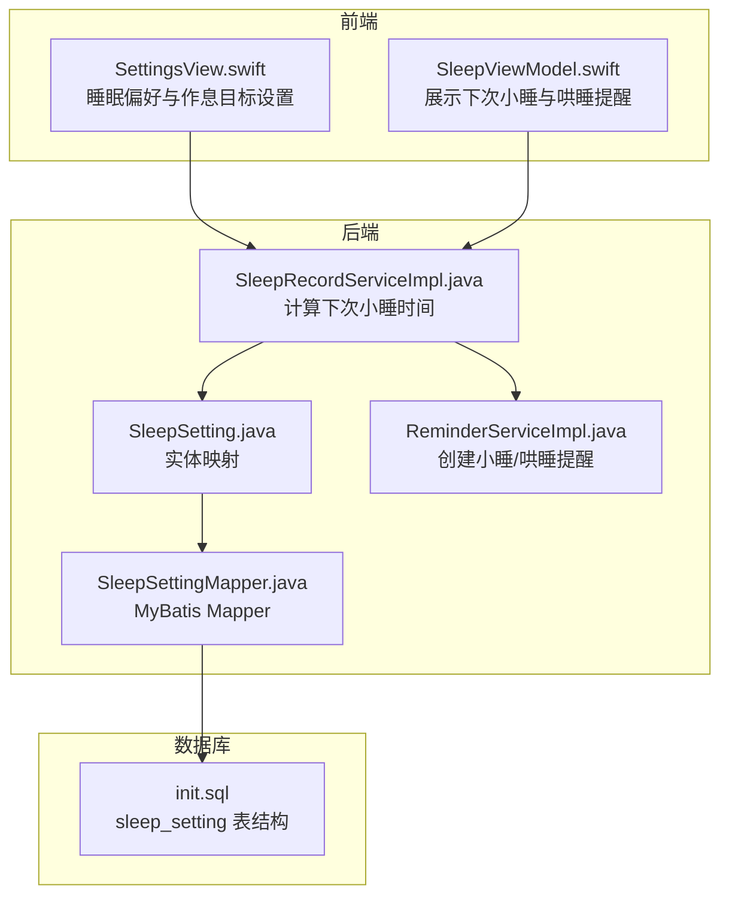
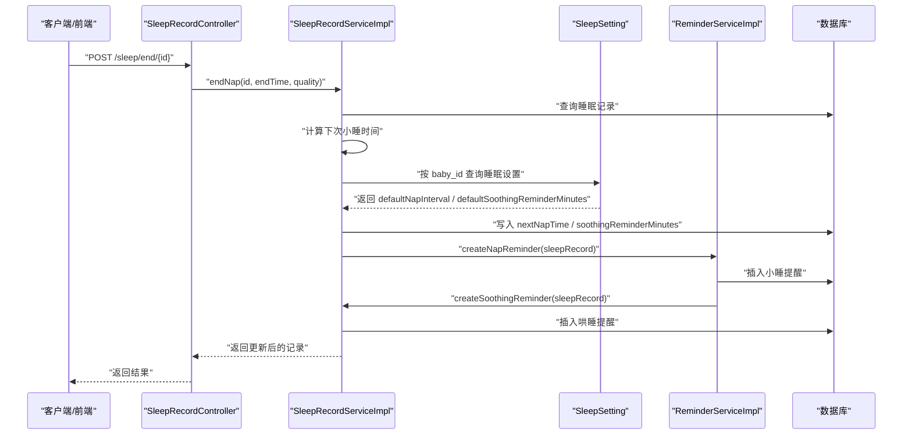
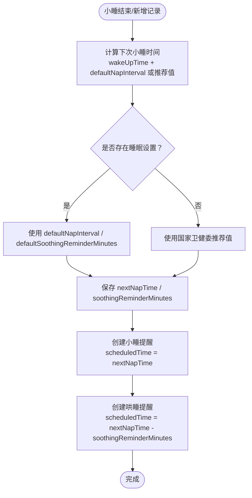
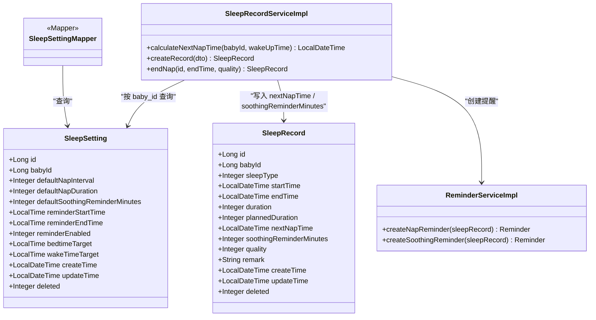
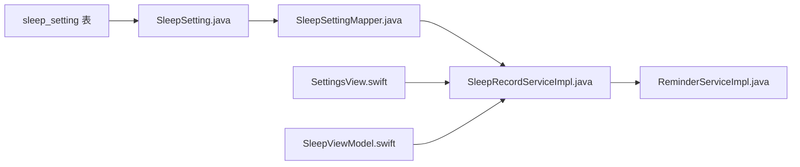

# 睡眠设置表 (sleep_setting)

<cite>
**本文引用的文件**
- [SleepSetting.java](file://backend/src/main/java/com/baby/entity/SleepSetting.java)
- [SleepSettingMapper.java](file://backend/src/main/java/com/baby/mapper/SleepSettingMapper.java)
- [init.sql](file://backend/src/main/resources/db/init.sql)
- [SleepRecordServiceImpl.java](file://backend/src/main/java/com/baby/service/impl/SleepRecordServiceImpl.java)
- [ReminderServiceImpl.java](file://backend/src/main/java/com/baby/service/impl/ReminderServiceImpl.java)
- [SleepRecordController.java](file://backend/src/main/java/com/baby/controller/SleepRecordController.java)
- [SleepRecord.java](file://backend/src/main/java/com/baby/entity/SleepRecord.java)
- [SettingsView.swift](file://ios/BabyFeedingReminder/Views/SettingsView.swift)
- [SleepViewModel.swift](file://ios/BabyFeedingReminder/ViewModels/SleepViewModel.swift)
</cite>

## 目录
1. [简介](#简介)
2. [项目结构与定位](#项目结构与定位)
3. [核心组件](#核心组件)
4. [架构总览](#架构总览)
5. [详细组件分析](#详细组件分析)
6. [依赖关系分析](#依赖关系分析)
7. [性能与扩展性考虑](#性能与扩展性考虑)
8. [故障排查指南](#故障排查指南)
9. [结论](#结论)
10. [附录：字段说明与示例](#附录字段说明与示例)

## 简介
本节面向“睡眠设置表（sleep_setting）”的完整文档，覆盖字段语义、业务含义、与提醒调度的集成方式、时间约束校验策略以及不同年龄组的典型配置建议。重点解释：
- bedtime_target（20:00）与 wake_time_target（07:00）如何建立健康的昼夜节律；
- default_soothing_reminder_minutes（15）如何为哄睡提供及时干预；
- reminder_start_time（6:00）至 reminder_end_time（20:00）如何限定白天小睡提醒窗口；
- 基于 SleepSetting.java 的实体映射与 UNIQUE(baby_id) 约束；
- 与提醒调度逻辑（ReminderServiceImpl）的衔接。

## 项目结构与定位
- 表结构定义位于数据库初始化脚本中，包含主键、唯一约束、默认值与注释。
- Java 实体层通过 MyBatis-Plus 注解映射到 sleep_setting 表。
- 业务层在 SleepRecordServiceImpl 中读取 SleepSetting 并参与“下次小睡时间”的计算；在 ReminderServiceImpl 中将“下次小睡时间”与“哄睡提醒时间”转化为定时提醒任务。
- iOS 端 SettingsView.swift 与 SleepViewModel.swift 展示了用户对睡眠偏好（默认小睡间隔、默认小睡时长、哄睡提前提醒）与作息目标（入睡/起床目标）的配置入口。

图表来源
- [SleepSetting.java](file://backend/src/main/java/com/baby/entity/SleepSetting.java#L1-L71)
- [SleepSettingMapper.java](file://backend/src/main/java/com/baby/mapper/SleepSettingMapper.java#L1-L12)
- [init.sql](file://backend/src/main/resources/db/init.sql#L104-L119)
- [SleepRecordServiceImpl.java](file://backend/src/main/java/com/baby/service/impl/SleepRecordServiceImpl.java#L240-L251)
- [ReminderServiceImpl.java](file://backend/src/main/java/com/baby/service/impl/ReminderServiceImpl.java#L103-L164)
- [SettingsView.swift](file://ios/BabyFeedingReminder/Views/SettingsView.swift#L247-L272)
- [SleepViewModel.swift](file://ios/BabyFeedingReminder/ViewModels/SleepViewModel.swift#L41-L76)

章节来源
- [init.sql](file://backend/src/main/resources/db/init.sql#L104-L119)
- [SleepSetting.java](file://backend/src/main/java/com/baby/entity/SleepSetting.java#L1-L71)
- [SleepSettingMapper.java](file://backend/src/main/java/com/baby/mapper/SleepSettingMapper.java#L1-L12)
- [SleepRecordServiceImpl.java](file://backend/src/main/java/com/baby/service/impl/SleepRecordServiceImpl.java#L240-L251)
- [ReminderServiceImpl.java](file://backend/src/main/java/com/baby/service/impl/ReminderServiceImpl.java#L103-L164)
- [SettingsView.swift](file://ios/BabyFeedingReminder/Views/SettingsView.swift#L247-L272)
- [SleepViewModel.swift](file://ios/BabyFeedingReminder/ViewModels/SleepViewModel.swift#L41-L76)

## 核心组件
- 实体映射：SleepSetting.java 映射 sleep_setting 表，包含主键 id、关联宝宝的 baby_id、默认小睡间隔/时长、默认哄睡提醒分钟数、提醒起止时间、是否启用提醒、睡前/晨起目标时间、创建/更新时间与逻辑删除字段 deleted。
- 数据库约束：UNIQUE(baby_id) 确保每个宝宝仅有一套睡眠偏好配置。
- 业务集成：
  - 计算下次小睡时间：SleepRecordServiceImpl 在小睡结束或新增记录时，依据推荐清醒间隔与用户自定义 defaultNapInterval 计算 nextNapTime，并将 defaultSoothingReminderMinutes 写入睡眠记录以生成哄睡提醒。
  - 提醒调度：ReminderServiceImpl 将 nextNapTime 作为“小睡提醒”，并将 nextNapTime 减去 soothingReminderMinutes 作为“哄睡提醒”的触发时间。
- 前端交互：iOS SettingsView.swift 提供“小睡设置”和“作息目标”界面；SleepViewModel.swift 展示“下次小睡时间”和“哄睡提醒分钟数”。

章节来源
- [SleepSetting.java](file://backend/src/main/java/com/baby/entity/SleepSetting.java#L1-L71)
- [init.sql](file://backend/src/main/resources/db/init.sql#L104-L119)
- [SleepRecordServiceImpl.java](file://backend/src/main/java/com/baby/service/impl/SleepRecordServiceImpl.java#L50-L87)
- [ReminderServiceImpl.java](file://backend/src/main/java/com/baby/service/impl/ReminderServiceImpl.java#L103-L164)
- [SettingsView.swift](file://ios/BabyFeedingReminder/Views/SettingsView.swift#L247-L272)
- [SleepViewModel.swift](file://ios/BabyFeedingReminder/ViewModels/SleepViewModel.swift#L41-L76)

## 架构总览
以下序列图展示了“记录小睡结束”到“创建小睡/哄睡提醒”的端到端流程，体现 sleep_setting 与提醒调度的耦合点。

图表来源
- [SleepRecordController.java](file://backend/src/main/java/com/baby/controller/SleepRecordController.java#L58-L65)
- [SleepRecordServiceImpl.java](file://backend/src/main/java/com/baby/service/impl/SleepRecordServiceImpl.java#L104-L134)
- [ReminderServiceImpl.java](file://backend/src/main/java/com/baby/service/impl/ReminderServiceImpl.java#L103-L164)
- [SleepRecord.java](file://backend/src/main/java/com/baby/entity/SleepRecord.java#L1-L75)

## 详细组件分析

### 字段语义与业务含义
- id：自增主键，唯一标识一条睡眠设置记录。
- baby_id：外键关联宝宝表，UNIQUE 约束确保每个宝宝仅有一份睡眠偏好配置。
- default_nap_interval：默认小睡间隔（分钟）。系统在计算下次小睡时间时优先使用该值，否则采用国家卫健委指南推荐值。
- default_nap_duration：默认小睡时长（分钟），用于 UI 展示与统计参考。
- default_soothing_reminder_minutes：默认哄睡提前提醒分钟数。系统据此在“下次小睡时间”前生成“哄睡提醒”。
- reminder_start_time / reminder_end_time：提醒时段起止时间（24 小时制）。系统仅在该窗口内发送小睡/哄睡提醒。
- reminder_enabled：是否启用提醒（0 否，1 是）。
- bedtime_target：晚间入睡目标时间（24 小时制）。配合 wake_time_target 构建昼夜节律。
- wake_time_target：早晨起床目标时间（24 小时制）。
- create_time / update_time：自动填充的创建与更新时间。
- deleted：逻辑删除标志。

章节来源
- [SleepSetting.java](file://backend/src/main/java/com/baby/entity/SleepSetting.java#L1-L71)
- [init.sql](file://backend/src/main/resources/db/init.sql#L104-L119)

### 时间窗口与昼夜节律设计
- reminder_start_time（6:00）至 reminder_end_time（20:00）限定白天小睡提醒窗口，避免夜间打扰。
- bedtime_target（20:00）与 wake_time_target（07:00）形成“晚睡-早起”的健康作息闭环，符合婴幼儿昼夜节律建议。
- default_soothing_reminder_minutes（15）为哄睡提供充足准备时间，便于家长在“下次小睡时间”前完成环境布置与安抚。

章节来源
- [init.sql](file://backend/src/main/resources/db/init.sql#L104-L119)
- [SleepRecordServiceImpl.java](file://backend/src/main/java/com/baby/service/impl/SleepRecordServiceImpl.java#L240-L251)
- [ReminderServiceImpl.java](file://backend/src/main/java/com/baby/service/impl/ReminderServiceImpl.java#L136-L164)
- [SettingsView.swift](file://ios/BabyFeedingReminder/Views/SettingsView.swift#L247-L272)

### 与提醒调度的集成
- “下次小睡时间”由 SleepRecordServiceImpl 基于“上次醒来时间 + 清醒间隔”计算，若存在用户自定义 defaultNapInterval 则优先使用。
- ReminderServiceImpl 将 nextNapTime 作为“小睡提醒”，并将 nextNapTime 减去 soothingReminderMinutes 作为“哄睡提醒”的触发时间。
- 若记录为夜间睡眠或非小睡场景，不生成“下次小睡提醒”。

图表来源
- [SleepRecordServiceImpl.java](file://backend/src/main/java/com/baby/service/impl/SleepRecordServiceImpl.java#L50-L87)
- [ReminderServiceImpl.java](file://backend/src/main/java/com/baby/service/impl/ReminderServiceImpl.java#L103-L164)

章节来源
- [SleepRecordServiceImpl.java](file://backend/src/main/java/com/baby/service/impl/SleepRecordServiceImpl.java#L50-L87)
- [ReminderServiceImpl.java](file://backend/src/main/java/com/baby/service/impl/ReminderServiceImpl.java#L103-L164)

### 类关系图（代码级）

图表来源
- [SleepSetting.java](file://backend/src/main/java/com/baby/entity/SleepSetting.java#L1-L71)
- [SleepRecord.java](file://backend/src/main/java/com/baby/entity/SleepRecord.java#L1-L75)
- [SleepSettingMapper.java](file://backend/src/main/java/com/baby/mapper/SleepSettingMapper.java#L1-L12)
- [SleepRecordServiceImpl.java](file://backend/src/main/java/com/baby/service/impl/SleepRecordServiceImpl.java#L240-L251)
- [ReminderServiceImpl.java](file://backend/src/main/java/com/baby/service/impl/ReminderServiceImpl.java#L103-L164)

## 依赖关系分析
- 表结构依赖：UNIQUE(baby_id) 保证一对一关系；默认值与注释提供清晰的业务语义。
- 实体依赖：SleepSetting.java 通过 MyBatis-Plus 注解映射表字段；SleepSettingMapper 继承 BaseMapper，提供通用 CRUD。
- 业务依赖：SleepRecordServiceImpl 依赖 SleepSettingMapper 读取用户偏好；ReminderServiceImpl 依赖 SleepRecord 的 nextNapTime 与 soothingReminderMinutes 生成提醒。
- 前端依赖：SettingsView.swift 与 SleepViewModel.swift 读取并展示“下次小睡时间”和“哄睡提醒分钟数”，并与后端接口交互。

图表来源
- [init.sql](file://backend/src/main/resources/db/init.sql#L104-L119)
- [SleepSetting.java](file://backend/src/main/java/com/baby/entity/SleepSetting.java#L1-L71)
- [SleepSettingMapper.java](file://backend/src/main/java/com/baby/mapper/SleepSettingMapper.java#L1-L12)
- [SleepRecordServiceImpl.java](file://backend/src/main/java/com/baby/service/impl/SleepRecordServiceImpl.java#L240-L251)
- [ReminderServiceImpl.java](file://backend/src/main/java/com/baby/service/impl/ReminderServiceImpl.java#L103-L164)
- [SettingsView.swift](file://ios/BabyFeedingReminder/Views/SettingsView.swift#L247-L272)
- [SleepViewModel.swift](file://ios/BabyFeedingReminder/ViewModels/SleepViewModel.swift#L41-L76)

章节来源
- [init.sql](file://backend/src/main/resources/db/init.sql#L104-L119)
- [SleepSetting.java](file://backend/src/main/java/com/baby/entity/SleepSetting.java#L1-L71)
- [SleepSettingMapper.java](file://backend/src/main/java/com/baby/mapper/SleepSettingMapper.java#L1-L12)
- [SleepRecordServiceImpl.java](file://backend/src/main/java/com/baby/service/impl/SleepRecordServiceImpl.java#L240-L251)
- [ReminderServiceImpl.java](file://backend/src/main/java/com/baby/service/impl/ReminderServiceImpl.java#L103-L164)
- [SettingsView.swift](file://ios/BabyFeedingReminder/Views/SettingsView.swift#L247-L272)
- [SleepViewModel.swift](file://ios/BabyFeedingReminder/ViewModels/SleepViewModel.swift#L41-L76)

## 性能与扩展性考虑
- 查询路径：按 baby_id 查询睡眠设置为单条记录读取，索引命中良好；建议保持该查询方式不变。
- 计算复杂度：下次小睡时间计算为 O(1)，无额外复杂度。
- 扩展方向：
  - 支持按年龄段动态调整 default_nap_interval 与 default_nap_duration（当前已通过国家卫健委指南实现）。
  - 支持多时段提醒窗口（如午觉与晚觉分别设置）。
  - 支持跨天边界的时间处理（例如 bedtime_target 早于 wake_time_target 的场景）。

[本节为通用建议，不直接分析具体文件]

## 故障排查指南
- 症状：重复创建睡眠设置导致冲突
  - 原因：UNIQUE(baby_id) 约束
  - 处理：确保每次更新而非重复插入；或先删除旧记录再插入新记录
  - 参考：[init.sql](file://backend/src/main/resources/db/init.sql#L104-L119)
- 症状：提醒未按时发送
  - 检查 reminder_enabled 与 reminder_start_time/reminder_end_time 是否在合理范围内
  - 检查 nextNapTime 与 soothingReminderMinutes 是否正确写入
  - 参考：[SleepRecordServiceImpl.java](file://backend/src/main/java/com/baby/service/impl/SleepRecordServiceImpl.java#L50-L87)、[ReminderServiceImpl.java](file://backend/src/main/java/com/baby/service/impl/ReminderServiceImpl.java#L103-L164)
- 症状：下次小睡时间异常
  - 检查 default_nap_interval 是否被正确覆盖；确认 wakeUpTime 来源是否为上一次小睡结束时间
  - 参考：[SleepRecordServiceImpl.java](file://backend/src/main/java/com/baby/service/impl/SleepRecordServiceImpl.java#L240-L251)
- 症状：iOS 界面显示异常
  - 检查 SettingsView.swift 与 SleepViewModel.swift 的数据绑定是否正确
  - 参考：[SettingsView.swift](file://ios/BabyFeedingReminder/Views/SettingsView.swift#L247-L272)、[SleepViewModel.swift](file://ios/BabyFeedingReminder/ViewModels/SleepViewModel.swift#L41-L76)

章节来源
- [init.sql](file://backend/src/main/resources/db/init.sql#L104-L119)
- [SleepRecordServiceImpl.java](file://backend/src/main/java/com/baby/service/impl/SleepRecordServiceImpl.java#L50-L87)
- [ReminderServiceImpl.java](file://backend/src/main/java/com/baby/service/impl/ReminderServiceImpl.java#L103-L164)
- [SettingsView.swift](file://ios/BabyFeedingReminder/Views/SettingsView.swift#L247-L272)
- [SleepViewModel.swift](file://ios/BabyFeedingReminder/ViewModels/SleepViewModel.swift#L41-L76)

## 结论
sleep_setting 通过明确的字段语义与数据库约束，为婴儿睡眠管理提供了稳定的偏好基线。结合国家卫健委指南与系统化的提醒调度，能够有效帮助家长建立规律的昼夜节律与高质量的小睡习惯。default_soothing_reminder_minutes（15）与 reminder_start_time 至 reminder_end_time 的组合，既保证了及时干预，又避免了夜间打扰。

[本节为总结性内容，不直接分析具体文件]

## 附录：字段说明与示例

### 字段说明与默认值
- id：自增主键
- baby_id：唯一约束（UNIQUE），关联宝宝
- default_nap_interval：默认小睡间隔（分钟），默认 120
- default_nap_duration：默认小睡时长（分钟），默认 90
- default_soothing_reminder_minutes：默认哄睡提前提醒（分钟），默认 15
- reminder_start_time：提醒时段开始，默认 06:00:00
- reminder_end_time：提醒时段结束，默认 20:00:00
- reminder_enabled：是否启用提醒，默认 1
- bedtime_target：晚间入睡目标，默认 20:00:00
- wake_time_target：早晨起床目标，默认 07:00:00
- create_time / update_time：自动填充
- deleted：逻辑删除

章节来源
- [init.sql](file://backend/src/main/resources/db/init.sql#L104-L119)
- [SleepSetting.java](file://backend/src/main/java/com/baby/entity/SleepSetting.java#L1-L71)

### 不同年龄组的典型配置建议（基于国家卫健委指南）
- 0-3 月龄：日均睡眠 14–17 小时，小睡 4–5 次，清醒间隔约 45–60 分钟，小睡时长约 60 分钟
- 3-6 月龄：日均睡眠 12–16 小时，小睡 3–4 次，清醒间隔约 90 分钟，小睡时长约 90 分钟
- 6-9 月龄：日均睡眠 12–15 小时，小睡 2–3 次，清醒间隔约 120 分钟，小睡时长约 90 分钟
- 9-12 月龄：日均睡眠 12–14 小时，小睡 2–2 次，清醒间隔约 150 分钟，小睡时长约 90 分钟
- 12-18 月龄：日均睡眠 11–14 小时，小睡 1–2 次，清醒间隔约 180 分钟，小睡时长约 120 分钟
- 18-24 月龄：日均睡眠 11–14 小时，小睡 1–1 次，清醒间隔约 240 分钟，小睡时长约 120 分钟

章节来源
- [SleepRecordServiceImpl.java](file://backend/src/main/java/com/baby/service/impl/SleepRecordServiceImpl.java#L37-L45)

### 示例行数据（示意）
- 0-3 月龄：default_nap_interval=60，default_nap_duration=60，default_soothing_reminder_minutes=15，reminder_start_time=06:00，reminder_end_time=20:00，bedtime_target=20:00，wake_time_target=07:00
- 6-9 月龄：default_nap_interval=120，default_nap_duration=90，default_soothing_reminder_minutes=15，reminder_start_time=06:00，reminder_end_time=20:00，bedtime_target=20:00，wake_time_target=07:00
- 12-18 月龄：default_nap_interval=180，default_nap_duration=120，default_soothing_reminder_minutes=15，reminder_start_time=06:00，reminder_end_time=20:00，bedtime_target=20:00，wake_time_target=07:00

章节来源
- [init.sql](file://backend/src/main/resources/db/init.sql#L104-L119)
- [SleepRecordServiceImpl.java](file://backend/src/main/java/com/baby/service/impl/SleepRecordServiceImpl.java#L37-L45)

### 与实体与接口的交叉引用
- 实体映射：SleepSetting.java
- 数据访问：SleepSettingMapper.java
- 业务计算：SleepRecordServiceImpl.java（计算下次小睡时间）
- 提醒创建：ReminderServiceImpl.java（小睡/哄睡提醒）
- 控制器：SleepRecordController.java（对外接口）
- 前端交互：SettingsView.swift、SleepViewModel.swift

章节来源
- [SleepSetting.java](file://backend/src/main/java/com/baby/entity/SleepSetting.java#L1-L71)
- [SleepSettingMapper.java](file://backend/src/main/java/com/baby/mapper/SleepSettingMapper.java#L1-L12)
- [SleepRecordServiceImpl.java](file://backend/src/main/java/com/baby/service/impl/SleepRecordServiceImpl.java#L240-L251)
- [ReminderServiceImpl.java](file://backend/src/main/java/com/baby/service/impl/ReminderServiceImpl.java#L103-L164)
- [SleepRecordController.java](file://backend/src/main/java/com/baby/controller/SleepRecordController.java#L58-L65)
- [SettingsView.swift](file://ios/BabyFeedingReminder/Views/SettingsView.swift#L247-L272)
- [SleepViewModel.swift](file://ios/BabyFeedingReminder/ViewModels/SleepViewModel.swift#L41-L76)