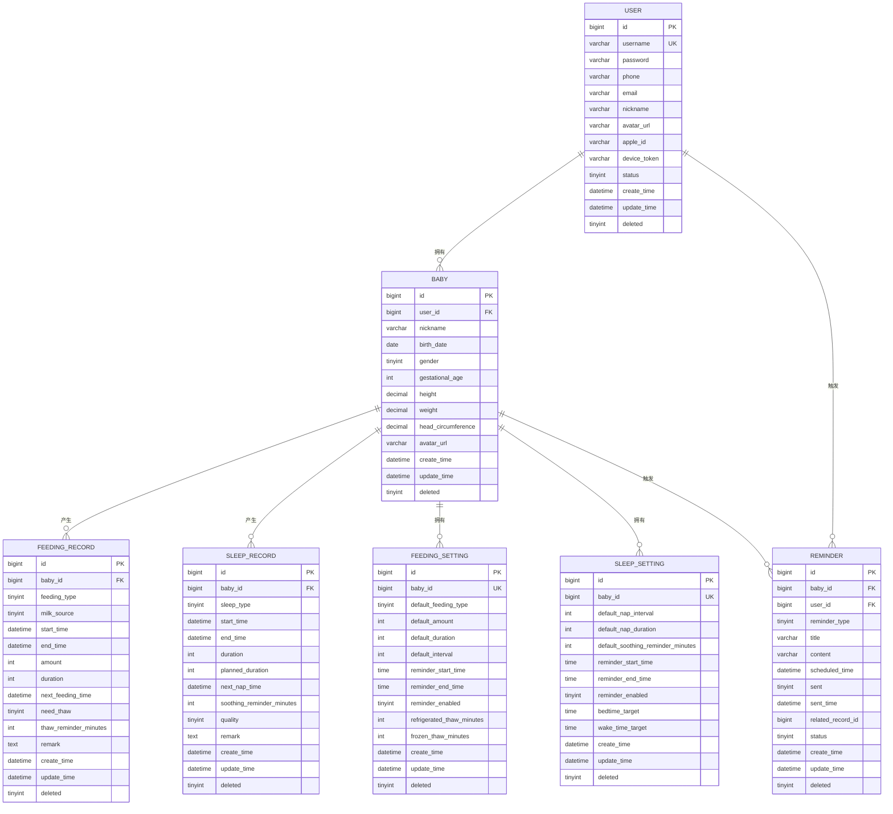
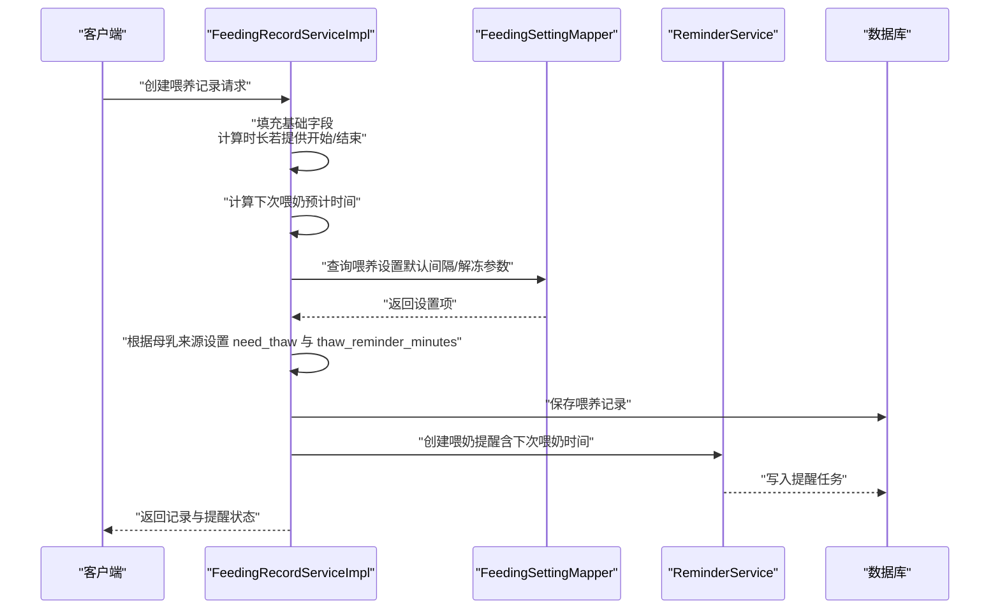

# 表结构说明

<cite>
**本文引用的文件**
- [init.sql](file://backend/src/main/resources/db/init.sql)
- [User.java](file://backend/src/main/java/com/baby/entity/User.java)
- [Baby.java](file://backend/src/main/java/com/baby/entity/Baby.java)
- [FeedingRecord.java](file://backend/src/main/java/com/baby/entity/FeedingRecord.java)
- [SleepRecord.java](file://backend/src/main/java/com/baby/entity/SleepRecord.java)
- [FeedingSetting.java](file://backend/src/main/java/com/baby/entity/FeedingSetting.java)
- [SleepSetting.java](file://backend/src/main/java/com/baby/entity/SleepSetting.java)
- [Reminder.java](file://backend/src/main/java/com/baby/entity/Reminder.java)
- [FeedingRecordServiceImpl.java](file://backend/src/main/java/com/baby/service/impl/FeedingRecordServiceImpl.java)
- [PushServiceImpl.java](file://backend/src/main/java/com/baby/service/impl/PushServiceImpl.java)
</cite>

## 目录
1. [简介](#简介)
2. [项目结构与数据模型概览](#项目结构与数据模型概览)
3. [核心数据表详解](#核心数据表详解)
   - [用户表 user](#用户表-user)
   - [宝宝信息表 baby](#宝宝信息表-baby)
   - [喂养记录表 feeding_record](#喂养记录表-feeding_record)
   - [睡眠记录表 sleep_record](#睡眠记录表-sleep_record)
   - [喂养设置表 feeding_setting](#喂养设置表-feeding_setting)
   - [睡眠设置表 sleep_setting](#睡眠设置表-sleep_setting)
   - [提醒任务表 reminder](#提醒任务表-reminder)
4. [架构与业务流程图](#架构与业务流程图)
5. [依赖关系与约束校验](#依赖关系与约束校验)
6. [性能与索引策略](#性能与索引策略)
7. [安全与合规要点](#安全与合规要点)
8. [常见问题与排障](#常见问题与排障)
9. [结论](#结论)

## 简介
本文件面向 babyFeedingReminder 系统的数据层，系统包含用户、宝宝、喂养、睡眠、设置与提醒等核心表。本文从字段定义、数据类型、约束、默认值、注释出发，结合实体类映射关系，解释各列的业务含义与作用，并给出典型行样例以帮助理解有效数据状态。同时，针对关键业务字段如“母乳来源”“睡眠质量”“下次喂奶预计时间”等进行深入说明；并讨论时区处理与敏感数据加密等合规要求。

## 项目结构与数据模型概览
- 数据库初始化脚本定义了 seven 张表：user、baby、feeding_record、sleep_record、feeding_setting、sleep_setting、reminder。
- Java 实体类与数据库表一一对应，采用 MyBatis-Plus 注解标注表名与逻辑删除字段，字段命名遵循驼峰与下划线映射规则。
- 服务层对关键业务逻辑进行封装，例如喂养记录创建时计算“下次喂奶预计时间”，并据此生成提醒任务。

图表来源
- [init.sql](file://backend/src/main/resources/db/init.sql#L6-L23)
- [init.sql](file://backend/src/main/resources/db/init.sql#L25-L41)
- [init.sql](file://backend/src/main/resources/db/init.sql#L43-L63)
- [init.sql](file://backend/src/main/resources/db/init.sql#L65-L84)
- [init.sql](file://backend/src/main/resources/db/init.sql#L86-L102)
- [init.sql](file://backend/src/main/resources/db/init.sql#L104-L119)
- [init.sql](file://backend/src/main/resources/db/init.sql#L121-L141)

章节来源
- [init.sql](file://backend/src/main/resources/db/init.sql#L1-L147)

## 核心数据表详解

### 用户表 user
- 字段与类型
  - id: bigint, 自增主键
  - username: varchar(50), 唯一索引
  - password: varchar(255), 存储加密后的密码
  - phone: varchar(20), 索引 idx_phone
  - email: varchar(100)
  - nickname: varchar(50)
  - avatar_url: varchar(500)
  - apple_id: varchar(100), 索引 idx_apple_id
  - device_token: varchar(255), 用于推送通知
  - status: tinyint, 默认 1（正常）
  - create_time: datetime, 默认当前时间
  - update_time: datetime, 默认当前时间，更新时自动更新
  - deleted: tinyint, 默认 0（逻辑删除）
- 实体类映射
  - Java 字段名与 SQL 列名一致，除驼峰到下划线映射外，无额外转换。
- 业务要点
  - device_token 用于移动端推送，服务端通过 PushService 发送 APNs 推送。
  - password 字段应始终以加密形式存储，避免明文。
- 典型行样例
  - 包含用户名、加密密码、手机号、昵称、状态等字段的有效组合。

章节来源
- [init.sql](file://backend/src/main/resources/db/init.sql#L6-L23)
- [User.java](file://backend/src/main/java/com/baby/entity/User.java#L1-L71)
- [PushServiceImpl.java](file://backend/src/main/java/com/baby/service/impl/PushServiceImpl.java#L1-L68)

### 宝宝信息表 baby
- 字段与类型
  - id: bigint, 自增主键
  - user_id: bigint, 外键关联 user.id
  - nickname: varchar(50), 非空
  - birth_date: date, 非空
  - gender: tinyint, 0-女, 1-男
  - gestational_age: int, 出生胎龄（周）
  - height: decimal(5,2), 身高（cm）
  - weight: decimal(5,2), 体重（kg）
  - head_circumference: decimal(5,2), 头围（cm）
  - avatar_url: varchar(500)
  - create_time: datetime, 默认当前时间
  - update_time: datetime, 默认当前时间，更新时自动更新
  - deleted: tinyint, 默认 0（逻辑删除）
- 实体类映射
  - Java 字段名与 SQL 列名一致，驼峰映射。
- 业务要点
  - 作为喂养、睡眠、设置与提醒的上游对象，所有记录均按 baby_id 进行分组与统计。
- 典型行样例
  - 包含用户ID、昵称、出生日期、性别、身高体重头围等字段的有效组合。

章节来源
- [init.sql](file://backend/src/main/resources/db/init.sql#L25-L41)
- [Baby.java](file://backend/src/main/java/com/baby/entity/Baby.java#L1-L72)

### 喂养记录表 feeding_record
- 字段与类型
  - id: bigint, 自增主键
  - baby_id: bigint, 外键关联 baby.id
  - feeding_type: tinyint, 1-母乳, 2-奶粉, 3-混合喂养
  - milk_source: tinyint, 1-亲喂, 2-瓶装母乳（冷藏）, 3-瓶装母乳（冷冻）
  - start_time: datetime, 非空
  - end_time: datetime
  - amount: int, 奶量（ml）
  - duration: int, 喂养时长（分钟）
  - next_feeding_time: datetime, 下次喂奶预计时间（由服务层根据年龄与设置计算）
  - need_thaw: tinyint, 默认 0（否），当 milk_source 为冷藏/冷冻时置 1
  - thaw_reminder_minutes: int, 解冻提醒提前分钟数（冷藏/冷冻）
  - remark: text
  - create_time: datetime, 默认当前时间
  - update_time: datetime, 默认当前时间，更新时自动更新
  - deleted: tinyint, 默认 0（逻辑删除）
- 实体类映射
  - Java 字段名与 SQL 列名一致，驼峰映射。
- 业务要点
  - next_feeding_time 是智能调度的核心字段，结合喂养设置中的默认间隔与年龄指南推导得出。
  - milk_source 与 need_thaw/thaw_reminder_minutes 共同驱动“解冻提醒”的生成与推送。
- 典型行样例
  - 包含喂养类型、开始/结束时间、奶量、时长、下次预计喂奶时间、是否需要解冻及解冻提醒分钟数等字段的有效组合。

章节来源
- [init.sql](file://backend/src/main/resources/db/init.sql#L43-L63)
- [FeedingRecord.java](file://backend/src/main/java/com/baby/entity/FeedingRecord.java#L1-L81)
- [FeedingRecordServiceImpl.java](file://backend/src/main/java/com/baby/service/impl/FeedingRecordServiceImpl.java#L47-L114)
- [FeedingRecordServiceImpl.java](file://backend/src/main/java/com/baby/service/impl/FeedingRecordServiceImpl.java#L191-L203)

### 睡眠记录表 sleep_record
- 字段与类型
  - id: bigint, 自增主键
  - baby_id: bigint, 外键关联 baby.id
  - sleep_type: tinyint, 1-小睡, 2-夜间睡眠
  - start_time: datetime, 非空（入睡时间）
  - end_time: datetime（醒来时间）
  - duration: int, 实际睡眠时长（分钟）
  - planned_duration: int, 计划睡眠时长（分钟）
  - next_nap_time: datetime, 下次小睡预计时间
  - soothing_reminder_minutes: int, 哄睡提前提醒（分钟）
  - quality: tinyint, 1-好, 2-一般, 3-差
  - remark: text
  - create_time: datetime, 默认当前时间
  - update_time: datetime, 默认当前时间，更新时自动更新
  - deleted: tinyint, 默认 0（逻辑删除）
- 实体类映射
  - Java 字段名与 SQL 列名一致，驼峰映射。
- 业务要点
  - quality 字段用于睡眠质量评估，支持后续统计与趋势分析。
  - next_nap_time 与 soothing_reminder_minutes 支持小睡与哄睡提醒的智能生成。
- 典型行样例
  - 包含睡眠类型、入睡/醒来时间、实际/计划时长、下次小睡预计时间、哄睡提醒分钟数、睡眠质量等字段的有效组合。

章节来源
- [init.sql](file://backend/src/main/resources/db/init.sql#L65-L84)
- [SleepRecord.java](file://backend/src/main/java/com/baby/entity/SleepRecord.java#L1-L76)

### 喂养设置表 feeding_setting
- 字段与类型
  - id: bigint, 自增主键
  - baby_id: bigint, 唯一索引，外键关联 baby.id
  - default_feeding_type: tinyint, 默认喂养类型
  - default_amount: int, 默认奶量（ml）
  - default_duration: int, 默认喂养时长（分钟）
  - default_interval: int, 默认喂养间隔（分钟）
  - reminder_start_time: time, 默认 06:00:00
  - reminder_end_time: time, 默认 22:00:00
  - reminder_enabled: tinyint, 默认 1（启用）
  - refrigerated_thaw_minutes: int, 冷藏母乳解冻提前分钟数，默认 15
  - frozen_thaw_minutes: int, 冷冻母乳解冻提前分钟数，默认 30
  - create_time: datetime, 默认当前时间
  - update_time: datetime, 默认当前时间，更新时自动更新
  - deleted: tinyint, 默认 0（逻辑删除）
- 实体类映射
  - Java 字段名与 SQL 列名一致，驼峰映射。
- 业务要点
  - default_interval 与年龄相关的推荐间隔共同决定“下次喂奶预计时间”的推导。
  - 解冻相关字段影响喂养记录中 need_thaw 与 thaw_reminder_minutes 的默认值。
- 典型行样例
  - 包含默认喂养类型、默认奶量、默认时长、默认间隔、提醒时段、是否启用提醒、冷藏/冷冻解冻提前分钟数等字段的有效组合。

章节来源
- [init.sql](file://backend/src/main/resources/db/init.sql#L86-L102)
- [FeedingSetting.java](file://backend/src/main/java/com/baby/entity/FeedingSetting.java#L1-L77)

### 睡眠设置表 sleep_setting
- 字段与类型
  - id: bigint, 自增主键
  - baby_id: bigint, 唯一索引，外键关联 baby.id
  - default_nap_interval: int, 默认小睡间隔（分钟）
  - default_nap_duration: int, 默认小睡时长（分钟）
  - default_soothing_reminder_minutes: int, 默认哄睡提前提醒（分钟）
  - reminder_start_time: time, 默认 06:00:00
  - reminder_end_time: time, 默认 20:00:00
  - reminder_enabled: tinyint, 默认 1（启用）
  - bedtime_target: time, 晚间入睡目标时间，默认 20:00:00
  - wake_time_target: time, 早晨起床目标时间，默认 07:00:00
  - create_time: datetime, 默认当前时间
  - update_time: datetime, 默认当前时间，更新时自动更新
  - deleted: tinyint, 默认 0（逻辑删除）
- 实体类映射
  - Java 字段名与 SQL 列名一致，驼峰映射。
- 业务要点
  - bedtime_target 与 wake_time_target 用于建立昼夜节律目标，辅助生成睡眠提醒。
- 典型行样例
  - 包含默认小睡间隔/时长、默认哄睡提醒分钟数、提醒时段、是否启用提醒、入睡/起床目标时间等字段的有效组合。

章节来源
- [init.sql](file://backend/src/main/resources/db/init.sql#L104-L119)
- [SleepSetting.java](file://backend/src/main/java/com/baby/entity/SleepSetting.java#L1-L72)

### 提醒任务表 reminder
- 字段与类型
  - id: bigint, 自增主键
  - baby_id: bigint, 外键关联 baby.id
  - user_id: bigint, 外键关联 user.id
  - reminder_type: tinyint, 1-喂奶提醒, 2-解冻提醒, 3-小睡提醒, 4-哄睡提醒
  - title: varchar(100), 非空
  - content: varchar(500), 非空
  - scheduled_time: datetime, 非空（预定提醒时间）
  - sent: tinyint, 默认 0（否）
  - sent_time: datetime
  - related_record_id: bigint, 关联喂养或睡眠记录ID
  - status: tinyint, 默认 0（待发送），1-已发送，2-已取消
  - create_time: datetime, 默认当前时间
  - update_time: datetime, 默认当前时间，更新时自动更新
  - deleted: tinyint, 默认 0（逻辑删除）
- 实体类映射
  - Java 字段名与 SQL 列名一致，驼峰映射。
- 业务要点
  - reminder_type 与 related_record_id 将提醒与具体记录绑定，便于回溯与统计。
  - scheduled_time 与 status 控制提醒的生命周期与发送状态。
- 典型行样例
  - 包含提醒类型、标题、内容、预定时间、是否已发送、状态、关联记录ID等字段的有效组合。

章节来源
- [init.sql](file://backend/src/main/resources/db/init.sql#L121-L141)
- [Reminder.java](file://backend/src/main/java/com/baby/entity/Reminder.java#L1-L76)

## 架构与业务流程图

### 喂养记录创建与提醒生成流程
该流程展示从创建喂养记录到计算下次喂奶时间并生成提醒的关键步骤。

图表来源
- [FeedingRecordServiceImpl.java](file://backend/src/main/java/com/baby/service/impl/FeedingRecordServiceImpl.java#L47-L114)
- [FeedingRecordServiceImpl.java](file://backend/src/main/java/com/baby/service/impl/FeedingRecordServiceImpl.java#L191-L203)
- [FeedingSetting.java](file://backend/src/main/java/com/baby/entity/FeedingSetting.java#L1-L77)

## 依赖关系与约束校验
- 主键与唯一性
  - user.username 唯一；feeding_setting.baby_id 唯一；sleep_setting.baby_id 唯一。
- 外键关系
  - baby.user_id -> user.id
  - feeding_record.baby_id -> baby.id
  - sleep_record.baby_id -> baby.id
  - feeding_setting.baby_id -> baby.id
  - sleep_setting.baby_id -> baby.id
  - reminder.baby_id -> baby.id
  - reminder.user_id -> user.id
- 约束与默认值
  - 所有表均包含 create_time/update_time，默认 CURRENT_TIMESTAMP/CURRENT_TIMESTAMP ON UPDATE CURRENT_TIMESTAMP。
  - deleted 字段统一使用逻辑删除（tinyint），0 表示未删除。
  - 多个 tinyint 字段使用 0/1 或枚举式 1/2/3 表示状态或等级，需在应用层进行一致性校验。
- 索引
  - user: idx_phone, idx_apple_id
  - baby: idx_user_id
  - feeding_record: idx_baby_id, idx_start_time, idx_baby_start
  - sleep_record: idx_baby_id, idx_start_time, idx_baby_start
  - reminder: idx_user_id, idx_scheduled_time, idx_status, idx_user_status

章节来源
- [init.sql](file://backend/src/main/resources/db/init.sql#L6-L23)
- [init.sql](file://backend/src/main/resources/db/init.sql#L25-L41)
- [init.sql](file://backend/src/main/resources/db/init.sql#L43-L63)
- [init.sql](file://backend/src/main/resources/db/init.sql#L65-L84)
- [init.sql](file://backend/src/main/resources/db/init.sql#L86-L102)
- [init.sql](file://backend/src/main/resources/db/init.sql#L104-L119)
- [init.sql](file://backend/src/main/resources/db/init.sql#L121-L141)

## 性能与索引策略
- 查询热点
  - 按 baby_id 与 start_time 的复合索引（feeding_record、sleep_record）可显著提升按时间段与宝宝维度的查询效率。
  - reminder 表的多维索引（user_id/scheduled_time/status）有利于批量扫描与状态管理。
- 建议
  - 在高频统计场景（如按天/周/月统计喂养与睡眠）可考虑物化视图或汇总表，减少复杂聚合。
  - 对于大量历史数据，建议按时间分区或归档策略降低热表扫描压力。

章节来源
- [init.sql](file://backend/src/main/resources/db/init.sql#L43-L63)
- [init.sql](file://backend/src/main/resources/db/init.sql#L65-L84)
- [init.sql](file://backend/src/main/resources/db/init.sql#L121-L141)

## 安全与合规要点
- 敏感数据保护
  - password 字段必须加密存储，禁止明文或弱加密方式。
  - device_token 用于推送，应妥善保管，避免泄露。
- 时区处理
  - 所有 datetime 字段在入库前应统一转换为数据库时区（建议 UTC），并在前端/接口层进行本地化展示。
  - 若涉及跨时区用户，应在服务层明确时区转换策略，避免“下次喂奶预计时间”出现偏差。
- 逻辑删除
  - deleted 字段统一使用逻辑删除，确保审计与恢复能力。

章节来源
- [init.sql](file://backend/src/main/resources/db/init.sql#L6-L23)
- [User.java](file://backend/src/main/java/com/baby/entity/User.java#L1-L71)
- [FeedingRecordServiceImpl.java](file://backend/src/main/java/com/baby/service/impl/FeedingRecordServiceImpl.java#L47-L114)

## 常见问题与排障
- 问题：next_feeding_time 与预期不符
  - 排查点：
    - 年龄区间与推荐间隔是否正确映射。
    - 是否覆盖了用户自定义的 default_interval。
    - start_time 是否为本地时间且已转换为数据库时区。
- 问题：解冻提醒未触发
  - 排查点：
    - milk_source 是否为冷藏/冷冻（2/3）。
    - need_thaw 是否被正确置位。
    - feeding_setting 中的 refrigerated_thaw_minutes/frozen_thaw_minutes 是否合理。
- 问题：睡眠质量统计异常
  - 排查点：
    - quality 字段是否按 1/2/3 正确录入。
    - 统计逻辑是否区分了小睡与夜间睡眠类型。
- 问题：推送未送达
  - 排查点：
    - device_token 是否为空或过期。
    - APNs 是否启用（apns.enabled）。
    - 推送服务实现是否抛出异常。

章节来源
- [FeedingRecordServiceImpl.java](file://backend/src/main/java/com/baby/service/impl/FeedingRecordServiceImpl.java#L47-L114)
- [FeedingRecordServiceImpl.java](file://backend/src/main/java/com/baby/service/impl/FeedingRecordServiceImpl.java#L191-L203)
- [PushServiceImpl.java](file://backend/src/main/java/com/baby/service/impl/PushServiceImpl.java#L1-L68)

## 结论
本文基于数据库初始化脚本与对应的 Java 实体类，系统梳理了 babyFeedingReminder 的七张核心表，逐列解释了字段定义、数据类型、约束、默认值与注释，并结合服务层逻辑阐明了关键业务字段的作用与一致性要求。通过对索引、时区与时敏数据保护的建议，以及常见问题的排查路径，有助于在开发与运维过程中保持数据完整性与业务正确性。