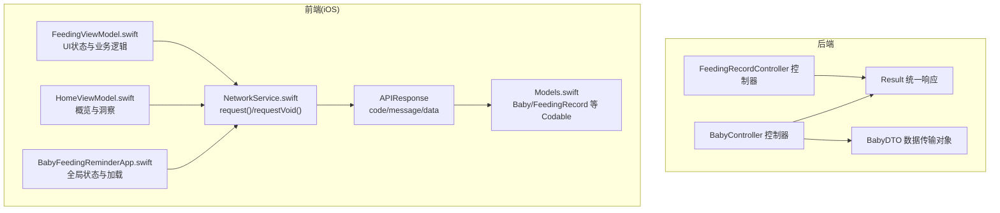
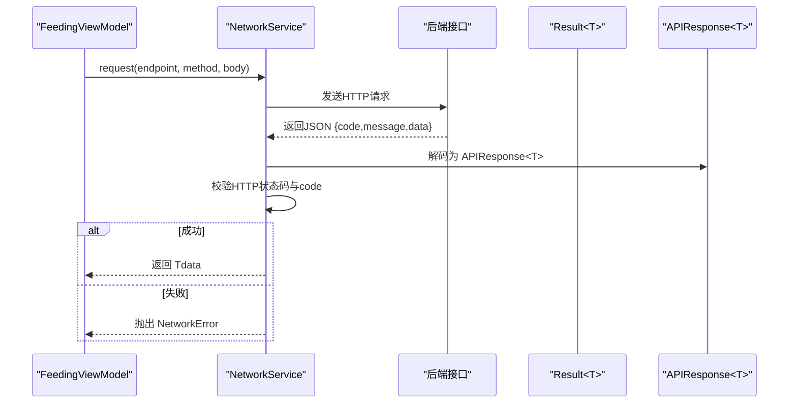
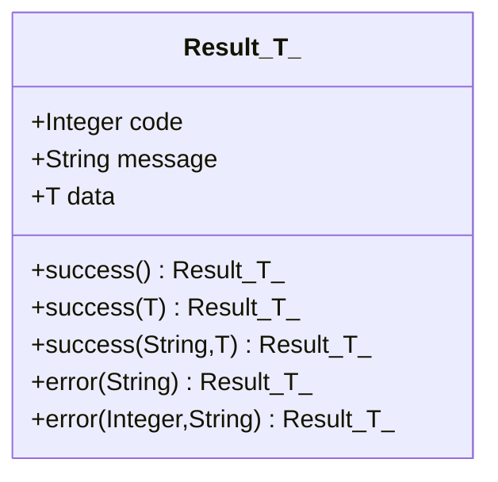
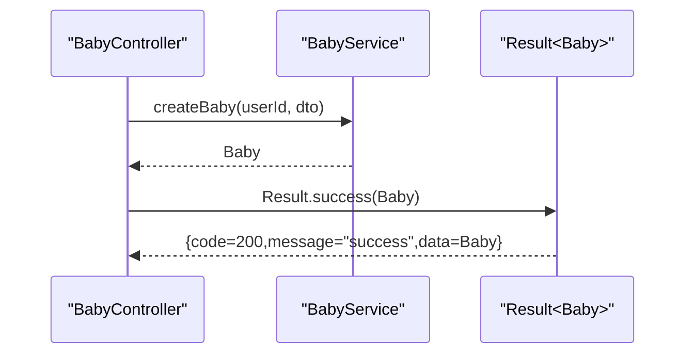
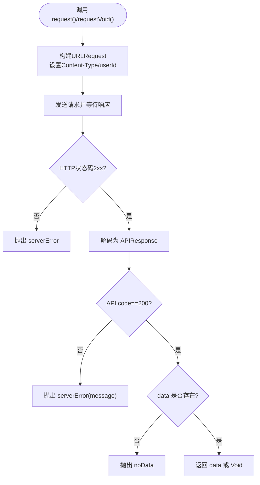
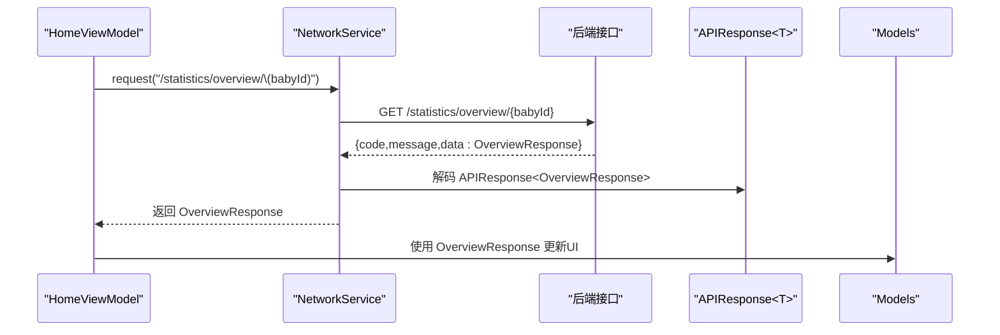
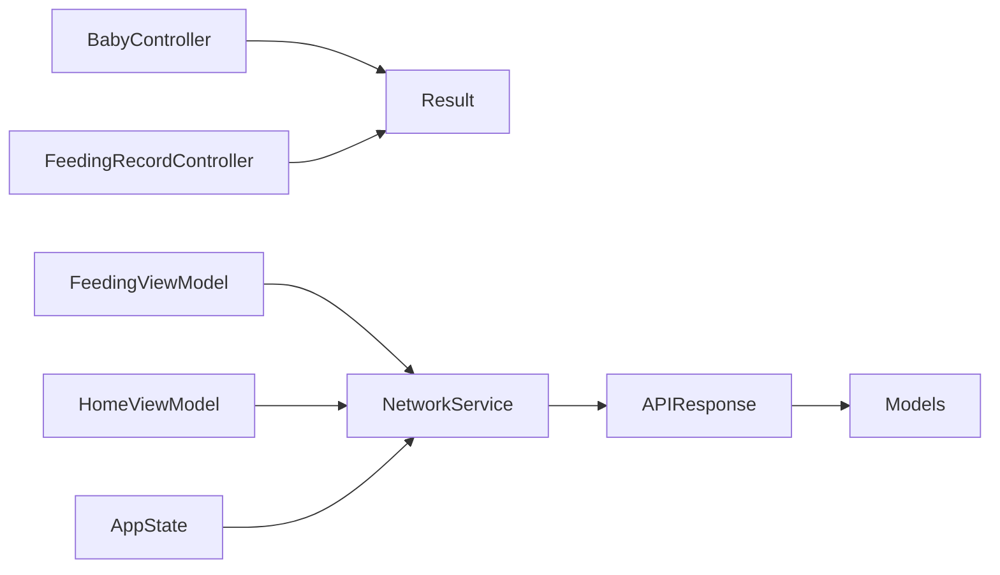

# 响应处理

<cite>
**本文引用的文件**
- [Result.java](file://backend/src/main/java/com/baby/common/Result.java)
- [BabyController.java](file://backend/src/main/java/com/baby/controller/BabyController.java)
- [FeedingRecordController.java](file://backend/src/main/java/com/baby/controller/FeedingRecordController.java)
- [BabyDTO.java](file://backend/src/main/java/com/baby/dto/BabyDTO.java)
- [NetworkService.swift](file://ios/BabyFeedingReminder/Services/NetworkService.swift)
- [Models.swift](file://ios/BabyFeedingReminder/Models/Models.swift)
- [FeedingViewModel.swift](file://ios/BabyFeedingReminder/ViewModels/FeedingViewModel.swift)
- [HomeViewModel.swift](file://ios/BabyFeedingReminder/ViewModels/HomeViewModel.swift)
- [BabyFeedingReminderApp.swift](file://ios/BabyFeedingReminder/BabyFeedingReminderApp.swift)
</cite>

## 目录
1. [简介](#简介)
2. [项目结构](#项目结构)
3. [核心组件](#核心组件)
4. [架构总览](#架构总览)
5. [详细组件分析](#详细组件分析)
6. [依赖关系分析](#依赖关系分析)
7. [性能考量](#性能考量)
8. [故障排查指南](#故障排查指南)
9. [结论](#结论)
10. [附录](#附录)

## 简介
本章节聚焦于 babyFeedingReminder 应用的“响应处理”能力，覆盖后端统一响应封装与前端 JSON 解析两部分。后端通过 Result<T> 统一输出 code、message、data 字段，并提供 success()/error() 工厂方法；前端 iOS 使用 NetworkService.swift 的 request()/requestVoid() 方法，借助 APIResponse<T> 结构解析后端返回，完成成功与错误分支的处理。文档同时给出针对常见问题（如 JSON 不规范、空值、类型不匹配）的 Swift 解决方案，以及响应缓存、反序列化校验与 UI 状态更新的最佳实践。

## 项目结构
- 后端：统一响应封装位于 common 包；各控制器通过 Result<T> 返回标准结构；DTO 与实体定义清晰。
- iOS：NetworkService.swift 负责网络请求与统一解包；Models.swift 定义 Codable 模型；ViewModels.swift 负责业务数据与 UI 状态。

图表来源
- [Result.java](file://backend/src/main/java/com/baby/common/Result.java#L1-L54)
- [BabyController.java](file://backend/src/main/java/com/baby/controller/BabyController.java#L1-L80)
- [FeedingRecordController.java](file://backend/src/main/java/com/baby/controller/FeedingRecordController.java#L1-L112)
- [BabyDTO.java](file://backend/src/main/java/com/baby/dto/BabyDTO.java#L1-L48)
- [NetworkService.swift](file://ios/BabyFeedingReminder/Services/NetworkService.swift#L1-L199)
- [Models.swift](file://ios/BabyFeedingReminder/Models/Models.swift#L1-L196)
- [FeedingViewModel.swift](file://ios/BabyFeedingReminder/ViewModels/FeedingViewModel.swift#L1-L226)
- [HomeViewModel.swift](file://ios/BabyFeedingReminder/ViewModels/HomeViewModel.swift#L1-L75)
- [BabyFeedingReminderApp.swift](file://ios/BabyFeedingReminder/BabyFeedingReminderApp.swift#L20-L61)

章节来源
- [Result.java](file://backend/src/main/java/com/baby/common/Result.java#L1-L54)
- [BabyController.java](file://backend/src/main/java/com/baby/controller/BabyController.java#L1-L80)
- [FeedingRecordController.java](file://backend/src/main/java/com/baby/controller/FeedingRecordController.java#L1-L112)
- [NetworkService.swift](file://ios/BabyFeedingReminder/Services/NetworkService.swift#L1-L199)
- [Models.swift](file://ios/BabyFeedingReminder/Models/Models.swift#L1-L196)
- [FeedingViewModel.swift](file://ios/BabyFeedingReminder/ViewModels/FeedingViewModel.swift#L1-L226)
- [HomeViewModel.swift](file://ios/BabyFeedingReminder/ViewModels/HomeViewModel.swift#L1-L75)
- [BabyFeedingReminderApp.swift](file://ios/BabyFeedingReminder/BabyFeedingReminderApp.swift#L20-L61)

## 核心组件
- 后端统一响应 Result<T>
  - 字段：code（200/500）、message、data
  - 工厂方法：
    - success()：默认 code=200，message="success"
    - success(T data)：携带 data
    - success(String message, T data)：自定义 message
    - error(String message)：默认 code=500
    - error(Integer code, String message)：自定义 code
- iOS 统一响应解析 APIResponse<T>
  - 字段：code、message、data（可选）
  - 错误枚举：invalidURL、noData、decodingError、serverError、unauthorized
  - request()/requestVoid()：统一状态码校验、解包、错误抛出

章节来源
- [Result.java](file://backend/src/main/java/com/baby/common/Result.java#L1-L54)
- [NetworkService.swift](file://ios/BabyFeedingReminder/Services/NetworkService.swift#L1-L199)

## 架构总览
后端控制器以 Result<T> 输出统一结构；前端通过 NetworkService.swift 的 request()/requestVoid() 自动解析并校验响应，确保成功与失败路径一致。

图表来源
- [FeedingViewModel.swift](file://ios/BabyFeedingReminder/ViewModels/FeedingViewModel.swift#L62-L96)
- [NetworkService.swift](file://ios/BabyFeedingReminder/Services/NetworkService.swift#L89-L138)
- [Result.java](file://backend/src/main/java/com/baby/common/Result.java#L1-L54)

## 详细组件分析

### 后端：Result<T> 统一响应
- 设计要点
  - 使用泛型 T 表示 data 类型，支持无数据（Void）场景
  - success()/error() 工厂方法保证 code/message 的一致性
  - 控制器层直接返回 Result.success(...) 或 Result.error(...)
- 典型用法
  - 创建/更新/查询：返回 Result<T>，其中 T 为实体或 VO
  - 列表查询：返回 Result<List<T>>
  - 无数据操作：返回 Result<Void>

图表来源
- [Result.java](file://backend/src/main/java/com/baby/common/Result.java#L1-L54)

章节来源
- [Result.java](file://backend/src/main/java/com/baby/common/Result.java#L1-L54)
- [BabyController.java](file://backend/src/main/java/com/baby/controller/BabyController.java#L26-L78)
- [FeedingRecordController.java](file://backend/src/main/java/com/baby/controller/FeedingRecordController.java#L33-L110)

### 后端：控制器对 Result<T> 的使用
- BabyController
  - 创建/更新/查询/删除：返回 Result<Baby> 或 Result<Void>
  - 列表查询：返回 Result<List<Baby>>
  - 生长指标更新：返回 Result<Baby>
  - 月龄计算：返回 Result<Integer>
- FeedingRecordController
  - 新增/更新/查询：返回 Result<FeedingRecord>
  - 今日/范围/最近记录：返回 Result<List<FeedingRecord>>
  - 统计与推荐：返回 Result<VO/Map>

图表来源
- [BabyController.java](file://backend/src/main/java/com/baby/controller/BabyController.java#L26-L31)
- [Result.java](file://backend/src/main/java/com/baby/common/Result.java#L17-L30)

章节来源
- [BabyController.java](file://backend/src/main/java/com/baby/controller/BabyController.java#L1-L80)
- [FeedingRecordController.java](file://backend/src/main/java/com/baby/controller/FeedingRecordController.java#L1-L112)

### 前端：NetworkService.swift 统一解析
- APIResponse<T>
  - code：HTTP状态码或业务码（200/500）
  - message：错误消息或成功提示
  - data：可选，承载具体数据
- request()/requestVoid()
  - 校验 URL、HTTP 状态码（2xx）
  - 解码为 APIResponse<T>
  - code!=200 时抛出 serverError
  - data 为空时抛出 noData
  - requestVoid() 用于无返回体的场景
- 错误类型
  - invalidURL、noData、decodingError、serverError(String)、unauthorized

图表来源
- [NetworkService.swift](file://ios/BabyFeedingReminder/Services/NetworkService.swift#L89-L138)
- [NetworkService.swift](file://ios/BabyFeedingReminder/Services/NetworkService.swift#L140-L181)

章节来源
- [NetworkService.swift](file://ios/BabyFeedingReminder/Services/NetworkService.swift#L1-L199)

### 前端：iOS 模型与 JSON 解析
- Models.swift
  - 定义 Baby、FeedingRecord、SleepRecord 等 Codable 模型
  - JSON 中日期字段通过 JSONDecoder 的自定义策略解析（多格式容错）
- APIResponse<T>
  - data 可选，便于 requestVoid() 场景
- ViewModel 层
  - FeedingViewModel：加载今日记录、新增/更新/删除记录，捕获错误并回退到本地模拟数据
  - HomeViewModel：并行加载概览、洞察与提醒，更新 UI 状态
  - AppState：全局加载用户宝宝列表，调用 network.request("/baby/list")

图表来源
- [HomeViewModel.swift](file://ios/BabyFeedingReminder/ViewModels/HomeViewModel.swift#L68-L93)
- [NetworkService.swift](file://ios/BabyFeedingReminder/Services/NetworkService.swift#L89-L138)
- [Models.swift](file://ios/BabyFeedingReminder/Models/Models.swift#L1-L75)

章节来源
- [Models.swift](file://ios/BabyFeedingReminder/Models/Models.swift#L1-L196)
- [FeedingViewModel.swift](file://ios/BabyFeedingReminder/ViewModels/FeedingViewModel.swift#L62-L96)
- [HomeViewModel.swift](file://ios/BabyFeedingReminder/ViewModels/HomeViewModel.swift#L35-L75)
- [BabyFeedingReminderApp.swift](file://ios/BabyFeedingReminder/BabyFeedingReminderApp.swift#L50-L61)

### 响应示例与解析要点
- 单对象响应（BabyDTO）
  - 后端返回：Result<Baby>，data 为实体
  - 前端解析：APIResponse<Baby>，data 为 Baby 模型
  - 关键点：后端 DTO 与前端模型字段需一一对应，必要时在后端转换或前端映射
- 列表响应
  - 后端返回：Result<List<FeedingRecord>>
  - 前端解析：APIResponse<[FeedingRecord]>，data 为数组
  - 关键点：数组元素的 Codable 实现必须与 JSON 字段一致

章节来源
- [BabyController.java](file://backend/src/main/java/com/baby/controller/BabyController.java#L48-L54)
- [FeedingRecordController.java](file://backend/src/main/java/com/baby/controller/FeedingRecordController.java#L55-L70)
- [NetworkService.swift](file://ios/BabyFeedingReminder/Services/NetworkService.swift#L89-L138)
- [Models.swift](file://ios/BabyFeedingReminder/Models/Models.swift#L60-L120)

## 依赖关系分析
- 后端
  - 控制器依赖服务层，服务层返回实体/VO，控制器再封装为 Result<T>
  - Result<T> 与 DTO/Entity 解耦，便于统一输出
- 前端
  - ViewModel 依赖 NetworkService，NetworkService 依赖 APIResponse<T> 与 Models
  - 错误类型集中定义，便于统一处理

图表来源
- [BabyController.java](file://backend/src/main/java/com/baby/controller/BabyController.java#L1-L80)
- [FeedingRecordController.java](file://backend/src/main/java/com/baby/controller/FeedingRecordController.java#L1-L112)
- [Result.java](file://backend/src/main/java/com/baby/common/Result.java#L1-L54)
- [FeedingViewModel.swift](file://ios/BabyFeedingReminder/ViewModels/FeedingViewModel.swift#L1-L226)
- [HomeViewModel.swift](file://ios/BabyFeedingReminder/ViewModels/HomeViewModel.swift#L1-L75)
- [BabyFeedingReminderApp.swift](file://ios/BabyFeedingReminder/BabyFeedingReminderApp.swift#L20-L61)
- [NetworkService.swift](file://ios/BabyFeedingReminder/Services/NetworkService.swift#L1-L199)
- [Models.swift](file://ios/BabyFeedingReminder/Models/Models.swift#L1-L196)

## 性能考量
- 前端并发加载
  - 使用 async/await 并行请求多个接口，减少总等待时间
  - 示例：HomeViewModel 并行加载概览、洞察与提醒
- 缓存策略
  - 对高频读取且变化不频繁的数据（如宝宝列表、设置项）进行短期内存缓存
  - 对统计类数据按天缓存，避免重复请求
- 解析优化
  - JSONDecoder 的自定义策略仅在必要时执行，避免过度解析
  - 对大列表采用分页或懒加载策略

章节来源
- [HomeViewModel.swift](file://ios/BabyFeedingReminder/ViewModels/HomeViewModel.swift#L52-L66)
- [BabyFeedingReminderApp.swift](file://ios/BabyFeedingReminder/BabyFeedingReminderApp.swift#L50-L61)

## 故障排查指南
- 常见问题与解决
  - JSON 不规范
    - 现象：decodingError
    - 解决：确认字段命名与大小写一致；必要时在后端调整序列化策略或前端自定义 CodingKeys
  - 期望非空但收到 null
    - 现象：noData
    - 解决：在前端使用可选绑定（?）；后端确保必填字段非空或提供默认值
  - 类型不匹配
    - 现象：serverError(message) 或解码异常
    - 解决：前后端约定一致的类型（如 Int/Int64、String/Date），必要时在前端做容错转换
  - 未授权
    - 现象：unauthorized
    - 解决：引导重新登录或刷新 Token
- Swift 错误处理最佳实践
  - 使用 do-catch 捕获 NetworkError
  - 在 ViewModel 中区分网络错误与业务错误，分别更新 errorMessage 与 UI
  - 对于关键操作，提供本地模拟回退，提升用户体验

章节来源
- [NetworkService.swift](file://ios/BabyFeedingReminder/Services/NetworkService.swift#L1-L199)
- [FeedingViewModel.swift](file://ios/BabyFeedingReminder/ViewModels/FeedingViewModel.swift#L62-L96)
- [FeedingViewModel.swift](file://ios/BabyFeedingReminder/ViewModels/FeedingViewModel.swift#L98-L147)
- [FeedingViewModel.swift](file://ios/BabyFeedingReminder/ViewModels/FeedingViewModel.swift#L149-L216)

## 结论
通过后端 Result<T> 与前端 NetworkService.swift 的协同，系统实现了统一、可预测的响应处理机制。工厂方法保证了 success()/error() 的一致性；前端通过 APIResponse<T> 与 Codable 解析，实现了强类型的响应消费与错误处理。结合并发加载、缓存与校验策略，可在保证正确性的同时提升性能与用户体验。

## 附录
- 最佳实践清单
  - 响应缓存：对静态/低频数据进行短期缓存，减少网络开销
  - 数据验证：反序列化后对关键字段进行非空与范围校验
  - UI 状态：统一使用 isLoading、errorMessage 等状态变量，避免直接依赖网络错误
  - 错误分类：区分网络错误、业务错误与用户输入错误，分别处理
  - 版本兼容：前后端约定字段命名与类型，避免破坏性变更