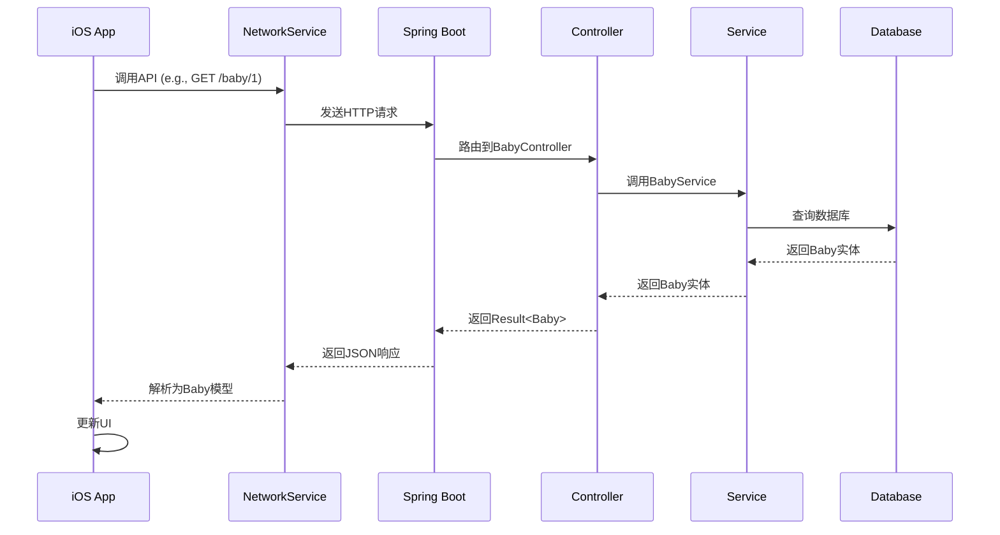
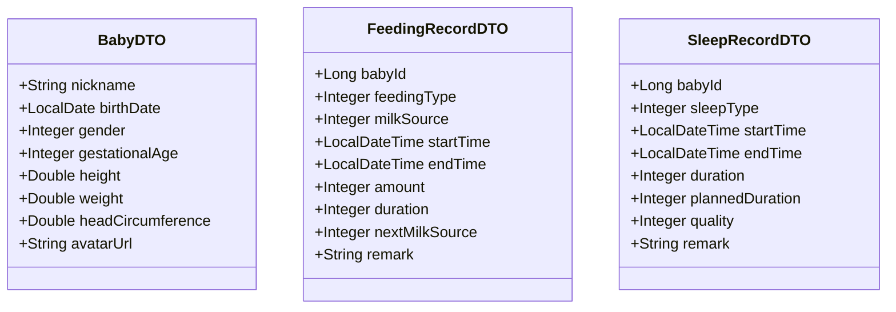
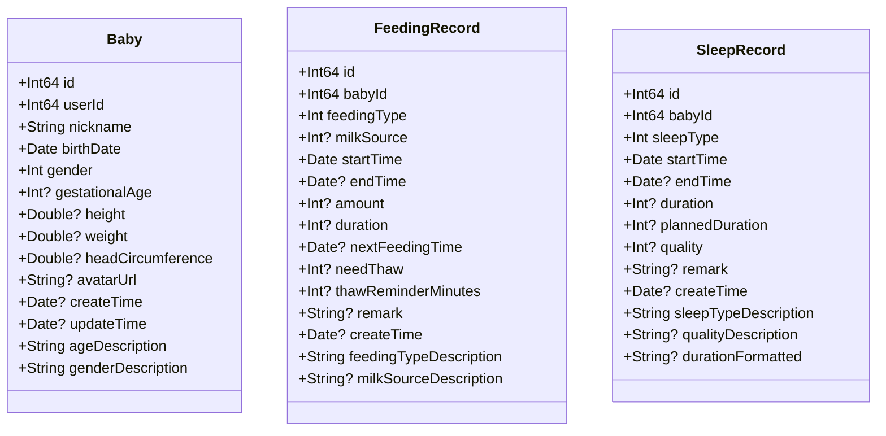
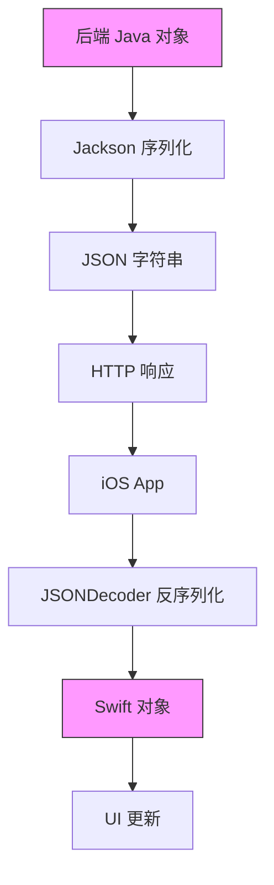
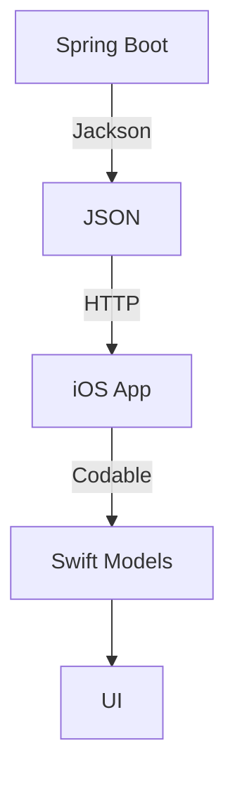

# 数据序列化与传输

<cite>
**Referenced Files in This Document**   
- [BabyDTO.java](file://backend/src/main/java/com/baby/dto/BabyDTO.java)
- [FeedingRecordDTO.java](file://backend/src/main/java/com/baby/dto/FeedingRecordDTO.java)
- [SleepRecordDTO.java](file://backend/src/main/java/com/baby/dto/SleepRecordDTO.java)
- [Models.swift](file://ios/BabyFeedingReminder/Models/Models.swift)
- [NetworkService.swift](file://ios/BabyFeedingReminder/Services/NetworkService.swift)
- [BabyController.java](file://backend/src/main/java/com/baby/controller/BabyController.java)
- [FeedingRecordController.java](file://backend/src/main/java/com/baby/controller/FeedingRecordController.java)
- [SleepRecordController.java](file://backend/src/main/java/com/baby/controller/SleepRecordController.java)
- [application.yml](file://backend/src/main/resources/application.yml)
- [Result.java](file://backend/src/main/java/com/baby/common/Result.java)
</cite>

## Table of Contents
1. [Introduction](#introduction)
2. [Project Structure](#project-structure)
3. [Core Components](#core-components)
4. [Architecture Overview](#architecture-overview)
5. [Detailed Component Analysis](#detailed-component-analysis)
6. [Dependency Analysis](#dependency-analysis)
7. [Performance Considerations](#performance-considerations)
8. [Troubleshooting Guide](#troubleshooting-guide)
9. [Conclusion](#conclusion)

## Introduction
本文档详细阐述了 babyFeedingReminder 应用中前后端之间的数据序列化与传输机制。重点分析了后端 Spring Boot 应用如何使用 Jackson 将 Java DTO 对象（如 BabyDTO）序列化为 JSON，以及前端 iOS 应用如何通过 Swift 的 Codable 协议实现 JSON 的自动编码与解码。文档涵盖了字段映射、命名规范转换、复杂数据类型处理、常见问题及最佳实践。

## Project Structure
项目采用前后端分离架构，后端基于 Spring Boot 构建，前端为原生 iOS 应用。

```mermaid
graph TB
subgraph "Backend"
direction LR
Controller[Controller Layer]
Service[Service Layer]
Mapper[Mapper Layer]
Entity[Entity]
DTO[DTO]
VO[VO]
end
subgraph "Frontend"
direction LR
View[View]
ViewModel[ViewModel]
Model[Model]
Network[NetworkService]
end
Controller < --> |JSON| Network
DTO < --> |Jackson| JSON
Model < --> |Codable| JSON
```

**Diagram sources**
- [BabyController.java](file://backend/src/main/java/com/baby/controller/BabyController.java)
- [Models.swift](file://ios/BabyFeedingReminder/Models/Models.swift)
- [NetworkService.swift](file://ios/BabyFeedingReminder/Services/NetworkService.swift)

**Section sources**
- [BabyController.java](file://backend/src/main/java/com/baby/controller/BabyController.java)
- [Models.swift](file://ios/BabyFeedingReminder/Models/Models.swift)

## Core Components
核心组件包括后端的 DTO 类（如 BabyDTO、FeedingRecordDTO）和前端的 Swift 模型（如 Baby、FeedingRecord），它们通过 JSON 格式进行数据交换。后端使用 Jackson 进行序列化，前端使用 Codable 进行反序列化。

**Section sources**
- [BabyDTO.java](file://backend/src/main/java/com/baby/dto/BabyDTO.java)
- [Models.swift](file://ios/BabyFeedingReminder/Models/Models.swift)

## Architecture Overview
系统采用 RESTful API 架构，数据传输遵循统一的 JSON 格式规范。后端返回的数据结构由 `Result<T>` 类包装，确保了响应的一致性。



**Diagram sources**
- [BabyController.java](file://backend/src/main/java/com/baby/controller/BabyController.java)
- [NetworkService.swift](file://ios/BabyFeedingReminder/Services/NetworkService.swift)
- [Result.java](file://backend/src/main/java/com/baby/common/Result.java)

## Detailed Component Analysis

### DTO 和 Model 设计与映射
后端 DTO 和前端 Model 通过 JSON 字段进行映射，命名规范由 camelCase（Java）转换为 snake_case（JSON），再转换为 camelCase（Swift）。

#### 后端 DTO 类 (Java)


**Diagram sources**
- [BabyDTO.java](file://backend/src/main/java/com/baby/dto/BabyDTO.java)
- [FeedingRecordDTO.java](file://backend/src/main/java/com/baby/dto/FeedingRecordDTO.java)
- [SleepRecordDTO.java](file://backend/src/main/java/com/baby/dto/SleepRecordDTO.java)

#### 前端 Model 类 (Swift)


**Diagram sources**
- [Models.swift](file://ios/BabyFeedingReminder/Models/Models.swift)

**Section sources**
- [Models.swift](file://ios/BabyFeedingReminder/Models/Models.swift)

### 数据序列化与反序列化流程
详细描述了数据在前后端之间流动时的序列化与反序列化过程。



**Diagram sources**
- [BabyDTO.java](file://backend/src/main/java/com/baby/dto/BabyDTO.java)
- [NetworkService.swift](file://ios/BabyFeedingReminder/Services/NetworkService.swift)

## Dependency Analysis
项目依赖清晰，前后端通过定义良好的 API 接口进行通信，耦合度低。



**Diagram sources**
- [pom.xml](file://backend/pom.xml)
- [NetworkService.swift](file://ios/BabyFeedingReminder/Services/NetworkService.swift)

**Section sources**
- [pom.xml](file://backend/pom.xml)

## Performance Considerations
- 使用 Lombok 减少 Java 模型类的样板代码。
- Swift 的 Codable 协议提供高效的自动序列化。
- 后端使用 MyBatis-Plus 提高数据库访问效率。
- 前端 NetworkService 使用单例模式和配置好的 URLSession，避免重复创建。

## Troubleshooting Guide
常见问题及解决方案：

**Section sources**
- [NetworkService.swift](file://ios/BabyFeedingReminder/Services/NetworkService.swift)
- [application.yml](file://backend/src/main/resources/application.yml)

## Conclusion
babyFeedingReminder 应用通过精心设计的 DTO 和 Model 类，结合 Jackson 和 Codable，实现了高效、可靠的数据序列化与传输。该设计模式确保了前后端数据的一致性，同时提供了良好的可维护性和扩展性。