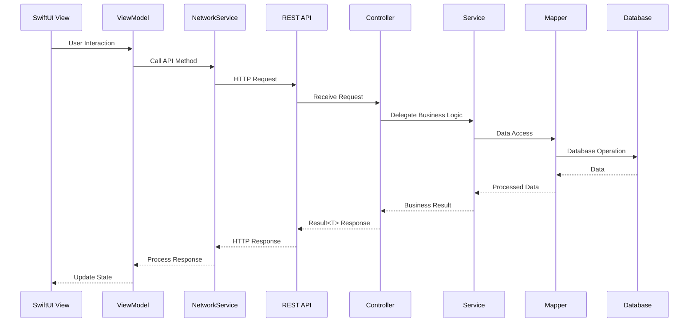
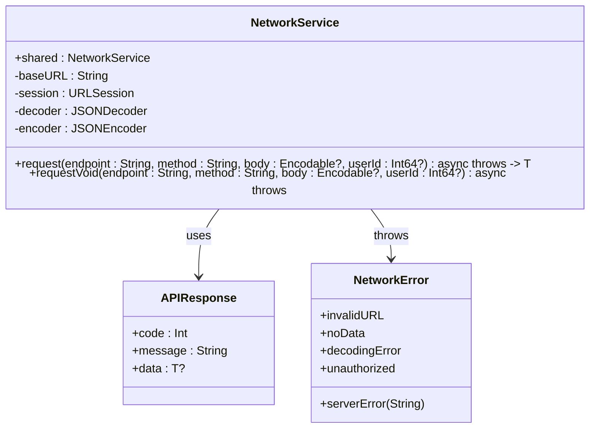
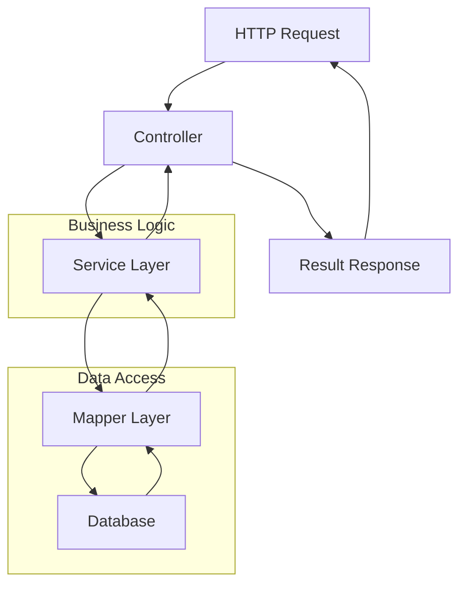

# 数据流

<cite>
**Referenced Files in This Document**   
- [Result.java](file://backend/src/main/java/com/baby/common/Result.java)
- [BabyController.java](file://backend/src/main/java/com/baby/controller/BabyController.java)
- [FeedingRecordController.java](file://backend/src/main/java/com/baby/controller/FeedingRecordController.java)
- [SleepRecordController.java](file://backend/src/main/java/com/baby/controller/SleepRecordController.java)
- [StatisticsController.java](file://backend/src/main/java/com/baby/controller/StatisticsController.java)
- [NetworkService.swift](file://ios/BabyFeedingReminder/Services/NetworkService.swift)
- [FeedingViewModel.swift](file://ios/BabyFeedingReminder/ViewModels/FeedingViewModel.swift)
- [HomeViewModel.swift](file://ios/BabyFeedingReminder/ViewModels/HomeViewModel.swift)
- [SleepViewModel.swift](file://ios/BabyFeedingReminder/ViewModels/SleepViewModel.swift)
- [StatisticsViewModel.swift](file://ios/BabyFeedingReminder/ViewModels/StatisticsViewModel.swift)
</cite>

## Table of Contents
1. [Introduction](#introduction)
2. [End-to-End Data Flow Overview](#end-to-end-data-flow-overview)
3. [Frontend Request Initiation](#frontend-request-initiation)
4. [Network Communication Layer](#network-communication-layer)
5. [Backend Request Processing](#backend-request-processing)
6. [Response Handling and Error Management](#response-handling-and-error-management)
7. [Performance Optimization Strategies](#performance-optimization-strategies)
8. [Conclusion](#conclusion)

## Introduction
The babyFeedingReminder application implements a comprehensive data flow architecture that connects SwiftUI-based frontend components with Spring Boot backend services through a well-defined network layer. This document details the complete lifecycle of data as it travels from user interactions in the iOS application to persistent storage in the database and back as processed responses. The system follows a clean separation of concerns with distinct layers for presentation, business logic, data access, and external communication.

**Section sources**
- [Result.java](file://backend/src/main/java/com/baby/common/Result.java)
- [NetworkService.swift](file://ios/BabyFeedingReminder/Services/NetworkService.swift)

## End-to-End Data Flow Overview
The application's data flow follows a structured pattern that begins with user interactions in SwiftUI views and progresses through multiple layers on both client and server sides. When a user interacts with the application interface, the action triggers ViewModel methods that prepare data and invoke the NetworkService to make HTTP requests to Spring Boot REST APIs. On the server side, controllers receive these requests, delegate processing to service layers that contain business logic, and interact with the database through MyBatis Plus mappers. Responses are wrapped in a standardized Result format and returned to the client, where the NetworkService processes them, handling both success cases and errors appropriately.

**Diagram sources**
- [NetworkService.swift](file://ios/BabyFeedingReminder/Services/NetworkService.swift)
- [FeedingRecordController.java](file://backend/src/main/java/com/baby/controller/FeedingRecordController.java)

## Frontend Request Initiation
User interactions in SwiftUI views trigger actions in ViewModels that initiate the data flow process. For example, when a user adds a feeding record in the FeedingView, the EditFeedingRecordView calls the FeedingViewModel's addRecord method with the input parameters. The ViewModel prepares the request data using specific request structures like AddFeedingRequest and invokes the NetworkService to perform the actual HTTP request. This pattern is consistent across different features, with specialized ViewModels (FeedingViewModel, SleepViewModel, StatisticsViewModel) handling their respective domains while sharing the same underlying network infrastructure.

**Section sources**
- [FeedingViewModel.swift](file://ios/BabyFeedingReminder/ViewModels/FeedingViewModel.swift)
- [SleepViewModel.swift](file://ios/BabyFeedingReminder/ViewModels/SleepViewModel.swift)
- [StatisticsViewModel.swift](file://ios/BabyFeedingReminder/ViewModels/StatisticsViewModel.swift)

## Network Communication Layer
The NetworkService.swift class serves as the central hub for all network communications between the iOS application and the backend server. It provides a generic request method that handles the common aspects of HTTP communication, including URL construction, header management (including the userId header for authentication), request body serialization, and response processing. The service uses a Result pattern implementation through the APIResponse struct that mirrors the Java backend's Result class, ensuring consistent response handling across platforms. Error handling is comprehensive, with specific error types for different failure scenarios such as invalid URLs, missing data, decoding errors, server errors, and unauthorized access.

**Diagram sources**
- [NetworkService.swift](file://ios/BabyFeedingReminder/Services/NetworkService.swift)

## Backend Request Processing
The Spring Boot backend processes incoming requests through a layered architecture that separates concerns and promotes maintainability. Controllers like FeedingRecordController and SleepRecordController serve as entry points that receive HTTP requests and return responses wrapped in the Result<T> format. These controllers delegate business logic to service layer components such as FeedingRecordService and SleepRecordService, which contain the core application logic. The services interact with the database through MyBatis Plus mappers like FeedingRecordMapper, which provide type-safe database access methods. This separation ensures that business rules are not mixed with presentation concerns and that data access patterns are consistent across the application.

**Diagram sources**
- [FeedingRecordController.java](file://backend/src/main/java/com/baby/controller/FeedingRecordController.java)
- [FeedingRecordService.java](file://backend/src/main/java/com/baby/service/FeedingRecordService.java)
- [FeedingRecordMapper.java](file://backend/src/main/java/com/baby/mapper/FeedingRecordMapper.java)

## Response Handling and Error Management
Both client and server sides implement robust error handling strategies to ensure reliable operation and good user experience. On the backend, the Result<T> class provides a standardized response format that includes a code, message, and optional data payload, allowing for consistent error reporting across all endpoints. This pattern enables the frontend to handle responses uniformly regardless of the specific API being called. On the iOS side, the NetworkService uses Swift's do-catch mechanism to handle network errors, translating HTTP status codes and response formats into meaningful NetworkError cases that can be presented to users. The service also includes fallback mechanisms that allow the application to continue functioning with simulated data when network requests fail, ensuring graceful degradation.

**Section sources**
- [Result.java](file://backend/src/main/java/com/baby/common/Result.java)
- [NetworkService.swift](file://ios/BabyFeedingReminder/Services/NetworkService.swift)

## Performance Optimization Strategies
The application incorporates several performance optimization techniques to ensure responsive user experiences and efficient resource utilization. Request and response payloads are optimized through selective data transfer, with endpoints providing only the necessary information for each use case. The backend leverages Spring Boot's capabilities for efficient request processing and database interaction, while the iOS application uses asynchronous programming with async/await to prevent UI blocking during network operations. The architecture supports potential caching strategies using Redis for frequently accessed data, though specific implementation details would require additional configuration. Data serialization is optimized through custom date formatting strategies that handle multiple date formats commonly encountered in mobile applications, reducing parsing errors and improving reliability.

**Section sources**
- [NetworkService.swift](file://ios/BabyFeedingReminder/Services/NetworkService.swift)
- [StatisticsController.java](file://backend/src/main/java/com/baby/controller/StatisticsController.java)

## Conclusion
The babyFeedingReminder application demonstrates a well-architected data flow pattern that effectively connects frontend and backend components through a robust network layer. By following established design patterns such as separation of concerns, standardized response formats, and comprehensive error handling, the application achieves high reliability and maintainability. The use of consistent patterns across both platforms (Swift and Java) ensures that developers can easily understand and extend the system, while the focus on performance optimization and graceful error handling provides a smooth user experience even under challenging network conditions.