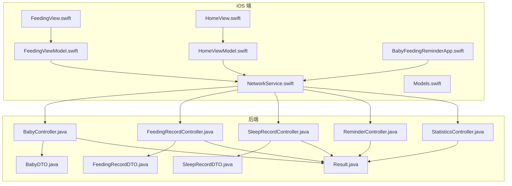
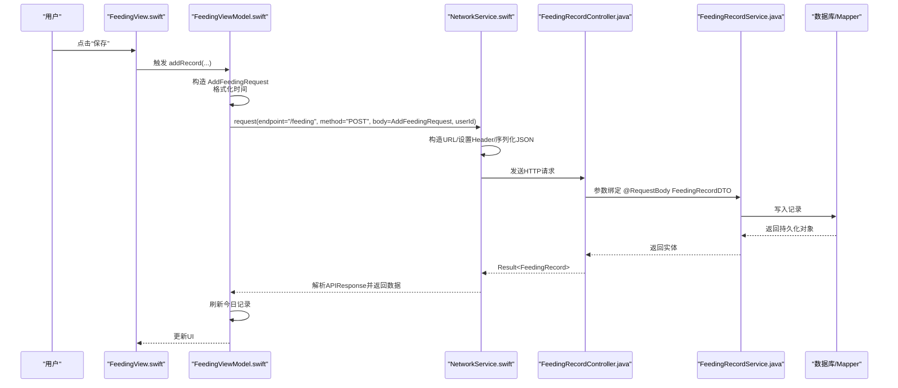

# 请求生命周期

<cite>
**本文引用的文件**
- [NetworkService.swift](file://ios/BabyFeedingReminder/Services/NetworkService.swift)
- [FeedingViewModel.swift](file://ios/BabyFeedingReminder/ViewModels/FeedingViewModel.swift)
- [HomeViewModel.swift](file://ios/BabyFeedingReminder/ViewModels/HomeViewModel.swift)
- [BabyFeedingReminderApp.swift](file://ios/BabyFeedingReminder/BabyFeedingReminderApp.swift)
- [BabyController.java](file://backend/src/main/java/com/baby/controller/BabyController.java)
- [FeedingRecordController.java](file://backend/src/main/java/com/baby/controller/FeedingRecordController.java)
- [SleepRecordController.java](file://backend/src/main/java/com/baby/controller/SleepRecordController.java)
- [ReminderController.java](file://backend/src/main/java/com/baby/controller/ReminderController.java)
- [StatisticsController.java](file://backend/src/main/java/com/baby/controller/StatisticsController.java)
- [Result.java](file://backend/src/main/java/com/baby/common/Result.java)
- [FeedingRecordDTO.java](file://backend/src/main/java/com/baby/dto/FeedingRecordDTO.java)
- [BabyDTO.java](file://backend/src/main/java/com/baby/dto/BabyDTO.java)
- [SleepRecordDTO.java](file://backend/src/main/java/com/baby/dto/SleepRecordDTO.java)
- [FeedingView.swift](file://ios/BabyFeedingReminder/Views/FeedingView.swift)
- [HomeView.swift](file://ios/BabyFeedingReminder/Views/HomeView.swift)
- [Models.swift](file://ios/BabyFeedingReminder/Models/Models.swift)
</cite>

## 目录
1. [简介](#简介)
2. [项目结构](#项目结构)
3. [核心组件](#核心组件)
4. [架构总览](#架构总览)
5. [详细组件分析](#详细组件分析)
6. [依赖关系分析](#依赖关系分析)
7. [性能考量](#性能考量)
8. [故障排查指南](#故障排查指南)
9. [结论](#结论)

## 简介
本文件系统性梳理 babyFeedingReminder 应用的“请求生命周期”，从 SwiftUI 视图层到 iOS 网络层，再到 Spring Boot 控制器与服务层的完整链路。重点覆盖：
- 用户交互如何触发 ViewModel 的网络调用
- NetworkService 如何构造 URL、HTTP 方法、注入 userId 头、序列化 JSON 请求体
- Spring Boot 控制器如何通过 @PostMapping/@GetMapping/@PutMapping/@DeleteMapping、@RequestBody、@PathVariable、@RequestHeader、@RequestParam 进行参数绑定与路由分发
- 统一响应封装 Result 的设计与错误处理策略
- 常见问题（超时、参数校验失败、网络异常）的定位与修复思路
- 性能优化建议（请求合并、负载均衡、连接复用、请求批量化）

## 项目结构
应用采用前后端分离架构：
- iOS 端：SwiftUI 视图 + ViewModel + NetworkService
- 后端：Spring Boot 控制器 + DTO + Service + Mapper

图表来源
- [FeedingView.swift](file://ios/BabyFeedingReminder/Views/FeedingView.swift#L1-L120)
- [FeedingViewModel.swift](file://ios/BabyFeedingReminder/ViewModels/FeedingViewModel.swift#L1-L120)
- [HomeView.swift](file://ios/BabyFeedingReminder/Views/HomeView.swift#L1-L120)
- [HomeViewModel.swift](file://ios/BabyFeedingReminder/ViewModels/HomeViewModel.swift#L1-L120)
- [BabyFeedingReminderApp.swift](file://ios/BabyFeedingReminder/BabyFeedingReminderApp.swift#L20-L80)
- [NetworkService.swift](file://ios/BabyFeedingReminder/Services/NetworkService.swift#L1-L199)
- [BabyController.java](file://backend/src/main/java/com/baby/controller/BabyController.java#L1-L80)
- [FeedingRecordController.java](file://backend/src/main/java/com/baby/controller/FeedingRecordController.java#L1-L112)
- [SleepRecordController.java](file://backend/src/main/java/com/baby/controller/SleepRecordController.java#L1-L139)
- [ReminderController.java](file://backend/src/main/java/com/baby/controller/ReminderController.java#L1-L45)
- [StatisticsController.java](file://backend/src/main/java/com/baby/controller/StatisticsController.java#L1-L149)
- [Result.java](file://backend/src/main/java/com/baby/common/Result.java#L1-L54)
- [BabyDTO.java](file://backend/src/main/java/com/baby/dto/BabyDTO.java#L1-L48)
- [FeedingRecordDTO.java](file://backend/src/main/java/com/baby/dto/FeedingRecordDTO.java#L1-L52)
- [SleepRecordDTO.java](file://backend/src/main/java/com/baby/dto/SleepRecordDTO.java#L1-L47)

章节来源
- [NetworkService.swift](file://ios/BabyFeedingReminder/Services/NetworkService.swift#L1-L199)
- [FeedingViewModel.swift](file://ios/BabyFeedingReminder/ViewModels/FeedingViewModel.swift#L1-L226)
- [HomeViewModel.swift](file://ios/BabyFeedingReminder/ViewModels/HomeViewModel.swift#L1-L135)
- [BabyFeedingReminderApp.swift](file://ios/BabyFeedingReminder/BabyFeedingReminderApp.swift#L20-L80)
- [BabyController.java](file://backend/src/main/java/com/baby/controller/BabyController.java#L1-L80)
- [FeedingRecordController.java](file://backend/src/main/java/com/baby/controller/FeedingRecordController.java#L1-L112)
- [SleepRecordController.java](file://backend/src/main/java/com/baby/controller/SleepRecordController.java#L1-L139)
- [ReminderController.java](file://backend/src/main/java/com/baby/controller/ReminderController.java#L1-L45)
- [StatisticsController.java](file://backend/src/main/java/com/baby/controller/StatisticsController.java#L1-L149)
- [Result.java](file://backend/src/main/java/com/baby/common/Result.java#L1-L54)
- [BabyDTO.java](file://backend/src/main/java/com/baby/dto/BabyDTO.java#L1-L48)
- [FeedingRecordDTO.java](file://backend/src/main/java/com/baby/dto/FeedingRecordDTO.java#L1-L52)
- [SleepRecordDTO.java](file://backend/src/main/java/com/baby/dto/SleepRecordDTO.java#L1-L47)

## 核心组件
- iOS 网络层：NetworkService 提供统一的 request/requestVoid 方法，负责 URL 构造、HTTP 方法、Content-Type、userId 头、JSON 编解码、状态码与业务码校验。
- iOS 视图模型：FeedingViewModel、HomeViewModel 将用户交互转化为网络请求，并在失败时提供本地回退与错误提示。
- 后端控制器：各模块控制器以 RestController 形式暴露接口，使用 @PostMapping/@GetMapping/@PutMapping/@DeleteMapping、@RequestBody、@PathVariable、@RequestHeader、@RequestParam 进行参数绑定。
- 统一响应：Result 封装 code/message/data，前端仅在 code==200 时取 data。

章节来源
- [NetworkService.swift](file://ios/BabyFeedingReminder/Services/NetworkService.swift#L1-L199)
- [FeedingViewModel.swift](file://ios/BabyFeedingReminder/ViewModels/FeedingViewModel.swift#L1-L226)
- [HomeViewModel.swift](file://ios/BabyFeedingReminder/ViewModels/HomeViewModel.swift#L1-L135)
- [BabyController.java](file://backend/src/main/java/com/baby/controller/BabyController.java#L1-L80)
- [FeedingRecordController.java](file://backend/src/main/java/com/baby/controller/FeedingRecordController.java#L1-L112)
- [SleepRecordController.java](file://backend/src/main/java/com/baby/controller/SleepRecordController.java#L1-L139)
- [ReminderController.java](file://backend/src/main/java/com/baby/controller/ReminderController.java#L1-L45)
- [StatisticsController.java](file://backend/src/main/java/com/baby/controller/StatisticsController.java#L1-L149)
- [Result.java](file://backend/src/main/java/com/baby/common/Result.java#L1-L54)

## 架构总览
下面以“添加喂养记录”为例，展示从 SwiftUI 到后端的完整请求生命周期。

图表来源
- [FeedingView.swift](file://ios/BabyFeedingReminder/Views/FeedingView.swift#L300-L420)
- [FeedingViewModel.swift](file://ios/BabyFeedingReminder/ViewModels/FeedingViewModel.swift#L98-L147)
- [NetworkService.swift](file://ios/BabyFeedingReminder/Services/NetworkService.swift#L89-L138)
- [FeedingRecordController.java](file://backend/src/main/java/com/baby/controller/FeedingRecordController.java#L33-L40)
- [FeedingRecordDTO.java](file://backend/src/main/java/com/baby/dto/FeedingRecordDTO.java#L1-L52)

## 详细组件分析

### iOS 网络层：NetworkService
- URL 构造：根据环境配置 base URL，拼接 endpoint。
- HTTP 方法：支持 GET/POST/PUT/DELETE，默认 GET。
- Header 注入：固定 Content-Type 为 application/json；当传入 userId 时注入 userId 头。
- 请求体序列化：使用自定义 AnyEncodable 包装 Encodable，统一日期格式为 yyyy-MM-dd'T'HH:mm:ss（Asia/Shanghai）。
- 响应解析：统一解包 APIResponse<T>，校验 code==200，否则抛出 NetworkError；对 401 特判为未授权。
- 超时控制：URLSessionConfiguration.timeoutIntervalForRequest 设置为 30 秒。

章节来源
- [NetworkService.swift](file://ios/BabyFeedingReminder/Services/NetworkService.swift#L1-L199)

### iOS 视图模型：FeedingViewModel
- 数据加载：loadTodayRecords 通过网络请求获取当日喂养记录，失败时使用本地模拟数据并保留错误信息。
- 新增记录：addRecord 构造 AddFeedingRequest，调用 request(method="POST")，随后刷新列表。
- 更新记录：updateRecord 构造 UpdateFeedingRequest，调用 request(method="PUT")，随后刷新列表。
- 删除记录：deleteRecord 调用 requestVoid(method="DELETE")，随后刷新列表。
- 错误处理：捕获异常后进行本地回退，避免 UI 卡死。

章节来源
- [FeedingViewModel.swift](file://ios/BabyFeedingReminder/ViewModels/FeedingViewModel.swift#L1-L226)

### iOS 视图模型：HomeViewModel
- 并行加载：loadData 并发拉取概览、洞察与提醒，提升首屏速度。
- 数据解析：将后端返回的 OverviewResponse/InsightsResponse 映射到 UI 字段。
- 错误处理：失败时清空数据并打印警告，保持界面可用。

章节来源
- [HomeViewModel.swift](file://ios/BabyFeedingReminder/ViewModels/HomeViewModel.swift#L1-L135)

### iOS 应用入口：BabyFeedingReminderApp
- 登录态与 userId：初始化时读取或写入 userId，默认值为 1，便于开发调试。
- 宝宝列表：通过 NetworkService 调用 /baby/list，使用 @RequestHeader("userId") 作为用户维度筛选。

章节来源
- [BabyFeedingReminderApp.swift](file://ios/BabyFeedingReminder/BabyFeedingReminderApp.swift#L20-L80)

### 后端控制器：BabyController
- 创建宝宝：@PostMapping，接收 @RequestHeader("userId") 与 @RequestBody BabyDTO，返回 Result<Baby>。
- 更新/查询/删除：@PutMapping/@GetMapping/@DeleteMapping，路径变量 @PathVariable。
- 列表查询：@GetMapping("/list")，使用 @RequestHeader("userId")。

章节来源
- [BabyController.java](file://backend/src/main/java/com/baby/controller/BabyController.java#L1-L80)
- [BabyDTO.java](file://backend/src/main/java/com/baby/dto/BabyDTO.java#L1-L48)
- [Result.java](file://backend/src/main/java/com/baby/common/Result.java#L1-L54)

### 后端控制器：FeedingRecordController
- 新增/更新/查询/删除：@PostMapping/@PutMapping/@GetMapping/@DeleteMapping，路径变量 @PathVariable。
- 范围查询：@GetMapping("/range/{babyId}")，使用 @RequestParam 与 @DateTimeFormat 绑定日期范围。
- 最近记录/统计：@GetMapping("/last/{babyId}")、@GetMapping("/statistics/{babyId}")。
- 推荐值：@GetMapping("/recommendation/{babyId}")，结合年龄计算推荐量与间隔。

章节来源
- [FeedingRecordController.java](file://backend/src/main/java/com/baby/controller/FeedingRecordController.java#L1-L112)
- [FeedingRecordDTO.java](file://backend/src/main/java/com/baby/dto/FeedingRecordDTO.java#L1-L52)
- [Result.java](file://backend/src/main/java/com/baby/common/Result.java#L1-L54)

### 后端控制器：SleepRecordController
- 新增/更新/查询/删除：@PostMapping/@PutMapping/@GetMapping/@DeleteMapping。
- 开始/结束小睡：@PostMapping("/start/{babyId}")、@PostMapping("/end/{id}")，支持 @RequestParam 与 @DateTimeFormat。
- 范围查询/统计/推荐：与喂养类似，按日期范围与年龄推导推荐值。

章节来源
- [SleepRecordController.java](file://backend/src/main/java/com/baby/controller/SleepRecordController.java#L1-L139)
- [SleepRecordDTO.java](file://backend/src/main/java/com/baby/dto/SleepRecordDTO.java#L1-L47)
- [Result.java](file://backend/src/main/java/com/baby/common/Result.java#L1-L54)

### 后端控制器：ReminderController
- 今日提醒：@GetMapping("/today/{userId}")。
- 即将到来：@GetMapping("/upcoming/{babyId}")。
- 取消提醒：@DeleteMapping("/{id}")。

章节来源
- [ReminderController.java](file://backend/src/main/java/com/baby/controller/ReminderController.java#L1-L45)
- [Result.java](file://backend/src/main/java/com/baby/common/Result.java#L1-L54)

### 后端控制器：StatisticsController
- 今日概览：@GetMapping("/overview/{babyId}")，聚合喂养/睡眠数据并结合推荐值。
- 喂养/睡眠分析：@GetMapping("/feeding/{babyId}")、@GetMapping("/sleep/{babyId}")。
- 智能洞察：@GetMapping("/insights/{babyId}")，生成文本化洞察与建议。

章节来源
- [StatisticsController.java](file://backend/src/main/java/com/baby/controller/StatisticsController.java#L1-L149)
- [Result.java](file://backend/src/main/java/com/baby/common/Result.java#L1-L54)

## 依赖关系分析
- iOS 端依赖 NetworkService 进行统一网络访问，ViewModel 仅关注业务逻辑。
- 后端控制器依赖 DTO 进行参数校验与绑定，返回 Result 统一封装。
- iOS Models 与后端 DTO 字段一一对应，确保序列化/反序列化一致性。

```mermaid
classDiagram
class NetworkService {
+request(endpoint, method, body, userId)
+requestVoid(endpoint, method, body, userId)
}
class FeedingViewModel {
+loadTodayRecords(babyId)
+addRecord(...)
+updateRecord(...)
+deleteRecord(id)
}
class HomeViewModel {
+loadData(babyId)
}
class BabyController {
+create(@RequestHeader userId, @RequestBody BabyDTO)
+listByUser(@RequestHeader userId)
}
class FeedingRecordController {
+create(@RequestBody FeedingRecordDTO)
+getTodayRecords(@PathVariable babyId)
}
class SleepRecordController {
+startNap(@PathVariable babyId, @RequestParam startTime)
+endNap(@PathVariable id, @RequestParam endTime, @RequestParam quality)
}
class ReminderController {
+getTodayReminders(@PathVariable userId)
+getUpcomingReminders(@PathVariable babyId)
}
class StatisticsController {
+getTodayOverview(@PathVariable babyId)
+getFeedingAnalysis(@PathVariable babyId, @RequestParam startDate, @RequestParam endDate)
+getSleepAnalysis(@PathVariable babyId, @RequestParam startDate, @RequestParam endDate)
+getInsights(@PathVariable babyId)
}
class Result {
+code
+message
+data
}
FeedingViewModel --> NetworkService : "调用"
HomeViewModel --> NetworkService : "调用"
BabyController --> Result : "返回"
FeedingRecordController --> Result : "返回"
SleepRecordController --> Result : "返回"
ReminderController --> Result : "返回"
StatisticsController --> Result : "返回"
```

图表来源
- [NetworkService.swift](file://ios/BabyFeedingReminder/Services/NetworkService.swift#L1-L199)
- [FeedingViewModel.swift](file://ios/BabyFeedingReminder/ViewModels/FeedingViewModel.swift#L1-L226)
- [HomeViewModel.swift](file://ios/BabyFeedingReminder/ViewModels/HomeViewModel.swift#L1-L135)
- [BabyController.java](file://backend/src/main/java/com/baby/controller/BabyController.java#L1-L80)
- [FeedingRecordController.java](file://backend/src/main/java/com/baby/controller/FeedingRecordController.java#L1-L112)
- [SleepRecordController.java](file://backend/src/main/java/com/baby/controller/SleepRecordController.java#L1-L139)
- [ReminderController.java](file://backend/src/main/java/com/baby/controller/ReminderController.java#L1-L45)
- [StatisticsController.java](file://backend/src/main/java/com/baby/controller/StatisticsController.java#L1-L149)
- [Result.java](file://backend/src/main/java/com/baby/common/Result.java#L1-L54)

## 性能考量
- 请求并发：HomeViewModel 使用 async let 并行加载概览、洞察与提醒，缩短首屏等待时间。
- 连接复用：iOS 端使用 URLSession 默认配置，天然具备连接池与复用能力；后端 Spring Boot 默认也启用连接复用。
- 负载均衡：生产环境建议通过 Nginx 或网关做多实例负载均衡，避免单点瓶颈。
- 请求批量化：对于频繁的小请求（如滑动删除），可考虑在 iOS 端合并为批量请求（若后端支持），减少网络往返。
- 载荷压缩：后端开启 GZIP 压缩，iOS 端无需额外处理。
- 缓存策略：对只读数据（如推荐值、统计概览）可在客户端设置短期缓存，降低重复请求。

[本节为通用性能建议，不直接分析具体文件]

## 故障排查指南
- 请求超时
  - 现象：NetworkService 抛出超时或服务器无响应。
  - 定位：检查 iOS 端 URLSession timeoutIntervalForRequest；后端线程池与数据库连接池是否饱和。
  - 解决：适当提高超时阈值；优化后端慢查询与阻塞操作。
- 参数校验失败
  - 现象：后端返回 400 或 Result.code 非 200。
  - 定位：iOS 端 DTO 字段与后端 DTO 不一致；日期格式不匹配；必填字段缺失。
  - 解决：统一日期格式（yyyy-MM-dd'T'HH:mm:ss）；确保必填字段非空；前后端 DTO 字段名与类型一致。
- 网络异常
  - 现象：NetworkError.invalidURL/noData/decodingError/serverError。
  - 定位：URL 拼接错误、响应体不符合 APIResponse<T> 结构、服务端异常。
  - 解决：核对 baseURL 与 endpoint；确保后端返回统一 Result 结构；完善错误提示。
- 未授权
  - 现象：401 未授权。
  - 定位：iOS 端未正确注入 userId 头；后端安全配置未生效。
  - 解决：确认 userId 存储与注入；检查后端安全配置与拦截器。

章节来源
- [NetworkService.swift](file://ios/BabyFeedingReminder/Services/NetworkService.swift#L1-L199)
- [FeedingViewModel.swift](file://ios/BabyFeedingReminder/ViewModels/FeedingViewModel.swift#L1-L226)
- [HomeViewModel.swift](file://ios/BabyFeedingReminder/ViewModels/HomeViewModel.swift#L1-L135)
- [BabyFeedingReminderApp.swift](file://ios/BabyFeedingReminder/BabyFeedingReminderApp.swift#L20-L80)
- [BabyController.java](file://backend/src/main/java/com/baby/controller/BabyController.java#L1-L80)
- [FeedingRecordController.java](file://backend/src/main/java/com/baby/controller/FeedingRecordController.java#L1-L112)
- [SleepRecordController.java](file://backend/src/main/java/com/baby/controller/SleepRecordController.java#L1-L139)
- [ReminderController.java](file://backend/src/main/java/com/baby/controller/ReminderController.java#L1-L45)
- [StatisticsController.java](file://backend/src/main/java/com/baby/controller/StatisticsController.java#L1-L149)
- [Result.java](file://backend/src/main/java/com/baby/common/Result.java#L1-L54)

## 结论
本应用通过清晰的分层与统一的网络协议，实现了从 SwiftUI 到 Spring Boot 的稳定请求生命周期。iOS 端以 NetworkService 为中心，集中处理 URL 构造、头部注入、JSON 序列化与统一错误处理；后端以 RestController 为核心，配合 DTO 参数绑定与 Result 统一响应，保障了接口的一致性与可维护性。针对常见问题与性能瓶颈，建议从参数校验、超时与重试、并发与缓存等维度持续优化。