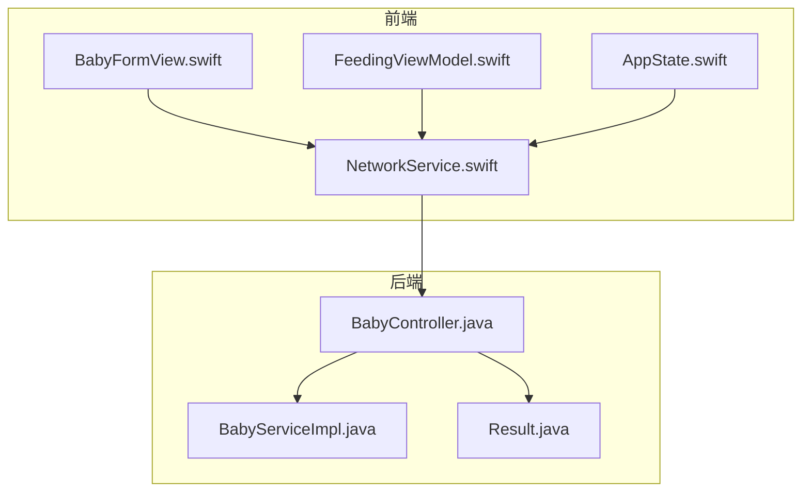
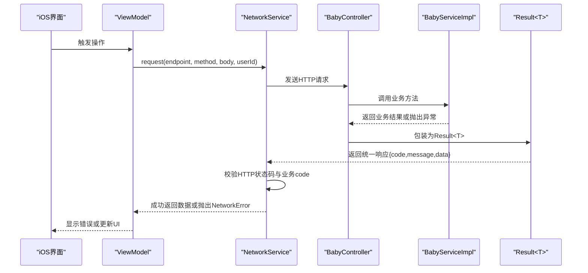
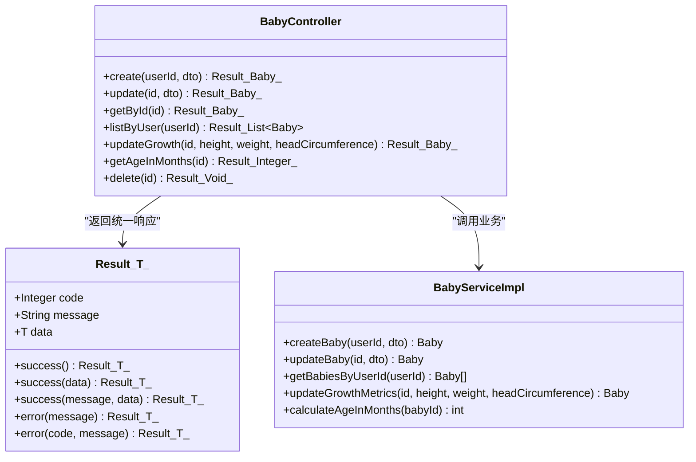
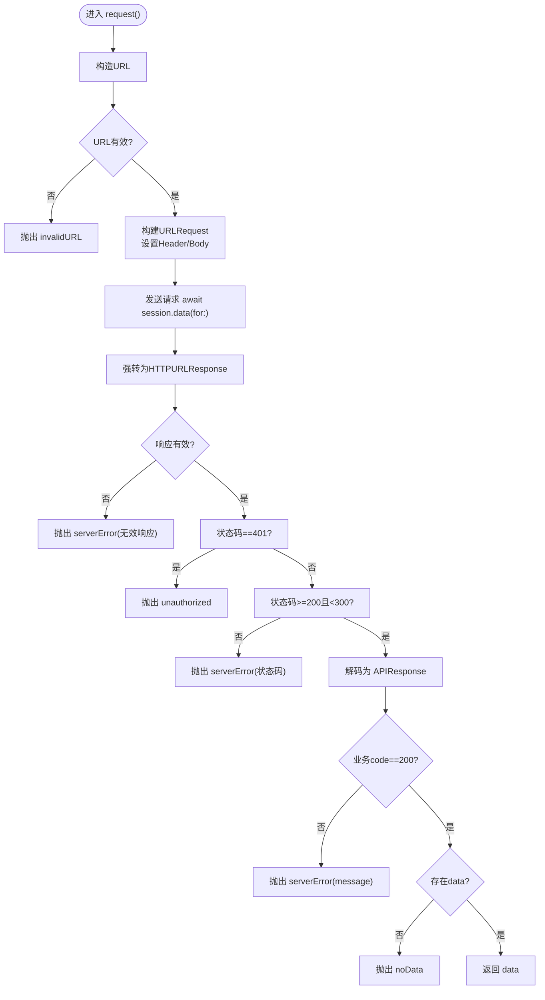
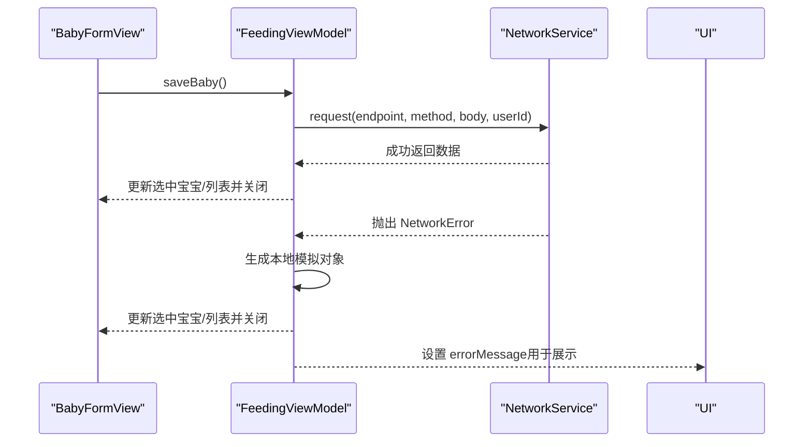
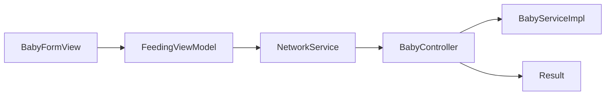

# 错误处理机制

<cite>
**本文引用的文件**
- [Result.java](file://backend/src/main/java/com/baby/common/Result.java)
- [BabyController.java](file://backend/src/main/java/com/baby/controller/BabyController.java)
- [BabyServiceImpl.java](file://backend/src/main/java/com/baby/service/impl/BabyServiceImpl.java)
- [NetworkService.swift](file://ios/BabyFeedingReminder/Services/NetworkService.swift)
- [FeedingViewModel.swift](file://ios/BabyFeedingReminder/ViewModels/FeedingViewModel.swift)
- [BabyFormView.swift](file://ios/BabyFeedingReminder/Views/BabyFormView.swift)
- [AppState.swift](file://ios/BabyFeedingReminder/BabyFeedingReminderApp.swift)
- [Application.java](file://backend/src/main/java/com/baby/Application.java)
- [README.md](file://README.md)
</cite>

## 目录
1. [简介](#简介)
2. [项目结构](#项目结构)
3. [核心组件](#核心组件)
4. [架构总览](#架构总览)
5. [详细组件分析](#详细组件分析)
6. [依赖关系分析](#依赖关系分析)
7. [性能考量](#性能考量)
8. [故障排查指南](#故障排查指南)
9. [结论](#结论)
10. [附录](#附录)

## 简介
本文件系统性梳理 babyFeedingReminder 应用在前后端的错误处理机制，重点覆盖：
- 后端通过统一响应封装 Result<T> 的 error() 方法标准化错误返回，并结合 HTTP 状态码与消息描述；
- iOS 端 NetworkService.swift 使用 do-catch 捕获 URLSession 错误，涵盖网络失败、超时、无效响应以及业务错误映射；
- 将 HTTP 状态码（如 400、401、500）映射为用户可理解的提示信息；
- 展示验证错误处理与网络错误恢复策略的具体代码路径；
- 提供常见问题（静默失败、错误消息本地化、生产调试）的解决方案与扩展建议。

## 项目结构
应用采用前后端分离架构：
- 后端：Spring Boot + MyBatis Plus，统一响应封装 Result<T>，控制器返回 Result<T>；
- iOS：SwiftUI + MVVM，NetworkService.swift 负责网络请求与错误映射，各 ViewModel 负责 UI 错误反馈与降级策略。

图表来源
- [BabyController.java](file://backend/src/main/java/com/baby/controller/BabyController.java#L1-L80)
- [BabyServiceImpl.java](file://backend/src/main/java/com/baby/service/impl/BabyServiceImpl.java#L1-L91)
- [Result.java](file://backend/src/main/java/com/baby/common/Result.java#L1-L54)
- [NetworkService.swift](file://ios/BabyFeedingReminder/Services/NetworkService.swift#L1-L199)
- [FeedingViewModel.swift](file://ios/BabyFeedingReminder/ViewModels/FeedingViewModel.swift#L1-L226)
- [BabyFormView.swift](file://ios/BabyFeedingReminder/Views/BabyFormView.swift#L160-L297)
- [AppState.swift](file://ios/BabyFeedingReminder/BabyFeedingReminderApp.swift#L20-L61)

章节来源
- [README.md](file://README.md#L63-L119)

## 核心组件
- 后端统一响应封装 Result<T>：提供 success()/error() 系列静态方法，统一返回 code、message、data 字段，便于前端解析与展示。
- iOS 网络服务 NetworkService.swift：封装 request()/requestVoid()，集中处理 URL 构造、请求头、序列化、响应校验、错误枚举与本地化描述。
- 控制器与服务：BabyController 对外暴露 REST 接口；BabyServiceImpl 执行业务逻辑，必要时抛出异常，由上层统一包装为 Result<T>。

章节来源
- [Result.java](file://backend/src/main/java/com/baby/common/Result.java#L1-L54)
- [BabyController.java](file://backend/src/main/java/com/baby/controller/BabyController.java#L1-L80)
- [BabyServiceImpl.java](file://backend/src/main/java/com/baby/service/impl/BabyServiceImpl.java#L1-L91)
- [NetworkService.swift](file://ios/BabyFeedingReminder/Services/NetworkService.swift#L1-L199)

## 架构总览
后端以 Result<T> 作为统一输出，前端以 NetworkService.swift 作为统一入口，将 HTTP 状态码与业务错误映射为用户可读的错误描述，并在 UI 层进行反馈。

图表来源
- [BabyController.java](file://backend/src/main/java/com/baby/controller/BabyController.java#L1-L80)
- [BabyServiceImpl.java](file://backend/src/main/java/com/baby/service/impl/BabyServiceImpl.java#L1-L91)
- [Result.java](file://backend/src/main/java/com/baby/common/Result.java#L1-L54)
- [NetworkService.swift](file://ios/BabyFeedingReminder/Services/NetworkService.swift#L89-L138)

## 详细组件分析

### 后端：Result<T> 统一响应与错误标准化
- Result<T> 提供 success()/error() 方法族，约定 code=200 表示成功，其他 code 用于表达业务错误；
- 控制器方法直接返回 Result<T>，确保对外接口一致；
- 业务异常（如实体不存在）在服务层抛出，由上层统一包装为 Result<T>，便于前端识别与展示。

图表来源
- [Result.java](file://backend/src/main/java/com/baby/common/Result.java#L1-L54)
- [BabyController.java](file://backend/src/main/java/com/baby/controller/BabyController.java#L1-L80)
- [BabyServiceImpl.java](file://backend/src/main/java/com/baby/service/impl/BabyServiceImpl.java#L1-L91)

章节来源
- [Result.java](file://backend/src/main/java/com/baby/common/Result.java#L1-L54)
- [BabyController.java](file://backend/src/main/java/com/baby/controller/BabyController.java#L26-L78)
- [BabyServiceImpl.java](file://backend/src/main/java/com/baby/service/impl/BabyServiceImpl.java#L41-L58)

### iOS：NetworkService.swift 错误捕获与映射
- request()/requestVoid() 统一处理 URL 构造、请求头、序列化、响应校验；
- 对 HTTP 状态码进行判定：401 映射为未授权；2xx 成功；其他 4xx/5xx 映射为服务器错误；
- 对业务层返回的 code 进行校验：非 200 时抛出 serverError(message)；
- 错误枚举 NetworkError 提供本地化描述，便于 UI 展示。

图表来源
- [NetworkService.swift](file://ios/BabyFeedingReminder/Services/NetworkService.swift#L89-L138)

章节来源
- [NetworkService.swift](file://ios/BabyFeedingReminder/Services/NetworkService.swift#L1-L199)

### iOS：ViewModel 与视图层的错误反馈与降级
- FeedingViewModel 在加载、新增、更新、删除等操作中使用 do-catch，捕获网络错误后回退到本地模拟数据，并将错误信息赋给 errorMessage 供 UI 展示；
- BabyFormView 在保存时同样使用 do-catch，出现错误时生成本地模拟对象并缓存，保证用户体验连续性；
- AppState 在加载宝宝列表时也采用 do-catch 并设置 isLoadingBabies，避免 UI 长时间无响应。

图表来源
- [BabyFormView.swift](file://ios/BabyFeedingReminder/Views/BabyFormView.swift#L219-L290)
- [FeedingViewModel.swift](file://ios/BabyFeedingReminder/ViewModels/FeedingViewModel.swift#L98-L147)
- [AppState.swift](file://ios/BabyFeedingReminder/BabyFeedingReminderApp.swift#L50-L61)

章节来源
- [BabyFormView.swift](file://ios/BabyFeedingReminder/Views/BabyFormView.swift#L219-L290)
- [FeedingViewModel.swift](file://ios/BabyFeedingReminder/ViewModels/FeedingViewModel.swift#L62-L96)
- [AppState.swift](file://ios/BabyFeedingReminder/BabyFeedingReminderApp.swift#L50-L61)

### 验证错误处理与业务异常映射
- 控制器方法标注 @Valid，参数校验失败将触发 Spring MVC 的参数绑定异常；
- 服务层在关键业务点（如实体不存在）抛出异常，由上层统一包装为 Result<T>；
- iOS 端对 401 与业务错误进行明确区分，分别映射为“未授权”和具体 message，提升用户可理解度。

章节来源
- [BabyController.java](file://backend/src/main/java/com/baby/controller/BabyController.java#L26-L78)
- [BabyServiceImpl.java](file://backend/src/main/java/com/baby/service/impl/BabyServiceImpl.java#L41-L58)
- [NetworkService.swift](file://ios/BabyFeedingReminder/Services/NetworkService.swift#L119-L131)

## 依赖关系分析
- 后端：控制器依赖服务层；服务层依赖 Mapper；控制器返回 Result<T>；
- 前端：各 ViewModel 依赖 NetworkService；NetworkService 依赖 URLSession 与 JSON 解析器；UI 层依赖 ViewModel 的错误信息。

图表来源
- [BabyFormView.swift](file://ios/BabyFeedingReminder/Views/BabyFormView.swift#L219-L290)
- [FeedingViewModel.swift](file://ios/BabyFeedingReminder/ViewModels/FeedingViewModel.swift#L1-L226)
- [NetworkService.swift](file://ios/BabyFeedingReminder/Services/NetworkService.swift#L1-L199)
- [BabyController.java](file://backend/src/main/java/com/baby/controller/BabyController.java#L1-L80)
- [BabyServiceImpl.java](file://backend/src/main/java/com/baby/service/impl/BabyServiceImpl.java#L1-L91)
- [Result.java](file://backend/src/main/java/com/baby/common/Result.java#L1-L54)

章节来源
- [Application.java](file://backend/src/main/java/com/baby/Application.java#L1-L17)

## 性能考量
- iOS 端 URLSession 配置了请求超时，有助于在网络不佳时快速失败并给出反馈；
- 前端在错误发生时采用本地模拟数据，减少等待时间，改善用户体验；
- 后端统一响应封装降低前端解析成本，减少重复判断逻辑。

[本节为通用指导，不涉及具体文件分析]

## 故障排查指南
- 静默失败
  - 症状：UI 无提示但操作未生效；
  - 排查：确认 ViewModel 是否在 do-catch 中设置了 errorMessage；NetworkService 是否正确抛出 NetworkError；
  - 处理：在 ViewModel 的 catch 分支中设置 errorMessage，并在 UI 层显式展示。
  
  章节来源
  - [FeedingViewModel.swift](file://ios/BabyFeedingReminder/ViewModels/FeedingViewModel.swift#L92-L96)
  - [BabyFormView.swift](file://ios/BabyFeedingReminder/Views/BabyFormView.swift#L267-L287)
  - [NetworkService.swift](file://ios/BabyFeedingReminder/Services/NetworkService.swift#L119-L131)

- 错误消息本地化
  - 症状：错误文案不可读或不一致；
  - 排查：NetworkError 的 errorDescription 是否覆盖了所有分支；
  - 处理：在 iOS 端通过 LocalizedError 提供中文描述；后端 Result<T> 的 message 由后端统一维护。
  
  章节来源
  - [NetworkService.swift](file://ios/BabyFeedingReminder/Services/NetworkService.swift#L11-L27)

- 生产环境调试
  - 症状：线上偶发错误难以复现；
  - 排查：确认后端是否记录异常堆栈与请求上下文；前端是否收集 NetworkError 类型与原始 message；
  - 处理：建议在后端增加全局异常拦截器记录日志；在前端增加错误上报（如 Sentry），并保留错误上下文（URL、状态码、message）。
  
  章节来源
  - [BabyController.java](file://backend/src/main/java/com/baby/controller/BabyController.java#L26-L78)
  - [BabyServiceImpl.java](file://backend/src/main/java/com/baby/service/impl/BabyServiceImpl.java#L41-L58)

- 网络超时与重试策略
  - 症状：请求长时间无响应；
  - 排查：确认 URLSession 的超时配置；NetworkService 是否在 catch 中区分超时与服务器错误；
  - 处理：在 UI 层提示“网络超时”，并允许用户重试；必要时引入指数退避重试。
  
  章节来源
  - [NetworkService.swift](file://ios/BabyFeedingReminder/Services/NetworkService.swift#L46-L50)

## 结论
本项目在前后端实现了清晰的错误处理闭环：后端以 Result<T> 统一错误与业务状态，前端以 NetworkService.swift 集中处理网络与业务错误，并通过 ViewModel/View 将错误信息反馈给用户。通过本地模拟数据与明确的状态码映射，既提升了用户体验，也为后续扩展（如全局异常拦截、错误上报）提供了良好基础。

[本节为总结性内容，不涉及具体文件分析]

## 附录

### HTTP 状态码与用户提示映射建议
- 400：参数非法或业务校验失败（message 由后端 Result<T>.message 提供）；
- 401：未授权/登录失效，提示“请重新登录”；
- 500：服务器内部错误，提示“服务暂时不可用，请稍后再试”。

章节来源
- [NetworkService.swift](file://ios/BabyFeedingReminder/Services/NetworkService.swift#L119-L131)
- [Result.java](file://backend/src/main/java/com/baby/common/Result.java#L40-L51)

### 扩展建议：自定义业务异常
- 后端：针对特定业务异常（如“宝宝不存在”、“权限不足”）定义独立异常类，并在全局异常处理器中统一转换为 Result.error(code, message)，保持前端一致性。
- 前端：在 NetworkError 中新增对应分支，并在 UI 层按需展示不同提示或引导用户执行修复动作（如跳转登录页）。

章节来源
- [BabyServiceImpl.java](file://backend/src/main/java/com/baby/service/impl/BabyServiceImpl.java#L41-L58)
- [NetworkService.swift](file://ios/BabyFeedingReminder/Services/NetworkService.swift#L11-L27)