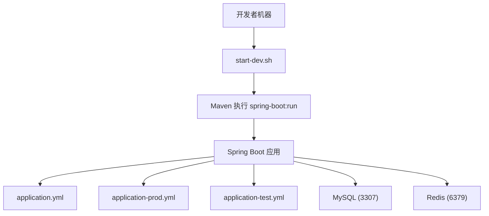
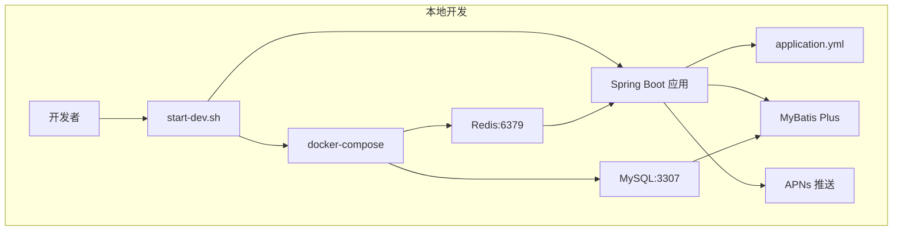
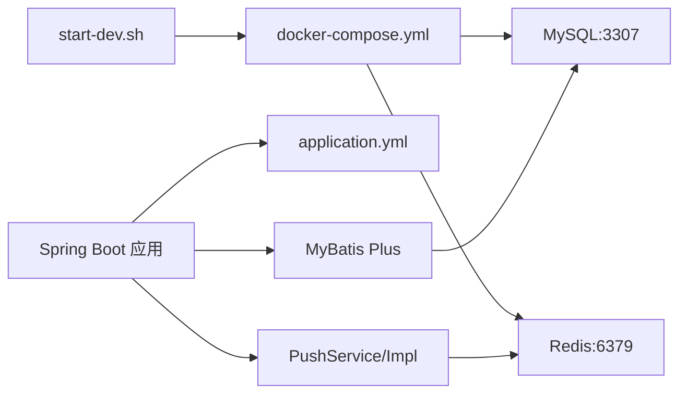

# 开发环境配置

<cite>
**本文引用的文件**
- [application.yml](file://backend/src/main/resources/application.yml)
- [application-prod.yml](file://backend/src/main/resources/application-prod.yml)
- [application-test.yml](file://backend/src/test/resources/application-test.yml)
- [start-dev.sh](file://backend/start-dev.sh)
- [docker-compose.yml](file://docker-compose.yml)
- [init.sql](file://backend/src/main/resources/db/init.sql)
- [MyBatisPlusConfig.java](file://backend/src/main/java/com/baby/config/MyBatisPlusConfig.java)
- [SecurityConfig.java](file://backend/src/main/java/com/baby/config/SecurityConfig.java)
- [PushServiceImpl.java](file://backend/src/main/java/com/baby/service/impl/PushServiceImpl.java)
- [PushService.java](file://backend/src/main/java/com/baby/service/PushService.java)
- [nginx.conf](file://nginx/nginx.conf)
- [.env.example](file://.env.example)
</cite>

## 目录
1. [简介](#简介)
2. [项目结构与入口](#项目结构与入口)
3. [核心配置总览](#核心配置总览)
4. [架构概览](#架构概览)
5. [详细组件分析](#详细组件分析)
6. [依赖关系分析](#依赖关系分析)
7. [性能与日志建议](#性能与日志建议)
8. [常见问题排查](#常见问题排查)
9. [结论](#结论)

## 简介
本节面向本地开发环境，系统性说明后端应用的配置文件、启动脚本与基础设施，帮助开发者快速搭建并运行 babyFeedingReminder。重点覆盖：
- application.yml 的用途与结构，包括服务器、数据源、Redis、MyBatis Plus、JWT、APNs、喂养/睡眠指南等配置项
- start-dev.sh 如何辅助本地开发，包括依赖检查、数据库准备与启动参数
- 在不同场景下如何修改数据库凭据、调整端口、启用 APNs 进行测试
- 常见连接超时、SSL 与时区问题的处理思路
- 非生产环境下的性能与日志优化建议

## 项目结构与入口
- 后端位于 backend/，包含 Spring Boot 应用、资源文件与启动脚本
- 开发配置文件为 application.yml，生产配置为 application-prod.yml，测试配置为 application-test.yml
- 启动脚本 start-dev.sh 会自动检测 Java/Maven/Docker 并引导数据库与后端启动
- docker-compose.yml 提供 MySQL 与 Redis 的容器化服务，并将 MySQL 映射至 3307 端口以避免与本地 MySQL 冲突

图表来源
- [start-dev.sh](file://backend/start-dev.sh#L72-L88)
- [application.yml](file://backend/src/main/resources/application.yml#L1-L47)
- [application-prod.yml](file://backend/src/main/resources/application-prod.yml#L1-L44)
- [application-test.yml](file://backend/src/test/resources/application-test.yml#L1-L26)
- [docker-compose.yml](file://docker-compose.yml#L28-L62)

章节来源
- [start-dev.sh](file://backend/start-dev.sh#L1-L89)
- [application.yml](file://backend/src/main/resources/application.yml#L1-L98)
- [application-prod.yml](file://backend/src/main/resources/application-prod.yml#L1-L85)
- [application-test.yml](file://backend/src/test/resources/application-test.yml#L1-L26)
- [docker-compose.yml](file://docker-compose.yml#L1-L89)

## 核心配置总览
- 服务器配置
  - 端口与上下文路径：server.port 与 server.servlet.context-path
- 数据源配置（MySQL）
  - 驱动、URL、用户名、密码；使用 3307 端口映射，Asia/Shanghai 时区，UTF-8 字符集
- 缓存配置（Redis）
  - 主机、端口、密码、数据库索引
- MyBatis Plus
  - Mapper XML 位置、实体包扫描、驼峰映射、日志输出、全局逻辑删除字段与策略
- JWT
  - 密钥与过期时间
- APNs
  - 是否启用、证书路径与密码、主题（topic）
- 喂养/睡眠指南
  - 基于国家卫健委指南的年龄分段与建议值
- Swagger UI
  - 开发环境提供 UI 访问路径，生产环境默认关闭

章节来源
- [application.yml](file://backend/src/main/resources/application.yml#L1-L98)
- [application-prod.yml](file://backend/src/main/resources/application-prod.yml#L1-L85)
- [application-test.yml](file://backend/src/test/resources/application-test.yml#L1-L26)

## 架构概览
下图展示开发环境中的关键组件交互：启动脚本负责准备数据库与后端，应用通过 application.yml 读取配置，连接 MySQL 与 Redis，使用 MyBatis Plus 访问数据库，APNs 用于推送。

图表来源
- [start-dev.sh](file://backend/start-dev.sh#L43-L88)
- [docker-compose.yml](file://docker-compose.yml#L28-L62)
- [application.yml](file://backend/src/main/resources/application.yml#L1-L47)
- [PushServiceImpl.java](file://backend/src/main/java/com/baby/service/impl/PushServiceImpl.java#L1-L67)

章节来源
- [start-dev.sh](file://backend/start-dev.sh#L43-L88)
- [docker-compose.yml](file://docker-compose.yml#L28-L62)
- [application.yml](file://backend/src/main/resources/application.yml#L1-L47)
- [PushServiceImpl.java](file://backend/src/main/java/com/baby/service/impl/PushServiceImpl.java#L1-L67)

## 详细组件分析

### 服务器与上下文路径
- server.port：后端监听端口
- server.servlet.context-path：统一前缀 /api
- 作用：保证前端请求路由与后端一致

章节来源
- [application.yml](file://backend/src/main/resources/application.yml#L1-L5)

### 数据源配置（MySQL）
- driver-class-name：MySQL 驱动
- url：使用 3307 端口，指定 Asia/Shanghai 时区、UTF-8 字符集、禁用 SSL、允许公钥检索
- username/password：默认 root/root123
- 初始化 SQL：init.sql 创建数据库与表结构，包含用户、宝宝、喂养记录、睡眠记录、设置与提醒任务等

章节来源
- [application.yml](file://backend/src/main/resources/application.yml#L10-L15)
- [init.sql](file://backend/src/main/resources/db/init.sql#L1-L147)

### Redis 连接
- host/port：默认本地 6379
- password：空
- database：默认 0
- 作用：缓存与会话存储（在生产配置中还包含连接池参数）

章节来源
- [application.yml](file://backend/src/main/resources/application.yml#L16-L22)
- [application-prod.yml](file://backend/src/main/resources/application-prod.yml#L21-L32)

### MyBatis Plus 配置
- mapper-locations：扫描 mapper 下的 XML
- type-aliases-package：实体包扫描
- configuration：驼峰映射、StdOut 日志输出（开发环境）
- global-config.db-config：自增主键、逻辑删除字段与值

章节来源
- [application.yml](file://backend/src/main/resources/application.yml#L23-L35)
- [MyBatisPlusConfig.java](file://backend/src/main/java/com/baby/config/MyBatisPlusConfig.java#L1-L47)

### JWT 配置
- secret：密钥
- expiration：过期时间（毫秒）
- 作用：生成与验证令牌，配合安全配置实现无状态认证

章节来源
- [application.yml](file://backend/src/main/resources/application.yml#L36-L40)
- [application-prod.yml](file://backend/src/main/resources/application-prod.yml#L45-L49)

### APNs 配置与推送
- enabled：是否启用
- production：是否生产环境
- certificate-path/certificate-password：证书路径与密码
- topic：推送主题
- PushService 接口与 PushServiceImpl 实现：根据 enabled 判断是否执行真实推送，否则进行日志记录

章节来源
- [application.yml](file://backend/src/main/resources/application.yml#L41-L48)
- [application-prod.yml](file://backend/src/main/resources/application-prod.yml#L50-L57)
- [PushService.java](file://backend/src/main/java/com/baby/service/PushService.java#L1-L22)
- [PushServiceImpl.java](file://backend/src/main/java/com/baby/service/impl/PushServiceImpl.java#L1-L67)

### 喂养与睡眠指南配置
- feeding.guide：按年龄分段给出每日次数、单次容量、间隔小时数
- sleep.guide：按年龄分段给出全天总时长、午睡次数、午睡时长
- 依据：国家卫健委相关指南

章节来源
- [application.yml](file://backend/src/main/resources/application.yml#L49-L92)

### Swagger UI 与 API 文档
- 开发环境：提供 /swagger-ui.html 与 /v3/api-docs
- 生产环境：默认关闭 swagger-ui 与 api-docs

章节来源
- [application.yml](file://backend/src/main/resources/application.yml#L93-L98)
- [application-prod.yml](file://backend/src/main/resources/application-prod.yml#L80-L85)

### 安全与开发阶段放行
- SecurityConfig：禁用 CSRF，无状态 Session，开发阶段对 /api 下所有接口放行，开放 Swagger 与 Actuator
- 测试配置：H2 内存数据库、开启 H2 控制台、MyBatis Plus 日志输出

章节来源
- [SecurityConfig.java](file://backend/src/main/java/com/baby/config/SecurityConfig.java#L1-L42)
- [application-test.yml](file://backend/src/test/resources/application-test.yml#L1-L26)

## 依赖关系分析
- 启动脚本依赖 Docker Compose 启动 MySQL 与 Redis，或提示手动准备本地服务
- Spring Boot 通过 application.yml 读取配置，连接 MySQL 与 Redis
- MyBatis Plus 通过配置扫描 Mapper 与实体，实现数据库访问
- APNs 通过 PushService 接口与实现类进行推送控制

图表来源
- [start-dev.sh](file://backend/start-dev.sh#L43-L88)
- [docker-compose.yml](file://docker-compose.yml#L28-L62)
- [application.yml](file://backend/src/main/resources/application.yml#L1-L47)
- [PushServiceImpl.java](file://backend/src/main/java/com/baby/service/impl/PushServiceImpl.java#L1-L67)

章节来源
- [start-dev.sh](file://backend/start-dev.sh#L43-L88)
- [docker-compose.yml](file://docker-compose.yml#L28-L62)
- [application.yml](file://backend/src/main/resources/application.yml#L1-L47)
- [PushServiceImpl.java](file://backend/src/main/java/com/baby/service/impl/PushServiceImpl.java#L1-L67)

## 性能与日志建议
- 开发环境
  - 已开启 MyBatis Plus StdOut 日志，便于调试
  - Swagger UI 默认开启，便于联调
- 非开发环境（生产）
  - 关闭 Swagger UI 与 API 文档，降低暴露面
  - 使用 application-prod.yml 中的日志与连接池参数，减少 IO 与连接开销
  - 可通过环境变量覆盖敏感配置（如数据库 URL、用户名、密码、JWT 密钥、APNs 参数）

章节来源
- [application.yml](file://backend/src/main/resources/application.yml#L23-L35)
- [application-prod.yml](file://backend/src/main/resources/application-prod.yml#L58-L85)
- [.env.example](file://.env.example#L1-L12)

## 常见问题排查

### 1. 数据库连接超时
- 症状：应用启动时报连接超时或无法建立连接
- 排查要点
  - 确认 MySQL 是否已通过 Docker 启动并健康（docker-compose 映射 3307 端口）
  - 若使用本地 MySQL，请确认端口为 3306（与 application.yml 的 3307 不同），并检查防火墙与凭据
  - 检查字符集与时区：确保 UTF-8 与 Asia/Shanghai 设置一致
  - 检查 SSL：application.yml 中已禁用 SSL，若本地 MySQL 强制 SSL，需调整 URL 或本地配置
- 相关配置参考
  - 数据源 URL、用户名、密码、时区与时钟
  - 初始化 SQL 中的数据库与表结构

章节来源
- [application.yml](file://backend/src/main/resources/application.yml#L10-L15)
- [docker-compose.yml](file://docker-compose.yml#L28-L51)
- [init.sql](file://backend/src/main/resources/db/init.sql#L1-L10)

### 2. SSL 配置问题
- 症状：连接 MySQL 报 SSL 相关错误
- 处理建议
  - 开发环境 application.yml 已禁用 SSL，确保未被覆盖
  - 生产环境 application-prod.yml 也明确使用非 SSL URL
  - 若本地 MySQL 强制 SSL，可在 URL 中调整参数或在本地数据库配置中允许非 SSL 连接

章节来源
- [application.yml](file://backend/src/main/resources/application.yml#L10-L15)
- [application-prod.yml](file://backend/src/main/resources/application-prod.yml#L10-L15)

### 3. 时区与时钟不一致
- 症状：时间显示异常或定时任务不准确
- 处理建议
  - 确保数据库连接 URL 指定 Asia/Shanghai
  - 确保操作系统与容器时区一致
  - 如需变更时区，统一在 URL 与系统层面同步

章节来源
- [application.yml](file://backend/src/main/resources/application.yml#L10-L15)
- [docker-compose.yml](file://docker-compose.yml#L33-L40)

### 4. APNs 推送未生效
- 症状：调用推送接口无实际推送
- 处理建议
  - 确认 apns.enabled 为 true
  - 准备有效的 p12 证书与密码，并正确设置 certificate-path 与 certificate-password
  - 设置正确的 topic
  - 开发阶段可先启用 enabled 进行功能验证

章节来源
- [application.yml](file://backend/src/main/resources/application.yml#L41-L48)
- [PushServiceImpl.java](file://backend/src/main/java/com/baby/service/impl/PushServiceImpl.java#L1-L67)

### 5. Swagger UI 在生产不可见
- 症状：生产环境无法访问 Swagger UI
- 处理建议
  - 生产环境默认关闭 swagger-ui 与 api-docs
  - 如需临时查看，可通过 application-prod.yml 调整开关（不建议长期开启）

章节来源
- [application-prod.yml](file://backend/src/main/resources/application-prod.yml#L80-L85)

## 实战操作指南

### 修改数据库凭据
- 方案一：直接编辑 application.yml（开发）
  - 修改 spring.datasource.username 与 password
- 方案二：使用环境变量（生产）
  - 通过 SPRING_DATASOURCE_URL、SPRING_DATASOURCE_USERNAME、SPRING_DATASOURCE_PASSWORD 覆盖
- 方案三：使用 .env.example 中的示例变量（部署时参考）

章节来源
- [application.yml](file://backend/src/main/resources/application.yml#L10-L15)
- [application-prod.yml](file://backend/src/main/resources/application-prod.yml#L10-L15)
- [.env.example](file://.env.example#L1-L12)

### 调整服务器端口
- 修改 server.port 即可切换端口
- 注意：若使用 Nginx 反向代理，需同步调整上游与转发规则

章节来源
- [application.yml](file://backend/src/main/resources/application.yml#L1-L5)
- [nginx.conf](file://nginx/nginx.conf#L24-L51)

### 启用 APNs 进行测试
- 将 apns.enabled 改为 true
- 配置 certificate-path 与 certificate-password
- 设置 topic
- 通过 PushService 接口调用发送推送，观察日志输出

章节来源
- [application.yml](file://backend/src/main/resources/application.yml#L41-L48)
- [PushService.java](file://backend/src/main/java/com/baby/service/PushService.java#L1-L22)
- [PushServiceImpl.java](file://backend/src/main/java/com/baby/service/impl/PushServiceImpl.java#L1-L67)

### 启动本地开发
- 使用 start-dev.sh
  - 自动检查 Java 与 Maven
  - 可选择使用 Docker Compose 启动 MySQL 与 Redis（MySQL 映射 3307）
  - 以 dev profile 启动后端

章节来源
- [start-dev.sh](file://backend/start-dev.sh#L1-L89)
- [docker-compose.yml](file://docker-compose.yml#L28-L62)

## 结论
通过 application.yml 的清晰配置与 start-dev.sh 的自动化引导，开发者可以在本地快速完成数据库与后端的准备与启动。生产环境则通过 application-prod.yml 提供更严格的日志与安全策略。遇到连接超时、SSL 与时区问题时，优先核对 URL、端口与时区设置；启用 APNs 时务必准备好证书与主题。非生产环境建议关闭 Swagger UI 与精简日志，以提升安全性与性能。