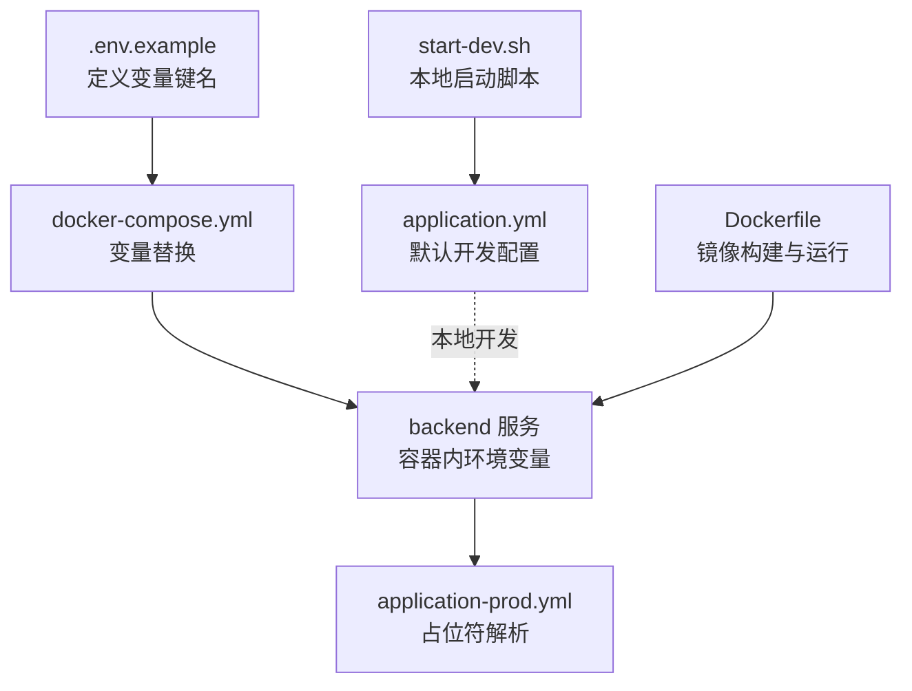
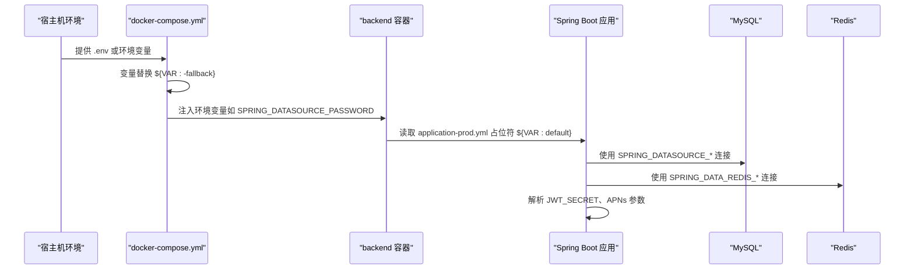
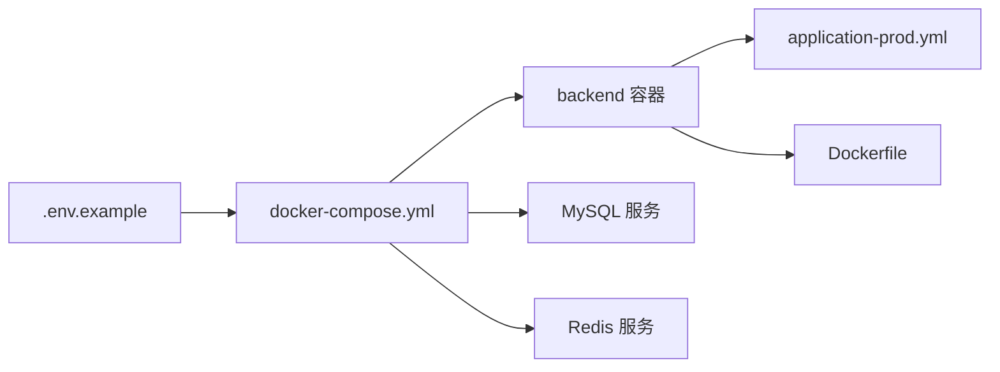

# 环境变量管理

<cite>
**本文引用的文件**
- [.env.example](file://.env.example)
- [docker-compose.yml](file://docker-compose.yml)
- [application-prod.yml](file://backend/src/main/resources/application-prod.yml)
- [application.yml](file://backend/src/main/resources/application.yml)
- [Dockerfile](file://backend/Dockerfile)
- [start-dev.sh](file://backend/start-dev.sh)
</cite>

## 目录
1. [简介](#简介)
2. [项目结构](#项目结构)
3. [核心组件](#核心组件)
4. [架构总览](#架构总览)
5. [详细组件分析](#详细组件分析)
6. [依赖关系分析](#依赖关系分析)
7. [性能考虑](#性能考虑)
8. [故障排查指南](#故障排查指南)
9. [结论](#结论)
10. [附录](#附录)

## 简介
本节聚焦于 babyFeedingReminder 应用在不同部署场景下的环境变量管理。重点说明 .env.example 作为环境变量模板的作用，如何通过 docker-compose.yml 在容器编排中进行变量替换，以及 Spring Boot 在 application-prod.yml 中对占位符的解析与应用。同时提供安全处理敏感数据（如数据库密码、JWT 密钥）的实践建议，并覆盖本地开发与生产部署的差异、常见问题与最佳实践。

## 项目结构
围绕环境变量管理的关键文件与位置如下：
- .env.example：定义了数据库、JWT、APNs 等关键变量的示例键名，便于复制为实际 .env 文件。
- docker-compose.yml：在服务环境变量中使用变量替换语法，将宿主机或外部来源的值注入容器。
- application-prod.yml：Spring Boot 的生产配置，使用占位符从环境变量读取运行时参数。
- application.yml：默认开发配置，不依赖外部环境变量（用于本地快速启动）。
- Dockerfile：容器镜像构建与运行，不直接暴露敏感变量。
- start-dev.sh：本地开发启动脚本，使用默认配置并提示数据库准备。

图表来源
- [.env.example](file://.env.example#L1-L13)
- [docker-compose.yml](file://docker-compose.yml#L1-L89)
- [application-prod.yml](file://backend/src/main/resources/application-prod.yml#L1-L85)
- [application.yml](file://backend/src/main/resources/application.yml#L1-L98)
- [Dockerfile](file://backend/Dockerfile#L1-L38)
- [start-dev.sh](file://backend/start-dev.sh#L1-L89)

章节来源
- file://.env.example#L1-L13
- file://docker-compose.yml#L1-L89
- file://backend/src/main/resources/application-prod.yml#L1-L85
- file://backend/src/main/resources/application.yml#L1-L98
- file://backend/Dockerfile#L1-L38
- file://backend/start-dev.sh#L1-L89

## 核心组件
- 变量模板与用途
  - 数据库相关：MYSQL_ROOT_PASSWORD（根密码），用于初始化 MySQL 并作为 Spring DataSource 密码来源。
  - JWT 相关：JWT_SECRET（签名密钥），用于生成与验证令牌。
  - APNs 推送相关：APNS_ENABLED、APNS_PRODUCTION、APNS_CERTIFICATE_PATH、APNS_CERTIFICATE_PASSWORD、APNS_TOPIC，控制推送开关、证书路径与主题。
- 变量替换与占位符
  - docker-compose.yml 使用 ${VAR:-fallback} 语法，若未设置则回退到默认值。
  - application-prod.yml 使用 ${VAR:default} 语法，若未设置则采用内置默认值。
- 默认值策略
  - docker-compose.yml 对数据库密码提供默认回退值，application-prod.yml 对数据库连接、Redis、JWT、APNs 提供内置默认值。

章节来源
- file://.env.example#L1-L13
- file://docker-compose.yml#L13-L19
- file://docker-compose.yml#L35-L41
- file://backend/src/main/resources/application-prod.yml#L11-L14
- file://backend/src/main/resources/application-prod.yml#L22-L26
- file://backend/src/main/resources/application-prod.yml#L46-L49
- file://backend/src/main/resources/application-prod.yml#L51-L57

## 架构总览
下图展示从宿主环境到容器内部，再到 Spring Boot 配置解析的整体流程。

图表来源
- [docker-compose.yml](file://docker-compose.yml#L13-L19)
- [docker-compose.yml](file://docker-compose.yml#L35-L41)
- [application-prod.yml](file://backend/src/main/resources/application-prod.yml#L11-L14)
- [application-prod.yml](file://backend/src/main/resources/application-prod.yml#L22-L26)
- [application-prod.yml](file://backend/src/main/resources/application-prod.yml#L46-L49)
- [application-prod.yml](file://backend/src/main/resources/application-prod.yml#L51-L57)

## 详细组件分析

### 组件一：.env.example 作为模板
- 作用
  - 以注释形式列出关键变量键名，指导团队复制为实际 .env 文件并填充真实值。
  - 明确数据库、JWT、APNs 的配置项，避免遗漏。
- 关键变量
  - MYSQL_ROOT_PASSWORD：数据库根密码。
  - JWT_SECRET：JWT 签名密钥。
  - APNs 开关与证书：APNS_ENABLED、APNS_PRODUCTION、APNS_CERTIFICATE_PATH、APNS_CERTIFICATE_PASSWORD、APNS_TOPIC。
- 实践建议
  - 将 .env 文件加入 .gitignore，避免提交到仓库。
  - 使用不同环境的 .env 文件（如 .env.local、.env.prod），并通过 CI/CD 注入到容器。

章节来源
- file://.env.example#L1-L13

### 组件二：docker-compose.yml 的变量替换
- 替换语法
  - 使用 ${VAR:-fallback}，若 VAR 未设置，则使用 fallback。
- 典型映射
  - SPRING_DATASOURCE_PASSWORD 由 ${MYSQL_ROOT_PASSWORD:-root123} 提供默认值。
  - MYSQL_ROOT_PASSWORD 由 ${MYSQL_ROOT_PASSWORD:-root123} 提供默认值。
- 与 Spring Boot 的衔接
  - backend 服务通过环境变量将值传入容器，Spring Boot 在 application-prod.yml 中以占位符读取。

章节来源
- file://docker-compose.yml#L13-L19
- file://docker-compose.yml#L35-L41

### 组件三：application-prod.yml 的占位符解析
- 数据源
  - SPRING_DATASOURCE_URL、SPRING_DATASOURCE_USERNAME、SPRING_DATASOURCE_PASSWORD 通过占位符读取。
  - 若未提供，使用内置默认值（例如默认 URL、用户名、密码）。
- Redis
  - SPRING_DATA_REDIS_HOST、SPRING_DATA_REDIS_PORT、SPRING_DATA_REDIS_PASSWORD 通过占位符读取。
- JWT
  - jwt.secret 通过 ${JWT_SECRET:...} 读取，若未提供则使用内置默认密钥。
- APNs
  - apns.enabled、production、certificate-path、certificate-password、topic 通过占位符读取。
- 日志与监控
  - logging、management 等配置在生产环境启用更严格的日志与健康检查。

章节来源
- file://backend/src/main/resources/application-prod.yml#L11-L14
- file://backend/src/main/resources/application-prod.yml#L22-L26
- file://backend/src/main/resources/application-prod.yml#L46-L49
- file://backend/src/main/resources/application-prod.yml#L51-L57

### 组件四：本地开发与默认配置
- application.yml
  - 默认开发配置，包含本地数据库与 Redis 的默认连接信息，便于快速启动。
- start-dev.sh
  - 本地启动脚本，使用默认配置并提示数据库准备；不依赖外部环境变量。
- 差异说明
  - 生产环境通过 docker-compose 与 application-prod.yml 的占位符实现“零代码变更”的配置切换。
  - 开发环境通过 application.yml 的默认值实现“开箱即用”。

章节来源
- file://backend/src/main/resources/application.yml#L1-L98
- file://backend/start-dev.sh#L72-L88

### 组件五：容器运行与安全边界
- Dockerfile
  - 使用 JRE 运行镜像，最小化攻击面；以非 root 用户运行。
  - 不在镜像中硬编码敏感变量，避免泄露。
- 环境变量注入
  - 通过 docker-compose 的 environment 字段注入，或在 CI/CD 中以机密方式注入。

章节来源
- file://backend/Dockerfile#L1-L38
- file://docker-compose.yml#L13-L19

## 依赖关系分析
- 组件耦合
  - docker-compose.yml 与 .env.example 耦合：前者依赖后者提供的键名与默认值策略。
  - backend 服务与 application-prod.yml 耦合：后者通过占位符读取前者注入的环境变量。
- 外部依赖
  - MySQL 与 Redis 服务由 docker-compose 管理，backend 通过占位符连接。
- 潜在风险
  - 若缺少必要变量且未设置默认值，可能导致连接失败或使用弱默认值。
  - 在容器外暴露敏感变量（如 .env 文件）存在泄露风险。

图表来源
- [.env.example](file://.env.example#L1-L13)
- [docker-compose.yml](file://docker-compose.yml#L1-L89)
- [application-prod.yml](file://backend/src/main/resources/application-prod.yml#L1-L85)
- [Dockerfile](file://backend/Dockerfile#L1-L38)

章节来源
- file://docker-compose.yml#L1-L89
- file://backend/src/main/resources/application-prod.yml#L1-L85
- file://backend/Dockerfile#L1-L38

## 性能考虑
- 连接池与资源
  - application-prod.yml 中对 Hikari 连接池参数进行了合理配置，有助于在高并发下保持稳定。
- 缓存与网络
  - Redis 连接参数在占位符中可按需调整，避免默认值导致的性能瓶颈。
- 容器资源
  - Dockerfile 中设置了 JVM 初始与最大堆大小及 GC 参数，适合容器化运行。

章节来源
- file://backend/src/main/resources/application-prod.yml#L15-L20
- file://backend/src/main/resources/application-prod.yml#L27-L32
- file://backend/Dockerfile#L30-L36

## 故障排查指南
- 常见问题与定位
  - 数据库连接失败
    - 检查 docker-compose.yml 是否正确注入 SPRING_DATASOURCE_PASSWORD 与 MYSQL_ROOT_PASSWORD。
    - 确认 application-prod.yml 中占位符是否被替换，或是否使用了内置默认值。
  - JWT 令牌无效
    - 检查 JWT_SECRET 是否被正确注入；若未注入，可能使用了内置默认密钥，存在安全风险。
  - APNs 推送失败
    - 检查 APNS_ENABLED、certificate-path、certificate-password、topic 是否正确设置。
- 默认值回退
  - docker-compose.yml 对数据库密码提供了回退值；application-prod.yml 对多处参数提供了内置默认值。
  - 建议在生产环境显式设置这些变量，避免使用默认值带来的安全与稳定性问题。
- 安全最佳实践
  - 不要将 .env 文件纳入版本控制；使用 CI/CD 的机密存储注入变量。
  - 使用强随机密钥替换默认 JWT_SECRET；定期轮换。
  - 限制 .env 文件权限，仅允许运行用户访问。
  - 在生产环境禁用默认日志输出到控制台，使用集中化日志收集。

章节来源
- file://docker-compose.yml#L13-L19
- file://docker-compose.yml#L35-L41
- file://backend/src/main/resources/application-prod.yml#L11-L14
- file://backend/src/main/resources/application-prod.yml#L22-L26
- file://backend/src/main/resources/application-prod.yml#L46-L49
- file://backend/src/main/resources/application-prod.yml#L51-L57

## 结论
通过 .env.example、docker-compose.yml 的变量替换与 application-prod.yml 的占位符解析，babyFeedingReminder 实现了“零代码变更”的多环境配置。该机制在本地开发与生产部署之间实现了清晰的边界：开发使用默认配置快速启动，生产使用外部注入的安全变量。遵循本文的安全与运维建议，可有效降低配置错误与安全风险。

## 附录
- 本地开发启动
  - 使用 start-dev.sh 启动，默认读取 application.yml 的本地连接信息。
- 生产部署要点
  - 准备 .env 文件，确保包含 MYSQL_ROOT_PASSWORD、JWT_SECRET、APNs 相关变量。
  - 使用 docker-compose 启动，确保 backend 服务成功拉起并与 MySQL/Redis 建立连接。
- 变量清单参考
  - 数据库：MYSQL_ROOT_PASSWORD
  - JWT：JWT_SECRET
  - APNs：APNS_ENABLED、APNS_PRODUCTION、APNS_CERTIFICATE_PATH、APNS_CERTIFICATE_PASSWORD、APNS_TOPIC

章节来源
- file://backend/start-dev.sh#L72-L88
- file://backend/src/main/resources/application.yml#L1-L98
- file://docker-compose.yml#L1-L89
- file://backend/src/main/resources/application-prod.yml#L1-L85
- file://.env.example#L1-L13