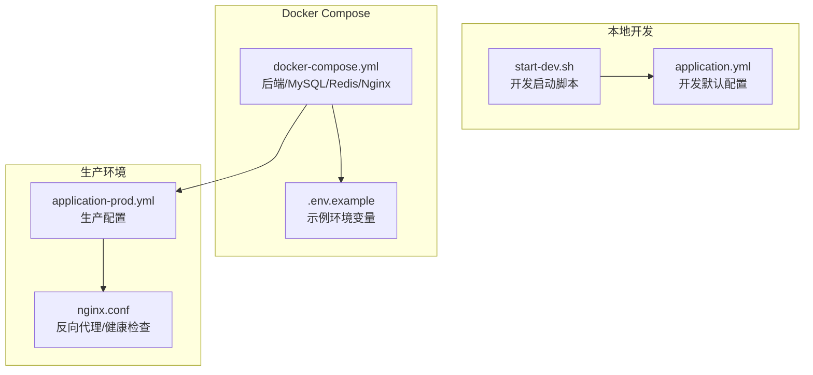
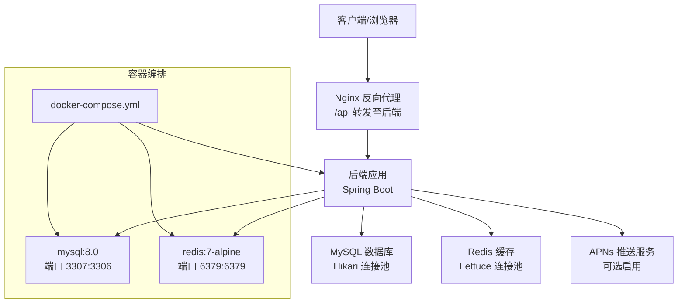
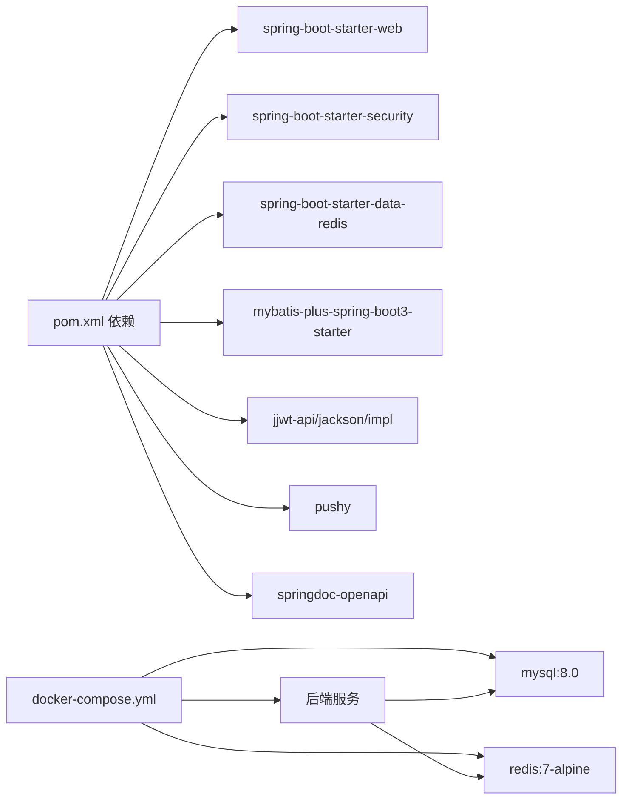

# 环境配置

<cite>
**本文引用的文件**
- [application.yml](file://backend/src/main/resources/application.yml)
- [application-prod.yml](file://backend/src/main/resources/application-prod.yml)
- [.env.example](file://.env.example)
- [docker-compose.yml](file://docker-compose.yml)
- [start-dev.sh](file://backend/start-dev.sh)
- [pom.xml](file://backend/pom.xml)
- [nginx.conf](file://nginx/nginx.conf)
</cite>

## 目录
1. [简介](#简介)
2. [项目结构](#项目结构)
3. [核心组件](#核心组件)
4. [架构总览](#架构总览)
5. [详细组件分析](#详细组件分析)
6. [依赖关系分析](#依赖关系分析)
7. [性能考虑](#性能考虑)
8. [故障排查指南](#故障排查指南)
9. [结论](#结论)
10. [附录](#附录)

## 简介
本节聚焦于 babyFeedingReminder 应用的环境配置与部署实践，涵盖：
- 开发环境使用 application.yml 的多环境配置与 profile 切换
- .env.example 中的环境变量在 docker-compose.yml 中的应用方式
- 生产环境 application-prod.yml 的数据库连接池、Redis 缓存与安全配置
- 不同部署场景下的环境变量管理策略（本地开发、Docker 容器、生产部署）
- 实战示例：如何在不同环境中配置数据库 URL、Redis 主机与 APNs 凭据
- 常见问题：Docker 中 MySQL 端口冲突（3307）与健康检查保障服务就绪
- 性能优化建议：按环境调优数据库与缓存参数

## 项目结构
围绕环境配置的关键文件与目录如下：
- backend/src/main/resources/application.yml：开发默认配置（本地端口、数据库与 Redis 默认值）
- backend/src/main/resources/application-prod.yml：生产专用配置（连接池、Redis 连接、日志、Actuator 健康检查等）
- .env.example：示例环境变量，供 docker-compose.yml 引入
- docker-compose.yml：定义后端、MySQL、Redis、可选 Nginx 及其网络、卷与健康检查
- backend/start-dev.sh：本地开发启动脚本，支持自动拉起数据库容器并以 dev profile 启动
- backend/pom.xml：Spring Boot 依赖与插件，包含 web、security、data-redis、mybatis-plus 等
- nginx/nginx.conf：可选生产反向代理配置（含健康检查路径）

图表来源
- [application.yml](file://backend/src/main/resources/application.yml#L1-L47)
- [application-prod.yml](file://backend/src/main/resources/application-prod.yml#L1-L85)
- [.env.example](file://.env.example#L1-L13)
- [docker-compose.yml](file://docker-compose.yml#L1-L89)
- [start-dev.sh](file://backend/start-dev.sh#L1-L89)
- [nginx.conf](file://nginx/nginx.conf#L1-L78)

章节来源
- [application.yml](file://backend/src/main/resources/application.yml#L1-L47)
- [application-prod.yml](file://backend/src/main/resources/application-prod.yml#L1-L85)
- [.env.example](file://.env.example#L1-L13)
- [docker-compose.yml](file://docker-compose.yml#L1-L89)
- [start-dev.sh](file://backend/start-dev.sh#L1-L89)
- [pom.xml](file://backend/pom.xml#L1-L135)
- [nginx.conf](file://nginx/nginx.conf#L1-L78)

## 核心组件
- 开发配置（application.yml）
  - 服务器端口与上下文路径
  - 数据源默认值（本地 MySQL:3307、用户名/密码）
  - Redis 默认值（本地主机与端口）
  - MyBatis Plus 基础配置
  - JWT 默认密钥与过期时间
  - APNs 默认禁用与证书路径
- 生产配置（application-prod.yml）
  - 数据源通过环境变量注入（URL、用户名、密码），并启用 Hikari 连接池参数
  - Redis 通过环境变量注入（主机、端口、密码），并配置 Lettuce 连接池
  - 日志输出到文件并滚动策略
  - Actuator 暴露 health/info/metrics，并限制详情可见性
  - Swagger 文档在生产关闭
- Docker Compose
  - 后端服务设置 SPRING_PROFILES_ACTIVE=prod，并注入数据源与 Redis 环境变量
  - MySQL 映射 3307:3306，避免与宿主本地 MySQL 冲突；健康检查确保就绪
  - Redis 默认映射 6379:6379
  - 可选 Nginx 作为反向代理与健康检查端点
- .env.example
  - 提供 MYSQL_ROOT_PASSWORD、JWT_SECRET、APNs 相关变量示例
- 开发脚本（start-dev.sh）
  - 自动检测 Java/Maven 并提示是否使用 Docker 启动数据库
  - 以 dev profile 启动后端服务

章节来源
- [application.yml](file://backend/src/main/resources/application.yml#L1-L47)
- [application-prod.yml](file://backend/src/main/resources/application-prod.yml#L1-L85)
- [.env.example](file://.env.example#L1-L13)
- [docker-compose.yml](file://docker-compose.yml#L1-L89)
- [start-dev.sh](file://backend/start-dev.sh#L1-L89)

## 架构总览
下图展示从客户端到后端、数据库与缓存的整体交互，以及健康检查与反向代理的角色。

图表来源
- [docker-compose.yml](file://docker-compose.yml#L1-L89)
- [application-prod.yml](file://backend/src/main/resources/application-prod.yml#L1-L85)
- [nginx.conf](file://nginx/nginx.conf#L1-L78)

## 详细组件分析

### 开发环境配置（application.yml）
- 服务器与上下文路径：后端监听 8080 端口，上下文为 /api
- 数据源：默认指向本地 MySQL:3307，驱动类名、字符集与时区等参数
- Redis：默认本地 6379，无密码
- MyBatis Plus：映射文件位置、类型别名包、驼峰映射与日志实现
- JWT：默认密钥与过期时间
- APNs：默认禁用，证书路径与主题为开发默认值

章节来源
- [application.yml](file://backend/src/main/resources/application.yml#L1-L47)

### 生产环境配置（application-prod.yml）
- 数据源
  - 通过环境变量注入 URL、用户名、密码，提供默认回退值
  - Hikari 连接池关键参数：最大池大小、最小空闲、空闲超时、连接超时
- Redis
  - 通过环境变量注入主机、端口、密码
  - Lettuce 连接池参数：最大活跃、最大空闲、最小空闲
- 日志
  - 输出到 /var/log/baby-feeding/app.log，并配置滚动策略（文件大小与保留天数）
- Actuator
  - 暴露 health、info、metrics 端点，健康详情仅授权可见
- Swagger
  - 在生产关闭 UI 与 OpenAPI 文档

章节来源
- [application-prod.yml](file://backend/src/main/resources/application-prod.yml#L1-L85)

### Docker Compose 与 .env.example
- 后端服务
  - 设置 SPRING_PROFILES_ACTIVE=prod
  - 注入数据源 URL、用户名、密码（密码来自环境变量）
  - 注入 Redis 主机与端口
  - 依赖 MySQL 健康检查通过、Redis 已启动
- MySQL
  - 映射 3307:3306，避免与宿主本地 MySQL 冲突
  - 健康检查命令：mysqladmin ping
  - 初始化 SQL 挂载
- Redis
  - 映射 6379:6379，持久化卷
- Nginx（可选）
  - 将 80/443 映射到容器，转发 /api 至后端
  - 提供 /health 健康检查返回码 200
- .env.example
  - 提供 MYSQL_ROOT_PASSWORD、JWT_SECRET、APNs 相关变量示例

章节来源
- [docker-compose.yml](file://docker-compose.yml#L1-L89)
- [.env.example](file://.env.example#L1-L13)

### 开发脚本（start-dev.sh）
- 自动检测 Java 与 Maven 版本
- 可选择使用 Docker 启动 mysql 与 redis 容器
- 以 dev profile 启动后端服务

章节来源
- [start-dev.sh](file://backend/start-dev.sh#L1-L89)

### 反向代理与健康检查（nginx.conf）
- 将 /api 请求转发至后端容器
- 提供 /health 返回 200，便于外部监控与编排系统探测
- 支持 keepalive 与常见代理头透传

章节来源
- [nginx.conf](file://nginx/nginx.conf#L1-L78)

## 依赖关系分析
- Spring Boot 依赖
  - web、validation、data-redis、security、mybatis-plus、jwt、pushy（APNs）、openapi
- 运行时容器
  - 后端镜像构建自 backend/Dockerfile（仓库未包含该文件，但 compose 中已声明）
  - 后端依赖 MySQL 与 Redis，且对 MySQL 健康检查有严格要求

图表来源
- [pom.xml](file://backend/pom.xml#L1-L135)
- [docker-compose.yml](file://docker-compose.yml#L1-L89)

章节来源
- [pom.xml](file://backend/pom.xml#L1-L135)
- [docker-compose.yml](file://docker-compose.yml#L1-L89)

## 性能考虑
- 数据库连接池（Hikari）
  - 最大池大小、最小空闲、空闲超时、连接超时应结合并发请求量与数据库承载能力调整
  - 生产配置中已给出默认值，建议根据实际 QPS 与慢查询情况迭代优化
- Redis 连接池（Lettuce）
  - 最大活跃/空闲与最小空闲需与应用缓存命中率、热点键数量匹配
  - 若存在大量短连接写入，可适当提高最大活跃并开启合适的超时策略
- 日志与文件系统
  - 生产日志落盘到 /var/log，注意磁盘空间与滚动策略
- 反向代理
  - Nginx keepalive 与超时参数有助于降低后端压力与连接抖动

章节来源
- [application-prod.yml](file://backend/src/main/resources/application-prod.yml#L1-L85)
- [nginx.conf](file://nginx/nginx.conf#L1-L78)

## 故障排查指南
- 端口冲突（MySQL 映射 3307）
  - docker-compose 中将 MySQL 映射为 3307:3306，避免与宿主本地 MySQL 冲突
  - 如宿主已有 MySQL，请确认 3307 未被占用，或修改映射端口
- 健康检查与服务就绪
  - MySQL 健康检查使用 mysqladmin ping，确保容器内可达
  - 后端依赖 mysql 健康后再启动，避免启动即失败
  - Nginx 提供 /health 作为外部探测端点
- 开发启动
  - start-dev.sh 可自动拉起 mysql 与 redis 容器，或提示手动准备本地服务
  - 以 dev profile 启动后端，若需切换到 prod，可在 docker-compose 中设置 SPRING_PROFILES_ACTIVE=prod
- 环境变量缺失
  - application-prod.yml 对多个变量提供默认回退值，但建议在生产明确设置（如 JWT_SECRET、APNs 凭据）
  - .env.example 作为参考模板，compose 中通过 ${VAR:-default} 形式注入

章节来源
- [docker-compose.yml](file://docker-compose.yml#L1-L89)
- [start-dev.sh](file://backend/start-dev.sh#L1-L89)
- [application-prod.yml](file://backend/src/main/resources/application-prod.yml#L1-L85)

## 结论
本节系统梳理了 babyFeedingReminder 的环境配置与部署要点：
- 开发阶段以 application.yml 为主，配合 start-dev.sh 快速启动
- 生产阶段通过 application-prod.yml 与 docker-compose.yml 组合，实现数据库连接池、Redis 缓存、日志与健康检查的标准化
- .env.example 提供变量模板，便于在不同环境间传递敏感信息
- 通过 Nginx 反向代理与健康检查端点，提升整体可用性与可观测性

## 附录

### 环境变量与配置映射表
- 数据库相关
  - SPRING_DATASOURCE_URL → application-prod.yml 中的数据源 URL
  - SPRING_DATASOURCE_USERNAME → application-prod.yml 中的数据源用户名
  - SPRING_DATASOURCE_PASSWORD → application-prod.yml 中的数据源密码
  - MYSQL_ROOT_PASSWORD → docker-compose 中 MySQL 的根密码（可作为默认回退）
- 缓存相关
  - SPRING_DATA_REDIS_HOST → application-prod.yml 中 Redis 主机
  - SPRING_DATA_REDIS_PORT → application-prod.yml 中 Redis 端口
  - SPRING_DATA_REDIS_PASSWORD → application-prod.yml 中 Redis 密码
- 安全与推送
  - JWT_SECRET → application-prod.yml 中 JWT 密钥
  - APNS_ENABLED/APNS_PRODUCTION/APNS_CERTIFICATE_PATH/APNS_CERTIFICATE_PASSWORD/APNS_TOPIC → application-prod.yml 中 APNs 配置
- 其他
  - SPRING_PROFILES_ACTIVE=prod → docker-compose 中后端服务激活生产 profile

章节来源
- [application-prod.yml](file://backend/src/main/resources/application-prod.yml#L1-L85)
- [.env.example](file://.env.example#L1-L13)
- [docker-compose.yml](file://docker-compose.yml#L1-L89)

### 实战示例（路径指引）
- 在本地开发中使用 application.yml 的默认值
  - 参考路径：[application.yml](file://backend/src/main/resources/application.yml#L1-L47)
- 在 Docker 中以 prod 模式运行
  - 后端 profile 激活与变量注入：[docker-compose.yml](file://docker-compose.yml#L1-L89)
  - 生产配置项：[application-prod.yml](file://backend/src/main/resources/application-prod.yml#L1-L85)
- 在生产部署中启用 Nginx 反向代理与健康检查
  - 反向代理与健康检查：[nginx.conf](file://nginx/nginx.conf#L1-L78)