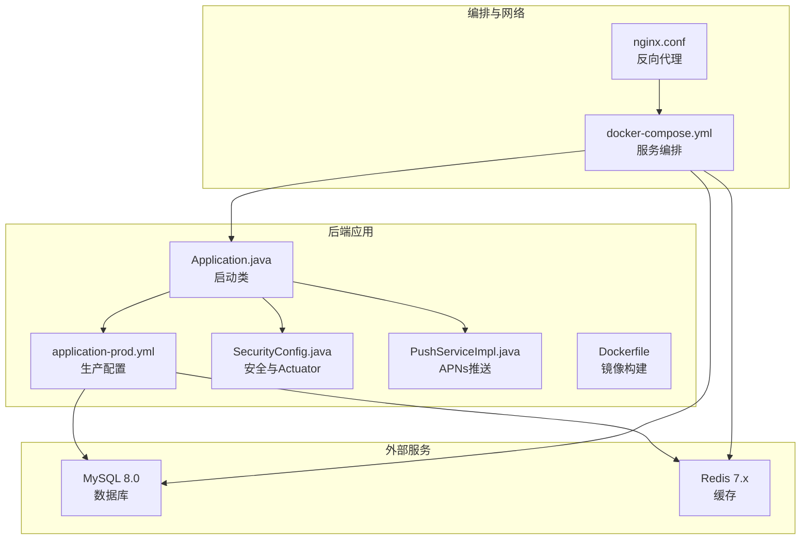
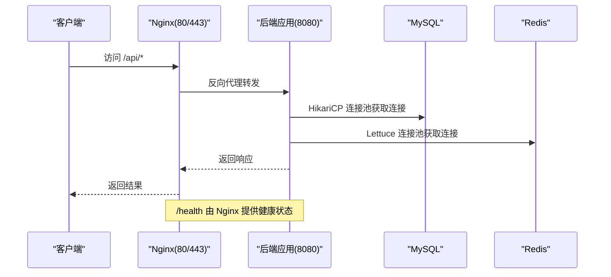
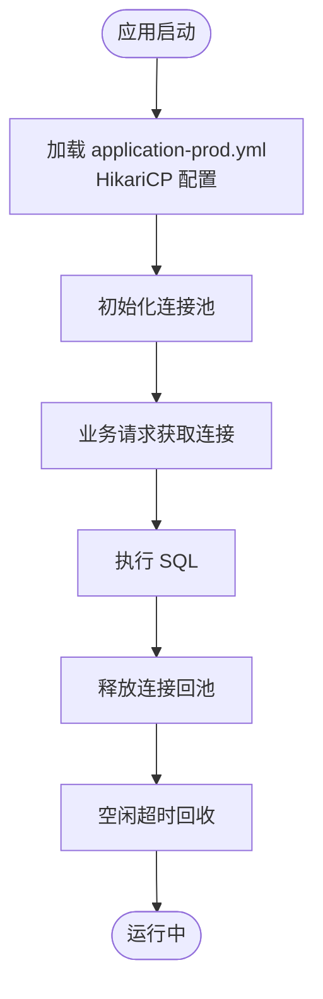
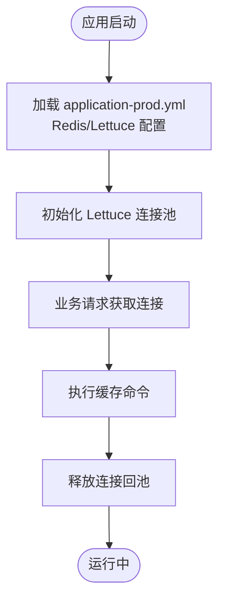
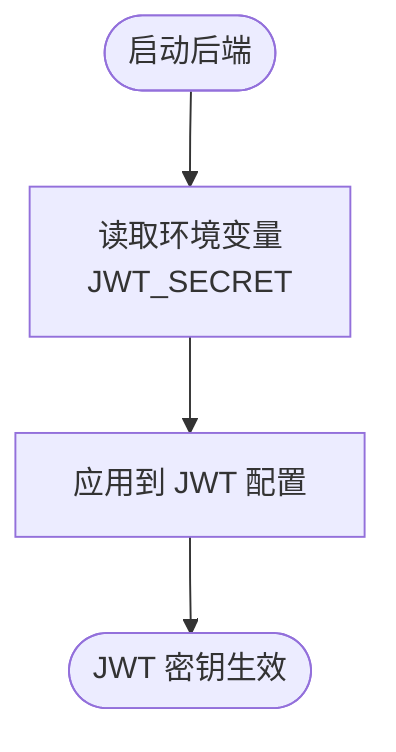
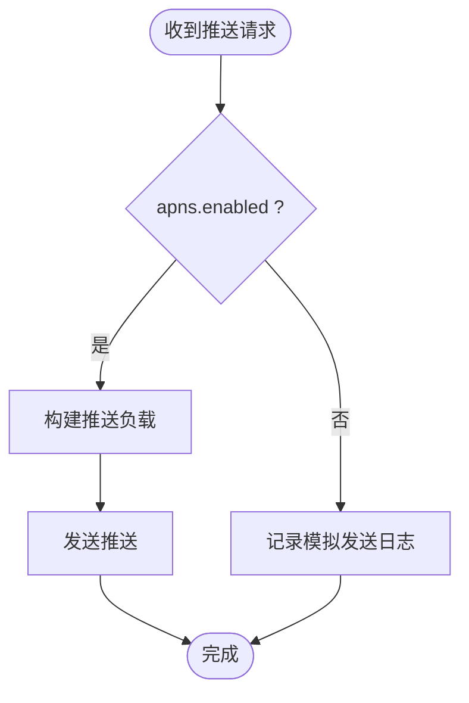
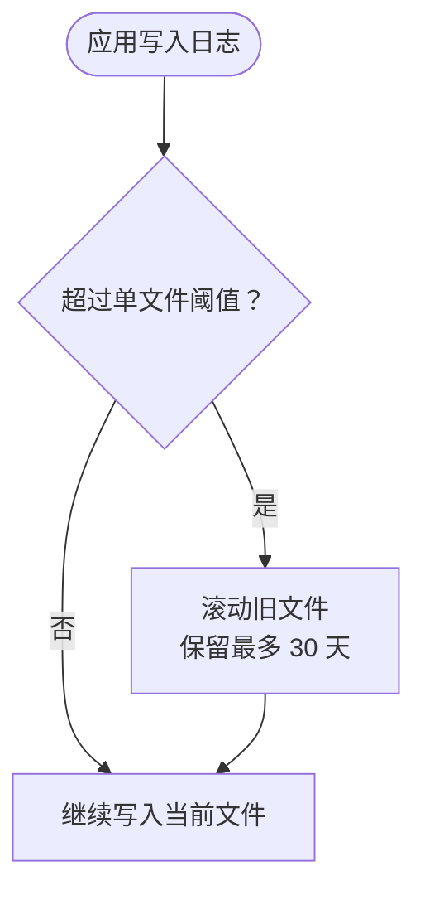
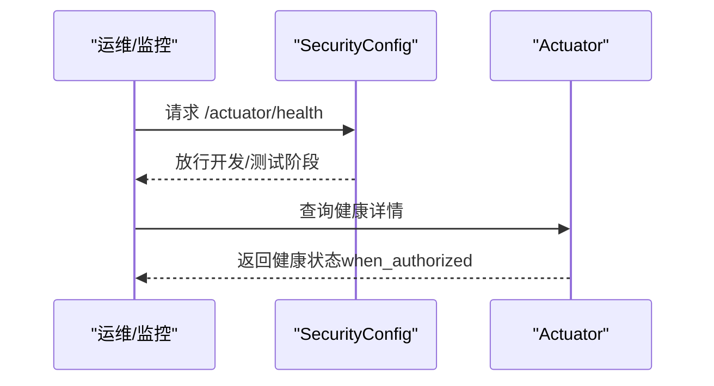
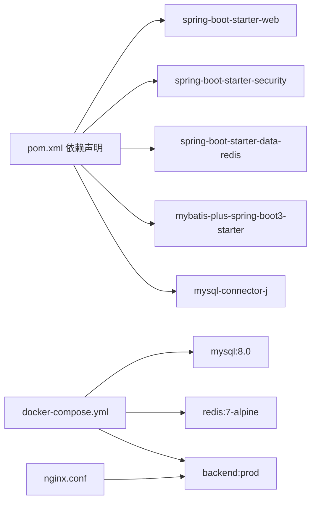

# 生产环境配置

<cite>
**本文引用的文件**
- [application-prod.yml](file://backend/src/main/resources/application-prod.yml)
- [docker-compose.yml](file://docker-compose.yml)
- [Dockerfile](file://backend/Dockerfile)
- [SecurityConfig.java](file://backend/src/main/java/com/baby/config/SecurityConfig.java)
- [PushServiceImpl.java](file://backend/src/main/java/com/baby/service/impl/PushServiceImpl.java)
- [.env.example](file://.env.example)
- [nginx.conf](file://nginx/nginx.conf)
- [Application.java](file://backend/src/main/java/com/baby/Application.java)
- [pom.xml](file://backend/pom.xml)
</cite>

## 目录
1. [简介](#简介)
2. [项目结构](#项目结构)
3. [核心组件](#核心组件)
4. [架构总览](#架构总览)
5. [详细组件分析](#详细组件分析)
6. [依赖关系分析](#依赖关系分析)
7. [性能考量](#性能考量)
8. [故障排查指南](#故障排查指南)
9. [结论](#结论)
10. [附录](#附录)

## 简介
本节面向生产环境部署，系统性说明 babyFeedingReminder 应用在生产中的配置要点，包括：
- 数据库连接池（HikariCP）与缓存连接池（Lettuce）参数
- JWT 密钥通过环境变量注入
- APNs 推送配置开关与证书路径
- 生产日志滚动策略与输出位置
- Actuator 健康检查暴露与安全策略
- 在 docker-compose 中如何为数据库、Redis、APNs 凭据等配置环境变量
- 常见问题：容器网络、服务健康依赖、端口映射冲突
- 性能调优建议：数据库与缓存连接池参数

## 项目结构
生产相关的关键文件与位置如下：
- 后端配置文件：application-prod.yml
- 编排文件：docker-compose.yml
- 容器镜像构建：Dockerfile
- 安全与 Actuator：SecurityConfig.java
- 推送服务：PushServiceImpl.java
- 示例环境变量：.env.example
- 反向代理：nginx.conf
- 启动入口：Application.java
- 依赖声明：pom.xml

图表来源
- [Application.java](file://backend/src/main/java/com/baby/Application.java#L1-L17)
- [application-prod.yml](file://backend/src/main/resources/application-prod.yml#L1-L85)
- [SecurityConfig.java](file://backend/src/main/java/com/baby/config/SecurityConfig.java#L1-L42)
- [PushServiceImpl.java](file://backend/src/main/java/com/baby/service/impl/PushServiceImpl.java#L1-L67)
- [Dockerfile](file://backend/Dockerfile#L1-L37)
- [docker-compose.yml](file://docker-compose.yml#L1-L89)
- [nginx.conf](file://nginx/nginx.conf#L1-L78)

章节来源
- [application-prod.yml](file://backend/src/main/resources/application-prod.yml#L1-L85)
- [docker-compose.yml](file://docker-compose.yml#L1-L89)
- [Dockerfile](file://backend/Dockerfile#L1-L37)
- [SecurityConfig.java](file://backend/src/main/java/com/baby/config/SecurityConfig.java#L1-L42)
- [PushServiceImpl.java](file://backend/src/main/java/com/baby/service/impl/PushServiceImpl.java#L1-L67)
- [nginx.conf](file://nginx/nginx.conf#L1-L78)
- [Application.java](file://backend/src/main/java/com/baby/Application.java#L1-L17)
- [pom.xml](file://backend/pom.xml#L27-L134)

## 核心组件
- 数据库连接池（HikariCP）
  - 最大池大小：20
  - 最小空闲：5
  - 空闲超时：300000 ms
  - 连接超时：20000 ms
- 缓存连接池（Lettuce）
  - 最大活跃：8
  - 最大空闲：8
  - 最小空闲：0
- JWT 密钥
  - 通过环境变量注入，生产默认密钥长度足够且安全
- APNs 推送
  - 开关、生产模式、证书路径与密码、主题
- 日志
  - 输出到 /var/log/baby-feeding/app.log
  - 单文件最大 10MB，保留 30 天历史
- Actuator
  - 暴露 health、info、metrics
  - 健康详情仅授权可见

章节来源
- [application-prod.yml](file://backend/src/main/resources/application-prod.yml#L10-L32)
- [application-prod.yml](file://backend/src/main/resources/application-prod.yml#L45-L57)
- [application-prod.yml](file://backend/src/main/resources/application-prod.yml#L58-L69)
- [application-prod.yml](file://backend/src/main/resources/application-prod.yml#L70-L79)

## 架构总览
生产运行时由 docker-compose 统一编排，后端服务通过环境变量连接 MySQL 与 Redis，并通过 Nginx 提供反向代理。Actuator 暴露健康检查端点，配合 Nginx 的 /health 路由进行统一健康探测。

图表来源
- [docker-compose.yml](file://docker-compose.yml#L1-L89)
- [nginx.conf](file://nginx/nginx.conf#L31-L59)
- [application-prod.yml](file://backend/src/main/resources/application-prod.yml#L10-L32)

章节来源
- [docker-compose.yml](file://docker-compose.yml#L1-L89)
- [nginx.conf](file://nginx/nginx.conf#L31-L59)

## 详细组件分析

### 数据库连接池（HikariCP）
- 参数说明
  - maximum-pool-size：并发连接上限，适合高吞吐场景
  - minimum-idle：保持的最小空闲连接数，降低热身开销
  - idle-timeout：空闲连接回收时间
  - connection-timeout：获取连接的最大等待时间
- 生产建议
  - 结合数据库实例规格与 QPS，逐步调整最大池大小
  - 关注连接泄漏与慢查询，结合监控指标评估 idle-timeout 与 connection-timeout

图表来源
- [application-prod.yml](file://backend/src/main/resources/application-prod.yml#L10-L19)

章节来源
- [application-prod.yml](file://backend/src/main/resources/application-prod.yml#L10-L19)

### 缓存连接池（Lettuce）
- 参数说明
  - max-active：最大活跃连接
  - max-idle：最大空闲连接
  - min-idle：最小空闲连接
- 生产建议
  - 与后端线程模型匹配，避免过度连接导致资源争用
  - 结合缓存命中率与延迟指标动态调优

图表来源
- [application-prod.yml](file://backend/src/main/resources/application-prod.yml#L21-L31)

章节来源
- [application-prod.yml](file://backend/src/main/resources/application-prod.yml#L21-L31)

### JWT 密钥管理（环境变量）
- 配置要点
  - 通过环境变量注入密钥，避免硬编码
  - 生产环境建议使用足够强度的随机密钥
- 配置位置
  - application-prod.yml 中的 jwt.secret
  - docker-compose.yml 中的环境变量覆盖
  - .env.example 提供示例键名

图表来源
- [application-prod.yml](file://backend/src/main/resources/application-prod.yml#L45-L49)
- [docker-compose.yml](file://docker-compose.yml#L12-L19)
- [.env.example](file://.env.example#L1-L13)

章节来源
- [application-prod.yml](file://backend/src/main/resources/application-prod.yml#L45-L49)
- [docker-compose.yml](file://docker-compose.yml#L12-L19)
- [.env.example](file://.env.example#L1-L13)

### APNs 推送配置
- 配置要点
  - apns.enabled：控制是否启用推送
  - apns.production：是否使用生产证书
  - certificate-path/certificate-password：证书路径与密码
  - topic：推送主题
- 当前实现
  - PushServiceImpl 会根据开关决定是否实际发送
  - 未启用时记录模拟发送日志

图表来源
- [application-prod.yml](file://backend/src/main/resources/application-prod.yml#L50-L57)
- [PushServiceImpl.java](file://backend/src/main/java/com/baby/service/impl/PushServiceImpl.java#L1-L67)

章节来源
- [application-prod.yml](file://backend/src/main/resources/application-prod.yml#L50-L57)
- [PushServiceImpl.java](file://backend/src/main/java/com/baby/service/impl/PushServiceImpl.java#L1-L67)

### 生产日志与滚动策略
- 输出位置
  - 文件名：/var/log/baby-feeding/app.log
- 滚动策略
  - 单文件最大 10MB
  - 保留 30 天历史
- 建议
  - 在宿主机挂载该目录以持久化日志
  - 结合集中式日志收集工具（如 Filebeat/Fluent Bit）采集

图表来源
- [application-prod.yml](file://backend/src/main/resources/application-prod.yml#L58-L69)

章节来源
- [application-prod.yml](file://backend/src/main/resources/application-prod.yml#L58-L69)

### Actuator 健康检查与安全
- 暴露端点
  - health、info、metrics
- 详情策略
  - show-details: when_authorized（仅授权访问者可见详细信息）
- 安全策略
  - SecurityConfig 对 /actuator/** 放行，便于监控与运维
  - 建议在生产中限制对 Actuator 的访问范围或通过网关统一鉴权

图表来源
- [application-prod.yml](file://backend/src/main/resources/application-prod.yml#L70-L79)
- [SecurityConfig.java](file://backend/src/main/java/com/baby/config/SecurityConfig.java#L25-L41)

章节来源
- [application-prod.yml](file://backend/src/main/resources/application-prod.yml#L70-L79)
- [SecurityConfig.java](file://backend/src/main/java/com/baby/config/SecurityConfig.java#L25-L41)

### docker-compose 环境变量配置示例
- 数据库 URL、用户名、密码
  - 通过 SPRING_DATASOURCE_URL、SPRING_DATASOURCE_USERNAME、SPRING_DATASOURCE_PASSWORD 注入
  - 在 docker-compose 中使用环境变量覆盖
- Redis 主机、端口
  - 通过 SPRING_DATA_REDIS_HOST、SPRING_DATA_REDIS_PORT 注入
- APNs 凭据
  - 通过 APNS_ENABLED、APNS_PRODUCTION、APNS_CERTIFICATE_PATH、APNS_CERTIFICATE_PASSWORD、APNS_TOPIC 注入
- JWT 密钥
  - 通过 JWT_SECRET 注入

章节来源
- [docker-compose.yml](file://docker-compose.yml#L12-L19)
- [.env.example](file://.env.example#L1-L13)
- [application-prod.yml](file://backend/src/main/resources/application-prod.yml#L45-L57)

## 依赖关系分析
- 后端应用依赖
  - Spring Web、Security、Data Redis、MyBatis Plus、MySQL Connector
- 运行时依赖
  - MySQL 与 Redis 通过 docker-compose 提供
  - Nginx 作为反向代理与健康检查路由

图表来源
- [pom.xml](file://backend/pom.xml#L27-L134)
- [docker-compose.yml](file://docker-compose.yml#L1-L89)
- [nginx.conf](file://nginx/nginx.conf#L24-L59)

章节来源
- [pom.xml](file://backend/pom.xml#L27-L134)
- [docker-compose.yml](file://docker-compose.yml#L1-L89)
- [nginx.conf](file://nginx/nginx.conf#L24-L59)

## 性能考量
- 数据库连接池
  - maximum-pool-size：根据峰值 QPS 与数据库实例能力设定，避免过高导致连接竞争
  - minimum-idle：维持一定空闲连接，减少首次请求冷启动延迟
  - idle-timeout：适中设置，平衡资源占用与连接复用
  - connection-timeout：结合业务超时策略，避免阻塞排队
- 缓存连接池
  - max-active 与 max-idle：与后端并发模型匹配，避免过度连接
  - min-idle：保证热连接可用性
- JVM 与容器
  - Dockerfile 中设置了基础 GC 与内存参数，可根据实际负载进一步微调
- 反向代理
  - Nginx 的 keepalive 与超时参数有助于提升上游连接复用与稳定性

章节来源
- [application-prod.yml](file://backend/src/main/resources/application-prod.yml#L10-L31)
- [Dockerfile](file://backend/Dockerfile#L30-L37)
- [nginx.conf](file://nginx/nginx.conf#L24-L59)

## 故障排查指南
- 容器网络
  - 所有服务加入 baby-network，确保 backend、mysql、redis、nginx 能互相解析
- 健康检查依赖
  - backend 的 depends_on 使用 mysql: service_healthy 与 redis: service_started，确保数据库就绪后再启动后端
- 端口映射冲突
  - mysql 映射到 3307，避免与本地已有 MySQL 冲突；redis 映射到 6379；后端映射到 8080
- Actuator 与 Nginx
  - /actuator/** 已放行，但生产建议限制访问范围
  - Nginx 提供 /health 路由返回健康状态，便于外部探针
- 日志
  - 确保 /var/log/baby-feeding 目录存在且可写，或通过卷挂载持久化

章节来源
- [docker-compose.yml](file://docker-compose.yml#L19-L26)
- [docker-compose.yml](file://docker-compose.yml#L32-L39)
- [docker-compose.yml](file://docker-compose.yml#L56-L60)
- [docker-compose.yml](file://docker-compose.yml#L10-L11)
- [SecurityConfig.java](file://backend/src/main/java/com/baby/config/SecurityConfig.java#L25-L41)
- [nginx.conf](file://nginx/nginx.conf#L53-L58)
- [application-prod.yml](file://backend/src/main/resources/application-prod.yml#L58-L69)

## 结论
生产环境配置围绕“连接池稳健、凭据安全、可观测可治理”展开。通过 HikariCP 与 Lettuce 的合理参数、环境变量注入的敏感信息、严格的日志滚动策略以及 Actuator 的受控暴露，可在保证性能的同时提升系统的可维护性与安全性。结合 docker-compose 的网络与健康检查机制，可实现稳定可靠的生产部署。

## 附录
- 启动入口与运行
  - Application.java 为启动类，配合 Spring Boot Profile prod 运行
- 反向代理
  - nginx.conf 提供 /api 转发与 /health 健康检查路由，生产可启用 HTTPS 并限制来源

章节来源
- [Application.java](file://backend/src/main/java/com/baby/Application.java#L1-L17)
- [nginx.conf](file://nginx/nginx.conf#L31-L59)